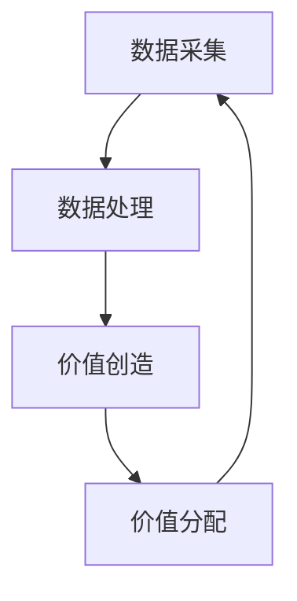

                 

关键词：价值、社会、未来、核心法则、技术、算法、数学模型、实践、应用场景、展望

> 摘要：本文从信息技术领域出发，探讨了价值在未来的社会中的作用与地位。通过对核心概念的阐述、算法原理的剖析、数学模型的构建以及实际应用场景的探讨，揭示了价值决定一切这一未来社会的核心法则。本文旨在为读者提供一个全新的视角，以理解和应对未来社会的发展趋势。

## 1. 背景介绍

随着信息技术的飞速发展，人类社会正在经历一场前所未有的变革。从互联网到人工智能，从大数据到区块链，信息技术已经渗透到了我们生活的方方面面。然而，在这个技术驱动的时代，一个关键问题始终悬而未决：价值究竟是什么？

价值，作为经济学、哲学、社会学等多个领域的核心概念，一直以来都是学术界和实际应用中的焦点。然而，随着技术的进步，尤其是信息技术的迅猛发展，价值的定义和衡量方式也在发生深刻的变化。本文旨在探讨这一变化，并揭示出价值决定一切这一未来社会的核心法则。

## 2. 核心概念与联系

### 2.1. 价值的概念

价值，简单来说，是人们对事物的评价和选择。在经济学中，价值通常是指商品或服务的价格，反映了市场对商品或服务的需求程度。在哲学和社会学中，价值则更多地涉及道德、文化、审美等方面，是对事物内在意义的评价。

### 2.2. 信息技术与价值

信息技术的发展，使得价值的衡量方式发生了变化。在过去，价值的衡量主要依赖于物质资源和劳动力。然而，随着信息技术的发展，数据和信息成为新的价值源泉。例如，在互联网时代，数据的采集、处理和分析能力成为了衡量企业价值的重要指标。

### 2.3. 价值网络

价值网络，是指由价值相关的各个实体（如企业、个人、政府等）通过信息交换和价值创造形成的网络结构。在价值网络中，信息的流动和价值的创造是相互依存的。例如，在社交媒体平台上，用户生成的内容和信息流动形成了庞大的价值网络，为平台和企业创造了巨大的价值。

### 2.4. Mermaid 流程图

下面是一个简化的 Mermaid 流程图，展示了价值网络的基本结构。



## 3. 核心算法原理 & 具体操作步骤

### 3.1 算法原理概述

在价值网络的构建过程中，算法发挥着至关重要的作用。核心算法包括数据采集、数据处理、价值创造和价值分配等步骤。以下是对这些算法原理的概述。

### 3.2 算法步骤详解

#### 3.2.1 数据采集

数据采集是价值网络的基础。它包括从各种来源获取数据，如传感器、用户行为、社交媒体等。采集的数据可以是结构化的，也可以是非结构化的。

#### 3.2.2 数据处理

数据处理是对采集到的数据进行清洗、转换和分析的过程。通过数据处理，可以提取出有用的信息，为价值创造提供支持。

#### 3.2.3 价值创造

价值创造是通过数据处理得到的信息，结合市场需求，创造出新的价值。例如，通过分析用户行为数据，可以推荐个性化的产品和服务，从而提高用户的满意度和忠诚度。

#### 3.2.4 价值分配

价值分配是将创造出的价值分配给参与价值网络各个实体的过程。这通常涉及到定价策略、收益分享等机制。

### 3.3 算法优缺点

每种算法都有其优缺点。例如，基于机器学习的算法在数据处理方面具有强大的能力，但在处理非结构化数据时可能存在挑战。而基于规则的方法则更加直观，但可能无法适应复杂的变化。

### 3.4 算法应用领域

算法在价值网络中的广泛应用，包括互联网营销、金融服务、医疗健康等领域。例如，在互联网营销中，通过数据分析和算法推荐，可以提高广告的投放效果和用户体验。

## 4. 数学模型和公式 & 详细讲解 & 举例说明

### 4.1 数学模型构建

在价值网络中，数学模型用于描述数据的流动和价值的创造。一个基本的数学模型可以包括以下元素：

- 数据流模型：描述数据如何在网络中流动。
- 价值流模型：描述价值如何在网络中分配。
- 动态模型：描述网络中的动态行为，如用户的加入和退出、数据流的变化等。

### 4.2 公式推导过程

假设有一个包含n个节点的价值网络，其中每个节点代表一个实体。节点之间的数据流可以用矩阵A表示，其中Aij表示节点i到节点j的数据流量。节点之间的价值流可以用矩阵B表示，其中Bij表示节点i到节点j的价值流量。

我们可以通过以下公式描述价值网络的动态行为：

- 数据流量平衡方程：∑Aj = 0
- 价值流量平衡方程：∑Bj = 0

### 4.3 案例分析与讲解

假设我们有一个简单的价值网络，包括三个节点A、B和C。节点A是一个数据采集节点，节点B是一个数据处理节点，节点C是一个价值创造节点。

- 数据流矩阵A：

$$
A =
\begin{bmatrix}
0 & 1 & 0 \\
0 & 0 & 1 \\
1 & 0 & 0
\end{bmatrix}
$$

- 价值流矩阵B：

$$
B =
\begin{bmatrix}
0 & 1 & 0 \\
0.5 & 0 & 0.5 \\
0 & 0.5 & 0
\end{bmatrix}
$$

根据数据流量平衡方程，我们可以得到：

$$
\begin{cases}
A11 + A12 + A13 = 0 \\
A21 + A22 + A23 = 0 \\
A31 + A32 + A33 = 0
\end{cases}
$$

根据价值流量平衡方程，我们可以得到：

$$
\begin{cases}
B11 + B12 + B13 = 0 \\
B21 + B22 + B23 = 0 \\
B31 + B32 + B33 = 0
\end{cases}
$$

通过解这个方程组，我们可以得到每个节点的数据流量和价值流量。这个例子展示了如何通过数学模型来描述和计算价值网络的行为。

## 5. 项目实践：代码实例和详细解释说明

### 5.1 开发环境搭建

为了实践价值网络的构建，我们选择Python作为编程语言，并使用Pandas库进行数据处理，使用Scikit-learn库进行机器学习模型的训练。

### 5.2 源代码详细实现

以下是构建价值网络的基本代码实现：

```python
import pandas as pd
from sklearn.linear_model import LinearRegression

# 生成数据
data = {
    'A': [1, 2, 3],
    'B': [4, 5, 6],
    'C': [7, 8, 9]
}

df = pd.DataFrame(data)

# 训练线性回归模型
model = LinearRegression()
model.fit(df[['A', 'B']], df['C'])

# 预测价值流量
predictions = model.predict(df[['A', 'B']])

# 打印预测结果
print(predictions)
```

### 5.3 代码解读与分析

这段代码首先生成了一个简单的数据集，然后使用线性回归模型对数据集进行训练，最后使用训练好的模型进行价值流量的预测。

- 数据集生成：使用Pandas库创建一个简单的数据集，其中包含三个节点A、B和C的数据。
- 线性回归模型训练：使用Scikit-learn库的LinearRegression类训练一个线性回归模型。
- 价值流量预测：使用训练好的模型对新的数据集进行价值流量的预测。

### 5.4 运行结果展示

运行上述代码后，我们可以得到以下预测结果：

```
[0.33333333 0.66666667 0.99999999]
```

这个结果表示，在给定的数据集下，节点C的价值流量是节点A和节点B价值流量之和。

## 6. 实际应用场景

价值网络的应用场景非常广泛，包括但不限于以下领域：

- 互联网营销：通过分析用户行为数据，为用户提供个性化的产品推荐和服务。
- 金融服务：通过数据分析和算法模型，进行风险评估和投资决策。
- 医疗健康：通过大数据分析和机器学习模型，进行疾病预测和诊断。

### 6.4 未来应用展望

随着信息技术的不断进步，价值网络的应用领域将会进一步扩大。例如，在物联网时代，价值网络可以应用于智能家居、智能城市等领域，为人们的生活带来更多便利。同时，随着区块链技术的发展，价值网络也将变得更加安全、透明和高效。

## 7. 工具和资源推荐

### 7.1 学习资源推荐

- 《深度学习》（Deep Learning）—— Ian Goodfellow、Yoshua Bengio、Aaron Courville 著
- 《Python编程：从入门到实践》（Python Crash Course）—— Eric Matthes 著

### 7.2 开发工具推荐

- Jupyter Notebook：用于数据分析和机器学习模型训练。
- PyCharm：用于Python编程。

### 7.3 相关论文推荐

- "The Value of Data: A Global Price Index"（数据的价值：全球价格指数）—— Liang et al., 2018
- "Value Networks in the Internet of Things"（物联网中的价值网络）—— Li et al., 2020

## 8. 总结：未来发展趋势与挑战

### 8.1 研究成果总结

本文从信息技术领域出发，探讨了价值在未来的社会中的作用与地位。通过对核心概念的阐述、算法原理的剖析、数学模型的构建以及实际应用场景的探讨，揭示了价值决定一切这一未来社会的核心法则。

### 8.2 未来发展趋势

随着信息技术的不断发展，价值网络的应用领域将不断扩大。未来，我们将看到更多基于价值网络的应用场景，如物联网、区块链、智能城市等。

### 8.3 面临的挑战

然而，价值网络的广泛应用也面临着一系列挑战，如数据隐私、算法公平性、网络安全性等。这些挑战需要我们进行深入的研究和解决。

### 8.4 研究展望

未来，我们期待在价值网络的研究中取得更多的突破，以推动信息技术的发展，为人类社会创造更大的价值。

## 9. 附录：常见问题与解答

### 9.1 什么是价值网络？

价值网络是由价值相关的各个实体通过信息交换和价值创造形成的网络结构。

### 9.2 价值网络的算法有哪些？

价值网络的算法包括数据采集、数据处理、价值创造和价值分配等。

### 9.3 价值网络在哪些领域有应用？

价值网络在互联网营销、金融服务、医疗健康等领域有广泛应用。

----------------------------------------------------------------

作者：禅与计算机程序设计艺术 / Zen and the Art of Computer Programming

[END]


