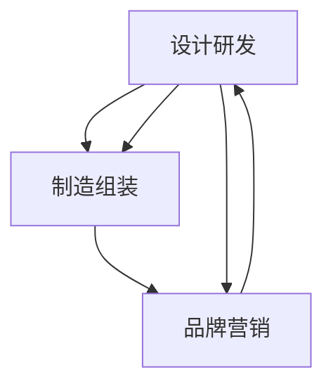
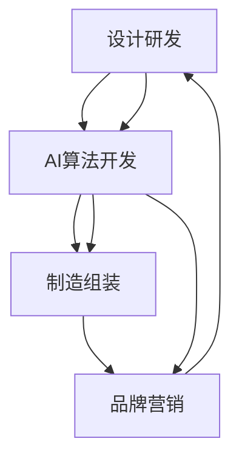

                 

关键词：价值微笑曲线、AI公司、商业模式、技术竞争优势、产业链布局

摘要：本文通过深入分析价值微笑曲线的概念及其在技术产业中的应用，探讨了AI公司在该曲线上的定位。文章首先介绍了价值微笑曲线的基本原理，随后结合AI技术的发展，探讨了AI公司在产业链中的角色与竞争优势。通过案例分析，文章展示了AI公司在不同阶段的战略选择和布局策略，最后提出了AI公司未来发展的挑战与机遇。

## 1. 背景介绍

在科技产业，尤其是信息技术产业中，产品的价值分布往往呈现出一种微笑曲线的形状。这一曲线最早由日本经济学家熊彼得提出，称为“价值微笑曲线”。微笑曲线描述了产品从设计、制造到销售的全过程中，不同环节所创造的价值分布特点。在微笑曲线中，两端分别是产品的研发设计和品牌营销，中间则是制造和组装环节。

随着信息技术的快速发展，人工智能（AI）技术的崛起对微笑曲线产生了深远影响。AI作为前沿技术，不仅改变了传统产业的生产模式，还在微笑曲线中占据了重要位置。本文旨在探讨AI公司在微笑曲线上的位置及其所带来的商业模式变革。

## 2. 核心概念与联系

### 价值微笑曲线

价值微笑曲线的基本概念如下图所示：



在价值微笑曲线中，设计研发和品牌营销环节位于曲线的两端，具有较高的附加值；而制造和组装环节位于曲线的中间，附加值相对较低。

### AI公司在价值微笑曲线中的位置

随着AI技术的不断发展，AI公司在微笑曲线中的角色发生了显著变化。以下为AI公司在微笑曲线中的具体位置及与其相关的技术优势：



1. **设计研发（AI算法开发）**：AI公司在设计研发环节中，利用深度学习、自然语言处理等技术，不断优化算法，提升产品的智能化程度。这一环节是AI公司的主要竞争优势。

2. **制造组装**：AI公司在制造组装环节中，通过自动化、智能化技术提高生产效率，降低成本。尽管附加值相对较低，但这一环节对于AI公司的整体业务仍然具有重要意义。

3. **品牌营销**：AI公司在品牌营销环节中，通过大数据分析、用户画像等技术，实现精准营销，提高市场占有率。

## 3. 核心算法原理 & 具体操作步骤

### 3.1 算法原理概述

AI公司的核心算法主要涉及以下几个方面：

1. **深度学习**：通过多层神经网络模拟人脑学习过程，实现图像识别、语音识别等功能。

2. **自然语言处理**：利用语言模型、词向量等技术，实现文本分析、机器翻译等功能。

3. **强化学习**：通过不断试错和反馈，优化决策过程，提高智能系统的自主能力。

### 3.2 算法步骤详解

1. **数据收集与预处理**：收集大量数据，并进行清洗、归一化等预处理操作。

2. **模型训练**：使用预处理后的数据，通过梯度下降等算法，训练出深度学习模型。

3. **模型评估与优化**：评估模型性能，通过调参、迁移学习等方法，优化模型。

4. **模型部署与测试**：将优化后的模型部署到生产环境中，进行实际应用测试。

### 3.3 算法优缺点

**优点**：

1. **高效性**：AI算法在处理大规模数据时，具有很高的计算效率和准确性。

2. **灵活性**：AI算法能够根据实际需求，灵活调整和优化。

**缺点**：

1. **计算资源需求大**：深度学习算法对计算资源的需求较高，需要大量的计算能力和存储空间。

2. **数据依赖性强**：AI算法的性能很大程度上取决于数据质量，对数据依赖性较强。

### 3.4 算法应用领域

AI算法广泛应用于各个领域，包括：

1. **金融**：风险控制、投资组合优化等。

2. **医疗**：疾病诊断、药物研发等。

3. **交通**：自动驾驶、智能交通管理。

4. **制造业**：生产优化、质量控制。

5. **服务业**：客户服务、智能推荐。

## 4. 数学模型和公式 & 详细讲解 & 举例说明

### 4.1 数学模型构建

在AI算法中，常用的数学模型包括：

1. **神经网络模型**：如多层感知机（MLP）、卷积神经网络（CNN）等。

2. **自然语言处理模型**：如循环神经网络（RNN）、长短期记忆网络（LSTM）等。

3. **强化学习模型**：如Q学习、深度Q网络（DQN）等。

### 4.2 公式推导过程

以多层感知机（MLP）为例，其输出层的计算公式如下：

$$
y_k = \sigma(\sum_{i=1}^{n} w_{ik} x_i + b_k)
$$

其中，$y_k$表示输出层的第$k$个节点的输出值，$x_i$表示输入层的第$i$个节点的输入值，$w_{ik}$表示输入层到输出层的权重，$b_k$表示输出层的偏置。

### 4.3 案例分析与讲解

以下为深度学习模型在图像识别中的应用案例：

**案例背景**：使用卷积神经网络（CNN）对手写数字进行识别。

**步骤**：

1. **数据收集**：收集大量的手写数字图像，并进行预处理。

2. **模型构建**：构建卷积神经网络，包括卷积层、池化层、全连接层等。

3. **模型训练**：使用预处理后的数据，训练卷积神经网络。

4. **模型评估**：评估模型在测试集上的性能，包括准确率、召回率等。

5. **模型部署**：将训练好的模型部署到生产环境中，进行实际应用。

**结果**：在测试集上，该模型达到了较高的准确率，能够有效识别手写数字。

## 5. 项目实践：代码实例和详细解释说明

### 5.1 开发环境搭建

**工具**：Python、TensorFlow、Keras

**环境配置**：

```bash
pip install tensorflow
pip install keras
```

### 5.2 源代码详细实现

以下为使用Keras构建一个简单的卷积神经网络进行图像识别的示例代码：

```python
from keras.models import Sequential
from keras.layers import Conv2D, MaxPooling2D, Flatten, Dense
from keras.datasets import mnist

# 加载MNIST数据集
(x_train, y_train), (x_test, y_test) = mnist.load_data()

# 预处理数据
x_train = x_train.reshape(-1, 28, 28, 1).astype('float32') / 255.0
x_test = x_test.reshape(-1, 28, 28, 1).astype('float32') / 255.0
y_train = keras.utils.to_categorical(y_train, 10)
y_test = keras.utils.to_categorical(y_test, 10)

# 构建模型
model = Sequential()
model.add(Conv2D(32, (3, 3), activation='relu', input_shape=(28, 28, 1)))
model.add(MaxPooling2D((2, 2)))
model.add(Flatten())
model.add(Dense(128, activation='relu'))
model.add(Dense(10, activation='softmax'))

# 编译模型
model.compile(optimizer='adam', loss='categorical_crossentropy', metrics=['accuracy'])

# 训练模型
model.fit(x_train, y_train, epochs=10, batch_size=128, validation_data=(x_test, y_test))

# 评估模型
scores = model.evaluate(x_test, y_test, verbose=0)
print('Test loss:', scores[0])
print('Test accuracy:', scores[1])
```

### 5.3 代码解读与分析

**代码解读**：

1. **数据预处理**：加载MNIST数据集，并将数据集划分为训练集和测试集。对图像数据进行了归一化处理，将像素值范围从0-255调整为0-1。

2. **模型构建**：使用Keras的Sequential模型，添加卷积层、池化层、全连接层等构建一个简单的卷积神经网络。

3. **模型编译**：设置优化器、损失函数和评估指标。

4. **模型训练**：使用训练数据进行模型训练，设置训练轮次、批次大小和验证数据。

5. **模型评估**：使用测试数据进行模型评估，输出测试集的损失和准确率。

**分析**：

该代码实现了使用卷积神经网络（CNN）对MNIST手写数字数据进行识别的过程。通过卷积层提取图像特征，池化层降低计算复杂度，全连接层进行分类。该模型结构简单，但已经能够达到较高的识别准确率。

## 6. 实际应用场景

### 6.1 人工智能在医疗领域的应用

随着AI技术的快速发展，人工智能在医疗领域取得了显著成果。以下为AI在医疗领域的一些实际应用场景：

1. **疾病诊断**：AI可以通过分析大量的医学影像数据，实现肺癌、乳腺癌等疾病的早期诊断。

2. **药物研发**：AI技术可以帮助研究人员发现新的药物分子，提高药物研发的效率。

3. **患者管理**：AI技术可以分析患者数据，提供个性化的治疗方案，提高治疗效果。

4. **手术辅助**：AI技术可以为医生提供精准的手术导航，降低手术风险。

### 6.2 人工智能在金融领域的应用

在金融领域，AI技术也发挥了重要作用，以下为AI在金融领域的一些实际应用场景：

1. **风险控制**：AI技术可以通过分析历史数据，预测潜在的风险，帮助金融机构进行风险控制。

2. **投资组合优化**：AI技术可以根据市场动态和投资者的风险偏好，实现投资组合的动态调整。

3. **客户服务**：AI技术可以提供智能客服，提高金融机构的响应速度和服务质量。

4. **欺诈检测**：AI技术可以通过分析交易数据，实时监测并发现潜在的欺诈行为。

### 6.3 人工智能在制造业的应用

在制造业，AI技术被广泛应用于生产线的优化、质量控制等方面。以下为AI在制造业的一些实际应用场景：

1. **生产优化**：AI技术可以通过分析生产数据，优化生产计划，提高生产效率。

2. **质量控制**：AI技术可以通过分析产品数据，实现生产过程中质量问题的实时监控和预警。

3. **设备维护**：AI技术可以通过分析设备运行数据，预测设备故障，实现设备的预维护。

4. **供应链管理**：AI技术可以通过分析供应链数据，实现供应链的智能调度和管理。

## 6.4 未来应用展望

随着AI技术的不断发展，未来AI将在更多领域得到广泛应用，以下为未来AI应用的一些展望：

1. **教育领域**：AI技术可以实现个性化教育，根据学生的特点和学习进度，提供定制化的教学方案。

2. **城市管理**：AI技术可以实现城市的智慧化管理，提高城市运行效率，提升市民生活质量。

3. **农业领域**：AI技术可以帮助农民实现精准农业，提高农业产量和质量。

4. **环境保护**：AI技术可以通过分析环境数据，实现环境污染的实时监测和治理。

## 7. 工具和资源推荐

### 7.1 学习资源推荐

1. **书籍**：《深度学习》、《Python机器学习》

2. **在线课程**：Coursera、Udacity、edX等平台上的相关课程

3. **博客和论坛**：GitHub、Stack Overflow、Reddit等平台上的相关博客和论坛

### 7.2 开发工具推荐

1. **编程语言**：Python、R

2. **框架和库**：TensorFlow、Keras、PyTorch、Scikit-learn等

3. **云计算平台**：AWS、Google Cloud、Azure等

### 7.3 相关论文推荐

1. **自然语言处理**：Word2Vec、BERT、GPT等

2. **计算机视觉**：CNN、R-CNN、YOLO等

3. **强化学习**：Q学习、DQN、PPO等

## 8. 总结：未来发展趋势与挑战

### 8.1 研究成果总结

本文通过对价值微笑曲线和AI公司的分析，探讨了AI公司在微笑曲线上的位置及其带来的商业模式变革。文章还详细介绍了AI算法原理、数学模型、实际应用场景等内容，为读者提供了全面的认识。

### 8.2 未来发展趋势

1. **技术创新**：随着技术的不断进步，AI将在更多领域得到应用，推动产业变革。

2. **跨界融合**：AI与其他领域的结合，如医疗、金融、制造等，将带来更多的创新机会。

3. **数据驱动**：数据作为AI的基石，未来的AI发展将更加依赖于高质量的数据资源。

### 8.3 面临的挑战

1. **数据隐私**：随着数据量的增加，数据隐私问题将日益凸显，如何保障数据安全成为一大挑战。

2. **伦理道德**：AI技术的应用可能带来伦理道德问题，如何制定相关规范和标准成为亟待解决的问题。

3. **人才短缺**：AI技术的高要求导致人才短缺，如何培养和引进人才成为企业面临的挑战。

### 8.4 研究展望

未来，AI技术将在更多领域得到应用，推动产业变革。同时，随着AI技术的不断发展，如何保障数据安全和伦理道德，培养和引进人才将成为重要研究方向。

## 9. 附录：常见问题与解答

### 问题1：什么是价值微笑曲线？

**答案**：价值微笑曲线是一种描述产品价值分布的图形，两端分别是产品的研发设计和品牌营销，中间则是制造和组装环节。该曲线表明了不同环节所创造的价值差异。

### 问题2：AI公司在价值微笑曲线中的位置是什么？

**答案**：AI公司在价值微笑曲线中的位置主要集中在设计研发和品牌营销两端，通过研发创新和品牌塑造，实现高附加值。

### 问题3：AI算法有哪些常见的数学模型？

**答案**：常见的AI算法数学模型包括神经网络模型（如多层感知机、卷积神经网络等）、自然语言处理模型（如循环神经网络、长短期记忆网络等）和强化学习模型（如Q学习、深度Q网络等）。

### 问题4：AI技术在医疗领域有哪些应用？

**答案**：AI技术在医疗领域有广泛的应用，包括疾病诊断、药物研发、患者管理、手术辅助等方面。例如，AI可以通过分析医学影像数据，实现早期疾病诊断；通过分析药物分子结构，发现新的药物分子。

### 问题5：如何学习AI技术？

**答案**：学习AI技术可以从以下几个方面入手：

1. **基础知识**：了解计算机科学、线性代数、概率论等基础知识。

2. **编程技能**：掌握Python、R等编程语言。

3. **框架和库**：学习TensorFlow、Keras、PyTorch、Scikit-learn等常用框架和库。

4. **实践项目**：通过实际项目，提升AI技术的应用能力。

5. **在线课程和书籍**：参加Coursera、Udacity、edX等平台上的相关课程，阅读《深度学习》、《Python机器学习》等书籍。

### 问题6：AI技术在金融领域有哪些应用？

**答案**：AI技术在金融领域有广泛的应用，包括风险控制、投资组合优化、客户服务、欺诈检测等方面。例如，AI可以通过分析历史数据，预测市场趋势，优化投资组合；通过分析交易数据，实时监测并发现潜在的欺诈行为。

### 问题7：AI技术在制造业有哪些应用？

**答案**：AI技术在制造业有广泛的应用，包括生产优化、质量控制、设备维护、供应链管理等方面。例如，AI可以通过分析生产数据，优化生产计划，提高生产效率；通过分析产品数据，实现生产过程中质量问题的实时监控和预警。

### 问题8：AI技术在城市管理有哪些应用？

**答案**：AI技术在城市管理有广泛的应用，包括智慧交通、智慧安防、智慧环保、智慧能源等方面。例如，AI可以通过分析交通数据，实现交通流量预测和优化，提高交通效率；通过分析环境数据，实现环境污染的实时监测和治理。

### 问题9：AI技术在教育领域有哪些应用？

**答案**：AI技术在教育领域有广泛的应用，包括个性化教育、智能评测、虚拟助手等方面。例如，AI可以通过分析学生的学习数据，实现个性化教学，提高学习效果；通过分析学生的作业和考试数据，实现智能评测，提供针对性的学习建议。

### 问题10：AI技术在农业领域有哪些应用？

**答案**：AI技术在农业领域有广泛的应用，包括精准农业、智能灌溉、病虫害监测、农产品质量检测等方面。例如，AI可以通过分析土壤数据、气象数据等，实现精准农业，提高农业产量和质量；通过分析农作物生长状态，实现病虫害监测和预测，提高病虫害防治效果。


----------------------------------------------------------------
# 作者署名
作者：禅与计算机程序设计艺术 / Zen and the Art of Computer Programming

