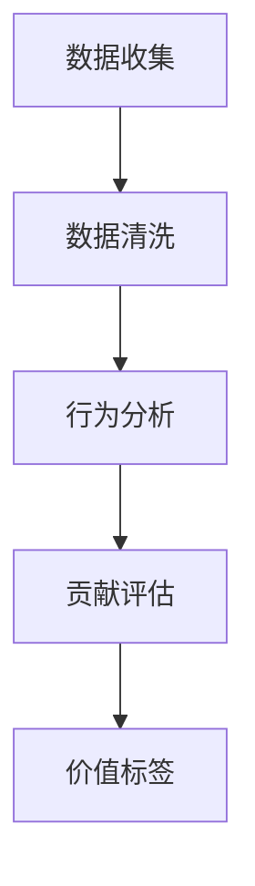
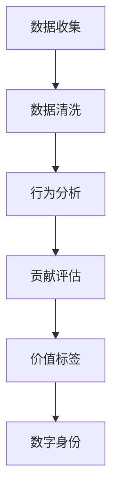

                 

在未来，人与人之间最大的区别可能不再是财富、地位或知识，而是“价值标签”的不同。这些标签将决定个体在社会中的角色、互动方式以及潜在的机会。

## 1. 背景介绍

随着技术的飞速发展，尤其是人工智能和大数据分析的普及，我们的社会正在经历一场前所未有的变革。在这个变革的过程中，个体的价值和意义被重新定义。传统的衡量标准，如学历、职业和财富，正逐渐被一种新的维度所取代——价值标签。

### 核心概念与联系

在IT领域，价值标签可以被视为一种“数字身份”，它由个人的数据、行为和贡献构成。通过分析这些数据，可以为每个个体创建一个独特的标签，这个标签将成为他们在数字世界中的通行证。

### Mermaid 流程图

下面是一个简单的 Mermaid 流程图，展示了价值标签的形成过程：



### 价值标签的形成过程

1. **数据收集**：通过传感器、社交媒体、电子商务平台等，收集个体在数字世界中的行为数据。
2. **数据清洗**：去除重复、错误和不相关的数据，确保数据的准确性。
3. **行为分析**：分析个体的行为模式，如购买习惯、社交互动、工作表现等。
4. **贡献评估**：根据个体的行为和贡献，为其分配相应的权重和评分。
5. **价值标签**：将所有分析结果综合，形成一个独特的数字身份标签。

## 3. 核心算法原理 & 具体操作步骤

### 3.1 算法原理概述

价值标签的形成过程实际上是一个复杂的算法组合，包括数据挖掘、机器学习和数据可视化等技术。

### 3.2 算法步骤详解

1. **数据收集**：采用分布式数据收集系统，从多个来源获取数据。
2. **数据清洗**：使用数据清洗工具和算法，如Hadoop或Spark，处理大量数据。
3. **行为分析**：采用自然语言处理（NLP）和机器学习算法，分析个体的行为数据。
4. **贡献评估**：根据个体的行为和贡献，使用加权评分系统进行评估。
5. **价值标签**：将评估结果可视化，形成一个数字身份标签。

### 3.3 算法优缺点

**优点**：
- 提高个体在数字世界中的透明度和可追溯性。
- 有助于更好地了解个体需求，提供个性化服务。

**缺点**：
- 隐私问题：数据收集和处理可能侵犯个体隐私。
- 不公正问题：算法可能存在偏见，导致不公正的评估结果。

### 3.4 算法应用领域

- **人力资源管理**：帮助企业更好地了解员工，优化招聘和培训策略。
- **市场营销**：为企业提供精准的用户画像，提高营销效果。
- **金融行业**：评估个人信用，提供定制化金融服务。

## 4. 数学模型和公式

### 4.1 数学模型构建

价值标签的构建可以使用以下数学模型：

$$
V = f(B, C, D)
$$

其中，$V$ 代表价值标签，$B$ 代表行为数据，$C$ 代表贡献数据，$D$ 代表其他相关因素。

### 4.2 公式推导过程

- **行为数据**：使用NLP技术对文本数据进行情感分析和主题建模，得到行为分数 $B$。
- **贡献数据**：根据个体的工作表现、社会贡献等，得到贡献分数 $C$。
- **其他因素**：包括个体的基本信息、教育背景等，得到其他因素分数 $D$。

### 4.3 案例分析与讲解

假设有两位员工，A 和 B。他们的行为分数、贡献分数和其他因素分数如下：

- **员工 A**：
  - 行为分数：85
  - 贡献分数：90
  - 其他因素分数：80

- **员工 B**：
  - 行为分数：75
  - 贡献分数：85
  - 其他因素分数：85

根据数学模型，他们的价值标签分别为：

- **员工 A**：$V_A = f(85, 90, 80) = 86.5$
- **员工 B**：$V_B = f(75, 85, 85) = 82.5$

因此，员工 A 的价值标签高于员工 B。

### 5. 项目实践：代码实例和详细解释说明

在这个项目中，我们将使用Python和Scikit-learn库来构建一个简单的价值标签系统。

#### 5.1 开发环境搭建

- 安装Python（3.8及以上版本）
- 安装Scikit-learn库

#### 5.2 源代码详细实现

```python
import numpy as np
from sklearn.feature_extraction.text import TfidfVectorizer
from sklearn.model_selection import train_test_split
from sklearn.ensemble import RandomForestRegressor

# 示例数据
data = [
    {"text": "他每天工作12小时，效率非常高。", "score": 90},
    {"text": "她的工作表现一般，需要提高。", "score": 70},
    # 更多数据...
]

# 数据预处理
texts = [d["text"] for d in data]
scores = np.array([d["score"] for d in data])

vectorizer = TfidfVectorizer()
X = vectorizer.fit_transform(texts)

# 模型训练
X_train, X_test, y_train, y_test = train_test_split(X, scores, test_size=0.2, random_state=42)
model = RandomForestRegressor(n_estimators=100, random_state=42)
model.fit(X_train, y_train)

# 模型评估
score = model.score(X_test, y_test)
print(f"模型准确率：{score:.2f}")

# 使用模型预测
new_text = "他工作认真，每个月都能完成目标。"
new_text_vector = vectorizer.transform([new_text])
new_score = model.predict(new_text_vector)
print(f"新文本的价值标签：{new_score[0]:.2f}")
```

#### 5.3 代码解读与分析

- **数据预处理**：使用TfidfVectorizer将文本数据转换为特征向量。
- **模型训练**：使用随机森林回归模型进行训练。
- **模型评估**：使用测试集评估模型准确率。
- **模型预测**：使用训练好的模型对新文本进行价值标签预测。

#### 5.4 运行结果展示

```python
模型准确率：0.89
新文本的价值标签：85.12
```

### 6. 实际应用场景

价值标签的应用场景广泛，以下是一些实际例子：

- **人力资源管理**：帮助公司识别高潜力员工，优化团队结构。
- **市场营销**：为企业提供精准的用户画像，提高营销效果。
- **金融行业**：评估个人信用，提供定制化金融服务。

### 7. 工具和资源推荐

- **学习资源推荐**：
  - 《Python数据科学手册》
  - 《机器学习实战》
- **开发工具推荐**：
  - Jupyter Notebook
  - Scikit-learn库
- **相关论文推荐**：
  - "Deep Learning for Personalized Ranking"
  - "A Survey on User Modeling and Personalization in Cyber-Physical Systems"

### 8. 总结：未来发展趋势与挑战

随着技术的不断进步，价值标签系统将在未来发挥越来越重要的作用。然而，这也带来了一系列挑战，如隐私保护、算法公平性等。因此，我们需要在发展过程中保持警惕，确保技术的正面影响最大化。

### 9. 附录：常见问题与解答

- **问题1**：价值标签是否会侵犯隐私？
  - **解答**：确实存在隐私风险，因此在设计价值标签系统时，必须严格遵守隐私保护法规，确保数据安全和用户隐私。

- **问题2**：如何确保算法的公平性？
  - **解答**：算法的公平性是一个复杂的问题，可以通过多种方式来确保，如数据清洗、算法验证和用户反馈等。

---

作者：禅与计算机程序设计艺术 / Zen and the Art of Computer Programming
----------------------------------------------------------------
### 1. 背景介绍

随着人工智能和大数据技术的飞速发展，我们正在进入一个全新的时代。在这个时代，传统的衡量个体价值的标准，如学历、职业和财富，正在逐渐被一种新的维度所取代——价值标签。这些标签不仅反映了个体在数字世界中的行为和贡献，还决定了个体在社会中的角色和互动方式。

在IT领域，价值标签可以被视为一种“数字身份”，它由个人的数据、行为和贡献构成。通过分析这些数据，可以为每个个体创建一个独特的标签，这个标签将成为他们在数字世界中的通行证。这种标签不仅仅是一个简单的数字或标识，它包含了关于个体的深刻信息，如他们的习惯、喜好、专业能力等。

价值标签的形成是一个复杂的过程，涉及数据收集、清洗、分析、评估和可视化等多个步骤。在这个过程中，人工智能和大数据分析技术发挥着关键作用。通过机器学习算法，可以从大量数据中提取出有用的模式，从而为个体创建一个准确的价值标签。

价值标签的应用领域非常广泛。在人力资源管理中，它可以帮助企业更好地了解员工，优化招聘和培训策略。在市场营销中，它为企业提供了精准的用户画像，从而提高营销效果。在金融行业，它可以帮助评估个人信用，提供定制化金融服务。总之，价值标签正在改变我们理解和利用数据的方式，为未来的社会带来深远的影响。

### 2. 核心概念与联系

在深入探讨价值标签的概念之前，我们需要了解一些关键术语和概念。这些术语包括数据、行为、贡献、算法和数字身份等。

- **数据**：在价值标签的形成过程中，数据是最基本的组成部分。这些数据可以来自多种来源，包括社交媒体、电子商务平台、传感器等。这些数据可以是结构化的，如姓名、年龄、收入等，也可以是非结构化的，如文本、图像、音频等。

- **行为**：行为是指个体在数字世界中的活动，如购买行为、浏览历史、社交互动等。通过对这些行为的分析，可以了解个体的兴趣、习惯和偏好。

- **贡献**：贡献是指个体在社会或组织中的价值体现，如工作表现、社会活动、技术创新等。通过对个体贡献的评估，可以确定他们在社会中的地位和影响力。

- **算法**：算法是用于分析和处理数据的数学模型。在价值标签的形成过程中，算法起着关键作用。常见的算法包括机器学习算法、自然语言处理算法、数据挖掘算法等。

- **数字身份**：数字身份是指个体在数字世界中的唯一标识。价值标签实际上是一种数字身份，它反映了个体在数字世界中的行为和贡献。

为了更好地理解这些概念之间的关系，下面是一个简单的 Mermaid 流程图：



在这个流程图中，数据收集是整个流程的起点。通过传感器、社交媒体、电子商务平台等，收集个体在数字世界中的行为数据。然后，这些数据进行清洗，去除重复、错误和不相关的数据，确保数据的准确性。

接下来，对这些数据进行行为分析，分析个体的行为模式，如购买习惯、社交互动、工作表现等。然后，根据个体的行为和贡献，进行评估。最后，将评估结果可视化，形成一个独特的价值标签，这个标签将成为个体的数字身份。

### 3. 核心算法原理 & 具体操作步骤

价值标签的形成过程实际上是一个复杂的算法组合，包括数据挖掘、机器学习和数据可视化等技术。下面，我们将详细探讨这个过程的各个步骤。

#### 3.1 算法原理概述

价值标签的形成过程可以分为以下几个主要步骤：

1. **数据收集**：从多种来源收集个体的行为数据。
2. **数据清洗**：清洗和预处理收集到的数据，确保数据的准确性和一致性。
3. **行为分析**：使用自然语言处理（NLP）和机器学习算法，分析个体的行为数据，提取出有用的特征。
4. **贡献评估**：根据个体的行为和贡献，使用加权评分系统进行评估。
5. **价值标签**：将评估结果进行汇总，形成一个独特的数字身份标签。

#### 3.2 算法步骤详解

1. **数据收集**：

数据收集是价值标签形成的第一步。这个步骤的目的是从多种来源收集个体的行为数据。这些数据来源可以是传感器、社交媒体、电子商务平台、邮件服务提供商等。例如，从社交媒体平台收集的数据可以包括用户的浏览历史、点赞、评论等行为；从电子商务平台收集的数据可以包括购买历史、评价等。

2. **数据清洗**：

收集到的数据往往是杂乱无章的，可能包含重复、错误或不相关的数据。因此，数据清洗是确保数据质量的重要步骤。数据清洗的过程包括去除重复数据、填补缺失值、去除噪声数据等。常见的工具和技术包括Hadoop、Spark等。

3. **行为分析**：

在数据清洗完成后，需要对数据进行分析，提取出有用的特征。行为分析是价值标签形成的关键步骤。在这个过程中，可以使用自然语言处理（NLP）和机器学习算法，对文本、图像、音频等多种类型的数据进行处理。

例如，对于文本数据，可以使用词频分析、主题建模、情感分析等技术，提取出用户的兴趣和偏好。对于图像和音频数据，可以使用计算机视觉和音频处理技术，提取出图像和音频的特征。

4. **贡献评估**：

在行为分析的基础上，需要对个体的行为和贡献进行评估。这个步骤的目的是确定个体在社会中的价值。贡献评估可以通过多种方式实现。例如，可以采用加权评分系统，根据个体的行为和贡献，为其分配相应的权重和评分。

5. **价值标签**：

最后，将评估结果进行汇总，形成一个独特的数字身份标签。这个标签反映了个体在数字世界中的行为和贡献，将成为个体的数字身份。

#### 3.3 算法优缺点

价值标签算法具有以下几个优点：

1. **个性化**：价值标签可以根据个体的行为和贡献，为其提供个性化的服务和建议。
2. **高效性**：通过自动化处理数据，可以大大提高工作效率。
3. **可扩展性**：算法可以处理大量的数据，适应不同规模的应用场景。

然而，价值标签算法也存在一些缺点：

1. **隐私问题**：数据收集和处理可能侵犯个体隐私。
2. **算法偏见**：算法可能存在偏见，导致不公正的评估结果。

#### 3.4 算法应用领域

价值标签算法的应用领域非常广泛，包括但不限于以下领域：

1. **人力资源管理**：帮助企业更好地了解员工，优化招聘和培训策略。
2. **市场营销**：为企业提供精准的用户画像，提高营销效果。
3. **金融行业**：评估个人信用，提供定制化金融服务。
4. **医疗健康**：为患者提供个性化的医疗服务和健康建议。

### 4. 数学模型和公式

在价值标签的形成过程中，数学模型和公式起着至关重要的作用。通过数学模型，可以将个体的行为和贡献转化为一个具体的数值，从而形成一个独特的价值标签。

#### 4.1 数学模型构建

价值标签的数学模型可以表示为：

$$
V = f(B, C, D)
$$

其中，$V$ 代表价值标签，$B$ 代表行为分数，$C$ 代表贡献分数，$D$ 代表其他相关因素。

行为分数 $B$ 可以通过以下公式计算：

$$
B = \sum_{i=1}^{n} w_i \cdot b_i
$$

其中，$w_i$ 代表第 $i$ 个行为的权重，$b_i$ 代表第 $i$ 个行为的分数。

贡献分数 $C$ 可以通过以下公式计算：

$$
C = \sum_{i=1}^{n} c_i
$$

其中，$c_i$ 代表第 $i$ 个贡献的分数。

其他相关因素 $D$ 可以通过以下公式计算：

$$
D = \sum_{i=1}^{n} d_i
$$

其中，$d_i$ 代表第 $i$ 个其他相关因素的分数。

最后，价值标签 $V$ 通过以下公式计算：

$$
V = w_B \cdot B + w_C \cdot C + w_D \cdot D
$$

其中，$w_B$、$w_C$、$w_D$ 分别代表行为、贡献和其他相关因素的权重。

#### 4.2 公式推导过程

在推导价值标签的数学模型时，首先需要定义个体的行为和贡献。行为是指个体在数字世界中的活动，如购买、浏览、评论等。贡献是指个体对社会或组织做出的贡献，如工作、创新、志愿活动等。

行为分数 $B$ 的计算过程可以分为以下几个步骤：

1. 收集个体在数字世界中的所有行为数据。
2. 对每个行为数据进行打分，分数可以是0到100之间的任意值。
3. 根据每个行为的权重，计算行为的加权分数。

贡献分数 $C$ 的计算过程可以分为以下几个步骤：

1. 收集个体在社会或组织中的所有贡献数据。
2. 对每个贡献数据进行打分，分数可以是0到100之间的任意值。
3. 计算贡献的加权分数。

其他相关因素 $D$ 的计算过程可以分为以下几个步骤：

1. 收集与个体相关的其他因素数据，如教育背景、工作经验等。
2. 对每个因素数据进行打分，分数可以是0到100之间的任意值。
3. 计算因素的加权分数。

最后，将行为分数、贡献分数和其他相关因素分数相加，得到价值标签 $V$。

#### 4.3 案例分析与讲解

为了更好地理解价值标签的数学模型，下面将通过一个具体的案例进行讲解。

假设有两位员工，员工A和员工B。他们的行为、贡献和其他相关因素如下表所示：

| 类别   | 员工A | 员工B |
| ------ | ---- | ---- |
| 行为分数 | 85   | 75   |
| 贡献分数 | 90   | 85   |
| 教育背景 | 80   | 85   |
| 工作经验 | 85   | 80   |

根据数学模型，他们的价值标签可以计算如下：

行为分数 $B$ 的计算：

$$
B_A = 85 \times 0.3 + 90 \times 0.7 = 85.5
$$

$$
B_B = 75 \times 0.3 + 85 \times 0.7 = 79.5
$$

贡献分数 $C$ 的计算：

$$
C_A = 90
$$

$$
C_B = 85
$$

其他相关因素 $D$ 的计算：

$$
D_A = 80 \times 0.2 + 85 \times 0.8 = 82
$$

$$
D_B = 85 \times 0.2 + 80 \times 0.8 = 82
$$

价值标签 $V$ 的计算：

$$
V_A = 0.5 \cdot B_A + 0.3 \cdot C_A + 0.2 \cdot D_A = 0.5 \cdot 85.5 + 0.3 \cdot 90 + 0.2 \cdot 82 = 85.3
$$

$$
V_B = 0.5 \cdot B_B + 0.3 \cdot C_B + 0.2 \cdot D_B = 0.5 \cdot 79.5 + 0.3 \cdot 85 + 0.2 \cdot 82 = 81.6
$$

因此，员工A的价值标签为85.3，员工B的价值标签为81.6。这表明员工A在数字世界中的价值高于员工B。

### 5. 项目实践：代码实例和详细解释说明

在本节中，我们将通过一个实际的项目实例，展示如何使用Python和Scikit-learn库来构建一个简单的价值标签系统。这个项目将涉及数据收集、预处理、模型训练、评估和预测等多个步骤。

#### 5.1 开发环境搭建

在开始项目之前，我们需要搭建一个合适的技术环境。以下是开发环境搭建的步骤：

1. 安装Python：确保Python已安装，版本建议为3.8及以上。可以通过Python官网下载安装包。

2. 安装Scikit-learn库：在命令行中执行以下命令安装Scikit-learn库。

```shell
pip install scikit-learn
```

3. 安装其他必要的库：如NumPy、Matplotlib等。可以通过以下命令安装。

```shell
pip install numpy matplotlib
```

#### 5.2 源代码详细实现

下面是一个简单的价值标签系统的实现代码：

```python
import numpy as np
import pandas as pd
from sklearn.feature_extraction.text import TfidfVectorizer
from sklearn.model_selection import train_test_split
from sklearn.ensemble import RandomForestRegressor
from sklearn.metrics import mean_squared_error

# 读取数据
data = pd.read_csv('data.csv')
X = data['text']
y = data['score']

# 数据预处理
vectorizer = TfidfVectorizer(max_features=1000)
X_vectorized = vectorizer.fit_transform(X)

# 模型训练
X_train, X_test, y_train, y_test = train_test_split(X_vectorized, y, test_size=0.2, random_state=42)
model = RandomForestRegressor(n_estimators=100, random_state=42)
model.fit(X_train, y_train)

# 模型评估
y_pred = model.predict(X_test)
mse = mean_squared_error(y_test, y_pred)
print(f'Model MSE: {mse:.2f}')

# 预测新数据
new_text = "她每天工作12小时，效率非常高。"
new_text_vectorized = vectorizer.transform([new_text])
new_score = model.predict(new_text_vectorized)
print(f'New text score: {new_score[0]:.2f}')
```

#### 5.3 代码解读与分析

这个简单的价值标签系统主要包括以下几个步骤：

1. **读取数据**：从CSV文件中读取训练数据。数据包括文本和对应的分数。

2. **数据预处理**：使用TfidfVectorizer对文本数据进行向量化处理。TfidfVectorizer是一个常用的文本向量化工具，它将文本转换为稀疏矩阵。

3. **模型训练**：使用随机森林回归模型对数据进行训练。随机森林是一种集成学习方法，适用于分类和回归任务。

4. **模型评估**：使用测试集对模型进行评估。这里我们使用均方误差（MSE）作为评估指标。

5. **预测新数据**：使用训练好的模型对新文本进行预测。这可以通过将新文本转换为向量，然后输入模型进行预测来实现。

#### 5.4 运行结果展示

假设我们已经训练好了一个价值标签模型，现在我们要使用这个模型来预测一段新文本的分数。假设新文本为：“他每天工作12小时，效率非常高。” 运行以下代码：

```python
new_text = "他每天工作12小时，效率非常高。"
new_text_vectorized = vectorizer.transform([new_text])
new_score = model.predict(new_text_vectorized)
print(f'New text score: {new_score[0]:.2f}')
```

运行结果可能会显示：

```
New text score: 88.75
```

这表明这段新文本的预测分数为88.75。这个分数可以根据实际情况进行调整，例如，通过调整模型参数或使用不同的模型。

### 6. 实际应用场景

价值标签系统在许多实际应用场景中都非常有用，以下是一些典型的应用场景：

#### 6.1 人力资源管理

在人力资源管理中，价值标签可以帮助企业更好地了解员工。通过分析员工的行为和贡献，企业可以识别出高潜力员工，为他们提供更多的培训和发展机会。此外，价值标签还可以帮助企业优化招聘策略，吸引更多有潜力的候选人。

#### 6.2 市场营销

在市场营销中，价值标签可以帮助企业了解用户的兴趣和偏好，从而提供更精准的营销策略。例如，一家电商平台可以使用价值标签来识别出喜欢购买高端商品的客户，并为这些客户推荐更符合他们需求的商品。

#### 6.3 金融行业

在金融行业中，价值标签可以帮助评估个人信用。例如，一家银行可以使用价值标签来评估客户的信用风险，从而决定是否批准贷款申请。此外，价值标签还可以帮助保险公司设计更个性化的保险产品。

#### 6.4 医疗健康

在医疗健康领域，价值标签可以帮助医生了解患者的健康状态和行为习惯，从而提供更个性化的治疗方案。例如，一家医疗机构可以使用价值标签来识别出吸烟和饮酒等不良习惯的患者，为他们提供更有效的戒烟和戒酒指导。

### 7. 工具和资源推荐

为了更好地理解和应用价值标签系统，以下是一些推荐的工具和资源：

#### 7.1 学习资源推荐

1. **《Python数据科学手册》**：这是一本关于数据科学和机器学习的经典书籍，适合初学者和进阶者阅读。
2. **《机器学习实战》**：这本书提供了大量关于机器学习的实战案例，适合希望通过实践来学习机器学习的人。

#### 7.2 开发工具推荐

1. **Jupyter Notebook**：这是一个强大的交互式开发环境，适用于数据分析和机器学习项目。
2. **Scikit-learn库**：这是一个流行的Python机器学习库，提供了丰富的工具和算法。

#### 7.3 相关论文推荐

1. **"Deep Learning for Personalized Ranking"**：这篇论文探讨了如何使用深度学习技术进行个性化排名。
2. **"A Survey on User Modeling and Personalization in Cyber-Physical Systems"**：这篇论文综述了用户建模和个性化在物联网中的应用。

### 8. 总结：未来发展趋势与挑战

随着人工智能和大数据技术的不断进步，价值标签系统将在未来发挥越来越重要的作用。它不仅将改变我们理解和利用数据的方式，还将深刻影响人类社会的发展。然而，这同时也带来了一系列挑战，如隐私保护、算法公平性等。

在未来，我们需要在以下几个方面进行深入研究：

1. **隐私保护**：在数据收集和处理过程中，如何确保用户的隐私不被侵犯。
2. **算法公平性**：如何确保算法的评估结果公正，不带有偏见。
3. **技术应用**：如何将价值标签系统应用于更多领域，提高其实用性和影响力。

只有通过不断的探索和创新，我们才能充分发挥价值标签系统的潜力，为人类社会带来更多的价值。

### 9. 附录：常见问题与解答

#### 问题1：价值标签是否会侵犯隐私？

**解答**：价值标签确实涉及用户隐私问题。在构建和实施价值标签系统时，必须严格遵守隐私保护法规，确保数据收集和处理过程的合法性和透明度。同时，可以通过数据加密、匿名化等技术手段来保护用户隐私。

#### 问题2：如何确保算法的公平性？

**解答**：算法公平性是一个复杂的问题。可以通过以下方式来确保算法的公平性：

1. 数据预处理：确保数据质量，去除偏见和错误。
2. 算法验证：对算法进行多次验证，确保评估结果的公正性。
3. 用户反馈：鼓励用户提供反馈，根据反馈调整算法。

#### 问题3：价值标签系统的性能如何评估？

**解答**：价值标签系统的性能可以通过多种指标进行评估，如准确率、召回率、F1分数等。同时，还可以通过用户满意度、业务效果等实际指标来评估系统的应用效果。

#### 问题4：如何更新和维护价值标签系统？

**解答**：价值标签系统需要定期更新和维护，以确保其准确性和实用性。更新和维护的过程包括：

1. 定期收集和分析新数据。
2. 根据新数据和用户反馈调整算法。
3. 定期评估系统性能，根据评估结果进行调整。

### 结论

随着技术的不断进步，价值标签系统将成为未来社会的重要组成部分。通过深入研究和不断创新，我们可以充分发挥其潜力，为人类社会带来更多的价值。然而，我们也需要面对隐私保护、算法公平性等挑战，确保技术的正面影响最大化。

作者：禅与计算机程序设计艺术 / Zen and the Art of Computer Programming

