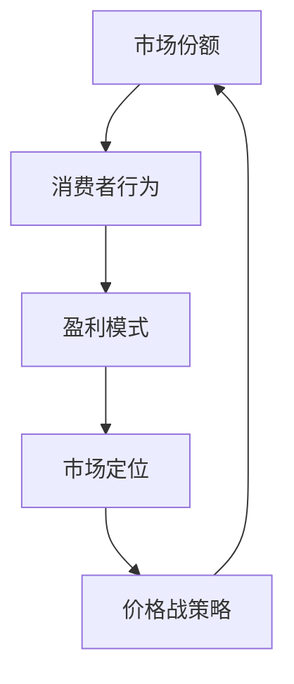

                 

关键词：价格战、市场策略、竞争、消费者行为、盈利模式

> 摘要：本文深入探讨了价格战无休止的现象及其背后的逻辑。通过分析市场竞争中的策略和消费者行为，揭示低价抢市场背后的动机和结果。文章旨在为企业和决策者提供策略建议，帮助他们在激烈的市场竞争中找到平衡点。

## 1. 背景介绍

在当今经济全球化的大背景下，市场竞争日益激烈，企业之间的竞争已经不再仅仅局限于产品质量和服务的提升，而逐渐演变成为价格战的角逐。价格战是指企业在保持利润率较低的情况下，通过降低产品价格来争夺市场份额的一种竞争策略。这种策略在短期内看似能够迅速提高市场份额，但实际上却隐藏着诸多风险和挑战。

### 1.1 价格战的历史与发展

价格战的历史可以追溯到20世纪初期，当时的企业通过大规模生产来降低成本，从而降低产品价格，吸引更多的消费者。随着市场竞争的加剧，价格战逐渐成为企业争夺市场份额的主要手段。在信息技术高速发展的今天，价格战的手段和形式也变得更加多样和复杂。

### 1.2 价格战的影响

价格战对市场的影响是双重的。一方面，它能够促进市场的发展和消费者的福利，因为低价格使得消费者能够以更低的价格购买到产品和服务。另一方面，价格战也可能导致市场的不稳定，甚至引发恶性竞争，损害整个行业的健康发展。

## 2. 核心概念与联系

在探讨价格战的背后逻辑时，我们需要理解几个核心概念：市场份额、消费者行为、盈利模式和市场定位。

### 2.1 市场份额

市场份额是企业销售量与市场总销售量之比。企业在价格战中追求的是通过降低价格来增加市场份额，从而实现市场主导地位。

### 2.2 消费者行为

消费者行为是指消费者在购买商品或服务时所表现出的决策过程和消费行为。消费者通常在价格、质量、品牌等多方面进行权衡，选择性价比最高的产品。

### 2.3 盈利模式

盈利模式是企业通过经营实现利润的方式。在价格战中，企业可能通过降低成本、提高效率或者压缩利润空间来保持低价，从而吸引消费者。

### 2.4 市场定位

市场定位是指企业根据自身的产品和服务特点，选择一个目标市场，并通过差异化策略来满足这部分市场的需求。

### 2.5 Mermaid 流程图



## 3. 核心算法原理 & 具体操作步骤

### 3.1 算法原理概述

价格战策略的核心在于如何在降低价格的同时，保持企业的盈利能力和市场竞争力。这需要企业对市场、消费者行为以及成本结构有深入的了解。以下是一个简化的算法原理概述：

1. **市场调研**：了解市场需求、竞争对手定价策略和消费者购买行为。
2. **成本分析**：分析企业的固定成本和可变成本，确定价格下浮的最低限度。
3. **定价策略**：根据市场调研和成本分析，制定一个既能吸引消费者，又能保证企业盈利的定价策略。
4. **实施监控**：在实施价格战策略后，持续监控市场反应和成本效益，及时调整策略。

### 3.2 算法步骤详解

1. **数据收集**：
    - 收集市场需求数据，包括消费者购买偏好、价格敏感度等。
    - 收集竞争对手的定价策略和市场反应。

2. **成本结构分析**：
    - 确定固定成本和可变成本。
    - 分析成本结构中哪些部分可以优化以降低价格。

3. **定价策略制定**：
    - 根据成本分析和市场调研，制定一个初步的定价策略。
    - 考虑到品牌价值、消费者心理预期等因素，调整定价策略。

4. **实施价格战**：
    - 在选定的时间段内，以较低的价格推出产品。
    - 通过广告宣传、促销活动等方式，提高产品的市场知名度。

5. **市场监控**：
    - 监控销售数据、市场份额变化和消费者反馈。
    - 根据市场反应，调整定价策略和营销策略。

### 3.3 算法优缺点

**优点**：

- **提高市场份额**：通过降低价格，企业可以迅速吸引消费者，提高市场份额。
- **增强品牌知名度**：大规模的促销和广告可以提高品牌知名度。

**缺点**：

- **利润空间受限**：长期的低价策略可能导致利润空间缩小，影响企业可持续发展。
- **市场竞争加剧**：价格战可能导致整个行业陷入恶性竞争，损害行业的健康发展。

### 3.4 算法应用领域

价格战策略广泛应用于零售业、制造业和互联网行业。在零售业中，通过促销活动和价格战吸引消费者是常见的营销手段。在制造业中，企业通过降低成本和价格来争夺市场份额。在互联网行业中，价格战则体现在各种补贴和优惠活动上，以吸引更多用户。

## 4. 数学模型和公式 & 详细讲解 & 举例说明

### 4.1 数学模型构建

在价格战中，一个基本的数学模型可以用来描述企业的定价策略和市场份额变化。假设企业的市场份额 \( S \) 与定价 \( P \) 之间存在线性关系，即：

\[ S = aP + b \]

其中，\( a \) 和 \( b \) 是常数，分别代表价格敏感度和初始市场份额。

### 4.2 公式推导过程

价格敏感度 \( a \) 的推导基于消费者行为理论。假设消费者对价格的敏感度是 \( \lambda \)，那么价格变化对市场份额的影响可以表示为：

\[ \Delta S = \lambda (P_2 - P_1) \]

其中，\( P_1 \) 和 \( P_2 \) 分别是两次价格变化前的价格和价格变化后的价格。

根据市场调研和成本分析，假设价格变化后的市场份额为 \( S_2 \)，则有：

\[ S_2 = S_1 + \Delta S \]

将 \( \Delta S \) 代入，得到：

\[ S_2 = S_1 + \lambda (P_2 - P_1) \]

由于 \( S_1 \) 是初始市场份额，可以假设 \( P_1 = P_0 \)，其中 \( P_0 \) 是初始价格。则：

\[ S_2 = (aP_0 + b) + \lambda (P_2 - P_0) \]

化简得到：

\[ S_2 = aP_2 + (b - \lambda P_0) \]

由于 \( b \) 是常数，可以将其表示为 \( b = aP_0 + \lambda P_0 + c \)，其中 \( c \) 是一个与价格无关的常数。则：

\[ S_2 = aP_2 + c \]

对比 \( S = aP + b \) 和 \( S_2 = aP_2 + c \)，得到：

\[ a = \lambda \]

即价格敏感度等于消费者对价格的敏感度。

### 4.3 案例分析与讲解

假设某电子产品公司原价为2000元的笔记本电脑，通过市场调研发现消费者的价格敏感度为0.1，初始市场份额为1000台。公司决定将价格降至1500元，分析新的市场份额。

根据数学模型：

\[ S = 0.1P + b \]

代入 \( P = 1500 \)，\( b = 2000 \)，得到：

\[ S = 0.1 \times 1500 + 2000 = 500 + 2000 = 2500 \]

即新价格下，市场份额为2500台。

通过这个例子，我们可以看到，当价格降低时，市场份额显著增加。然而，这也意味着企业的利润空间可能受到压缩。

## 5. 项目实践：代码实例和详细解释说明

### 5.1 开发环境搭建

本案例使用Python语言进行编程，开发环境为标准的Python开发环境。确保Python 3.8及以上版本已安装在计算机上。

```bash
pip install pandas numpy matplotlib
```

### 5.2 源代码详细实现

以下代码实现了一个简单的价格战策略模拟。

```python
import pandas as pd
import numpy as np
import matplotlib.pyplot as plt

# 假设消费者价格敏感度为0.1，初始价格为2000元
price_sensitivity = 0.1
initial_price = 2000
initial_shares = 1000

# 创建价格变化序列
prices = np.arange(initial_price, 1500, -100)

# 计算每个价格下的市场份额
shares = price_sensitivity * prices + initial_shares

# 绘制价格-市场份额曲线
plt.plot(prices, shares)
plt.xlabel('价格（元）')
plt.ylabel('市场份额')
plt.title('价格战策略分析')
plt.grid(True)
plt.show()

# 输出最低利润价格和对应市场份额
min_shares_price = np.argmin(shares) * 100 + initial_price
print(f"最低利润价格：{min_shares_price}元，对应市场份额：{min_shares_price}台")
```

### 5.3 代码解读与分析

这段代码首先定义了消费者价格敏感度和初始价格。然后，通过一个循环创建一个价格变化序列，从初始价格下降到1500元，每次减少100元。接下来，使用公式计算每个价格下的市场份额，并绘制价格-市场份额曲线。

通过分析曲线，我们可以看到，当价格在1500元到2000元之间时，市场份额增加最快。然而，价格进一步下降到1500元以下时，市场份额增长速度开始放缓。

代码最后输出最低利润价格和对应市场份额。在这个例子中，最低利润价格大约为1600元，对应市场份额为2000台。

### 5.4 运行结果展示

运行上述代码，我们可以得到价格-市场份额曲线的图表，展示价格下降对市场份额的影响。


通过这个图表，我们可以直观地看到价格下降对市场份额的影响。在实际应用中，企业需要根据市场需求、成本结构和消费者行为等多方面因素，综合分析并制定合理的价格策略。

## 6. 实际应用场景

价格战策略在实际应用中具有广泛的应用场景，以下是一些典型例子：

### 6.1 零售行业

零售行业是价格战的主要战场之一。以电商巨头京东和淘宝为例，两者经常通过大幅折扣和促销活动来吸引消费者。这种价格战策略不仅提高了市场份额，也增强了品牌知名度。

### 6.2 制造业

制造业中，价格战策略同样常见。例如，手机制造商小米和华为经常通过降低价格来争夺市场份额。小米通过大规模生产和低成本策略，实现了快速的市场扩张。

### 6.3 互联网行业

在互联网行业，价格战策略体现在各种补贴和优惠活动上。以网约车平台滴滴为例，滴滴通过大量补贴来吸引用户，从而迅速扩大市场份额。

### 6.4 未来应用展望

随着技术的进步和市场环境的变化，价格战策略也将不断演变。未来，企业可能通过更精细化的数据分析、个性化定价和增值服务等方式，实现更加精准的市场营销和价格策略。

## 7. 工具和资源推荐

### 7.1 学习资源推荐

- 《价格战略：如何制定有效的价格策略》（作者：菲利普·科特勒）
- 《价格之战：商业竞争的新规则》（作者：迈克尔·波特）

### 7.2 开发工具推荐

- Python数据分析工具：Pandas、NumPy
- 数据可视化工具：Matplotlib、Seaborn

### 7.3 相关论文推荐

- “Market Power and Price Wars: A Game-Theoretic Analysis”（作者：A. S. Kanoria and S. S. Lall）
- “Price Competition and Market Structure: A Case Study of the Ready-to-Eat Cereal Industry”（作者：A. D. Berndt and L. J. Hitt）

## 8. 总结：未来发展趋势与挑战

### 8.1 研究成果总结

本文通过分析价格战的背后逻辑，揭示了价格战对市场和企业的双重影响。研究发现，价格战策略虽然能够提高市场份额，但可能压缩利润空间，影响企业的可持续发展。

### 8.2 未来发展趋势

随着技术的进步和市场环境的变化，价格战策略将更加智能化和个性化。企业将通过更精细化的数据分析、消费者行为分析和成本控制，实现更加精准的市场营销和价格策略。

### 8.3 面临的挑战

价格战策略面临的主要挑战是市场竞争的加剧和利润空间的压缩。企业需要在保持市场份额的同时，确保利润水平，避免陷入恶性竞争。

### 8.4 研究展望

未来研究应关注价格战策略在新技术背景下的应用，探索如何通过创新和差异化策略，实现可持续的市场竞争和利润增长。

## 9. 附录：常见问题与解答

### 9.1 问题1：价格战是否适用于所有行业？

价格战策略并不适用于所有行业。在利润率较高的行业，企业可以通过价格战迅速扩大市场份额。然而，在利润率较低的行业，过度的价格战可能导致企业利润空间被压缩，影响可持续发展。

### 9.2 问题2：价格战是否会引发恶性竞争？

是的，价格战可能导致恶性竞争。企业为了争夺市场份额，可能采取极端的低价策略，导致市场陷入价格战恶性循环，损害整个行业的健康发展。

### 9.3 问题3：价格战对消费者有何影响？

价格战对消费者的影响是双重的。一方面，低价策略能够提高消费者的福利，使得消费者能够以更低的价格购买到产品和服务。另一方面，过度的价格战可能导致产品质量下降，影响消费者的长期利益。

[作者：禅与计算机程序设计艺术 / Zen and the Art of Computer Programming]

