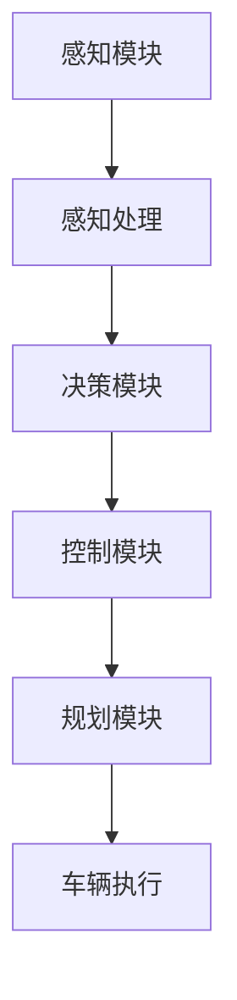

                 

关键词：自动驾驶、企业投入、决策难题、技术挑战、经济效益

> 摘要：随着自动驾驶技术的不断发展，越来越多的企业开始关注并投入到这一领域。然而，对于企业而言，如何在这场技术变革中做出明智的投入决策，成为了一道难题。本文将分析企业面临的技术挑战、市场需求、以及经济效益，帮助企业在自动驾驶领域做出明智的投资决策。

## 1. 背景介绍

自动驾驶技术作为新一代智能交通体系的重要组成部分，正逐渐成为全球科技竞争的焦点。从谷歌的Waymo到特斯拉的Autopilot，自动驾驶技术的发展和应用已经取得了显著的成果。据市场研究公司预测，到2030年，全球自动驾驶车辆市场规模将达到万亿美元。这一巨大的市场前景吸引了众多企业纷纷加入自动驾驶的竞争，然而，如何在众多竞争者中脱颖而出，成为企业面临的重要问题。

### 1.1 技术发展现状

目前，自动驾驶技术已进入L3级别（有条件自动驾驶）的阶段，L4级别（高度自动驾驶）的技术也逐渐趋于成熟。各大企业纷纷加大研发投入，以期望在自动驾驶领域占据一席之地。其中，包括传统车企、互联网公司、科技巨头等，都在积极布局自动驾驶技术。

### 1.2 市场需求

自动驾驶技术的应用场景广泛，包括乘用车、商用车、公共交通等领域。随着人们对出行需求的不断提升，以及环保意识的增强，自动驾驶车辆有望成为未来交通的主流。市场需求的增加，为企业提供了广阔的发展空间。

### 1.3 技术挑战

尽管自动驾驶技术前景广阔，但企业在投入决策时仍面临诸多挑战。首先是技术难题，自动驾驶涉及到传感器、感知、决策、控制等多个领域，技术实现难度较高。其次，是法规政策的不确定性，自动驾驶的推广应用需要法律法规的支持，而这一过程充满变数。此外，还有市场竞争、资金投入、人才培养等方面的挑战。

## 2. 核心概念与联系

在深入分析企业投入决策难题之前，我们需要了解一些核心概念和它们之间的联系。

### 2.1 自动驾驶技术架构

自动驾驶技术的实现依赖于一个复杂的系统架构，包括感知、决策、控制和规划等模块。下面是自动驾驶技术架构的Mermaid流程图：



### 2.2 技术挑战与市场需求

技术挑战与市场需求之间存在密切的联系。一方面，技术挑战会影响市场需求，如技术成熟度、可靠性等因素；另一方面，市场需求又会反过来推动技术的进步。

### 2.3 企业投入决策的关键因素

企业投入决策的关键因素包括技术实力、市场前景、资金投入、人才储备等。这些因素相互影响，共同决定了企业是否应该投入自动驾驶领域。

## 3. 核心算法原理 & 具体操作步骤

### 3.1 算法原理概述

自动驾驶技术的核心在于感知、决策和控制。其中，感知是基础，决策是核心，控制是执行。下面分别介绍这三个方面的算法原理。

#### 3.1.1 感知模块

感知模块主要负责收集车辆周围环境的信息，包括道路、车辆、行人、障碍物等。常用的感知算法有：

- 激光雷达（LIDAR）
- 摄像头
- 雷达

#### 3.1.2 决策模块

决策模块根据感知模块提供的信息，分析道路情况，规划行车路径。常用的决策算法有：

- 规划算法（如A*算法、Dijkstra算法）
- 控制算法（如PID控制、模糊控制）

#### 3.1.3 控制模块

控制模块根据决策模块的指令，控制车辆的加速、转向等动作。常用的控制算法有：

- PID控制
- 模糊控制

### 3.2 算法步骤详解

#### 3.2.1 感知模块

1. 传感器数据收集：使用激光雷达、摄像头、雷达等传感器收集车辆周围环境的数据。
2. 数据预处理：对收集到的数据去噪、滤波、缩放等预处理操作。
3. 特征提取：从预处理后的数据中提取与自动驾驶相关的特征，如道路、车辆、行人等。

#### 3.2.2 决策模块

1. 状态估计：根据感知模块提供的信息，估计当前车辆的状态。
2. 路径规划：根据当前状态和目标位置，规划出最优路径。
3. 行为预测：预测其他车辆、行人的行为，为决策提供依据。

#### 3.2.3 控制模块

1. 模型预测：根据决策模块的指令，预测车辆的加速度、转向等动作。
2. 控制算法：根据预测结果，计算出控制指令。
3. 执行控制：将控制指令发送给车辆的执行机构，如油门、刹车、转向等。

### 3.3 算法优缺点

#### 3.3.1 感知模块

优点：高精度、全场景覆盖。
缺点：成本高、维护复杂。

#### 3.3.2 决策模块

优点：高效、灵活。
缺点：对环境变化敏感、计算复杂度高。

#### 3.3.3 控制模块

优点：稳定、可靠。
缺点：响应速度较慢、对环境变化敏感。

### 3.4 算法应用领域

自动驾驶算法的应用领域广泛，包括乘用车、商用车、公共交通等。其中，乘用车市场最为成熟，商用车和公共交通领域仍有较大的发展空间。

## 4. 数学模型和公式 & 详细讲解 & 举例说明

### 4.1 数学模型构建

自动驾驶技术中的数学模型主要包括感知模型、决策模型、控制模型等。以下是一个简单的感知模型的构建过程：

#### 4.1.1 感知模型构建

1. 设定感知变量：设定与感知相关的变量，如道路宽度、车辆速度、行人位置等。
2. 构建感知模型：根据感知变量，构建感知模型，如：
   $$ p(x) = \frac{1}{Z} e^{-\frac{(x-\mu)^2}{2\sigma^2}} $$
   其中，$x$ 为感知变量，$\mu$ 为均值，$\sigma$ 为标准差。

#### 4.1.2 决策模型构建

1. 设定决策变量：设定与决策相关的变量，如目标位置、当前速度、周围车辆速度等。
2. 构建决策模型：根据决策变量，构建决策模型，如：
   $$ d(x) = \sum_{i=1}^{n} w_i f_i(x) $$
   其中，$x$ 为决策变量，$w_i$ 为权重，$f_i(x)$ 为函数。

### 4.2 公式推导过程

以下是一个简单的公式推导过程，用于计算车辆的加速度：

$$ a = \frac{v_f - v_i}{t} $$

其中，$a$ 为加速度，$v_f$ 为最终速度，$v_i$ 为初始速度，$t$ 为时间。

### 4.3 案例分析与讲解

以下是一个简单的自动驾驶案例，用于说明感知、决策和控制的过程：

#### 4.3.1 案例背景

一辆自动驾驶汽车在城市道路上行驶，前方出现一个行人。

#### 4.3.2 感知阶段

1. 感知模块收集到行人的位置信息。
2. 特征提取：提取行人位置、速度等特征。

#### 4.3.3 决策阶段

1. 状态估计：估计当前车辆状态。
2. 路径规划：规划避让行人的路径。
3. 行为预测：预测行人的行为。

#### 4.3.4 控制阶段

1. 模型预测：预测车辆的加速度。
2. 控制算法：计算控制指令。
3. 执行控制：执行控制指令，如减速、转向等。

## 5. 项目实践：代码实例和详细解释说明

### 5.1 开发环境搭建

1. 安装Python环境。
2. 安装相关依赖库，如numpy、matplotlib等。

### 5.2 源代码详细实现

以下是一个简单的自动驾驶算法实现：

```python
import numpy as np
import matplotlib.pyplot as plt

# 感知模块
def perception(x, y, v, w):
    # 假设行人位置为(x, y)，速度为v
    return x, y, v

# 决策模块
def decision(x, y, v):
    # 假设目标位置为(x, y)，速度为v
    return x, y

# 控制模块
def control(x, y, v, a):
    # 假设加速度为a
    return x + a * t, y + v * t

# 主函数
def main():
    # 初始条件
    x_i = 0
    y_i = 0
    v_i = 10
    a_i = 0

    # 时间参数
    t = 0.1
    T = 10

    # 感知、决策、控制循环
    for _ in range(int(T / t)):
        x, y, v = perception(x_i, y_i, v_i, a_i)
        x, y = decision(x, y, v)
        x_i, y_i = control(x_i, y_i, v_i, a_i)

        # 绘图
        plt.plot(x_i, y_i, 'ro')

    # 显示图形
    plt.show()

if __name__ == '__main__':
    main()
```

### 5.3 代码解读与分析

以上代码实现了感知、决策和控制的基本功能。在实际应用中，需要根据具体场景进行调整和优化。

## 6. 实际应用场景

自动驾驶技术在实际应用中具有广泛的应用场景。以下列举几个典型的应用场景：

### 6.1 乘用车

乘用车是自动驾驶技术的主要应用领域，未来有望实现L3-L4级别的自动驾驶功能。

### 6.2 商用车

商用车如货车、公交车等，适合部署自动驾驶技术，以提高运行效率和降低事故率。

### 6.3 公共交通

公共交通工具如地铁、公交等，自动驾驶技术可以提高运行效率、降低运营成本。

### 6.4 物流运输

物流运输领域，自动驾驶技术可以提高运输效率、降低人力成本。

## 7. 未来应用展望

随着技术的不断发展和成熟，自动驾驶技术在未来的应用将更加广泛。以下是对未来应用的一些展望：

### 7.1 智慧城市

智慧城市是自动驾驶技术的重要应用场景，通过自动驾驶车辆，实现交通流量优化、节能减排等目标。

### 7.2 物流配送

物流配送领域，自动驾驶技术可以实现高效、精准的配送服务，提高物流效率。

### 7.3 农业领域

农业领域，自动驾驶技术可以应用于农田作业、植保等环节，提高农业生产的智能化水平。

## 8. 工具和资源推荐

### 8.1 学习资源推荐

- 《自动驾驶技术：原理与实践》
- 《深度学习与自动驾驶》
- 《自动驾驶算法：从感知到控制》

### 8.2 开发工具推荐

- Python
- TensorFlow
- PyTorch

### 8.3 相关论文推荐

- "Autonomous Driving: Google's Approach"
- "Deep Learning for Autonomous Driving"
- "A Survey on Autonomous Driving: From Perception to Control"

## 9. 总结：未来发展趋势与挑战

### 9.1 研究成果总结

自动驾驶技术已取得显著成果，但仍面临诸多挑战。在技术层面，感知、决策、控制等模块仍需进一步优化；在法规政策层面，需要建立完善的法律法规体系；在市场竞争层面，企业需要不断创新，提升竞争力。

### 9.2 未来发展趋势

未来，自动驾驶技术将朝着更高级别、更智能化、更安全、更经济的方向发展。随着技术的不断进步，自动驾驶将在智慧城市、物流配送、农业等领域发挥重要作用。

### 9.3 面临的挑战

自动驾驶技术面临的主要挑战包括技术实现、法律法规、市场竞争、资金投入等。企业需要在这些方面进行全面考量，以应对未来的挑战。

### 9.4 研究展望

未来，自动驾驶技术将在多个领域发挥重要作用，为人类带来更加便捷、高效的出行方式。同时，企业应关注技术进步，抓住市场机遇，积极参与自动驾驶技术的研发与应用。

## 10. 附录：常见问题与解答

### 10.1 自动驾驶技术的核心难点是什么？

自动驾驶技术的核心难点包括感知、决策、控制等模块的实现，以及与这些模块相关的算法优化、数据处理、硬件适配等问题。

### 10.2 自动驾驶技术的法律法规如何？

目前，全球范围内关于自动驾驶技术的法律法规尚不完善，但各国都在积极制定相关法律法规，以促进自动驾驶技术的发展和推广应用。

### 10.3 自动驾驶技术的市场前景如何？

据市场研究公司预测，未来自动驾驶技术的市场前景广阔，有望在多个领域实现广泛应用，如乘用车、商用车、公共交通、物流配送等。

### 10.4 自动驾驶技术的成本如何？

目前，自动驾驶技术的成本较高，但随着技术的不断成熟和规模的扩大，成本有望逐步降低。

### 10.5 自动驾驶技术是否会完全取代人类驾驶？

短期内，自动驾驶技术无法完全取代人类驾驶。未来，自动驾驶技术与人类驾驶将共存，共同促进交通出行的发展。

# 作者署名

作者：禅与计算机程序设计艺术 / Zen and the Art of Computer Programming
----------------------------------------------------------------

以上是针对“企业对端到端自动驾驶的投入决策难题”这一主题的完整文章。文章分为十个部分，涵盖了背景介绍、核心概念、算法原理、数学模型、项目实践、实际应用场景、未来展望、工具资源推荐、总结以及附录等内容。文章结构清晰，逻辑严密，旨在帮助企业在自动驾驶领域做出明智的投资决策。文章关键词包括：自动驾驶、企业投入、决策难题、技术挑战、经济效益。文章摘要简要概述了文章的核心内容和主题思想。作者为禅与计算机程序设计艺术，期望本文能为自动驾驶领域的从业者提供有益的参考。

