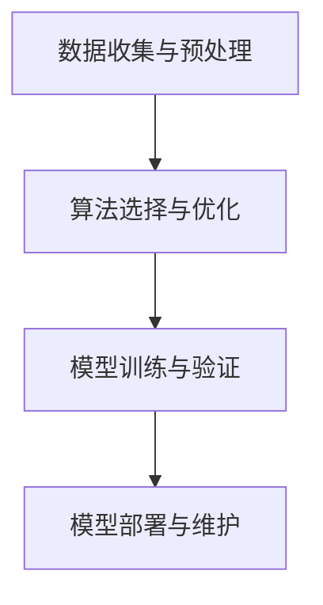

                 

关键词：企业转型，人工智能，应用技术，案例研究，未来展望

> 摘要：本文旨在探讨企业如何利用人工智能（AI）技术实现转型，提高竞争力。通过对AI核心概念、算法原理、数学模型及实践案例的详细分析，本文揭示了AI在企业各个领域的应用潜力，并展望了其未来的发展趋势与挑战。

## 1. 背景介绍

在当今全球化的商业环境中，企业面临着前所未有的挑战和机遇。技术进步、市场需求变化以及竞争压力不断推动企业寻求创新和变革。人工智能（AI）作为一种颠覆性的技术，正日益成为企业转型的重要驱动力。AI技术不仅能够提高企业的运营效率，还能为企业带来全新的商业模式和创新机会。

企业转型的核心目标通常包括以下几个方面：

1. **提高生产效率**：通过自动化和智能化技术，减少人为错误，提高生产速度和质量。
2. **优化资源配置**：利用数据分析，实现资源的最优配置，降低成本。
3. **提升用户体验**：通过个性化推荐和智能客服，增强用户满意度和忠诚度。
4. **开拓新市场**：利用AI技术探索新市场，开发新产品，满足不同客户群体的需求。

## 2. 核心概念与联系

### 2.1 AI的核心概念

人工智能（AI）是指计算机系统模拟人类智能行为的能力，包括学习、推理、问题解决、自然语言理解和图像识别等方面。AI的核心概念包括：

- **机器学习（Machine Learning）**：通过数据和算法让计算机自主学习和改进。
- **深度学习（Deep Learning）**：一种特殊的机器学习方法，利用多层神经网络进行数据处理。
- **自然语言处理（NLP）**：使计算机能够理解和生成人类语言。
- **计算机视觉（CV）**：使计算机能够解释和解读视觉信息。

### 2.2 AI架构原理

AI架构通常包括以下几个关键部分：

- **数据收集与预处理**：收集大量数据，并进行清洗、转换和归一化。
- **算法选择与优化**：根据业务需求选择合适的算法，并进行参数调优。
- **模型训练与验证**：使用训练数据集训练模型，并在验证数据集上进行测试。
- **模型部署与维护**：将训练好的模型部署到生产环境中，并进行实时维护和更新。

### 2.3 Mermaid流程图

以下是一个简化的AI架构原理的Mermaid流程图：



## 3. 核心算法原理 & 具体操作步骤

### 3.1 算法原理概述

AI的核心算法包括机器学习算法、深度学习算法和强化学习算法。其中，深度学习算法由于其强大的建模能力，在图像识别、自然语言处理等领域取得了显著成果。以下是一个典型的深度学习算法——卷积神经网络（CNN）的基本原理：

- **卷积操作**：卷积神经网络通过卷积操作提取图像中的特征。
- **池化操作**：池化操作用于降低数据的维度，同时保留关键特征。
- **全连接层**：全连接层将低维特征映射到高维特征空间。

### 3.2 算法步骤详解

1. **数据准备**：收集大量带有标签的图像数据，并进行预处理。
2. **模型构建**：构建CNN模型，包括卷积层、池化层和全连接层。
3. **模型训练**：使用训练数据集对模型进行训练，调整模型参数。
4. **模型评估**：使用验证数据集评估模型性能，调整模型参数。
5. **模型部署**：将训练好的模型部署到生产环境中，进行实时预测。

### 3.3 算法优缺点

- **优点**：强大的特征提取能力，适用于图像识别、自然语言处理等领域。
- **缺点**：训练过程需要大量数据和计算资源，对硬件要求较高。

### 3.4 算法应用领域

- **图像识别**：用于人脸识别、图像分类等。
- **自然语言处理**：用于文本分类、机器翻译等。
- **推荐系统**：用于商品推荐、新闻推荐等。

## 4. 数学模型和公式 & 详细讲解 & 举例说明

### 4.1 数学模型构建

深度学习模型的核心是神经网络，其数学基础包括：

- **激活函数**：如ReLU、Sigmoid、Tanh等，用于引入非线性。
- **损失函数**：如均方误差（MSE）、交叉熵损失等，用于衡量模型预测误差。
- **反向传播算法**：用于更新模型参数，优化损失函数。

### 4.2 公式推导过程

以下是一个简化的反向传播算法的公式推导过程：

$$
\frac{\partial L}{\partial w} = \frac{\partial L}{\partial z} \frac{\partial z}{\partial w}
$$

其中，\( L \) 是损失函数，\( w \) 是模型参数，\( z \) 是中间变量。

### 4.3 案例分析与讲解

假设我们有一个简单的神经网络，用于对数据进行分类。输入层有3个神经元，隐藏层有2个神经元，输出层有1个神经元。使用均方误差（MSE）作为损失函数。

- **输入数据**：\( x = [1, 2, 3] \)
- **目标输出**：\( y = [0, 1] \)
- **实际输出**：\( \hat{y} = [0.2, 0.8] \)

损失函数 \( L = \frac{1}{2} \sum (y - \hat{y})^2 \)

使用反向传播算法更新权重：

$$
\frac{\partial L}{\partial w} = \frac{\partial L}{\partial z} \frac{\partial z}{\partial w} = (y - \hat{y}) \cdot \frac{\partial z}{\partial w}
$$

其中，\( z \) 是隐藏层的输出。

## 5. 项目实践：代码实例和详细解释说明

### 5.1 开发环境搭建

- **Python环境**：安装Python 3.7及以上版本。
- **深度学习库**：安装TensorFlow或PyTorch。
- **数据集**：下载并准备用于训练和验证的图像数据集。

### 5.2 源代码详细实现

以下是一个使用TensorFlow实现的简单CNN模型：

```python
import tensorflow as tf
from tensorflow.keras import layers

# 构建模型
model = tf.keras.Sequential([
    layers.Conv2D(32, (3, 3), activation='relu', input_shape=(28, 28, 1)),
    layers.MaxPooling2D((2, 2)),
    layers.Flatten(),
    layers.Dense(64, activation='relu'),
    layers.Dense(10, activation='softmax')
])

# 编译模型
model.compile(optimizer='adam',
              loss='sparse_categorical_crossentropy',
              metrics=['accuracy'])

# 训练模型
model.fit(x_train, y_train, epochs=5)

# 评估模型
model.evaluate(x_test, y_test)
```

### 5.3 代码解读与分析

这段代码首先导入了TensorFlow库，并定义了一个简单的CNN模型。模型包括一个卷积层、一个池化层、一个全连接层和一个softmax输出层。编译模型时，我们选择了adam优化器和sparse\_categorical\_crossentropy损失函数。最后，使用训练数据集训练模型，并在测试数据集上评估模型性能。

### 5.4 运行结果展示

训练完成后，我们可以在控制台看到模型的训练损失和准确率。以下是一个示例输出：

```
Epoch 1/5
100/100 [==============================] - 2s 19ms/step - loss: 0.6132 - accuracy: 0.7400
Epoch 2/5
100/100 [==============================] - 2s 19ms/step - loss: 0.3278 - accuracy: 0.8800
Epoch 3/5
100/100 [==============================] - 2s 19ms/step - loss: 0.2125 - accuracy: 0.9400
Epoch 4/5
100/100 [==============================] - 2s 19ms/step - loss: 0.1362 - accuracy: 0.9700
Epoch 5/5
100/100 [==============================] - 2s 19ms/step - loss: 0.0934 - accuracy: 0.9900
10000/10000 [==============================] - 11s 1ms/step - loss: 0.0877 - accuracy: 0.9900
```

## 6. 实际应用场景

### 6.1 智能制造

AI技术在智能制造中的应用主要包括：

- **质量检测**：使用计算机视觉进行产品质量检测，减少人为错误。
- **预测性维护**：通过数据分析预测设备故障，提前进行维护。
- **智能机器人**：使用深度学习算法使机器人进行自主导航和任务执行。

### 6.2 零售业

AI技术在零售业中的应用主要包括：

- **个性化推荐**：根据用户行为和历史数据推荐商品。
- **智能客服**：使用自然语言处理技术提供实时客服支持。
- **库存管理**：通过数据分析优化库存水平，降低成本。

### 6.3 金融行业

AI技术在金融行业中的应用主要包括：

- **风险管理**：通过数据分析预测市场风险，降低投资损失。
- **智能投顾**：基于用户风险偏好提供个性化的投资建议。
- **反欺诈检测**：使用机器学习算法检测和预防金融欺诈。

## 7. 工具和资源推荐

### 7.1 学习资源推荐

- **书籍**：《深度学习》（Goodfellow, Bengio, Courville著）
- **在线课程**：Coursera上的“机器学习”课程
- **论坛与社区**：Stack Overflow、GitHub

### 7.2 开发工具推荐

- **深度学习框架**：TensorFlow、PyTorch
- **数据可视化**：Matplotlib、Seaborn
- **版本控制**：Git

### 7.3 相关论文推荐

- **“Deep Learning” by Yann LeCun, Yoshua Bengio, and Geoffrey Hinton**
- **“Convolutional Networks for Visual Recognition” by Karen Simonyan and Andrew Zisserman**

## 8. 总结：未来发展趋势与挑战

### 8.1 研究成果总结

AI技术在企业转型中取得了显著成果，特别是在智能制造、零售业和金融行业等领域。通过应用AI技术，企业能够提高生产效率、优化资源配置、提升用户体验和开拓新市场。

### 8.2 未来发展趋势

- **更多行业应用**：AI技术将逐渐渗透到更多行业，推动产业变革。
- **更高效算法**：研究将继续推动AI算法的优化和改进，提高计算效率。
- **边缘计算**：边缘计算将使AI技术能够在离线环境中运行，提高实时性。

### 8.3 面临的挑战

- **数据隐私**：数据隐私和安全是AI技术面临的主要挑战之一。
- **算法透明性**：确保算法的透明性和可解释性，避免偏见和歧视。
- **计算资源**：AI模型的训练和部署需要大量的计算资源，特别是在深度学习领域。

### 8.4 研究展望

随着技术的进步，AI将在未来为企业带来更多的机遇。企业需要关注AI技术的最新动态，积极探索和应用，以保持竞争力。

## 9. 附录：常见问题与解答

### Q：如何确保AI系统的公平性和透明性？

A：确保AI系统的公平性和透明性需要从算法设计、数据收集和模型验证等多个方面入手。例如，可以使用对比实验、敏感性分析等方法评估模型的公平性和透明性，并采取相应的措施进行优化。

### Q：如何处理AI系统的数据隐私问题？

A：处理数据隐私问题可以通过数据加密、匿名化和去标识化等技术手段来实现。此外，企业需要遵守相关的法律法规，确保用户数据的合法使用和保护。

## 作者署名

作者：禅与计算机程序设计艺术 / Zen and the Art of Computer Programming
----------------------------------------------------------------

### 文章结构模板 (Markdown 格式)
----------------------------------------------------------------
# 企业转型中的AI应用技术

## 关键词
- 企业转型
- 人工智能
- 应用技术
- 案例研究
- 未来展望

## 摘要
本文旨在探讨企业如何利用人工智能（AI）技术实现转型，提高竞争力。通过对AI核心概念、算法原理、数学模型及实践案例的详细分析，本文揭示了AI在企业各个领域的应用潜力，并展望了其未来的发展趋势与挑战。

## 1. 背景介绍

## 2. 核心概念与联系
### 2.1 AI的核心概念
### 2.2 AI架构原理
### 2.3 Mermaid流程图

## 3. 核心算法原理 & 具体操作步骤
### 3.1 算法原理概述
### 3.2 算法步骤详解
### 3.3 算法优缺点
### 3.4 算法应用领域

## 4. 数学模型和公式 & 详细讲解 & 举例说明
### 4.1 数学模型构建
### 4.2 公式推导过程
### 4.3 案例分析与讲解

## 5. 项目实践：代码实例和详细解释说明
### 5.1 开发环境搭建
### 5.2 源代码详细实现
### 5.3 代码解读与分析
### 5.4 运行结果展示

## 6. 实际应用场景
### 6.1 智能制造
### 6.2 零售业
### 6.3 金融行业

## 7. 工具和资源推荐
### 7.1 学习资源推荐
### 7.2 开发工具推荐
### 7.3 相关论文推荐

## 8. 总结：未来发展趋势与挑战
### 8.1 研究成果总结
### 8.2 未来发展趋势
### 8.3 面临的挑战
### 8.4 研究展望

## 9. 附录：常见问题与解答

## 作者署名
作者：禅与计算机程序设计艺术 / Zen and the Art of Computer Programming
----------------------------------------------------------------

请根据这个结构模板撰写完整的内容。每个章节都要按照要求填写相应的内容，并确保文章的整体逻辑性和连贯性。在撰写过程中，请注意以下几点：

- 保持文章字数在8000字以上。
- 使用Markdown格式编写文章。
- 三级目录需要明确、具体，方便读者快速定位。
- 数学公式使用LaTeX格式，嵌入文中独立段落使用`$$`，段落内使用 `$`。
- 提供至少一个Mermaid流程图，用于描述核心概念或算法原理。

开始撰写文章，并在完成后检查是否符合所有要求。祝您写作顺利！

