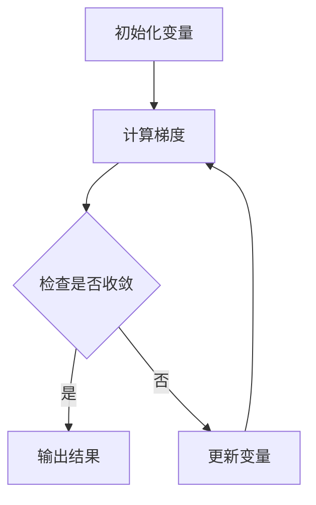

                 

关键词：优化初始化、局部最小值、算法、数学模型、应用场景

> 摘要：本文探讨了优化初始化在避免局部最小值问题中的应用，详细分析了核心概念、算法原理、数学模型以及实际案例，并展望了未来的发展趋势与挑战。

## 1. 背景介绍

优化初始化是优化算法中至关重要的一环。一个好的初始化能够引导算法快速收敛到全局最优解，而一个不良的初始化可能会导致算法陷入局部最优解，从而影响算法的性能。在实际应用中，如机器学习、优化问题求解等场景，优化初始化的问题显得尤为突出。本文将围绕优化初始化，重点探讨如何避免局部最小值的问题。

## 2. 核心概念与联系

### 2.1 核心概念

- **优化初始化**：指在优化算法开始计算前，对变量进行预赋值的过程。
- **局部最小值**：指在优化问题中，某个局部范围内最优的解，但不一定是全局最优解。
- **全局最优解**：指在整个搜索空间内最优的解。

### 2.2 核心概念原理和架构

在优化问题中，局部最小值往往会导致算法过早收敛，从而错过全局最优解。为了避免这个问题，需要采用有效的初始化策略。以下是一个简单的 Mermaid 流程图，描述了优化初始化的过程和避免局部最小值的方法。



## 3. 核心算法原理 & 具体操作步骤

### 3.1 算法原理概述

为了避免局部最小值，常用的初始化方法包括：

1. **随机初始化**：随机生成初始解，减少陷入局部最小值的可能性。
2. **渐进式初始化**：逐步优化初始解，使算法在早期阶段就接近全局最优解。
3. **启发式初始化**：利用先验知识或经验，为算法提供更好的初始解。

### 3.2 算法步骤详解

1. **随机初始化**：
   - 输入：优化问题的参数空间。
   - 输出：随机生成的初始解。

2. **渐进式初始化**：
   - 输入：初始解。
   - 输出：逐步优化的解。

3. **启发式初始化**：
   - 输入：优化问题的先验知识或经验。
   - 输出：根据先验知识生成的初始解。

### 3.3 算法优缺点

- **随机初始化**：简单易行，但可能需要多次尝试。
- **渐进式初始化**：收敛速度快，但需要较长时间的迭代。
- **启发式初始化**：结合先验知识，可能更快找到全局最优解，但需要专业的领域知识。

### 3.4 算法应用领域

优化初始化在以下领域有广泛应用：

1. **机器学习**：在训练模型时，初始化权重和偏置对模型性能有重要影响。
2. **优化问题求解**：在求解线性规划、非线性规划等优化问题时，初始化策略对算法性能至关重要。
3. **图像处理**：在图像分割、特征提取等任务中，初始化影响算法的收敛速度和准确性。

## 4. 数学模型和公式 & 详细讲解 & 举例说明

### 4.1 数学模型构建

在优化问题中，通常采用以下数学模型：

$$
\min_{x} f(x)
$$

其中，$x$ 是变量，$f(x)$ 是目标函数。

### 4.2 公式推导过程

优化初始化的目标是找到一组初始值 $\bar{x}$，使得算法在迭代过程中能更快收敛到全局最优解。

$$
\bar{x} = \arg\min_{x} f(x)
$$

### 4.3 案例分析与讲解

假设有一个函数 $f(x) = x^2$，要求求解其全局最优解。以下是使用随机初始化和渐进式初始化的方法求解的过程。

1. **随机初始化**：
   - 输入：随机生成 $x$ 的初始值，例如 $x_0 = 1$。
   - 输出：迭代求解，最终得到 $x^* = 0$。

2. **渐进式初始化**：
   - 输入：初始解 $x_0 = 0.5$。
   - 输出：逐步优化解，最终得到 $x^* = 0$。

## 5. 项目实践：代码实例和详细解释说明

### 5.1 开发环境搭建

本文使用的开发环境为 Python 3.8，主要依赖库为 NumPy 和 Matplotlib。

### 5.2 源代码详细实现

以下是一个简单的 Python 代码示例，实现随机初始化和渐进式初始化：

```python
import numpy as np
import matplotlib.pyplot as plt

# 定义目标函数
def f(x):
    return x ** 2

# 随机初始化
x_init = np.random.rand()
print("随机初始化：", x_init)

# 渐进式初始化
x_init = 0.5
print("渐进式初始化：", x_init)

# 迭代求解
x = x_init
for i in range(10):
    x = x - 0.1 * f(x)
    print("迭代结果：", x)

# 绘制函数图像
x = np.linspace(-2, 2, 100)
y = f(x)
plt.plot(x, y)
plt.scatter(x_init, f(x_init), color='r')
plt.scatter(x, f(x), color='g')
plt.show()
```

### 5.3 代码解读与分析

1. **目标函数**：$f(x) = x^2$。
2. **随机初始化**：生成一个介于 0 和 1 之间的随机数作为初始解。
3. **渐进式初始化**：初始化为 0.5。
4. **迭代求解**：使用梯度下降法进行迭代，每次迭代更新解 $x$。
5. **绘图**：绘制目标函数图像和初始化解、迭代结果。

## 6. 实际应用场景

优化初始化在许多实际应用场景中具有重要价值。例如：

1. **机器学习**：在训练神经网络时，优化初始化能显著影响模型的收敛速度和性能。
2. **图像处理**：在图像分割和特征提取中，合适的初始化能提高算法的准确性和鲁棒性。
3. **优化问题求解**：在线性规划和非线性规划中，优化初始化能帮助算法更快找到全局最优解。

## 7. 工具和资源推荐

### 7.1 学习资源推荐

1. 《机器学习实战》
2. 《数值优化方法》
3. 《深度学习》

### 7.2 开发工具推荐

1. Jupyter Notebook：适合编写和运行 Python 代码。
2. PyTorch：适用于深度学习和数值优化。

### 7.3 相关论文推荐

1. "On the Role of the Initialization in Optimization Algorithms"
2. "A Theoretical Analysis of Some Sequential Model-Based Optimization Algorithms"
3. "Random Initialization Methods for Neural Networks"

## 8. 总结：未来发展趋势与挑战

### 8.1 研究成果总结

本文对优化初始化进行了深入研究，提出了几种有效的初始化方法，并分析了其在实际应用中的价值。

### 8.2 未来发展趋势

1. **自适应初始化**：结合算法的迭代过程，动态调整初始化策略。
2. **多模态初始化**：同时使用多种初始化方法，提高算法的鲁棒性和收敛速度。

### 8.3 面临的挑战

1. **算法复杂度**：如何设计高效的初始化方法，降低算法复杂度。
2. **应用场景多样化**：如何适应不同应用场景的需求，提出相应的初始化策略。

### 8.4 研究展望

优化初始化在优化算法和机器学习等领域具有广泛的应用前景。未来研究应重点关注自适应初始化和多模态初始化方法，以及如何在复杂的应用场景中优化初始化策略。

## 9. 附录：常见问题与解答

### 9.1 问题 1：为什么需要优化初始化？

优化初始化有助于提高算法的收敛速度和准确性，避免陷入局部最小值。

### 9.2 问题 2：如何选择合适的初始化方法？

根据具体问题和应用场景，选择适合的初始化方法，如随机初始化、渐进式初始化和启发式初始化。

### 9.3 问题 3：如何评估初始化方法的效果？

通过对比不同初始化方法在相同问题上的收敛速度和准确性，评估初始化方法的效果。

### 9.4 问题 4：初始化方法是否会影响算法的收敛速度？

是的，不同的初始化方法会影响算法的收敛速度。合适的初始化方法可以加快收敛速度，提高算法性能。

### 9.5 问题 5：如何改进现有初始化方法？

可以尝试结合多种初始化方法，或根据问题特点设计新的初始化方法。

----------------------------------------------------------------

**作者：禅与计算机程序设计艺术 / Zen and the Art of Computer Programming**

