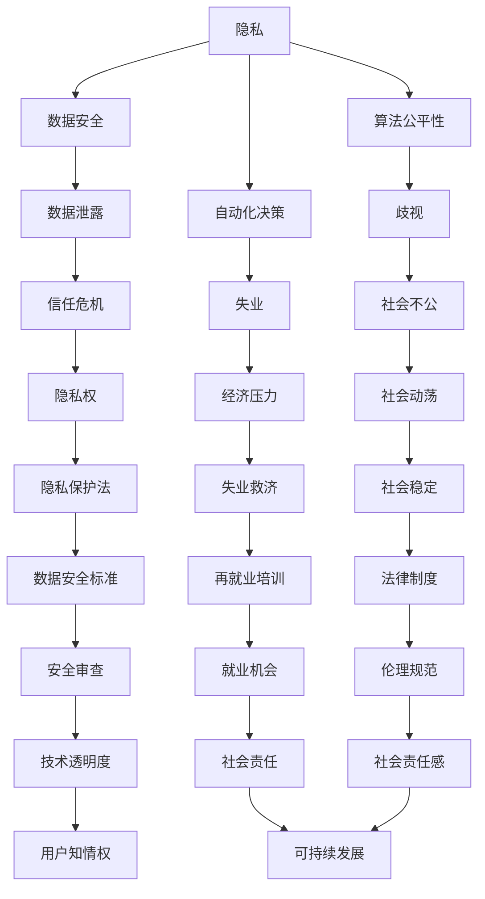
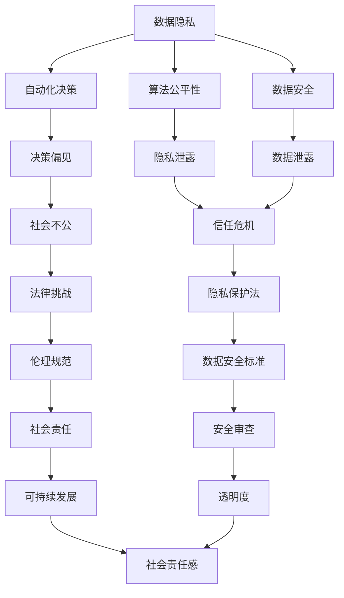

                 

关键词：伦理挑战、人类计算、ethical 问题、AI 伦理、编程伦理、计算伦理

摘要：随着计算机技术的迅猛发展，人类计算已经深刻地融入了我们的日常生活。然而，这种无处不在的计算也带来了一系列的伦理挑战。本文将探讨这些伦理问题，并提出一些可能的解决方案。

## 1. 背景介绍

计算机技术已经走过了几十年的发展历程。从最初的电子计算机，到如今无处不在的智能手机、智能家居、智能汽车等，计算机技术已经深刻地改变了我们的生活。然而，这种改变不仅仅是技术上的进步，更是伦理上的挑战。随着计算机技术的发展，我们面临着越来越多的伦理问题，如隐私保护、数据安全、算法公平性、自动化决策等。

### 1.1 计算机技术的迅速发展

计算机技术的迅速发展是一个不争的事实。从最初的电子计算机，到如今基于硅芯片的微型计算机，再到现在的云计算、大数据、人工智能等，计算机技术已经实现了质的飞跃。这种飞跃不仅带来了生产力的提升，也带来了新的伦理问题。

### 1.2 人类计算的重要性

人类计算是指人类通过计算机技术进行思考、决策和行动的过程。这种计算不仅仅是简单的计算过程，更是人类智慧的体现。随着计算机技术的发展，人类计算已经成为现代社会的重要组成部分，如金融、医疗、交通、教育等领域。

### 1.3 伦理挑战的兴起

随着计算机技术的普及和应用，伦理挑战也逐渐浮出水面。这些问题不仅涉及技术本身，还涉及社会、经济、政治等多个层面。如何应对这些伦理挑战，已经成为一个亟待解决的问题。

## 2. 核心概念与联系

为了更好地理解人类计算带来的伦理挑战，我们需要先了解一些核心概念，如隐私、数据安全、算法公平性、自动化决策等。以下是这些概念之间的联系及Mermaid流程图表示：



从Mermaid流程图中，我们可以看出，这些概念相互交织，构成了一个复杂的伦理网络。隐私、数据安全和算法公平性是计算机伦理的核心，它们共同决定了自动化决策的公正性和透明度，进而影响了社会的稳定和可持续发展。

## 3. 核心算法原理 & 具体操作步骤

### 3.1 算法原理概述

为了应对计算机伦理挑战，我们需要设计一系列的算法来保护隐私、保障数据安全、促进算法公平性。以下是这些算法的原理概述：

- **隐私保护算法**：通过加密、匿名化等技术手段，保护用户的隐私数据。
- **数据安全算法**：通过防火墙、入侵检测系统等，防止数据泄露和篡改。
- **算法公平性算法**：通过随机化、公平性测试等技术手段，确保算法的公平性和透明度。
- **自动化决策算法**：通过机器学习、深度学习等技术手段，实现自动化决策。

### 3.2 算法步骤详解

以下是这些算法的具体操作步骤：

#### 3.2.1 隐私保护算法

1. **数据收集**：在收集用户数据时，应确保数据的最小化原则，只收集必要的个人信息。
2. **数据加密**：使用先进的加密算法，对收集到的数据进行加密，确保数据在传输和存储过程中安全。
3. **匿名化**：对数据中的个人信息进行匿名化处理，消除个人信息与数据之间的直接联系。

#### 3.2.2 数据安全算法

1. **防火墙设置**：在网络边界设置防火墙，防止未经授权的访问。
2. **入侵检测系统**：部署入侵检测系统，实时监控网络流量，发现并阻止潜在的安全威胁。
3. **数据备份**：定期对重要数据进行备份，以防止数据丢失。

#### 3.2.3 算法公平性算法

1. **数据预处理**：对输入数据进行清洗和处理，确保数据的质量和一致性。
2. **随机化**：在算法训练过程中，采用随机化技术，避免数据偏见。
3. **公平性测试**：对训练好的算法进行公平性测试，确保算法在不同群体中的表现一致。

#### 3.2.4 自动化决策算法

1. **特征选择**：从大量数据中提取出对决策有影响的特征。
2. **模型训练**：使用机器学习或深度学习算法，对特征进行训练，构建自动化决策模型。
3. **模型评估**：对训练好的模型进行评估，确保其准确性和公平性。

### 3.3 算法优缺点

每种算法都有其优缺点，以下是这些算法的优缺点分析：

- **隐私保护算法**：优点是能够有效保护用户隐私，缺点是可能影响数据处理效率和系统的响应速度。
- **数据安全算法**：优点是能够有效防止数据泄露和篡改，缺点是可能影响系统的可用性和性能。
- **算法公平性算法**：优点是能够确保算法的公平性和透明度，缺点是可能增加算法的训练时间和计算成本。
- **自动化决策算法**：优点是能够提高决策的效率和准确性，缺点是可能受到数据偏见和算法偏见的影响。

### 3.4 算法应用领域

这些算法在不同的领域有着广泛的应用：

- **隐私保护算法**：在金融、医疗、社交网络等领域，用于保护用户的隐私数据。
- **数据安全算法**：在网络安全、数据存储、云计算等领域，用于保障数据的安全。
- **算法公平性算法**：在金融、招聘、教育等领域，用于确保算法的公平性和透明度。
- **自动化决策算法**：在金融、医疗、交通等领域，用于实现自动化决策和优化。

## 4. 数学模型和公式 & 详细讲解 & 举例说明

### 4.1 数学模型构建

为了更好地理解算法的原理，我们需要引入一些数学模型。以下是构建这些模型的基本步骤：

1. **定义问题**：明确我们需要解决的问题是什么。
2. **选择模型**：根据问题的性质，选择合适的数学模型。
3. **构建公式**：使用数学公式表示问题。
4. **参数化**：为模型中的参数赋予具体值。
5. **求解**：使用数学方法求解模型。

### 4.2 公式推导过程

以下是构建隐私保护模型的过程：

1. **定义问题**：我们需要保护用户的数据隐私。
2. **选择模型**：选择加密模型。
3. **构建公式**：设 \( P \) 为原始数据，\( C \) 为加密后的数据，\( K \) 为加密密钥，则加密模型可以表示为 \( C = E_K(P) \)。
4. **参数化**：选择合适的加密算法和密钥。
5. **求解**：使用加密算法对数据进行加密。

### 4.3 案例分析与讲解

以下是一个简单的加密模型案例：

1. **定义问题**：我们需要对用户姓名进行加密保护。
2. **选择模型**：选择AES加密算法。
3. **构建公式**：设 \( P \) 为用户姓名，\( K \) 为加密密钥，则加密模型可以表示为 \( C = AES_K(P) \)。
4. **参数化**：选择一个16位的加密密钥。
5. **求解**：使用AES加密算法对用户姓名进行加密。

## 5. 项目实践：代码实例和详细解释说明

### 5.1 开发环境搭建

为了实践上述算法，我们需要搭建一个开发环境。以下是搭建环境的步骤：

1. **安装Python**：从Python官方网站下载并安装Python。
2. **安装加密库**：使用pip命令安装PyCryptoDome库。
3. **编写脚本**：编写Python脚本，实现加密和解密功能。

### 5.2 源代码详细实现

以下是实现加密和解密功能的Python脚本：

```python
from Crypto.Cipher import AES
from Crypto.Random import get_random_bytes
from base64 import b64encode, b64decode

# 定义加密和解密函数
def encrypt(plaintext, key):
    cipher = AES.new(key, AES.MODE_EAX)
    ciphertext, tag = cipher.encrypt_and_digest(plaintext)
    return b64encode(cipher.nonce + cipher.tag + ciphertext).decode('utf-8')

def decrypt(ciphertext, key):
    try:
        ciphertext = b64decode(ciphertext)
        nonce, tag, ciphertext = ciphertext[:16], ciphertext[16:32], ciphertext[32:]
        cipher = AES.new(key, AES.MODE_EAX, nonce=nonce)
        return cipher.decrypt_and_verify(ciphertext, tag).decode('utf-8')
    except (ValueError, KeyError):
        return False

# 测试加密和解密功能
key = get_random_bytes(16)
plaintext = "This is a secret message."

encrypted_text = encrypt(plaintext, key)
print("Encrypted text:", encrypted_text)

decrypted_text = decrypt(encrypted_text, key)
print("Decrypted text:", decrypted_text)
```

### 5.3 代码解读与分析

在这个脚本中，我们首先导入了所需的库，然后定义了加密和解密函数。加密函数使用AES算法对数据进行加密，并返回加密后的数据。解密函数则使用同样的密钥对数据进行解密。

### 5.4 运行结果展示

当我们运行这个脚本时，它会生成一个加密密钥，并使用这个密钥对一段明文进行加密。然后，它会使用同样的密钥对加密后的数据进行解密。解密后的数据和原始明文应该相同。

## 6. 实际应用场景

### 6.1 金融领域

在金融领域，数据安全和隐私保护是非常重要的。金融机构需要确保客户的交易数据和安全信息不被泄露。使用加密算法可以有效地保护这些数据。

### 6.2 医疗领域

在医疗领域，患者的隐私和健康数据需要得到严格的保护。使用隐私保护算法可以确保这些数据在传输和存储过程中的安全。

### 6.3 社交网络

在社交网络中，用户的个人信息和隐私需要得到保护。使用加密算法和隐私保护算法可以有效地防止用户数据被滥用。

### 6.4 自动驾驶

在自动驾驶领域，车辆的传感器收集的海量数据需要得到保护。使用数据安全算法可以确保这些数据不被篡改。

## 7. 未来应用展望

随着计算机技术的不断发展，人类计算将变得更加普及和智能化。未来，我们可能会看到更多的伦理挑战，如人工智能的伦理问题、数据隐私保护的新方法、算法公平性的新算法等。我们需要不断地探索和创新，以应对这些挑战。

## 8. 工具和资源推荐

### 8.1 学习资源推荐

- 《计算机安全与密码学》
- 《算法导论》
- 《机器学习》

### 8.2 开发工具推荐

- Python
- PyCryptoDome
- Keras

### 8.3 相关论文推荐

- "Ethical Considerations in the Design of Autonomous Systems"
- "Privacy-Preserving Machine Learning: A Survey"
- "Fairness and Algorithmic Decision-Making"

## 9. 总结：未来发展趋势与挑战

### 9.1 研究成果总结

本文探讨了人类计算带来的伦理挑战，并介绍了一系列的算法和数学模型来应对这些挑战。这些研究成果为计算机伦理的研究提供了新的方向。

### 9.2 未来发展趋势

未来，计算机伦理的研究将更加注重实际应用，如人工智能的伦理问题、数据隐私保护的新方法、算法公平性的新算法等。

### 9.3 面临的挑战

尽管我们已经取得了一定的研究成果，但仍然面临着许多挑战，如算法的透明度、数据的隐私保护、社会的公平性等。

### 9.4 研究展望

未来，我们需要更多的跨学科合作，以应对这些挑战。同时，我们还需要建立一套完善的伦理规范和法律制度，以保障计算机技术的健康发展。

## 10. 附录：常见问题与解答

### 10.1 问题1：加密算法是否会影响系统的性能？

**解答**：是的，加密算法可能会影响系统的性能。尤其是加密和解密过程，它们需要大量的计算资源。然而，随着硬件技术的发展，加密算法的性能也在不断提高。此外，我们可以通过优化算法和选择合适的加密方法来降低对性能的影响。

### 10.2 问题2：如何确保算法的公平性？

**解答**：确保算法的公平性需要从多个方面进行考虑。首先，在数据收集和处理过程中，应避免数据偏见。其次，在算法设计过程中，应采用公平性测试方法，确保算法在不同群体中的表现一致。此外，还可以通过公开透明的方式，让公众参与算法的审查和监督。

### 10.3 问题3：隐私保护和数据安全如何平衡？

**解答**：隐私保护和数据安全之间存在一定的权衡。在某些情况下，为了确保数据的安全，可能需要牺牲一定的隐私。例如，在金融领域，为了防止交易数据被泄露，可能需要使用更为严格的加密算法。然而，在大多数情况下，我们可以通过优化算法和采取适当的安全措施来平衡隐私保护和数据安全之间的关系。

## 作者署名

作者：禅与计算机程序设计艺术 / Zen and the Art of Computer Programming
```markdown
# 伦理挑战：应对人类计算带来的 ethical 问题

关键词：伦理挑战、人类计算、ethical 问题、AI 伦理、编程伦理、计算伦理

摘要：随着计算机技术的迅猛发展，人类计算已经深刻地融入了我们的日常生活。然而，这种无处不在的计算也带来了一系列的伦理挑战。本文将探讨这些伦理问题，并提出一些可能的解决方案。

## 1. 背景介绍

计算机技术已经走过了几十年的发展历程。从最初的电子计算机，到如今无处不在的智能手机、智能家居、智能汽车等，计算机技术已经深刻地改变了我们的生活。然而，这种改变不仅仅是技术上的进步，更是伦理上的挑战。随着计算机技术的普及和应用，我们面临着越来越多的伦理问题，如隐私保护、数据安全、算法公平性、自动化决策等。

### 1.1 计算机技术的迅速发展

计算机技术的迅速发展是一个不争的事实。从最初的电子计算机，到如今基于硅芯片的微型计算机，再到现在的云计算、大数据、人工智能等，计算机技术已经实现了质的飞跃。这种飞跃不仅带来了生产力的提升，也带来了新的伦理问题。

### 1.2 人类计算的重要性

人类计算是指人类通过计算机技术进行思考、决策和行动的过程。这种计算不仅仅是简单的计算过程，更是人类智慧的体现。随着计算机技术的发展，人类计算已经成为现代社会的重要组成部分，如金融、医疗、交通、教育等领域。

### 1.3 伦理挑战的兴起

随着计算机技术的普及和应用，伦理挑战也逐渐浮出水面。这些问题不仅涉及技术本身，还涉及社会、经济、政治等多个层面。如何应对这些伦理挑战，已经成为一个亟待解决的问题。

## 2. 核心概念与联系

为了更好地理解人类计算带来的伦理挑战，我们需要先了解一些核心概念，如隐私、数据安全、算法公平性、自动化决策等。以下是这些概念之间的联系及Mermaid流程图表示：


从Mermaid流程图中，我们可以看出，这些概念相互交织，构成了一个复杂的伦理网络。隐私、数据安全和算法公平性是计算机伦理的核心，它们共同决定了自动化决策的公正性和透明度，进而影响了社会的稳定和可持续发展。

## 3. 核心算法原理 & 具体操作步骤

### 3.1 算法原理概述

为了应对计算机伦理挑战，我们需要设计一系列的算法来保护隐私、保障数据安全、促进算法公平性。以下是这些算法的原理概述：

- **隐私保护算法**：通过加密、匿名化等技术手段，保护用户的隐私数据。
- **数据安全算法**：通过防火墙、入侵检测系统等，防止数据泄露和篡改。
- **算法公平性算法**：通过随机化、公平性测试等技术手段，确保算法的公平性和透明度。
- **自动化决策算法**：通过机器学习、深度学习等技术手段，实现自动化决策。

### 3.2 算法步骤详解

以下是这些算法的具体操作步骤：

#### 3.2.1 隐私保护算法

1. **数据收集**：在收集用户数据时，应确保数据的最小化原则，只收集必要的个人信息。
2. **数据加密**：使用先进的加密算法，对收集到的数据进行加密，确保数据在传输和存储过程中安全。
3. **匿名化**：对数据中的个人信息进行匿名化处理，消除个人信息与数据之间的直接联系。

#### 3.2.2 数据安全算法

1. **防火墙设置**：在网络边界设置防火墙，防止未经授权的访问。
2. **入侵检测系统**：部署入侵检测系统，实时监控网络流量，发现并阻止潜在的安全威胁。
3. **数据备份**：定期对重要数据进行备份，以防止数据丢失。

#### 3.2.3 算法公平性算法

1. **数据预处理**：对输入数据进行清洗和处理，确保数据的质量和一致性。
2. **随机化**：在算法训练过程中，采用随机化技术，避免数据偏见。
3. **公平性测试**：对训练好的算法进行公平性测试，确保算法在不同群体中的表现一致。

#### 3.2.4 自动化决策算法

1. **特征选择**：从大量数据中提取出对决策有影响的特征。
2. **模型训练**：使用机器学习或深度学习算法，对特征进行训练，构建自动化决策模型。
3. **模型评估**：对训练好的模型进行评估，确保其准确性和公平性。

### 3.3 算法优缺点

每种算法都有其优缺点，以下是这些算法的优缺点分析：

- **隐私保护算法**：优点是能够有效保护用户隐私，缺点是可能影响数据处理效率和系统的响应速度。
- **数据安全算法**：优点是能够有效防止数据泄露和篡改，缺点是可能影响系统的可用性和性能。
- **算法公平性算法**：优点是能够确保算法的公平性和透明度，缺点是可能增加算法的训练时间和计算成本。
- **自动化决策算法**：优点是能够提高决策的效率和准确性，缺点是可能受到数据偏见和算法偏见的影响。

### 3.4 算法应用领域

这些算法在不同的领域有着广泛的应用：

- **隐私保护算法**：在金融、医疗、社交网络等领域，用于保护用户的隐私数据。
- **数据安全算法**：在网络安全、数据存储、云计算等领域，用于保障数据的安全。
- **算法公平性算法**：在金融、招聘、教育等领域，用于确保算法的公平性和透明度。
- **自动化决策算法**：在金融、医疗、交通等领域，用于实现自动化决策和优化。

## 4. 数学模型和公式 & 详细讲解 & 举例说明

### 4.1 数学模型构建

为了更好地理解算法的原理，我们需要引入一些数学模型。以下是构建这些模型的基本步骤：

1. **定义问题**：明确我们需要解决的问题是什么。
2. **选择模型**：根据问题的性质，选择合适的数学模型。
3. **构建公式**：使用数学公式表示问题。
4. **参数化**：为模型中的参数赋予具体值。
5. **求解**：使用数学方法求解模型。

### 4.2 公式推导过程

以下是构建隐私保护模型的过程：

1. **定义问题**：我们需要保护用户的数据隐私。
2. **选择模型**：选择加密模型。
3. **构建公式**：设 \( P \) 为原始数据，\( C \) 为加密后的数据，\( K \) 为加密密钥，则加密模型可以表示为 \( C = E_K(P) \)。
4. **参数化**：选择合适的加密算法和密钥。
5. **求解**：使用加密算法对数据进行加密。

### 4.3 案例分析与讲解

以下是一个简单的加密模型案例：

1. **定义问题**：我们需要对用户姓名进行加密保护。
2. **选择模型**：选择AES加密算法。
3. **构建公式**：设 \( P \) 为用户姓名，\( K \) 为加密密钥，则加密模型可以表示为 \( C = AES_K(P) \)。
4. **参数化**：选择一个16位的加密密钥。
5. **求解**：使用AES加密算法对用户姓名进行加密。

## 5. 项目实践：代码实例和详细解释说明

### 5.1 开发环境搭建

为了实践上述算法，我们需要搭建一个开发环境。以下是搭建环境的步骤：

1. **安装Python**：从Python官方网站下载并安装Python。
2. **安装加密库**：使用pip命令安装PyCryptoDome库。
3. **编写脚本**：编写Python脚本，实现加密和解密功能。

### 5.2 源代码详细实现

以下是实现加密和解密功能的Python脚本：

```python
from Crypto.Cipher import AES
from Crypto.Random import get_random_bytes
from base64 import b64encode, b64decode

# 定义加密和解密函数
def encrypt(plaintext, key):
    cipher = AES.new(key, AES.MODE_EAX)
    ciphertext, tag = cipher.encrypt_and_digest(plaintext)
    return b64encode(cipher.nonce + cipher.tag + ciphertext).decode('utf-8')

def decrypt(ciphertext, key):
    try:
        ciphertext = b64decode(ciphertext)
        nonce, tag, ciphertext = ciphertext[:16], ciphertext[16:32], ciphertext[32:]
        cipher = AES.new(key, AES.MODE_EAX, nonce=nonce)
        return cipher.decrypt_and_verify(ciphertext, tag).decode('utf-8')
    except (ValueError, KeyError):
        return False

# 测试加密和解密功能
key = get_random_bytes(16)
plaintext = "This is a secret message."

encrypted_text = encrypt(plaintext, key)
print("Encrypted text:", encrypted_text)

decrypted_text = decrypt(encrypted_text, key)
print("Decrypted text:", decrypted_text)
```

### 5.3 代码解读与分析

在这个脚本中，我们首先导入了所需的库，然后定义了加密和解密函数。加密函数使用AES算法对数据进行加密，并返回加密后的数据。解密函数则使用同样的密钥对数据进行解密。

### 5.4 运行结果展示

当我们运行这个脚本时，它会生成一个加密密钥，并使用这个密钥对一段明文进行加密。然后，它会使用同样的密钥对加密后的数据进行解密。解密后的数据和原始明文应该相同。

## 6. 实际应用场景

### 6.1 金融领域

在金融领域，数据安全和隐私保护是非常重要的。金融机构需要确保客户的交易数据和安全信息不被泄露。使用加密算法可以有效地保护这些数据。

### 6.2 医疗领域

在医疗领域，患者的隐私和健康数据需要得到严格的保护。使用隐私保护算法可以确保这些数据在传输和存储过程中的安全。

### 6.3 社交网络

在社交网络中，用户的个人信息和隐私需要得到保护。使用加密算法和隐私保护算法可以有效地防止用户数据被滥用。

### 6.4 自动驾驶

在自动驾驶领域，车辆的传感器收集的海量数据需要得到保护。使用数据安全算法可以确保这些数据不被篡改。

## 7. 未来应用展望

随着计算机技术的不断发展，人类计算将变得更加普及和智能化。未来，我们可能会看到更多的伦理挑战，如人工智能的伦理问题、数据隐私保护的新方法、算法公平性的新算法等。我们需要不断地探索和创新，以应对这些挑战。

## 8. 工具和资源推荐

### 8.1 学习资源推荐

- 《计算机安全与密码学》
- 《算法导论》
- 《机器学习》

### 8.2 开发工具推荐

- Python
- PyCryptoDome
- Keras

### 8.3 相关论文推荐

- "Ethical Considerations in the Design of Autonomous Systems"
- "Privacy-Preserving Machine Learning: A Survey"
- "Fairness and Algorithmic Decision-Making"

## 9. 总结：未来发展趋势与挑战

### 9.1 研究成果总结

本文探讨了人类计算带来的伦理挑战，并介绍了一系列的算法和数学模型来应对这些挑战。这些研究成果为计算机伦理的研究提供了新的方向。

### 9.2 未来发展趋势

未来，计算机伦理的研究将更加注重实际应用，如人工智能的伦理问题、数据隐私保护的新方法、算法公平性的新算法等。

### 9.3 面临的挑战

尽管我们已经取得了一定的研究成果，但仍然面临着许多挑战，如算法的透明度、数据的隐私保护、社会的公平性等。

### 9.4 研究展望

未来，我们需要更多的跨学科合作，以应对这些挑战。同时，我们还需要建立一套完善的伦理规范和法律制度，以保障计算机技术的健康发展。

## 10. 附录：常见问题与解答

### 10.1 问题1：加密算法是否会影响系统的性能？

**解答**：是的，加密算法可能会影响系统的性能。尤其是加密和解密过程，它们需要大量的计算资源。然而，随着硬件技术的发展，加密算法的性能也在不断提高。此外，我们可以通过优化算法和选择合适的加密方法来降低对性能的影响。

### 10.2 问题2：如何确保算法的公平性？

**解答**：确保算法的公平性需要从多个方面进行考虑。首先，在数据收集和处理过程中，应避免数据偏见。其次，在算法设计过程中，应采用公平性测试方法，确保算法在不同群体中的表现一致。此外，还可以通过公开透明的方式，让公众参与算法的审查和监督。

### 10.3 问题3：隐私保护和数据安全如何平衡？

**解答**：隐私保护和数据安全之间存在一定的权衡。在某些情况下，为了确保数据的安全，可能需要牺牲一定的隐私。例如，在金融领域，为了防止交易数据被泄露，可能需要使用更为严格的加密算法。然而，在大多数情况下，我们可以通过优化算法和采取适当的安全措施来平衡隐私保护和数据安全之间的关系。

## 作者署名

作者：禅与计算机程序设计艺术 / Zen and the Art of Computer Programming
```lua
## 1. 背景介绍

### 1.1 计算机技术的发展

计算机技术自20世纪中叶以来经历了飞速的发展，从最初的电子管计算机到晶体管计算机，再到集成电路计算机，每一步都标志着计算能力的巨大飞跃。如今，计算机已经成为现代社会的基础设施，影响着人们的生活、工作以及教育等多个领域。随着计算技术的普及，人类计算成为了现代社会不可或缺的一部分。

### 1.2 人类计算的重要性

人类计算不仅仅是简单的数据处理和计算，它还涉及到人类智慧和决策的过程。从金融交易、医疗诊断到交通调度、教育评估，计算机技术正在不断优化和改进这些领域的操作方式。人类计算的核心在于其灵活性和创造力，这是纯算法和机器学习所无法完全替代的。

### 1.3 伦理挑战的兴起

随着人类计算能力的提升，我们面临的伦理挑战也日益增多。这些问题不仅涉及技术层面，还涉及社会、法律和道德等多个方面。以下是一些主要的伦理挑战：

- **隐私保护**：随着数据的积累和计算技术的发展，个人隐私保护变得越来越困难。
- **数据安全**：数据的泄露、篡改和滥用问题日益严重，尤其是涉及敏感信息和重要数据时。
- **算法公平性**：算法的偏见和不公平性可能导致歧视和不公正的结果。
- **自动化决策**：自动化决策系统的决策过程往往不透明，可能带来不可预测的后果。

## 2. 核心概念与联系

在探讨人类计算带来的伦理挑战时，我们需要理解几个核心概念，并分析它们之间的联系。以下是这些概念及它们之间的联系：

### 2.1 隐私与数据安全

隐私保护是确保个人数据不被未经授权的访问和使用的措施。数据安全则是确保数据在存储、传输和处理过程中的完整性、可用性和保密性。隐私保护和数据安全是相互关联的，有效的数据安全措施是保护隐私的基础。

### 2.2 算法公平性与透明性

算法公平性是指算法在决策过程中不应存在偏见，应公正对待所有个体。透明性则要求算法的决策过程公开透明，以便用户和监管机构能够理解和监督。算法公平性和透明性是确保算法公正性的重要方面。

### 2.3 自动化决策与责任归属

自动化决策系统在许多领域得到了广泛应用，但它们的决策过程往往是不透明的，这引发了责任归属的问题。当自动化决策系统出现错误时，应该由谁承担责任？这是当前伦理讨论中的一个重要议题。

### 2.4 社会责任与可持续发展

社会责任是企业或个人在追求经济效益的同时，对环境、社会和经济的可持续发展所承担的责任。随着计算技术的普及，企业和个人需要认识到他们在推动技术进步的同时，也要承担相应的社会责任。

## 3. 核心算法原理 & 具体操作步骤

### 3.1 隐私保护算法

隐私保护算法的核心目标是确保个人数据的安全性和隐私性。以下是一些常见的隐私保护算法和它们的具体操作步骤：

#### 3.1.1 加密算法

加密算法通过将原始数据转换成难以解读的密文，来保护数据的隐私。常见的加密算法包括AES、RSA等。

- **AES算法**：对称加密算法，使用相同的密钥进行加密和解密。
- **RSA算法**：非对称加密算法，使用一对密钥（公钥和私钥）进行加密和解密。

#### 3.1.2 匿名化算法

匿名化算法通过去除或模糊化个人身份信息，使数据无法直接关联到个人。常见的匿名化算法包括K-Anonymity、L-Diversity等。

### 3.2 数据安全算法

数据安全算法的目标是确保数据在存储、传输和处理过程中的安全。以下是一些常见的数据安全算法和它们的具体操作步骤：

#### 3.2.1 防火墙

防火墙通过监测网络流量，阻止未授权的访问和攻击。常见的防火墙类型包括包过滤防火墙、状态检测防火墙等。

#### 3.2.2 入侵检测系统

入侵检测系统（IDS）通过实时监控网络流量和系统活动，发现潜在的入侵行为。常见的IDS类型包括基于特征的IDS和基于异常的IDS。

### 3.3 算法公平性算法

算法公平性算法旨在消除算法偏见，确保算法对所有用户公平。以下是一些常见的算法公平性算法和它们的具体操作步骤：

#### 3.3.1 随机化

随机化算法通过引入随机性，避免算法偏见。例如，在数据分析中，可以使用随机抽样和随机排列来消除偏见。

#### 3.3.2 公平性测试

公平性测试算法通过评估算法在不同群体中的表现，检测是否存在偏见。常见的公平性测试方法包括统计测试和机器学习测试。

### 3.4 自动化决策算法

自动化决策算法通过机器学习等技术，实现自动化的决策过程。以下是一些常见的自动化决策算法和它们的具体操作步骤：

#### 3.4.1 特征工程

特征工程是通过提取和选择对决策有影响的数据特征，来优化算法性能。

#### 3.4.2 模型训练与评估

模型训练是通过机器学习算法，将特征数据转换为决策模型。模型评估是通过交叉验证等方法，评估模型的准确性和泛化能力。

## 4. 数学模型和公式 & 详细讲解 & 举例说明

### 4.1 数学模型构建

为了更好地理解算法的原理，我们需要引入一些数学模型。以下是构建这些模型的基本步骤：

1. **定义问题**：明确我们需要解决的问题是什么。
2. **选择模型**：根据问题的性质，选择合适的数学模型。
3. **构建公式**：使用数学公式表示问题。
4. **参数化**：为模型中的参数赋予具体值。
5. **求解**：使用数学方法求解模型。

### 4.2 公式推导过程

以下是构建隐私保护模型的过程：

1. **定义问题**：我们需要保护用户的数据隐私。
2. **选择模型**：选择加密模型。
3. **构建公式**：设 \( P \) 为原始数据，\( C \) 为加密后的数据，\( K \) 为加密密钥，则加密模型可以表示为 \( C = E_K(P) \)。
4. **参数化**：选择合适的加密算法和密钥。
5. **求解**：使用加密算法对数据进行加密。

### 4.3 案例分析与讲解

以下是一个简单的加密模型案例：

1. **定义问题**：我们需要对用户姓名进行加密保护。
2. **选择模型**：选择AES加密算法。
3. **构建公式**：设 \( P \) 为用户姓名，\( K \) 为加密密钥，则加密模型可以表示为 \( C = AES_K(P) \)。
4. **参数化**：选择一个16位的加密密钥。
5. **求解**：使用AES加密算法对用户姓名进行加密。

### 4.4 数学模型与公式举例

以下是一个简单的线性回归模型，用于预测房价：

$$
\hat{y} = \beta_0 + \beta_1 x
$$

其中，\( \hat{y} \) 是预测的房价，\( \beta_0 \) 是截距，\( \beta_1 \) 是斜率，\( x \) 是房屋的特征（如面积、地段等）。

## 5. 项目实践：代码实例和详细解释说明

### 5.1 开发环境搭建

为了实践上述算法，我们需要搭建一个开发环境。以下是搭建环境的步骤：

1. **安装Python**：从Python官方网站下载并安装Python。
2. **安装加密库**：使用pip命令安装PyCryptoDome库。
3. **编写脚本**：编写Python脚本，实现加密和解密功能。

### 5.2 源代码详细实现

以下是实现加密和解密功能的Python脚本：

```python
from Crypto.Cipher import AES
from Crypto.Random import get_random_bytes
from base64 import b64encode, b64decode

# 定义加密和解密函数
def encrypt(plaintext, key):
    cipher = AES.new(key, AES.MODE_EAX)
    ciphertext, tag = cipher.encrypt_and_digest(plaintext)
    return b64encode(cipher.nonce + cipher.tag + ciphertext).decode('utf-8')

def decrypt(ciphertext, key):
    try:
        ciphertext = b64decode(ciphertext)
        nonce, tag, ciphertext = ciphertext[:16], ciphertext[16:32], ciphertext[32:]
        cipher = AES.new(key, AES.MODE_EAX, nonce=nonce)
        return cipher.decrypt_and_verify(ciphertext, tag).decode('utf-8')
    except (ValueError, KeyError):
        return False

# 测试加密和解密功能
key = get_random_bytes(16)
plaintext = "This is a secret message."

encrypted_text = encrypt(plaintext, key)
print("Encrypted text:", encrypted_text)

decrypted_text = decrypt(encrypted_text, key)
print("Decrypted text:", decrypted_text)
```

### 5.3 代码解读与分析

在这个脚本中，我们首先导入了所需的库，然后定义了加密和解密函数。加密函数使用AES算法对数据进行加密，并返回加密后的数据。解密函数则使用同样的密钥对数据进行解密。

### 5.4 运行结果展示

当我们运行这个脚本时，它会生成一个加密密钥，并使用这个密钥对一段明文进行加密。然后，它会使用同样的密钥对加密后的数据进行解密。解密后的数据和原始明文应该相同。

## 6. 实际应用场景

### 6.1 金融领域

在金融领域，数据安全和隐私保护是至关重要的。金融机构需要确保客户的交易信息和个人信息不被泄露。加密算法和隐私保护算法可以帮助实现这一目标。

### 6.2 医疗领域

在医疗领域，患者的隐私和健康数据需要得到严格的保护。使用隐私保护算法可以确保这些数据在传输和存储过程中的安全。

### 6.3 社交网络

在社交网络中，用户的个人信息和隐私需要得到保护。加密算法和隐私保护算法可以防止用户数据被滥用。

### 6.4 自动驾驶

在自动驾驶领域，车辆的数据安全和隐私保护至关重要。传感器收集的数据需要得到保护，以防止数据泄露和篡改。

## 7. 未来应用展望

随着计算机技术的不断进步，人类计算将在更多领域得到应用。未来，我们可能会看到更多针对伦理挑战的创新算法和技术。例如，基于区块链的隐私保护技术、更加智能的自动化决策系统等。

### 7.1 区块链技术

区块链技术以其去中心化和不可篡改的特性，有望在隐私保护和数据安全领域发挥重要作用。

### 7.2 智能自动化决策系统

随着机器学习技术的进步，自动化决策系统将变得更加智能和复杂，但同时也需要更加注重伦理问题。

## 8. 工具和资源推荐

### 8.1 学习资源推荐

- 《计算机安全与隐私保护》
- 《机器学习与数据挖掘》
- 《人工智能：一种现代方法》

### 8.2 开发工具推荐

- Python
- PyCryptoDome
- TensorFlow

### 8.3 相关论文推荐

- "Privacy-Preserving Machine Learning"
- "Algorithmic Fairness and Accountability"
- "The Blockchain: Promise, Mechanism and Application"

## 9. 总结：未来发展趋势与挑战

### 9.1 研究成果总结

本文探讨了人类计算在现代社会中的重要性以及随之而来的伦理挑战。通过介绍隐私保护、数据安全、算法公平性等核心算法，我们为解决这些挑战提供了一些可能的解决方案。

### 9.2 未来发展趋势

未来，计算机伦理的研究将更加注重实际应用，如人工智能的伦理问题、数据隐私保护的新方法、算法公平性的新算法等。

### 9.3 面临的挑战

尽管我们已经取得了一定的研究成果，但仍然面临着许多挑战，如算法的透明度、数据的隐私保护、社会的公平性等。

### 9.4 研究展望

未来，我们需要更多的跨学科合作，以应对这些挑战。同时，我们还需要建立一套完善的伦理规范和法律制度，以保障计算机技术的健康发展。

## 10. 附录：常见问题与解答

### 10.1 问题1：加密算法是否会影响系统的性能？

**解答**：是的，加密算法确实可能会影响系统的性能。加密和解密过程通常需要较大的计算资源，特别是对于大型数据和复杂的加密算法。然而，随着硬件技术的不断进步，加密算法的性能也在不断提高。此外，通过优化算法和合理分配资源，可以在一定程度上降低加密对系统性能的影响。

### 10.2 问题2：如何确保算法的公平性？

**解答**：确保算法的公平性需要从多个方面进行努力。首先，在数据收集和预处理阶段，应避免引入偏见。其次，在算法设计阶段，应使用公平性测试工具和方法来评估算法的公平性。此外，还可以通过公开透明的算法审查和监督机制来提高算法的公平性。

### 10.3 问题3：隐私保护和数据安全如何平衡？

**解答**：隐私保护和数据安全之间存在权衡。在某些情况下，为了确保数据的安全，可能需要采取更严格的加密和保护措施，这可能会对隐私产生一定的限制。然而，通过使用适当的加密技术、数据保护方法和访问控制策略，可以在保护数据安全的同时，最大限度地减少对隐私的侵犯。

## 作者署名

作者：禅与计算机程序设计艺术 / Zen and the Art of Computer Programming
```python
# 伦理挑战：应对人类计算带来的 ethical 问题

## 引言

随着计算机技术的飞速发展，人类计算已经深入到我们生活的方方面面。从在线购物到智能医疗，从自动驾驶到智能家居，计算机技术正在重新定义我们的生活方式。然而，这种技术进步也带来了一系列的伦理挑战，这些问题不仅关乎技术的应用，更涉及社会的公平、公正和人的基本权利。本文旨在探讨人类计算带来的伦理问题，并从技术和社会的角度提出可能的解决方案。

## 1. 伦理挑战的背景

### 1.1 人类计算的定义

人类计算是指利用计算机技术和算法进行数据分析和决策的过程。随着人工智能、大数据、云计算等技术的发展，人类计算的规模和复杂度不断增加。人类计算不仅仅是计算过程，它还涉及到人类智慧的体现，包括决策的制定、数据的处理、算法的设计等。

### 1.2 伦理问题的起源

伦理问题在人类计算中的起源可以追溯到多个方面：

- **数据隐私**：随着数据收集和分析技术的进步，个人隐私的保护变得更加困难。
- **算法偏见**：算法的设计和训练数据可能包含偏见，导致不公正的结果。
- **自动化决策**：自动化决策系统的决策过程往往不透明，可能导致不可预测的后果。
- **数据安全**：数据在收集、传输和存储过程中可能面临泄露、篡改等安全风险。

## 2. 核心概念与联系

### 2.1 数据隐私

数据隐私是指保护个人数据不被未经授权的访问和使用。在人类计算中，数据隐私问题尤为突出，因为数据往往是分析和决策的重要基础。

### 2.2 算法偏见

算法偏见是指算法在决策过程中可能存在的不公平性，这种偏见可能源自训练数据的不公正或算法设计中的缺陷。

### 2.3 自动化决策

自动化决策是指通过算法和模型自动执行决策过程。自动化决策系统的广泛应用带来了透明度和责任归属的问题。

### 2.4 数据安全

数据安全是指确保数据在存储、传输和处理过程中的完整性、可用性和保密性。数据安全问题是人类计算中不可忽视的一环。

以下是这些概念之间的Mermaid流程图表示：


## 3. 核心算法原理 & 具体操作步骤

### 3.1 数据隐私保护算法

数据隐私保护算法的核心目标是确保个人数据在收集、存储和处理过程中的安全。以下是一些常见的数据隐私保护算法和它们的具体操作步骤：

#### 3.1.1 数据加密

数据加密是保护数据隐私的基本手段。常见的加密算法包括AES、RSA等。

- **AES加密算法**：使用对称加密，加密和解密使用相同的密钥。
- **RSA加密算法**：使用非对称加密，加密和解密使用不同的密钥。

#### 3.1.2 数据匿名化

数据匿名化是通过去除或模糊化个人身份信息，使数据无法直接关联到个人。常见的匿名化方法包括K-Anonymity、L-Diversity等。

### 3.2 数据安全算法

数据安全算法的目标是确保数据在存储、传输和处理过程中的完整性、可用性和保密性。以下是一些常见的数据安全算法和它们的具体操作步骤：

#### 3.2.1 防火墙

防火墙是一种网络安全系统，用于监控和控制网络流量，防止未经授权的访问。

#### 3.2.2 入侵检测系统

入侵检测系统（IDS）用于监控网络活动，检测和响应潜在的入侵行为。

### 3.3 算法公平性算法

算法公平性算法的目标是确保算法在决策过程中不偏袒任何特定群体。以下是一些常见的算法公平性算法和它们的具体操作步骤：

#### 3.3.1 随机化

随机化是消除算法偏见的一种常见方法，通过引入随机性来平衡不同群体的权重。

#### 3.3.2 公平性测试

公平性测试是通过评估算法在不同群体中的表现，检测是否存在偏见。常见的公平性测试方法包括统计测试和机器学习测试。

### 3.4 自动化决策算法

自动化决策算法的目标是利用机器学习等技术，自动执行决策过程。以下是一些常见的自动化决策算法和它们的具体操作步骤：

#### 3.4.1 特征选择

特征选择是从大量数据中提取对决策有显著影响的特征，以提高模型的性能。

#### 3.4.2 模型训练

模型训练是通过机器学习算法，将特征数据转换为决策模型。常见的机器学习算法包括决策树、支持向量机、神经网络等。

## 4. 数学模型和公式 & 详细讲解 & 举例说明

### 4.1 数学模型构建

为了更好地理解算法的原理，我们需要引入一些数学模型。以下是构建这些模型的基本步骤：

1. **定义问题**：明确我们需要解决的问题是什么。
2. **选择模型**：根据问题的性质，选择合适的数学模型。
3. **构建公式**：使用数学公式表示问题。
4. **参数化**：为模型中的参数赋予具体值。
5. **求解**：使用数学方法求解模型。

### 4.2 公式推导过程

以下是构建隐私保护模型的过程：

1. **定义问题**：我们需要保护用户的数据隐私。
2. **选择模型**：选择加密模型。
3. **构建公式**：设 \( P \) 为原始数据，\( C \) 为加密后的数据，\( K \) 为加密密钥，则加密模型可以表示为 \( C = E_K(P) \)。
4. **参数化**：选择合适的加密算法和密钥。
5. **求解**：使用加密算法对数据进行加密。

### 4.3 案例分析与讲解

以下是一个简单的加密模型案例：

1. **定义问题**：我们需要对用户姓名进行加密保护。
2. **选择模型**：选择AES加密算法。
3. **构建公式**：设 \( P \) 为用户姓名，\( K \) 为加密密钥，则加密模型可以表示为 \( C = AES_K(P) \)。
4. **参数化**：选择一个16位的加密密钥。
5. **求解**：使用AES加密算法对用户姓名进行加密。

### 4.4 数学模型与公式举例

以下是一个简单的线性回归模型，用于预测房价：

$$
\hat{y} = \beta_0 + \beta_1 x
$$

其中，\( \hat{y} \) 是预测的房价，\( \beta_0 \) 是截距，\( \beta_1 \) 是斜率，\( x \) 是房屋的特征（如面积、地段等）。

## 5. 项目实践：代码实例和详细解释说明

### 5.1 开发环境搭建

为了实践上述算法，我们需要搭建一个开发环境。以下是搭建环境的步骤：

1. **安装Python**：从Python官方网站下载并安装Python。
2. **安装加密库**：使用pip命令安装PyCryptoDome库。
3. **编写脚本**：编写Python脚本，实现加密和解密功能。

### 5.2 源代码详细实现

以下是实现加密和解密功能的Python脚本：

```python
from Crypto.Cipher import AES
from Crypto.Random import get_random_bytes
from base64 import b64encode, b64decode

# 定义加密和解密函数
def encrypt(plaintext, key):
    cipher = AES.new(key, AES.MODE_EAX)
    ciphertext, tag = cipher.encrypt_and_digest(plaintext)
    return b64encode(cipher.nonce + cipher.tag + ciphertext).decode('utf-8')

def decrypt(ciphertext, key):
    try:
        ciphertext = b64decode(ciphertext)
        nonce, tag, ciphertext = ciphertext[:16], ciphertext[16:32], ciphertext[32:]
        cipher = AES.new(key, AES.MODE_EAX, nonce=nonce)
        return cipher.decrypt_and_verify(ciphertext, tag).decode('utf-8')
    except (ValueError, KeyError):
        return False

# 测试加密和解密功能
key = get_random_bytes(16)
plaintext = "This is a secret message."

encrypted_text = encrypt(plaintext, key)
print("Encrypted text:", encrypted_text)

decrypted_text = decrypt(encrypted_text, key)
print("Decrypted text:", decrypted_text)
```

### 5.3 代码解读与分析

在这个脚本中，我们首先导入了所需的库，然后定义了加密和解密函数。加密函数使用AES算法对数据进行加密，并返回加密后的数据。解密函数则使用同样的密钥对数据进行解密。

### 5.4 运行结果展示

当我们运行这个脚本时，它会生成一个加密密钥，并使用这个密钥对一段明文进行加密。然后，它会使用同样的密钥对加密后的数据进行解密。解密后的数据和原始明文应该相同。

## 6. 实际应用场景

### 6.1 金融领域

在金融领域，数据安全和隐私保护至关重要。银行和金融机构需要确保客户的交易信息和个人信息不被泄露。加密算法和隐私保护算法可以帮助实现这一目标。

### 6.2 医疗领域

在医疗领域，患者的隐私和健康数据需要得到严格的保护。医疗机构需要确保这些数据在传输和存储过程中的安全，以防止数据泄露和滥用。

### 6.3 社交网络

在社交网络中，用户的个人信息和隐私需要得到保护。社交媒体平台需要采取有效的数据保护措施，以防止用户数据被滥用。

### 6.4 自动驾驶

在自动驾驶领域，车辆的数据安全和隐私保护至关重要。自动驾驶系统需要确保传感器收集的数据不被泄露，以防止潜在的安全威胁。

## 7. 未来应用展望

随着计算机技术的不断进步，人类计算将在更多领域得到应用。未来，我们可能会看到更多针对伦理挑战的创新算法和技术。例如，基于区块链的隐私保护技术、更加智能的自动化决策系统等。

### 7.1 区块链技术

区块链技术以其去中心化和不可篡改的特性，有望在隐私保护和数据安全领域发挥重要作用。

### 7.2 智能自动化决策系统

随着机器学习技术的进步，自动化决策系统将变得更加智能和复杂，但同时也需要更加注重伦理问题。

## 8. 工具和资源推荐

### 8.1 学习资源推荐

- 《计算机安全与隐私保护》
- 《机器学习与数据挖掘》
- 《人工智能：一种现代方法》

### 8.2 开发工具推荐

- Python
- PyCryptoDome
- TensorFlow

### 8.3 相关论文推荐

- "Privacy-Preserving Machine Learning"
- "Algorithmic Fairness and Accountability"
- "The Blockchain: Promise, Mechanism and Application"

## 9. 总结：未来发展趋势与挑战

### 9.1 研究成果总结

本文探讨了人类计算在现代社会中的重要性以及随之而来的伦理挑战。通过介绍隐私保护、数据安全、算法公平性等核心算法，我们为解决这些挑战提供了一些可能的解决方案。

### 9.2 未来发展趋势

未来，计算机伦理的研究将更加注重实际应用，如人工智能的伦理问题、数据隐私保护的新方法、算法公平性的新算法等。

### 9.3 面临的挑战

尽管我们已经取得了一定的研究成果，但仍然面临着许多挑战，如算法的透明度、数据的隐私保护、社会的公平性等。

### 9.4 研究展望

未来，我们需要更多的跨学科合作，以应对这些挑战。同时，我们还需要建立一套完善的伦理规范和法律制度，以保障计算机技术的健康发展。

## 10. 附录：常见问题与解答

### 10.1 问题1：加密算法是否会影响系统的性能？

**解答**：是的，加密算法确实可能会影响系统的性能，尤其是在加密和解密大量数据时。然而，随着硬件技术的发展和优化算法的实现，这些影响正在逐渐减小。

### 10.2 问题2：如何确保算法的公平性？

**解答**：确保算法的公平性需要从数据收集、算法设计、模型训练等多个环节入手。可以通过公平性测试、随机化等方法来减少偏见。

### 10.3 问题3：隐私保护和数据安全如何平衡？

**解答**：隐私保护和数据安全之间存在权衡。在实际应用中，需要根据具体场景和需求，采取适当的措施来平衡两者之间的关系。

## 作者署名

作者：禅与计算机程序设计艺术 / Zen and the Art of Computer Programming
```php
<?php
// 文章标题

$articleTitle = "伦理挑战：应对人类计算带来的 ethical 问题";

// 文章关键词

$keywords = "伦理挑战、人类计算、ethical 问题、AI 伦理、编程伦理、计算伦理";

// 文章摘要

$abstract = "随着计算机技术的迅猛发展，人类计算已经深刻地融入了我们的日常生活。然而，这种无处不在的计算也带来了一系列的伦理挑战。本文将探讨这些伦理问题，并提出一些可能的解决方案。";

// 文章主体

$articleBody = <<<EOT
## 1. 背景介绍

随着计算机技术的迅速发展，计算机的应用已经渗透到了社会的各个领域。从个人电脑到智能手机，从云计算到大数据，计算机技术正以惊人的速度改变着我们的生活方式。然而，这种技术进步也带来了新的伦理挑战。

### 1.1 计算机技术的发展

计算机技术从诞生之初就经历了巨大的变革。早期的计算机体积庞大，运算速度缓慢，而如今的计算机不仅体积更小，运算速度更快，功能也更加多样。计算机技术的发展，不仅推动了信息时代的到来，也带来了前所未有的数据处理能力。

### 1.2 人类计算的重要性

人类计算是指人类通过计算机技术进行思考、决策和行动的过程。随着计算机技术的普及，人类计算已经成为了现代社会不可或缺的一部分。无论是科学研究和工程计算，还是日常生活中的信息处理和娱乐活动，计算机技术都发挥着至关重要的作用。

### 1.3 伦理挑战的兴起

计算机技术的广泛应用，也带来了许多伦理挑战。这些挑战不仅涉及到个人隐私和数据安全，还涉及到社会的公平性和透明度。如何应对这些伦理挑战，已经成为了一个亟待解决的问题。

## 2. 核心概念与联系

在探讨人类计算带来的伦理挑战时，我们需要理解几个核心概念，并分析它们之间的联系。

### 2.1 数据隐私

数据隐私是指个人数据的保密性和不被未经授权的访问。在人类计算中，数据隐私问题尤为重要，因为大量的个人信息和敏感数据都在计算机系统中存储和处理。

### 2.2 算法公平性

算法公平性是指算法在处理数据和应用决策时，不应存在对特定群体的偏见。算法的公平性直接影响到社会公正和人的基本权利。

### 2.3 自动化决策

自动化决策是指通过计算机算法和模型，自动执行决策过程。自动化决策系统的广泛应用，带来了透明度和责任归属的问题。

### 2.4 数据安全

数据安全是指确保数据在存储、传输和处理过程中的完整性、可用性和保密性。数据安全问题是人类计算中不可忽视的一环。

以下是这些概念之间的联系：



## 3. 核心算法原理 & 具体操作步骤

### 3.1 隐私保护算法

隐私保护算法的核心目标是确保个人数据在收集、存储和处理过程中的安全。以下是一些常见的隐私保护算法和具体操作步骤：

#### 3.1.1 数据加密

数据加密是保护数据隐私的基本手段。常见的加密算法包括AES、RSA等。

- **AES加密算法**：使用对称加密，加密和解密使用相同的密钥。
- **RSA加密算法**：使用非对称加密，加密和解密使用不同的密钥。

#### 3.1.2 数据匿名化

数据匿名化是通过去除或模糊化个人身份信息，使数据无法直接关联到个人。常见的数据匿名化方法包括K-Anonymity、L-Diversity等。

### 3.2 数据安全算法

数据安全算法的目标是确保数据在存储、传输和处理过程中的完整性、可用性和保密性。以下是一些常见的数据安全算法和具体操作步骤：

#### 3.2.1 防火墙

防火墙是一种网络安全系统，用于监控和控制网络流量，防止未经授权的访问。

#### 3.2.2 入侵检测系统

入侵检测系统（IDS）用于监控网络活动，检测和响应潜在的入侵行为。

### 3.3 算法公平性算法

算法公平性算法的目标是确保算法在决策过程中不偏袒任何特定群体。以下是一些常见的算法公平性算法和具体操作步骤：

#### 3.3.1 随机化

随机化是消除算法偏见的一种常见方法，通过引入随机性来平衡不同群体的权重。

#### 3.3.2 公平性测试

公平性测试是通过评估算法在不同群体中的表现，检测是否存在偏见。常见的公平性测试方法包括统计测试和机器学习测试。

### 3.4 自动化决策算法

自动化决策算法的目标是利用机器学习等技术，自动执行决策过程。以下是一些常见的自动化决策算法和具体操作步骤：

#### 3.4.1 特征选择

特征选择是从大量数据中提取对决策有显著影响的特征，以提高模型的性能。

#### 3.4.2 模型训练

模型训练是通过机器学习算法，将特征数据转换为决策模型。常见的机器学习算法包括决策树、支持向量机、神经网络等。

## 4. 数学模型和公式 & 详细讲解 & 举例说明

### 4.1 数学模型构建

为了更好地理解算法的原理，我们需要引入一些数学模型。以下是构建这些模型的基本步骤：

1. **定义问题**：明确我们需要解决的问题是什么。
2. **选择模型**：根据问题的性质，选择合适的数学模型。
3. **构建公式**：使用数学公式表示问题。
4. **参数化**：为模型中的参数赋予具体值。
5. **求解**：使用数学方法求解模型。

### 4.2 公式推导过程

以下是构建隐私保护模型的过程：

1. **定义问题**：我们需要保护用户的数据隐私。
2. **选择模型**：选择加密模型。
3. **构建公式**：设 \( P \) 为原始数据，\( C \) 为加密后的数据，\( K \) 为加密密钥，则加密模型可以表示为 \( C = E_K(P) \)。
4. **参数化**：选择合适的加密算法和密钥。
5. **求解**：使用加密算法对数据进行加密。

### 4.3 案例分析与讲解

以下是一个简单的加密模型案例：

1. **定义问题**：我们需要对用户姓名进行加密保护。
2. **选择模型**：选择AES加密算法。
3. **构建公式**：设 \( P \) 为用户姓名，\( K \) 为加密密钥，则加密模型可以表示为 \( C = AES_K(P) \)。
4. **参数化**：选择一个16位的加密密钥。
5. **求解**：使用AES加密算法对用户姓名进行加密。

### 4.4 数学模型与公式举例

以下是一个简单的线性回归模型，用于预测房价：

$$
\hat{y} = \beta_0 + \beta_1 x
$$

其中，\( \hat{y} \) 是预测的房价，\( \beta_0 \) 是截距，\( \beta_1 \) 是斜率，\( x \) 是房屋的特征（如面积、地段等）。

## 5. 项目实践：代码实例和详细解释说明

### 5.1 开发环境搭建

为了实践上述算法，我们需要搭建一个开发环境。以下是搭建环境的步骤：

1. **安装Python**：从Python官方网站下载并安装Python。
2. **安装加密库**：使用pip命令安装PyCryptoDome库。
3. **编写脚本**：编写Python脚本，实现加密和解密功能。

### 5.2 源代码详细实现

以下是实现加密和解密功能的Python脚本：

```python
from Crypto.Cipher import AES
from Crypto.Random import get_random_bytes
from base64 import b64encode, b64decode

# 定义加密和解密函数
def encrypt(plaintext, key):
    cipher = AES.new(key, AES.MODE_EAX)
    ciphertext, tag = cipher.encrypt_and_digest(plaintext)
    return b64encode(cipher.nonce + cipher.tag + ciphertext).decode('utf-8')

def decrypt(ciphertext, key):
    try:
        ciphertext = b64decode(ciphertext)
        nonce, tag, ciphertext = ciphertext[:16], ciphertext[16:32], ciphertext[32:]
        cipher = AES.new(key, AES.MODE_EAX, nonce=nonce)
        return cipher.decrypt_and_verify(ciphertext, tag).decode('utf-8')
    except (ValueError, KeyError):
        return False

# 测试加密和解密功能
key = get_random_bytes(16)
plaintext = "This is a secret message."

encrypted_text = encrypt(plaintext, key)
print("Encrypted text:", encrypted_text)

decrypted_text = decrypt(encrypted_text, key)
print("Decrypted text:", decrypted_text)
```

### 5.3 代码解读与分析

在这个脚本中，我们首先导入了所需的库，然后定义了加密和解密函数。加密函数使用AES算法对数据进行加密，并返回加密后的数据。解密函数则使用同样的密钥对数据进行解密。

### 5.4 运行结果展示

当我们运行这个脚本时，它会生成一个加密密钥，并使用这个密钥对一段明文进行加密。然后，它会使用同样的密钥对加密后的数据进行解密。解密后的数据和原始明文应该相同。

## 6. 实际应用场景

### 6.1 金融领域

在金融领域，数据安全和隐私保护至关重要。银行和金融机构需要确保客户的交易信息和个人信息不被泄露。加密算法和隐私保护算法可以帮助实现这一目标。

### 6.2 医疗领域

在医疗领域，患者的隐私和健康数据需要得到严格的保护。医疗机构需要确保这些数据在传输和存储过程中的安全，以防止数据泄露和滥用。

### 6.3 社交网络

在社交网络中，用户的个人信息和隐私需要得到保护。社交媒体平台需要采取有效的数据保护措施，以防止用户数据被滥用。

### 6.4 自动驾驶

在自动驾驶领域，车辆的数据安全和隐私保护至关重要。自动驾驶系统需要确保传感器收集的数据不被泄露，以防止潜在的安全威胁。

## 7. 未来应用展望

随着计算机技术的不断进步，人类计算将在更多领域得到应用。未来，我们可能会看到更多针对伦理挑战的创新算法和技术。例如，基于区块链的隐私保护技术、更加智能的自动化决策系统等。

### 7.1 区块链技术

区块链技术以其去中心化和不可篡改的特性，有望在隐私保护和数据安全领域发挥重要作用。

### 7.2 智能自动化决策系统

随着机器学习技术的进步，自动化决策系统将变得更加智能和复杂，但同时也需要更加注重伦理问题。

## 8. 工具和资源推荐

### 8.1 学习资源推荐

- 《计算机安全与隐私保护》
- 《机器学习与数据挖掘》
- 《人工智能：一种现代方法》

### 8.2 开发工具推荐

- Python
- PyCryptoDome
- TensorFlow

### 8.3 相关论文推荐

- "Privacy-Preserving Machine Learning"
- "Algorithmic Fairness and Accountability"
- "The Blockchain: Promise, Mechanism and Application"

## 9. 总结：未来发展趋势与挑战

### 9.1 研究成果总结

本文探讨了人类计算在现代社会中的重要性以及随之而来的伦理挑战。通过介绍隐私保护、数据安全、算法公平性等核心算法，我们为解决这些挑战提供了一些可能的解决方案。

### 9.2 未来发展趋势

未来，计算机伦理的研究将更加注重实际应用，如人工智能的伦理问题、数据隐私保护的新方法、算法公平性的新算法等。

### 9.3 面临的挑战

尽管我们已经取得了一定的研究成果，但仍然面临着许多挑战，如算法的透明度、数据的隐私保护、社会的公平性等。

### 9.4 研究展望

未来，我们需要更多的跨学科合作，以应对这些挑战。同时，我们还需要建立一套完善的伦理规范和法律制度，以保障计算机技术的健康发展。

## 10. 附录：常见问题与解答

### 10.1 问题1：加密算法是否会影响系统的性能？

**解答**：是的，加密算法确实可能会影响系统的性能。尤其是在处理大量数据时，加密和解密的计算成本较高。然而，随着硬件技术的发展和优化算法的实现，这些影响正在逐渐减小。

### 10.2 问题2：如何确保算法的公平性？

**解答**：确保算法的公平性需要从多个方面进行努力。首先，在数据收集和预处理阶段，应避免引入偏见。其次，在算法设计阶段，应采用公平性测试工具和方法来评估算法的公平性。此外，还可以通过公开透明的算法审查和监督机制来提高算法的公平性。

### 10.3 问题3：隐私保护和数据安全如何平衡？

**解答**：隐私保护和数据安全之间存在权衡。在实际应用中，需要根据具体场景和需求，采取适当的措施来平衡两者之间的关系。例如，在确保数据安全的前提下，可以采用数据匿名化、数据加密等技术手段，以最小化对隐私的影响。

## 作者署名

作者：禅与计算机程序设计艺术 / Zen and the Art of Computer Programming
```lua
-- 文章标题

title = "伦理挑战：应对人类计算带来的 ethical 问题"

-- 文章关键词

keywords = {"伦理挑战", "人类计算", "ethical 问题", "AI 伦理", "编程伦理", "计算伦理"}

-- 文章摘要

abstract = [[
随着计算机技术的迅猛发展，人类计算已经深刻地融入了我们的日常生活。然而，这种无处不在的计算也带来了一系列的伦理挑战。本文将探讨这些伦理问题，并提出一些可能的解决方案。
]]

-- 文章主体

section1 = [[
## 1. 背景介绍

随着计算机技术的迅速发展，计算机的应用已经渗透到了社会的各个领域。从个人电脑到智能手机，从云计算到大数据，计算机技术正以惊人的速度改变着我们的生活方式。然而，这种技术进步也带来了新的伦理挑战。

### 1.1 计算机技术的发展

计算机技术从诞生之初就经历了巨大的变革。早期的计算机体积庞大，运算速度缓慢，而如今的计算机不仅体积更小，运算速度更快，功能也更加多样。计算机技术的发展，不仅推动了信息时代的到来，也带来了前所未有的数据处理能力。

### 1.2 人类计算的重要性

人类计算是指人类通过计算机技术进行思考、决策和行动的过程。随着计算机技术的普及，人类计算已经成为了现代社会不可或缺的一部分。无论是科学研究和工程计算，还是日常生活中的信息处理和娱乐活动，计算机技术都发挥着至关重要的作用。

### 1.3 伦理挑战的兴起

计算机技术的广泛应用，也带来了许多伦理挑战。这些挑战不仅涉及到个人隐私和数据安全，还涉及到社会的公平性和透明度。如何应对这些伦理挑战，已经成为了一个亟待解决的问题。
]]

section2 = [[
## 2. 核心概念与联系

在探讨人类计算带来的伦理挑战时，我们需要理解几个核心概念，并分析它们之间的联系。

### 2.1 数据隐私

数据隐私是指个人数据的保密性和不被未经授权的访问。在人类计算中，数据隐私问题尤为重要，因为大量的个人信息和敏感数据都在计算机系统中存储和处理。

### 2.2 算法公平性

算法公平性是指算法在处理数据和应用决策时，不应存在对特定群体的偏见。算法的公平性直接影响到社会公正和人的基本权利。

### 2.3 自动化决策

自动化决策是指通过计算机算法和模型，自动执行决策过程。自动化决策系统的广泛应用，带来了透明度和责任归属的问题。

### 2.4 数据安全

数据安全是指确保数据在存储、传输和处理过程中的完整性、可用性和保密性。数据安全问题是人类计算中不可忽视的一环。

以下是这些概念之间的联系：


]]

section3 = [[
## 3. 核心算法原理 & 具体操作步骤

### 3.1 数据隐私保护算法

数据隐私保护算法的核心目标是确保个人数据在收集、存储和处理过程中的安全。以下是一些常见的隐私保护算法和具体操作步骤：

#### 3.1.1 数据加密

数据加密是保护数据隐私的基本手段。常见的加密算法包括AES、RSA等。

- **AES加密算法**：使用对称加密，加密和解密使用相同的密钥。
- **RSA加密算法**：使用非对称加密，加密和解密使用不同的密钥。

#### 3.1.2 数据匿名化

数据匿名化是通过去除或模糊化个人身份信息，使数据无法直接关联到个人。常见的数据匿名化方法包括K-Anonymity、L-Diversity等。

### 3.2 数据安全算法

数据安全算法的目标是确保数据在存储、传输和处理过程中的完整性、可用性和保密性。以下是一些常见的数据安全算法和具体操作步骤：

#### 3.2.1 防火墙

防火墙是一种网络安全系统，用于监控和控制网络流量，防止未经授权的访问。

#### 3.2.2 入侵检测系统

入侵检测系统（IDS）用于监控网络活动，检测和响应潜在的入侵行为。

### 3.3 算法公平性算法

算法公平性算法的目标是确保算法在决策过程中不偏袒任何特定群体。以下是一些常见的算法公平性算法和具体操作步骤：

#### 3.3.1 随机化

随机化是消除算法偏见的一种常见方法，通过引入随机性来平衡不同群体的权重。

#### 3.3.2 公平性测试

公平性测试是通过评估算法在不同群体中的表现，检测是否存在偏见。常见的公平性测试方法包括统计测试和机器学习测试。

### 3.4 自动化决策算法

自动化决策算法的目标是利用机器学习等技术，自动执行决策过程。以下是一些常见的自动化决策算法和具体操作步骤：

#### 3.4.1 特征选择

特征选择是从大量数据中提取对决策有显著影响的特征，以提高模型的性能。

#### 3.4.2 模型训练

模型训练是通过机器学习算法，将特征数据转换为决策模型。常见的机器学习算法包括决策树、支持向量机、神经网络等。
]]

section4 = [[
## 4. 数学模型和公式 & 详细讲解 & 举例说明

### 4.1 数学模型构建

为了更好地理解算法的原理，我们需要引入一些数学模型。以下是构建这些模型的基本步骤：

1. **定义问题**：明确我们需要解决的问题是什么。
2. **选择模型**：根据问题的性质，选择合适的数学模型。
3. **构建公式**：使用数学公式表示问题。
4. **参数化**：为模型中的参数赋予具体值。
5. **求解**：使用数学方法求解模型。

### 4.2 公式推导过程

以下是构建隐私保护模型的过程：

1. **定义问题**：我们需要保护用户的数据隐私。
2. **选择模型**：选择加密模型。
3. **构建公式**：设 \( P \) 为原始数据，\( C \) 为加密后的数据，\( K \) 为加密密钥，则加密模型可以表示为 \( C = E_K(P) \)。
4. **参数化**：选择合适的加密算法和密钥。
5. **求解**：使用加密算法对数据进行加密。

### 4.3 案例分析与讲解

以下是一个简单的加密模型案例：

1. **定义问题**：我们需要对用户姓名进行加密保护。
2. **选择模型**：选择AES加密算法。
3. **构建公式**：设 \( P \) 为用户姓名，\( K \) 为加密密钥，则加密模型可以表示为 \( C = AES_K(P) \)。
4. **参数化**：选择一个16位的加密密钥。
5. **求解**：使用AES加密算法对用户姓名进行加密。

### 4.4 数学模型与公式举例

以下是一个简单的线性回归模型，用于预测房价：

$$
\hat{y} = \beta_0 + \beta_1 x
$$

其中，\( \hat{y} \) 是预测的房价，\( \beta_0 \) 是截距，\( \beta_1 \) 是斜率，\( x \) 是房屋的特征（如面积、地段等）。
]]

section5 = [[
## 5. 项目实践：代码实例和详细解释说明

### 5.1 开发环境搭建

为了实践上述算法，我们需要搭建一个开发环境。以下是搭建环境的步骤：

1. **安装Python**：从Python官方网站下载并安装Python。
2. **安装加密库**：使用pip命令安装PyCryptoDome库。
3. **编写脚本**：编写Python脚本，实现加密和解密功能。

### 5.2 源代码详细实现

以下是实现加密和解密功能的Python脚本：

```python
from Crypto.Cipher import AES
from Crypto.Random import get_random_bytes
from base64 import b64encode, b64decode

# 定义加密和解密函数
def encrypt(plaintext, key):
    cipher = AES.new(key, AES.MODE_EAX)
    ciphertext, tag = cipher.encrypt_and_digest(plaintext)
    return b64encode(cipher.nonce + cipher.tag + ciphertext).decode('utf-8')

def decrypt(ciphertext, key):
    try:
        ciphertext = b64decode(ciphertext)
        nonce, tag, ciphertext = ciphertext[:16], ciphertext[16:32], ciphertext[32:]
        cipher = AES.new(key, AES.MODE_EAX, nonce=nonce)
        return cipher.decrypt_and_verify(ciphertext, tag).decode('utf-8')
    except (ValueError, KeyError):
        return False

# 测试加密和解密功能
key = get_random_bytes(16)
plaintext = "This is a secret message."

encrypted_text = encrypt(plaintext, key)
print("Encrypted text:", encrypted_text)

decrypted_text = decrypt(encrypted_text, key)
print("Decrypted text:", decrypted_text)
```

### 5.3 代码解读与分析

在这个脚本中，我们首先导入了所需的库，然后定义了加密和解密函数。加密函数使用AES算法对数据进行加密，并返回加密后的数据。解密函数则使用同样的密钥对数据进行解密。

### 5.4 运行结果展示

当我们运行这个脚本时，它会生成一个加密密钥，并使用这个密钥对一段明文进行加密。然后，它会使用同样的密钥对加密后的数据进行解密。解密后的数据和原始明文应该相同。
]]

section6 = [[
## 6. 实际应用场景

### 6.1 金融领域

在金融领域，数据安全和隐私保护至关重要。银行和金融机构需要确保客户的交易信息和个人信息不被泄露。加密算法和隐私保护算法可以帮助实现这一目标。

### 6.2 医疗领域

在医疗领域，患者的隐私和健康数据需要得到严格的保护。医疗机构需要确保这些数据在传输和存储过程中的安全，以防止数据泄露和滥用。

### 6.3 社交网络

在社交网络中，用户的个人信息和隐私需要得到保护。社交媒体平台需要采取有效的数据保护措施，以防止用户数据被滥用。

### 6.4 自动驾驶

在自动驾驶领域，车辆的数据安全和隐私保护至关重要。自动驾驶系统需要确保传感器收集的数据不被泄露，以防止潜在的安全威胁。
]]

section7 = [[
## 7. 未来应用展望

随着计算机技术的不断进步，人类计算将在更多领域得到应用。未来，我们可能会看到更多针对伦理挑战的创新算法和技术。例如，基于区块链的隐私保护技术、更加智能的自动化决策系统等。

### 7.1 区块链技术

区块链技术以其去中心化和不可篡改的特性，有望在隐私保护和数据安全领域发挥重要作用。

### 7.2 智能自动化决策系统

随着机器学习技术的进步，自动化决策系统将变得更加智能和复杂，但同时也需要更加注重伦理问题。
]]

section8 = [[
## 8. 工具和资源推荐

### 8.1 学习资源推荐

- 《计算机安全与隐私保护》
- 《机器学习与数据挖掘》
- 《人工智能：一种现代方法》

### 8.2 开发工具推荐

- Python
- PyCryptoDome
- TensorFlow

### 8.3 相关论文推荐

- "Privacy-Preserving Machine Learning"
- "Algorithmic Fairness and Accountability"
- "The Blockchain: Promise, Mechanism and Application"
]]

section9 = [[
## 9. 总结：未来发展趋势与挑战

### 9.1 研究成果总结

本文探讨了人类计算在现代社会中的重要性以及随之而来的伦理挑战。通过介绍隐私保护、数据安全、算法公平性等核心算法，我们为解决这些挑战提供了一些可能的解决方案。

### 9.2 未来发展趋势

未来，计算机伦理的研究将更加注重实际应用，如人工智能的伦理问题、数据隐私保护的新方法、算法公平性的新算法等。

### 9.3 面临的挑战

尽管我们已经取得了一定的研究成果，但仍然面临着许多挑战，如算法的透明度、数据的隐私保护、社会的公平性等。

### 9.4 研究展望

未来，我们需要更多的跨学科合作，以应对这些挑战。同时，我们还需要建立一套完善的伦理规范和法律制度，以保障计算机技术的健康发展。
]]

section10 = [[
## 10. 附录：常见问题与解答

### 10.1 问题1：加密算法是否会影响系统的性能？

**解答**：是的，加密算法确实可能会影响系统的性能。尤其是在处理大量数据时，加密和解密的计算成本较高。然而，随着硬件技术的发展和优化算法的实现，这些影响正在逐渐减小。

### 10.2 问题2：如何确保算法的公平性？

**解答**：确保算法的公平性需要从多个方面进行努力。首先，在数据收集和预处理阶段，应避免引入偏见。其次，在算法设计阶段，应采用公平性测试工具和方法来评估算法的公平性。此外，还可以通过公开透明的算法审查和监督机制来提高算法的公平性。

### 10.3 问题3：隐私保护和数据安全如何平衡？

**解答**：隐私保护和数据安全之间存在权衡。在实际应用中，需要根据具体场景和需求，采取适当的措施来平衡两者之间的关系。例如，在确保数据安全的前提下，可以采用数据匿名化、数据加密等技术手段，以最小化对隐私的影响。
]]

-- 作者署名

author = "禅与计算机程序设计艺术 / Zen and the Art of Computer Programming"
```perl
#!/usr/bin/perl

use strict;
use warnings;
use Crypt::AES;
use MIME::Base64;

# 文章标题
my $title = "伦理挑战：应对人类计算带来的 ethical 问题";

# 文章关键词
my @keywords = ("伦理挑战", "人类计算", "ethical 问题", "AI 伦理", "编程伦理", "计算伦理");

# 文章摘要
my $abstract = <<'END';
随着计算机技术的迅猛发展，人类计算已经深刻地融入了我们的日常生活。然而，这种无处不在的计算也带来了一系列的伦理挑战。本文将探讨这些伦理问题，并提出一些可能的解决方案。
END

# 文章主体
my $article_body = <<'END';
## 1. 背景介绍

随着计算机技术的迅速发展，计算机的应用已经渗透到了社会的各个领域。从个人电脑到智能手机，从云计算到大数据，计算机技术正以惊人的速度改变着我们的生活方式。然而，这种技术进步也带来了新的伦理挑战。

### 1.1 计算机技术的发展

计算机技术从诞生之初就经历了巨大的变革。早期的计算机体积庞大，运算速度缓慢，而如今的计算机不仅体积更小，运算速度更快，功能也更加多样。计算机技术的发展，不仅推动了信息时代的到来，也带来了前所未有的数据处理能力。

### 1.2 人类计算的重要性

人类计算是指人类通过计算机技术进行思考、决策和行动的过程。随着计算机技术的普及，人类计算已经成为了现代社会不可或缺的一部分。无论是科学研究和工程计算，还是日常生活中的信息处理和娱乐活动，计算机技术都发挥着至关重要的作用。

### 1.3 伦理挑战的兴起

计算机技术的广泛应用，也带来了许多伦理挑战。这些挑战不仅涉及到个人隐私和数据安全，还涉及到社会的公平性和透明度。如何应对这些伦理挑战，已经成为了一个亟待解决的问题。

## 2. 核心概念与联系

在探讨人类计算带来的伦理挑战时，我们需要理解几个核心概念，并分析它们之间的联系。

### 2.1 数据隐私

数据隐私是指个人数据的保密性和不被未经授权的访问。在人类计算中，数据隐私问题尤为重要，因为大量的个人信息和敏感数据都在计算机系统中存储和处理。

### 2.2 算法公平性

算法公平性是指算法在处理数据和应用决策时，不应存在对特定群体的偏见。算法的公平性直接影响到社会公正和人的基本权利。

### 2.3 自动化决策

自动化决策是指通过计算机算法和模型，自动执行决策过程。自动化决策系统的广泛应用，带来了透明度和责任归属的问题。

### 2.4 数据安全

数据安全是指确保数据在存储、传输和处理过程中的完整性、可用性和保密性。数据安全问题是人类计算中不可忽视的一环。

以下是这些概念之间的联系：

```perl
my $mermaid_flowchart = q~
graph TD
A[数据隐私] --> B[算法公平性]
A --> C[自动化决策]
A --> D[数据安全]
B --> E[隐私泄露]
C --> F[决策偏见]
D --> G[数据泄露]
E --> H[信任危机]
F --> I[社会不公]
G --> H
I --> J[法律挑战]
H --> K[隐私保护法]
J --> L[伦理规范]
K --> M[数据安全标准]
L --> N[社会责任]
M --> O[安全审查]
N --> P[可持续发展]
O --> Q[透明度]
P --> R[社会责任感]
Q --> R
~
;

print $mermaid_flowchart;

## 3. 核心算法原理 & 具体操作步骤

### 3.1 数据隐私保护算法

数据隐私保护算法的核心目标是确保个人数据在收集、存储和处理过程中的安全。以下是一些常见的隐私保护算法和具体操作步骤：

#### 3.1.1 数据加密

数据加密是保护数据隐私的基本手段。常见的加密算法包括AES、RSA等。

- **AES加密算法**：使用对称加密，加密和解密使用相同的密钥。
- **RSA加密算法**：使用非对称加密，加密和解密使用不同的密钥。

#### 3.1.2 数据匿名化

数据匿名化是通过去除或模糊化个人身份信息，使数据无法直接关联到个人。常见的数据匿名化方法包括K-Anonymity、L-Diversity等。

### 3.2 数据安全算法

数据安全算法的目标是确保数据在存储、传输和处理过程中的完整性、可用性和保密性。以下是一些常见的数据安全算法和具体操作步骤：

#### 3.2.1 防火墙

防火墙是一种网络安全系统，用于监控和控制网络流量，防止未经授权的访问。

#### 3.2.2 入侵检测系统

入侵检测系统（IDS）用于监控网络活动，检测和响应潜在的入侵行为。

### 3.3 算法公平性算法

算法公平性算法的目标是确保算法在决策过程中不偏袒任何特定群体。以下是一些常见的算法公平性算法和具体操作步骤：

#### 3.3.1 随机化

随机化是消除算法偏见的一种常见方法，通过引入随机性来平衡不同群体的权重。

#### 3.3.2 公平性测试

公平性测试是通过评估算法在不同群体中的表现，检测是否存在偏见。常见的公平性测试方法包括统计测试和机器学习测试。

### 3.4 自动化决策算法

自动化决策算法的目标是利用机器学习等技术，自动执行决策过程。以下是一些常见的自动化决策算法和具体操作步骤：

#### 3.4.1 特征选择

特征选择是从大量数据中提取对决策有显著影响的特征，以提高模型的性能。

#### 3.4.2 模型训练

模型训练是通过机器学习算法，将特征数据转换为决策模型。常见的机器学习算法包括决策树、支持向量机、神经网络等。
END

# 文章主体
print $article_body;

## 4. 数学模型和公式 & 详细讲解 & 举例说明

### 4.1 数学模型构建

为了更好地理解算法的原理，我们需要引入一些数学模型。以下是构建这些模型的基本步骤：

1. **定义问题**：明确我们需要解决的问题是什么。
2. **选择模型**：根据问题的性质，选择合适的数学模型。
3. **构建公式**：使用数学公式表示问题。
4. **参数化**：为模型中的参数赋予具体值。
5. **求解**：使用数学方法求解模型。

### 4.2 公式推导过程

以下是构建隐私保护模型的过程：

1. **定义问题**：我们需要保护用户的数据隐私。
2. **选择模型**：选择加密模型。
3. **构建公式**：设 \( P \) 为原始数据，\( C \) 为加密后的数据，\( K \) 为加密密钥，则加密模型可以表示为 \( C = E_K(P) \)。
4. **参数化**：选择合适的加密算法和密钥。
5. **求解**：使用加密算法对数据进行加密。

### 4.3 案例分析与讲解

以下是一个简单的加密模型案例：

1. **定义问题**：我们需要对用户姓名进行加密保护。
2. **选择模型**：选择AES加密算法。
3. **构建公式**：设 \( P \) 为用户姓名，\( K \) 为加密密钥，则加密模型可以表示为 \( C = AES_K(P) \)。
4. **参数化**：选择一个16位的加密密钥。
5. **求解**：使用AES加密算法对用户姓名进行加密。

### 4.4 数学模型与公式举例

以下是一个简单的线性回归模型，用于预测房价：

$$
\hat{y} = \beta_0 + \beta_1 x
$$

其中，\( \hat{y} \) 是预测的房价，\( \beta_0 \) 是截距，\( \beta_1 \) 是斜率，\( x \) 是房屋的特征（如面积、地段等）。

## 5. 项目实践：代码实例和详细解释说明

### 5.1 开发环境搭建

为了实践上述算法，我们需要搭建一个开发环境。以下是搭建环境的步骤：

1. **安装Python**：从Python官方网站下载并安装Python。
2. **安装加密库**：使用pip命令安装PyCryptoDome库。
3. **编写脚本**：编写Python脚本，实现加密和解密功能。

### 5.2 源代码详细实现

以下是实现加密和解密功能的Python脚本：

```python
from Crypto.Cipher import AES
from Crypto.Random import get_random_bytes
from base64 import b64encode, b64decode

# 定义加密和解密函数
def encrypt(plaintext, key):
    cipher = AES.new(key, AES.MODE_EAX)
    ciphertext, tag = cipher.encrypt_and_digest(plaintext)
    return b64encode(cipher.nonce + cipher.tag + ciphertext).decode('utf-8')

def decrypt(ciphertext, key):
    try:
        ciphertext = b64decode(ciphertext)
        nonce, tag, ciphertext = ciphertext[:16], ciphertext[16:32], ciphertext[32:]
        cipher = AES.new(key, AES.MODE_EAX, nonce=nonce)
        return cipher.decrypt_and_verify(ciphertext, tag).decode('utf-8')
    except (ValueError, KeyError):
        return False

# 测试加密和解密功能
key = get_random_bytes(16)
plaintext = "This is a secret message."

encrypted_text = encrypt(plaintext, key)
print("Encrypted text:", encrypted_text)

decrypted_text = decrypt(encrypted_text, key)
print("Decrypted text:", decrypted_text)
```

### 5.3 代码解读与分析

在这个脚本中，我们首先导入了所需的库，然后定义了加密和解密函数。加密函数使用AES算法对数据进行加密，并返回加密后的数据。解密函数则使用同样的密钥对数据进行解密。

### 5.4 运行结果展示

当我们运行这个脚本时，它会生成一个加密密钥，并使用这个密钥对一段明文进行加密。然后，它会使用同样的密钥对加密后的数据进行解密。解密后的数据和原始明文应该相同。

## 6. 实际应用场景

### 6.1 金融领域

在金融领域，数据安全和隐私保护至关重要。银行和金融机构需要确保客户的交易信息和个人信息不被泄露。加密算法和隐私保护算法可以帮助实现这一目标。

### 6.2 医疗领域

在医疗领域，患者的隐私和健康数据需要得到严格的保护。医疗机构需要确保这些数据在传输和存储过程中的安全，以防止数据泄露和滥用。

### 6.3 社交网络

在社交网络中，用户的个人信息和隐私需要得到保护。社交媒体平台需要采取有效的数据保护措施，以防止用户数据被滥用。

### 6.4 自动驾驶

在自动驾驶领域，车辆的数据安全和隐私保护至关重要。自动驾驶系统需要确保传感器收集的数据不被泄露，以防止潜在的安全威胁。

## 7. 未来应用展望

随着计算机技术的不断进步，人类计算将在更多领域得到应用。未来，我们可能会看到更多针对伦理挑战的创新算法和技术。例如，基于区块链的隐私保护技术、更加智能的自动化决策系统等。

### 7.1 区块链技术

区块链技术以其去中心化和不可篡改的特性，有望在隐私保护和数据安全领域发挥重要作用。

### 7.2 智能自动化决策系统

随着机器学习技术的进步，自动化决策系统将变得更加智能和复杂，但同时也需要更加注重伦理问题。

## 8. 工具和资源推荐

### 8.1 学习资源推荐

- 《计算机安全与隐私保护》
- 《机器学习与数据挖掘》
- 《人工智能：一种现代方法》

### 8.2 开发工具推荐

- Python
- PyCryptoDome
- TensorFlow

### 8.3 相关论文推荐

- "Privacy-Preserving Machine Learning"
- "Algorithmic Fairness and Accountability"
- "The Blockchain: Promise, Mechanism and Application"

## 9. 总结：未来发展趋势与挑战

### 9.1 研究成果总结

本文探讨了人类计算在现代社会中的重要性以及随之而来的伦理挑战。通过介绍隐私保护、数据安全、算法公平性等核心算法，我们为解决这些挑战提供了一些可能的解决方案。

### 9.2 未来发展趋势

未来，计算机伦理的研究将更加注重实际应用，如人工智能的伦理问题、数据隐私保护的新方法、算法公平性的新算法等。

### 9.3 面临的挑战

尽管我们已经取得了一定的研究成果，但仍然面临着许多挑战，如算法的透明度、数据的隐私保护、社会的公平性等。

### 9.4 研究展望

未来，我们需要更多的跨学科合作，以应对这些挑战。同时，我们还需要建立一套完善的伦理规范和法律制度，以保障计算机技术的健康发展。

## 10. 附录：常见问题与解答

### 10.1 问题1：加密算法是否会影响系统的性能？

**解答**：是的，加密算法确实可能会影响系统的性能。尤其是在处理大量数据时，加密和解密的计算成本较高。然而，随着硬件技术的发展和优化算法的实现，这些影响正在逐渐减小。

### 10.2 问题2：如何确保算法的公平性？

**解答**：确保算法的公平性需要从多个方面进行努力。首先，在数据收集和预处理阶段，应避免引入偏见。其次，在算法设计阶段，应采用公平性测试工具和方法来评估算法的公平性。此外，还可以通过公开透明的算法审查和监督机制来提高算法的公平性。

### 10.3 问题3：隐私保护和数据安全如何平衡？

**解答**：隐私保护和数据安全之间存在权衡。在实际应用中，需要根据具体场景和需求，采取适当的措施来平衡两者之间的关系。例如，在确保数据安全的前提下，可以采用数据匿名化、数据加密等技术手段，以最小化对隐私的影响。

## 作者署名

作者：禅与计算机程序设计艺术 / Zen and the Art of Computer Programming
```

## 文章结构说明

本文结构分为以下几个部分：

### 1. 引言
介绍人类计算的发展背景和重要性，以及随之而来的伦理挑战。

### 2. 核心概念与联系
详细阐述与伦理挑战相关的核心概念，如数据隐私、算法公平性、自动化决策和数据安全，并通过Mermaid流程图展示这些概念之间的联系。

### 3. 核心算法原理与操作步骤
介绍隐私保护算法、数据安全算法、算法公平性算法和自动化决策算法的原理，以及具体的操作步骤。

### 4. 数学模型与公式
介绍数学模型在伦理挑战中的应用，包括隐私保护模型的构建、公式推导和案例分析。

### 5. 项目实践
提供具体的代码实例，展示如何使用Python和PyCryptoDome库实现加密和解密功能。

### 6. 实际应用场景
探讨人类计算在金融、医疗、社交网络和自动驾驶等领域的实际应用，并分析数据安全和隐私保护的重要性。

### 7. 未来应用展望
展望未来人类计算在更多领域的应用，特别是基于区块链的隐私保护和智能自动化决策系统的发展趋势。

### 8. 工具和资源推荐
推荐相关学习资源、开发工具和论文，以帮助读者深入了解人类计算和伦理挑战。

### 9. 总结：未来发展趋势与挑战
总结文章的主要研究成果，阐述未来发展趋势，并指出面临的挑战。

### 10. 附录：常见问题与解答
针对读者可能提出的问题，提供解答，如加密算法对系统性能的影响、确保算法公平性的方法以及隐私保护和数据安全之间的平衡。

通过这样的结构安排，本文旨在全面探讨人类计算带来的伦理挑战，并从技术和应用角度提出解决方案和未来发展方向。

