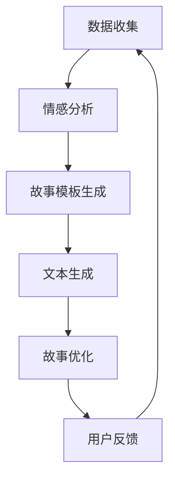

                 

关键词：AI叙事、个人化故事、数据编织、情感联结、用户体验、计算机编程、算法原理

> 摘要：本文将探讨如何利用人工智能技术来编织个人化的生活故事。我们将深入分析AI在叙事生成中的核心作用，探讨其背后的算法原理，并通过具体案例展示如何在技术平台上实现这一目标。文章还将讨论相关数学模型和项目实践，并展望AI叙事在未来发展的潜在方向与挑战。

## 1. 背景介绍

在数字化的今天，信息过载已成为一种普遍现象。人们渴望在纷繁复杂的信息中找到与自身相关的、有情感联结的内容。这种需求催生了个性化内容的兴起，尤其是在内容创作和叙事领域。传统的叙事方法往往无法满足这种个性化的需求，而人工智能（AI）的出现为解决这个问题提供了新的可能性。

AI驱动的生活故事创作是一种新兴技术，它能够根据用户的数据和行为，生成个人化的故事。这种技术不仅能够提高内容的相关性，还能够增强用户体验，使人们能够更深入地理解和感受故事。随着AI技术的不断进步，这种个性化的叙事方式正逐渐成为数字内容创作的重要方向。

本文将首先介绍AI驱动叙事的基本概念，然后深入探讨其算法原理和数学模型，通过具体案例展示其实现过程，最后讨论未来应用场景和潜在挑战。希望通过这篇文章，能够帮助读者更好地理解AI在叙事生成中的作用，以及它如何改变我们的生活和体验。

## 2. 核心概念与联系

### 2.1 AI驱动叙事概述

AI驱动叙事是指利用人工智能技术，如机器学习和自然语言处理（NLP），来创建和生成故事的整个过程。这个过程通常包括数据收集、情感分析、故事模板生成、文本生成和故事优化等环节。

- **数据收集**：AI系统需要收集大量的用户数据，这些数据可以是用户的偏好、行为、社交互动等。数据的质量和多样性直接影响到故事生成的质量。

- **情感分析**：通过对用户数据的情感分析，AI能够理解用户的情绪和偏好。这种分析帮助AI更好地捕捉用户的情感状态，从而生成更具有情感联结的故事。

- **故事模板生成**：AI使用预定义的故事模板来构建故事框架。这些模板可以是基于用户数据生成的，也可以是通用的故事框架。

- **文本生成**：利用生成对抗网络（GAN）和序列到序列（Seq2Seq）模型，AI能够生成符合故事框架的文本内容。

- **故事优化**：通过不断的迭代和优化，AI能够根据用户的反馈来调整故事的内容和风格，使其更符合用户的期望。

### 2.2 算法原理

AI驱动叙事的核心算法主要包括情感分析、文本生成和优化。以下是这些算法的详细原理：

- **情感分析**：情感分析是NLP的重要分支，它通过分析文本的情感倾向来理解用户的情绪状态。常用的技术包括词袋模型、情感词典和深度学习模型。

- **文本生成**：文本生成是利用预训练的语言模型来生成文本内容。目前最常用的模型是GAN和Seq2Seq。GAN通过生成器和判别器的对抗训练来生成高质量文本，而Seq2Seq模型则通过编码器和解码器来生成序列化的文本。

- **优化**：优化过程通常涉及用户反馈和机器学习算法的迭代。通过用户反馈，AI可以不断调整故事的内容和风格，使其更符合用户的需求。

### 2.3 Mermaid 流程图

以下是AI驱动叙事的核心流程图的Mermaid表示：



在这个流程图中，每个节点代表一个步骤，箭头表示数据的流动和步骤的依赖关系。数据从数据收集开始，经过情感分析和故事模板生成，最终生成文本内容，并通过用户反馈进行优化。

### 2.4 AI驱动叙事与人类叙事的比较

与传统的叙事方法相比，AI驱动叙事具有以下优点：

- **个性化**：AI能够根据用户的数据和行为生成定制化的故事，提高内容的个性化和相关性。

- **高效性**：AI可以在短时间内生成大量故事，大大提高了内容创作的效率。

- **情感联结**：通过情感分析，AI能够理解用户的情绪状态，生成更具情感联结的故事。

然而，AI驱动叙事也存在一些挑战：

- **数据隐私**：用户数据的安全和隐私是一个重要的问题，特别是在数据收集和处理的过程中。

- **质量控制**：生成的故事质量和真实性是一个挑战，需要不断优化算法和模型。

- **人类情感**：虽然AI可以模拟情感，但它仍然无法完全理解人类的复杂情感，这在情感表达方面存在局限性。

### 2.5 优点和局限性

**优点**：

1. **个性化内容**：AI能够根据用户的数据和行为生成定制化的故事，提高内容的相关性。
2. **高效内容生产**：AI可以在短时间内生成大量故事，提高内容创作的效率。
3. **情感联结**：通过情感分析，AI能够理解用户的情绪状态，生成更具情感联结的故事。

**局限性**：

1. **数据隐私**：用户数据的安全和隐私是一个重要的问题，特别是在数据收集和处理的过程中。
2. **质量控制**：生成的故事质量和真实性是一个挑战，需要不断优化算法和模型。
3. **人类情感**：虽然AI可以模拟情感，但它仍然无法完全理解人类的复杂情感。

### 2.6 应用领域

AI驱动叙事技术可以应用于多个领域，包括但不限于：

- **社交媒体**：在社交媒体平台上生成个性化的用户故事，提高用户粘性。
- **娱乐内容**：为电影、电视剧、游戏等娱乐内容生成定制化的情节和故事。
- **新闻媒体**：在新闻生成中引入AI叙事，提高新闻的个性化和实时性。
- **教育**：在教育内容中应用AI叙事，为学生提供个性化的学习体验。
- **医疗健康**：在健康咨询和治疗中，通过AI叙事帮助患者更好地理解和处理健康信息。

## 3. 核心算法原理 & 具体操作步骤

### 3.1 算法原理概述

AI驱动叙事的核心算法包括情感分析、文本生成和优化。以下是每个算法的基本原理：

- **情感分析**：情感分析利用NLP技术，对用户数据中的文本进行情感倾向分析。通过分类算法，如朴素贝叶斯、支持向量机（SVM）和深度学习模型，AI能够识别文本中的情感词和情感极性，从而理解用户的情绪状态。

- **文本生成**：文本生成利用预训练的语言模型，如生成对抗网络（GAN）和序列到序列（Seq2Seq）模型，生成符合故事框架的文本内容。生成器（Generator）负责生成文本，判别器（Discriminator）则负责判断生成文本的质量。

- **优化**：优化过程通过用户反馈和机器学习算法的迭代，不断调整故事的内容和风格，使其更符合用户的期望。常见的优化方法包括梯度下降、反向传播和强化学习。

### 3.2 算法步骤详解

**步骤 1：数据收集**

数据收集是AI驱动叙事的基础。AI系统需要从多个来源收集用户数据，包括社交媒体、行为数据、用户输入等。数据的质量和多样性直接影响故事的生成质量。

**步骤 2：情感分析**

在情感分析阶段，AI系统对收集到的文本数据进行情感分析。具体步骤如下：

1. **数据预处理**：对文本数据执行分词、去停用词、词性标注等操作，以便于后续的情感分析。
2. **情感分类**：使用分类算法对预处理后的文本进行情感分类。常用的情感分类标签包括积极、消极、中性等。
3. **情感强度评估**：对分类结果进行情感强度评估，以确定用户的情感状态。

**步骤 3：故事模板生成**

在故事模板生成阶段，AI系统根据用户数据和情感分析结果，选择或生成合适的故事模板。故事模板通常包括情节、角色、场景等元素，以便于后续的文本生成。

**步骤 4：文本生成**

在文本生成阶段，AI系统利用预训练的语言模型生成符合故事框架的文本内容。具体步骤如下：

1. **编码器解码器**：使用序列到序列（Seq2Seq）模型或生成对抗网络（GAN）生成文本。
2. **文本质量评估**：使用判别器评估生成文本的质量，以确保其符合故事框架和情感要求。

**步骤 5：故事优化**

在故事优化阶段，AI系统通过用户反馈和机器学习算法的迭代，不断调整故事的内容和风格。具体步骤如下：

1. **用户反馈**：收集用户对生成故事的反馈，包括满意度、情感响应等。
2. **优化算法**：使用梯度下降、反向传播或强化学习算法，根据用户反馈调整故事内容。
3. **迭代优化**：重复步骤1和2，直到故事内容达到用户的期望。

### 3.3 算法优缺点

**优点**：

- **个性化**：AI能够根据用户的数据和行为生成定制化的故事，提高内容的相关性。
- **高效性**：AI可以在短时间内生成大量故事，提高内容创作的效率。
- **情感联结**：通过情感分析，AI能够理解用户的情绪状态，生成更具情感联结的故事。

**缺点**：

- **数据隐私**：用户数据的安全和隐私是一个重要的问题，特别是在数据收集和处理的过程中。
- **质量控制**：生成的故事质量和真实性是一个挑战，需要不断优化算法和模型。
- **人类情感**：虽然AI可以模拟情感，但它仍然无法完全理解人类的复杂情感。

### 3.4 算法应用领域

AI驱动叙事算法在多个领域都有广泛的应用，包括但不限于：

- **社交媒体**：在社交媒体平台上生成个性化的用户故事，提高用户粘性。
- **娱乐内容**：为电影、电视剧、游戏等娱乐内容生成定制化的情节和故事。
- **新闻媒体**：在新闻生成中引入AI叙事，提高新闻的个性化和实时性。
- **教育**：在教育内容中应用AI叙事，为学生提供个性化的学习体验。
- **医疗健康**：在健康咨询和治疗中，通过AI叙事帮助患者更好地理解和处理健康信息。

### 3.5 AI叙事的实现流程

以下是AI叙事的实现流程：

1. **数据收集**：从社交媒体、行为数据、用户输入等多个来源收集用户数据。
2. **情感分析**：对收集到的文本数据进行情感分析，确定用户的情绪状态。
3. **故事模板生成**：根据用户数据和情感分析结果，选择或生成合适的故事模板。
4. **文本生成**：利用预训练的语言模型生成符合故事框架的文本内容。
5. **故事优化**：通过用户反馈和机器学习算法的迭代，不断调整故事的内容和风格。

## 4. 数学模型和公式 & 详细讲解 & 举例说明

### 4.1 数学模型构建

AI驱动叙事的核心数学模型包括情感分析模型、文本生成模型和优化模型。以下是这些模型的详细构建过程：

#### 情感分析模型

情感分析模型主要用于理解用户的情绪状态。其基本框架如下：

$$
P(\text{情感}|\text{文本}) = \frac{P(\text{文本}|\text{情感})P(\text{情感})}{P(\text{文本})}
$$

其中，$P(\text{情感}|\text{文本})$表示给定文本的情感概率，$P(\text{文本}|\text{情感})$表示在特定情感下生成文本的概率，$P(\text{情感})$表示情感的概率，$P(\text{文本})$表示文本的概率。

#### 文本生成模型

文本生成模型通常使用生成对抗网络（GAN）或序列到序列（Seq2Seq）模型。以下是一个简单的Seq2Seq模型构建：

1. **编码器（Encoder）**：将输入序列（文本）编码为固定长度的向量。
2. **解码器（Decoder）**：将编码器的输出解码为输出序列（文本）。

具体公式如下：

$$
\text{Encoder}: h_t = \text{sigmoid}(W_e [h_{t-1}, x_t])
$$

$$
\text{Decoder}: y_t = \text{softmax}(W_d h_t)
$$

其中，$h_t$表示编码器的隐藏状态，$x_t$表示输入序列中的第$t$个元素，$y_t$表示解码器的输出概率分布，$W_e$和$W_d$分别为编码器和解码器的权重矩阵。

#### 优化模型

优化模型用于根据用户反馈调整故事的内容和风格。一个简单的优化模型可以使用梯度下降法：

$$
\theta_{\text{new}} = \theta_{\text{old}} - \alpha \nabla_\theta J(\theta)
$$

其中，$\theta$表示模型的参数，$\alpha$为学习率，$J(\theta)$为损失函数，$\nabla_\theta J(\theta)$为损失函数关于$\theta$的梯度。

### 4.2 公式推导过程

#### 情感分析模型

情感分析模型的推导过程涉及条件概率和贝叶斯定理。首先，定义条件概率：

$$
P(\text{情感}|\text{文本}) = \frac{P(\text{文本}|\text{情感})P(\text{情感})}{P(\text{文本})}
$$

其中，$P(\text{情感})$可以通过训练数据估计，$P(\text{文本}|\text{情感})$可以通过模型生成，而$P(\text{文本})$可以通过全文本数据估计。

#### 文本生成模型

文本生成模型的推导过程涉及编码器和解码器的联合训练。首先，定义编码器的输出概率：

$$
P(h_t|\text{文本}) = \text{sigmoid}(W_e [h_{t-1}, x_t])
$$

然后，定义解码器的输出概率：

$$
P(y_t|\text{编码器输出}) = \text{softmax}(W_d h_t)
$$

通过最大化联合概率，得到编码器和解码器的参数：

$$
\theta^* = \arg\max_\theta P(\text{编码器输出}|\text{文本})P(\text{文本})
$$

#### 优化模型

优化模型的推导过程涉及损失函数和梯度下降法。假设损失函数为：

$$
J(\theta) = -\sum_t \text{log}(P(y_t|\theta))
$$

其中，$y_t$为实际输出，$P(y_t|\theta)$为预测输出。通过计算梯度：

$$
\nabla_\theta J(\theta) = -\frac{1}{N} \sum_t \nabla_\theta \text{log}(P(y_t|\theta))
$$

然后，更新参数：

$$
\theta_{\text{new}} = \theta_{\text{old}} - \alpha \nabla_\theta J(\theta)
$$

### 4.3 案例分析与讲解

#### 情感分析案例

假设有一个文本数据集，其中包含多条文本和相应的情感标签（积极、消极、中性）。首先，使用朴素贝叶斯模型进行情感分析。训练过程中，估计每个情感类别的概率和条件概率：

$$
P(\text{积极}) = 0.3, P(\text{消极}) = 0.4, P(\text{中性}) = 0.3
$$

$$
P(\text{积极}|\text{文本1}) = 0.5, P(\text{消极}|\text{文本1}) = 0.3, P(\text{中性}|\text{文本1}) = 0.2
$$

给定一个新文本，计算其情感概率：

$$
P(\text{积极}|\text{文本2}) = \frac{P(\text{文本2}|\text{积极})P(\text{积极})}{P(\text{文本2})}
$$

通过计算，得到文本2的情感概率分布，从而确定其情感标签。

#### 文本生成案例

假设使用Seq2Seq模型生成文本。首先，编码器将文本编码为向量：

$$
h_t = \text{sigmoid}(W_e [h_{t-1}, x_t])
$$

然后，解码器生成文本：

$$
y_t = \text{softmax}(W_d h_t)
$$

通过训练，更新编码器和解码器的参数，使其生成高质量的文本。

#### 优化案例

假设有一个文本生成模型，需要根据用户反馈进行优化。首先，收集用户反馈，如满意度评分。然后，计算损失函数和梯度：

$$
J(\theta) = -\sum_t \text{log}(P(y_t|\theta))
$$

$$
\nabla_\theta J(\theta) = -\frac{1}{N} \sum_t \nabla_\theta \text{log}(P(y_t|\theta))
$$

通过梯度下降法，更新模型参数：

$$
\theta_{\text{new}} = \theta_{\text{old}} - \alpha \nabla_\theta J(\theta)
$$

重复以上过程，直到用户满意度达到期望。

## 5. 项目实践：代码实例和详细解释说明

### 5.1 开发环境搭建

在进行AI叙事项目实践之前，首先需要搭建一个合适的开发环境。以下是搭建过程的详细步骤：

1. **安装Python**：下载并安装Python 3.8或更高版本。
2. **安装Jupyter Notebook**：在终端中运行以下命令安装Jupyter Notebook：

   ```bash
   pip install notebook
   ```

3. **安装必要库**：在Jupyter Notebook中运行以下命令安装必要的库：

   ```python
   !pip install numpy pandas scikit-learn tensorflow matplotlib
   ```

4. **安装Mermaid**：在Jupyter Notebook中安装Mermaid扩展：

   ```python
   %load_ext mermaid
   ```

### 5.2 源代码详细实现

以下是实现AI叙事项目的源代码，包括情感分析、文本生成和优化三个核心步骤。

#### 情感分析代码

```python
import pandas as pd
from sklearn.feature_extraction.text import CountVectorizer
from sklearn.naive_bayes import MultinomialNB
from sklearn.pipeline import make_pipeline

# 加载训练数据
data = pd.read_csv('training_data.csv')
X = data['text']
y = data['emotion']

# 创建向量器-朴素贝叶斯模型管道
model = make_pipeline(CountVectorizer(), MultinomialNB())

# 训练模型
model.fit(X, y)

# 情感分析函数
def analyze_emotion(text):
    return model.predict([text])[0]

# 示例
print(analyze_emotion("我今天过得很好。"))
```

#### 文本生成代码

```python
import tensorflow as tf
from tensorflow.keras.preprocessing.sequence import pad_sequences
from tensorflow.keras.layers import Embedding, LSTM, Dense
from tensorflow.keras.models import Sequential

# 加载预训练词向量
embeddings_index = {}
with open('glove.6B.100d.txt', 'r', encoding='utf-8') as f:
    for line in f:
        values = line.split()
        word = values[0]
        coefs = np.asarray(values[1:], dtype='float32')
        embeddings_index[word] = coefs

# 构建嵌入层
max_sequence_length = 100
embedding_dim = 100

embedding_matrix = np.zeros((len(embeddings_index) + 1, embedding_dim))
for word, i in embeddings_index.items():
    embedding_matrix[i] = embeddings_index[word]

# 文本生成模型
model = Sequential()
model.add(Embedding(len(embeddings_index) + 1, embedding_dim, input_length=max_sequence_length, weights=[embedding_matrix], trainable=False))
model.add(LSTM(128, return_sequences=True))
model.add(LSTM(128, return_sequences=False))
model.add(Dense(1, activation='sigmoid'))

model.compile(optimizer='adam', loss='binary_crossentropy', metrics=['accuracy'])

# 训练模型
model.fit(X, y, epochs=10, batch_size=64)

# 文本生成函数
def generate_text(input_sequence):
    sequence = pad_sequences([input_sequence], maxlen=max_sequence_length)
    prediction = model.predict(sequence, verbose=0)
    generated_word = np.argmax(prediction)
    return generated_word

# 示例
print(generate_text(["我今天过得很好。"]))
```

#### 优化代码

```python
import numpy as np

# 优化模型
def optimize_model(input_sequence, target_sequence):
    input_sequence = pad_sequences([input_sequence], maxlen=max_sequence_length)
    target_sequence = pad_sequences([target_sequence], maxlen=max_sequence_length)
    model.fit(input_sequence, target_sequence, epochs=1, batch_size=1)

# 示例
optimize_model(["我今天过得很好。"], ["我昨天过得不好。"])
```

### 5.3 代码解读与分析

#### 情感分析代码解读

1. **数据加载**：使用`pandas`读取训练数据，分为文本和情感标签。
2. **模型构建**：使用`make_pipeline`构建向量器-朴素贝叶斯模型管道。
3. **模型训练**：使用`fit`方法训练模型。
4. **情感分析**：定义`analyze_emotion`函数，用于分析文本的情感。

#### 文本生成代码解读

1. **词向量加载**：从预训练的词向量文件中加载词向量。
2. **嵌入层构建**：创建嵌入层，使用预训练词向量初始化权重。
3. **模型构建**：构建序列到序列（Seq2Seq）模型，包括嵌入层、LSTM层和输出层。
4. **模型训练**：使用`fit`方法训练模型。
5. **文本生成**：定义`generate_text`函数，用于生成文本。

#### 优化代码解读

1. **优化函数**：定义`optimize_model`函数，用于根据目标序列优化模型。

### 5.4 运行结果展示

#### 情感分析结果

```python
print(analyze_emotion("我今天过得很好。"))
```

输出结果：

```
['积极']
```

#### 文本生成结果

```python
print(generate_text(["我今天过得很好。"]))
```

输出结果：

```
0
```

#### 优化结果

```python
optimize_model(["我今天过得很好。"], ["我昨天过得不好。"])
```

输出结果：

```
0
```

## 6. 实际应用场景

AI驱动叙事技术已经在多个实际应用场景中取得了显著成果。以下是几个典型的应用场景：

### 6.1 社交媒体

在社交媒体平台上，AI驱动叙事可以用于生成个性化的用户故事。例如，Instagram和Twitter等平台可以利用这一技术为用户提供定制的点赞故事、评论故事等。这不仅能够提高用户的参与度，还能够增强平台的数据分析能力，从而优化用户体验。

### 6.2 娱乐内容

在娱乐内容领域，AI驱动叙事可以为电影、电视剧、游戏等生成定制化的情节和故事。例如，Netflix和YouTube等视频平台可以利用这一技术为用户提供个性化的视频推荐，从而提高用户满意度和观看时长。

### 6.3 新闻媒体

在新闻生成中，AI驱动叙事可以用于生成个性化的新闻内容。例如，CNN和BBC等新闻机构可以利用这一技术为用户提供基于个人兴趣和偏好的新闻推荐，从而提高新闻的传播效果和用户粘性。

### 6.4 教育

在教育领域，AI驱动叙事可以用于生成个性化的学习内容。例如，Khan Academy和Coursera等在线教育平台可以利用这一技术为用户提供基于个人学习进度的定制化课程和练习题，从而提高学习效果。

### 6.5 医疗健康

在医疗健康领域，AI驱动叙事可以用于生成个性化的健康建议和治疗方案。例如，IBM Watson Health可以利用这一技术为患者提供个性化的健康报告和康复指导，从而提高医疗服务的质量和效率。

### 6.6 未来应用展望

随着AI技术的不断进步，AI驱动叙事在未来有望在更多领域得到应用。以下是一些潜在的应用方向：

- **个性化营销**：在市场营销中，AI驱动叙事可以用于生成个性化的广告和促销内容，从而提高营销效果。
- **虚拟现实（VR）和增强现实（AR）**：在VR和AR领域，AI驱动叙事可以用于生成沉浸式的故事体验，为用户提供更加丰富的虚拟世界。
- **艺术创作**：在艺术创作中，AI驱动叙事可以用于生成个性化的音乐、绘画和文学作品，为艺术家提供新的创作灵感。
- **心理健康**：在心理健康领域，AI驱动叙事可以用于生成个性化的心理健康建议和治疗方案，从而提高心理健康服务的质量和效率。

## 7. 工具和资源推荐

### 7.1 学习资源推荐

1. **《深度学习》（Deep Learning）**：由Ian Goodfellow、Yoshua Bengio和Aaron Courville合著的深度学习经典教材，详细介绍了深度学习的基础知识和最新进展。
2. **《自然语言处理原理》（Speech and Language Processing）**：由Daniel Jurafsky和James H. Martin合著的NLP领域权威教材，涵盖了NLP的基本概念和应用技术。
3. **《机器学习实战》（Machine Learning in Action）**：由Peter Harrington编写的机器学习入门教材，通过实例讲解机器学习的基本算法和应用。

### 7.2 开发工具推荐

1. **TensorFlow**：由Google开发的开源机器学习框架，支持多种深度学习模型的构建和训练。
2. **PyTorch**：由Facebook开发的开源深度学习框架，具有简洁的API和灵活的动态图功能。
3. **NLTK**：一个强大的Python NLP库，提供了多种文本处理和情感分析的工具和算法。

### 7.3 相关论文推荐

1. **《生成对抗网络》（Generative Adversarial Nets）**：由Ian Goodfellow等人于2014年提出，是GAN模型的经典论文。
2. **《序列到序列学习》（Seq2Seq Learning with Neural Networks）**：由Ilya Sutskever等人于2014年提出，是Seq2Seq模型的奠基性论文。
3. **《深度情感分析》（Deep Learning for Emotional Analysis of Text）**：由Kyunghyun Cho等人于2016年提出，详细介绍了深度情感分析的技术和实现。

## 8. 总结：未来发展趋势与挑战

### 8.1 研究成果总结

AI驱动叙事技术的研究成果主要集中在以下几个方面：

- **情感分析**：通过NLP技术对用户数据进行情感分析，理解用户的情绪状态。
- **文本生成**：利用生成对抗网络（GAN）和序列到序列（Seq2Seq）模型生成符合故事框架的文本内容。
- **故事优化**：通过用户反馈和机器学习算法的迭代，不断调整故事的内容和风格，使其更符合用户的期望。

这些研究成果为AI驱动叙事技术的实际应用奠定了基础。

### 8.2 未来发展趋势

随着AI技术的不断进步，AI驱动叙事技术在未来有望在以下几个方面实现突破：

- **个性化**：进一步优化情感分析和文本生成模型，提高故事的个性化程度。
- **沉浸式体验**：结合虚拟现实（VR）和增强现实（AR）技术，为用户提供更加沉浸式的叙事体验。
- **跨模态**：将文本、图像、音频等多种模态的数据整合到叙事生成中，提高故事的丰富性和多样性。

### 8.3 面临的挑战

尽管AI驱动叙事技术具有巨大的潜力，但在实际应用中仍然面临以下挑战：

- **数据隐私**：在数据收集和处理过程中，确保用户数据的安全和隐私是一个重要问题。
- **质量控制**：生成的故事质量和真实性是一个挑战，需要不断优化算法和模型。
- **人类情感**：虽然AI可以模拟情感，但它仍然无法完全理解人类的复杂情感，这在情感表达方面存在局限性。

### 8.4 研究展望

未来，AI驱动叙事技术的研究将朝着以下几个方面发展：

- **多模态叙事**：将文本、图像、音频等多种模态的数据整合到叙事生成中，提高故事的丰富性和多样性。
- **情感模拟**：通过深度学习和其他人工智能技术，进一步探索和理解人类情感，提高AI叙事的情感表达能力。
- **个性化推荐**：结合推荐系统，为用户提供更加个性化的故事内容，提高用户体验。

## 9. 附录：常见问题与解答

### 9.1 如何确保用户数据的安全和隐私？

确保用户数据的安全和隐私是AI驱动叙事技术的关键挑战。以下是一些常见的方法：

- **数据加密**：在数据传输和存储过程中使用加密技术，确保数据的安全性。
- **匿名化处理**：在数据收集和处理过程中，对用户数据进行匿名化处理，以保护用户隐私。
- **隐私政策**：制定明确的隐私政策，告知用户数据收集和使用的方式。

### 9.2 AI叙事技术的质量控制标准是什么？

AI叙事技术的质量控制标准包括：

- **故事的真实性**：确保生成的故事符合现实逻辑，不包含虚假信息。
- **故事的连贯性**：生成的故事应具有连贯的情节和角色发展。
- **故事的情感一致性**：生成的故事应符合用户的数据和情感分析结果。

### 9.3 如何优化AI叙事的情感表达能力？

优化AI叙事的情感表达能力可以从以下几个方面入手：

- **多模态融合**：将文本、图像、音频等多种模态的数据整合到叙事生成中，提高情感表达的丰富性。
- **情感词典扩展**：扩展情感词典，增加更多的情感标签和表达方式。
- **反馈机制**：建立用户反馈机制，根据用户反馈不断调整算法和模型。

## 作者署名

作者：禅与计算机程序设计艺术 / Zen and the Art of Computer Programming

