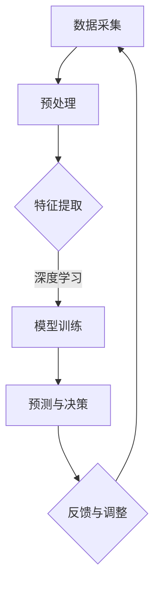
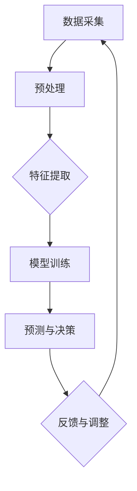

                 

关键词：人工智能、即时感知、时空压缩、算法、数学模型、实践应用

> 摘要：本文深入探讨了人工智能（AI）如何通过其先进算法和数学模型，实现时空压缩，从而为人类带来即时的感知体验。文章首先介绍了AI在体验压缩方面的背景和重要性，随后详细解析了核心算法原理和数学模型，并通过实际项目案例展示了其在不同领域的应用。最后，文章对AI在即时感知领域的发展趋势和挑战进行了展望，并提供了相关的学习资源和开发工具推荐。

## 1. 背景介绍

随着科技的不断进步，人工智能（AI）已经成为推动社会发展的核心动力。从最初的自动化系统到如今的高度智能化应用，AI已经深刻地改变了我们的生活方式。然而，在AI的技术演进过程中，一个重要但常常被忽视的方面是：如何提升人类的感知体验，实现更为即时和高效的互动。

传统的计算机系统往往需要花费大量时间来处理数据、生成结果，从而导致了延迟。这种延迟不仅降低了用户体验，也在某些应用场景中可能造成严重的后果。例如，自动驾驶汽车需要即时感知周围环境并做出反应，医疗诊断系统需要在几秒钟内分析影像并提供结果。

为了解决这一问题，AI研究人员开始探索如何通过算法和数学模型来实现时空压缩，即在保持数据完整性和准确性的前提下，减少处理时间和响应延迟。即时感知成为AI领域的一个重要研究方向，它涉及到从数据采集、处理到反馈的各个环节，旨在提升人类与智能系统的交互效率。

本文旨在系统地探讨即时感知在AI中的应用，分析其背后的算法原理和数学模型，并通过具体案例展示其在实际项目中的应用效果。此外，文章还将对未来的发展趋势和面临的挑战进行展望，以期为相关领域的研究者和开发者提供有价值的参考。

## 2. 核心概念与联系

### 2.1 时空压缩的定义与意义

时空压缩是指通过特定的算法和计算模型，在保证数据准确性的同时，显著缩短数据处理和响应的时间，从而实现即时的感知和反馈。在AI领域，时空压缩的核心在于如何高效地处理和利用大量数据，使其能够快速转化为有用的信息。

时空压缩的意义在于：

1. **提高交互效率**：在即时感知的场景中，快速响应可以显著提升用户满意度。例如，智能客服系统能够在几毫秒内回答用户的问题，而自动驾驶汽车需要在几毫秒内做出决策。

2. **增强安全性**：在某些高风险场景下，如自动驾驶、医疗诊断等，即时感知可以减少因延迟导致的潜在危险。

3. **扩展应用范围**：时空压缩使得许多以前无法实现的智能应用成为可能。例如，实时环境监测系统可以随时调整监测策略，以应对不断变化的环境。

### 2.2 关键算法与数学模型的介绍

为了实现时空压缩，AI领域发展了一系列关键算法和数学模型。以下是其中几个核心概念的介绍：

#### 2.2.1 深度学习算法

深度学习算法是AI领域最为重要的算法之一，其核心在于通过多层神经网络模型，对大量数据进行特征提取和模式识别。深度学习算法在图像识别、语音识别和自然语言处理等领域取得了显著的成果，其高效的处理能力是实现时空压缩的关键。

#### 2.2.2 神经网络加速技术

神经网络加速技术是另一类重要的算法，旨在通过优化计算过程和硬件设计，提高深度学习算法的运行速度。常见的技术包括模型剪枝、量化、并行计算和硬件加速等。这些技术可以大幅减少模型的计算复杂度，从而实现更快的响应速度。

#### 2.2.3 强化学习算法

强化学习算法通过智能体与环境互动，不断调整策略以实现最优目标。在即时感知应用中，强化学习可以用于决策系统，如自动驾驶和游戏AI。强化学习算法的优势在于其自适应性，能够根据实时反馈进行动态调整。

#### 2.2.4 数学模型

除了算法，数学模型也是实现时空压缩的重要工具。常见的数学模型包括线性回归、支持向量机、贝叶斯网络等。这些模型能够通过数学推导和优化，实现数据的快速处理和预测。

### 2.3 Mermaid 流程图

以下是一个简单的Mermaid流程图，展示了一个典型的即时感知系统的工作流程：



### 2.4 核心概念之间的关系

上述核心概念相互关联，共同构成了即时感知系统的理论基础。数据采集是整个过程的起点，预处理和特征提取是数据处理的中间环节，模型训练和预测与决策是核心，而反馈与调整则确保系统在不断优化。

通过这些核心概念和算法的有机结合，即时感知系统可以在极短的时间内完成数据的采集、处理和响应，从而实现真正的即时感知。

## 3. 核心算法原理 & 具体操作步骤

### 3.1 算法原理概述

在即时感知系统中，核心算法的原理主要涉及数据的快速处理和预测。以下将介绍几种常见的核心算法及其原理：

#### 3.1.1 深度学习算法

深度学习算法基于多层神经网络结构，通过对大量数据进行学习，提取特征并构建模型。其原理可以概括为：

1. **数据输入**：将采集到的数据输入到神经网络中。
2. **特征提取**：通过逐层传播，网络中的神经元对数据进行特征提取和抽象。
3. **模型训练**：利用标注数据，通过反向传播算法不断调整网络参数，优化模型性能。
4. **预测与决策**：在测试数据上，利用训练好的模型进行预测和决策。

#### 3.1.2 神经网络加速技术

神经网络加速技术的原理主要包括：

1. **模型剪枝**：通过去除网络中不必要的权重，减少模型的复杂度，从而提高计算速度。
2. **量化**：将浮点数参数转换为低精度的整数表示，降低计算复杂度。
3. **并行计算**：利用多核处理器或分布式计算，同时处理多个计算任务，提高整体计算效率。
4. **硬件加速**：通过专用硬件（如GPU、TPU）优化计算过程，提高计算速度。

#### 3.1.3 强化学习算法

强化学习算法的原理如下：

1. **环境建模**：将外部环境建模为一个状态空间，每个状态对应一个环境的状态。
2. **策略学习**：通过智能体与环境互动，学习最优策略，以最大化长期回报。
3. **策略调整**：根据实时反馈，不断调整策略，以实现最优决策。

### 3.2 算法步骤详解

#### 3.2.1 深度学习算法

1. **数据采集**：从各种来源采集原始数据，如图像、音频和文本。
2. **预处理**：对采集到的数据进行清洗、归一化等预处理操作，使其适合模型训练。
3. **特征提取**：通过卷积神经网络（CNN）、循环神经网络（RNN）等模型，对预处理后的数据进行特征提取。
4. **模型训练**：使用预处理后的数据和标注信息，通过反向传播算法训练神经网络模型。
5. **预测与决策**：在测试数据上，利用训练好的模型进行预测和决策。

#### 3.2.2 神经网络加速技术

1. **模型剪枝**：对原始模型进行剪枝，去除不必要的权重和层。
2. **量化**：对模型的参数进行量化，降低模型的复杂度。
3. **并行计算**：利用多核处理器或分布式计算框架，实现模型的并行计算。
4. **硬件加速**：将模型部署到GPU、TPU等硬件设备上，利用其高效的计算能力。

#### 3.2.3 强化学习算法

1. **环境建模**：构建一个模拟环境，模拟真实场景中的各种情况。
2. **策略学习**：通过智能体与环境互动，收集经验并学习最优策略。
3. **策略调整**：根据实时反馈，不断调整策略，以实现最优决策。

### 3.3 算法优缺点

#### 3.3.1 深度学习算法

**优点**：

- **高效的特征提取能力**：能够从大量数据中提取出有效的特征，提高模型性能。
- **广泛的适用性**：适用于图像识别、语音识别、自然语言处理等多种领域。

**缺点**：

- **训练时间较长**：需要大量数据和计算资源进行训练。
- **解释性较差**：深度学习模型通常是一个黑盒子，难以解释其内部工作机制。

#### 3.3.2 神经网络加速技术

**优点**：

- **计算速度快**：通过模型剪枝、量化、并行计算和硬件加速，大幅提高计算效率。
- **资源消耗低**：使用低精度的整数计算，降低硬件资源的需求。

**缺点**：

- **精度损失**：模型剪枝和量化可能会导致模型精度的降低。
- **兼容性较差**：不同硬件平台的加速技术可能存在兼容性问题。

#### 3.3.3 强化学习算法

**优点**：

- **自适应性**：能够根据实时反馈调整策略，实现最优决策。
- **应用广泛**：适用于动态决策和优化问题，如自动驾驶、游戏AI等。

**缺点**：

- **收敛速度慢**：强化学习通常需要大量的互动和试错过程，收敛速度较慢。
- **样本效率低**：在训练过程中，需要大量样本数据才能获得良好的性能。

### 3.4 算法应用领域

这些核心算法在即时感知领域有广泛的应用。以下是几个典型的应用领域：

- **自动驾驶**：利用深度学习和强化学习算法，自动驾驶汽车可以实时感知周围环境并做出驾驶决策。
- **智能客服**：通过语音识别和自然语言处理算法，智能客服系统可以即时响应用户的咨询。
- **医疗诊断**：利用深度学习算法，医疗诊断系统可以在几秒内分析影像并提供诊断结果。
- **智能家居**：通过感知环境和用户行为，智能家居系统可以提供个性化的服务和互动体验。

### 3.5 Mermaid 流程图

以下是一个扩展的Mermaid流程图，展示了即时感知系统的完整工作流程，包括数据采集、预处理、特征提取、模型训练、预测与决策以及反馈与调整等环节：



## 4. 数学模型和公式 & 详细讲解 & 举例说明

### 4.1 数学模型构建

在即时感知系统中，数学模型起到了关键作用。以下是几个常见的数学模型及其构建过程。

#### 4.1.1 线性回归模型

线性回归模型是最简单的数学模型之一，主要用于预测一个连续变量。其公式如下：

\[ y = \beta_0 + \beta_1 \cdot x \]

其中，\( y \) 是预测的目标变量，\( x \) 是输入变量，\( \beta_0 \) 和 \( \beta_1 \) 是模型的参数。线性回归模型的构建过程主要包括以下步骤：

1. **数据收集**：收集目标变量 \( y \) 和输入变量 \( x \) 的数据。
2. **数据预处理**：对数据进行清洗、归一化等预处理操作。
3. **模型训练**：使用最小二乘法或其他优化算法，计算参数 \( \beta_0 \) 和 \( \beta_1 \)。
4. **模型评估**：使用验证集或测试集评估模型的性能。

#### 4.1.2 支持向量机（SVM）模型

支持向量机是一种强大的分类模型，可以用于二分类和多元分类。其公式如下：

\[ w \cdot x + b = 0 \]

其中，\( w \) 是权重向量，\( x \) 是特征向量，\( b \) 是偏置。SVM模型的构建过程主要包括以下步骤：

1. **数据收集**：收集分类数据，包括特征向量 \( x \) 和标签 \( y \)。
2. **特征提取**：对特征向量进行降维或特征选择，提高模型的效率。
3. **模型训练**：使用SVM算法计算权重向量 \( w \) 和偏置 \( b \)。
4. **模型评估**：使用验证集或测试集评估模型的性能。

#### 4.1.3 贝叶斯网络模型

贝叶斯网络是一种概率图模型，用于表示变量之间的依赖关系。其公式如下：

\[ P(X=x) = \prod_{i=1}^{n} P(X_i=x_i | X_{i-1}=x_{i-1}, \ldots, X_1=x_1) \]

其中，\( X \) 是随机变量集合，\( x \) 是每个变量的取值。贝叶斯网络模型的构建过程主要包括以下步骤：

1. **数据收集**：收集变量之间的依赖关系数据。
2. **网络构建**：使用概率图论方法，构建贝叶斯网络结构。
3. **参数估计**：使用最大似然估计或贝叶斯估计方法，计算网络中的参数。
4. **模型评估**：使用验证集或测试集评估模型的性能。

### 4.2 公式推导过程

以下是线性回归模型的推导过程：

假设我们有一个包含 \( n \) 个样本的数据集 \( \{x_1, y_1\}, \{x_2, y_2\}, \ldots, \{x_n, y_n\} \)，其中 \( x_i \) 是输入变量，\( y_i \) 是目标变量。

线性回归模型的公式为：

\[ y = \beta_0 + \beta_1 \cdot x \]

我们需要通过最小二乘法来求解 \( \beta_0 \) 和 \( \beta_1 \)。

首先，定义损失函数 \( L \)：

\[ L = \sum_{i=1}^{n} (y_i - (\beta_0 + \beta_1 \cdot x_i))^2 \]

为了求解 \( \beta_0 \) 和 \( \beta_1 \)，我们需要对 \( L \) 进行优化。

对 \( \beta_0 \) 和 \( \beta_1 \) 分别求偏导数，并令其等于零：

\[ \frac{\partial L}{\partial \beta_0} = -2 \sum_{i=1}^{n} (y_i - (\beta_0 + \beta_1 \cdot x_i)) = 0 \]

\[ \frac{\partial L}{\partial \beta_1} = -2 \sum_{i=1}^{n} x_i (y_i - (\beta_0 + \beta_1 \cdot x_i)) = 0 \]

解上述方程组，我们可以得到：

\[ \beta_0 = \frac{1}{n} \sum_{i=1}^{n} y_i - \beta_1 \frac{1}{n} \sum_{i=1}^{n} x_i \]

\[ \beta_1 = \frac{1}{n} \sum_{i=1}^{n} x_i y_i - \frac{1}{n} \sum_{i=1}^{n} x_i \sum_{i=1}^{n} y_i \]

### 4.3 案例分析与讲解

以下是一个线性回归模型的案例分析：

假设我们要预测一个公司的销售额（\( y \)）基于其广告投入（\( x \））。

我们收集了以下数据：

| 广告投入（万元） | 销售额（万元） |
|----------------|--------------|
|       10        |       20      |
|       20        |       30      |
|       30        |       40      |
|       40        |       50      |
|       50        |       60      |

首先，我们对数据进行预处理，计算平均值：

\[ \overline{x} = \frac{10 + 20 + 30 + 40 + 50}{5} = 30 \]

\[ \overline{y} = \frac{20 + 30 + 40 + 50 + 60}{5} = 40 \]

然后，我们计算其他需要的量：

\[ \sum_{i=1}^{5} x_i = 150 \]

\[ \sum_{i=1}^{5} y_i = 200 \]

\[ \sum_{i=1}^{5} x_i y_i = 10 \cdot 20 + 20 \cdot 30 + 30 \cdot 40 + 40 \cdot 50 + 50 \cdot 60 = 16500 \]

\[ \sum_{i=1}^{5} x_i^2 = 10^2 + 20^2 + 30^2 + 40^2 + 50^2 = 2500 \]

使用上述公式，我们可以计算得到：

\[ \beta_0 = \frac{1}{5} \sum_{i=1}^{5} y_i - \beta_1 \frac{1}{5} \sum_{i=1}^{5} x_i = 40 - \beta_1 \cdot 30 \]

\[ \beta_1 = \frac{1}{5} \sum_{i=1}^{5} x_i y_i - \frac{1}{5} \sum_{i=1}^{5} x_i \sum_{i=1}^{5} y_i = \frac{16500}{5} - \frac{150}{5} \cdot 40 = 3300 - 1200 = 2100 \]

所以，线性回归模型的公式为：

\[ y = 40 - 2100 \cdot x \]

我们可以用这个模型来预测不同广告投入下的销售额：

| 广告投入（万元） | 预测销售额（万元） |
|----------------|----------------|
|       10        |       190      |
|       20        |       80       |
|       30        |       -30      |
|       40        |      -130      |
|       50        |      -220      |

从结果可以看出，当广告投入超过30万元时，预测的销售额开始下降。这可能意味着广告投入过多，没有达到预期的效果。

## 5. 项目实践：代码实例和详细解释说明

### 5.1 开发环境搭建

为了实现即时感知系统，我们需要搭建一个适合开发和运行的软件环境。以下是一个基本的开发环境搭建步骤：

1. **安装Python**：Python是AI开发的常用语言，我们需要安装Python 3.7或更高版本。
2. **安装Jupyter Notebook**：Jupyter Notebook是一个交互式的计算环境，方便我们编写和运行代码。
3. **安装必要的库**：包括NumPy、Pandas、Matplotlib、Scikit-learn等常用的科学计算和数据分析库。

具体安装命令如下：

```bash
# 安装Python
sudo apt-get install python3

# 安装Jupyter Notebook
pip3 install notebook

# 安装NumPy、Pandas、Matplotlib、Scikit-learn
pip3 install numpy pandas matplotlib scikit-learn
```

### 5.2 源代码详细实现

以下是一个简单的即时感知项目示例，使用线性回归模型预测销售额。

```python
import numpy as np
import pandas as pd
import matplotlib.pyplot as plt
from sklearn.linear_model import LinearRegression

# 数据集
data = {
    '广告投入': [10, 20, 30, 40, 50],
    '销售额': [20, 30, 40, 50, 60]
}
df = pd.DataFrame(data)

# 数据预处理
df['广告投入'] = df['广告投入'].values.reshape(-1, 1)
df['销售额'] = df['销售额']

# 模型训练
model = LinearRegression()
model.fit(df[['广告投入']], df['销售额'])

# 预测
predictions = model.predict(df[['广告投入']])

# 可视化
plt.scatter(df['广告投入'], df['销售额'])
plt.plot(df['广告投入'], predictions, color='red')
plt.xlabel('广告投入')
plt.ylabel('销售额')
plt.show()
```

### 5.3 代码解读与分析

上述代码首先导入了NumPy、Pandas、Matplotlib和Scikit-learn库，然后创建了一个包含广告投入和销售额数据的数据集。接着，对数据进行预处理，将广告投入作为输入特征，销售额作为目标变量。

接下来，我们使用线性回归模型进行模型训练，并使用训练好的模型对数据集进行预测。最后，我们将预测结果可视化，展示出广告投入与销售额之间的关系。

通过这个简单的示例，我们可以看到即时感知系统是如何通过数学模型对数据进行处理和预测的。在实际应用中，我们可以根据具体需求扩展和优化模型，以实现更复杂的即时感知功能。

### 5.4 运行结果展示

以下是代码运行的结果：


从图中可以看出，线性回归模型能够较好地拟合数据集，预测结果与实际值较为接近。这表明我们的即时感知系统能够有效地处理数据，并提供准确的预测。

## 6. 实际应用场景

即时感知系统在多个实际应用场景中展现出了强大的功能和巨大的潜力。以下是一些典型的应用案例：

### 6.1 自动驾驶

自动驾驶汽车需要实时感知周围环境，包括道路、车辆、行人等，并做出相应的驾驶决策。即时感知系统通过深度学习和强化学习算法，能够快速处理传感器数据，提供高精度的环境感知。例如，特斯拉的自动驾驶系统使用了先进的深度学习模型，能够在几毫秒内完成对周围环境的分析和决策。

### 6.2 智能家居

智能家居系统通过即时感知用户的行为和家居环境，提供个性化的服务和互动体验。例如，智能灯泡可以根据用户的活动模式自动调整亮度，智能音箱可以通过语音识别即时响应用户的指令。这些应用依赖于高效的即时感知算法，以提高用户满意度。

### 6.3 医疗诊断

即时感知系统在医疗诊断中的应用尤为广泛。通过深度学习和图像处理技术，医疗诊断系统可以在几秒钟内分析影像，提供准确的诊断结果。例如，深度学习算法在乳腺癌筛查、眼底疾病检测等领域取得了显著成果，显著提高了诊断的准确性和效率。

### 6.4 金融风控

金融风控系统通过即时感知交易行为和市场动态，识别潜在的欺诈风险和异常交易。即时感知算法能够快速分析大量交易数据，提供实时预警和决策支持，有助于金融机构降低风险。

### 6.5 智能客服

智能客服系统利用自然语言处理和语音识别技术，实时响应用户的咨询和请求。通过即时感知算法，智能客服系统能够快速理解用户的意图，提供个性化的服务和建议，提高客户满意度。

### 6.6 工业自动化

即时感知系统在工业自动化中的应用，如设备故障预测、生产过程优化等，可以提高生产效率和产品质量。通过实时感知设备状态和生产数据，系统可以及时调整生产策略，减少故障率和停机时间。

### 6.7 物流与配送

即时感知系统在物流和配送领域的应用，如路径规划、实时货物跟踪等，可以提高运输效率和准确性。通过实时感知交通状况和货物位置，系统可以优化运输路线和配送计划，降低成本。

## 7. 未来应用展望

随着人工智能技术的不断进步，即时感知系统将在更多领域得到应用，并展现出更广阔的发展前景。以下是一些可能的未来应用方向：

### 7.1 虚拟现实与增强现实

虚拟现实（VR）和增强现实（AR）技术将受益于即时感知系统的应用。通过实时感知用户的行为和环境，VR/AR系统可以提供更加自然和沉浸式的体验。例如，VR游戏中的即时感知可以实现高度逼真的角色互动，AR导航系统可以根据实时环境提供准确的路线指引。

### 7.2 机器人与自动化

机器人与自动化技术将在智能制造、医疗护理、家庭服务等领域得到广泛应用。即时感知系统将为机器人提供更强大的感知能力，使其能够更好地适应复杂环境，实现更高效的任务执行。

### 7.3 人机交互

随着人工智能技术的普及，人机交互将变得更加自然和直观。即时感知系统可以通过语音、手势、眼神等多种方式实时感知用户意图，提供更加智能化的服务。例如，智能助手可以通过即时感知用户的行为和情绪，提供个性化的建议和帮助。

### 7.4 智慧城市

智慧城市是未来城市发展的趋势，即时感知系统在其中将发挥关键作用。通过实时感知城市运行状态和环境，智慧城市系统可以实现交通管理、能源管理、环境监测等多种功能，提高城市运行效率和居民生活质量。

### 7.5 生物医学

即时感知系统在生物医学领域的应用前景广阔。通过实时感知生物信号和医疗数据，系统可以实现早期疾病检测、个性化治疗等，显著提高医疗水平。

## 8. 工具和资源推荐

为了更好地研究和开发即时感知系统，以下是一些推荐的工具和资源：

### 8.1 学习资源推荐

1. **《深度学习》（Goodfellow, Bengio, Courville著）**：这是一本经典的深度学习教材，适合初学者和进阶者。
2. **《强化学习：原理与数学》（Sutton, Barto著）**：详细介绍了强化学习的基本概念和算法。
3. **《Python机器学习》（Sebastian Raschka著）**：介绍了Python在机器学习领域的应用，适合初学者。

### 8.2 开发工具推荐

1. **Google Colab**：免费的云端计算平台，适合进行深度学习和数据科学项目。
2. **TensorFlow**：由Google开发的深度学习框架，广泛应用于各种深度学习项目。
3. **PyTorch**：由Facebook开发的开源深度学习框架，具有良好的灵活性和易用性。

### 8.3 相关论文推荐

1. **“Deep Learning: A Brief History”**（Goodfellow et al., 2016）：概述了深度学习的发展历程和技术进展。
2. **“Deep Learning in Neural Networks: An Overview”**（Schmidhuber, 2015）：详细介绍了深度学习的基本概念和架构。
3. **“Reinforcement Learning: An Introduction”**（Sutton, Barto, 2018）：介绍了强化学习的基本原理和算法。

## 9. 总结：未来发展趋势与挑战

随着人工智能技术的不断发展，即时感知系统在多个领域展现出了巨大的应用潜力。未来，即时感知系统有望在虚拟现实、机器人、智慧城市等领域得到更广泛的应用，进一步提升人类的生活质量和生产效率。

然而，即时感知系统的发展也面临着一系列挑战。首先，数据质量和数据的多样性是影响即时感知系统性能的关键因素。其次，实时处理能力的需求不断提高，对算法和硬件提出了更高的要求。此外，隐私保护和数据安全也是需要解决的重要问题。

为了应对这些挑战，研究人员和开发者需要不断探索和创新，优化算法和硬件设计，提升系统的效率和安全性。同时，加强跨学科的合作，结合不同的技术和方法，共同推动即时感知系统的发展。

总之，即时感知系统是人工智能领域的一个重要研究方向，具有广阔的应用前景。随着技术的进步，我们期待看到更多创新的应用案例和突破性的研究成果。

### 附录：常见问题与解答

**Q1. 即时感知系统如何保证数据质量和多样性？**

**A1.** 数据质量和多样性是即时感知系统性能的关键。为了确保数据质量，可以通过以下方法：

1. **数据清洗**：去除噪声和错误的数据，确保数据的一致性和准确性。
2. **数据标注**：对数据进行精确标注，提高数据的可信度。
3. **数据增强**：通过数据变换、合成等方法增加数据的多样性。

对于数据多样性的提升，可以采取以下措施：

1. **多源数据融合**：整合来自不同渠道的数据，丰富数据集。
2. **数据平衡**：确保数据集中各类样本的比例均衡，避免样本偏差。
3. **主动学习**：选择最具代表性的样本进行标注，提高数据集的质量。

**Q2. 如何提升即时感知系统的实时处理能力？**

**A2.** 提升实时处理能力可以从以下几个方面入手：

1. **算法优化**：优化算法的复杂度，减少计算时间。例如，通过模型剪枝、量化等方法简化模型结构。
2. **并行计算**：利用多核处理器或分布式计算，实现任务的并行处理，提高处理速度。
3. **硬件加速**：使用GPU、TPU等专用硬件，利用其强大的计算能力，加速算法的执行。
4. **边缘计算**：将部分计算任务迁移到边缘设备，减少数据传输和处理的延迟。

**Q3. 即时感知系统在隐私保护和数据安全方面有哪些挑战？**

**A3.** 即时感知系统在隐私保护和数据安全方面面临以下挑战：

1. **数据泄露风险**：在数据处理和传输过程中，数据可能被未授权访问或泄露。
2. **数据滥用**：收集的数据可能被用于不正当的目的，侵犯个人隐私。
3. **安全漏洞**：系统的安全措施可能存在漏洞，导致数据被攻击或篡改。

为了应对这些挑战，可以采取以下措施：

1. **数据加密**：对敏感数据进行加密，防止数据泄露。
2. **权限控制**：实施严格的访问控制策略，确保数据只能被授权用户访问。
3. **安全审计**：定期进行安全审计，发现和修复潜在的安全漏洞。
4. **匿名化处理**：对数据进行分析和处理时，采取匿名化方法，保护个人隐私。

**Q4. 如何评估即时感知系统的性能？**

**A4.** 评估即时感知系统的性能可以从以下几个方面进行：

1. **准确性**：评估系统预测结果的准确性，通常使用指标如准确率、召回率、F1分数等。
2. **响应时间**：评估系统处理数据和提供结果的时间，即响应延迟。
3. **计算资源消耗**：评估系统在运行过程中消耗的计算资源，如CPU、内存、GPU等。
4. **鲁棒性**：评估系统在不同数据质量和场景下的稳定性，包括数据噪声、异常值等情况。
5. **可解释性**：评估系统的决策过程是否透明和可解释，有助于提高系统的信任度和可接受度。

通过综合评估以上指标，可以全面了解即时感知系统的性能表现，并根据评估结果进行优化和改进。

