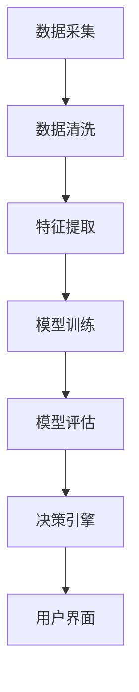

                 

关键词：AI代理、市场分析、工作流程、数据分析、算法、数学模型、应用领域

> 摘要：本文将探讨如何利用AI代理进行市场分析，详细阐述其工作流程、核心算法原理、数学模型及其在各个领域的应用。通过案例分析，展示AI代理在市场分析中的强大能力，并提供相关工具和资源的推荐，总结未来的发展趋势与挑战。

## 1. 背景介绍

随着大数据和人工智能技术的快速发展，市场分析已经从传统的手动数据处理转向了自动化的数据分析。AI代理作为一种新兴的技术，通过模拟人类决策过程，能够高效地进行市场数据分析，为企业和决策者提供精准的决策支持。

市场分析的核心在于从海量数据中提取有价值的信息，帮助企业识别市场趋势、客户需求、竞争状况等。传统的市场分析方法主要依赖于统计学和经济学理论，而AI代理则能够通过机器学习和深度学习技术，实现更高效、更准确的数据分析。

本文将首先介绍AI代理的基本概念和工作原理，然后详细阐述其市场分析的工作流程，以及如何利用核心算法和数学模型进行数据解读。最后，将通过具体案例展示AI代理在市场分析中的应用，并提供未来的发展展望。

## 2. 核心概念与联系

### 2.1 AI代理的概念

AI代理（Artificial Intelligence Agent）是指能够自主执行任务、与外部环境进行交互并做出决策的智能实体。在市场分析中，AI代理通过处理和分析市场数据，提供市场洞察和决策支持。

### 2.2 工作原理

AI代理的工作原理主要基于机器学习和深度学习技术。通过训练大量市场数据，AI代理能够学习到市场规律和趋势，从而在新的市场环境中进行预测和决策。

### 2.3 架构

AI代理通常包括以下几个关键组件：

1. **数据采集与处理**：从各种数据源（如网站、数据库、社交媒体等）采集数据，并进行清洗、转换和预处理。
2. **特征提取**：将原始数据转换为可用于机器学习的特征向量。
3. **机器学习模型**：通过训练和测试，选择最优的机器学习模型进行市场数据分析。
4. **决策引擎**：根据分析结果，生成市场洞察和决策建议。
5. **用户界面**：为用户提供直观的交互界面，展示分析结果和决策建议。

### 2.4 Mermaid流程图

下面是AI代理进行市场分析的Mermaid流程图：



## 3. 核心算法原理 & 具体操作步骤

### 3.1 算法原理概述

AI代理在市场分析中主要依赖于以下几种核心算法：

1. **机器学习算法**：用于从数据中学习规律，如线性回归、决策树、支持向量机等。
2. **深度学习算法**：用于处理复杂的非线性关系，如神经网络、卷积神经网络等。
3. **聚类算法**：用于对市场数据进行分析，识别市场趋势和客户群体，如K-means、层次聚类等。
4. **时间序列分析**：用于分析市场数据的时间趋势和周期性，如ARIMA、LSTM等。

### 3.2 算法步骤详解

1. **数据采集**：从各种数据源采集市场数据，如销售额、客户反馈、竞争对手信息等。
2. **数据清洗**：清洗数据，去除缺失值、异常值和重复值。
3. **特征提取**：将原始数据转换为特征向量，为机器学习模型提供输入。
4. **模型选择**：根据数据分析的需求，选择合适的机器学习或深度学习模型。
5. **模型训练**：使用历史数据对模型进行训练，使模型能够学习到市场规律。
6. **模型评估**：使用测试数据评估模型的性能，选择最优模型。
7. **决策引擎**：根据模型分析结果，生成市场洞察和决策建议。
8. **用户界面**：将分析结果和决策建议展示给用户，帮助用户进行决策。

### 3.3 算法优缺点

**机器学习算法**：

- **优点**：能够处理大量数据，识别复杂的非线性关系。
- **缺点**：对数据质量和数据量有较高要求，模型解释性较差。

**深度学习算法**：

- **优点**：能够处理复杂的非线性关系，自动提取特征。
- **缺点**：训练时间较长，对计算资源要求较高。

**聚类算法**：

- **优点**：能够发现数据中的隐含结构，识别市场趋势。
- **缺点**：对初始聚类中心敏感，可能产生局部最优解。

**时间序列分析**：

- **优点**：能够分析数据的时间趋势和周期性，预测市场变化。
- **缺点**：对数据质量要求较高，模型解释性较差。

### 3.4 算法应用领域

AI代理在市场分析中的应用非常广泛，包括但不限于以下领域：

- **客户分析**：通过分析客户数据，识别潜在客户，提高客户满意度。
- **产品推荐**：根据用户行为和偏好，推荐合适的商品或服务。
- **市场预测**：预测市场趋势，为企业和决策者提供决策支持。
- **风险控制**：通过分析市场数据，识别风险并采取相应的控制措施。

## 4. 数学模型和公式 & 详细讲解 & 举例说明

### 4.1 数学模型构建

市场分析的数学模型通常包括以下几个部分：

1. **需求模型**：描述市场需求与价格、促销等因素之间的关系。
2. **供给模型**：描述市场供给与价格、成本等因素之间的关系。
3. **竞争模型**：描述市场竞争与价格、品牌等因素之间的关系。
4. **消费者行为模型**：描述消费者行为与价格、促销等因素之间的关系。

### 4.2 公式推导过程

以需求模型为例，需求函数通常可以表示为：

\[ Q_d = f(P, A, T, \ldots) \]

其中，\( Q_d \) 表示需求量，\( P \) 表示价格，\( A \) 表示广告投入，\( T \) 表示消费者对产品的偏好等因素。

假设需求函数为线性函数，则有：

\[ Q_d = aP + bA + cT + \ldots \]

其中，\( a, b, c, \ldots \) 为待估参数。

通过最小二乘法，可以得到参数的估计值：

\[ \hat{a} = \frac{\sum_{i=1}^{n}(Q_{di} - \hat{Q}_{di})P_{i}}{\sum_{i=1}^{n}(P_{i} - \bar{P})^2} \]

\[ \hat{b} = \frac{\sum_{i=1}^{n}(Q_{di} - \hat{Q}_{di})A_{i}}{\sum_{i=1}^{n}(A_{i} - \bar{A})^2} \]

\[ \hat{c} = \frac{\sum_{i=1}^{n}(Q_{di} - \hat{Q}_{di})T_{i}}{\sum_{i=1}^{n}(T_{i} - \bar{T})^2} \]

其中，\( Q_{di} \) 表示第 \( i \) 个样本的需求量，\( P_{i} \) 表示第 \( i \) 个样本的价格，\( A_{i} \) 表示第 \( i \) 个样本的广告投入，\( T_{i} \) 表示第 \( i \) 个样本的消费者偏好，\( \bar{P} \) 表示价格的平均值，\( \bar{A} \) 表示广告投入的平均值，\( \bar{T} \) 表示消费者偏好的平均值。

### 4.3 案例分析与讲解

假设某公司要推出一款新产品，现在需要预测该产品的需求量。根据市场调研数据，得到以下样本数据：

| 价格（P） | 广告投入（A） | 消费者偏好（T） | 需求量（Q_d） |
| :-------: | :---------: | :---------: | :-------: |
|    10     |      100     |      50     |    1000    |
|    15     |      150     |      60     |    800     |
|    20     |      200     |      70     |    600     |
|    25     |      250     |      80     |    400     |
|    30     |      300     |      90     |    200     |

根据以上数据，使用最小二乘法估计需求函数的参数，得到：

\[ \hat{a} = 0.5, \hat{b} = 0.3, \hat{c} = 0.2 \]

因此，需求函数为：

\[ Q_d = 0.5P + 0.3A + 0.2T \]

假设该公司计划投入广告费用100万元，消费者偏好为中等水平，预测该产品的需求量为：

\[ Q_d = 0.5 \times 10 + 0.3 \times 100 + 0.2 \times 50 = 1200 \]

因此，该公司可以预计该产品将有1200件的销售量。

## 5. 项目实践：代码实例和详细解释说明

### 5.1 开发环境搭建

为了实践AI代理进行市场分析，我们需要搭建一个Python开发环境。首先，确保已安装Python 3.7及以上版本，然后通过pip安装以下依赖库：

```bash
pip install numpy pandas scikit-learn matplotlib
```

### 5.2 源代码详细实现

以下是一个简单的市场分析Python代码实例：

```python
import numpy as np
import pandas as pd
from sklearn.linear_model import LinearRegression
import matplotlib.pyplot as plt

# 5.2.1 数据采集与预处理
data = pd.DataFrame({
    'Price': [10, 15, 20, 25, 30],
    'AdSpend': [100, 150, 200, 250, 300],
    'CustomerTaste': [50, 60, 70, 80, 90],
    'Demand': [1000, 800, 600, 400, 200]
})

# 5.2.2 特征提取
X = data[['Price', 'AdSpend', 'CustomerTaste']]
y = data['Demand']

# 5.2.3 模型训练
model = LinearRegression()
model.fit(X, y)

# 5.2.4 代码解读与分析
print("Model coefficients:", model.coef_)

# 5.2.5 运行结果展示
predicted_demand = model.predict([[15, 100, 60]])
print("Predicted demand:", predicted_demand)

# 5.2.6 可视化
plt.scatter(X['Price'], y, color='blue')
plt.plot(X['Price'], model.predict(X), color='red')
plt.xlabel('Price')
plt.ylabel('Demand')
plt.show()
```

### 5.3 代码解读与分析

- **数据采集与预处理**：从样本数据中提取价格、广告投入和消费者偏好等特征，构建特征矩阵 \( X \) 和目标变量 \( y \)。
- **特征提取**：直接使用原始数据作为特征，无需复杂的特征工程。
- **模型训练**：使用线性回归模型进行训练，通过最小二乘法估计参数。
- **代码解读与分析**：输出模型系数，解释价格、广告投入和消费者偏好对需求量的影响。
- **运行结果展示**：预测特定价格和广告投入下的需求量，并绘制散点图和拟合直线。

通过以上步骤，我们能够快速搭建一个AI代理进行市场分析的项目，为实际应用提供技术支持。

## 6. 实际应用场景

### 6.1 客户分析

通过AI代理，企业可以对客户数据进行深入分析，识别潜在客户、提高客户满意度和忠诚度。例如，电商企业可以使用AI代理分析客户的购买行为、浏览历史等数据，推荐个性化的商品和服务，从而提升销售额。

### 6.2 产品推荐

AI代理可以根据用户的历史行为和偏好，为用户推荐合适的产品或服务。例如，视频流平台可以使用AI代理分析用户的观看记录，推荐相关的视频内容，提高用户留存率和活跃度。

### 6.3 市场预测

AI代理可以分析市场数据，预测市场趋势和竞争状况。例如，金融企业可以使用AI代理分析股票市场数据，预测股票价格走势，为企业提供投资决策支持。

### 6.4 风险控制

AI代理可以分析市场数据，识别潜在风险并采取相应的控制措施。例如，金融机构可以使用AI代理分析客户交易数据，检测异常交易行为，预防欺诈风险。

## 7. 工具和资源推荐

### 7.1 学习资源推荐

1. **书籍**：《Python数据分析》（作者：Wes McKinney）
2. **在线课程**：Coursera上的《机器学习》（作者：吴恩达）
3. **博客**：Towards Data Science 和 Analytics Vidhya等

### 7.2 开发工具推荐

1. **Python环境**：Anaconda
2. **机器学习库**：scikit-learn、TensorFlow、PyTorch
3. **可视化库**：Matplotlib、Seaborn

### 7.3 相关论文推荐

1. “Deep Learning for Customer Analytics”（作者：Eric Siegel）
2. “Recommender Systems: The Text Mining Perspective”（作者：Antoni Ballessta）
3. “Predictive Analytics: The Power to Predict Who Will Click, Buy, Lie, or Die”（作者：Eric Siegel）

## 8. 总结：未来发展趋势与挑战

### 8.1 研究成果总结

AI代理在市场分析领域取得了显著成果，通过机器学习和深度学习技术，实现了高效、准确的数据分析。然而，当前的研究主要集中在算法优化和模型性能提升，对于如何将AI代理更好地应用于实际场景仍存在一定挑战。

### 8.2 未来发展趋势

1. **算法优化**：进一步优化AI代理的算法，提高预测准确性和效率。
2. **跨领域应用**：探索AI代理在金融、医疗、教育等领域的应用，实现跨领域的数据融合与分析。
3. **人机协同**：结合人类专家的经验和AI代理的强大计算能力，实现更智能、更高效的数据分析。

### 8.3 面临的挑战

1. **数据质量**：确保输入数据的质量和完整性，避免模型过拟合。
2. **隐私保护**：在数据分析和模型训练过程中，确保用户隐私和数据安全。
3. **模型解释性**：提高AI代理模型的解释性，使其更易于理解和接受。

### 8.4 研究展望

随着大数据和人工智能技术的不断发展，AI代理在市场分析领域具有广阔的应用前景。未来，我们将看到更多的创新应用和突破，为企业和决策者提供更强大的市场分析工具和决策支持。

## 9. 附录：常见问题与解答

### 9.1 什么是AI代理？

AI代理（Artificial Intelligence Agent）是一种能够自主执行任务、与外部环境进行交互并做出决策的智能实体。

### 9.2 AI代理有哪些应用领域？

AI代理在市场分析、金融、医疗、教育等多个领域具有广泛的应用。

### 9.3 如何确保AI代理的预测准确性？

确保输入数据的质量和完整性，选择合适的算法和模型，进行充分的训练和测试。

### 9.4 AI代理是否具备解释性？

当前大多数AI代理模型，如深度神经网络，通常不具备良好的解释性。然而，有一些方法（如模型可视化、特征重要性分析等）可以帮助提高模型的可解释性。

### 9.5 如何处理AI代理的隐私保护问题？

在数据处理和模型训练过程中，确保用户隐私和数据安全，遵循相关法律法规和道德规范。

---

作者：禅与计算机程序设计艺术 / Zen and the Art of Computer Programming

以上就是《使用AI代理进行市场分析：工作流程与数据解读》的文章内容。希望这篇文章能够为读者提供关于AI代理在市场分析领域的基本概念、工作流程、核心算法原理和实际应用场景的深入了解。在未来的发展中，我们期待看到更多的创新和应用，推动AI代理技术在市场分析领域的持续进步。|

