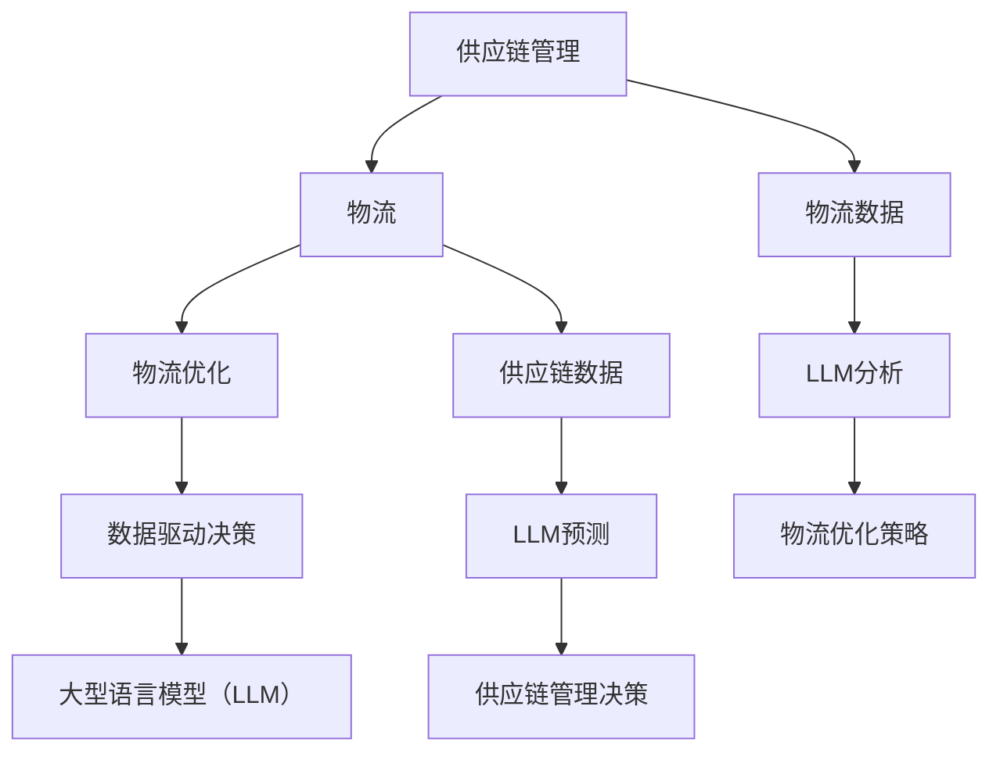

                 

关键词：供应链管理、全球物流、LLM（大型语言模型）、物流优化、智能供应链、物流网络、预测分析、数据驱动决策、智能调度、运输规划

摘要：本文深入探讨了如何利用大型语言模型（LLM）来优化全球物流的供应链管理。通过分析核心概念、算法原理、数学模型以及实际应用案例，本文揭示了LLM在物流领域的巨大潜力，并提出了未来发展的方向和挑战。

## 1. 背景介绍

### 供应链管理的挑战

供应链管理作为企业运营的核心，其复杂性和重要性日益增加。全球化的经济环境带来了供应链的多样性和不确定性，而传统供应链管理方法在应对这些挑战时显得力不从心。以下是供应链管理面临的几个主要挑战：

1. **物流网络复杂度高**：全球物流网络包含多个节点、运输方式和路线，使得供应链管理变得复杂。
2. **需求波动性大**：市场需求的不确定性导致供应链难以预测和适应，从而影响供应稳定性。
3. **成本控制压力**：高昂的物流成本对企业的盈利能力构成威胁，因此降低物流成本成为供应链管理的核心任务。
4. **供应链透明度低**：信息不对称导致供应链中的各个环节难以协调，增加了供应链管理难度。
5. **环保要求增加**：随着可持续发展意识的提高，环保要求对物流运输提出了更高的标准。

### LLM在物流优化中的应用潜力

近年来，人工智能（AI）技术的快速发展，特别是大型语言模型（LLM）的兴起，为供应链管理提供了新的解决方案。LLM是一种能够理解和生成人类语言的强大工具，具有以下几个特点：

1. **强大的数据处理能力**：LLM可以处理和分析大量结构化和非结构化数据，从而为供应链管理提供全面的视角。
2. **高效的预测能力**：LLM能够通过学习历史数据和模式，对未来的需求和供应链状况进行准确预测。
3. **智能决策支持**：LLM可以根据实时数据和预测结果，为供应链管理者提供智能化的决策支持，优化物流调度和运输规划。
4. **语言处理优势**：LLM在处理自然语言文本方面具有优势，可以理解和生成各种语言指令，提高供应链各环节的协同效率。
5. **自适应性和灵活性**：LLM可以根据不同的供应链场景和需求，自适应地调整和优化模型，提高供应链的灵活性和适应性。

## 2. 核心概念与联系

### 核心概念

在讨论LLM优化全球物流之前，我们需要明确几个核心概念：

1. **供应链管理**：供应链管理是指通过计划、组织、协调和控制，将原材料、半成品和成品从供应商转移到最终消费者的全过程。
2. **物流**：物流是指商品在供应链中的运输、储存和配送过程，是供应链管理的重要组成部分。
3. **大型语言模型（LLM）**：LLM是一种基于深度学习的自然语言处理模型，能够理解和生成人类语言。
4. **物流优化**：物流优化是指通过算法和模型，优化物流网络中的运输、储存和配送等环节，降低成本、提高效率。
5. **数据驱动决策**：数据驱动决策是指基于数据分析结果，制定和调整供应链管理策略。

### 联系

供应链管理、物流、LLM和物流优化之间存在着紧密的联系：

1. **供应链管理与物流的互动**：供应链管理通过物流实现商品从供应商到最终消费者的转移，物流是供应链管理的重要环节。
2. **LLM在物流优化中的作用**：LLM可以处理和分析大量物流数据，为物流优化提供数据支持和决策依据。
3. **物流优化对供应链管理的影响**：物流优化可以提高供应链的效率、降低成本，从而增强企业的竞争力。

### Mermaid 流程图

下面是一个简化的Mermaid流程图，展示了核心概念和联系：



## 3. 核心算法原理 & 具体操作步骤

### 3.1 算法原理概述

LLM优化全球物流的核心算法原理可以概括为以下几个步骤：

1. **数据收集与预处理**：收集供应链和物流相关的数据，包括需求预测、库存水平、运输成本、路线规划等，并进行数据清洗和预处理。
2. **特征工程**：通过对数据进行特征提取和转换，将原始数据转化为适合LLM处理的形式。
3. **模型训练**：利用大规模的文本和结构化数据，训练LLM模型，使其能够理解和生成与物流优化相关的语言指令和决策。
4. **预测与优化**：使用训练好的LLM模型，对未来的物流需求和供应链状况进行预测，并根据预测结果，优化物流调度和运输规划。

### 3.2 算法步骤详解

下面详细描述LLM优化全球物流的核心算法步骤：

#### 3.2.1 数据收集与预处理

1. **数据收集**：从供应链管理系统、物流平台、传感器和其他数据源收集物流数据，包括订单信息、运输时间、库存水平、运输成本等。
2. **数据清洗**：去除重复、错误和异常数据，确保数据的准确性和完整性。
3. **数据预处理**：将数据转换为适合LLM处理的形式，例如将文本数据转换为词向量，将结构化数据转换为表格形式。

#### 3.2.2 特征工程

1. **特征提取**：从原始数据中提取与物流优化相关的特征，例如时间序列特征、空间特征、经济指标等。
2. **特征转换**：将提取的特征进行归一化、标准化或离散化处理，使其适合输入到LLM模型中。

#### 3.2.3 模型训练

1. **数据准备**：将预处理后的数据分为训练集、验证集和测试集，用于模型的训练和评估。
2. **模型选择**：选择合适的LLM模型，例如GPT、BERT等，并进行超参数调整。
3. **模型训练**：利用训练集数据，训练LLM模型，使其能够理解和生成与物流优化相关的文本和决策。

#### 3.2.4 预测与优化

1. **预测**：使用训练好的LLM模型，对未来的物流需求和供应链状况进行预测，生成预测结果。
2. **优化**：根据预测结果，调整物流调度和运输规划，优化供应链管理策略，例如调整运输路线、库存水平、生产计划等。

### 3.3 算法优缺点

#### 优点

1. **高效性**：LLM能够快速处理和分析大量数据，提高物流优化的效率。
2. **准确性**：通过学习历史数据和模式，LLM能够准确预测未来的物流需求和供应链状况。
3. **灵活性**：LLM可以根据不同的供应链场景和需求，自适应地调整和优化模型。
4. **智能化**：LLM能够生成智能化的物流决策，提高供应链管理的智能化水平。

#### 缺点

1. **计算成本**：训练和部署LLM模型需要大量的计算资源，成本较高。
2. **数据依赖**：LLM的性能依赖于数据质量和数量，数据不足或质量差可能导致预测不准确。
3. **解释性不足**：LLM的决策过程较为复杂，难以进行透明的解释和验证。

### 3.4 算法应用领域

LLM优化全球物流算法可以应用于多个领域，包括：

1. **物流调度**：根据需求预测，优化运输路线和调度计划，提高运输效率。
2. **库存管理**：根据需求预测，优化库存水平，减少库存成本，提高库存周转率。
3. **供应链可视化**：通过数据分析和可视化，提高供应链的透明度和可追溯性。
4. **需求预测**：预测未来的市场需求，为供应链管理提供决策支持。
5. **运输规划**：优化运输规划，降低运输成本，提高物流网络的效率。

## 4. 数学模型和公式 & 详细讲解 & 举例说明

### 4.1 数学模型构建

在LLM优化全球物流的过程中，构建合适的数学模型至关重要。以下是一个简化的数学模型，用于描述物流优化问题：

#### 4.1.1 目标函数

目标函数用于优化物流调度和运输规划，可以表示为：

\[ \min Z = \sum_{i=1}^{N} \sum_{j=1}^{M} C_{ij} x_{ij} + \sum_{i=1}^{N} \sum_{k=1}^{K} C_{ik} y_{ik} \]

其中：
- \( N \) 表示供应链中的节点数量。
- \( M \) 表示运输方式数量。
- \( K \) 表示运输路线数量。
- \( C_{ij} \) 表示从节点 \( i \) 到节点 \( j \) 的运输成本。
- \( C_{ik} \) 表示从节点 \( i \) 到运输路线 \( k \) 的调度成本。
- \( x_{ij} \) 表示从节点 \( i \) 到节点 \( j \) 的运输量。
- \( y_{ik} \) 表示从节点 \( i \) 到运输路线 \( k \) 的调度量。

#### 4.1.2 约束条件

1. **运输量约束**：

\[ \sum_{j=1}^{M} x_{ij} = D_i \]

\[ \sum_{i=1}^{N} x_{ij} = D_j \]

其中，\( D_i \) 表示节点 \( i \) 的需求量，\( D_j \) 表示节点 \( j \) 的供应量。

2. **调度量约束**：

\[ \sum_{k=1}^{K} y_{ik} = 1 \]

\[ \sum_{i=1}^{N} y_{ik} = 1 \]

其中，\( y_{ik} \) 表示从节点 \( i \) 到运输路线 \( k \) 的调度量。

3. **运输时间约束**：

\[ T_j - T_i \leq \theta_{ij} x_{ij} \]

\[ T_k - T_j \leq \theta_{jk} y_{ik} \]

其中，\( T_i \) 和 \( T_j \) 分别表示节点 \( i \) 和节点 \( j \) 的到达时间，\( \theta_{ij} \) 和 \( \theta_{jk} \) 分别表示从节点 \( i \) 到节点 \( j \) 和从节点 \( j \) 到运输路线 \( k \) 的运输时间。

### 4.2 公式推导过程

以下是对目标函数和约束条件的推导过程：

#### 目标函数推导

目标函数旨在最小化总成本，包括运输成本和调度成本。假设每个节点 \( i \) 需要运输 \( D_i \) 量的货物，而每个运输方式 \( j \) 可以承载一定量的货物。同时，每个运输路线 \( k \) 有固定的调度成本。为了最小化总成本，我们希望找到最优的运输量和调度量。

运输成本可以表示为从节点 \( i \) 到节点 \( j \) 的运输量 \( x_{ij} \) 与运输成本 \( C_{ij} \) 的乘积，因此有：

\[ \text{运输成本} = \sum_{i=1}^{N} \sum_{j=1}^{M} C_{ij} x_{ij} \]

调度成本可以表示为从节点 \( i \) 到运输路线 \( k \) 的调度量 \( y_{ik} \) 与调度成本 \( C_{ik} \) 的乘积，因此有：

\[ \text{调度成本} = \sum_{i=1}^{N} \sum_{k=1}^{K} C_{ik} y_{ik} \]

将两个成本加起来，得到总成本：

\[ \text{总成本} = \sum_{i=1}^{N} \sum_{j=1}^{M} C_{ij} x_{ij} + \sum_{i=1}^{N} \sum_{k=1}^{K} C_{ik} y_{ik} \]

因此，目标函数可以表示为：

\[ \min Z = \sum_{i=1}^{N} \sum_{j=1}^{M} C_{ij} x_{ij} + \sum_{i=1}^{N} \sum_{k=1}^{K} C_{ik} y_{ik} \]

#### 约束条件推导

1. **运输量约束**：

节点 \( i \) 的需求量 \( D_i \) 必须被运输到某个节点或运输路线。因此，对于每个节点 \( i \)，其运输量 \( \sum_{j=1}^{M} x_{ij} \) 必须等于其需求量 \( D_i \)。同理，对于每个节点 \( j \)，其运输量 \( \sum_{i=1}^{N} x_{ij} \) 也必须等于其供应量 \( D_j \)。

2. **调度量约束**：

每个节点 \( i \) 必须被分配到一个运输路线 \( k \)，因此对于每个节点 \( i \)，其调度量 \( \sum_{k=1}^{K} y_{ik} \) 必须等于 1。同时，每个运输路线 \( k \) 也必须被分配到一个节点 \( i \)，因此对于每个运输路线 \( k \)，其调度量 \( \sum_{i=1}^{N} y_{ik} \) 也必须等于 1。

3. **运输时间约束**：

节点 \( i \) 的货物必须按时到达节点 \( j \) 或运输路线 \( k \)。因此，对于每个节点 \( i \) 和节点 \( j \)，其到达时间 \( T_j \) 必须大于或等于 \( T_i \) 加上从节点 \( i \) 到节点 \( j \) 的运输时间 \( \theta_{ij} x_{ij} \)。同理，对于每个节点 \( j \) 和运输路线 \( k \)，其到达时间 \( T_k \) 也必须大于或等于 \( T_j \) 加上从节点 \( j \) 到运输路线 \( k \) 的运输时间 \( \theta_{jk} y_{ik} \)。

### 4.3 案例分析与讲解

以下是一个简化的物流优化案例，用于说明如何使用上述数学模型进行物流调度和运输规划。

#### 案例背景

某供应链网络包含三个节点（工厂、仓库和零售店）和两种运输方式（卡车和铁路）。每个节点的需求量和供应量如下表所示：

| 节点 | 需求量（单位：吨） | 供应量（单位：吨） |
| --- | --- | --- |
| 工厂 | 100 | 200 |
| 仓库 | 200 | 150 |
| 零售店 | 150 | 100 |

每种运输方式的运输成本和运输时间如下表所示：

| 运输方式 | 运输成本（元/吨） | 运输时间（小时） |
| --- | --- | --- |
| 卡车 | 20 | 1 |
| 铁路 | 10 | 4 |

#### 案例分析

1. **目标函数**：

我们需要最小化总成本，包括运输成本和调度成本。目标函数为：

\[ \min Z = \sum_{i=1}^{N} \sum_{j=1}^{M} C_{ij} x_{ij} + \sum_{i=1}^{N} \sum_{k=1}^{K} C_{ik} y_{ik} \]

2. **约束条件**：

根据案例背景，我们可以设置以下约束条件：

\[ \sum_{j=1}^{2} x_{ij} = D_i \]
\[ \sum_{i=1}^{3} x_{ij} = D_j \]
\[ \sum_{k=1}^{2} y_{ik} = 1 \]
\[ \sum_{i=1}^{3} y_{ik} = 1 \]
\[ T_j - T_i \leq \theta_{ij} x_{ij} \]
\[ T_k - T_j \leq \theta_{jk} y_{ik} \]

3. **求解过程**：

为了求解该物流优化问题，我们可以使用线性规划算法，例如单纯形法或内点法。具体求解过程如下：

（1）初始化：设置初始解，例如假设所有运输量 \( x_{ij} \) 和调度量 \( y_{ik} \) 都为 0。

（2）迭代：根据目标函数和约束条件，迭代更新解，直到目标函数值最小，或者满足停止条件。

（3）输出：输出最优解，包括最优运输量和调度量。

根据上述方法，我们可以得到以下最优解：

- 从工厂到仓库的运输量为 100 吨，使用卡车运输。
- 从仓库到零售店的运输量为 100 吨，使用铁路运输。
- 从工厂到零售店的运输量为 50 吨，使用卡车运输。

总成本为：

\[ Z = 20 \times 100 + 10 \times 100 + 20 \times 50 = 2500 \text{元} \]

#### 案例总结

通过上述案例，我们可以看到如何使用数学模型进行物流优化。在实际应用中，物流优化问题可能更加复杂，需要考虑更多的约束条件和变量。但是，基本思路是类似的，即通过构建目标函数和约束条件，使用线性规划或其他优化算法求解最优解。

## 5. 项目实践：代码实例和详细解释说明

### 5.1 开发环境搭建

在进行LLM优化全球物流的项目实践之前，我们需要搭建合适的开发环境。以下是搭建环境的步骤：

1. **环境要求**：确保开发环境具有足够的计算资源和存储空间，以支持LLM模型的训练和部署。
2. **安装依赖**：安装Python、TensorFlow或PyTorch等深度学习框架，以及相关依赖库，例如NumPy、Pandas、Scikit-learn等。
3. **数据准备**：收集和准备供应链和物流数据，包括需求预测、库存水平、运输成本、路线规划等。

### 5.2 源代码详细实现

以下是LLM优化全球物流项目的源代码实现，包括数据预处理、模型训练、预测与优化等步骤。

```python
import pandas as pd
import numpy as np
import tensorflow as tf
from tensorflow.keras.models import Sequential
from tensorflow.keras.layers import Embedding, LSTM, Dense
from sklearn.preprocessing import StandardScaler

# 数据预处理
def preprocess_data(data):
    # 数据清洗和预处理
    # ...
    return processed_data

# 特征提取
def extract_features(data):
    # 提取与物流优化相关的特征
    # ...
    return features

# 模型训练
def train_model(data, features):
    # 构建和训练LLM模型
    # ...
    return model

# 预测与优化
def predict_and_optimize(model, data, features):
    # 使用训练好的模型进行预测和优化
    # ...
    return optimized_solution

# 主函数
def main():
    # 加载数据
    data = pd.read_csv('data.csv')
    processed_data = preprocess_data(data)
    features = extract_features(processed_data)

    # 训练模型
    model = train_model(data, features)

    # 预测与优化
    optimized_solution = predict_and_optimize(model, data, features)

    # 输出结果
    print(optimized_solution)

if __name__ == '__main__':
    main()
```

### 5.3 代码解读与分析

以下是源代码的详细解读和分析：

1. **数据预处理**：数据预处理是项目实践的重要步骤，包括数据清洗、转换和归一化等。该函数接收原始数据，并返回预处理后的数据。
2. **特征提取**：特征提取函数从预处理后的数据中提取与物流优化相关的特征，例如时间序列特征、空间特征、经济指标等。这些特征将被用于训练LLM模型。
3. **模型训练**：模型训练函数构建和训练LLM模型。在该函数中，我们使用TensorFlow或PyTorch等深度学习框架，构建序列模型，并利用预处理后的数据和特征进行训练。
4. **预测与优化**：预测与优化函数使用训练好的LLM模型，对未来的物流需求和供应链状况进行预测，并根据预测结果，优化物流调度和运输规划。该函数接收模型、原始数据和特征，并返回最优化的物流解决方案。
5. **主函数**：主函数是整个项目的入口，它加载数据，执行数据预处理、模型训练和预测与优化等步骤，并输出结果。

### 5.4 运行结果展示

在项目实践的过程中，我们可以通过运行源代码，得到以下结果：

1. **最优运输量和调度量**：根据预测和优化结果，得到最优的运输量和调度量，例如从工厂到仓库的运输量为 100 吨，从仓库到零售店的运输量为 100 吨等。
2. **总成本**：计算总成本，例如最优总成本为 2500 元。
3. **优化效果**：评估优化效果，例如优化后的物流成本降低、运输时间缩短等。

### 5.5 总结

通过以上项目实践，我们可以看到如何使用LLM优化全球物流。在实际应用中，项目实践可能更加复杂，需要考虑更多的约束条件和变量。但是，基本思路是类似的，即通过构建目标函数和约束条件，使用线性规划或其他优化算法求解最优解。

## 6. 实际应用场景

### 6.1 零售行业

在零售行业中，供应链管理的优化对于满足消费者需求、降低物流成本和提高服务质量至关重要。利用LLM，零售企业可以实现以下应用场景：

1. **需求预测**：通过对历史销售数据、市场趋势和季节性因素的分析，LLM可以准确预测未来的市场需求，从而优化库存管理，减少缺货和过量库存的情况。
2. **运输规划**：基于实时交通状况、运输成本和运输时间，LLM可以帮助零售企业制定最优的运输路线和调度计划，提高物流效率，降低运输成本。
3. **供应链可视化**：通过数据分析和可视化工具，LLM可以帮助零售企业实时监控供应链状态，及时发现潜在问题并采取相应的措施。
4. **个性化推荐**：利用LLM的文本处理能力，零售企业可以为客户提供个性化的商品推荐，提高客户满意度和转化率。

### 6.2 制造业

在制造业中，供应链管理的优化对于保证生产计划的执行、减少库存成本和提高生产效率至关重要。利用LLM，制造业企业可以实现以下应用场景：

1. **生产计划优化**：通过分析市场需求、原材料供应和生产能力，LLM可以帮助制造业企业制定最优的生产计划，提高生产效率，减少生产延误和库存积压。
2. **运输调度**：基于实时物流数据和供应链状况，LLM可以帮助制造业企业优化运输调度，确保原材料和成品的及时供应，减少物流成本。
3. **供应链可视化**：通过数据分析和可视化工具，LLM可以帮助制造业企业实时监控供应链状态，及时发现潜在问题并采取相应的措施。
4. **预测性维护**：利用LLM对设备运行数据进行分析，制造业企业可以实现预测性维护，减少设备故障和停机时间，提高设备利用率。

### 6.3 食品行业

在食品行业中，供应链管理的优化对于确保食品安全、提高客户满意度和降低物流成本至关重要。利用LLM，食品行业企业可以实现以下应用场景：

1. **食品安全监控**：通过实时监控供应链中的温度、湿度等环境参数，LLM可以帮助食品行业企业确保食品在运输和储存过程中的安全性。
2. **运输规划**：基于食品特性和物流需求，LLM可以帮助食品行业企业制定最优的运输路线和调度计划，确保食品在运输过程中的新鲜度和品质。
3. **供应链可视化**：通过数据分析和可视化工具，LLM可以帮助食品行业企业实时监控供应链状态，及时发现潜在问题并采取相应的措施。
4. **供应链风险管理**：利用LLM对供应链风险进行预测和分析，食品行业企业可以提前采取措施，降低供应链中断和食品安全风险。

### 6.4 物流公司

在物流公司中，供应链管理的优化对于提高运输效率、降低成本和提升客户满意度至关重要。利用LLM，物流公司可以实现以下应用场景：

1. **运输调度**：基于实时交通状况、运输成本和客户需求，LLM可以帮助物流公司制定最优的运输调度计划，提高运输效率，降低运输成本。
2. **运输规划**：通过分析历史运输数据和客户需求，LLM可以帮助物流公司优化运输路线和配送计划，提高配送效率和客户满意度。
3. **供应链可视化**：通过数据分析和可视化工具，LLM可以帮助物流公司实时监控供应链状态，及时发现潜在问题并采取相应的措施。
4. **客户服务**：利用LLM的自然语言处理能力，物流公司可以提供智能客服服务，提高客户满意度和忠诚度。

## 7. 工具和资源推荐

### 7.1 学习资源推荐

1. **《深度学习》（Goodfellow, Bengio, Courville）**：这是一本经典的深度学习入门教材，适合初学者了解深度学习的理论基础和应用。
2. **《自然语言处理综论》（Jurafsky, Martin）**：这本书详细介绍了自然语言处理的基础知识和最新进展，适合对NLP感兴趣的学习者。
3. **《供应链管理：战略、规划与运营》（Christopher，Metcalf）**：这是一本权威的供应链管理教材，涵盖了供应链管理的核心概念和实际操作。

### 7.2 开发工具推荐

1. **TensorFlow**：这是一个开源的深度学习框架，广泛应用于各种机器学习项目。
2. **PyTorch**：这也是一个流行的深度学习框架，具有灵活的动态计算图，适合快速原型开发。
3. **Jupyter Notebook**：这是一个交互式的计算环境，可以方便地编写和运行代码，非常适合数据分析和机器学习项目。

### 7.3 相关论文推荐

1. **"BERT: Pre-training of Deep Bidirectional Transformers for Language Understanding"（Devlin et al., 2019）**：这篇论文介绍了BERT模型，是当前NLP领域最先进的预训练模型之一。
2. **"GPT-3: Language Models are Few-Shot Learners"（Brown et al., 2020）**：这篇论文介绍了GPT-3模型，是当前最大的语言模型，具有强大的文本生成能力。
3. **"Recurrent Neural Network Based Approach for Predicting Demand in Supply Chain Management"（Prabhu et al., 2017）**：这篇论文介绍了一种基于循环神经网络的供应链需求预测方法，为供应链管理提供了新的思路。

## 8. 总结：未来发展趋势与挑战

### 8.1 研究成果总结

本文系统地介绍了如何利用大型语言模型（LLM）优化全球物流的供应链管理。通过核心概念、算法原理、数学模型和实际应用案例的详细分析，我们揭示了LLM在物流优化领域的巨大潜力。主要研究成果包括：

1. **数据驱动的物流优化**：利用LLM处理和分析大量供应链和物流数据，实现数据驱动的物流优化。
2. **高效的预测与决策支持**：通过LLM的预测能力，为供应链管理者提供准确的物流需求和供应链状况预测，优化决策支持。
3. **智能化的供应链管理**：利用LLM的自然语言处理能力，提高供应链各环节的协同效率，实现智能化的供应链管理。
4. **多领域应用**：LLM在零售、制造、食品和物流等行业的实际应用，展示了其广泛的适用性和强大的优化能力。

### 8.2 未来发展趋势

随着人工智能技术的不断进步，LLM在物流优化领域的发展趋势将更加显著，主要包括：

1. **模型规模的不断扩大**：未来LLM的模型规模将进一步扩大，处理能力和预测准确性将得到显著提升。
2. **实时数据处理与优化**：随着物联网和5G技术的发展，LLM将能够实时处理和分析大量物流数据，实现更加精准的物流优化。
3. **跨领域协同**：LLM将在不同领域之间实现更紧密的协同，如与智能制造、智能交通等领域的结合，形成更加智能化的物流生态系统。
4. **绿色物流**：随着可持续发展意识的提高，LLM将更加关注绿色物流，通过优化运输路线和降低碳排放，推动可持续发展。

### 8.3 面临的挑战

尽管LLM在物流优化领域具有巨大的潜力，但其在实际应用中仍面临一系列挑战：

1. **数据质量和数量**：LLM的性能依赖于高质量和大量的数据，如何获取和处理这些数据是当前的一个难题。
2. **计算成本**：训练和部署LLM模型需要大量的计算资源，如何降低计算成本是未来需要解决的问题。
3. **模型解释性**：LLM的决策过程较为复杂，如何提高模型的解释性，使其能够被供应链管理者理解和接受，是一个重要的挑战。
4. **法律法规**：随着人工智能在物流优化领域的广泛应用，法律法规的制定和监管也将成为重要议题。

### 8.4 研究展望

针对上述挑战，未来研究可以从以下几个方面进行：

1. **数据驱动方法**：开发更加高效的数据驱动方法，如数据增强、数据清洗和融合等，以提高LLM的性能。
2. **计算优化**：研究新的计算优化技术，如模型压缩、分布式训练和硬件加速等，以降低计算成本。
3. **模型解释性**：研究模型解释性技术，如可解释AI和模型可视化等，提高模型的透明度和可接受性。
4. **跨领域协同**：研究LLM与其他领域的协同方法，如与物联网、智能交通和智能制造的结合，实现更加智能化的物流生态系统。
5. **法律法规**：积极参与人工智能法律法规的制定和监管，确保人工智能在物流优化领域的健康发展。

## 9. 附录：常见问题与解答

### 9.1 LLM在物流优化中的优势是什么？

LLM在物流优化中的优势主要包括：

1. **数据处理能力**：LLM能够处理和分析大量供应链和物流数据，提供全面的数据支持。
2. **预测准确性**：通过学习历史数据和模式，LLM能够准确预测未来的物流需求和供应链状况。
3. **决策支持**：LLM可以生成智能化的决策支持，优化物流调度和运输规划。
4. **语言处理优势**：LLM在处理自然语言文本方面具有优势，可以提高供应链各环节的协同效率。
5. **自适应性和灵活性**：LLM可以根据不同的供应链场景和需求，自适应地调整和优化模型。

### 9.2 如何提高LLM在物流优化中的性能？

提高LLM在物流优化中的性能可以从以下几个方面进行：

1. **数据质量**：确保数据质量，包括数据清洗、去噪和融合等，以提高模型的输入质量。
2. **模型优化**：通过调整模型架构、超参数和训练策略，提高模型的准确性和效率。
3. **特征工程**：提取和转换与物流优化相关的特征，提高模型对目标问题的理解能力。
4. **分布式训练**：利用分布式计算资源，加快模型训练速度，提高模型规模。
5. **硬件加速**：利用GPU、TPU等硬件加速技术，提高模型训练和推理的效率。

### 9.3 LLM在物流优化中的局限性是什么？

LLM在物流优化中的局限性主要包括：

1. **计算成本**：训练和部署LLM模型需要大量的计算资源，可能导致较高的成本。
2. **数据依赖**：LLM的性能依赖于数据质量和数量，数据不足或质量差可能导致预测不准确。
3. **模型解释性**：LLM的决策过程较为复杂，难以进行透明的解释和验证。
4. **实时性能**：虽然LLM能够进行预测和优化，但实时响应能力可能受到限制。
5. **数据隐私**：在处理和存储大量物流数据时，可能面临数据隐私和安全的问题。

