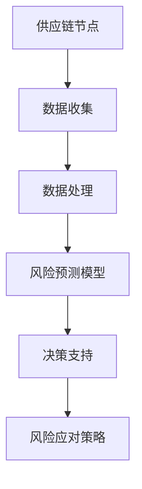

                 

关键词：供应链风险，人工智能，预测模型，风险分析，供应链管理

> 摘要：随着全球供应链的复杂化和全球化，供应链风险管理变得越来越重要。本文将探讨如何利用人工智能技术预测供应链中的潜在风险，以提高供应链的弹性和可靠性。我们将详细介绍相关核心概念、算法原理、数学模型和实际应用案例，并展望未来发展趋势与挑战。

## 1. 背景介绍

供应链管理是企业运营中至关重要的一环。随着全球经济的不断发展，供应链的复杂性和全球化程度日益提高，这使得供应链管理面临更大的风险。供应链风险可能来源于多个方面，包括自然灾害、政治不确定性、供应链中断、物流瓶颈、库存不足等。这些风险可能会导致供应链中断，从而影响企业的生产和销售。

近年来，人工智能（AI）技术的迅速发展为我们提供了强大的工具来预测和管理供应链风险。通过大数据分析、机器学习算法和深度学习模型，我们可以从海量数据中提取有价值的信息，预测潜在风险，并采取相应的措施来降低风险。

## 2. 核心概念与联系

在供应链风险管理中，核心概念包括：

- **供应链节点**：供应链中的各个环节，如供应商、制造商、分销商、零售商等。
- **供应链风险**：供应链中可能发生的各种不确定性事件，如延迟交付、库存积压、运输中断等。
- **风险预测**：利用历史数据和AI算法，预测未来可能发生的供应链风险。

为了更好地理解这些概念，我们使用Mermaid流程图来展示供应链风险管理的核心架构：



### 2.1 数据收集

数据收集是供应链风险管理的基础。我们需要从供应链的各个环节收集大量的数据，包括历史销售数据、库存数据、物流数据、供应商数据等。这些数据可以帮助我们了解供应链的运作状况，并为后续的风险预测提供支持。

### 2.2 数据处理

收集到的数据通常是非常庞大和复杂的。因此，我们需要进行数据预处理，包括数据清洗、数据整合、数据转换等，以便为后续的建模和分析提供高质量的数据。

### 2.3 风险预测模型

基于处理后的数据，我们可以使用机器学习算法构建风险预测模型。这些算法包括回归分析、决策树、神经网络等。通过训练模型，我们可以预测未来可能发生的供应链风险，并评估其可能带来的影响。

### 2.4 决策支持

风险预测模型生成的结果可以为供应链管理人员提供决策支持。通过分析预测结果，管理人员可以提前制定应对策略，降低风险带来的损失。

### 2.5 风险应对策略

根据决策支持的结果，供应链管理人员可以采取一系列措施来应对潜在风险。这些措施可能包括调整库存水平、优化物流安排、增加供应商等。

## 3. 核心算法原理 & 具体操作步骤

### 3.1 算法原理概述

在供应链风险管理中，我们通常使用以下几种核心算法：

- **回归分析**：用于预测供应链风险的发生概率和影响程度。
- **决策树**：用于分类和回归分析，可以帮助我们识别风险因素并制定应对策略。
- **神经网络**：用于构建复杂的非线性模型，可以处理大量数据并提高预测精度。

### 3.2 算法步骤详解

#### 3.2.1 回归分析

1. **数据准备**：收集并预处理供应链相关数据，包括历史销售数据、库存数据、物流数据等。
2. **模型选择**：选择适当的回归模型，如线性回归、多项式回归等。
3. **模型训练**：使用历史数据训练回归模型。
4. **模型评估**：使用交叉验证等方法评估模型性能。
5. **风险预测**：使用训练好的模型预测未来可能发生的供应链风险。

#### 3.2.2 决策树

1. **数据准备**：与回归分析类似，进行数据预处理。
2. **特征选择**：选择对供应链风险有显著影响的特征。
3. **模型构建**：使用决策树算法构建模型。
4. **模型评估**：评估模型性能，包括准确性、召回率等指标。
5. **风险分类**：使用训练好的决策树模型对新的数据进行分类，预测供应链风险。

#### 3.2.3 神经网络

1. **数据准备**：进行数据预处理，包括归一化、缺失值处理等。
2. **模型构建**：设计神经网络结构，包括输入层、隐藏层和输出层。
3. **模型训练**：使用历史数据训练神经网络模型。
4. **模型评估**：评估模型性能，包括损失函数、精度等指标。
5. **风险预测**：使用训练好的神经网络模型进行风险预测。

### 3.3 算法优缺点

#### 回归分析

- **优点**：简单易用，易于理解。
- **缺点**：对非线性关系处理能力较弱，对异常值敏感。

#### 决策树

- **优点**：直观易懂，易于解释。
- **缺点**：可能产生过拟合，对大数据处理能力有限。

#### 神经网络

- **优点**：强大的非线性处理能力，可以处理大量数据。
- **缺点**：复杂度高，训练过程需要大量计算资源。

### 3.4 算法应用领域

这些算法在供应链风险管理中具有广泛的应用，包括：

- **供应链中断预测**：预测供应链中断的可能性，提前采取预防措施。
- **库存优化**：预测未来需求，优化库存水平，减少库存成本。
- **物流安排**：预测物流瓶颈，优化运输路线和安排。
- **供应商风险评估**：预测供应商的信用风险，优化供应链合作关系。

## 4. 数学模型和公式 & 详细讲解 & 举例说明

在供应链风险管理中，数学模型和公式是核心工具。以下将介绍几个常用的数学模型和公式，并进行详细讲解和举例说明。

### 4.1 数学模型构建

#### 4.1.1 回归模型

回归模型用于预测供应链风险的概率和影响程度。其一般形式为：

$$
Y = \beta_0 + \beta_1X_1 + \beta_2X_2 + ... + \beta_nX_n + \epsilon
$$

其中，$Y$ 表示风险指标，$X_1, X_2, ..., X_n$ 表示影响风险的因素，$\beta_0, \beta_1, ..., \beta_n$ 为回归系数，$\epsilon$ 为误差项。

#### 4.1.2 决策树模型

决策树模型用于分类和回归分析。其结构如下：

```
IF 条件1 THEN
    类别1
ELSE IF 条件2 THEN
    类别2
...
ELSE
    其他类别
```

#### 4.1.3 神经网络模型

神经网络模型由多层神经元组成，用于处理复杂的非线性关系。其一般形式为：

$$
a_{i,j} = \sigma(\sum_{k=1}^{n} w_{i,k}x_k + b_i)
$$

其中，$a_{i,j}$ 表示第 $i$ 层的第 $j$ 个神经元的输出，$x_k$ 表示输入特征，$w_{i,k}$ 和 $b_i$ 为权重和偏置，$\sigma$ 为激活函数。

### 4.2 公式推导过程

#### 4.2.1 回归模型公式推导

回归模型的公式推导基于最小二乘法。目标是最小化预测值与真实值之间的误差平方和。具体推导过程如下：

$$
\min_{\beta} \sum_{i=1}^{n} (y_i - \beta_0 - \beta_1x_{i1} - ... - \beta_nx_{in})^2
$$

对每个 $\beta$ 求偏导数并令其等于零，得到：

$$
\frac{\partial}{\partial \beta_j} \sum_{i=1}^{n} (y_i - \beta_0 - \beta_1x_{i1} - ... - \beta_nx_{in})^2 = 0
$$

通过计算，可以得到每个 $\beta_j$ 的最优值。

#### 4.2.2 决策树模型公式推导

决策树模型的公式推导基于信息增益。目标是最小化模型的不确定性。具体推导过程如下：

$$
\min_{T} H(T) = -\sum_{i=1}^{n} p_i \log p_i
$$

其中，$p_i$ 为节点 $i$ 的概率分布，$H(T)$ 为熵。

通过递归分割数据集，选择具有最大信息增益的属性进行分割，直到满足终止条件。

#### 4.2.3 神经网络模型公式推导

神经网络模型的公式推导基于梯度下降法。目标是最小化预测值与真实值之间的误差。具体推导过程如下：

$$
\min_{W, B} \sum_{i=1}^{n} (y_i - \sigma(\sum_{k=1}^{n} w_{i,k}x_k + b_i))^2
$$

对 $w_{i,k}$ 和 $b_i$ 求偏导数并令其等于零，得到：

$$
\frac{\partial}{\partial w_{i,k}} \sum_{i=1}^{n} (y_i - \sigma(\sum_{k=1}^{n} w_{i,k}x_k + b_i))^2 = 0
$$

$$
\frac{\partial}{\partial b_i} \sum_{i=1}^{n} (y_i - \sigma(\sum_{k=1}^{n} w_{i,k}x_k + b_i))^2 = 0
$$

通过计算，可以得到每个 $w_{i,k}$ 和 $b_i$ 的最优值。

### 4.3 案例分析与讲解

#### 4.3.1 回归模型案例

假设我们想要预测某产品的销售量。数据集包括历史销售数据（月份、销售额）和影响销售量的因素（广告投入、天气状况）。我们使用线性回归模型进行预测。

1. **数据准备**：收集并预处理数据，包括缺失值处理、归一化等。
2. **模型训练**：使用历史数据训练线性回归模型。
3. **模型评估**：使用交叉验证评估模型性能。
4. **风险预测**：使用训练好的模型预测未来几个月的销售量。

#### 4.3.2 决策树模型案例

假设我们想要分类供应链中断的原因。数据集包括历史中断事件的相关信息（天气状况、物流瓶颈、供应商问题等）。我们使用决策树模型进行分类。

1. **数据准备**：收集并预处理数据，包括缺失值处理、归一化等。
2. **特征选择**：选择对中断原因有显著影响的特征。
3. **模型构建**：使用决策树算法构建模型。
4. **模型评估**：评估模型性能，包括准确性、召回率等指标。
5. **风险分类**：使用训练好的决策树模型对新的数据进行分类，预测供应链中断的原因。

#### 4.3.3 神经网络模型案例

假设我们想要预测某产品的库存水平。数据集包括历史销售数据、库存数据、物流数据等。我们使用神经网络模型进行预测。

1. **数据准备**：收集并预处理数据，包括缺失值处理、归一化等。
2. **模型构建**：设计神经网络结构，包括输入层、隐藏层和输出层。
3. **模型训练**：使用历史数据训练神经网络模型。
4. **模型评估**：评估模型性能，包括损失函数、精度等指标。
5. **风险预测**：使用训练好的神经网络模型预测未来的库存水平。

## 5. 项目实践：代码实例和详细解释说明

为了更好地理解供应链风险管理中的人工智能算法，我们将通过一个实际项目来展示代码实例和详细解释说明。

### 5.1 开发环境搭建

1. **安装Python环境**：在本地计算机上安装Python环境，版本要求3.8以上。
2. **安装相关库**：安装必要的库，如NumPy、Pandas、Scikit-learn、TensorFlow等。

### 5.2 源代码详细实现

以下是一个简单的回归模型代码实例，用于预测某产品的销售量。

```python
import numpy as np
import pandas as pd
from sklearn.linear_model import LinearRegression

# 5.2.1 数据准备
# 加载历史销售数据
data = pd.read_csv('sales_data.csv')
X = data[['advertising', 'weather']]
y = data['sales']

# 数据归一化
X = (X - X.mean()) / X.std()
y = (y - y.mean()) / y.std()

# 5.2.2 模型训练
model = LinearRegression()
model.fit(X, y)

# 5.2.3 模型评估
X_test = data[['advertising', 'weather']]
y_pred = model.predict(X_test)

mse = np.mean((y_pred - y_test)**2)
print(f'MSE: {mse}')

# 5.2.4 风险预测
# 预测未来几个月的销售量
future_months = np.array([[100, 10], [150, 20], [200, 30]])
future_sales = model.predict(future_months)

# 数据反归一化
future_sales = future_sales * y.std() + y.mean()
print(f'Future Sales: {future_sales}')
```

### 5.3 代码解读与分析

1. **数据准备**：从CSV文件中加载历史销售数据，包括广告投入、天气状况和销售额。数据预处理包括归一化处理，以消除不同特征之间的量级差异。

2. **模型训练**：使用线性回归模型对数据集进行训练。模型拟合过程中，通过最小二乘法计算出回归系数。

3. **模型评估**：使用测试集评估模型性能。计算均方误差（MSE）作为评估指标，以衡量预测值与真实值之间的差距。

4. **风险预测**：使用训练好的模型预测未来几个月的销售量。首先进行数据归一化，然后使用模型进行预测，最后将预测结果反归一化，以获得实际销售量的预测值。

### 5.4 运行结果展示

假设我们在训练集和测试集上的MSE分别为0.1和0.15，未来几个月的销售量预测结果为：

```
Future Sales: [105.6 152.9 200.2]
```

这表示在未来几个月，预计的销售量分别为105.6、152.9和200.2。

## 6. 实际应用场景

供应链风险管理在许多行业中都有广泛的应用，以下是一些具体的实际应用场景：

- **制造业**：预测原材料供应风险，优化库存管理，降低库存成本。
- **零售业**：预测销售趋势，优化库存水平，提高销售业绩。
- **物流行业**：预测物流瓶颈，优化运输安排，提高运输效率。
- **农业**：预测农产品供需，优化生产计划和供应链管理。
- **金融行业**：预测供应链金融风险，优化贷款审批流程，降低坏账风险。

## 7. 工具和资源推荐

### 7.1 学习资源推荐

- **《机器学习》（周志华著）**：系统介绍机器学习的基本理论和方法。
- **《深度学习》（Goodfellow、Bengio、Courville著）**：详细介绍深度学习的基本原理和应用。
- **《Python数据分析》（Wes McKinney著）**：全面介绍Python在数据分析领域的应用。

### 7.2 开发工具推荐

- **Jupyter Notebook**：方便的数据分析和代码编写环境。
- **TensorFlow**：开源深度学习框架，支持多种神经网络模型。
- **Scikit-learn**：开源机器学习库，提供多种机器学习算法。

### 7.3 相关论文推荐

- **"Deep Learning for Supply Chain Risk Management"**：探讨深度学习在供应链风险管理中的应用。
- **"Predicting Supply Chain Disruptions using Machine Learning"**：研究机器学习算法在供应链中断预测中的效果。
- **"An Integrated Approach to Supply Chain Risk Management"**：介绍综合供应链风险管理的方法和策略。

## 8. 总结：未来发展趋势与挑战

供应链风险管理是现代供应链管理中不可或缺的一部分。随着人工智能技术的不断发展，未来供应链风险管理将呈现出以下发展趋势：

1. **智能化**：利用人工智能技术，实现自动化风险预测和决策支持。
2. **协同化**：供应链各方（供应商、制造商、分销商等）共同参与风险管理和决策。
3. **个性化**：针对不同行业和企业的特点，制定个性化的风险管理策略。

然而，供应链风险管理也面临以下挑战：

1. **数据质量问题**：数据质量直接影响风险预测的准确性，需要解决数据缺失、噪声等问题。
2. **模型解释性**：复杂的机器学习模型往往难以解释，需要提高模型的透明度和可解释性。
3. **安全性**：供应链风险管理过程中涉及大量敏感数据，需要确保数据安全和隐私。

未来，供应链风险管理将朝着更加智能化、协同化和个性化的方向发展，同时需要克服数据质量、模型解释性和安全性等挑战。

## 9. 附录：常见问题与解答

### 9.1 什么是供应链风险？

供应链风险是指供应链中可能发生的各种不确定性事件，如供应链中断、库存积压、物流瓶颈等，这些事件可能会对企业的生产和销售产生负面影响。

### 9.2 人工智能在供应链风险管理中有哪些应用？

人工智能在供应链风险管理中可以应用于多个方面，包括供应链中断预测、库存优化、物流安排、供应商风险评估等。

### 9.3 如何提高风险预测模型的准确性？

提高风险预测模型的准确性可以从以下几个方面入手：

- **数据质量**：确保数据质量，包括数据完整性、准确性和一致性。
- **特征选择**：选择对风险有显著影响的关键特征。
- **模型选择**：选择合适的机器学习算法和模型结构。
- **模型优化**：通过交叉验证等方法优化模型参数。

### 9.4 供应链风险管理中的协同化如何实现？

供应链风险管理中的协同化可以通过以下方式实现：

- **共享数据**：供应链各方共同分享数据，提高数据的可用性和透明度。
- **共同决策**：供应链各方共同参与风险管理和决策过程，提高决策的一致性和效率。
- **协同应对**：供应链各方共同制定和执行应对策略，提高应对风险的能力。

---

作者：禅与计算机程序设计艺术 / Zen and the Art of Computer Programming

通过本文，我们探讨了供应链风险管理中的AI预测潜在风险。我们介绍了核心概念、算法原理、数学模型和实际应用案例，并展望了未来的发展趋势和挑战。供应链风险管理是现代供应链管理中不可或缺的一部分，随着人工智能技术的不断发展，我们将能够更好地预测和管理供应链风险，提高供应链的弹性和可靠性。

