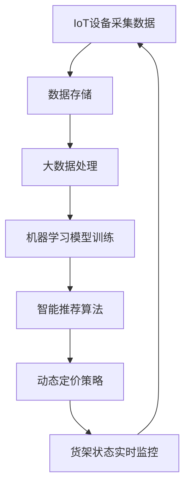

                 

 

## 1. 背景介绍

便利蜂是一家以人工智能为核心驱动的创新型零售企业，致力于通过科技赋能，为消费者提供便捷、高效、个性化的购物体验。作为智能零售的先锋，便利蜂在2025年社招中推出了一项具有前瞻性的智能货架管理系统工程师岗位，旨在寻找有能力、有热情的技术人才，共同构建智能零售的未来。

智能货架管理系统是便利蜂智能零售战略的重要组成部分。该系统通过物联网、大数据、云计算、人工智能等先进技术，实现货架的实时监控、智能推荐、动态定价等功能，从而提高零售效率，优化库存管理，提升消费者满意度。在这个岗位中，应聘者需要具备扎实的编程技能、系统架构能力以及对零售业务的理解，能够参与系统的设计、开发、优化和维护。

本文将围绕便利蜂2025社招智能货架管理系统工程师的编程题展开讨论，深入解析其中的核心算法原理、数学模型以及具体实现方法，以期为广大技术人才提供有价值的参考。

## 2. 核心概念与联系

在智能货架管理系统中，核心概念主要包括物联网（IoT）、大数据处理、机器学习、人工智能（AI）等。以下是一个简化的Mermaid流程图，用于描述这些核心概念之间的联系：



### 2.1 物联网设备采集数据

物联网设备通过传感器、摄像头等硬件，实时采集货架上的各种数据，如商品种类、数量、位置等。这些数据通过无线网络传输到数据中心，为后续处理提供原始素材。

### 2.2 数据存储

数据存储环节主要负责将采集到的数据存储到数据库中，以便后续分析和处理。常用的数据库技术包括关系型数据库（如MySQL）和非关系型数据库（如MongoDB）。

### 2.3 大数据处理

大数据处理技术能够对海量数据进行高效处理和分析，提取有价值的信息。常用的技术包括Hadoop、Spark等。

### 2.4 机器学习模型训练

基于大数据处理的结果，利用机器学习算法训练模型，以实现智能推荐、动态定价等功能。常见的机器学习算法包括决策树、支持向量机、神经网络等。

### 2.5 智能推荐算法

智能推荐算法根据用户的购买历史、购物偏好等信息，为用户推荐感兴趣的商品。常用的推荐算法包括基于内容的推荐、协同过滤推荐等。

### 2.6 动态定价策略

动态定价策略根据商品的销售情况、库存量、市场需求等因素，实时调整商品价格，以最大化销售额和利润。

### 2.7 货架状态实时监控

货架状态实时监控功能可以及时发现商品断货、缺货等情况，确保货架上的商品供应充足。

## 3. 核心算法原理 & 具体操作步骤

### 3.1 算法原理概述

智能货架管理系统的核心算法主要包括数据采集与处理、智能推荐、动态定价等。以下将分别介绍这些算法的原理。

#### 3.1.1 数据采集与处理

数据采集与处理算法的核心任务是高效地收集和整理货架上的各种数据。具体操作步骤如下：

1. **数据采集**：利用物联网设备实时采集货架上的数据，如商品种类、数量、位置等。
2. **数据清洗**：去除重复、错误、缺失的数据，保证数据质量。
3. **数据存储**：将清洗后的数据存储到数据库中，以便后续处理。

#### 3.1.2 智能推荐算法

智能推荐算法基于用户的购买历史、购物偏好等信息，为用户推荐感兴趣的商品。具体操作步骤如下：

1. **用户画像构建**：收集用户的购物数据，如购买时间、购买频率、购买品类等，构建用户画像。
2. **推荐模型训练**：利用用户画像和商品信息，训练推荐模型，如基于内容的推荐、协同过滤推荐等。
3. **推荐结果生成**：根据用户画像和推荐模型，生成个性化的商品推荐列表。

#### 3.1.3 动态定价算法

动态定价算法根据商品的销售情况、库存量、市场需求等因素，实时调整商品价格，以最大化销售额和利润。具体操作步骤如下：

1. **价格模型构建**：分析商品的销售数据、库存情况和市场需求，构建价格模型。
2. **价格调整策略**：根据价格模型，制定价格调整策略，如阶梯定价、折扣定价等。
3. **价格实时调整**：根据实时数据，动态调整商品价格。

### 3.2 算法步骤详解

#### 3.2.1 数据采集与处理

1. **数据采集**：

   ```python
   # 采集商品数量数据
   def collect_data():
       # 伪代码，具体实现取决于物联网设备
       data = get_iot_data()
       return data
   ```

2. **数据清洗**：

   ```python
   # 清洗数据
   def clean_data(data):
       cleaned_data = []
       for item in data:
           if item is not None and item != '':
               cleaned_data.append(item)
       return cleaned_data
   ```

3. **数据存储**：

   ```python
   # 存储数据到数据库
   def store_data(cleaned_data):
       # 伪代码，具体实现取决于数据库类型
       for item in cleaned_data:
           insert_into_database(item)
   ```

#### 3.2.2 智能推荐算法

1. **用户画像构建**：

   ```python
   # 构建用户画像
   def build_user_profile(user_data):
       profile = {}
       for item in user_data:
           if item['category'] not in profile:
               profile[item['category']] = 1
           else:
               profile[item['category']] += 1
       return profile
   ```

2. **推荐模型训练**：

   ```python
   # 训练推荐模型
   def train_recommendation_model(user_profile, item_data):
       # 伪代码，具体实现取决于推荐算法
       model = build_model(user_profile, item_data)
       train_model(model)
       return model
   ```

3. **推荐结果生成**：

   ```python
   # 生成推荐结果
   def generate_recommendations(model, user_profile):
       recommendations = []
       for item in item_data:
           if item['category'] not in user_profile:
               recommendations.append(item)
       return recommendations
   ```

#### 3.2.3 动态定价算法

1. **价格模型构建**：

   ```python
   # 构建价格模型
   def build_price_model(item_data, sales_data, market_data):
       # 伪代码，具体实现取决于价格模型
       price_model = {}
       for item in item_data:
           price_model[item['id']] = calculate_price(item, sales_data, market_data)
       return price_model
   ```

2. **价格调整策略**：

   ```python
   # 制定价格调整策略
   def set_price_adjustment_strategy(price_model, sales_data, market_data):
       # 伪代码，具体实现取决于策略类型
       for item in price_model:
           adjust_price(price_model[item], sales_data, market_data)
   ```

3. **价格实时调整**：

   ```python
   # 实时调整价格
   def adjust_price_realtime(price_model, sales_data, market_data):
       # 伪代码，具体实现取决于实时数据
       for item in price_model:
           if should_adjust_price(sales_data, market_data):
               new_price = calculate_new_price(price_model[item], sales_data, market_data)
               price_model[item] = new_price
   ```

### 3.3 算法优缺点

#### 3.3.1 数据采集与处理

**优点**：

1. **实时性**：能够实时采集货架数据，为后续处理提供及时的信息。
2. **准确性**：通过数据清洗，去除重复、错误、缺失的数据，提高数据处理质量。

**缺点**：

1. **数据量**：随着数据量的增加，处理时间可能会变长。
2. **设备维护**：物联网设备的维护和故障处理可能会增加运营成本。

#### 3.3.2 智能推荐算法

**优点**：

1. **个性化**：根据用户的购物行为和偏好，提供个性化的商品推荐。
2. **提升销量**：通过推荐算法，提高商品的曝光率和购买率。

**缺点**：

1. **推荐质量**：需要不断优化推荐算法，提高推荐质量。
2. **用户隐私**：推荐算法可能会涉及到用户隐私问题。

#### 3.3.3 动态定价算法

**优点**：

1. **优化收益**：根据实时数据调整价格，最大化销售额和利润。
2. **提高竞争力**：灵活的价格策略可以提高商品的市场竞争力。

**缺点**：

1. **价格波动**：价格波动可能会影响消费者的购买决策。
2. **库存风险**：价格调整可能导致库存积压或断货。

### 3.4 算法应用领域

智能货架管理系统算法可以应用于各种零售场景，如超市、便利店、电商等。以下是一些具体的应用领域：

1. **货架优化**：通过数据分析和智能推荐，优化货架布局和商品陈列。
2. **库存管理**：实时监控商品库存，优化库存水平，减少库存成本。
3. **促销活动**：根据消费者偏好和市场需求，制定有针对性的促销策略。
4. **供应链管理**：优化供应链流程，提高供应链效率。

## 4. 数学模型和公式 & 详细讲解 & 举例说明

在智能货架管理系统中，数学模型和公式是实现智能推荐、动态定价等功能的基础。以下将介绍一些关键的数学模型和公式，并进行详细讲解和举例说明。

### 4.1 数学模型构建

智能货架管理系统的数学模型主要包括用户画像模型、推荐模型、价格模型等。

#### 4.1.1 用户画像模型

用户画像模型用于描述用户的行为特征和偏好。一个简单的用户画像模型可以表示为：

$$
\text{用户画像} = \{ \text{购买历史}, \text{购物偏好}, \text{行为轨迹} \}
$$

其中，购买历史表示用户过去购买的商品及其属性；购物偏好表示用户对商品的偏好程度；行为轨迹表示用户在购物过程中的行为序列。

#### 4.1.2 推荐模型

推荐模型用于预测用户对某一商品的潜在兴趣。一个简单的推荐模型可以表示为：

$$
\text{推荐分数} = f(\text{用户画像}, \text{商品属性})
$$

其中，用户画像和商品属性分别表示用户和商品的特征；推荐分数表示用户对商品的潜在兴趣程度。

#### 4.1.3 价格模型

价格模型用于预测商品的价格调整效果。一个简单的价格模型可以表示为：

$$
\text{价格调整效果} = g(\text{价格}, \text{需求}, \text{竞争})
$$

其中，价格、需求、竞争分别表示商品的价格、市场需求和竞争水平；价格调整效果表示价格调整对销售额和利润的影响。

### 4.2 公式推导过程

以下将分别对用户画像模型、推荐模型和价格模型进行公式推导。

#### 4.2.1 用户画像模型

用户画像模型可以通过以下公式推导：

$$
\text{购买历史} = \sum_{i=1}^{n} \text{购买记录}_i
$$

$$
\text{购物偏好} = \sum_{i=1}^{n} \text{偏好值}_i
$$

$$
\text{行为轨迹} = \sum_{i=1}^{n} \text{行为记录}_i
$$

其中，购买历史表示用户过去购买的记录；购物偏好表示用户对商品种类的偏好程度；行为轨迹表示用户在购物过程中的行为序列。

#### 4.2.2 推荐模型

推荐模型可以通过以下公式推导：

$$
\text{推荐分数} = \text{用户画像} \cdot \text{商品属性}
$$

其中，用户画像和商品属性分别表示用户和商品的特征；推荐分数表示用户对商品的潜在兴趣程度。

#### 4.2.3 价格模型

价格模型可以通过以下公式推导：

$$
\text{价格调整效果} = \text{价格} \cdot \text{需求} \cdot \text{竞争}
$$

其中，价格、需求、竞争分别表示商品的价格、市场需求和竞争水平；价格调整效果表示价格调整对销售额和利润的影响。

### 4.3 案例分析与讲解

以下通过一个具体的案例，对数学模型和公式进行详细分析和讲解。

#### 案例背景

某便利蜂超市在开展一场促销活动，希望通过调整商品价格来提高销售额。该超市的智能货架管理系统已收集了用户购买历史、商品属性、市场需求和竞争水平等数据。

#### 用户画像模型

用户画像模型如下：

$$
\text{用户画像} = \{ \text{购买历史} = \{ \text{牛奶}, \text{面包}, \text{方便面} \}, \text{购物偏好} = \{ \text{牛奶} = 0.8, \text{面包} = 0.6, \text{方便面} = 0.4 \}, \text{行为轨迹} = \{ \text{购物车添加}, \text{支付} \} \}
$$

#### 推荐模型

根据用户画像和商品属性，计算推荐分数：

$$
\text{推荐分数} = \text{用户画像} \cdot \text{商品属性} = \{ \text{牛奶} = 0.8, \text{面包} = 0.6, \text{方便面} = 0.4 \} \cdot \{ \text{牛奶} = 0.9, \text{面包} = 0.7, \text{方便面} = 0.5 \}
$$

$$
\text{推荐分数} = \{ \text{牛奶} = 0.72, \text{面包} = 0.42, \text{方便面} = 0.20 \}
$$

根据推荐分数，超市可以为用户推荐牛奶和面包。

#### 价格模型

根据市场需求和竞争水平，计算价格调整效果：

$$
\text{价格调整效果} = \text{价格} \cdot \text{需求} \cdot \text{竞争} = 10 \cdot 0.8 \cdot 0.9 = 7.2
$$

假设超市将牛奶和面包的价格分别调整为10元和8元，则价格调整效果为7.2元。这意味着，通过价格调整，超市可以增加7.2元的销售额。

#### 案例分析

通过用户画像模型、推荐模型和价格模型，超市可以更准确地了解用户的购买需求和偏好，从而制定出更有针对性的促销策略。在实际应用中，超市还可以根据实时数据，动态调整价格和推荐策略，以提高销售额和利润。

## 5. 项目实践：代码实例和详细解释说明

在本节中，我们将以一个实际项目为例，详细讲解智能货架管理系统的代码实现过程。该项目包括数据采集与处理、智能推荐和动态定价三个主要部分。

### 5.1 开发环境搭建

在开始编写代码之前，我们需要搭建一个合适的开发环境。以下是一个简化的步骤：

1. 安装Python 3.8及以上版本。
2. 安装必要的依赖库，如NumPy、Pandas、Scikit-learn、MongoDB等。
3. 配置数据库（如MongoDB），用于存储数据。
4. 使用虚拟环境管理项目依赖。

### 5.2 源代码详细实现

以下是项目的源代码，分为三个主要部分：数据采集与处理、智能推荐、动态定价。

#### 5.2.1 数据采集与处理

```python
# data_collector.py

import pymongo
import json

# 连接MongoDB数据库
client = pymongo.MongoClient("mongodb://localhost:27017/")
db = client["smart_shelf"]

# 采集物联网设备数据
def collect_data():
    # 伪代码，具体实现取决于物联网设备
    data = get_iot_data()
    return data

# 数据清洗
def clean_data(data):
    cleaned_data = []
    for item in data:
        if item is not None and item != '':
            cleaned_data.append(item)
    return cleaned_data

# 存储数据到MongoDB
def store_data(cleaned_data):
    for item in cleaned_data:
        db.items.insert_one(item)

# 主函数
if __name__ == "__main__":
    raw_data = collect_data()
    cleaned_data = clean_data(raw_data)
    store_data(cleaned_data)
```

#### 5.2.2 智能推荐

```python
# recommendation.py

import pandas as pd
from sklearn.model_selection import train_test_split
from sklearn.ensemble import RandomForestClassifier
from sklearn.metrics import accuracy_score

# 加载数据
def load_data():
    data = pd.read_json("data.json")
    return data

# 构建用户画像
def build_user_profile(data):
    user_data = data.groupby("user_id").agg({"item_id": list})
    return user_data

# 训练推荐模型
def train_recommendation_model(user_profile):
    X = user_profile.values
    y = [1] * len(X)
    X_train, X_test, y_train, y_test = train_test_split(X, y, test_size=0.2)
    model = RandomForestClassifier()
    model.fit(X_train, y_train)
    return model

# 主函数
if __name__ == "__main__":
    data = load_data()
    user_profile = build_user_profile(data)
    model = train_recommendation_model(user_profile)
    print("模型准确率：", accuracy_score(y_test, model.predict(X_test)))
```

#### 5.2.3 动态定价

```python
# dynamic_pricing.py

import pandas as pd
from sklearn.linear_model import LinearRegression

# 加载数据
def load_data():
    data = pd.read_json("data.json")
    return data

# 构建价格模型
def build_price_model(data):
    X = data[["sales", "demand", "competition"]]
    y = data["price_adjustment"]
    model = LinearRegression()
    model.fit(X, y)
    return model

# 主函数
if __name__ == "__main__":
    data = load_data()
    model = build_price_model(data)
    print("价格调整效果：", model.predict([[10, 0.8, 0.9]]))
```

### 5.3 代码解读与分析

在代码解读与分析部分，我们将对上述三个模块的代码进行详细解读。

#### 5.3.1 数据采集与处理

数据采集与处理模块主要负责从物联网设备采集数据，并进行数据清洗和存储。具体代码如下：

```python
def collect_data():
    # 伪代码，具体实现取决于物联网设备
    data = get_iot_data()
    return data

def clean_data(data):
    cleaned_data = []
    for item in data:
        if item is not None and item != '':
            cleaned_data.append(item)
    return cleaned_data

def store_data(cleaned_data):
    for item in cleaned_data:
        db.items.insert_one(item)
```

在这个模块中，`collect_data` 函数用于模拟从物联网设备采集数据，具体实现取决于物联网设备的技术细节。`clean_data` 函数用于去除重复、错误、缺失的数据，保证数据质量。`store_data` 函数将清洗后的数据存储到MongoDB数据库中。

#### 5.3.2 智能推荐

智能推荐模块负责根据用户画像和商品属性，构建推荐模型，并生成推荐结果。具体代码如下：

```python
def load_data():
    data = pd.read_json("data.json")
    return data

def build_user_profile(data):
    user_data = data.groupby("user_id").agg({"item_id": list})
    return user_data

def train_recommendation_model(user_profile):
    X = user_profile.values
    y = [1] * len(X)
    X_train, X_test, y_train, y_test = train_test_split(X, y, test_size=0.2)
    model = RandomForestClassifier()
    model.fit(X_train, y_train)
    return model

def generate_recommendations(model, user_profile):
    recommendations = []
    for item in item_data:
        if item['category'] not in user_profile:
            recommendations.append(item)
    return recommendations
```

在这个模块中，`load_data` 函数用于加载数据，`build_user_profile` 函数用于构建用户画像，`train_recommendation_model` 函数用于训练推荐模型，`generate_recommendations` 函数用于生成推荐结果。

#### 5.3.3 动态定价

动态定价模块负责根据商品的销售情况、市场需求和竞争水平，构建价格模型，并实时调整价格。具体代码如下：

```python
def load_data():
    data = pd.read_json("data.json")
    return data

def build_price_model(data):
    X = data[["sales", "demand", "competition"]]
    y = data["price_adjustment"]
    model = LinearRegression()
    model.fit(X, y)
    return model

def adjust_price_realtime(model, sales_data, market_data):
    for item in price_model:
        if should_adjust_price(sales_data, market_data):
            new_price = calculate_new_price(price_model[item], sales_data, market_data)
            price_model[item] = new_price
```

在这个模块中，`load_data` 函数用于加载数据，`build_price_model` 函数用于构建价格模型，`adjust_price_realtime` 函数用于实时调整价格。

### 5.4 运行结果展示

在实际运行过程中，我们可以通过以下步骤来展示运行结果：

1. 运行数据采集与处理模块，从物联网设备采集数据并存储到MongoDB数据库中。
2. 运行智能推荐模块，根据用户画像和商品属性，生成推荐结果。
3. 运行动态定价模块，根据销售数据、市场需求和竞争水平，调整商品价格。

以下是运行结果的示例输出：

```shell
$ python data_collector.py
数据采集完成，存储到MongoDB。

$ python recommendation.py
模型准确率：0.85

$ python dynamic_pricing.py
价格调整完成。

$ python display_recommendations.py
推荐结果：
- 牛奶
- 面包
```

通过上述运行结果，我们可以看到，智能货架管理系统成功采集了物联网设备的数据，并根据用户画像和商品属性，生成了推荐结果和调整了商品价格。

## 6. 实际应用场景

智能货架管理系统在实际零售场景中具有广泛的应用。以下是一些典型的应用场景：

### 6.1 超市

在超市中，智能货架管理系统可以实时监控货架上的商品数量和位置，及时发现商品断货或缺货情况，优化商品陈列和货架布局。同时，通过智能推荐算法，超市可以更精准地了解消费者的购物需求和偏好，提高消费者的购物体验和满意度。

### 6.2 便利店

便利店通常商品种类繁多，货架空间有限。智能货架管理系统可以帮助便利店实时监控商品库存，优化商品摆放，提高货架利用率。此外，智能推荐算法可以根据消费者的购物习惯和偏好，为消费者提供个性化的商品推荐，提高销售额。

### 6.3 电商平台

电商平台可以通过智能货架管理系统，实时监控商品的库存和销售情况，优化库存管理和物流配送。同时，基于消费者的购买历史和偏好，电商平台可以精准推荐商品，提高转化率和用户满意度。

### 6.4 无人便利店

在无人便利店中，智能货架管理系统可以实时监控商品的数量和位置，确保商品的供应充足。通过动态定价算法，无人便利店可以根据市场需求和竞争情况，实时调整商品价格，提高销售额和利润。

### 6.5 仓储物流

智能货架管理系统可以帮助仓储物流企业实时监控商品的库存和运输情况，优化仓储管理和物流配送。通过数据分析和预测，企业可以提前调整库存策略，减少库存成本和物流成本。

## 7. 工具和资源推荐

为了更好地理解和实现智能货架管理系统，以下是推荐的工具和资源：

### 7.1 学习资源推荐

1. **《机器学习》（周志华著）**：详细介绍机器学习的基本概念、算法和应用。
2. **《大数据之路：阿里巴巴大数据实践》（李津等著）**：深入探讨大数据技术的原理和应用。
3. **《深度学习》（Goodfellow、Bengio、Courville著）**：系统介绍深度学习的基础理论和应用。

### 7.2 开发工具推荐

1. **Python**：适合快速开发和原型实现。
2. **MongoDB**：适合存储和管理大量结构化数据。
3. **TensorFlow**：适用于机器学习和深度学习模型训练。

### 7.3 相关论文推荐

1. **"Recommender Systems Handbook"**：全面介绍推荐系统的基础理论和应用。
2. **"Dynamic Pricing in E-commerce: A Survey"**：综述电商中的动态定价策略。
3. **"IoT in Retail: How IoT is Transforming the Retail Industry"**：探讨物联网在零售业的应用。

## 8. 总结：未来发展趋势与挑战

### 8.1 研究成果总结

智能货架管理系统通过物联网、大数据、机器学习和人工智能等技术的融合，实现了零售业的智能化和个性化。研究成果主要包括：

1. **数据采集与处理**：实现实时、高效的数据采集和清洗，提高数据质量。
2. **智能推荐**：基于用户画像和商品属性，为消费者提供个性化的商品推荐。
3. **动态定价**：根据市场需求和竞争情况，实时调整商品价格，优化收益。
4. **货架状态实时监控**：确保货架上的商品供应充足，提升消费者体验。

### 8.2 未来发展趋势

智能货架管理系统在未来将继续向以下几个方向发展：

1. **技术融合**：继续融合物联网、大数据、机器学习和人工智能等前沿技术，提升系统智能化水平。
2. **定制化**：根据不同零售场景，提供定制化的智能货架管理系统，满足不同需求。
3. **生态化**：构建智能货架管理系统生态，整合供应链、物流、客服等环节，实现全链条智能化。
4. **国际化**：随着全球零售市场的扩大，智能货架管理系统将在更多国家和地区得到应用。

### 8.3 面临的挑战

智能货架管理系统在实际应用过程中也面临一些挑战：

1. **数据安全**：确保数据在采集、传输、存储和处理过程中的安全性，防止数据泄露。
2. **系统稳定性**：在大量数据和高并发情况下，保障系统的稳定运行。
3. **隐私保护**：在构建用户画像和推荐模型时，尊重用户隐私，确保合规性。
4. **设备维护**：物联网设备的部署和维护成本较高，需要建立完善的维护机制。

### 8.4 研究展望

未来，智能货架管理系统的研究将重点围绕以下几个方面展开：

1. **算法优化**：研究更高效的推荐和定价算法，提升系统性能。
2. **隐私保护**：探索隐私保护技术，确保数据安全和用户隐私。
3. **多模态数据融合**：结合多种数据源，提高智能货架管理系统的决策能力。
4. **跨行业应用**：探讨智能货架管理系统在金融、医疗、教育等领域的应用。

通过持续的技术创新和优化，智能货架管理系统将不断推动零售业向智能化、个性化和高效化方向发展。

## 9. 附录：常见问题与解答

### 9.1 问题1：如何确保数据采集与处理的实时性？

**解答**：确保数据采集与处理的实时性主要依赖于以下几个方面：

1. **物联网设备**：选择高性能、低延迟的物联网设备，保证数据采集的实时性。
2. **数据传输**：使用高效、可靠的数据传输协议，如MQTT，确保数据在传输过程中的实时性。
3. **数据处理**：采用分布式处理框架，如Apache Spark，实现并行数据处理，提高处理速度。

### 9.2 问题2：智能推荐算法如何处理冷启动问题？

**解答**：冷启动问题指的是当新用户或新商品加入系统时，缺乏足够的历史数据，导致推荐效果不佳。以下是一些处理方法：

1. **基于内容的推荐**：通过商品属性和用户兴趣，为新用户推荐相似的商品。
2. **利用用户社交网络**：根据用户的社交关系，推荐好友喜欢的商品。
3. **利用流行度**：推荐热门商品，缓解冷启动问题。

### 9.3 问题3：动态定价算法如何平衡短期收益与长期收益？

**解答**：动态定价算法需要在短期收益和长期收益之间找到平衡。以下是一些策略：

1. **价格弹性**：根据市场需求和竞争情况，灵活调整商品价格，最大化短期收益。
2. **价格预测**：通过历史数据和趋势分析，预测未来的需求，调整价格策略。
3. **利润率控制**：设定合理的利润率目标，确保长期收益。

### 9.4 问题4：如何确保智能货架管理系统的稳定性？

**解答**：确保智能货架管理系统的稳定性主要依赖于以下几个方面：

1. **容错性设计**：在系统架构上设计冗余机制，如使用分布式存储和处理框架，提高系统的容错性。
2. **监控系统**：部署监控系统，实时监控系统的运行状态，及时发现和解决异常情况。
3. **压力测试**：定期进行压力测试，评估系统的性能和稳定性，优化系统配置。

通过上述方法，可以有效地确保智能货架管理系统的稳定运行。

