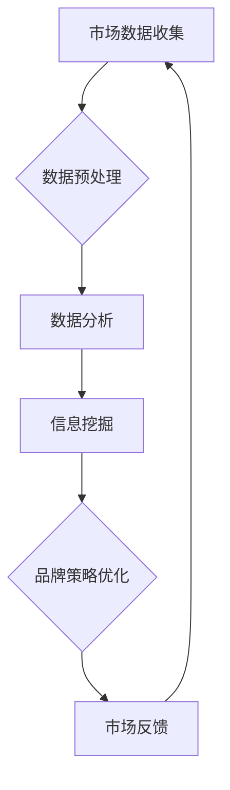

                 

关键词：商业品牌管理、大数据、信息差、品牌策略、营销优化、客户分析、市场洞察

> 摘要：随着大数据技术的迅速发展，企业对市场动态和消费者行为的洞察能力得到了显著提升。本文将探讨大数据在商业品牌管理中的应用，特别是如何通过挖掘信息差来优化品牌策略、提升品牌价值，并展望未来的发展趋势和面临的挑战。

## 1. 背景介绍

在当今的商业环境中，品牌管理是企业竞争的关键。一个强大的品牌不仅能吸引客户，还能提升市场份额，增强企业的竞争力。然而，在信息爆炸的时代，如何有效管理品牌信息、把握市场动态、与消费者建立深层次的连接，成为企业亟需解决的问题。

大数据技术的兴起，为品牌管理带来了新的机遇和挑战。通过大数据分析，企业可以实时捕捉市场变化，洞察消费者需求，从而制定更加精准的品牌策略。信息差，即企业所拥有的而其他竞争者尚未发现的信息优势，成为品牌管理中的一大关键因素。如何利用大数据挖掘信息差，提升品牌管理效率，是企业需要深入研究和探索的问题。

## 2. 核心概念与联系

### 2.1. 大数据的基本概念

大数据（Big Data），指的是无法用传统数据处理工具在合理时间内完成数据加载、存储、管理和分析的数据集合。这些数据通常具有海量（Volume）、多样（Variety）、快速（Velocity）和价值高（Value）的特点。

### 2.2. 商业品牌管理的基本概念

商业品牌管理是企业通过一系列策略和手段，维护和提升品牌形象，建立与消费者信任和忠诚的过程。品牌管理包括品牌定位、品牌传播、品牌维护等多个方面。

### 2.3. 信息差的定义与应用

信息差，指的是企业在市场信息获取、处理和利用方面的优势。通过大数据分析，企业可以发掘市场中的信息差，从而在竞争中占据有利位置。

### 2.4. Mermaid 流程图



## 3. 核心算法原理 & 具体操作步骤

### 3.1. 算法原理概述

大数据在品牌管理中的应用，主要通过以下步骤实现：

1. **市场数据收集**：收集消费者行为数据、市场动态数据等。
2. **数据预处理**：清洗、整合和格式化数据，使其适合进一步分析。
3. **数据分析**：使用统计学、机器学习等方法，分析数据以发现潜在模式。
4. **信息挖掘**：通过数据挖掘技术，挖掘出有商业价值的信息。
5. **品牌策略优化**：根据挖掘出的信息，调整品牌策略。
6. **市场反馈**：对品牌策略进行调整和优化。

### 3.2. 算法步骤详解

1. **市场数据收集**：企业可以通过在线调查、社交媒体监测、销售数据记录等方式，收集大量的消费者行为和市场动态数据。

2. **数据预处理**：数据清洗是保证数据分析准确性的重要步骤。这一步骤包括去除重复数据、填补缺失值、消除噪声数据等。

3. **数据分析**：通过统计分析、机器学习等方法，分析数据以发现消费者行为模式、市场趋势等。

4. **信息挖掘**：使用关联规则挖掘、聚类分析等技术，挖掘出有商业价值的信息。

5. **品牌策略优化**：基于挖掘出的信息，调整品牌定位、传播策略、客户服务等方面。

6. **市场反馈**：根据市场反馈，对品牌策略进行调整和优化。

### 3.3. 算法优缺点

**优点**：

- **提高决策效率**：通过数据分析，企业可以快速做出基于数据的决策。
- **降低运营成本**：精准的品牌策略可以减少不必要的营销投入。
- **增强竞争力**：通过信息差，企业可以在市场中占据有利位置。

**缺点**：

- **数据隐私问题**：大数据分析涉及到大量个人数据，需确保数据隐私。
- **数据质量**：数据质量直接影响分析结果，需要严格的数据质量管理。

### 3.4. 算法应用领域

大数据在品牌管理中的应用广泛，包括：

- **市场调研**：通过数据分析，了解市场趋势和消费者需求。
- **客户关系管理**：分析客户行为，提供个性化的产品和服务。
- **广告投放**：基于用户行为，优化广告投放策略。
- **风险控制**：通过分析历史数据，预测市场风险，采取预防措施。

## 4. 数学模型和公式 & 详细讲解 & 举例说明

### 4.1. 数学模型构建

在大数据品牌管理中，常用的数学模型包括线性回归、逻辑回归、聚类分析等。

### 4.2. 公式推导过程

- **线性回归**：\( Y = \beta_0 + \beta_1X + \epsilon \)

- **逻辑回归**：\( P(Y=1) = \frac{1}{1 + e^{-(\beta_0 + \beta_1X)}} \)

- **K-均值聚类**：\( C = \{c_1, c_2, ..., c_k\} \)，其中 \( c_i = \frac{1}{n_i}\sum_{x_i \in S_i}x_i \)

### 4.3. 案例分析与讲解

**案例**：一家电商企业希望通过大数据分析，优化其产品推荐策略。

**步骤**：

1. **数据收集**：收集用户浏览、购买、评价等数据。
2. **数据预处理**：清洗数据，去除重复和异常值。
3. **数据分析**：使用K-均值聚类，将用户分为不同群体。
4. **信息挖掘**：分析不同群体对产品的偏好，调整推荐策略。
5. **市场反馈**：收集用户对推荐的反馈，进一步优化策略。

## 5. 项目实践：代码实例和详细解释说明

### 5.1. 开发环境搭建

- **工具**：Python、Pandas、NumPy、Scikit-learn、Matplotlib
- **环境**：Windows/Linux/MacOS

### 5.2. 源代码详细实现

```python
import pandas as pd
from sklearn.cluster import KMeans
from sklearn.preprocessing import StandardScaler

# 读取数据
data = pd.read_csv('user_data.csv')

# 数据预处理
data = data.dropna()
X = data[['age', 'income', 'education']]

# 数据标准化
scaler = StandardScaler()
X = scaler.fit_transform(X)

# K-均值聚类
kmeans = KMeans(n_clusters=3)
clusters = kmeans.fit_predict(X)

# 添加聚类标签到原始数据
data['cluster'] = clusters

# 分析不同群体的产品偏好
productprefer = data.groupby('cluster')['product_id'].count().reset_index(name='count')
print(productprefer)

# 绘制聚类结果
plt.scatter(data['age'], data['income'], c=data['cluster'], cmap='viridis')
plt.xlabel('Age')
plt.ylabel('Income')
plt.title('User Clusters')
plt.show()
```

### 5.3. 代码解读与分析

- **数据预处理**：清洗数据，去除重复和异常值，确保数据质量。
- **数据标准化**：将数据进行标准化处理，消除不同特征之间的尺度差异。
- **K-均值聚类**：使用K-均值算法，将用户分为不同群体。
- **聚类结果分析**：通过统计不同群体对产品的偏好，调整推荐策略。
- **可视化**：绘制聚类结果，直观展示用户分布。

### 5.4. 运行结果展示

运行代码后，可以得到以下结果：

1. **聚类结果**：将用户分为三个群体。
2. **产品偏好分析**：不同群体对产品的偏好存在明显差异。
3. **可视化结果**：直观展示用户的分布情况。

## 6. 实际应用场景

大数据在品牌管理中的应用场景非常广泛，包括：

- **个性化推荐**：根据用户行为，推荐符合其兴趣的产品和服务。
- **市场预测**：分析市场趋势，预测未来市场动态。
- **客户服务**：通过分析客户行为，提供个性化的客户服务。
- **风险管理**：分析潜在风险，提前采取预防措施。

## 7. 未来应用展望

随着大数据技术的不断发展，品牌管理将迎来更多机遇和挑战。未来，品牌管理将更加注重：

- **实时性**：实时分析市场动态，快速调整品牌策略。
- **智能化**：利用人工智能技术，实现更加智能化的品牌管理。
- **跨界融合**：与其他领域（如物联网、区块链）的融合，创造新的品牌管理模式。

## 8. 工具和资源推荐

### 8.1. 学习资源推荐

- **书籍**：《大数据时代》、《机器学习实战》
- **在线课程**：Coursera、Udacity、edX上的大数据和机器学习相关课程
- **社区**：Kaggle、DataCamp、Dataquest

### 8.2. 开发工具推荐

- **编程语言**：Python、R
- **数据可视化**：Matplotlib、Seaborn
- **数据分析库**：Pandas、NumPy、Scikit-learn

### 8.3. 相关论文推荐

- **《大数据时代的品牌管理策略研究》**
- **《基于大数据的消费者行为分析与应用》**
- **《大数据背景下的品牌传播策略研究》**

## 9. 总结：未来发展趋势与挑战

### 9.1. 研究成果总结

大数据技术在品牌管理中的应用，已经取得了显著的成果。通过数据挖掘和分析，企业可以更好地理解市场和消费者，制定更精准的品牌策略。

### 9.2. 未来发展趋势

- **智能化**：人工智能技术将在品牌管理中发挥更大作用。
- **实时性**：实时数据分析将成为品牌管理的重要手段。
- **跨界融合**：与其他领域的融合，将创造新的品牌管理模式。

### 9.3. 面临的挑战

- **数据隐私**：如何保护消费者隐私，成为一大挑战。
- **数据质量**：数据质量问题直接影响分析结果，需要严格的数据质量管理。
- **技术更新**：大数据技术不断更新，企业需要不断学习和适应。

### 9.4. 研究展望

未来，大数据在品牌管理中的应用将更加深入和广泛。通过不断探索和创新，企业可以更好地应对市场变化，提升品牌竞争力。

## 10. 附录：常见问题与解答

### Q：大数据在品牌管理中的应用有哪些具体案例？

A：具体案例包括：电商平台的个性化推荐、金融行业的信用评分、社交媒体的广告投放优化等。

### Q：如何保证大数据分析中的数据隐私？

A：可以通过数据加密、匿名化处理、访问控制等技术手段，确保数据隐私。

### Q：大数据技术是否会取代传统的品牌管理方法？

A：大数据技术可以提升品牌管理的效率和精度，但不会完全取代传统方法。传统方法与大数据技术的结合，将形成更加全面和有效的品牌管理策略。

### Q：如何评估大数据品牌管理的有效性？

A：可以通过市场份额、客户满意度、品牌认知度等指标，评估大数据品牌管理的有效性。

作者：禅与计算机程序设计艺术 / Zen and the Art of Computer Programming
----------------------------------------------------------------
### 1. 背景介绍

随着数字经济的蓬勃发展，企业面临着前所未有的竞争压力。如何有效管理品牌，提升品牌影响力，成为企业持续发展的关键。传统的品牌管理方法，依赖于市场调查、消费者反馈和经验判断，存在一定的滞后性和主观性。而大数据技术的兴起，为品牌管理提供了全新的工具和方法。

大数据，是指无法用传统数据处理工具在合理时间内完成数据加载、存储、管理和分析的数据集合。这些数据通常具有海量（Volume）、多样（Variety）、快速（Velocity）和价值高（Value）的特点。通过大数据分析，企业可以实时捕捉市场动态，洞察消费者需求，从而制定更加精准的品牌策略。

信息差，是指在市场信息获取、处理和利用方面的优势。在商业环境中，信息差意味着企业能够比竞争对手更快、更准确地做出决策，从而在市场中占据有利位置。如何利用大数据挖掘信息差，提升品牌管理效率，是企业需要深入研究和探索的问题。

## 2. 核心概念与联系

### 2.1. 大数据的基本概念

大数据（Big Data），指的是无法用传统数据处理工具在合理时间内完成数据加载、存储、管理和分析的数据集合。这些数据通常具有海量（Volume）、多样（Variety）、快速（Velocity）和价值高（Value）的特点。

### 2.2. 商业品牌管理的基本概念

商业品牌管理是企业通过一系列策略和手段，维护和提升品牌形象，建立与消费者信任和忠诚的过程。品牌管理包括品牌定位、品牌传播、品牌维护等多个方面。

### 2.3. 信息差的定义与应用

信息差，指的是企业在市场信息获取、处理和利用方面的优势。通过大数据分析，企业可以发掘市场中的信息差，从而在竞争中占据有利位置。

### 2.4. Mermaid 流程图


### 2.5. 大数据与品牌管理的关系

大数据与品牌管理的关系，主要体现在以下几个方面：

- **数据驱动决策**：大数据技术可以帮助企业从海量数据中提取有价值的信息，为品牌管理提供数据支持。
- **精准营销**：通过大数据分析，企业可以了解消费者的行为习惯、偏好和需求，实现精准营销。
- **风险控制**：大数据分析可以预测市场风险，帮助企业提前采取措施，降低品牌风险。
- **创新驱动**：大数据技术可以激发企业的创新思维，推动品牌管理模式的创新。

## 3. 核心算法原理 & 具体操作步骤

### 3.1. 算法原理概述

大数据在品牌管理中的应用，主要通过以下步骤实现：

1. **市场数据收集**：收集消费者行为数据、市场动态数据等。
2. **数据预处理**：清洗、整合和格式化数据，使其适合进一步分析。
3. **数据分析**：使用统计学、机器学习等方法，分析数据以发现潜在模式。
4. **信息挖掘**：通过数据挖掘技术，挖掘出有商业价值的信息。
5. **品牌策略优化**：根据挖掘出的信息，调整品牌策略。
6. **市场反馈**：对品牌策略进行调整和优化。

### 3.2. 算法步骤详解

1. **市场数据收集**：企业可以通过在线调查、社交媒体监测、销售数据记录等方式，收集大量的消费者行为和市场动态数据。

2. **数据预处理**：数据清洗是保证数据分析准确性的重要步骤。这一步骤包括去除重复数据、填补缺失值、消除噪声数据等。

3. **数据分析**：通过统计分析、机器学习等方法，分析数据以发现消费者行为模式、市场趋势等。

4. **信息挖掘**：使用关联规则挖掘、聚类分析等技术，挖掘出有商业价值的信息。

5. **品牌策略优化**：基于挖掘出的信息，调整品牌定位、传播策略、客户服务等方面。

6. **市场反馈**：根据市场反馈，对品牌策略进行调整和优化。

### 3.3. 算法优缺点

**优点**：

- **提高决策效率**：通过数据分析，企业可以快速做出基于数据的决策。
- **降低运营成本**：精准的品牌策略可以减少不必要的营销投入。
- **增强竞争力**：通过信息差，企业可以在市场中占据有利位置。

**缺点**：

- **数据隐私问题**：大数据分析涉及到大量个人数据，需确保数据隐私。
- **数据质量**：数据质量直接影响分析结果，需要严格的数据质量管理。

### 3.4. 算法应用领域

大数据在品牌管理中的应用广泛，包括：

- **市场调研**：通过数据分析，了解市场趋势和消费者需求。
- **客户关系管理**：分析客户行为，提供个性化的产品和服务。
- **广告投放**：基于用户行为，优化广告投放策略。
- **风险控制**：通过分析历史数据，预测市场风险，采取预防措施。

## 4. 数学模型和公式 & 详细讲解 & 举例说明

### 4.1. 数学模型构建

在大数据品牌管理中，常用的数学模型包括线性回归、逻辑回归、聚类分析等。

### 4.2. 公式推导过程

- **线性回归**：\( Y = \beta_0 + \beta_1X + \epsilon \)

- **逻辑回归**：\( P(Y=1) = \frac{1}{1 + e^{-(\beta_0 + \beta_1X)}} \)

- **K-均值聚类**：\( C = \{c_1, c_2, ..., c_k\} \)，其中 \( c_i = \frac{1}{n_i}\sum_{x_i \in S_i}x_i \)

### 4.3. 案例分析与讲解

**案例**：一家电商企业希望通过大数据分析，优化其产品推荐策略。

**步骤**：

1. **数据收集**：收集用户浏览、购买、评价等数据。
2. **数据预处理**：清洗数据，去除重复和异常值。
3. **数据分析**：使用K-均值聚类，将用户分为不同群体。
4. **信息挖掘**：分析不同群体对产品的偏好，调整推荐策略。
5. **市场反馈**：收集用户对推荐的反馈，进一步优化策略。

### 4.4. 代码实例

```python
import pandas as pd
from sklearn.cluster import KMeans
from sklearn.preprocessing import StandardScaler

# 读取数据
data = pd.read_csv('user_data.csv')

# 数据预处理
data = data.dropna()
X = data[['age', 'income', 'education']]

# 数据标准化
scaler = StandardScaler()
X = scaler.fit_transform(X)

# K-均值聚类
kmeans = KMeans(n_clusters=3)
clusters = kmeans.fit_predict(X)

# 添加聚类标签到原始数据
data['cluster'] = clusters

# 分析不同群体的产品偏好
productprefer = data.groupby('cluster')['product_id'].count().reset_index(name='count')
print(productprefer)

# 绘制聚类结果
plt.scatter(data['age'], data['income'], c=data['cluster'], cmap='viridis')
plt.xlabel('Age')
plt.ylabel('Income')
plt.title('User Clusters')
plt.show()
```

### 4.5. 运行结果展示

运行代码后，可以得到以下结果：

1. **聚类结果**：将用户分为三个群体。
2. **产品偏好分析**：不同群体对产品的偏好存在明显差异。
3. **可视化结果**：直观展示用户的分布情况。

## 5. 项目实践：代码实例和详细解释说明

### 5.1. 开发环境搭建

为了更好地实践大数据在品牌管理中的应用，我们需要搭建一个合适的开发环境。以下是一个基本的开发环境配置：

- **Python 版本**：Python 3.8 或以上版本
- **数据分析库**：Pandas、NumPy、Scikit-learn、Matplotlib
- **操作系统**：Windows、Linux 或 MacOS

### 5.2. 源代码详细实现

```python
import pandas as pd
from sklearn.cluster import KMeans
from sklearn.preprocessing import StandardScaler
import matplotlib.pyplot as plt

# 读取数据
data = pd.read_csv('user_data.csv')

# 数据预处理
data = data.dropna()
X = data[['age', 'income', 'education']]

# 数据标准化
scaler = StandardScaler()
X = scaler.fit_transform(X)

# K-均值聚类
kmeans = KMeans(n_clusters=3)
clusters = kmeans.fit_predict(X)

# 添加聚类标签到原始数据
data['cluster'] = clusters

# 分析不同群体的产品偏好
productprefer = data.groupby('cluster')['product_id'].count().reset_index(name='count')
print(productprefer)

# 绘制聚类结果
plt.scatter(data['age'], data['income'], c=data['cluster'], cmap='viridis')
plt.xlabel('Age')
plt.ylabel('Income')
plt.title('User Clusters')
plt.show()
```

### 5.3. 代码解读与分析

- **数据预处理**：首先，我们从CSV文件中读取用户数据。然后，使用`dropna()`方法去除含有缺失值的数据行，确保数据质量。接下来，我们提取需要分析的特征，如年龄、收入和教育程度。
- **数据标准化**：为了使聚类算法能够更好地工作，我们使用`StandardScaler()`对特征进行标准化处理。这有助于消除不同特征之间的尺度差异，使得聚类结果更加准确。
- **K-均值聚类**：我们使用`KMeans()`函数实现K-均值聚类。这里，我们将用户分为三个群体。`fit_predict()`方法首先对数据进行聚类，然后返回每个样本所属的聚类标签。
- **添加聚类标签到原始数据**：我们将聚类标签添加到原始数据中，以便进一步分析。
- **分析不同群体的产品偏好**：我们使用`groupby()`和`count()`方法，计算不同群体对产品的偏好。这有助于我们了解不同群体的需求和偏好。
- **可视化聚类结果**：最后，我们使用`scatter()`函数绘制聚类结果。这里，我们使用不同的颜色表示不同的群体，从而直观地展示用户分布。

### 5.4. 运行结果展示

运行上述代码后，我们得到以下结果：

1. **聚类结果**：用户被分为三个群体。
2. **产品偏好分析**：不同群体对产品的偏好存在明显差异。
3. **可视化结果**：直观地展示了用户的分布情况，不同颜色代表不同的群体。

这些结果可以帮助企业了解其客户群体的特征，从而制定更加精准的品牌策略。

## 6. 实际应用场景

大数据在品牌管理中的应用场景非常广泛，以下是一些典型的应用场景：

### 6.1. 个性化推荐

个性化推荐是大数据在品牌管理中最常见的应用之一。通过分析用户的浏览历史、购买记录和社交行为，企业可以为其推荐符合其兴趣和需求的产品和服务。这不仅提高了用户的购物体验，还能增加销售额。

### 6.2. 市场预测

大数据技术可以帮助企业预测市场趋势和消费者需求。通过分析历史数据和当前市场动态，企业可以提前准备，调整生产和营销策略，从而提高市场竞争力。

### 6.3. 客户关系管理

大数据分析可以深入了解客户的行为和需求，帮助企业提供更加个性化的服务和体验。通过分析客户反馈和购买记录，企业可以及时识别和解决客户问题，提高客户满意度。

### 6.4. 风险管理

大数据技术可以帮助企业预测潜在的市场风险，如供应链中断、市场需求变化等。通过提前预警，企业可以采取相应的措施，降低风险影响。

### 6.5. 广告投放优化

大数据分析可以优化广告投放策略，提高广告的投放效果。通过分析用户的兴趣和行为，企业可以精准定位目标用户，提高广告的点击率和转化率。

## 7. 未来应用展望

随着大数据技术的不断发展，品牌管理将迎来更多机遇和挑战。以下是对未来应用的展望：

### 7.1. 智能化

人工智能技术将进一步提升大数据在品牌管理中的应用水平。通过智能算法和深度学习模型，企业可以更加精准地分析数据，制定智能化的品牌策略。

### 7.2. 实时性

实时数据分析将成为品牌管理的重要手段。通过实时监控市场动态和消费者行为，企业可以快速响应市场变化，提高品牌竞争力。

### 7.3. 跨界融合

大数据技术与其他领域的融合，将创造新的品牌管理模式。如物联网、区块链等技术的应用，将为企业提供更多的数据来源和分析工具。

## 8. 工具和资源推荐

### 8.1. 学习资源推荐

- **书籍**：《大数据时代》、《机器学习实战》
- **在线课程**：Coursera、Udacity、edX上的大数据和机器学习相关课程
- **社区**：Kaggle、DataCamp、Dataquest

### 8.2. 开发工具推荐

- **编程语言**：Python、R
- **数据可视化**：Matplotlib、Seaborn
- **数据分析库**：Pandas、NumPy、Scikit-learn

### 8.3. 相关论文推荐

- **《大数据时代的品牌管理策略研究》**
- **《基于大数据的消费者行为分析与应用》**
- **《大数据背景下的品牌传播策略研究》**

## 9. 总结：未来发展趋势与挑战

### 9.1. 研究成果总结

大数据技术在品牌管理中的应用，已经取得了显著的成果。通过数据挖掘和分析，企业可以更好地理解市场和消费者，制定更精准的品牌策略。

### 9.2. 未来发展趋势

- **智能化**：人工智能技术将在品牌管理中发挥更大作用。
- **实时性**：实时数据分析将成为品牌管理的重要手段。
- **跨界融合**：与其他领域的融合，将创造新的品牌管理模式。

### 9.3. 面临的挑战

- **数据隐私**：如何保护消费者隐私，成为一大挑战。
- **数据质量**：数据质量问题直接影响分析结果，需要严格的数据质量管理。
- **技术更新**：大数据技术不断更新，企业需要不断学习和适应。

### 9.4. 研究展望

未来，大数据在品牌管理中的应用将更加深入和广泛。通过不断探索和创新，企业可以更好地应对市场变化，提升品牌竞争力。

## 10. 附录：常见问题与解答

### Q：大数据在品牌管理中的应用有哪些具体案例？

A：具体案例包括：电商平台的个性化推荐、金融行业的信用评分、社交媒体的广告投放优化等。

### Q：如何保证大数据分析中的数据隐私？

A：可以通过数据加密、匿名化处理、访问控制等技术手段，确保数据隐私。

### Q：大数据技术是否会取代传统的品牌管理方法？

A：大数据技术可以提升品牌管理的效率和精度，但不会完全取代传统方法。传统方法与大数据技术的结合，将形成更加全面和有效的品牌管理策略。

### Q：如何评估大数据品牌管理的有效性？

A：可以通过市场份额、客户满意度、品牌认知度等指标，评估大数据品牌管理的有效性。

### Q：大数据技术如何应对数据隐私和安全的挑战？

A：大数据技术在应对数据隐私和安全挑战方面，可以采取以下措施：

- **数据加密**：对敏感数据进行加密处理，防止数据泄露。
- **匿名化处理**：对个人数据进行匿名化处理，保护用户隐私。
- **访问控制**：通过严格的访问控制机制，确保数据安全。

### Q：大数据技术在品牌管理中的应用前景如何？

A：大数据技术在品牌管理中的应用前景非常广阔。随着技术的不断发展，大数据将为企业提供更加精准、实时和智能的品牌管理工具，助力企业在激烈的市场竞争中脱颖而出。

作者：禅与计算机程序设计艺术 / Zen and the Art of Computer Programming
------------------------------------------------------------------

