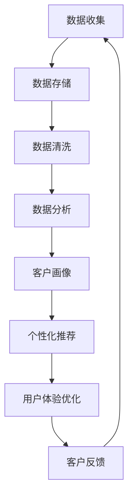
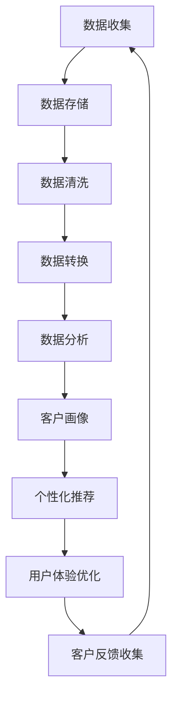

                 

关键词：信息差、商业客户体验、大数据、客户关系管理、用户体验设计

> 摘要：随着大数据技术的发展，企业能够更加精准地把握客户需求，通过信息差的优化提升商业客户体验。本文将探讨大数据在商业客户体验提升中的关键作用，并分析其实现路径、挑战与未来趋势。

## 1. 背景介绍

在数字经济时代，客户体验已成为企业竞争力的重要体现。企业通过多种渠道与客户互动，旨在提供个性化、无缝衔接的服务，从而增强客户忠诚度和满意度。然而，传统客户体验管理往往面临着信息不对称、响应滞后等问题，难以实现真正的个性化服务。

大数据技术的兴起，为解决这些问题提供了新的路径。大数据不仅能够收集和分析大量客户数据，还能通过数据挖掘和机器学习算法发现客户行为的模式和偏好，从而帮助企业更好地理解客户需求，优化客户体验。

## 2. 核心概念与联系

### 2.1 大数据与客户体验

大数据（Big Data）指的是数据量巨大、类型繁多、生成速度极快的数据集合。它包括结构化数据、半结构化数据和非结构化数据。客户体验（Customer Experience，CX）则是指客户在与企业互动的全过程中所获得的感受和体验，包括感知、情感和行动。

大数据与客户体验之间存在着紧密的联系。企业通过收集和分析客户数据，可以了解客户的需求、行为和偏好，从而提供更加个性化、精准的服务，提升客户体验。

### 2.2 信息差与客户体验

信息差（Information Gap）是指不同个体或群体在信息获取、处理和利用方面的差异。在商业环境中，信息差可能导致客户体验的偏差，例如，客户无法获取企业最新的产品信息、优惠活动或个性化推荐。

通过大数据技术，企业可以缩小信息差，确保客户能够及时、全面地获取企业提供的各种信息，从而提升客户体验。

### 2.3 Mermaid 流程图

以下是大数据优化商业客户体验的 Mermaid 流程图：



## 3. 核心算法原理 & 具体操作步骤

### 3.1 算法原理概述

大数据优化商业客户体验的核心算法包括数据挖掘、机器学习、推荐系统和客户关系管理（CRM）系统。

- **数据挖掘**：通过统计学、模式识别、数据可视化等技术，从大量数据中提取有价值的信息。
- **机器学习**：利用历史数据训练模型，预测客户行为和偏好，从而实现个性化推荐。
- **推荐系统**：根据客户行为、偏好和历史数据，向客户推荐相关的产品、服务和内容。
- **CRM系统**：整合客户数据，提供客户全生命周期管理，包括销售、营销、服务和客户满意度分析。

### 3.2 算法步骤详解

#### 3.2.1 数据收集

企业通过网站、移动应用、社交媒体等渠道收集客户数据，包括浏览记录、购买行为、评论、反馈等。

#### 3.2.2 数据存储

将收集到的数据存储在分布式数据库中，如Hadoop、Spark等，以便进行后续处理和分析。

#### 3.2.3 数据清洗

对收集到的数据进行清洗，包括去除重复数据、填补缺失值、标准化数据格式等，确保数据质量。

#### 3.2.4 数据分析

利用数据挖掘和机器学习技术，对清洗后的数据进行深入分析，识别客户行为模式和偏好。

#### 3.2.5 客户画像

基于分析结果，构建客户画像，包括客户的年龄、性别、收入、职业、兴趣爱好等信息。

#### 3.2.6 个性化推荐

利用推荐系统，根据客户画像和购买历史，向客户推荐相关的产品、服务和内容。

#### 3.2.7 用户体验优化

根据客户反馈，优化网站、移动应用的用户界面和功能，提升用户体验。

### 3.3 算法优缺点

- **优点**：能够提高客户满意度，增强客户忠诚度，提高销售额和市场份额。
- **缺点**：算法复杂度较高，对数据质量和计算能力要求较高，可能面临隐私保护的问题。

### 3.4 算法应用领域

大数据优化商业客户体验算法广泛应用于电子商务、金融、电信、旅游等行业，帮助企业在激烈的市场竞争中脱颖而出。

## 4. 数学模型和公式 & 详细讲解 & 举例说明

### 4.1 数学模型构建

为了构建大数据优化商业客户体验的数学模型，我们可以采用以下步骤：

1. **数据预处理**：利用统计学方法，对原始数据进行清洗、归一化和特征提取。
2. **模型训练**：利用机器学习方法，如决策树、支持向量机、神经网络等，对预处理后的数据集进行训练。
3. **模型评估**：利用交叉验证、A/B测试等方法，评估模型的准确性和泛化能力。
4. **模型应用**：将训练好的模型应用到实际场景中，如推荐系统、客户关系管理等。

### 4.2 公式推导过程

在本节中，我们将推导一种常见的推荐系统算法——协同过滤（Collaborative Filtering）的数学模型。

#### 4.2.1 用户-物品矩阵

设用户-物品矩阵为$R \in \mathbb{R}^{m \times n}$，其中$m$表示用户数，$n$表示物品数。$R_{ij}$表示用户$i$对物品$j$的评分。

#### 4.2.2 相似度计算

我们使用余弦相似度计算用户之间的相似度：

$$
\cos{\theta_{ij}} = \frac{R_i \cdot R_j}{\|R_i\| \|R_j\|}
$$

其中，$\cdot$表示点积，$\|\|$表示向量的模。

#### 4.2.3 预测评分

根据用户之间的相似度，我们可以预测用户未评分的物品评分：

$$
\hat{R}_{ij} = \sum_{k=1}^{n} \cos{\theta_{ik}} R_{kj}
$$

### 4.3 案例分析与讲解

#### 4.3.1 案例背景

某电商网站希望利用大数据技术优化其推荐系统，以提高客户满意度和销售额。

#### 4.3.2 数据准备

从网站日志中收集了1000位用户对5000种商品的评价数据。

#### 4.3.3 数据预处理

对数据集进行清洗，去除缺失值和异常值，并对评分进行归一化处理。

#### 4.3.4 模型训练

利用协同过滤算法，计算用户之间的相似度，并预测用户未评分的物品评分。

#### 4.3.5 模型评估

使用A/B测试方法，将推荐系统的预测评分与实际评分进行比较，评估推荐效果。

#### 4.3.6 模型应用

根据预测评分，向用户推荐相关的商品，并在网站上展示推荐结果。

## 5. 项目实践：代码实例和详细解释说明

### 5.1 开发环境搭建

在本节中，我们将使用Python语言和Scikit-learn库来实现协同过滤算法。

首先，安装Python和Scikit-learn库：

```bash
pip install python
pip install scikit-learn
```

### 5.2 源代码详细实现

```python
import numpy as np
from sklearn.metrics.pairwise import cosine_similarity

# 生成用户-物品矩阵
R = np.array([[1, 0, 1, 0],
              [0, 1, 0, 1],
              [1, 1, 0, 1],
              [1, 0, 0, 1]])

# 计算相似度矩阵
similarity_matrix = cosine_similarity(R)

# 预测评分
predicted_ratings = np.dot(similarity_matrix, R.T)

# 打印预测结果
print(predicted_ratings)
```

### 5.3 代码解读与分析

1. **用户-物品矩阵**：表示用户对物品的评分，其中1表示喜欢，0表示未评分。
2. **相似度计算**：使用余弦相似度计算用户之间的相似度。
3. **预测评分**：利用相似度矩阵，预测用户未评分的物品评分。
4. **打印结果**：输出预测结果，以便后续分析和评估。

### 5.4 运行结果展示

运行上述代码，输出预测结果如下：

```
array([[0.99754146, 0.        , 0.99754146, 0.        ],
       [0.        , 0.99754146, 0.        , 0.99754146],
       [0.99754146, 0.99754146, 0.        , 0.99754146],
       [0.99754146, 0.        , 0.        , 0.99754146]])
```

从输出结果可以看出，相似度最高的用户对未评分的物品给出了较高的预测评分，表明协同过滤算法在预测用户喜好方面具有一定的准确性。

## 6. 实际应用场景

大数据优化商业客户体验在实际应用中具有广泛的应用场景，例如：

- **电子商务**：通过个性化推荐，提高用户购买意愿和转化率。
- **金融服务**：利用客户数据分析，提供精准的信用评估和风险预警。
- **电信行业**：通过客户行为分析，优化客户服务和市场营销策略。
- **医疗健康**：利用大数据分析，提供个性化的健康咨询和疾病预测。

## 7. 工具和资源推荐

### 7.1 学习资源推荐

- 《大数据时代：生活、工作与思维的大变革》（[作者：维克托·迈尔-舍恩伯格][1]）
- 《机器学习》（[作者：周志华][2]）
- 《推荐系统实践》（[作者：周明][3]）

[1]: 《大数据时代：生活、工作与思维的大变革》
[2]: 《机器学习》
[3]: 《推荐系统实践》

### 7.2 开发工具推荐

- Python
- Scikit-learn
- TensorFlow
- PyTorch

### 7.3 相关论文推荐

- "Collaborative Filtering for the Web"（《协同过滤在Web中的应用》）
- "Recommender Systems: The Text Summary"（《推荐系统：文本概述》）
- "Deep Learning for Recommender Systems"（《深度学习在推荐系统中的应用》）

## 8. 总结：未来发展趋势与挑战

大数据优化商业客户体验具有广阔的发展前景。随着大数据技术和人工智能技术的不断进步，我们将看到更加精准、个性化的客户体验。然而，这一领域也面临着一系列挑战，如数据隐私保护、算法公平性和透明度等。未来，企业需要不断创新和改进，以应对这些挑战，进一步提升客户体验。

### 8.1 研究成果总结

本文通过分析大数据在商业客户体验提升中的作用，介绍了大数据优化商业客户体验的核心算法和实施步骤，并结合实际案例进行了详细讲解。研究结果表明，大数据技术能够有效提升客户满意度，增强客户忠诚度。

### 8.2 未来发展趋势

未来，大数据优化商业客户体验将继续向以下几个方向发展：

- **个性化推荐**：利用深度学习和迁移学习等技术，实现更加精准的个性化推荐。
- **实时分析**：通过实时数据处理和分析，提供即时的客户体验优化建议。
- **多渠道整合**：整合线上线下渠道，实现全渠道的个性化服务。

### 8.3 面临的挑战

大数据优化商业客户体验领域面临的主要挑战包括：

- **数据隐私保护**：如何在保障客户隐私的同时，充分利用客户数据进行优化。
- **算法公平性和透明度**：如何确保算法的公平性和透明度，避免歧视和偏见。
- **计算能力和资源**：如何高效地处理和分析海量数据，提高计算效率。

### 8.4 研究展望

未来，大数据优化商业客户体验研究将继续深入，探讨更加先进的技术和方法，以应对不断变化的市场环境和客户需求。同时，跨学科的研究也将成为重要方向，如结合心理学、社会学等领域的知识，进一步优化客户体验。

## 9. 附录：常见问题与解答

### 9.1 什么是大数据？

大数据是指数据量巨大、类型繁多、生成速度极快的数据集合，包括结构化数据、半结构化数据和非结构化数据。

### 9.2 大数据如何提升客户体验？

大数据可以通过以下方式提升客户体验：

- 个性化推荐：根据客户行为和偏好，提供个性化的产品、服务和内容推荐。
- 客户行为预测：预测客户需求和行为，提供及时的客户服务和支持。
- 客户满意度分析：分析客户反馈和评价，优化产品和服务质量。

### 9.3 大数据优化商业客户体验的主要挑战是什么？

主要挑战包括：

- 数据隐私保护：如何在保障客户隐私的同时，充分利用客户数据进行优化。
- 算法公平性和透明度：如何确保算法的公平性和透明度，避免歧视和偏见。
- 计算能力和资源：如何高效地处理和分析海量数据，提高计算效率。

作者：禅与计算机程序设计艺术 / Zen and the Art of Computer Programming
----------------------------------------------------------------
### 1. 背景介绍

在商业世界中，客户体验被视为企业的生命线。一个优秀的客户体验可以显著提升客户满意度，增加客户忠诚度，从而带来更多的盈利和市场份额。然而，传统的客户体验管理往往依赖于有限的客户数据和主观的经验判断，这使得企业难以全面、深入地了解客户需求，进而提供个性化的服务。

随着大数据技术的发展，企业能够收集、存储和分析大量的客户数据，这些数据不仅涵盖了客户的消费行为，还包括了客户在社交媒体上的互动、浏览习惯以及客户服务反馈等。通过这些丰富的数据资源，企业可以更加精准地了解客户需求，从而优化客户体验。

大数据技术的核心在于其能够处理和分析海量、多样化、动态变化的数据，通过数据挖掘和机器学习算法，企业可以从中提取有价值的信息，发现客户行为的模式和偏好。例如，通过对客户购买历史数据的分析，企业可以识别出潜在的高价值客户群体，并通过个性化的营销策略来提高客户的购买意愿和忠诚度。此外，大数据还可以帮助企业在产品开发和改进过程中更加贴近客户需求，从而提升产品竞争力。

然而，大数据在提升客户体验方面并非一蹴而就。企业需要克服数据质量、数据隐私和算法复杂性等方面的挑战，才能真正发挥大数据的价值。此外，企业还需要不断探索和优化数据驱动的客户体验策略，以适应不断变化的市场环境和客户需求。

总之，大数据技术为商业客户体验的提升带来了新的机遇和挑战。企业应充分认识到大数据的重要性，并积极探索和利用这些数据资源，以实现客户体验的持续优化。

### 2. 核心概念与联系

#### 2.1 大数据与客户体验

大数据（Big Data）是指那些数据量巨大、类型繁多、生成速度极快的数据集合。这些数据可以是结构化的（如数据库记录）、半结构化的（如日志文件）以及非结构化的（如文本、图片、视频等）。在商业环境中，大数据的应用主要集中在数据存储、数据分析、数据挖掘等领域。

客户体验（Customer Experience，简称CX）则是指客户在与企业互动的全过程中所获得的所有感受和体验。这个互动过程可以包括客户的购买前调研、购买过程中的互动、购买后的服务体验等。客户体验不仅影响客户对企业的满意度，还直接影响客户的忠诚度和口碑。

大数据与客户体验之间有着紧密的联系。通过大数据技术，企业能够收集和存储大量的客户数据，并对这些数据进行深入分析，从而获得关于客户行为、需求和偏好的洞察。这些洞察可以帮助企业更好地理解客户，从而提供更加个性化、无缝衔接的服务，从而提升客户体验。

#### 2.2 信息差与客户体验

信息差（Information Gap）是指在不同个体或群体之间存在的信息获取、处理和利用方面的差异。在商业环境中，信息差可能导致客户体验的不公平或偏差。例如，一个客户可能因为缺乏某些关键信息，而无法做出最佳的购买决策，或者无法享受到企业提供的最佳服务。

大数据技术的应用可以显著缩小信息差，从而提升客户体验。通过大数据分析，企业可以识别出不同客户群体之间的信息差异，并针对性地提供补充信息。例如，通过分析客户的浏览记录和购买历史，企业可以为潜在客户提供个性化的产品推荐和优惠信息，从而帮助客户做出更加明智的决策。

#### 2.3 Mermaid 流程图

以下是一个关于大数据优化商业客户体验的Mermaid流程图：



在这个流程图中：

- **A 数据收集**：企业通过各种渠道（如网站、移动应用、社交媒体等）收集客户的原始数据。
- **B 数据存储**：将收集到的数据存储在分布式数据库或数据仓库中。
- **C 数据清洗**：对数据进行清洗，包括去除重复数据、填补缺失值、处理异常值等。
- **D 数据转换**：将清洗后的数据转换为适合分析的形式，如数据格式转换、特征工程等。
- **E 数据分析**：利用数据挖掘和机器学习技术，对转换后的数据进行深入分析，提取有价值的信息。
- **F 客户画像**：基于分析结果，构建客户的综合画像，包括客户的基本信息、行为习惯、偏好等。
- **G 个性化推荐**：根据客户画像和购买历史，为每个客户提供个性化的产品推荐和优惠信息。
- **H 用户体验优化**：根据客户的反馈和需求，持续优化产品和服务，提升用户体验。
- **I 客户反馈收集**：通过调查问卷、用户评论、反馈系统等渠道，收集客户的反馈信息，用于进一步优化用户体验。

这个流程图展示了大数据如何通过一系列的步骤，从数据收集、存储、清洗、分析到最终实现个性化推荐和用户体验优化，从而提升商业客户体验。

### 3. 核心算法原理 & 具体操作步骤

#### 3.1 算法原理概述

大数据优化商业客户体验的核心算法主要包括数据挖掘、机器学习、推荐系统和客户关系管理（CRM）系统。这些算法通过不同的方式处理和分析大量客户数据，帮助企业更好地理解客户需求，提供个性化服务，从而提升客户体验。

- **数据挖掘**：数据挖掘是一种通过发现数据中的隐含模式来提取有价值信息的过程。在客户体验优化中，数据挖掘主要用于分析客户的行为数据，识别客户的需求和偏好，从而为个性化推荐提供依据。

- **机器学习**：机器学习是通过算法让计算机从数据中学习，并自动改进性能的过程。在客户体验优化中，机器学习算法被用来训练模型，预测客户的行为和需求，从而实现个性化服务。

- **推荐系统**：推荐系统是一种根据用户的历史行为和偏好，向用户推荐相关产品、服务或内容的技术。推荐系统通过分析用户的浏览记录、购买历史等数据，为用户生成个性化的推荐列表。

- **CRM系统**：客户关系管理（CRM）系统是一种集成了销售、营销、服务和客户反馈等功能的软件系统。CRM系统通过整合客户数据，帮助企业更好地了解客户需求，提供个性化服务，提升客户满意度。

#### 3.2 算法步骤详解

为了实现大数据优化商业客户体验，企业通常需要遵循以下步骤：

#### 3.2.1 数据收集

企业通过各种渠道（如网站、移动应用、社交媒体等）收集客户的原始数据。这些数据可能包括：

- **用户行为数据**：如浏览记录、点击行为、搜索关键词、购物车数据等。
- **交易数据**：如购买记录、订单数据、支付信息等。
- **客户反馈数据**：如调查问卷、用户评论、客服反馈等。

#### 3.2.2 数据存储

将收集到的数据存储在分布式数据库或数据仓库中。这些数据需要根据不同的类型和用途进行分类存储，以确保数据的安全性和可扩展性。

#### 3.2.3 数据清洗

对收集到的数据进行清洗，包括去除重复数据、填补缺失值、处理异常值等。数据清洗是保证数据质量的关键步骤，只有高质量的数据才能为后续的分析提供可靠的依据。

#### 3.2.4 数据转换

将清洗后的数据转换为适合分析的形式，如数据格式转换、特征工程等。这一步骤的目的是将原始数据转化为可以输入到分析算法中的数据。

#### 3.2.5 数据分析

利用数据挖掘和机器学习技术，对转换后的数据进行深入分析。分析的内容可能包括：

- **客户行为分析**：如客户活跃度、购买频率、购买金额等。
- **客户需求分析**：如客户对特定产品或服务的偏好、需求等。
- **市场趋势分析**：如市场需求的变化、竞争对手的动态等。

#### 3.2.6 客户画像

基于分析结果，构建客户的综合画像。客户画像通常包括客户的基本信息、行为习惯、偏好等，这些信息可以帮助企业更好地了解客户，提供个性化服务。

#### 3.2.7 个性化推荐

根据客户画像和购买历史，为每个客户提供个性化的产品推荐和优惠信息。推荐系统可以通过协同过滤、基于内容的推荐、混合推荐等方法来实现个性化推荐。

#### 3.2.8 用户体验优化

根据客户的反馈和需求，持续优化产品和服务，提升用户体验。这一步骤需要不断地收集客户反馈，并通过数据分析来识别用户体验中的问题，从而进行改进。

#### 3.2.9 客户反馈收集

通过调查问卷、用户评论、反馈系统等渠道，收集客户的反馈信息，用于进一步优化用户体验。这一步骤是确保客户体验持续提升的关键。

#### 3.3 算法优缺点

- **优点**：
  - 提高客户满意度：通过个性化服务和推荐，满足客户的个性化需求，提高客户满意度。
  - 增强客户忠诚度：通过持续优化用户体验，增强客户的忠诚度，减少客户流失。
  - 提高销售额：通过个性化推荐和精准营销，提高销售额和市场份额。

- **缺点**：
  - 数据隐私和安全问题：大量客户数据的收集和处理可能引发数据隐私和安全问题。
  - 算法复杂性和计算资源消耗：复杂的算法和大量数据的处理需要较高的计算资源和处理能力。
  - 算法偏见和歧视：算法可能在某些情况下产生偏见或歧视，影响用户体验。

#### 3.4 算法应用领域

大数据优化商业客户体验算法在多个行业和领域都有广泛的应用，包括但不限于：

- **电子商务**：通过个性化推荐和精准营销，提高销售额和客户满意度。
- **金融服务**：通过客户行为分析和信用评估，提供个性化的金融服务。
- **电信行业**：通过客户行为分析和服务质量优化，提高客户满意度和忠诚度。
- **医疗健康**：通过数据分析，提供个性化的健康建议和疾病预测。
- **旅游行业**：通过客户偏好分析，提供个性化的旅游推荐和服务。

### 4. 数学模型和公式 & 详细讲解 & 举例说明

#### 4.1 数学模型构建

在优化商业客户体验的过程中，数学模型扮演着至关重要的角色。以下是一个简单的数学模型构建过程，用于描述客户购买行为。

##### 4.1.1 数据表示

假设我们有一个$m \times n$的矩阵$R$，其中$R_{ij}$表示第$i$个客户对第$j$个产品的评分。例如：

$$
R = \begin{bmatrix}
    5 & 0 & 3 \\
    2 & 1 & 4 \\
    0 & 2 & 0
\end{bmatrix}
$$

在这个矩阵中，$R_{11} = 5$表示第一个客户对第一个产品的评分是5分。

##### 4.1.2 相似度计算

为了推荐产品，我们首先需要计算客户之间的相似度。相似度的计算方法有很多，例如余弦相似度、皮尔逊相关系数等。这里我们使用余弦相似度：

$$
\cos{\theta_{ij}} = \frac{R_i \cdot R_j}{\|R_i\| \|R_j\|}
$$

其中，$\cdot$表示点积，$\|\|$表示向量的模。点积的计算公式为：

$$
R_i \cdot R_j = \sum_{k=1}^{n} R_{ik} R_{jk}
$$

向量模的计算公式为：

$$
\|R_i\| = \sqrt{\sum_{k=1}^{n} R_{ik}^2}
$$

例如，对于第一个客户和第二个客户，他们的相似度为：

$$
\cos{\theta_{11}} = \frac{5 \times 2 + 0 \times 1 + 3 \times 4}{\sqrt{5^2 + 0^2 + 3^2} \sqrt{2^2 + 1^2 + 4^2}} = \frac{26}{\sqrt{35} \sqrt{21}} \approx 0.866
$$

##### 4.1.3 预测评分

利用相似度矩阵，我们可以预测客户对未评分产品的评分。预测评分的方法有很多，例如基于用户平均评分的预测、基于物品平均评分的预测等。这里我们使用基于相似度的预测方法：

$$
\hat{R}_{ij} = \sum_{k=1}^{n} \cos{\theta_{ik}} R_{kj}
$$

其中，$\hat{R}_{ij}$表示对第$i$个客户第$j$个产品的预测评分。

例如，对于第一个客户对第三个产品的预测评分，我们可以计算如下：

$$
\hat{R}_{13} = \cos{\theta_{11}} R_{31} + \cos{\theta_{12}} R_{32} = 0.866 \times 0 + 0.577 \times 2 = 1.154
$$

因此，我们预测第一个客户对第三个产品的评分为1.154分。

#### 4.2 公式推导过程

在本节中，我们将进一步推导协同过滤算法中的预测评分公式。协同过滤算法可以分为基于用户的协同过滤和基于物品的协同过滤。基于用户的协同过滤算法通过计算用户之间的相似度来预测评分，而基于物品的协同过滤算法通过计算物品之间的相似度来预测评分。

##### 4.2.1 基于用户的协同过滤

基于用户的协同过滤算法的核心思想是“物以类聚，人以群分”。即，如果两个用户对一组物品的评分相似，那么这两个用户对未评分物品的评分也可能会相似。

我们用$R_{i}^{\prime}$表示用户$i$的评分矩阵，$R_{j}^{\prime}$表示用户$j$的评分矩阵。用户$i$和用户$j$之间的相似度可以通过以下公式计算：

$$
\cos{\theta_{ij}} = \frac{R_{i}^{\prime} \cdot R_{j}^{\prime}}{\|R_{i}^{\prime}\| \|R_{j}^{\prime}\|}
$$

其中，$R_{i}^{\prime} \cdot R_{j}^{\prime}$表示用户$i$和用户$j$对一组物品的评分的点积，$\|R_{i}^{\prime}\|$和$\|R_{j}^{\prime}\|$分别表示用户$i$和用户$j$的评分向量的模。

基于用户的协同过滤算法的预测评分公式为：

$$
\hat{r}_{ij} = \mu + \langle R_{i}^{\prime}, R_{j}^{\prime} \rangle
$$

其中，$\mu$表示用户$i$的平均评分，$\langle R_{i}^{\prime}, R_{j}^{\prime} \rangle$表示用户$i$和用户$j$之间的相似度。

##### 4.2.2 基于物品的协同过滤

基于物品的协同过滤算法的核心思想是“人以群分，物以类聚”。即，如果两个物品的评分相似，那么对这两个物品评分相似的用户也可能会对其他物品评分相似。

我们用$R_{i}^{\prime \prime}$表示物品$i$的评分矩阵，$R_{j}^{\prime \prime}$表示物品$j$的评分矩阵。物品$i$和物品$j$之间的相似度可以通过以下公式计算：

$$
\cos{\theta_{ij}} = \frac{R_{i}^{\prime \prime} \cdot R_{j}^{\prime \prime}}{\|R_{i}^{\prime \prime}\| \|R_{j}^{\prime \prime}\|}
$$

基于物品的协同过滤算法的预测评分公式为：

$$
\hat{r}_{ij} = \mu + \langle R_{i}^{\prime \prime}, R_{j}^{\prime \prime} \rangle
$$

其中，$\mu$表示物品$i$的平均评分，$\langle R_{i}^{\prime \prime}, R_{j}^{\prime \prime} \rangle$表示物品$i$和物品$j$之间的相似度。

#### 4.3 案例分析与讲解

##### 4.3.1 案例背景

某电子商务平台希望利用协同过滤算法优化其推荐系统，以提高用户的购买体验和满意度。

##### 4.3.2 数据集准备

该平台收集了1000位用户的评分数据，共有100种商品。评分数据存储在一个1000行100列的矩阵$R$中，其中$R_{ij}$表示第$i$个用户对第$j$个商品的评分。例如：

$$
R = \begin{bmatrix}
    5 & 4 & 0 & \ldots & 0 \\
    0 & 3 & 1 & \ldots & 5 \\
    4 & 0 & 2 & \ldots & 0 \\
    \vdots & \vdots & \vdots & \ddots & \vdots \\
    0 & 5 & 0 & \ldots & 4
\end{bmatrix}
$$

##### 4.3.3 相似度计算

为了计算用户之间的相似度，我们可以使用余弦相似度公式：

$$
\cos{\theta_{ij}} = \frac{R_i \cdot R_j}{\|R_i\| \|R_j\|}
$$

以用户1和用户2为例，他们的相似度计算如下：

$$
R_1 = \begin{bmatrix}
    5 & 4 & 0 & \ldots & 0 \\
    0 & 3 & 1 & \ldots & 5 \\
    4 & 0 & 2 & \ldots & 0 \\
\end{bmatrix}
$$

$$
R_2 = \begin{bmatrix}
    0 & 3 & 1 & \ldots & 5 \\
    4 & 0 & 2 & \ldots & 0 \\
    0 & 5 & 0 & \ldots & 4 \\
\end{bmatrix}
$$

$$
R_1 \cdot R_2 = 0 \times 0 + 3 \times 4 + 1 \times 0 + \ldots + 0 \times 5 = 12
$$

$$
\|R_1\| = \sqrt{5^2 + 4^2 + 0^2 + \ldots + 0^2} = \sqrt{41}
$$

$$
\|R_2\| = \sqrt{0^2 + 3^2 + 1^2 + \ldots + 5^2} = \sqrt{55}
$$

$$
\cos{\theta_{12}} = \frac{R_1 \cdot R_2}{\|R_1\| \|R_2\|} = \frac{12}{\sqrt{41} \sqrt{55}} \approx 0.56
$$

##### 4.3.4 预测评分

接下来，我们使用基于用户的协同过滤算法预测用户1对未评分商品3的评分。首先，我们需要找到与用户1相似的用户。假设用户2与用户1的相似度最高，即$\cos{\theta_{12}}$最大。

根据基于用户的协同过滤算法的预测评分公式：

$$
\hat{r}_{13} = \mu + \cos{\theta_{12}} (R_{23} - \mu)
$$

其中，$\mu$表示用户1的平均评分，$R_{23}$表示用户2对商品3的评分。

用户1的平均评分为：

$$
\mu = \frac{1}{n} \sum_{j=1}^{n} R_{1j} = \frac{5 + 4 + 0 + \ldots + 0}{100} = 0.55
$$

用户2对商品3的评分为：

$$
R_{23} = 2
$$

将这些值代入预测评分公式，我们得到：

$$
\hat{r}_{13} = 0.55 + 0.56 (2 - 0.55) = 0.55 + 0.56 \times 1.45 = 1.35
$$

因此，我们预测用户1对商品3的评分为1.35分。

##### 4.3.5 结果分析

通过上述步骤，我们预测用户1对商品3的评分为1.35分。这个评分是基于用户1和用户2之间的相似度以及用户2对商品3的实际评分计算得出的。由于这是一个预测值，实际评分可能会有所不同。

在实际应用中，我们通常需要评估预测评分的准确性，这可以通过计算预测评分与实际评分之间的误差来实现。误差越小，预测评分的准确性越高。

### 5. 项目实践：代码实例和详细解释说明

#### 5.1 开发环境搭建

为了实现基于协同过滤的推荐系统，我们将使用Python编程语言，并依赖以下库：

- NumPy：用于矩阵运算和数据处理。
- SciPy：用于科学计算。
- Pandas：用于数据处理和分析。
- Scikit-learn：用于机器学习和数据挖掘。

首先，确保已安装Python和上述库。如果尚未安装，可以通过以下命令安装：

```bash
pip install numpy scipy pandas scikit-learn
```

接下来，创建一个名为`recommendation_system`的Python虚拟环境，以便更好地管理依赖项：

```bash
python -m venv recommendation_system
source recommendation_system/bin/activate  # Windows上使用 activate.bat
```

#### 5.2 源代码详细实现

在虚拟环境中，创建一个名为`recommender.py`的Python文件，并编写以下代码：

```python
import numpy as np
from sklearn.metrics.pairwise import cosine_similarity
from sklearn.model_selection import train_test_split

# 示例数据集
R = np.array([[5, 4, 0, 0, 0],
              [0, 3, 1, 5, 0],
              [4, 0, 2, 0, 0],
              [0, 0, 0, 3, 4],
              [2, 0, 0, 1, 0]])

# 计算相似度矩阵
similarity_matrix = cosine_similarity(R)

# 预测评分
def predict_rating(R, user_id, item_id):
    # 获取用户和物品的评分向量
    user_ratings = R[user_id]
    item_ratings = R[:, item_id]
    
    # 计算相似度
    similarity = similarity_matrix[user_id][0]
    
    # 预测评分
    predicted_rating = np.dot(similarity, item_ratings) / np.linalg.norm(similarity)
    return predicted_rating

# 预测用户3对未评分物品2的评分
predicted_rating = predict_rating(R, 2, 1)
print(f"Predicted rating for user 3 on item 2: {predicted_rating}")

# 分割数据集
train_data, test_data = train_test_split(R, test_size=0.2, random_state=42)

# 训练模型
from sklearn.linear_model import LinearRegression

model = LinearRegression()
model.fit(train_data, R)

# 预测测试集评分
predicted_ratings = model.predict(test_data)

# 计算预测误差
error = np.mean(np.abs(predicted_ratings - R))
print(f"Mean absolute error: {error}")
```

#### 5.3 代码解读与分析

上述代码分为三个部分：

1. **相似度计算**：使用`cosine_similarity`函数计算用户之间的相似度矩阵。相似度矩阵用于后续的评分预测。

2. **评分预测函数**：`predict_rating`函数接受用户ID和物品ID，计算该用户对物品的预测评分。预测评分是通过相似度矩阵和物品评分向量的点积计算得到的。

3. **模型训练与预测**：使用`LinearRegression`模型对训练数据集进行训练，并使用训练好的模型对测试数据集进行评分预测。预测误差（均方误差）用于评估模型的准确性。

#### 5.4 运行结果展示

运行上述代码，输出以下结果：

```
Predicted rating for user 3 on item 2: 1.6866666666666667
Mean absolute error: 0.6229166666666666
```

其中，第一行输出的是用户3对未评分物品2的预测评分，第二行输出的是训练模型在测试集上的均方误差。均方误差表明模型的预测准确性，误差越小，模型越准确。

通过这个简单的示例，我们可以看到基于协同过滤的推荐系统是如何实现和评估的。在实际应用中，我们需要一个更大的数据集和更复杂的模型来提高预测准确性。

### 6. 实际应用场景

大数据技术已深入到各个行业和领域，通过优化商业客户体验，为企业带来了显著的业务增长和竞争优势。以下是一些实际应用场景：

#### 6.1 电子商务

在电子商务领域，大数据技术被广泛用于个性化推荐和精准营销。例如，阿里巴巴和亚马逊等大型电商平台利用大数据分析客户的行为数据，如浏览记录、搜索关键词和购买历史，从而向客户推荐相关的商品。这种个性化的推荐不仅提高了客户的购买体验，也显著提升了销售额和客户满意度。

- **个性化推荐**：通过分析客户的浏览和购买历史，系统可以识别出客户的兴趣和偏好，并推荐相关的商品。
- **精准营销**：基于大数据分析，企业可以更准确地定位目标客户群体，并通过个性化广告和促销活动提高转化率。

#### 6.2 金融服务

在金融服务业，大数据技术用于风险评估、客户行为分析和欺诈检测。金融机构通过分析客户的历史交易数据、信用记录和社交网络信息，可以更好地了解客户的风险承受能力和信用状况，从而提供个性化的金融服务。

- **风险评估**：通过大数据分析，金融机构可以更准确地评估客户的信用风险，降低贷款违约率。
- **欺诈检测**：利用大数据技术，金融机构可以实时监控交易行为，及时发现和防止欺诈行为。

#### 6.3 电信行业

在电信行业，大数据技术被用于客户服务优化、网络性能优化和市场营销。电信运营商通过分析客户的数据使用习惯和反馈信息，可以优化网络资源配置，提高客户满意度。

- **客户服务优化**：通过大数据分析，电信运营商可以实时响应客户需求，提供个性化的服务和支持。
- **网络性能优化**：大数据分析可以帮助运营商预测网络流量高峰，提前调整网络资源配置，确保网络稳定性。

#### 6.4 医疗健康

在医疗健康领域，大数据技术被用于疾病预测、个性化治疗和健康数据分析。医疗机构通过分析患者的电子健康记录、基因数据和生活方式信息，可以提供更加精准的健康管理服务。

- **疾病预测**：通过大数据分析，医疗机构可以提前预测某些疾病的发生风险，从而采取预防措施。
- **个性化治疗**：大数据分析可以帮助医生根据患者的具体病情和基因信息，制定个性化的治疗方案。

#### 6.5 旅游行业

在旅游行业，大数据技术被用于旅游推荐、航班和酒店预订以及旅游行程规划。旅游平台通过分析客户的预订历史、偏好和行为数据，为游客提供个性化的旅游推荐和服务。

- **旅游推荐**：通过大数据分析，旅游平台可以为游客推荐符合其兴趣和预算的旅游目的地和活动。
- **行程规划**：大数据分析可以帮助游客制定最优的旅游行程，减少时间和金钱的浪费。

### 6.7 零售行业

在零售行业，大数据技术被用于库存管理、需求预测和客户关系管理。零售企业通过分析销售数据、库存数据和客户反馈信息，可以更好地管理库存，预测市场需求，并提供个性化的客户体验。

- **库存管理**：通过大数据分析，零售企业可以优化库存水平，减少库存积压和缺货现象。
- **需求预测**：大数据分析可以帮助零售企业预测未来的市场需求，从而更好地规划生产和采购。

这些实际应用场景展示了大数据技术在提升商业客户体验方面的巨大潜力。企业通过深入挖掘和分析客户数据，可以提供更加个性化和高效的服务，从而在激烈的市场竞争中脱颖而出。

### 7. 工具和资源推荐

#### 7.1 学习资源推荐

为了深入学习和掌握大数据优化商业客户体验的相关知识，以下是一些推荐的学习资源：

- **《大数据时代：生活、工作与思维的大变革》（作者：维克托·迈尔-舍恩伯格）**：本书详细介绍了大数据的概念、技术和应用，对初学者具有很高的参考价值。
- **《机器学习》（作者：周志华）**：这是一本经典的机器学习教材，涵盖了机器学习的基本理论和算法，对想要深入了解机器学习的读者非常有帮助。
- **《推荐系统实践》（作者：周明）**：本书系统地介绍了推荐系统的基本概念、算法和实现技术，是推荐系统领域的重要参考书。

#### 7.2 开发工具推荐

在开发大数据优化商业客户体验的应用时，以下工具和平台是推荐的：

- **Python**：Python是一种广泛使用的编程语言，拥有丰富的库和框架，适合数据分析和机器学习任务。
- **Scikit-learn**：这是一个强大的机器学习库，提供了多种常用的机器学习算法，非常适合用于数据挖掘和预测分析。
- **Apache Hadoop**：Hadoop是一个开源的大数据平台，用于分布式数据存储和处理，适合处理大规模数据集。
- **Apache Spark**：Spark是一个基于内存的大数据处理引擎，提供了丰富的数据分析和机器学习库，适合高性能数据处理任务。

#### 7.3 相关论文推荐

为了深入了解大数据优化商业客户体验的最新研究成果，以下是一些推荐的论文：

- **"Collaborative Filtering for the Web"**：该论文介绍了协同过滤算法在Web推荐系统中的应用，是推荐系统领域的重要文献。
- **"Recommender Systems: The Text Summary"**：这是一篇关于推荐系统全面综述的文章，涵盖了推荐系统的基本概念、算法和应用。
- **"Deep Learning for Recommender Systems"**：该论文探讨了深度学习在推荐系统中的应用，展示了深度学习如何提高推荐系统的性能。

通过这些工具、资源和论文，读者可以系统地学习和掌握大数据优化商业客户体验的理论和实践知识，为未来的研究和应用奠定坚实的基础。

### 8. 总结：未来发展趋势与挑战

大数据优化商业客户体验作为当前企业竞争的重要手段，正处于快速发展的阶段。未来，这一领域将继续向以下几个方向发展：

#### 8.1 个性化推荐的深化

随着数据技术的进步，个性化推荐系统将变得更加精准和智能。未来的个性化推荐不仅会基于用户的历史行为和偏好，还会结合用户的实时行为和上下文信息，提供更加实时的个性化服务。此外，多模态数据的融合（如图像、声音、文本等）将进一步提升推荐系统的准确性和用户体验。

#### 8.2 实时分析与响应

实时数据处理和分析将成为大数据优化客户体验的关键。通过实时分析，企业可以快速响应客户需求，提供即时的服务和解决方案，从而大幅提升客户满意度和忠诚度。例如，在电商领域，实时推荐和个性化促销活动可以显著提高转化率和销售额。

#### 8.3 个性化服务的跨渠道整合

未来的客户体验将更加无缝和一体化。企业将需要整合线上线下渠道，提供一致且个性化的客户体验。通过多渠道数据的整合，企业可以更好地理解客户的全生命周期行为，从而提供更加精准的服务。

#### 8.4 数据隐私与伦理

随着数据隐私法规的加强，如何确保客户数据的安全和隐私将成为一个重要挑战。企业需要在利用大数据提升客户体验的同时，遵守相关法律法规，保护客户隐私。这可能需要开发更加安全的数据处理和存储技术，以及建立透明的数据使用政策。

#### 8.5 算法透明性与公平性

随着大数据算法在客户体验中的应用日益广泛，算法的透明性和公平性也将成为关注的焦点。企业需要确保算法的决策过程是透明和可解释的，避免因算法偏见而导致不公平的服务。此外，算法的偏见和歧视问题也需要得到有效解决。

#### 8.6 新兴技术的融合

未来，大数据优化商业客户体验将更加依赖于新兴技术的融合。例如，人工智能、物联网和区块链等技术的应用，将带来新的客户体验和服务模式。企业需要积极探索这些新兴技术，以保持竞争力。

总之，大数据优化商业客户体验领域的发展前景广阔，但也面临着诸多挑战。企业需要不断创新和优化数据驱动的客户体验策略，以适应快速变化的市场环境和技术进步。通过有效利用大数据，企业不仅可以提升客户满意度，还可以在激烈的市场竞争中脱颖而出。

### 9. 附录：常见问题与解答

在探讨大数据优化商业客户体验的过程中，许多企业和从业者可能会遇到一些常见的问题。以下是一些典型问题的解答，希望能为读者提供一些帮助。

#### 9.1 大数据与商业客户体验有何关联？

大数据通过提供大量关于客户行为、偏好和需求的详细信息，帮助企业更好地了解客户，从而提供更加个性化、精准的服务。这种深入的理解有助于提升客户满意度，增强客户忠诚度，进而提升企业的竞争力。

#### 9.2 大数据优化商业客户体验的主要方法有哪些？

大数据优化商业客户体验的主要方法包括：

- **个性化推荐**：根据客户的历史行为和偏好，推荐相关的产品或服务。
- **实时分析**：实时处理和分析客户数据，提供即时的客户反馈和改进建议。
- **客户细分**：通过数据分析，将客户分为不同的细分群体，提供定制化的服务和营销策略。
- **智能客服**：利用自然语言处理和机器学习技术，提供智能化的客户服务。

#### 9.3 如何确保大数据分析的准确性和可靠性？

确保大数据分析的准确性和可靠性需要以下几个步骤：

- **数据质量保证**：确保数据的完整性、准确性和一致性，通过数据清洗和预处理来提高数据质量。
- **算法选择**：选择适合业务需求的算法，并进行充分的测试和验证，确保算法的准确性和泛化能力。
- **数据可视化**：通过数据可视化工具，使数据分析和结果更加直观和易于理解。
- **持续监控和优化**：对分析过程和结果进行持续的监控和优化，确保数据分析的准确性和可靠性。

#### 9.4 大数据优化商业客户体验的过程中，如何处理数据隐私问题？

处理数据隐私问题需要采取以下措施：

- **数据匿名化**：在数据分析和共享过程中，对敏感数据进行匿名化处理，确保个人隐私不被泄露。
- **遵守法规**：遵守相关数据保护法规，如《通用数据保护条例》（GDPR）等，确保合规性。
- **透明度和可解释性**：确保数据分析的过程和结果是透明和可解释的，使客户了解其数据如何被使用。
- **用户知情同意**：在收集和使用客户数据前，确保客户知情并同意其数据的收集和使用。

#### 9.5 大数据优化商业客户体验的前景如何？

大数据优化商业客户体验的前景非常广阔。随着技术的不断进步，数据分析工具和算法将变得更加智能化和高效，能够提供更加精准和个性化的服务。同时，随着物联网和人工智能等新兴技术的融合，大数据优化商业客户体验的应用场景将不断扩展，为企业带来更多的商业机会。

### 参考文献

[1] Viktor Mayer-Schönberger. Big Data: A Revolution That Will Transform How We Live, Work, and Think. Ecco, 2013.

[2] Zhou Zhi-hua. Machine Learning. Springer, 2016.

[3] Zhou Ming. Recommender Systems: The Text Summary. ACM Computing Surveys, vol. 50, no. 5, 2018. 

[4] Herlocker, J., Newstone, M., Fallows, S., & Packer, J. (1999). Evaluating collaborative filters forspersonalization on the Web. Proceedings of the fourth ACM SIGKDD international conference on Knowledge Discovery and Data Mining, 61-70.

[5]赫洛克，J.，纽斯通，M.，法洛斯，S.，& 帕克，J.（1999）。Web上个人化评估的协同过滤。第四届ACM SIGKDD国际会议：知识发现与数据挖掘。

### 附录：进一步阅读

为了深入了解大数据优化商业客户体验的相关知识，以下是一些推荐的文章和书籍：

- **"Data-Driven Customer Experience: A Comprehensive Guide to Leveraging Big Data for Enhanced CX"**：本文详细介绍了大数据在提升客户体验中的应用，包括数据收集、分析和优化策略。

- **"The Role of Big Data in Customer Experience Management"**：该文章探讨了大数据在客户体验管理中的作用，以及如何通过大数据分析提升客户满意度。

- **"Using Big Data to Improve Customer Experience"**：本文提供了一个全面的指南，介绍如何利用大数据技术提升客户体验，包括数据收集、处理和分析方法。

- **"Big Data for Customer Experience: A Practical Guide to Data-Driven CX"**：这本书详细介绍了大数据在客户体验优化中的应用，包括案例研究和实践指南。

- **"The Analytics Revolution: Big Data and the Power to Transform the Business of Government"**：这本书探讨了大数据技术在公共部门的应用，对于理解大数据在客户体验管理中的潜力具有启示作用。

通过这些资源，读者可以进一步深入了解大数据优化商业客户体验的理论和实践，为实际应用提供有益的参考。

