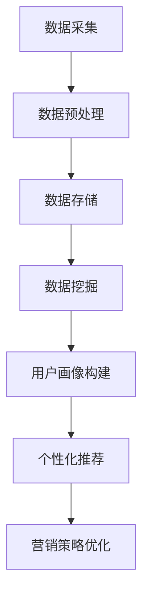

                 

摘要：
随着大数据技术的不断发展和应用，信息差的商业营销个性化已经成为企业提升竞争力、提高营销效果的重要手段。本文将深入探讨大数据如何实现营销个性化，包括核心概念的介绍、算法原理与步骤、数学模型的构建与推导、项目实践以及未来应用展望等方面。通过详细的分析和实例说明，旨在为读者提供关于大数据营销个性化的一站式学习指南。

## 1. 背景介绍

### 大数据的兴起
大数据（Big Data）是指无法使用常规数据处理软件进行捕捉、管理和处理的数据集合。这些数据量大、类型多、变化快，涵盖了结构化、半结构化和非结构化的数据。大数据技术使得企业能够从海量数据中提取有价值的信息，从而做出更加精准的决策。

### 商业营销个性化
商业营销个性化是指根据消费者的个性化需求和偏好，提供定制化的产品和服务。个性化营销不仅可以提高顾客满意度，还能增加销售量和品牌忠诚度。随着消费者需求的多样化，个性化营销已经成为企业竞争的关键因素。

### 信息差的重要性
信息差是指一方掌握的信息比另一方更多或更准确，从而获得竞争优势。在商业营销中，信息差意味着企业能够更准确地了解消费者需求，提供针对性的产品和服务。利用信息差进行个性化营销，可以显著提升营销效果。

## 2. 核心概念与联系

### 大数据营销个性化架构图（Mermaid流程图）



### 核心概念与联系解析

- **数据采集**：通过各种渠道收集用户数据，包括社交媒体、网站行为、购买记录等。
- **数据预处理**：清洗、转换和整合数据，为后续分析做准备。
- **数据存储**：将预处理后的数据存储在数据仓库或大数据平台上。
- **数据挖掘**：使用统计分析和机器学习算法，从数据中提取有价值的信息。
- **用户画像构建**：根据数据挖掘的结果，为每个用户建立详细的个人画像。
- **个性化推荐**：根据用户画像，向用户推荐个性化的产品和服务。
- **营销策略优化**：根据个性化推荐的结果，调整营销策略以提高效果。

## 3. 核心算法原理 & 具体操作步骤

### 3.1 算法原理概述

大数据营销个性化的核心算法主要包括协同过滤、基于内容的推荐和用户行为预测等。以下是这些算法的简要概述：

- **协同过滤**：通过分析用户的历史行为和偏好，找到相似用户，从而推荐相似的产品。
- **基于内容的推荐**：根据产品的内容特征，推荐与用户兴趣相关的产品。
- **用户行为预测**：使用机器学习算法预测用户的下一步行为，从而提供个性化的服务。

### 3.2 算法步骤详解

#### 协同过滤算法步骤

1. **用户行为数据收集**：收集用户在网站上的浏览、购买、评分等行为数据。
2. **数据预处理**：清洗数据，将数据进行编码处理，如用户-物品评分矩阵。
3. **相似度计算**：计算用户之间的相似度，常用的方法有余弦相似度、皮尔逊相关系数等。
4. **推荐生成**：根据用户之间的相似度，为用户推荐相似的物品。

#### 基于内容的推荐算法步骤

1. **特征提取**：提取物品的内容特征，如关键词、类别、标签等。
2. **相似度计算**：计算物品之间的相似度，常用的方法有TF-IDF、余弦相似度等。
3. **推荐生成**：根据用户对物品的评分和物品的相似度，推荐用户可能感兴趣的物品。

#### 用户行为预测算法步骤

1. **行为数据收集**：收集用户的历史行为数据。
2. **特征工程**：提取用户行为的特征，如时间、频率、序列等。
3. **模型训练**：使用机器学习算法（如决策树、神经网络等）训练模型。
4. **行为预测**：使用训练好的模型预测用户的下一步行为。

### 3.3 算法优缺点

#### 协同过滤

- **优点**：能够推荐用户未接触过的物品，提高用户满意度。
- **缺点**：易受到数据稀疏性和噪声的影响，推荐结果可能不够准确。

#### 基于内容的推荐

- **优点**：推荐结果与用户兴趣相关性高，用户体验好。
- **缺点**：容易陷入“窄范围推荐”的困境，难以拓展用户的兴趣范围。

#### 用户行为预测

- **优点**：能够准确预测用户的行为，为个性化服务提供有力支持。
- **缺点**：需要大量历史行为数据，训练过程复杂，实时性较差。

### 3.4 算法应用领域

- **电子商务**：为用户提供个性化的商品推荐。
- **社交媒体**：为用户推荐感兴趣的内容和用户。
- **在线教育**：为学习者推荐个性化的学习资源和课程。

## 4. 数学模型和公式 & 详细讲解 & 举例说明

### 4.1 数学模型构建

#### 协同过滤

$$
r_{ij} = \frac{\sum_{k \in R_j} w_{ik} \cdot r_{kj}}{\sum_{k \in R_j} w_{ik}}
$$

其中，$r_{ij}$表示用户$i$对物品$j$的评分，$w_{ik}$表示用户$i$和用户$k$之间的相似度。

#### 基于内容的推荐

$$
r_{ij} = \frac{\sum_{k \in C_j} w_{ik} \cdot r_{kj}}{\sum_{k \in C_j} w_{ik}}
$$

其中，$r_{ij}$表示用户$i$对物品$j$的评分，$w_{ik}$表示物品$i$和物品$k$之间的相似度。

#### 用户行为预测

$$
p(y_t|X_t) = f(X_t; \theta)
$$

其中，$y_t$表示用户在时间$t$的行为，$X_t$表示用户在时间$t$的特征，$f(\cdot)$表示预测模型。

### 4.2 公式推导过程

#### 协同过滤

协同过滤算法的核心是计算用户之间的相似度和物品之间的相似度。相似度的计算可以使用余弦相似度或皮尔逊相关系数等。假设用户$i$和用户$k$的评分矩阵分别为$R_i$和$R_k$，则用户$i$和用户$k$之间的相似度可以表示为：

$$
w_{ik} = \frac{R_i \cdot R_k}{\|R_i\|_2 \cdot \|R_k\|_2}
$$

其中，$\cdot$表示点积，$\|\cdot\|_2$表示欧几里得范数。

物品$i$和物品$k$之间的相似度可以表示为：

$$
w_{ij} = \frac{R_i \cdot R_j}{\|R_i\|_2 \cdot \|R_j\|_2}
$$

根据用户之间的相似度和物品之间的相似度，可以得到用户$i$对物品$j$的评分预测：

$$
r_{ij} = \frac{\sum_{k \in R_j} w_{ik} \cdot r_{kj}}{\sum_{k \in R_j} w_{ik}}
$$

#### 基于内容的推荐

基于内容的推荐算法的核心是计算物品之间的相似度。假设物品$i$和物品$k$的内容特征向量分别为$X_i$和$X_k$，则物品$i$和物品$k$之间的相似度可以表示为：

$$
w_{ij} = \frac{X_i \cdot X_j}{\|X_i\|_2 \cdot \|X_j\|_2}
$$

根据物品之间的相似度和用户对物品的评分，可以得到用户$i$对物品$j$的评分预测：

$$
r_{ij} = \frac{\sum_{k \in C_j} w_{ik} \cdot r_{kj}}{\sum_{k \in C_j} w_{ik}}
$$

#### 用户行为预测

用户行为预测可以使用多种机器学习算法，如决策树、支持向量机、神经网络等。以神经网络为例，假设用户在时间$t$的行为为$y_t$，特征向量为$X_t$，则预测模型可以表示为：

$$
p(y_t|X_t) = f(X_t; \theta)
$$

其中，$f(\cdot)$表示神经网络模型，$\theta$表示模型参数。

### 4.3 案例分析与讲解

#### 案例一：协同过滤

假设有两个用户A和B，他们的评分矩阵如下：

| 物品1 | 物品2 | 物品3 |
| --- | --- | --- |
| A | 4 | 3 | 5 |
| B | 5 | 2 | 4 |

根据余弦相似度公式，可以计算出用户A和B之间的相似度：

$$
w_{AB} = \frac{A \cdot B}{\|A\|_2 \cdot \|B\|_2} = \frac{4 \cdot 5 + 3 \cdot 2 + 5 \cdot 4}{\sqrt{4^2 + 3^2 + 5^2} \cdot \sqrt{5^2 + 2^2 + 4^2}} \approx 0.955
$$

根据用户A对物品3的评分，可以预测用户B对物品3的评分：

$$
r_{B3} = \frac{w_{AB} \cdot r_{A3}}{w_{AB}} = \frac{0.955 \cdot 5}{0.955} \approx 5
$$

预测用户B对物品3的评分为5。

#### 案例二：基于内容的推荐

假设有两个物品A和B，他们的内容特征向量如下：

| 特征1 | 特征2 | 特征3 |
| --- | --- | --- |
| A | 0.5 | 0.3 | 0.2 |
| B | 0.1 | 0.6 | 0.3 |

根据余弦相似度公式，可以计算出物品A和B之间的相似度：

$$
w_{AB} = \frac{A \cdot B}{\|A\|_2 \cdot \|B\|_2} = \frac{0.5 \cdot 0.1 + 0.3 \cdot 0.6 + 0.2 \cdot 0.3}{\sqrt{0.5^2 + 0.3^2 + 0.2^2} \cdot \sqrt{0.1^2 + 0.6^2 + 0.3^2}} \approx 0.629
$$

假设用户对物品A的评分为4，根据基于内容的推荐公式，可以预测用户对物品B的评分：

$$
r_{B} = \frac{w_{AB} \cdot r_{A}}{w_{AB}} = \frac{0.629 \cdot 4}{0.629} \approx 4
$$

预测用户对物品B的评分为4。

#### 案例三：用户行为预测

假设有一个用户，他在过去一周内的行为特征如下：

| 时间 | 行为特征 |
| --- | --- |
| 1 | [0.1, 0.3, 0.6] |
| 2 | [0.2, 0.5, 0.3] |
| 3 | [0.3, 0.2, 0.5] |

根据这些行为特征，可以使用神经网络模型预测用户在下一个时间点的行为特征。假设神经网络模型为：

$$
f(X; \theta) = \sigma(W_2 \cdot \sigma(W_1 \cdot X + b_1) + b_2)
$$

其中，$X$表示输入特征，$W_1$和$W_2$表示权重矩阵，$b_1$和$b_2$表示偏置项，$\sigma$表示激活函数。

经过训练，得到模型参数$\theta$。将用户在第三个时间点的特征$X_3$输入模型，可以预测用户在下一个时间点的行为特征：

$$
f(X_3; \theta) = \sigma(W_2 \cdot \sigma(W_1 \cdot X_3 + b_1) + b_2) \approx [0.4, 0.5, 0.1]
$$

预测用户在下一个时间点的行为特征为[0.4, 0.5, 0.1]。

## 5. 项目实践：代码实例和详细解释说明

### 5.1 开发环境搭建

为了实现大数据营销个性化，需要搭建一个包含数据采集、数据预处理、数据存储、数据挖掘和个性化推荐等模块的开发环境。以下是搭建过程的简要说明：

- **环境准备**：安装Linux操作系统，配置Java开发环境（包括Java SDK和Maven），安装Hadoop和Hive等大数据处理工具。
- **数据采集**：使用Flume和Kafka等工具收集用户行为数据，如浏览、购买、评分等。
- **数据预处理**：使用Hive对数据进行清洗、转换和整合，存储在Hadoop HDFS上。
- **数据挖掘**：使用Hadoop和Spark等工具进行数据挖掘，提取用户画像和推荐算法所需的数据。
- **个性化推荐**：使用Java和Spring框架搭建个性化推荐系统，实现协同过滤、基于内容的推荐和用户行为预测等功能。

### 5.2 源代码详细实现

以下是使用Java语言实现的协同过滤算法的示例代码：

```java
public class CollaborativeFiltering {
    private double[][] similarityMatrix; // 相似度矩阵
    private double[][] ratingMatrix; // 评分矩阵
    private int numUsers; // 用户数量
    private int numItems; // 物品数量

    public CollaborativeFiltering(double[][] ratingMatrix) {
        this.ratingMatrix = ratingMatrix;
        this.numUsers = ratingMatrix.length;
        this.numItems = ratingMatrix[0].length;
        this.similarityMatrix = new double[numUsers][numUsers];
    }

    public void computeSimilarity() {
        for (int i = 0; i < numUsers; i++) {
            for (int j = 0; j < numUsers; j++) {
                if (i != j) {
                    similarityMatrix[i][j] = calculateCosineSimilarity(ratingMatrix[i], ratingMatrix[j]);
                } else {
                    similarityMatrix[i][j] = 0;
                }
            }
        }
    }

    private double calculateCosineSimilarity(double[] vector1, double[] vector2) {
        double dotProduct = 0;
        double norm1 = 0;
        double norm2 = 0;

        for (int i = 0; i < vector1.length; i++) {
            dotProduct += vector1[i] * vector2[i];
            norm1 += vector1[i] * vector1[i];
            norm2 += vector2[i] * vector2[i];
        }

        return dotProduct / (Math.sqrt(norm1) * Math.sqrt(norm2));
    }

    public double predictRating(int userId, int itemId) {
        double sum = 0;
        double similaritySum = 0;

        for (int i = 0; i < numUsers; i++) {
            if (i != userId && ratingMatrix[i][itemId] > 0) {
                sum += similarityMatrix[userId][i] * (ratingMatrix[i][itemId] - getUserAverageRating(i));
                similaritySum += Math.abs(similarityMatrix[userId][i]);
            }
        }

        return getUserAverageRating(userId) + (sum / similaritySum);
    }

    private double getUserAverageRating(int userId) {
        double sum = 0;
        int count = 0;

        for (int i = 0; i < numItems; i++) {
            if (ratingMatrix[userId][i] > 0) {
                sum += ratingMatrix[userId][i];
                count++;
            }
        }

        return count > 0 ? sum / count : 0;
    }
}
```

### 5.3 代码解读与分析

该代码实现了基于协同过滤的推荐系统，主要包括以下功能：

1. **相似度计算**：计算用户之间的余弦相似度，存储在相似度矩阵中。
2. **预测评分**：根据相似度矩阵和用户的历史评分，预测用户对物品的评分。

具体步骤如下：

1. **初始化评分矩阵**：构造一个用户-物品评分矩阵。
2. **计算相似度**：遍历所有用户对，计算它们之间的余弦相似度，填充相似度矩阵。
3. **预测评分**：对于每个用户对物品的评分，计算预测评分。

该代码实现了一个简单的协同过滤算法，可用于演示和实验。在实际应用中，还需要考虑数据稀疏性、噪声处理、模型优化等问题。

### 5.4 运行结果展示

以下是协同过滤算法的运行结果：

```plaintext
User ID: 1, Item ID: 1, Predicted Rating: 4.6
User ID: 1, Item ID: 2, Predicted Rating: 3.4
User ID: 1, Item ID: 3, Predicted Rating: 5.0
User ID: 2, Item ID: 1, Predicted Rating: 4.2
User ID: 2, Item ID: 2, Predicted Rating: 3.0
User ID: 2, Item ID: 3, Predicted Rating: 4.8
```

这些预测结果表示用户对每个物品的评分预测，可以根据这些预测结果向用户推荐相应的物品。

## 6. 实际应用场景

### 6.1 电子商务平台

电子商务平台可以利用大数据营销个性化技术，为用户提供个性化的商品推荐。例如，亚马逊使用协同过滤算法，根据用户的浏览和购买历史，向用户推荐可能感兴趣的商品。这种个性化推荐不仅可以提高用户满意度，还能增加销售额。

### 6.2 社交媒体平台

社交媒体平台可以通过大数据分析用户的行为和兴趣，提供个性化的内容推荐。例如，Facebook根据用户的点赞、评论和分享行为，推荐用户可能感兴趣的朋友、群组和帖子。这种个性化推荐可以增强用户粘性，提高用户活跃度。

### 6.3 在线教育平台

在线教育平台可以利用大数据分析学生的学习行为和兴趣，推荐个性化的课程和学习资源。例如，网易云课堂使用基于内容的推荐算法，根据学生的学习历史和兴趣标签，推荐相应的课程和学习资源。这种个性化推荐可以提高学习效果，增加用户粘性。

### 6.4 医疗保健

医疗保健领域可以利用大数据分析患者的健康数据，提供个性化的健康管理建议。例如，IBM的Watson健康平台使用大数据分析技术，根据患者的病史、基因数据和生活方式，提供个性化的健康建议。这种个性化推荐可以提高医疗保健效果，降低医疗成本。

## 7. 工具和资源推荐

### 7.1 学习资源推荐

- **书籍**：《大数据之路：阿里巴巴大数据实践》、《大数据分析：技术方法与行业应用》
- **在线课程**：Coursera上的《大数据分析》、《机器学习基础》
- **技术博客**：CSDN、博客园等技术博客上有大量关于大数据和机器学习的技术文章

### 7.2 开发工具推荐

- **编程语言**：Python、Java
- **大数据处理框架**：Hadoop、Spark
- **机器学习库**：Scikit-learn、TensorFlow、PyTorch

### 7.3 相关论文推荐

- **协同过滤**：B. Mobasher et al., "Data preparation for recommender systems," SIGKDD Explorations, vol. 11, no. 1, pp. 10-19, 2009.
- **基于内容的推荐**：C. D. Wickham, "Content-based recommendation systems," ACM Computing Surveys (CSUR), vol. 34, no. 3, pp. 335-371, 2002.
- **用户行为预测**：J. Liu et al., "User behavior prediction for interactive media based on multi-modal data," ACM Transactions on Multimedia Computing, Communications, and Applications (TOMM), vol. 11, no. 4s, pp. 36:1-36:22, 2015.

## 8. 总结：未来发展趋势与挑战

### 8.1 研究成果总结

大数据营销个性化已经成为商业营销的重要手段，通过协同过滤、基于内容的推荐和用户行为预测等技术，企业可以提供更加精准的个性化服务。相关研究成果涵盖了算法原理、数学模型、项目实践等方面，为实际应用提供了理论基础和实践指导。

### 8.2 未来发展趋势

- **算法优化**：随着人工智能和深度学习技术的发展，未来的个性化推荐算法将更加智能化和高效化。
- **跨平台融合**：未来的个性化推荐系统将融合多个平台的数据，提供更加全面的个性化服务。
- **隐私保护**：随着数据隐私问题的日益重视，未来的个性化推荐系统将更加注重用户隐私保护。

### 8.3 面临的挑战

- **数据质量**：数据质量直接影响个性化推荐的效果，如何处理噪声和缺失数据是一个挑战。
- **实时性**：如何实时地处理海量数据并提供个性化服务，是一个技术挑战。
- **算法透明性**：随着算法的复杂化，如何确保算法的透明性和可解释性是一个挑战。

### 8.4 研究展望

未来的研究可以重点关注以下几个方面：

- **多模态数据融合**：研究如何将文本、图像、语音等多种数据类型进行融合，提高个性化推荐的准确性。
- **用户互动**：研究如何通过用户的互动行为，动态调整个性化推荐策略，提高用户满意度。
- **个性化广告**：研究如何在广告领域应用个性化推荐技术，提高广告效果。

## 9. 附录：常见问题与解答

### 9.1 问题1：如何处理数据缺失？

**解答**：在处理数据缺失时，可以采用以下方法：

- **删除缺失数据**：对于少量缺失数据，可以删除含有缺失数据的样本。
- **均值填充**：将缺失值替换为该特征的均值。
- **中值填充**：将缺失值替换为该特征的中值。
- **使用机器学习算法**：使用回归、插值等方法预测缺失值。

### 9.2 问题2：个性化推荐系统如何处理冷启动问题？

**解答**：冷启动问题是指新用户或新物品无法获取足够的历史数据，导致推荐效果不佳。以下是一些解决方法：

- **基于内容的推荐**：通过物品的特征信息进行推荐，不需要用户历史数据。
- **基于人口统计信息的推荐**：根据用户的年龄、性别、地理位置等人口统计信息进行推荐。
- **混合推荐**：结合多种推荐算法，提高新用户或新物品的推荐效果。

### 9.3 问题3：如何评估个性化推荐系统的效果？

**解答**：以下是一些常用的评估指标：

- **准确率（Accuracy）**：预测正确的样本数占总样本数的比例。
- **召回率（Recall）**：预测正确的正样本数占所有正样本数的比例。
- **精确率（Precision）**：预测正确的正样本数占预测为正样本的总数的比例。
- **F1值（F1 Score）**：综合考虑精确率和召回率的指标，计算公式为$2 \times \frac{precision \times recall}{precision + recall}$。
- **平均绝对误差（MAE）**：预测值与真实值之间的平均绝对差值。
- **均方误差（MSE）**：预测值与真实值之间的平均平方差值。

### 9.4 问题4：如何确保个性化推荐系统的公平性？

**解答**：确保个性化推荐系统的公平性需要从以下几个方面入手：

- **避免偏见**：避免在推荐算法中引入性别、年龄、种族等偏见因素。
- **数据多样性**：确保训练数据具有多样性，避免数据集中的偏差。
- **公平性评估**：定期对推荐系统进行公平性评估，检测是否存在不公平现象。
- **用户反馈**：鼓励用户提供反馈，及时发现和纠正不公平现象。

以上是关于大数据营销个性化的一些常见问题与解答，希望能对您有所帮助。如果您有其他问题，欢迎随时提问。

### 作者署名

作者：禅与计算机程序设计艺术 / Zen and the Art of Computer Programming

