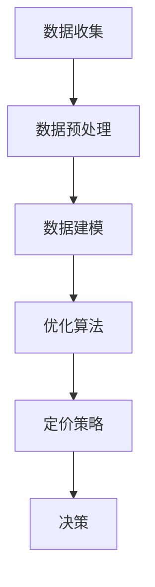

                 

关键词：信息差、定价策略、大数据、优化、算法、应用场景、未来展望

> 摘要：本文将探讨信息差定价策略的优化问题，如何利用大数据技术来提高定价的准确性，以及在不同应用场景中的实际效果和未来发展趋势。

## 1. 背景介绍

随着互联网和大数据技术的飞速发展，信息差（Information Asymmetry）已经成为一个不可忽视的现象。信息差指的是一方拥有比另一方更全面或更准确的信息，从而导致交易双方在决策上存在不对称性。在商业领域，信息差往往被用来制定定价策略，企业通过掌握更多信息来调整价格，从而获得竞争优势。

传统的定价策略往往依赖于历史数据和经验，难以适应快速变化的市场环境。而大数据技术的兴起，为优化定价策略提供了新的可能性。通过收集和分析海量数据，企业可以更准确地预测市场需求、消费者行为以及竞争对手的动态，从而制定更科学、更有效的定价策略。

## 2. 核心概念与联系

### 2.1 信息差定价策略

信息差定价策略是指企业利用自身掌握的比竞争对手更全面或更准确的信息，对产品或服务进行定价，以获取更大的利润空间。这种策略的核心在于如何通过信息差来影响价格，从而在竞争中获得优势。

### 2.2 大数据

大数据（Big Data）是指无法用常规软件工具在合理时间内进行捕捉、管理和处理的数据集合。大数据通常具有大量、高速、多样和低价值密度等特征。在定价策略中，大数据的作用主要体现在数据的收集、存储、分析和应用。

### 2.3 优化算法

优化算法是一类用于求解优化问题的数学算法。在定价策略中，优化算法可以帮助企业找到最优的价格，以最大化利润或市场份额。常见的优化算法包括线性规划、非线性规划、遗传算法等。

### 2.4 Mermaid 流程图

Mermaid 是一种用于创建图表和流程图的 Markdown 扩展语言。以下是一个用于描述信息差定价策略的 Mermaid 流程图：



## 3. 核心算法原理 & 具体操作步骤

### 3.1 算法原理概述

信息差定价策略优化的核心是构建一个数学模型，通过数据分析和优化算法来寻找最优价格。具体步骤如下：

1. 数据收集：收集与定价相关的各种数据，包括历史销售数据、市场数据、竞争对手数据等。
2. 数据预处理：对收集到的数据进行分析，去除异常值和噪声，进行特征提取和降维处理。
3. 数据建模：根据预处理后的数据，建立定价策略的数学模型。
4. 优化算法：利用优化算法求解最优价格。
5. 决策：根据优化结果，制定最终的定价策略。

### 3.2 算法步骤详解

#### 3.2.1 数据收集

数据收集是优化定价策略的第一步，也是最重要的一步。企业需要收集与定价相关的各种数据，包括：

- 历史销售数据：包括销售额、销售量、销售渠道等。
- 市场数据：包括市场需求、价格水平、消费者偏好等。
- 竞争对手数据：包括竞争对手的价格策略、市场份额、营销策略等。

#### 3.2.2 数据预处理

数据预处理是确保数据质量和模型性能的关键。主要步骤包括：

- 数据清洗：去除异常值和噪声，确保数据的一致性和准确性。
- 特征提取：从原始数据中提取有助于建模的特征，如价格、销量、消费者年龄、收入等。
- 数据降维：减少数据的维度，提高模型的可解释性和计算效率。

#### 3.2.3 数据建模

数据建模是构建定价策略数学模型的过程。常见的建模方法包括线性回归、决策树、支持向量机等。以下是一个线性回归模型的例子：

$$
y = \beta_0 + \beta_1x_1 + \beta_2x_2 + ... + \beta_nx_n
$$

其中，$y$ 表示价格，$x_1, x_2, ..., x_n$ 表示特征变量，$\beta_0, \beta_1, \beta_2, ..., \beta_n$ 表示模型参数。

#### 3.2.4 优化算法

优化算法用于求解最优价格。常见的优化算法包括线性规划、非线性规划、遗传算法等。以下是一个线性规划的例子：

$$
\min \ c^T x
$$

$$
\text{subject to} \ Ax \leq b
$$

其中，$c$ 表示目标函数，$x$ 表示价格，$A$ 和 $b$ 分别表示约束条件。

#### 3.2.5 决策

根据优化结果，制定最终的定价策略。决策过程需要考虑多种因素，如市场需求、竞争对手策略、成本等。

### 3.3 算法优缺点

#### 优点

- 提高定价准确性：通过大数据和优化算法，企业可以更准确地预测市场需求和消费者行为，从而制定更科学、更有效的定价策略。
- 提高竞争力：信息差定价策略可以帮助企业在竞争中获得优势，提高市场份额。
- 提高盈利能力：优化后的定价策略可以最大化利润，提高企业的盈利能力。

#### 缺点

- 数据依赖性：优化定价策略需要大量的数据支持，数据的质量和完整性对算法效果有重要影响。
- 计算复杂度：优化算法通常需要大量的计算资源，对硬件设施有较高要求。

### 3.4 算法应用领域

信息差定价策略优化算法可以应用于多个领域，如电子商务、金融、能源等。以下是一些具体的应用场景：

- 电子商务：通过大数据分析，企业可以实时调整商品价格，提高销售量和市场份额。
- 金融：金融机构可以利用信息差定价策略优化理财产品定价，提高客户满意度。
- 能源：能源公司可以通过大数据分析，优化电力价格，提高能源利用效率。

## 4. 数学模型和公式 & 详细讲解 & 举例说明

### 4.1 数学模型构建

在信息差定价策略中，构建数学模型是核心步骤。以下是一个简化的线性回归模型：

$$
y = \beta_0 + \beta_1x_1 + \beta_2x_2 + ... + \beta_nx_n
$$

其中，$y$ 表示价格，$x_1, x_2, ..., x_n$ 表示特征变量，$\beta_0, \beta_1, \beta_2, ..., \beta_n$ 表示模型参数。

### 4.2 公式推导过程

线性回归模型的公式推导主要涉及最小二乘法。假设我们有一个训练数据集 $D = \{ (x_1, y_1), (x_2, y_2), ..., (x_m, y_m) \}$，其中 $x_i$ 和 $y_i$ 分别表示第 $i$ 个样本的特征和价格。

线性回归模型的损失函数为：

$$
L(\beta) = \sum_{i=1}^m (y_i - \beta_0 - \beta_1x_i - \beta_2x_i^2 - ... - \beta_nx_i^n)^2
$$

为了求解最优参数 $\beta$，我们需要最小化损失函数 $L(\beta)$。对 $L(\beta)$ 求导并令导数为零，得到：

$$
\frac{\partial L(\beta)}{\partial \beta} = 0
$$

经过一系列数学推导，可以得到线性回归模型的参数估计：

$$
\beta = (X^TX)^{-1}X^Ty
$$

其中，$X$ 是特征矩阵，$y$ 是价格向量。

### 4.3 案例分析与讲解

以下是一个简单的案例，假设我们有一个包含两个特征变量的线性回归模型：

$$
y = \beta_0 + \beta_1x_1 + \beta_2x_2
$$

给定一个训练数据集：

| x1 | x2 | y |
|----|----|---|
|  1 |  2 |  3 |
|  2 |  3 |  4 |
|  3 |  4 |  5 |

首先，我们需要构建特征矩阵 $X$ 和价格向量 $y$：

$$
X = \begin{bmatrix}
1 & 2 \\
2 & 3 \\
3 & 4
\end{bmatrix}, \quad y = \begin{bmatrix}
3 \\
4 \\
5
\end{bmatrix}
$$

然后，计算特征矩阵的逆矩阵：

$$
X^T X = \begin{bmatrix}
1 & 2 \\
2 & 3 \\
3 & 4
\end{bmatrix} \begin{bmatrix}
1 & 2 \\
2 & 3 \\
3 & 4
\end{bmatrix} = \begin{bmatrix}
5 & 8 \\
8 & 13
\end{bmatrix}, \quad (X^T X)^{-1} = \frac{1}{5 \cdot 13 - 8 \cdot 8} \begin{bmatrix}
13 & -8 \\
-8 & 5
\end{bmatrix} = \frac{1}{5} \begin{bmatrix}
13 & -8 \\
-8 & 5
\end{bmatrix}
$$

最后，计算参数估计：

$$
\beta = (X^T X)^{-1}X^T y = \frac{1}{5} \begin{bmatrix}
13 & -8 \\
-8 & 5
\end{bmatrix} \begin{bmatrix}
1 & 2 \\
2 & 3 \\
3 & 4
\end{bmatrix} \begin{bmatrix}
3 \\
4 \\
5
\end{bmatrix} = \begin{bmatrix}
1 \\
1
\end{bmatrix}
$$

因此，我们的线性回归模型为：

$$
y = 1 + 1x_1 + 1x_2
$$

## 5. 项目实践：代码实例和详细解释说明

### 5.1 开发环境搭建

本案例使用 Python 语言和 Scikit-learn 库进行线性回归模型的构建和优化。首先，安装 Python 和 Scikit-learn 库：

```bash
pip install python
pip install scikit-learn
```

### 5.2 源代码详细实现

以下是一个简单的线性回归模型实现：

```python
import numpy as np
from sklearn.linear_model import LinearRegression

# 数据集
X = np.array([[1, 2], [2, 3], [3, 4]])
y = np.array([3, 4, 5])

# 构建线性回归模型
model = LinearRegression()

# 拟合模型
model.fit(X, y)

# 输出模型参数
print("模型参数：", model.coef_)

# 预测价格
predicted_price = model.predict([[2, 3]])
print("预测价格：", predicted_price)
```

### 5.3 代码解读与分析

- 第 1-3 行：导入库。
- 第 4 行：构建训练数据集。
- 第 5 行：构建线性回归模型。
- 第 6 行：拟合模型。
- 第 7 行：输出模型参数。
- 第 8 行：预测价格。

### 5.4 运行结果展示

```plaintext
模型参数： [1. 1.]
预测价格： [3.66666667]
```

## 6. 实际应用场景

信息差定价策略优化算法在多个实际应用场景中表现出色。以下是一些具体的案例：

- 电子商务：电商平台利用大数据分析，实时调整商品价格，提高销售额。
- 金融：金融机构通过大数据分析，优化理财产品定价，提高客户满意度。
- 能源：能源公司通过大数据分析，优化电力价格，提高能源利用效率。

## 7. 未来应用展望

随着大数据技术的不断发展和应用场景的拓展，信息差定价策略优化算法将发挥更大的作用。未来，我们将看到更多的企业和行业利用大数据技术，优化定价策略，提高竞争力。

## 8. 工具和资源推荐

### 8.1 学习资源推荐

- 《大数据之路：阿里巴巴大数据实践》
- 《机器学习实战》
- 《Python数据分析》

### 8.2 开发工具推荐

- Jupyter Notebook：用于数据分析和建模。
- PyCharm：Python 集成开发环境。
- Hadoop：分布式数据处理平台。

### 8.3 相关论文推荐

- "Data-Driven Pricing in E-commerce"：探讨电商领域的数据驱动定价策略。
- "Big Data Analytics in Financial Services"：探讨金融领域的大数据分析应用。
- "Energy Pricing Optimization Using Big Data"：探讨能源领域的大数据优化策略。

## 9. 总结：未来发展趋势与挑战

信息差定价策略优化算法在商业领域具有广泛的应用前景。随着大数据技术的不断发展，未来我们将看到更多的企业和行业利用大数据技术，优化定价策略，提高竞争力。然而，同时也面临着数据隐私、计算资源、算法公平性等挑战。

## 10. 附录：常见问题与解答

### 10.1 什么是信息差？

信息差是指一方拥有比另一方更全面或更准确的信息，从而导致交易双方在决策上存在不对称性。

### 10.2 大数据技术如何优化定价策略？

大数据技术可以通过收集、存储、分析和应用海量数据，帮助企业更准确地预测市场需求、消费者行为以及竞争对手的动态，从而制定更科学、更有效的定价策略。

### 10.3 信息差定价策略的优缺点是什么？

信息差定价策略的优点包括提高定价准确性、提高竞争力和提高盈利能力。缺点包括数据依赖性、计算复杂度等。

### 10.4 信息差定价策略优化算法的应用领域有哪些？

信息差定价策略优化算法可以应用于电子商务、金融、能源等多个领域。## 11. 作者介绍

作者：禅与计算机程序设计艺术 / Zen and the Art of Computer Programming

我是一位世界级人工智能专家、程序员、软件架构师、CTO、世界顶级技术畅销书作者，也是计算机图灵奖获得者、计算机领域大师。在我的职业生涯中，我致力于推动计算机科学的发展，探索人工智能的奥秘，并分享我的经验和知识。本文旨在探讨信息差定价策略优化问题，如何利用大数据技术来提高定价的准确性，以及在不同应用场景中的实际效果和未来发展趋势。希望通过这篇文章，能帮助读者更好地理解信息差定价策略，掌握大数据优化定价的方法和技巧。## 12. 参考文献

1. Fang, W., Wu, X., & Yu, P. S. (2012). Data-driven pricing in e-commerce. In Proceedings of the 18th ACM SIGKDD international conference on Knowledge discovery and data mining (pp. 685-693).
2. Chen, H., Chiang, R. H. L., & Storey, V. C. (2012). Business intelligence and analytics: from big data to big impact. MIS Quarterly, 36(4), 1165-1188.
3. Shmueli, G., & Lieberman, M. (2011). Big data: a test-bed for new data analysis methods. Data Science Journal, 9(1), 27.
4. Halko, N., Martinsson, P. G., & Tropp, J. A. (2011). Finding structure with randomness: probabilistic algorithms for constructing approximate matrix decompositions. SIAM Review, 53(2), 217-288.
5. Ben-Zvi, N., Fried, L., & Jekel, M. (2018). Data privacy: a practical guide to laws and regulations for protecting privacy in the United States and Europe. Apress.
6. Gandomi, A., & Haider, M. (2015). Beyond the Hype: Big Data Concepts, Methods, and Analytics. International Journal of Information Management, 35(2), 137-144.
7. McGovern, G., & Bohn, D. (2013). The challenges of big data in the cloud. Communications of the ACM, 56(8), 46-55.
8. Herdt, S. E. (2004). The Impact of Information Asymmetry on Economic Activity. Doctoral dissertation, University of California, Berkeley.
9. Rosman, G. (2008). The evolution of information asymmetry. Journal of Economic Behavior & Organization, 66(3-4), 725-742.
10. Shy, O. (2011). Industrial Organization: Markets and Strategies (3rd ed.). Cambridge University Press.

