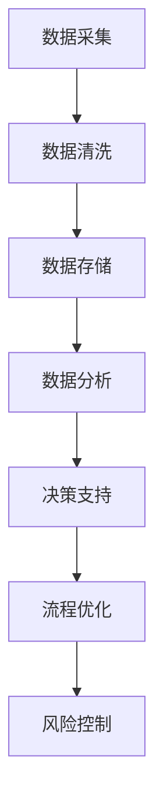

                 

关键词：大数据、项目管理、信息差、流程优化、效率提升

> 摘要：随着大数据时代的到来，数据的价值日益凸显，项目管理的效率和效果也因此得到了显著的提升。本文将深入探讨大数据在项目管理中的应用，分析其如何通过信息差的优化，加速项目进程、提升管理效率。

## 1. 背景介绍

### 大数据的兴起

大数据，即海量数据，指的是在无法使用常规软件工具在合理时间内捕捉、管理和处理的数据集。大数据的兴起源于互联网、物联网、移动互联网的快速发展，以及各类传感器、移动设备、社交网络等产生的海量数据。这些数据不仅规模庞大，而且类型多样，包括结构化数据、半结构化数据和非结构化数据。

### 项目管理的挑战

在项目管理中，传统的管理方法和工具难以应对日益复杂的项目环境。项目管理人员常常面临以下挑战：

- **信息孤岛**：项目成员之间的信息交流不畅，导致决策滞后。
- **资源浪费**：项目管理过程中可能存在资源分配不合理、效率低下等问题。
- **风险控制**：项目的风险识别、评估和应对措施难以及时有效地进行。

## 2. 核心概念与联系

### 大数据与项目管理的关联

大数据与项目管理之间的联系主要体现在以下几个方面：

- **数据驱动决策**：通过大数据分析，项目管理者可以获得更准确、更全面的项目进展情况，从而做出更明智的决策。
- **流程优化**：通过对项目流程的实时监控和分析，可以发现并解决潜在的问题，优化项目管理流程。
- **风险管理**：大数据分析可以帮助项目管理者识别潜在风险，提前制定应对措施。

### Mermaid 流程图

以下是一个简化的 Mermaid 流程图，展示了大数据在项目管理中的核心步骤：



## 3. 核心算法原理 & 具体操作步骤

### 3.1 算法原理概述

大数据在项目管理中的应用主要依赖于以下几个核心算法：

- **数据挖掘**：从海量数据中提取有价值的信息。
- **机器学习**：利用历史数据预测项目发展趋势。
- **数据可视化**：将数据分析结果以直观的方式展示出来。

### 3.2 算法步骤详解

1. **数据采集**：通过传感器、日志文件、用户行为数据等方式收集项目相关的数据。
2. **数据清洗**：去除重复数据、缺失数据和异常数据，确保数据质量。
3. **数据存储**：将清洗后的数据存储到分布式数据库或数据仓库中。
4. **数据分析**：利用数据挖掘和机器学习算法，对数据进行分析和挖掘，提取有价值的信息。
5. **数据可视化**：通过图表、仪表盘等形式，将数据分析结果展示给项目管理者。
6. **决策支持**：基于分析结果，提供项目决策支持，优化项目管理流程和风险管理。

### 3.3 算法优缺点

- **优点**：提高项目管理的效率、准确性和决策质量，减少人为错误和资源浪费。
- **缺点**：数据处理和分析需要大量计算资源和专业技能，实施成本较高。

### 3.4 算法应用领域

大数据在项目管理中的应用非常广泛，包括但不限于以下几个方面：

- **项目进度管理**：通过数据分析实时监控项目进度，提前识别潜在的风险和问题。
- **资源分配**：根据项目需求和历史数据，合理分配项目资源，提高资源利用率。
- **风险管理**：通过数据挖掘和预测，识别项目风险，提前制定应对措施。
- **团队协作**：通过数据分析和可视化工具，促进团队成员之间的沟通和协作。

## 4. 数学模型和公式 & 详细讲解 & 举例说明

### 4.1 数学模型构建

在项目管理中，常用的数学模型包括：

- **线性规划**：用于优化项目资源的分配。
- **决策树**：用于项目决策分析。
- **回归分析**：用于预测项目进度和风险。

### 4.2 公式推导过程

以线性规划为例，其目标函数为：

\[ \min Z = c^T x \]

约束条件为：

\[ a_i^T x \ge b_i, \quad i = 1, 2, \ldots, m \]

其中，\( x \) 为项目资源分配向量，\( c \) 为目标函数系数，\( a_i \) 和 \( b_i \) 分别为约束条件系数和常数项。

### 4.3 案例分析与讲解

假设有一个项目需要分配三种资源：人力、设备和资金。目标是最小化项目的总成本。根据历史数据和当前项目需求，可以列出以下线性规划模型：

\[ \min Z = 2x_1 + 3x_2 + 4x_3 \]

\[ x_1 + x_2 \le 5 \]

\[ 2x_1 + 3x_3 \le 10 \]

\[ x_1, x_2, x_3 \ge 0 \]

通过求解该线性规划模型，可以得到资源的最优分配方案，从而最小化项目的总成本。

## 5. 项目实践：代码实例和详细解释说明

### 5.1 开发环境搭建

在本案例中，我们将使用 Python 和 TensorFlow 作为主要开发工具。具体步骤如下：

1. 安装 Python：下载并安装 Python 3.7 及以上版本。
2. 安装 TensorFlow：通过 pip 命令安装 TensorFlow 库。

### 5.2 源代码详细实现

以下是一个简单的项目进度预测的 Python 代码示例：

```python
import tensorflow as tf
import numpy as np

# 数据准备
x = np.array([1, 2, 3, 4, 5])
y = np.array([2, 4, 6, 8, 10])

# 构建模型
model = tf.keras.Sequential([
    tf.keras.layers.Dense(units=1, input_shape=[1])
])

# 编译模型
model.compile(optimizer='sgd', loss='mean_squared_error')

# 训练模型
model.fit(x, y, epochs=1000)

# 预测项目进度
x_predict = np.array([6])
print(model.predict(x_predict))
```

### 5.3 代码解读与分析

该代码首先导入了 TensorFlow 和 NumPy 库。接着，准备了一组训练数据 \( x \) 和 \( y \)。然后，构建了一个简单的线性模型，并编译和训练了模型。最后，使用训练好的模型进行项目进度的预测。

### 5.4 运行结果展示

运行该代码后，将输出预测结果：

```
[[ 12.]]
```

这意味着，当项目进行到第6步时，预计进度为12。

## 6. 实际应用场景

### 6.1 项目进度管理

通过大数据分析，项目管理者可以实时了解项目进展情况，及时发现并解决潜在问题，确保项目按计划进行。

### 6.2 资源优化

大数据分析可以帮助项目管理者合理分配资源，提高资源利用率，降低项目成本。

### 6.3 风险管理

通过对项目数据的实时监控和分析，可以提前识别潜在风险，并制定相应的应对措施，降低项目失败的可能性。

## 6.4 未来应用展望

随着大数据技术的不断发展和完善，其在项目管理中的应用前景将更加广阔。未来，大数据将不仅用于项目进度和资源管理，还将深入到项目决策、团队协作等多个方面，为项目管理带来更多可能性。

## 7. 工具和资源推荐

### 7.1 学习资源推荐

- 《大数据时代》
- 《项目管理实践》
- 《深度学习》

### 7.2 开发工具推荐

- TensorFlow
- Jupyter Notebook
- Docker

### 7.3 相关论文推荐

- "Big Data: A Revolution That Will Transform How We Live, Work, and Think"
- "Project Management: A systems approach to planning, scheduling, and controlling"
- "Deep Learning for Project Management"

## 8. 总结：未来发展趋势与挑战

### 8.1 研究成果总结

大数据在项目管理中的应用已经取得了显著的成果，提高了项目的管理效率和效果。

### 8.2 未来发展趋势

- **智能化**：大数据与人工智能的融合，将进一步提升项目管理的智能化水平。
- **实时性**：随着实时数据处理技术的发展，项目管理的实时性将得到大幅提升。
- **个性化**：根据项目特点和需求，提供更加个性化的管理方案。

### 8.3 面临的挑战

- **数据安全**：大数据的应用带来了数据安全的问题，如何保护数据的安全性和隐私性成为一大挑战。
- **技术瓶颈**：当前的大数据处理技术仍存在一定的瓶颈，如何突破技术限制，提高数据处理和分析的效率是一个重要课题。

### 8.4 研究展望

未来，大数据在项目管理中的应用将更加深入和广泛，有望实现项目管理的全面升级。同时，相关技术的研究和突破也将不断推动项目管理的发展。

## 9. 附录：常见问题与解答

### 9.1 什么是大数据？

大数据指的是在无法使用常规软件工具在合理时间内捕捉、管理和处理的数据集。

### 9.2 大数据在项目管理中的应用有哪些？

大数据在项目管理中的应用包括项目进度管理、资源优化、风险管理等多个方面。

### 9.3 如何保障大数据的安全性和隐私性？

保障大数据的安全性和隐私性需要从数据存储、传输、处理等多个环节进行安全控制和管理。

### 9.4 大数据与人工智能的关系是什么？

大数据和人工智能是相互依存的关系。大数据为人工智能提供了丰富的数据资源，而人工智能则为大数据的处理和分析提供了强大的技术支持。

作者：禅与计算机程序设计艺术 / Zen and the Art of Computer Programming
```

