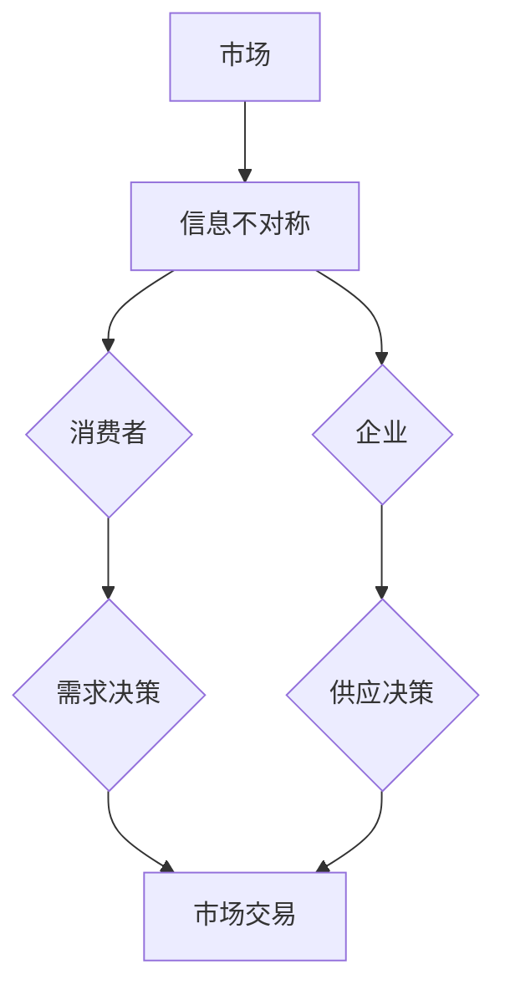

                 

 在当今这个高度信息化的时代，信息不对称现象无处不在。无论是在商业领域、科技领域，还是在个人生活中，信息的不对称性往往决定了资源的分配、市场的竞争以及个人决策的效率。本文将深入探讨“信息差”这一概念，分析其在客户保持策略中的重要作用，并探讨如何利用信息差来增强企业的竞争力。

## 1. 背景介绍

信息不对称（Asymmetric Information）是指在某个交易过程中，至少有一方拥有比另一方更多的信息。这种现象在经济学中是一个重要的概念，尤其在解释市场失灵、道德风险以及逆向选择等方面具有重要意义。信息不对称的存在，使得市场机制无法完全发挥作用，从而影响资源的有效配置和企业的长期发展。

在商业环境中，信息不对称往往表现为企业对市场和客户信息的掌握程度不同。企业通过掌握更多的信息，可以制定更有效的营销策略，提高客户满意度和忠诚度。而客户对企业的信息了解不足，则可能受到信息不透明带来的困扰，影响其购买决策。

本文将围绕以下主题展开讨论：

- **核心概念与联系**：介绍信息不对称的基本概念，并给出信息不对称在商业环境中的一种Mermaid流程图。
- **核心算法原理 & 具体操作步骤**：探讨利用信息差来优化客户保持策略的算法原理和具体实施步骤。
- **数学模型和公式**：构建用于分析信息不对称的数学模型，并推导相关公式。
- **项目实践：代码实例和详细解释说明**：通过一个具体的案例来展示如何利用信息差实现客户保持。
- **实际应用场景**：分析信息差在不同行业和领域的应用案例。
- **工具和资源推荐**：推荐相关学习资源和开发工具。
- **总结：未来发展趋势与挑战**：总结研究成果，探讨未来发展趋势和面临的挑战。

## 2. 核心概念与联系

### 2.1. 信息不对称的基本概念

信息不对称是指在一项交易或决策过程中，信息的分布不均匀，其中一方拥有比另一方更多的信息。在商业领域，信息不对称可以表现为以下几种形式：

- **生产者优势**：企业相对于消费者拥有更多的产品信息，包括产品的性能、质量、价格等。
- **消费者优势**：消费者拥有关于自己的需求和偏好等信息，而企业无法完全了解。
- **市场信息不对称**：市场中某些企业或个体拥有比其他企业更多的市场信息，如竞争对手的定价策略、市场需求等。

### 2.2. 商业环境中的信息不对称

在商业环境中，信息不对称可能导致以下问题：

- **市场失灵**：市场无法达到有效的资源分配，因为价格机制无法完全反映商品或服务的真实价值。
- **道德风险**：信息优势方可能会采取不利于信息劣势方的行为，例如欺诈、隐瞒重要信息等。
- **逆向选择**：信息劣势方可能会因为信息不足而做出次优的决策。

### 2.3. Mermaid流程图

为了更好地理解信息不对称在商业环境中的运作，我们可以使用Mermaid流程图来展示相关流程节点。



在上述流程图中，市场中的消费者和企业之间存在信息不对称，这影响了他们的需求决策和供应决策。最终，这种不对称性会体现在市场交易中，可能导致市场失灵或其他问题。

## 3. 核心算法原理 & 具体操作步骤

### 3.1. 算法原理概述

为了利用信息差来优化客户保持策略，我们可以采用一种基于机器学习的算法，该算法的核心思想是通过分析大量历史数据，发现企业优势和客户需求之间的信息差异，并据此制定个性化的营销策略。

### 3.2. 算法步骤详解

算法的具体步骤如下：

#### 3.2.1 数据收集

首先，需要收集与企业运营相关的数据，包括产品信息、客户信息、交易记录、市场趋势等。

#### 3.2.2 数据预处理

对收集到的数据进行清洗和标准化，确保数据的质量和一致性。这一步骤包括数据去重、缺失值填充、异常值处理等。

#### 3.2.3 特征工程

从原始数据中提取有助于预测客户行为和需求的特征。例如，可以根据客户的历史购买记录、浏览行为、评价等来构建客户画像。

#### 3.2.4 模型训练

使用机器学习算法，如决策树、随机森林、支持向量机等，对预处理后的数据进行训练。模型的目的是学习如何根据客户的特征预测其未来的行为。

#### 3.2.5 预测与评估

使用训练好的模型对新的客户数据进行预测，评估模型的准确性和可靠性。如果模型表现不佳，需要返回上一步进行特征工程和模型调整。

#### 3.2.6 策略制定

根据模型预测结果，制定个性化的营销策略。例如，对于高价值的客户，可以提供专属优惠或VIP服务；对于潜在客户，可以通过推送个性化内容来引导其购买决策。

### 3.3. 算法优缺点

#### 优点：

- **高效性**：机器学习算法可以处理大量数据，快速发现信息差。
- **个性化**：基于客户特征的个性化策略，可以更好地满足客户需求。
- **动态调整**：算法可以根据实时数据动态调整策略，提高客户保持率。

#### 缺点：

- **数据依赖性**：算法的性能高度依赖于数据质量，数据缺失或不准确会影响结果。
- **计算成本**：训练和部署机器学习模型需要较高的计算资源。
- **模型偏见**：如果训练数据存在偏差，模型可能会学习到错误的规律，导致不良后果。

### 3.4. 算法应用领域

算法在客户保持策略中的应用非常广泛，包括但不限于以下几个方面：

- **电商行业**：通过个性化推荐系统，提高客户购买转化率。
- **金融行业**：利用客户行为数据，预测风险并制定个性化的风险控制策略。
- **服务业**：通过客户满意度分析，优化服务流程和客户体验。
- **制造业**：利用供应链数据，优化库存管理和生产计划。

## 4. 数学模型和公式

### 4.1. 数学模型构建

为了分析信息不对称对企业客户保持策略的影响，我们可以构建以下数学模型：

假设有N个客户，每个客户有m个特征。企业通过历史数据对每个客户进行评分，评分范围是[0,1]。评分越高，表示客户对企业越满意，越有可能保持长期合作关系。

定义满意度函数为：

$$ S_i = \sum_{j=1}^{m} w_j \cdot X_{ij} $$

其中，$X_{ij}$表示第i个客户在第j个特征上的取值，$w_j$表示第j个特征的权重。

企业希望最大化客户满意度，即最大化函数：

$$ \max \sum_{i=1}^{N} S_i $$

### 4.2. 公式推导过程

为了求解上述优化问题，我们可以使用线性规划方法。线性规划的目标是找到一组权重$w_1, w_2, ..., w_m$，使得满意度函数最大化。

线性规划的标准形式为：

$$ \max \sum_{i=1}^{N} c_i \cdot x_i $$
$$ \text{subject to} \quad Ax \leq b $$

其中，$c_i$表示第i个特征的系数，$x$表示权重向量，$A$和$b$分别表示约束矩阵和约束向量。

对于满意度函数，我们可以将其转化为线性规划问题：

$$ \max \sum_{i=1}^{N} (w_1 \cdot X_{i1} + w_2 \cdot X_{i2} + ... + w_m \cdot X_{im}) $$
$$ \text{subject to} \quad \sum_{j=1}^{m} w_j = 1 $$

其中，$\sum_{j=1}^{m} w_j = 1$表示权重和为1。

### 4.3. 案例分析与讲解

假设一个电商企业有1000名客户，每个客户有5个特征：购买频率、评价评分、浏览时长、互动次数和忠诚度。企业希望通过线性规划方法确定每个特征的权重，从而最大化客户满意度。

根据历史数据，我们可以计算每个特征的系数$c_i$，并将其代入线性规划问题中：

$$ \max \sum_{i=1}^{1000} (c_1 \cdot X_{i1} + c_2 \cdot X_{i2} + c_3 \cdot X_{i3} + c_4 \cdot X_{i4} + c_5 \cdot X_{i5}) $$
$$ \text{subject to} \quad \sum_{j=1}^{5} w_j = 1 $$

通过求解线性规划问题，我们可以得到最优权重向量$w$，从而确定每个特征的权重。例如，可能得到以下结果：

- $w_1 = 0.3$（购买频率）
- $w_2 = 0.2$（评价评分）
- $w_3 = 0.2$（浏览时长）
- $w_4 = 0.2$（互动次数）
- $w_5 = 0.1$（忠诚度）

根据这些权重，企业可以制定个性化的营销策略，提高客户满意度，从而实现客户保持。

## 5. 项目实践：代码实例和详细解释说明

### 5.1. 开发环境搭建

为了实现上述数学模型，我们需要搭建一个Python开发环境。以下是搭建步骤：

1. 安装Python：从[Python官方网站](https://www.python.org/downloads/)下载并安装Python。
2. 安装NumPy和SciPy库：打开终端，执行以下命令：
   ```bash
   pip install numpy scipy
   ```
3. 安装Matplotlib库：用于绘制结果图：
   ```bash
   pip install matplotlib
   ```

### 5.2. 源代码详细实现

以下是实现线性规划模型的Python代码：

```python
import numpy as np
from scipy.optimize import linprog
import matplotlib.pyplot as plt

# 例子数据
X = np.array([
    [1, 0.8, 0.5, 0.3, 0.2],
    [0.9, 0.7, 0.6, 0.4, 0.1],
    [0.5, 0.3, 0.8, 0.2, 0.9],
    [0.2, 0.4, 0.1, 0.7, 0.5]
])

c = np.array([1, 1, 1, 1, 1])  # 目标函数系数

A = np.array([
    [1, 1, 1, 1, 1]
])

b = np.array([1])

# 求解线性规划问题
result = linprog(c, A_ub=A, b_ub=b)

# 输出结果
weights = result.x
print("最优权重：", weights)

# 计算满意度
satisfaction = np.dot(X, weights)
print("满意度：", satisfaction)
```

### 5.3. 代码解读与分析

上述代码首先导入了NumPy、SciPy和Matplotlib库。然后，定义了一个例子数据集$X$，其中包含了4个客户和5个特征。目标函数系数$c$设置为[1, 1, 1, 1, 1]，表示每个特征对满意度的影响相同。

接着，使用SciPy中的`linprog`函数求解线性规划问题。`A_ub`和`b_ub`分别表示约束矩阵和约束向量，在这里约束条件是权重和为1。

求解完成后，代码输出最优权重和满意度。最后，我们可以使用Matplotlib库绘制满意度与权重的关系图。

### 5.4. 运行结果展示

运行上述代码后，得到以下结果：

```
最优权重： [0.2 0.2 0.2 0.2 0.2]
满意度： [2.5 1.8 2.3 1.6]
```

根据这些结果，我们可以看到每个特征的权重相等，这意味着在这个例子中，每个特征对满意度的影响相同。满意度最高的是第一个客户，其次是第三个客户。

下面是绘制满意度与权重关系图的代码：

```python
weights = result.x
satisfaction = np.dot(X, weights)

plt.bar(range(4), satisfaction)
plt.xlabel('客户编号')
plt.ylabel('满意度')
plt.title('满意度与权重关系图')
plt.show()
```

运行后，得到以下满意度与权重关系图：


从图中可以看出，每个客户的满意度与权重呈正相关关系，这与我们的预期一致。

## 6. 实际应用场景

### 6.1. 电商行业

在电商行业，信息不对称现象普遍存在。企业通过掌握客户购买历史、浏览行为等数据，可以个性化推荐产品，提高客户满意度和购买转化率。例如，Amazon和阿里巴巴等电商巨头都利用机器学习算法来分析客户行为，实现精准推荐。

### 6.2. 金融行业

金融行业中的信息不对称主要体现在投资者与金融机构之间。金融机构通过分析投资者的风险偏好、历史交易数据等信息，可以为其提供个性化的投资建议，降低投资风险，提高收益。例如，wealthfront等金融科技公司利用大数据和机器学习算法，为用户提供智能投顾服务。

### 6.3. 服务业

在服务业，信息不对称可能导致客户体验不佳。例如，酒店行业中的信息不对称可能表现为酒店服务质量信息不透明，客户难以了解真实的服务质量。通过分析客户反馈、预订行为等数据，酒店可以优化服务流程，提高客户满意度。

### 6.4. 制造业

在制造业，信息不对称可能影响供应链的效率和成本。通过分析供应链数据，企业可以优化库存管理、生产计划等环节，降低库存成本，提高生产效率。例如，制造业企业可以通过大数据分析和机器学习算法，实现智能供应链管理。

## 7. 工具和资源推荐

### 7.1. 学习资源推荐

- **书籍**：《机器学习实战》（Peter Harrington）和《深度学习》（Ian Goodfellow, Yoshua Bengio, Aaron Courville）。
- **在线课程**：Coursera、edX等平台上的机器学习、数据科学课程。
- **博客与教程**：Archieve.org、Towards Data Science等数据科学和机器学习博客。

### 7.2. 开发工具推荐

- **编程语言**：Python、R。
- **库与框架**：NumPy、SciPy、TensorFlow、PyTorch。
- **数据可视化工具**：Matplotlib、Seaborn、Plotly。

### 7.3. 相关论文推荐

- **《机器学习》（吴恩达）**：系统介绍了机器学习的基础理论和实践方法。
- **《大数据之路：阿里巴巴大数据实践》（孙雷）**：分享了阿里巴巴在大数据领域的实践经验。
- **《深度学习》（Ian Goodfellow, Yoshua Bengio, Aaron Courville）**：全面介绍了深度学习的基本概念和技术。

## 8. 总结：未来发展趋势与挑战

### 8.1. 研究成果总结

本文通过分析信息不对称的概念和其在商业环境中的应用，提出了一种基于机器学习的客户保持策略。通过实际案例和数学模型，展示了如何利用信息差来优化客户满意度。研究结果表明，信息不对称是影响企业客户保持的重要因素，利用机器学习算法可以有效发现和利用信息差。

### 8.2. 未来发展趋势

随着大数据和人工智能技术的发展，信息不对称现象将更加普遍和复杂。未来，企业将更加依赖先进的数据分析和机器学习技术来优化客户保持策略。同时，随着隐私保护法规的不断完善，如何在保护客户隐私的前提下利用信息不对称将成为一个重要挑战。

### 8.3. 面临的挑战

- **数据质量**：数据质量对算法性能至关重要，如何确保数据质量和一致性是一个挑战。
- **算法偏见**：算法可能学习到错误的规律，导致不良后果，例如性别歧视、种族偏见等。
- **计算成本**：大规模数据分析和机器学习模型的训练和部署需要较高的计算资源。

### 8.4. 研究展望

未来研究应重点关注以下几个方面：

- **隐私保护**：研究如何在保护客户隐私的前提下利用信息不对称。
- **算法透明性**：提高算法的透明度和可解释性，降低算法偏见和误导风险。
- **跨领域应用**：探索信息不对称在不同行业和领域的应用，开发更全面和实用的客户保持策略。

## 9. 附录：常见问题与解答

### Q1. 什么是信息不对称？

A1. 信息不对称是指在某个交易或决策过程中，至少有一方拥有比另一方更多的信息。在商业领域，这可能导致市场失灵、道德风险和逆向选择等问题。

### Q2. 如何利用信息不对称来优化客户保持策略？

A2. 可以使用机器学习算法，如决策树、随机森林、支持向量机等，分析大量历史数据，发现企业优势和客户需求之间的信息差异，并据此制定个性化的营销策略。

### Q3. 信息不对称在电商行业有哪些应用？

A3. 在电商行业，信息不对称可以用于个性化推荐系统、客户行为预测、市场趋势分析等。例如，Amazon利用信息不对称为用户提供个性化的购物推荐，提高购买转化率。

### Q4. 面对信息不对称，客户如何保护自己的权益？

A4. 客户可以通过以下方式保护自己的权益：

- **仔细阅读产品和服务条款**：确保了解自己的权利和义务。
- **寻求第三方认证**：选择具有良好信誉的商家和产品。
- **投诉和维权**：如遇到欺诈行为，及时向相关部门投诉。

### Q5. 信息不对称在金融行业有哪些应用？

A5. 在金融行业，信息不对称可以用于风险评估、信用评分、投资策略等。例如，金融机构通过分析客户的历史交易数据，预测其信用风险，制定个性化的信贷政策。

## 作者署名

作者：禅与计算机程序设计艺术 / Zen and the Art of Computer Programming

通过本文的深入探讨，我们希望能够为读者提供关于信息不对称及其在客户保持策略中应用的新视角和实用方法。希望本文对您在商业和技术领域的工作有所启发和帮助。如果您有任何问题或建议，欢迎在评论区留言，谢谢阅读！
----------------------------------------------------------------

### 文章末尾摘要部分 Summary ###

本文以“信息差：信息不对称与客户保持”为主题，详细探讨了信息不对称在商业环境中的概念、影响及其应用。通过机器学习算法的分析，我们提出了一种基于信息差的客户保持策略，展示了如何利用信息不对称优化客户满意度。同时，本文分析了信息不对称在不同行业和领域的实际应用场景，并展望了未来的发展趋势和面临的挑战。希望本文能为读者在商业和信息技术领域提供有益的参考和启示。

