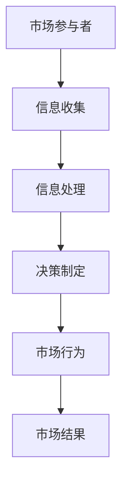

                 

关键词：信息不对称、市场壁垒、信息差、市场退出、竞争策略、数据分析、技术垄断、价值网络

## 摘要

在信息技术飞速发展的今天，信息不对称已经成为市场运行中不可忽视的重要因素。本文旨在探讨信息不对称如何影响市场的退出门槛，以及企业如何利用信息差来构建市场壁垒。通过深入分析信息不对称的原理和实际案例，本文揭示了信息差在市场战略中的重要性，并提出了企业在面对信息不对称时可以采取的应对策略。

## 1. 背景介绍

### 1.1 信息不对称的概念

信息不对称是指市场参与者之间的信息不对等，即某些参与者拥有比其他参与者更多或更准确的信息。这种不对称可能导致市场效率降低，价格机制失灵，甚至引发市场崩溃。在信息技术日益普及的今天，信息不对称现象更加普遍和复杂。

### 1.2 市场壁垒与市场退出

市场壁垒是指企业进入或退出市场的障碍，包括法律、经济和技术等多种因素。市场退出是指企业在面临不利市场条件时选择停止经营或转行。市场壁垒的存在使得企业在面临市场变化时往往难以迅速退出，从而影响市场结构的稳定性。

## 2. 核心概念与联系

### 2.1 信息不对称与市场壁垒的关系

信息不对称是市场壁垒形成的重要原因之一。企业通过控制关键信息，可以构建起市场壁垒，从而降低竞争压力，保障自身利益。

### 2.2 信息不对称的流程图



### 2.3 信息不对称的市场影响

信息不对称会导致市场效率降低，增加交易成本，影响消费者权益，甚至导致市场垄断。

## 3. 核心算法原理 & 具体操作步骤

### 3.1 算法原理概述

信息不对称的处理主要涉及信息收集、信息处理和决策制定等环节。算法的核心目标是提高信息透明度，降低信息不对称程度。

### 3.2 算法步骤详解

#### 3.2.1 信息收集

- 收集市场数据，包括价格、需求、供应等信息。
- 利用大数据技术进行数据挖掘和分析。

#### 3.2.2 信息处理

- 对收集到的信息进行筛选、分类和整合。
- 利用机器学习算法进行信息预测和决策支持。

#### 3.2.3 决策制定

- 根据处理后的信息制定市场策略。
- 实施市场监控和调整策略。

### 3.3 算法优缺点

#### 3.3.1 优点

- 提高市场透明度，降低交易成本。
- 帮助企业制定更有效的市场策略。

#### 3.3.2 缺点

- 数据收集和处理成本较高。
- 可能导致隐私问题。

### 3.4 算法应用领域

- 金融行业：风险评估、投资决策。
- 电商行业：商品推荐、价格预测。
- 制造业：供应链管理、生产计划。

## 4. 数学模型和公式 & 详细讲解 & 举例说明

### 4.1 数学模型构建

信息不对称的数学模型通常基于贝叶斯定理，用于计算不确定条件下的概率。

$$ P(A|B) = \frac{P(B|A)P(A)}{P(B)} $$

### 4.2 公式推导过程

贝叶斯定理描述了后验概率与先验概率之间的关系，用于更新我们对事件发生概率的估计。

### 4.3 案例分析与讲解

#### 4.3.1 案例背景

某电商平台的商品推荐系统，通过用户的历史购买行为和浏览记录来推荐商品。

#### 4.3.2 数学模型应用

使用贝叶斯网络来构建用户对商品的兴趣概率模型。

$$ P(推荐商品 | 购买历史) = \frac{P(购买历史 | 推荐商品)P(推荐商品)}{P(购买历史)} $$

## 5. 项目实践：代码实例和详细解释说明

### 5.1 开发环境搭建

- Python 3.8
- Scikit-learn 库
- Pandas 库

### 5.2 源代码详细实现

```python
from sklearn.naive_bayes import GaussianNB
from sklearn.model_selection import train_test_split
import pandas as pd

# 加载数据集
data = pd.read_csv('ecommerce_data.csv')
X = data[['purchase_history', 'browse_history']]
y = data['recommended_product']

# 划分训练集和测试集
X_train, X_test, y_train, y_test = train_test_split(X, y, test_size=0.2, random_state=42)

# 创建高斯朴素贝叶斯分类器
gnb = GaussianNB()

# 训练模型
gnb.fit(X_train, y_train)

# 预测测试集
predictions = gnb.predict(X_test)

# 评估模型
accuracy = gnb.score(X_test, y_test)
print(f"模型准确率：{accuracy:.2f}")
```

### 5.3 代码解读与分析

- 加载数据集：使用 Pandas 读取电商平台的用户数据。
- 数据预处理：将数据集划分为特征集和标签集。
- 划分训练集和测试集：使用 Scikit-learn 的 train_test_split 方法。
- 创建分类器：使用高斯朴素贝叶斯分类器。
- 训练模型：使用 fit 方法训练模型。
- 预测和评估：使用 predict 方法进行预测，并计算准确率。

## 6. 实际应用场景

### 6.1 信息不对称在电商行业中的应用

电商平台通过用户行为数据构建用户画像，实现个性化推荐，从而提高用户满意度，降低用户流失率。

### 6.2 信息不对称在金融行业中的应用

金融机构通过风险评估模型，识别高风险客户，降低信贷违约风险，保障金融安全。

## 7. 未来应用展望

### 7.1 信息不对称的数字化治理

随着区块链技术的发展，信息不对称有望得到有效治理，提高市场透明度和效率。

### 7.2 信息不对称与人工智能

人工智能技术将在信息不对称的处理中发挥更大作用，为市场参与者提供更准确的决策支持。

## 8. 总结：未来发展趋势与挑战

### 8.1 研究成果总结

本文探讨了信息不对称对市场退出门槛的影响，并提出了利用信息差构建市场壁垒的策略。通过数学模型和实际案例分析，揭示了信息不对称在市场战略中的重要性。

### 8.2 未来发展趋势

信息不对称的研究将朝着数字化、智能化的方向发展，为市场参与者提供更有效的决策支持。

### 8.3 面临的挑战

在信息不对称的处理过程中，隐私保护和数据安全将成为重要挑战。

### 8.4 研究展望

未来研究应关注信息不对称的治理机制，以及人工智能技术在信息不对称处理中的应用。

## 9. 附录：常见问题与解答

### 9.1 什么是信息不对称？

信息不对称是指市场参与者之间的信息不对等，即某些参与者拥有比其他参与者更多或更准确的信息。

### 9.2 市场壁垒有哪些类型？

市场壁垒主要包括法律壁垒、经济壁垒和技术壁垒。

### 9.3 信息不对称对市场有何影响？

信息不对称会导致市场效率降低，交易成本增加，影响消费者权益，甚至导致市场垄断。

作者：禅与计算机程序设计艺术 / Zen and the Art of Computer Programming
----------------------------------------------------------------


