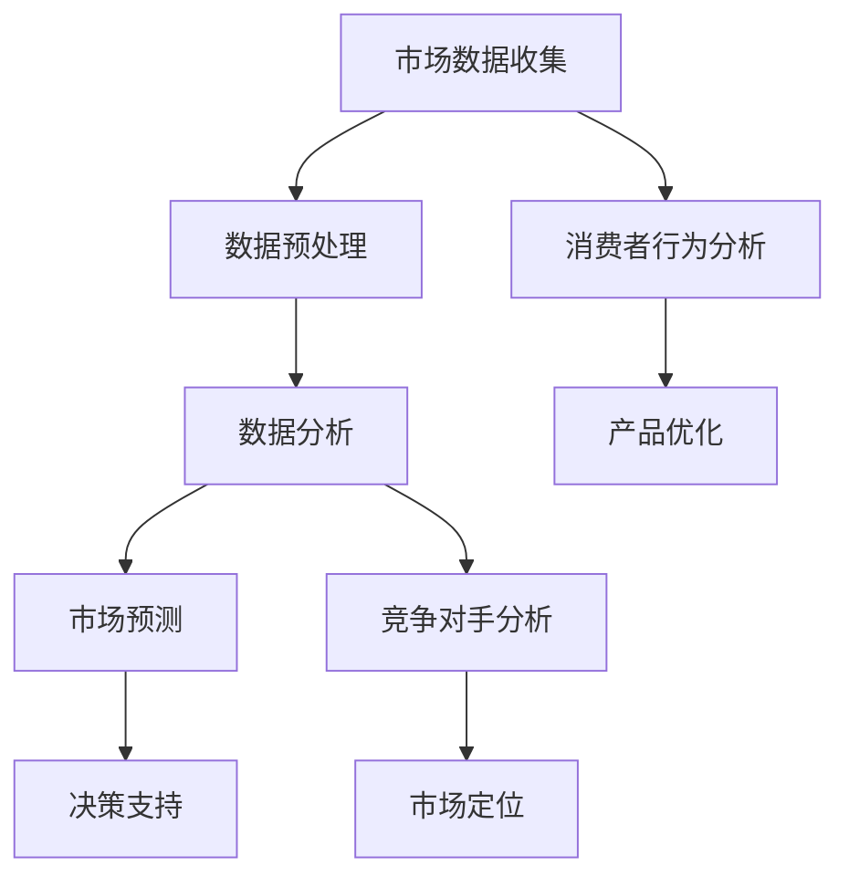

                 

关键词：大数据，市场研究，信息差，数据分析，预测模型，人工智能，商业洞察，决策支持系统

> 摘要：本文将探讨大数据如何通过信息差提升市场研究的效率和准确性。通过介绍大数据的基本概念、市场研究的重要性，以及大数据在市场研究中的应用，本文旨在揭示大数据如何帮助企业和研究机构更好地理解市场动态，做出更明智的决策。

## 1. 背景介绍

### 大数据的概念

大数据（Big Data）是指无法用常规软件工具在合理时间内捕捉、管理和处理的大量数据。它具有四个主要特征：大量（Volume）、多样（Variety）、高速（Velocity）和真实（Veracity）。大量数据使得传统的数据处理方法无法胜任，需要采用新的技术和方法；多样性则意味着数据来源广泛，包括结构化、半结构化和非结构化数据；高速指的是数据的产生速度非常快，要求实时处理；真实指的是数据的准确性和可信度。

### 市场研究的重要性

市场研究是企业制定战略、进行产品开发和市场推广的重要环节。通过市场研究，企业可以了解市场需求、消费者行为、竞争对手状况等关键信息，从而制定有效的营销策略和运营计划。传统的市场研究方法通常依赖于问卷调查、访谈和焦点小组等，但这些方法存在样本量小、数据不准确等问题。

## 2. 核心概念与联系

### 大数据与市场研究的关系

大数据的引入为市场研究带来了革命性的变化。首先，大数据能够提供更为全面和真实的市场数据，使得市场研究能够覆盖更广泛的消费者群体，提高研究的代表性。其次，大数据技术能够对海量数据进行高效处理和分析，揭示出消费者行为的深层次规律和趋势，为市场预测提供更为可靠的依据。此外，大数据还能实现实时监控和反馈，帮助企业及时调整营销策略。

### Mermaid 流程图



## 3. 核心算法原理 & 具体操作步骤

### 3.1 算法原理概述

大数据在市场研究中的应用涉及多个核心算法，包括数据挖掘、机器学习和预测模型。数据挖掘旨在从大量数据中提取有价值的信息；机器学习则通过训练模型来预测和分类数据；预测模型则基于历史数据对未来市场趋势进行预测。

### 3.2 算法步骤详解

1. **数据收集**：通过在线调查、社交媒体分析、市场监测工具等方式收集海量市场数据。
2. **数据预处理**：清洗和整理数据，包括去除重复数据、处理缺失值、标准化数据等。
3. **数据挖掘**：使用关联规则挖掘、聚类分析等方法发现数据中的隐藏模式。
4. **机器学习**：训练分类和回归模型，如决策树、随机森林、神经网络等，对数据进行分析。
5. **预测模型**：使用训练好的模型对市场趋势进行预测，如时间序列分析、ARIMA 模型等。

### 3.3 算法优缺点

- **优点**：高效处理海量数据，提供精确的市场洞察，实时反馈。
- **缺点**：数据处理成本高，数据质量直接影响分析结果，算法解释性较差。

### 3.4 算法应用领域

大数据算法在市场研究中的应用非常广泛，包括消费者行为分析、市场预测、产品优化、竞争对手分析等方面。

## 4. 数学模型和公式 & 详细讲解 & 举例说明

### 4.1 数学模型构建

市场研究中的数学模型通常包括回归模型、时间序列模型和分类模型。

### 4.2 公式推导过程

以回归模型为例，其公式为：

$$ y = \beta_0 + \beta_1x + \epsilon $$

其中，$y$ 是因变量，$x$ 是自变量，$\beta_0$ 和 $\beta_1$ 是模型的参数，$\epsilon$ 是误差项。

### 4.3 案例分析与讲解

假设我们要预测一个电商平台的月销售额，我们收集了过去一年的销售额数据，并选择了月份作为自变量。使用线性回归模型进行预测，模型公式为：

$$ \text{销售额} = \beta_0 + \beta_1 \times \text{月份} $$

通过训练模型，我们得到 $\beta_0 = 100, \beta_1 = 2$。因此，未来某一月份的销售额可以预测为：

$$ \text{销售额} = 100 + 2 \times \text{月份} $$

例如，预测第 13 个月的销售额为：

$$ \text{销售额} = 100 + 2 \times 13 = 236 $$

## 5. 项目实践：代码实例和详细解释说明

### 5.1 开发环境搭建

本文使用 Python 作为编程语言，需要安装以下库：NumPy、Pandas、Scikit-learn 和 Statsmodels。

```python
pip install numpy pandas scikit-learn statsmodels
```

### 5.2 源代码详细实现

```python
import numpy as np
import pandas as pd
from sklearn.linear_model import LinearRegression
from statsmodels.tsa.arima.model import ARIMA

# 数据加载
data = pd.read_csv('sales_data.csv')
X = data[['month']]
y = data['sales']

# 数据预处理
X = X.astype(int)
y = y.astype(float)

# 线性回归模型
model = LinearRegression()
model.fit(X, y)

# 预测
predictions = model.predict(X)

# 时间序列模型
model_tsa = ARIMA(y, order=(1, 1, 1))
model_tsa.fit()
predictions_tsa = model_tsa.forecast(steps=12)

# 结果展示
print("线性回归模型预测结果：", predictions)
print("时间序列模型预测结果：", predictions_tsa)
```

### 5.3 代码解读与分析

这段代码首先加载了销售数据，然后使用线性回归模型和时间序列模型分别对数据进行预测。线性回归模型使用 Scikit-learn 的 LinearRegression 类进行训练和预测；时间序列模型使用 Statsmodels 的 ARIMA 类进行训练和预测。最后，将预测结果进行展示。

## 6. 实际应用场景

大数据在市场研究中的应用场景非常广泛，以下是一些典型的应用案例：

- **消费者行为分析**：通过分析消费者的购买历史、浏览行为和社交媒体互动，企业可以了解消费者的偏好和需求，从而优化产品设计和营销策略。
- **市场预测**：使用大数据和预测模型，企业可以预测未来市场的需求和趋势，为库存管理和定价策略提供支持。
- **产品优化**：通过分析消费者反馈和使用数据，企业可以不断优化产品，提高用户满意度。
- **竞争对手分析**：通过分析竞争对手的市场表现和用户反馈，企业可以了解竞争对手的优势和劣势，制定相应的竞争策略。

## 7. 未来应用展望

随着大数据技术的不断发展和普及，市场研究将变得更加智能化和高效。未来的发展趋势包括：

- **智能化数据分析**：利用人工智能技术，实现自动化数据分析和预测，降低人工成本，提高分析准确性。
- **实时数据分析**：通过实时数据处理和分析，企业可以更快地响应市场变化，制定更加灵活的营销策略。
- **多源数据融合**：结合多种数据源，如社交媒体、物联网和传感器数据，实现更全面的市场洞察。

## 8. 工具和资源推荐

### 8.1 学习资源推荐

- 《大数据时代》
- 《Python数据分析》
- 《机器学习实战》

### 8.2 开发工具推荐

- Jupyter Notebook
- PyCharm
- R Studio

### 8.3 相关论文推荐

- "Big Data: A Revolution That Will Transform How We Live, Work, and Think"
- "The Analytics Revolution: Driving Business with Big Data"
- "Data Science from A to Z: Practical Insights from the World's Leading Data Scientists"

## 9. 总结：未来发展趋势与挑战

### 9.1 研究成果总结

大数据在市场研究中的应用已经取得了显著的成果，提高了市场研究的效率和准确性。未来，大数据技术将继续向智能化、实时化和多源数据融合方向发展。

### 9.2 未来发展趋势

- 智能化数据分析
- 实时数据分析
- 多源数据融合

### 9.3 面临的挑战

- 数据隐私和安全
- 数据质量
- 算法解释性

### 9.4 研究展望

未来，大数据技术将在市场研究中发挥更加重要的作用，为企业和研究机构提供更加全面和准确的市场洞察。

## 附录：常见问题与解答

### Q：大数据在市场研究中的具体应用有哪些？

A：大数据在市场研究中的应用包括消费者行为分析、市场预测、产品优化、竞争对手分析等。

### Q：如何保证大数据分析结果的准确性？

A：保证大数据分析结果的准确性需要关注数据质量、选择合适的算法和模型，以及进行交叉验证和验证。

### Q：大数据分析如何保护用户隐私？

A：大数据分析可以通过匿名化处理、加密技术、隐私保护算法等方式来保护用户隐私。

## 作者署名

作者：禅与计算机程序设计艺术 / Zen and the Art of Computer Programming

----------------------------------------------------------------
以上是文章的内容，接下来我们将进行markdown格式的排版和验证。请确保所有章节、子章节以及数学公式都符合markdown的规范，并使用Mermaid流程图进行可视化。最后，确认文章的完整性和正确性，确保没有遗漏或者错误。开始排版和验证工作吧！

