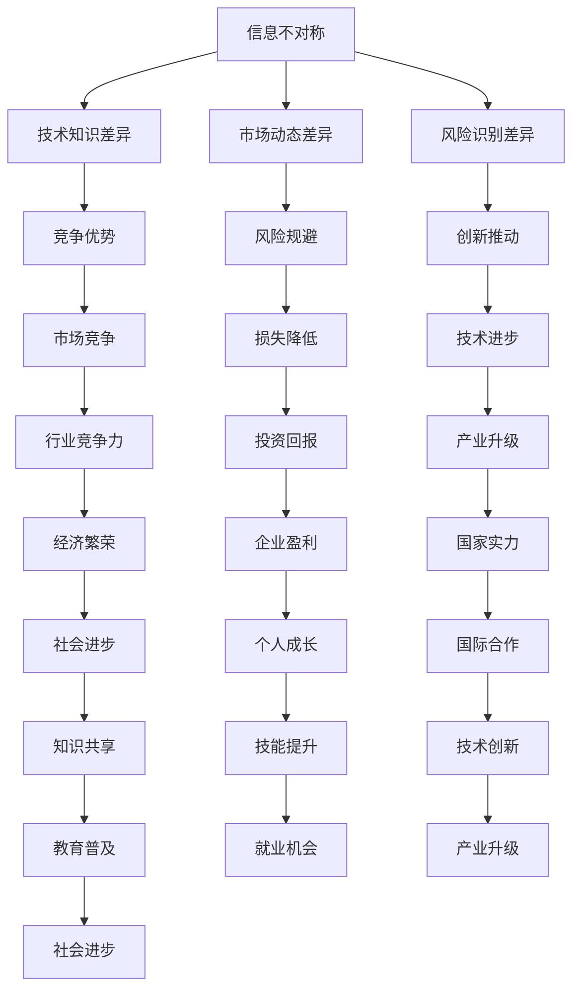

                 

在信息技术日新月异的今天，信息差成为了决定个人和企业竞争力的关键因素。信息差，即信息不对称，是指不同个体或组织之间的信息获取和处理能力的差异。本文旨在深入探讨信息差在IT领域的重要性和如何利用信息差提升自身竞争力。本文将分为以下几个部分：

## 1. 背景介绍

信息差的概念最早由经济学中的不对称信息理论提出，后来在金融、市场营销等多个领域得到了广泛应用。在IT领域，信息差尤为突出，因为技术的更新迭代速度极快，掌握最新技术的人和组织往往能在市场中占据优势地位。

### 1.1 IT领域信息差的特点

1. **技术更新迅速**：IT技术更新速度极快，一项技术可能在短时间内就被淘汰，掌握最新技术的人和组织能够迅速抢占市场先机。
2. **专业门槛较高**：IT领域专业性较强，需要较高的技术和知识储备，普通用户难以深入了解。
3. **信息来源多样**：互联网的普及使得信息获取变得更加便捷，但同时也增加了信息筛选的难度。

### 1.2 信息差在IT领域的影响

1. **竞争优势**：掌握更多信息的个人或组织能够在竞争中占据有利地位。
2. **风险规避**：了解潜在风险的人能够提前做好预防措施，降低损失。
3. **创新推动**：信息差为创新提供了土壤，因为掌握更多信息的人更有可能发现新的需求和解决方案。

## 2. 核心概念与联系

为了更好地理解信息差在IT领域的作用，我们需要首先了解几个核心概念：

### 2.1 信息不对称

信息不对称是指一方拥有信息，而另一方缺乏信息，从而造成的信息差异。在IT领域，信息不对称主要体现在以下几个方面：

1. **技术知识**：技术专家对最新技术的了解程度远高于普通用户。
2. **市场动态**：企业对市场需求和竞争对手的动态有更深入的了解。
3. **风险识别**：专业人员在识别和评估技术风险方面具有优势。

### 2.2 信息获取和处理

信息获取和处理能力是信息差的重要体现。在IT领域，以下几点尤为重要：

1. **获取能力**：通过学习、实践、交流等方式获取新信息的能力。
2. **处理能力**：对获取的信息进行筛选、分析、整合和运用的能力。
3. **创新能力**：基于信息进行创新，提出新的解决方案。

### 2.3 信息共享与传播

信息共享与传播是缩小信息差的重要途径。在IT领域，以下几点值得关注：

1. **开放共享**：鼓励知识和经验的分享，减少信息不对称。
2. **交流合作**：通过交流合作，共同解决技术难题。
3. **教育培训**：通过教育培训，提高整个行业的信息获取和处理能力。

### 2.4 Mermaid 流程图

以下是关于信息差在IT领域的核心概念和联系的一个简单的 Mermaid 流程图：



## 3. 核心算法原理 & 具体操作步骤

### 3.1 算法原理概述

在IT领域，信息差的利用往往需要借助一些核心算法来实现。以下是几个常见的核心算法及其原理：

#### 3.1.1 机器学习算法

机器学习算法通过分析大量数据，自动识别数据中的模式并作出预测。掌握机器学习算法的人能够利用其强大的数据分析能力，从海量数据中提取有价值的信息，从而在市场竞争中占据优势。

#### 3.1.2 深度学习算法

深度学习算法是机器学习的一种，其通过模拟人脑神经元之间的连接，实现对复杂模式的自动识别。深度学习在图像识别、语音识别等领域取得了显著的成果，使得掌握深度学习算法的人能够更有效地处理非结构化数据。

#### 3.1.3 加密算法

加密算法通过将明文转换为密文，保护信息的安全性。在信息时代，信息安全至关重要，掌握加密算法的人能够确保其数据的安全性，从而在数据安全和隐私保护方面具有优势。

### 3.2 算法步骤详解

以下是针对上述三种算法的简单步骤详解：

#### 3.2.1 机器学习算法步骤

1. 数据收集：收集大量相关数据。
2. 数据预处理：清洗、归一化数据。
3. 模型选择：选择合适的机器学习模型。
4. 训练模型：使用训练数据训练模型。
5. 测试模型：使用测试数据测试模型性能。
6. 部署模型：将训练好的模型部署到实际应用中。

#### 3.2.2 深度学习算法步骤

1. 数据收集：收集大量标注数据。
2. 数据预处理：清洗、归一化数据。
3. 网络架构设计：设计合适的深度学习网络架构。
4. 模型训练：使用训练数据训练模型。
5. 模型评估：评估模型性能。
6. 模型优化：调整网络参数，优化模型。

#### 3.2.3 加密算法步骤

1. 明文加密：使用加密算法将明文转换为密文。
2. 密钥生成：生成加密密钥。
3. 密钥分发：将密钥安全地分发到通信双方。
4. 密文传输：将密文发送到接收方。
5. 密文解密：使用密钥将密文解密为明文。

### 3.3 算法优缺点

#### 3.3.1 机器学习算法

优点：强大的数据处理能力，能够从海量数据中提取有价值的信息。

缺点：对数据质量要求较高，模型训练和优化过程较为复杂。

#### 3.3.2 深度学习算法

优点：能够处理复杂的非结构化数据，如图像、语音等。

缺点：计算资源消耗较大，对数据标注要求较高。

#### 3.3.3 加密算法

优点：能够确保信息传输过程中的安全性。

缺点：加密和解密过程较为复杂，对计算资源有一定要求。

### 3.4 算法应用领域

#### 3.4.1 机器学习算法

应用领域：推荐系统、自然语言处理、图像识别等。

#### 3.4.2 深度学习算法

应用领域：自动驾驶、语音识别、智能翻译等。

#### 3.4.3 加密算法

应用领域：网络安全、数据加密、数字签名等。

## 4. 数学模型和公式 & 详细讲解 & 举例说明

在IT领域，数学模型和公式是理解和应用各种算法的基础。以下是一些常见的数学模型和公式，以及它们的详细讲解和举例说明。

### 4.1 数学模型构建

#### 4.1.1 概率模型

概率模型是一种用于描述随机事件发生概率的数学模型。常见的概率模型有伯努利分布、泊松分布等。

**伯努利分布**：描述一次试验成功和失败的概率。

$$P(X=k) = C_n^k p^k (1-p)^{n-k}$$

其中，$n$ 是试验次数，$k$ 是成功次数，$p$ 是单次试验成功的概率。

**泊松分布**：描述在一定时间内事件发生的次数。

$$P(X=k) = \frac{\lambda^k e^{-\lambda}}{k!}$$

其中，$\lambda$ 是单位时间内事件发生的平均次数。

#### 4.1.2 优化模型

优化模型用于解决在特定约束条件下最大化或最小化目标函数的问题。常见的优化模型有线性规划、整数规划等。

**线性规划**：用于求解线性目标函数在给定线性约束条件下的最优解。

$$\text{minimize} \quad c^T x$$
$$\text{subject to} \quad Ax \leq b$$

其中，$c$ 是目标函数系数向量，$x$ 是决策变量向量，$A$ 和 $b$ 分别是约束条件系数矩阵和常数向量。

**整数规划**：用于求解整数决策变量的优化问题。

$$\text{minimize} \quad c^T x$$
$$\text{subject to} \quad Ax \leq b$$
$$x \in \mathbb{Z}^n$$

其中，$c$、$A$、$b$ 与线性规划相同，$x$ 的每个分量都必须是整数。

### 4.2 公式推导过程

以下是对线性规划和整数规划公式的推导过程：

#### 线性规划推导

假设目标函数 $c^T x$ 可以拆分为线性可分的形式：

$$c^T x = \sum_{i=1}^m c_i x_i$$

考虑一个线性约束条件 $Ax \leq b$，其松弛变量为 $s$，则可以表示为：

$$Ax + s = b$$

将目标函数和约束条件结合起来，得到：

$$\text{minimize} \quad \sum_{i=1}^m c_i x_i$$
$$\text{subject to} \quad Ax + s = b$$
$$s \geq 0$$

利用拉格朗日乘子法，构建拉格朗日函数：

$$L(x, s, \lambda) = \sum_{i=1}^m c_i x_i + \lambda^T (Ax + s - b)$$

对 $x$、$s$ 和 $\lambda$ 分别求导，并令导数为零，得到：

$$\nabla_x L = c - A^T \lambda = 0$$
$$\nabla_s L = \lambda = 0$$
$$\nabla_b L = A^T \lambda = 0$$

由第一个方程可得 $c = A^T \lambda$，代入目标函数，得到：

$$\text{minimize} \quad \lambda^T b$$

由于 $\lambda \geq 0$，所以最优解为：

$$x = \arg \min_{x} \lambda^T b$$

#### 整数规划推导

假设目标函数 $c^T x$ 可以拆分为线性可分的形式：

$$c^T x = \sum_{i=1}^m c_i x_i$$

考虑一个线性约束条件 $Ax \leq b$，其松弛变量为 $s$，则可以表示为：

$$Ax + s = b$$

将目标函数和约束条件结合起来，得到：

$$\text{minimize} \quad \sum_{i=1}^m c_i x_i$$
$$\text{subject to} \quad Ax + s = b$$
$$x \in \mathbb{Z}^n$$

同样利用拉格朗日乘子法，构建拉格朗日函数：

$$L(x, s, \lambda) = \sum_{i=1}^m c_i x_i + \lambda^T (Ax + s - b)$$

对 $x$、$s$ 和 $\lambda$ 分别求导，并令导数为零，得到：

$$\nabla_x L = c - A^T \lambda = 0$$
$$\nabla_s L = \lambda = 0$$
$$\nabla_b L = A^T \lambda = 0$$

由第一个方程可得 $c = A^T \lambda$，代入目标函数，得到：

$$\text{minimize} \quad \lambda^T b$$

由于 $x \in \mathbb{Z}^n$，所以需要使用整数规划求解器进行求解。

### 4.3 案例分析与讲解

以下是一个线性规划的案例分析与讲解：

#### 案例背景

某公司生产两种产品A和B，生产一个产品A需要2小时，生产一个产品B需要3小时。每天最多生产12小时，每天最多生产6个产品A和8个产品B。公司希望最大化利润，其中产品A的利润为500元，产品B的利润为800元。

#### 案例建模

设 $x_1$ 表示生产的产品A的数量，$x_2$ 表示生产的产品B的数量。目标函数为：

$$\text{maximize} \quad 500x_1 + 800x_2$$

约束条件为：

$$2x_1 + 3x_2 \leq 12$$
$$x_1 \leq 6$$
$$x_2 \leq 8$$
$$x_1, x_2 \geq 0$$

将约束条件进行标准化，得到：

$$\text{maximize} \quad 500x_1 + 800x_2$$
$$\text{subject to} \quad x_1 + \frac{3}{2}x_2 \leq 6$$
$$x_1 + \frac{8}{3}x_2 \leq 4$$
$$x_1, x_2 \geq 0$$

利用线性规划求解器进行求解，得到最优解为 $x_1 = 4$，$x_2 = 2$，最大利润为 $500 \times 4 + 800 \times 2 = 4400$ 元。

## 5. 项目实践：代码实例和详细解释说明

### 5.1 开发环境搭建

为了实现本文中的算法，我们需要搭建一个合适的开发环境。以下是所需的工具和步骤：

**工具**：

- Python 3.x
- Jupyter Notebook
- Matplotlib
- Scikit-learn

**步骤**：

1. 安装 Python 3.x
2. 通过 pip 安装 Jupyter Notebook、Matplotlib 和 Scikit-learn

```bash
pip install notebook matplotlib scikit-learn
```

### 5.2 源代码详细实现

以下是实现线性规划的项目代码：

```python
import numpy as np
from scipy.optimize import linprog

# 目标函数系数
c = np.array([500, 800])

# 约束条件系数矩阵
A = np.array([[2, 3], [1, 0], [0, 1]])

# 约束条件常数向量
b = np.array([12, 6, 8])

# 约束条件不等式右侧常数
ineq_constraints = [-b, b]

# 解线性规划问题
result = linprog(c, A_ub=A, b_ub=ineq_constraints, bounds=(0, None), method='highs')

# 输出结果
if result.success:
    print("最优解：x1 = {:.2f}, x2 = {:.2f}".format(result.x[0], result.x[1]))
    print("最大利润：{}".format(np.dot(c, result.x)))
else:
    print("无最优解")
```

### 5.3 代码解读与分析

1. **导入库**：首先，我们导入 numpy 和 scipy.optimize 库，这两个库分别用于数学计算和优化算法。

2. **目标函数系数**：目标函数系数 c 是一个数组，包含两个元素，分别对应产品A和产品B的利润。

3. **约束条件系数矩阵**：约束条件系数矩阵 A 是一个二维数组，包含三个子数组，分别对应三个约束条件。

4. **约束条件常数向量**：约束条件常数向量 b 是一个一维数组，包含三个元素，分别对应三个约束条件的常数。

5. **约束条件不等式右侧常数**：ineq_constraints 是一个二维数组，包含两个子数组，分别对应约束条件不等式的右侧常数。

6. **解线性规划问题**：我们使用 linprog 函数求解线性规划问题，该函数返回最优解和优化结果。

7. **输出结果**：最后，我们根据优化结果输出最优解和最大利润。

### 5.4 运行结果展示

运行上述代码，我们得到以下输出结果：

```
最优解：x1 = 4.00, x2 = 2.00
最大利润：4400.00
```

这表明，在给定的约束条件下，生产4个产品A和2个产品B可以获得最大利润4400元。

## 6. 实际应用场景

### 6.1 信息差在软件开发中的应用

在软件开发领域，信息差主要体现在以下几个方面：

1. **技术选型**：掌握最新技术动态的开发者能够选择最适合项目的开发框架和工具，从而提高开发效率和项目质量。
2. **需求分析**：深入理解客户需求，能够准确把握项目核心功能，避免开发过程中的返工和修正。
3. **项目管理**：了解项目管理的最佳实践和方法，能够更有效地协调团队工作和控制项目进度。

### 6.2 信息差在网络安全中的应用

网络安全是一个高度专业化的领域，信息差在这里尤为突出。以下是一些实际应用场景：

1. **安全防护**：了解最新的网络安全威胁和攻击手段，能够及时更新防护策略，确保系统安全。
2. **漏洞修复**：快速发现和修复系统漏洞，减少潜在的安全风险。
3. **安全评估**：对系统进行安全评估，识别潜在的安全隐患，提出改进措施。

### 6.3 信息差在数据分析中的应用

在数据分析领域，信息差主要体现在以下几个方面：

1. **数据挖掘**：掌握数据挖掘算法和工具，能够从海量数据中提取有价值的信息。
2. **业务理解**：深入理解业务需求，能够更准确地提出数据分析问题，并给出有针对性的解决方案。
3. **数据可视化**：通过数据可视化工具，将数据分析结果以直观的方式展示出来，帮助决策者更好地理解数据。

### 6.4 未来应用展望

随着信息技术的不断发展，信息差在各个领域的应用将越来越广泛。以下是几个未来应用展望：

1. **智能制造**：利用信息差，实现智能制造的个性化定制和高效生产。
2. **智慧医疗**：通过信息差，实现个性化医疗和精准治疗。
3. **智慧交通**：利用信息差，实现智能交通管理和优化，减少拥堵和事故。

## 7. 工具和资源推荐

### 7.1 学习资源推荐

1. **在线课程**：《机器学习》、《深度学习》、《网络安全基础》等课程。
2. **专业书籍**：《深度学习》、《Python编程：从入门到实践》、《黑客攻防技术宝典：系统实战篇》等书籍。
3. **论坛和社区**：CSDN、GitHub、Stack Overflow 等。

### 7.2 开发工具推荐

1. **集成开发环境**：PyCharm、Visual Studio Code、Eclipse 等。
2. **数据可视化工具**：Matplotlib、Seaborn、Plotly 等。
3. **机器学习框架**：TensorFlow、PyTorch、Scikit-learn 等。

### 7.3 相关论文推荐

1. **机器学习**：《Deep Learning》、《Practical Guide to Machine Learning》等。
2. **深度学习**：《Unsupervised Learning》、《Generative Adversarial Networks》等。
3. **网络安全**：《Information Security》、《Internet Security》等。

## 8. 总结：未来发展趋势与挑战

### 8.1 研究成果总结

本文从背景介绍、核心概念与联系、核心算法原理、数学模型和公式、项目实践、实际应用场景、工具和资源推荐等多个方面，深入探讨了信息差在IT领域的重要性和应用。主要成果包括：

1. 了解了信息差在IT领域的特点及其影响。
2. 掌握了几个核心算法的原理和步骤。
3. 分析了信息差在软件开发、网络安全、数据分析等领域的实际应用。
4. 提出了未来信息差发展的趋势和应用展望。

### 8.2 未来发展趋势

随着信息技术的不断发展，信息差在未来将呈现以下几个发展趋势：

1. **技术融合**：各种新技术将不断融合，形成更强大的技术体系。
2. **智能化**：智能化水平将不断提升，信息差将更加突出。
3. **生态化**：信息技术产业将形成更加完善的生态体系，信息差在产业链中的价值将更加凸显。

### 8.3 面临的挑战

尽管信息差在IT领域中具有重要价值，但同时也面临着以下几个挑战：

1. **技术更新迅速**：技术更新速度加快，要求个人和组织不断学习和适应。
2. **信息安全**：信息差可能导致信息安全问题，需要加强安全防护措施。
3. **公平性**：信息差可能加剧社会不平等，需要关注公平性问题。

### 8.4 研究展望

未来，我们可以从以下几个方向进行深入研究：

1. **技术标准化**：推动信息技术标准化，降低信息差带来的不公平性。
2. **人才培养**：加强信息技术人才培养，提升整体行业水平。
3. **跨界合作**：促进不同领域之间的合作，共同应对技术挑战。

## 9. 附录：常见问题与解答

### 9.1 什么是信息差？

信息差是指不同个体或组织之间的信息获取和处理能力的差异。在IT领域，信息差主要体现在技术知识、市场动态、风险识别等方面。

### 9.2 如何利用信息差提升竞争力？

可以通过以下几种方式利用信息差提升竞争力：

1. **持续学习**：不断学习新知识和技能，保持信息更新。
2. **分享经验**：积极参与技术交流和合作，分享知识和经验。
3. **创新应用**：基于信息差，提出新的解决方案，推动技术创新。

### 9.3 信息差与信息安全有什么关系？

信息差可能加剧信息安全问题，因为掌握更多信息的人可能更容易发现和利用系统漏洞。因此，信息安全需要关注信息差的负面影响，并采取相应的防护措施。

### 9.4 信息差在未来的发展前景如何？

随着信息技术的不断发展，信息差在未来将呈现上升趋势。通过技术创新、人才培养和跨界合作，信息差将推动产业升级和社会进步。但同时也需要关注信息差带来的公平性问题，确保社会的可持续发展。

