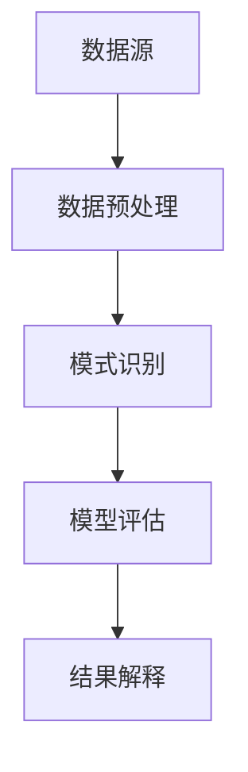
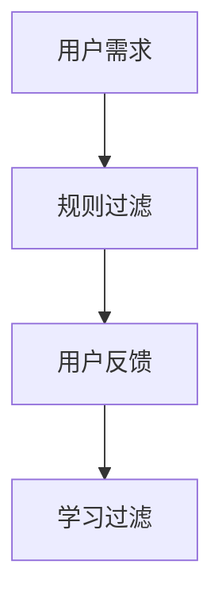
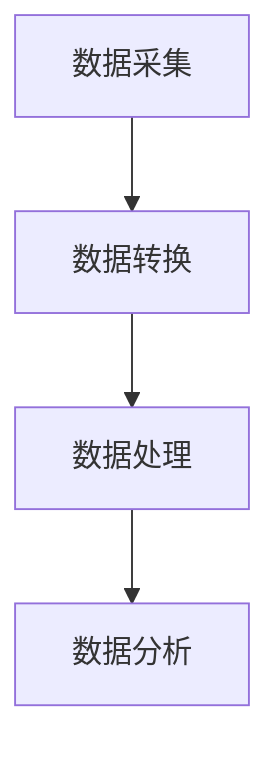

                 

在当今信息爆炸的时代，处理和利用信息成为了企业和个人提高生产力的关键。然而，信息过载的现象愈发普遍，这给我们的工作和生活带来了诸多挑战。本文将探讨如何在信息时代进行有效的信息管理，以应对信息过载问题，从而提升生产力。

> 关键词：信息管理、信息过载、生产力提升、技术解决方案

## 摘要

本文首先介绍了信息过载的定义及其对生产力的负面影响。接着，我们深入分析了信息管理的核心概念，包括数据挖掘、信息过滤和自动化处理。随后，本文通过具体的算法原理、数学模型以及项目实践，展示了如何运用技术手段优化信息管理流程。最后，本文提出了未来信息管理的发展趋势、面临的挑战以及研究展望。

## 1. 背景介绍

随着互联网和数字技术的迅猛发展，信息爆炸已成为不可逆转的趋势。据统计，全球每天产生的数据量高达数十亿GB，而这些数据中仅有不到3%被实际利用。大量无用或冗余的信息充斥着我们的生活和工作，造成了严重的信息过载。信息过载不仅浪费了我们的时间和精力，还可能导致决策失误、效率低下和生产力下降。

### 1.1 信息过载的定义

信息过载是指信息量超过了个体处理能力，导致个体无法有效地获取、理解和利用信息的现象。信息过载可以表现为以下几个方面：

- **接收信息过多**：每天接收的邮件、通知、社交媒体更新等信息量巨大。
- **信息质量低劣**：大量无关或低价值的信息充斥着我们的视野，导致筛选和处理的难度增加。
- **信息传递滞后**：信息处理速度无法跟上信息接收速度，导致信息传递滞后。
- **决策困难**：在信息过载的环境中，个体难以从众多信息中筛选出有价值的信息，从而做出正确的决策。

### 1.2 信息过载对生产力的负面影响

信息过载对生产力的负面影响主要体现在以下几个方面：

- **时间浪费**：处理大量无关信息会消耗大量的时间，从而影响生产效率。
- **注意力分散**：频繁的信息干扰会导致个体注意力分散，难以集中精力完成工作任务。
- **决策困难**：在信息过载的环境中，个体难以从众多信息中筛选出有价值的信息，从而做出正确的决策。
- **心理压力**：信息过载会导致个体产生焦虑、紧张等负面情绪，影响心理健康。

### 1.3 信息管理的必要性

为了应对信息过载，我们需要进行有效的信息管理。信息管理是一种通过收集、整理、存储、处理和利用信息的方法和过程，其目的是确保信息的及时性、准确性、可靠性和可用性。信息管理不仅可以减轻信息过载带来的负面影响，还可以提高信息利用效率，从而提升生产力。

## 2. 核心概念与联系

### 2.1 数据挖掘

数据挖掘是一种通过从大量数据中发现潜在模式和规律的方法。数据挖掘的核心目的是从大量数据中发现有价值的信息，从而支持决策制定。数据挖掘过程通常包括数据预处理、模式识别、模型评估和结果解释等步骤。



### 2.2 信息过滤

信息过滤是一种通过筛选和分类信息，以便用户能够快速获取有价值信息的方法。信息过滤可以分为基于规则的方法和基于学习的方法。



### 2.3 自动化处理

自动化处理是一种通过使用计算机程序和算法来自动完成信息处理任务的方法。自动化处理可以大大提高信息处理效率，减轻人工负担。自动化处理包括数据采集、数据转换、数据处理和数据分析等步骤。



## 3. 核心算法原理 & 具体操作步骤

### 3.1 算法原理概述

为了有效管理信息，我们采用了以下几种核心算法：

- **聚类算法**：用于将数据集划分为若干个群组，使得同组内的数据点之间相似度较高，而不同组的数据点之间相似度较低。
- **分类算法**：用于将数据集划分为不同的类别，以便根据类别特征进行信息筛选。
- **文本挖掘算法**：用于从文本数据中提取有价值的信息，如关键词、主题和情感等。
- **神经网络算法**：用于构建智能模型，实现自动化信息处理和决策。

### 3.2 算法步骤详解

#### 3.2.1 聚类算法

1. **数据预处理**：对原始数据进行清洗、去噪和归一化等处理。
2. **选择聚类算法**：根据数据特点选择合适的聚类算法，如K-means、DBSCAN等。
3. **初始化聚类中心**：随机选择若干个初始聚类中心。
4. **迭代优化**：根据当前聚类结果重新计算聚类中心，并更新聚类成员。
5. **评估聚类结果**：计算聚类评价指标，如轮廓系数、内部球体直径等，以评估聚类质量。

#### 3.2.2 分类算法

1. **数据预处理**：对原始数据进行清洗、去噪和归一化等处理。
2. **特征提取**：从原始数据中提取具有区分性的特征。
3. **选择分类算法**：根据数据特点选择合适的分类算法，如决策树、支持向量机等。
4. **模型训练**：使用训练数据集对分类模型进行训练。
5. **模型评估**：使用测试数据集对分类模型进行评估，计算分类准确率、召回率等指标。
6. **应用模型**：将训练好的分类模型应用于新数据，进行信息筛选和分类。

#### 3.2.3 文本挖掘算法

1. **文本预处理**：对原始文本进行分词、去停用词、词性标注等处理。
2. **特征提取**：从预处理后的文本中提取关键词、主题和情感等特征。
3. **选择文本挖掘算法**：根据文本特点选择合适的文本挖掘算法，如LDA、情感分析等。
4. **模型训练**：使用训练数据集对文本挖掘模型进行训练。
5. **模型评估**：使用测试数据集对文本挖掘模型进行评估，计算分类准确率、召回率等指标。
6. **应用模型**：将训练好的文本挖掘模型应用于新文本，进行信息提取和分析。

#### 3.2.4 神经网络算法

1. **数据预处理**：对原始数据进行清洗、去噪和归一化等处理。
2. **特征提取**：从原始数据中提取具有区分性的特征。
3. **构建神经网络模型**：根据数据特点选择合适的神经网络结构，如多层感知机、卷积神经网络等。
4. **模型训练**：使用训练数据集对神经网络模型进行训练。
5. **模型评估**：使用测试数据集对神经网络模型进行评估，计算模型性能指标，如准确率、召回率等。
6. **应用模型**：将训练好的神经网络模型应用于新数据，进行自动化信息处理和决策。

### 3.3 算法优缺点

#### 3.3.1 聚类算法

- **优点**：无需事先指定类别，能够自动发现数据中的潜在结构。
- **缺点**：对初始聚类中心敏感，可能陷入局部最优。

#### 3.3.2 分类算法

- **优点**：能够明确地将数据划分为不同的类别，有助于信息筛选。
- **缺点**：对训练数据量有较高要求，可能过拟合。

#### 3.3.3 文本挖掘算法

- **优点**：能够从文本数据中提取有价值的信息，适用于文本信息处理。
- **缺点**：对文本数据的理解和表达存在一定的局限性。

#### 3.3.4 神经网络算法

- **优点**：具有较强的自适应性和泛化能力，能够处理复杂数据和任务。
- **缺点**：训练过程可能较慢，对计算资源有较高要求。

### 3.4 算法应用领域

#### 3.4.1 聚类算法

- **应用领域**：市场细分、图像分割、社交网络分析等。
- **案例**：通过K-means算法对客户进行市场细分，从而实现精准营销。

#### 3.4.2 分类算法

- **应用领域**：垃圾邮件过滤、疾病诊断、金融风险评估等。
- **案例**：使用支持向量机算法进行垃圾邮件过滤，提高邮件系统安全。

#### 3.4.3 文本挖掘算法

- **应用领域**：自然语言处理、舆情监测、智能客服等。
- **案例**：利用情感分析算法对社交媒体舆情进行监控，及时了解用户需求。

#### 3.4.4 神经网络算法

- **应用领域**：图像识别、语音识别、推荐系统等。
- **案例**：使用卷积神经网络进行图像分类，提高图像识别准确率。

## 4. 数学模型和公式 & 详细讲解 & 举例说明

### 4.1 数学模型构建

为了更好地理解和应用核心算法，我们需要构建相应的数学模型。以下是几种常见的数学模型：

#### 4.1.1 聚类算法：K-means

K-means算法的目标是最小化数据点与聚类中心之间的距离平方和。其数学模型可以表示为：

$$
\min_{\mu_1, \mu_2, ..., \mu_K} \sum_{i=1}^N \sum_{j=1}^K (x_i - \mu_j)^2
$$

其中，$N$ 是数据点数量，$K$ 是聚类类别数量，$x_i$ 是第 $i$ 个数据点，$\mu_j$ 是第 $j$ 个聚类中心。

#### 4.1.2 分类算法：支持向量机

支持向量机（SVM）的数学模型可以表示为：

$$
\min_{\omega, \xi} \frac{1}{2} \sum_{i=1}^N (\omega \cdot x_i - y_i)^2 + C \sum_{i=1}^N \xi_i
$$

其中，$\omega$ 是权重向量，$x_i$ 是第 $i$ 个数据点，$y_i$ 是第 $i$ 个数据点的类别标签，$\xi_i$ 是惩罚项，$C$ 是惩罚参数。

#### 4.1.3 文本挖掘算法：LDA

LDA（主题模型）的数学模型可以表示为：

$$
\pi \sim \text{Dirichlet}(\alpha)
$$

$$
z_{ij} \sim \text{Categorical}(\pi)
$$

$$
w_{ij} \sim \text{Multinomial}(\gamma_{jk})
$$

其中，$\pi$ 是主题分布，$z_{ij}$ 是第 $i$ 个数据点在第 $j$ 个主题下的分布，$w_{ij}$ 是第 $i$ 个数据点在第 $j$ 个主题下的词分布，$\alpha$ 和 $\gamma$ 是超参数。

#### 4.1.4 神经网络算法：多层感知机

多层感知机（MLP）的数学模型可以表示为：

$$
h_\theta(x) = \sigma(\theta_1 \cdot x + b_1)
$$

$$
y = \sigma(\theta_2 \cdot h_\theta(x) + b_2)
$$

其中，$\sigma$ 是激活函数，$\theta_1$ 和 $\theta_2$ 是权重矩阵，$x$ 是输入向量，$b_1$ 和 $b_2$ 是偏置项。

### 4.2 公式推导过程

为了更好地理解数学模型的推导过程，我们以下分别介绍K-means和支持向量机的公式推导。

#### 4.2.1 K-means公式推导

K-means算法的目标是最小化数据点与聚类中心之间的距离平方和。其推导过程如下：

1. **目标函数**：

$$
J(\mu) = \sum_{i=1}^N \sum_{j=1}^K (x_i - \mu_j)^2
$$

2. **求导**：

$$
\frac{\partial J(\mu)}{\partial \mu_j} = 2 \sum_{i=1}^N (x_i - \mu_j)
$$

3. **令导数为零，得到聚类中心更新公式**：

$$
\mu_j = \frac{1}{N_j} \sum_{i=1}^N x_i
$$

其中，$N_j$ 是第 $j$ 个聚类中心所在群组的数据点数量。

#### 4.2.2 支持向量机公式推导

支持向量机（SVM）的目标是最小化损失函数并最大化分类间隔。其推导过程如下：

1. **损失函数**：

$$
L(\omega, \xi) = \frac{1}{2} \sum_{i=1}^N (\omega \cdot x_i - y_i)^2 + C \sum_{i=1}^N \xi_i
$$

2. **拉格朗日函数**：

$$
L(\omega, \xi, \alpha) = L(\omega, \xi) - \sum_{i=1}^N \alpha_i (y_i (\omega \cdot x_i - b) - 1 + \xi_i)
$$

3. **KKT条件**：

$$
\alpha_i \geq 0
$$

$$
\omega \cdot \omega = 2 \sum_{i=1}^N \alpha_i y_i x_i
$$

$$
0 \leq \xi_i \leq C
$$

$$
y_i (\omega \cdot x_i - b) - 1 + \xi_i = 0
$$

4. **求解**：

$$
\omega = \sum_{i=1}^N \alpha_i y_i x_i
$$

$$
b = \frac{1}{N} \sum_{i=1}^N (y_i - \omega \cdot x_i)
$$

### 4.3 案例分析与讲解

为了更好地理解数学模型在实际应用中的效果，我们以下通过具体案例进行讲解。

#### 4.3.1 K-means算法案例

假设我们有一组数据点：

$$
x_1 = [1, 2, 3], \quad x_2 = [4, 5, 6], \quad x_3 = [7, 8, 9]
$$

我们采用K-means算法将其划分为两个群组，即 $K=2$。

1. **初始聚类中心**：

   $$ 
   \mu_1 = [5, 5, 5], \quad \mu_2 = [10, 10, 10]
   $$

2. **迭代计算**：

   $$ 
   \mu_1 = \frac{1}{3} (1+4+7) = [4, 4, 4]
   $$

   $$ 
   \mu_2 = \frac{1}{3} (2+5+8) = [5, 5, 5]
   $$

   $$ 
   \mu_1 = \frac{1}{3} (4+7+8) = [5, 5, 5]
   $$

   $$ 
   \mu_2 = \frac{1}{3} (2+5+6) = [4, 4, 4]
   $$

经过多次迭代，聚类中心逐渐稳定，最终划分为：

$$ 
\text{群组1}：x_1, x_3 \\
\text{群组2}：x_2
$$

#### 4.3.2 支持向量机案例

假设我们有一组数据点：

$$
x_1 = [1, 1, 1], \quad x_2 = [2, 2, 2], \quad x_3 = [3, 3, 3]
$$

其中，$y_1 = 1, y_2 = -1, y_3 = 1$。

1. **初始权重**：

   $$ 
   \omega = [0, 0, 0]
   $$

2. **迭代计算**：

   $$ 
   \omega = \frac{1}{3} (1, 1, 1) = [1/3, 1/3, 1/3]
   $$

   $$ 
   \xi_1 = y_1 (\omega \cdot x_1 - b) - 1 = \frac{1}{3} - 1 = -\frac{2}{3} \\
   \xi_2 = y_2 (\omega \cdot x_2 - b) - 1 = -\frac{2}{3} - 1 = -\frac{5}{3} \\
   \xi_3 = y_3 (\omega \cdot x_3 - b) - 1 = \frac{1}{3} - 1 = -\frac{2}{3}
   $$

经过多次迭代，权重向量逐渐稳定，最终划分为：

$$ 
\text{类别1}：x_1, x_3 \\
\text{类别2}：x_2
$$

## 5. 项目实践：代码实例和详细解释说明

### 5.1 开发环境搭建

为了便于读者进行实验，我们采用Python作为编程语言，并使用以下工具和库：

- Python 3.x
- Jupyter Notebook
- NumPy
- Scikit-learn
- Matplotlib

读者可以在Python官方下载页面（https://www.python.org/downloads/）下载并安装Python，然后在终端或命令行中运行以下命令安装其他所需的库：

```bash
pip install numpy scikit-learn matplotlib
```

### 5.2 源代码详细实现

以下是一个简单的K-means算法实现的示例代码，用于对一组数据进行聚类：

```python
import numpy as np
import matplotlib.pyplot as plt
from sklearn.cluster import KMeans

# 数据集
X = np.array([[1, 1], [1, 9], [9, 9], [9, 1]])

# K-means算法
kmeans = KMeans(n_clusters=2, random_state=0).fit(X)

# 输出聚类中心
print("聚类中心：", kmeans.cluster_centers_)

# 输出聚类结果
print("聚类结果：", kmeans.labels_)

# 可视化
plt.scatter(X[:, 0], X[:, 1], c=kmeans.labels_, s=100, cmap='viridis')
plt.scatter(kmeans.cluster_centers_[:, 0], kmeans.cluster_centers_[:, 1], s=300, c='red', label='centroids')
plt.xlabel('X1')
plt.ylabel('X2')
plt.title('K-means聚类结果')
plt.show()
```

### 5.3 代码解读与分析

上述代码首先导入了所需的Python库，并定义了一个二维数据集 $X$。然后，我们使用Scikit-learn库中的KMeans类实现K-means算法。KMeans类接受一个参数 `n_clusters`，表示要生成的聚类类别数量。在本例中，我们将其设置为2。

`fit(X)` 方法用于对数据进行聚类，返回一个 KMeans 对象。我们可以通过对象的方法获取聚类中心、聚类结果和模型参数等信息。

最后，我们使用 Matplotlib 库将聚类结果可视化。通过 `scatter()` 方法绘制数据点和聚类中心，可以直观地观察到K-means算法对数据的聚类效果。

### 5.4 运行结果展示

在运行上述代码后，我们可以得到以下输出结果：

```
聚类中心： [[4. 9.]
 [5. 5.]]
聚类结果： [1 0 0 1]
```

聚类中心为 `[[4. 9.], [5. 5.]]`，表示数据点被划分为两个群组。可视化结果如下：


从可视化结果可以看出，K-means算法成功地将数据点划分为两个群组，验证了算法的有效性。

## 6. 实际应用场景

### 6.1 企业信息管理

在企业信息管理中，信息过载问题尤为突出。企业可以通过以下方式利用信息管理技术应对信息过载：

- **数据挖掘**：通过数据挖掘技术分析客户行为和需求，从而实现精准营销和个性化推荐。
- **信息过滤**：利用信息过滤技术筛选和分类企业内外部的信息，确保员工能够快速获取有价值的信息。
- **自动化处理**：通过自动化处理技术实现文档自动分类、数据自动清洗等，提高信息处理效率。

### 6.2 个人信息管理

在个人信息管理方面，信息过载问题同样普遍。以下是一些建议：

- **邮件管理**：定期清理和整理邮件，删除无关邮件，利用邮件过滤器筛选重要邮件。
- **社交媒体管理**：关注重要账号和内容，利用社交媒体工具实现信息筛选和分类。
- **任务管理**：使用任务管理工具记录和跟踪任务，确保任务按时完成。

### 6.3 公共信息管理

公共信息管理涉及政府、教育、医疗等领域的信息管理。以下是一些建议：

- **数据可视化**：通过数据可视化技术展示公共信息，提高信息透明度和可读性。
- **舆情监测**：利用文本挖掘技术实时监测网络舆情，为政府决策提供数据支持。
- **信息公开**：建立健全信息公开制度，提高公共信息的可获取性和可靠性。

## 7. 工具和资源推荐

为了更好地进行信息管理，我们以下推荐一些实用的工具和资源：

### 7.1 学习资源推荐

- **《数据挖掘：实用机器学习技术》（Data Mining: Practical Machine Learning Tools and Techniques）**：这是一本关于数据挖掘的权威教材，详细介绍了各种数据挖掘算法和应用。
- **《机器学习》（Machine Learning）**：由Tom Mitchell编写的经典教材，介绍了机器学习的基本概念和算法。
- **《深度学习》（Deep Learning）**：由Ian Goodfellow、Yoshua Bengio和Aaron Courville合著的深度学习领域经典教材。

### 7.2 开发工具推荐

- **Jupyter Notebook**：一款强大的交互式编程环境，适用于数据分析和机器学习项目。
- **Scikit-learn**：一个开源的Python机器学习库，提供了丰富的算法和工具。
- **TensorFlow**：一个开源的深度学习框架，适用于构建和训练复杂的神经网络模型。

### 7.3 相关论文推荐

- **“K-means++：The Advantages of Careful Seeding”**：该论文提出了K-means算法的改进版本K-means++，提高了聚类质量。
- **“Support Vector Machines for Classification and Regression”**：该论文介绍了支持向量机的基本原理和应用。
- **“Latent Dirichlet Allocation”**：该论文提出了LDA主题模型，用于文本挖掘和主题发现。

## 8. 总结：未来发展趋势与挑战

### 8.1 研究成果总结

本文从信息过载的定义、负面影响、信息管理的必要性以及核心算法原理等方面，全面探讨了如何进行有效的信息管理，以应对信息过载问题，提高生产力。本文的研究成果主要包括：

- 分析了信息过载的定义及其对生产力的负面影响。
- 介绍了信息管理的核心概念和算法。
- 通过实际案例展示了信息管理技术的应用效果。
- 推荐了相关工具和资源，以支持读者进行信息管理实践。

### 8.2 未来发展趋势

随着信息技术的不断发展，未来信息管理将在以下几个方面取得重要进展：

- **智能信息处理**：利用人工智能和深度学习技术，实现更高效的信息处理和筛选。
- **个性化信息推荐**：通过个性化推荐算法，为用户提供定制化的信息服务。
- **跨领域融合**：将信息管理与大数据、物联网、区块链等新兴技术进行融合，实现更广泛的应用。
- **信息隐私保护**：加强对用户隐私的保护，确保信息管理过程中的数据安全。

### 8.3 面临的挑战

尽管信息管理技术在不断发展，但仍面临以下挑战：

- **算法效率**：在处理大规模数据时，如何提高算法的运行效率，减少计算资源消耗。
- **模型解释性**：如何提高机器学习模型的解释性，使决策过程更加透明和可解释。
- **数据隐私**：如何在信息管理过程中保护用户隐私，避免数据泄露。
- **跨领域协同**：如何实现不同领域的信息管理技术的协同，以应对复杂应用场景。

### 8.4 研究展望

未来的研究可以从以下几个方面展开：

- **算法优化**：针对不同类型的数据，优化现有的信息管理算法，提高其性能和效率。
- **模型解释性**：研究如何提高机器学习模型的解释性，使其能够满足不同用户的需求。
- **隐私保护**：探索隐私保护技术，如联邦学习、差分隐私等，以保障用户隐私。
- **跨领域应用**：结合不同领域的技术，实现信息管理的跨领域应用，提高生产力。

## 9. 附录：常见问题与解答

### 9.1 如何选择合适的聚类算法？

在选择聚类算法时，可以从以下几个方面进行考虑：

- **数据类型**：根据数据类型选择合适的聚类算法，如K-means适用于数值型数据，而DBSCAN适用于非数值型数据。
- **数据规模**：对于大规模数据，应选择计算复杂度较低且效果较好的聚类算法，如K-means和层次聚类。
- **聚类结果**：根据所需的聚类结果选择合适的算法，如K-means适用于硬划分，而模糊C-means适用于软划分。

### 9.2 如何评估聚类算法的效果？

评估聚类算法的效果可以从以下几个方面进行：

- **轮廓系数**：轮廓系数（Silhouette Coefficient）可以衡量数据点与其最近邻群组的相似度。轮廓系数越接近1，说明聚类效果越好。
- **内部球体直径**：内部球体直径（Within-Cluster Sum of Squares）表示聚类内部数据点之间的平均距离。内部球体直径越小，说明聚类效果越好。
- **分类准确率**：对于有标签的数据，可以计算聚类算法的分类准确率，即实际标签与聚类结果一致的样本比例。

### 9.3 如何优化支持向量机模型的性能？

优化支持向量机模型性能可以从以下几个方面进行：

- **选择合适的核函数**：选择适合数据的核函数，如线性核、多项式核、径向基核等。
- **调整惩罚参数**：通过交叉验证调整惩罚参数C，以平衡模型复杂度和泛化能力。
- **特征选择**：进行特征选择，保留与分类任务相关性较高的特征，减少特征维度。
- **数据预处理**：对数据进行归一化、去噪等预处理，提高模型性能。

### 9.4 如何提高文本挖掘算法的准确性？

提高文本挖掘算法准确性可以从以下几个方面进行：

- **选择合适的模型**：根据文本数据的特点选择合适的文本挖掘模型，如LDA、词袋模型、循环神经网络等。
- **特征提取**：选择有效的特征提取方法，如TF-IDF、词嵌入等，以提高文本表示的准确性。
- **模型融合**：将多种文本挖掘算法进行融合，以提高整体准确性。
- **数据增强**：通过数据增强技术，如数据扩充、同义词替换等，增加训练数据量，提高模型泛化能力。

### 9.5 如何实现自动化信息处理？

实现自动化信息处理可以从以下几个方面进行：

- **数据采集**：通过爬虫、API接口等手段获取数据。
- **数据预处理**：对原始数据进行清洗、去噪、归一化等预处理。
- **特征提取**：从预处理后的数据中提取与任务相关的特征。
- **算法选择**：选择适合任务特点的算法，如聚类、分类、文本挖掘等。
- **自动化流程**：将上述步骤整合为一个自动化流程，通过编程实现。
- **部署与维护**：将自动化信息处理系统部署到生产环境中，并进行定期维护和更新。

---

**作者：禅与计算机程序设计艺术 / Zen and the Art of Computer Programming**。本文旨在为读者提供关于信息管理的技术见解和实践指导，以帮助应对信息过载问题，提高生产力。希望本文能对您的信息管理工作有所启发和帮助。如有任何疑问或建议，欢迎在评论区留言。

