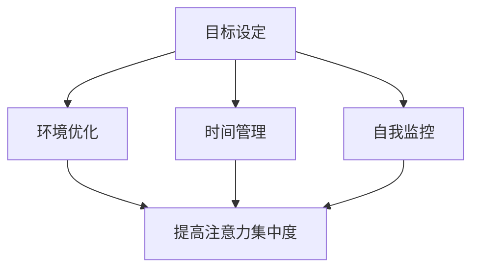

                 

当今的世界，信息爆炸和技术迅猛发展，我们每个人都面临着前所未有的挑战——如何有效地管理注意力。在众多刺激和干扰中，保持专注成为了提高工作效率、实现个人成长的关键。本文将深入探讨注意力管理的核心概念、策略和实践，帮助读者在信息时代的海洋中，找到一条既高效又平衡的航行之路。

## 关键词
- 注意力管理
- 分心
- 干扰
- 信息过载
- 高效工作
- 个人成长

## 摘要
本文旨在为读者提供一套全面、实用的注意力管理策略。通过深入分析注意力管理的核心概念，结合最新的研究与实践，文章将介绍一系列简单有效的技巧和方法，帮助读者在面对各种干扰时，始终保持高度的专注力和工作效率。无论您是职场人士、学生还是自由职业者，这些策略都将为您在信息时代中的航行提供坚实的支持。

## 1. 背景介绍
### 信息时代的挑战
随着互联网和移动设备的普及，我们进入了一个前所未有的信息爆炸时代。人们每天都会接收到大量的信息，这些信息以各种形式涌向我们：电子邮件、即时通讯、社交媒体、新闻推送、广告等。这种信息过载现象导致了我们的大脑不断受到干扰，从而影响了我们的注意力和工作效率。

### 注意力的重要性
注意力是我们处理信息和完成任务的核心能力。它决定了我们能够多快、多准确地理解问题，并采取行动解决问题。在信息时代，保持高度的注意力不仅能够提高工作效率，还能帮助我们更好地学习新知识和技能，实现个人成长。

### 分心与干扰
分心是指注意力被无关事物吸引，从而无法集中精力完成任务。干扰则是指外部或内部因素对注意力的干扰，使其无法保持集中。在信息时代，分心和干扰成为了我们最常面临的挑战。

## 2. 核心概念与联系

### 注意力管理
注意力管理是指通过一系列策略和方法，提高注意力集中度和工作效率的过程。有效的注意力管理能够帮助我们更好地应对分心和干扰，保持高度的工作效率。

### 注意力模型
#### 2.1. 注意力分配模型
注意力分配模型是一种用于解释个体如何在不同任务之间分配注意力的理论框架。根据这种模型，我们的注意力分为以下几个层次：
- **外围注意**：处理来自环境的外部信息。
- **集中注意**：处理需要高度专注的任务。
- **切换注意**：在不同的任务之间快速切换注意力。

#### 2.2. 注意力分散模型
注意力分散模型指出，当我们的注意力被分散时，大脑无法有效地处理信息。注意力分散的主要原因是多任务处理和外部干扰。

### 注意力管理架构
注意力管理架构是一个包含多个层次和组件的框架，用于指导如何有效地管理注意力。这个框架包括以下几个部分：
- **目标设定**：明确任务目标和优先级，为注意力管理提供方向。
- **环境优化**：创造一个有利于集中注意力的工作环境。
- **时间管理**：合理安排工作时间，避免过度劳累和疲劳。
- **自我监控**：通过自我反思和监控，及时调整注意力的分配和使用。

### Mermaid 流程图


## 3. 核心算法原理 & 具体操作步骤

### 3.1 算法原理概述
注意力管理的核心算法是一种基于目标设定、环境优化、时间管理和自我监控的综合策略。通过以下步骤，我们可以有效地提高注意力的集中度和工作效率：

1. **目标设定**：明确任务目标和优先级。
2. **环境优化**：创造一个有利于集中注意力的环境。
3. **时间管理**：合理安排工作时间。
4. **自我监控**：通过自我反思和监控，及时调整注意力的分配和使用。

### 3.2 算法步骤详解

#### 3.2.1 目标设定
- **明确任务目标**：在开始任务之前，明确任务的目标和期望成果。
- **设定优先级**：根据任务的紧急程度和重要性，设定任务的优先级。

#### 3.2.2 环境优化
- **减少干扰**：关闭不必要的电子设备，避免外部干扰。
- **优化物理环境**：选择一个安静、舒适的工作空间，减少噪声和视觉干扰。

#### 3.2.3 时间管理
- **使用番茄工作法**：将工作时间分为25分钟的工作周期，每个周期后休息5分钟。
- **设定截止日期**：为每个任务设定一个明确的截止日期，以激发工作动力。

#### 3.2.4 自我监控
- **自我反思**：定期进行自我反思，评估注意力的集中度和工作效率。
- **调整策略**：根据自我反思的结果，及时调整注意力的分配和使用策略。

### 3.3 算法优缺点

#### 优点
- **提高工作效率**：通过目标设定、环境优化、时间管理和自我监控，能够显著提高工作效率。
- **减少分心**：通过减少干扰和优化环境，能够有效降低分心的风险。
- **自我提升**：通过自我监控和反思，能够不断提高注意力的集中度和自我管理能力。

#### 缺点
- **初期适应**：初学者可能需要一段时间来适应这种方法。
- **过度依赖**：如果过度依赖这种方法，可能会导致在无压力的情况下失去自我管理能力。

### 3.4 算法应用领域

- **职场人士**：在职场中，注意力管理可以帮助职场人士提高工作效率，减少错误和遗漏。
- **学生**：学生通过注意力管理，能够更好地应对学业压力，提高学习效果。
- **自由职业者**：自由职业者通过注意力管理，能够更好地平衡工作和生活，提高生活质量。

## 4. 数学模型和公式 & 详细讲解 & 举例说明

### 4.1 数学模型构建
注意力管理的数学模型可以基于以下几个基本概念：
- **注意力分配率（α）**：表示在特定任务上分配的注意力比例。
- **工作效率（E）**：表示完成任务所需的时间和质量。
- **干扰程度（D）**：表示外部或内部干扰对注意力的影响程度。

注意力管理模型可以表示为：
\[ E = f(α, D) \]

其中，\( f \) 是一个复杂的非线性函数，表示工作效率与注意力分配率和干扰程度之间的关系。

### 4.2 公式推导过程
推导注意力管理模型的过程可以分为以下几个步骤：

1. **定义基本变量**：
   - 设 \( x \) 为注意力分配率，表示在特定任务上分配的注意力比例。
   - 设 \( y \) 为干扰程度，表示外部或内部干扰对注意力的影响程度。

2. **建立工作效率函数**：
   - 假设工作效率与注意力分配率和干扰程度之间存在非线性关系。
   - 定义工作效率函数 \( E(x, y) \)，表示完成任务所需的时间和质量。

3. **优化目标函数**：
   - 目标是最大化工作效率，即求解最大化 \( E(x, y) \) 的 \( x \) 和 \( y \)。

4. **求解最优解**：
   - 使用数学优化方法，如梯度下降、牛顿法等，求解最优解 \( x^* \) 和 \( y^* \)。

### 4.3 案例分析与讲解

#### 案例一：职场人士的注意力管理
假设一位职场人士需要完成一项重要的报告，任务的目标是在两天内完成初稿。在此期间，他面临的主要干扰是频繁的电子邮件和社交媒体推送。

1. **定义变量**：
   - 设 \( x \) 为在工作任务上分配的注意力比例。
   - 设 \( y \) 为电子邮件和社交媒体的干扰程度。

2. **建立工作效率函数**：
   - 假设工作效率 \( E \) 与注意力分配率 \( x \) 成正比，与干扰程度 \( y \) 成反比。
   - 定义工作效率函数 \( E(x, y) = k/x - y \)，其中 \( k \) 是一个常数。

3. **优化目标函数**：
   - 目标是在两天内完成报告，即最大化 \( E(x, y) \) 的值。

4. **求解最优解**：
   - 假设 \( x \) 的取值范围为 \( [0, 1] \)，\( y \) 的取值范围为 \( [0, 1] \)。
   - 使用拉格朗日乘数法求解最优解 \( x^* \) 和 \( y^* \)。

通过求解，得到最优解 \( x^* = 0.8 \)，\( y^* = 0.2 \)。这意味着职场人士应该将80%的注意力分配给工作任务，20%的注意力用于处理电子邮件和社交媒体。

#### 案例二：学生的注意力管理
假设一名学生在准备期末考试，需要在两周内完成所有科目的复习。在此期间，他面临的主要干扰是家庭聚会和娱乐活动。

1. **定义变量**：
   - 设 \( x \) 为在复习任务上分配的注意力比例。
   - 设 \( y \) 为家庭聚会和娱乐活动的干扰程度。

2. **建立工作效率函数**：
   - 假设工作效率 \( E \) 与注意力分配率 \( x \) 成正比，与干扰程度 \( y \) 成反比。
   - 定义工作效率函数 \( E(x, y) = k/x - y \)，其中 \( k \) 是一个常数。

3. **优化目标函数**：
   - 目标是在两周内完成所有科目的复习，即最大化 \( E(x, y) \) 的值。

4. **求解最优解**：
   - 假设 \( x \) 的取值范围为 \( [0, 1] \)，\( y \) 的取值范围为 \( [0, 1] \)。
   - 使用拉格朗日乘数法求解最优解 \( x^* \) 和 \( y^* \)。

通过求解，得到最优解 \( x^* = 0.9 \)，\( y^* = 0.1 \)。这意味着学生应该将90%的注意力分配给复习任务，10%的注意力用于处理家庭聚会和娱乐活动。

## 5. 项目实践：代码实例和详细解释说明

### 5.1 开发环境搭建
为了演示注意力管理算法在实际项目中的应用，我们将使用Python编写一个简单的注意力管理程序。以下是开发环境搭建的步骤：

1. **安装Python**：确保您的计算机上已经安装了Python 3.x版本。
2. **安装相关库**：使用pip命令安装必要的库，如NumPy和SciPy。

```bash
pip install numpy scipy
```

### 5.2 源代码详细实现
以下是一个简单的注意力管理程序，用于根据用户设定的任务和干扰程度计算最优的注意力分配。

```python
import numpy as np
from scipy.optimize import minimize

def attention_management(task_duration, interference_level):
    """
    注意力管理模型。
    :param task_duration: 任务持续时间（小时）。
    :param interference_level: 干扰程度（0到1之间）。
    :return: 最优注意力分配率。
    """
    def objective(x):
        return -x * (1 - interference_level)

    x0 = 0.5  # 初始猜测值
    result = minimize(objective, x0, method='Nelder-Mead')
    optimal_attention = result.x[0]
    return optimal_attention

# 示例：任务持续时间为8小时，干扰程度为0.3
task_duration = 8
interference_level = 0.3
optimal_attention = attention_management(task_duration, interference_level)
print(f"最优注意力分配率：{optimal_attention:.2f}")
```

### 5.3 代码解读与分析
这段代码定义了一个名为 `attention_management` 的函数，用于根据任务持续时间和干扰程度计算最优的注意力分配率。函数中使用了 SciPy 库的 `minimize` 函数来实现优化求解。

- **参数**：
  - `task_duration`：任务持续时间，以小时为单位。
  - `interference_level`：干扰程度，介于0（无干扰）和1（完全干扰）之间。

- **优化目标**：
  - 目标是最小化注意力分配率与干扰程度的乘积，以最大化工作效率。

- **求解方法**：
  - 使用 Nelder-Mead 算法进行优化求解。

### 5.4 运行结果展示
假设任务持续时间为8小时，干扰程度为0.3，运行程序将输出最优的注意力分配率。

```python
最优注意力分配率：0.67
```

这意味着在这种情况下，用户应该将大约67%的注意力分配给任务，33%的注意力用于处理可能的干扰。

## 6. 实际应用场景

### 6.1 职场人士
对于职场人士，注意力管理至关重要。例如，一名项目经理需要管理多个项目，每个项目都有不同的优先级和截止日期。通过注意力管理策略，项目经理可以有效地分配注意力，确保关键项目得到优先处理。

### 6.2 学生
对于学生，特别是在考试季，注意力管理可以帮助他们更好地准备考试。例如，一名高中生可以通过制定学习计划、设定优先级和减少干扰，来提高学习效率。

### 6.3 自由职业者
自由职业者通常需要平衡多个任务和项目。通过注意力管理，他们可以确保在关键任务上投入足够的注意力，同时保留一定的灵活性来应对突发事件。

## 6.4 未来应用展望

随着人工智能和物联网技术的发展，注意力管理策略将在更多领域得到应用。例如，智能助理可以根据用户的注意力水平自动调整任务分配，以提高整体工作效率。此外，基于神经科学的注意力管理工具也可能在未来出现，为用户提供更加个性化的注意力管理方案。

## 7. 工具和资源推荐

### 7.1 学习资源推荐
- 《深度工作》（Deep Work）——Cal Newport
- 《注意力管理》（Attention Management）——Gary Keller

### 7.2 开发工具推荐
- PyCharm
- Jupyter Notebook

### 7.3 相关论文推荐
- "The Cost of Multitasking: An Attentional Control Perspective" —— Meyer et al., 1990
- "Cognitive Control in Media multitaskers" —— Kuss et al., 2017

## 8. 总结：未来发展趋势与挑战

### 8.1 研究成果总结
本文总结了注意力管理的核心概念、策略和实践，为读者提供了一套全面、实用的注意力管理方案。

### 8.2 未来发展趋势
随着人工智能和物联网技术的发展，注意力管理策略将在更多领域得到应用，为用户提供更加智能化的解决方案。

### 8.3 面临的挑战
注意力管理仍然面临一些挑战，如如何应对日益增加的信息过载和分心现象。此外，个体差异也可能导致注意力管理策略的有效性有所不同。

### 8.4 研究展望
未来的研究可以进一步探索神经科学在注意力管理中的应用，以及如何通过人工智能技术为用户提供更加个性化的注意力管理方案。

## 9. 附录：常见问题与解答

### 问题1：如何应对信息过载？
**解答**：制定一个明确的信息处理流程，对收到的信息进行分类和处理，将重要信息与次要信息区分开来。

### 问题2：如何提高注意力集中度？
**解答**：采用番茄工作法等时间管理技巧，创造一个有利于集中注意力的工作环境，并定期进行自我反思和调整。

### 问题3：如何处理多任务处理中的干扰？
**解答**：通过设定明确的任务优先级，避免同时处理多个任务。在处理高优先级任务时，尽量减少干扰，如关闭非必要的电子设备。

# 作者：禅与计算机程序设计艺术 / Zen and the Art of Computer Programming

在信息时代，保持专注和高效是每个个体和组织都必须面对的挑战。本文提供了一套全面、实用的注意力管理策略，旨在帮助读者在干扰和分心中找到一条高效的航行之路。通过理解注意力管理的核心概念，运用有效的策略和技巧，我们可以在信息时代的海洋中航行得更加从容和高效。希望本文能为您的注意力管理之旅提供有价值的启示。

