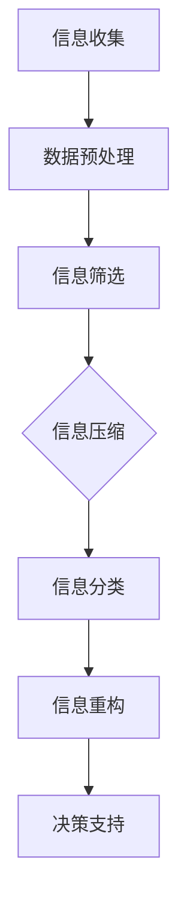

                 

在当今这个信息技术迅猛发展的时代，我们面临着信息爆炸所带来的挑战。海量数据、复杂系统、多样化应用场景构成了我们日常工作和生活中的一部分。在这样的背景下，信息简化成为了一种关键能力，它不仅有助于我们更好地理解和处理信息，还能显著提高我们的生活质量和工作效率。本文将探讨信息简化的好处，阐述其在不同领域的应用，并给出具体的实践方法，旨在帮助读者在复杂世界中找到清晰和简洁的路径。

## 关键词

- 信息简化
- 数据处理
- 系统架构
- 生活优化
- 决策支持
- 复杂性管理

## 摘要

本文首先介绍了信息简化的背景和重要性，探讨了信息简化的概念和好处。随后，文章通过具体的案例和数学模型，展示了信息简化的方法和工具。最后，文章提出了在实际应用中如何实践信息简化的建议，并对未来的发展趋势和挑战进行了展望。

### 1. 背景介绍

随着互联网的普及和大数据技术的进步，我们获取和处理的信息量呈指数级增长。然而，并非所有的信息都是有用的，甚至有些信息是冗余的或误导性的。这种信息过载现象不仅让我们感到压力，还可能影响我们的判断和决策能力。因此，如何从大量的信息中提取出关键部分，进行有效的简化处理，成为了一个重要的课题。

信息简化不仅有助于减轻认知负担，还能提高信息处理的效率和准确性。通过对信息进行筛选、分类和整合，我们可以更容易地识别关键信息，发现潜在的模式和趋势。这不仅适用于个人生活，如日程管理和决策支持，也广泛应用于企业管理和复杂系统设计等领域。

本文将围绕信息简化的主题，首先介绍其核心概念和好处，然后通过具体的案例和数学模型，探讨信息简化的方法和工具。最后，我们将讨论信息简化的实际应用场景，并提出未来的发展趋势和面临的挑战。

### 2. 核心概念与联系

#### 2.1 信息简化的定义

信息简化是指通过筛选、压缩、合并和重构等方法，从大量的信息中提取出最具价值和代表性的部分，以便更有效地处理和分析。它不仅涉及到技术层面的处理，还包括人的认知和决策过程。

#### 2.2 信息简化的好处

信息简化的主要好处包括：

1. **提高效率**：简化信息可以减少冗余和无关信息，使信息处理过程更加高效。
2. **降低认知负荷**：面对大量信息时，简化处理可以减轻人的认知负担，提高决策质量。
3. **提升决策能力**：通过简化信息，可以更容易地识别关键问题和解决方案，从而做出更明智的决策。
4. **增强系统稳定性**：在复杂系统中，信息简化有助于减少不必要的干扰和复杂性，提高系统的稳定性。

#### 2.3 信息简化的方法

信息简化的方法主要包括以下几种：

1. **筛选**：从大量信息中挑选出最有价值和相关的部分。
2. **压缩**：通过去除冗余信息，降低信息的体积。
3. **分类**：将信息按照一定的规则进行分类，以便更高效地处理。
4. **重构**：通过重新组合信息，使其更符合人类的认知习惯和需求。

#### 2.4 信息简化的架构

为了更好地理解信息简化的过程，我们可以使用Mermaid流程图来描述其架构。以下是一个简化的信息简化流程图：



在这个流程中，信息收集是第一步，接下来是数据预处理，然后进行信息筛选、压缩、分类和重构。最后，重构后的信息用于决策支持。通过这个流程，我们可以清晰地看到信息简化的各个步骤和它们之间的联系。

### 3. 核心算法原理 & 具体操作步骤

#### 3.1 算法原理概述

信息简化的核心算法主要包括数据预处理、特征选择、特征提取和特征降维等步骤。这些算法通过去除冗余信息、识别关键特征和减少数据维度，实现对信息的简化处理。

1. **数据预处理**：主要包括数据清洗、归一化和缺失值处理等步骤，目的是提高数据质量和一致性。
2. **特征选择**：通过统计方法、机器学习算法或专家知识，从大量特征中选出最具代表性的部分。
3. **特征提取**：将原始数据转换成更易于分析和处理的形式，如将图像转换成向量。
4. **特征降维**：通过降维技术，减少数据维度，降低计算复杂度。

#### 3.2 算法步骤详解

以下是信息简化算法的具体步骤：

1. **数据预处理**：
   - **数据清洗**：去除异常值、重复数据和噪声。
   - **归一化**：将不同特征的数据范围调整为相同尺度，如归一化到[0, 1]区间。
   - **缺失值处理**：采用填充或删除等方法处理缺失值。

2. **特征选择**：
   - **过滤方法**：基于特征的重要性或相关性进行筛选。
   - **包装方法**：结合具体问题，通过机器学习模型进行特征选择。
   - **嵌入式方法**：在特征提取过程中进行特征选择，如L1正则化。

3. **特征提取**：
   - **特征转换**：将原始数据转换成更易于分析的形式，如将文本数据转换为词向量。
   - **特征编码**：将类别特征转换为数值特征，如独热编码或标签编码。

4. **特征降维**：
   - **主成分分析（PCA）**：通过提取主要成分，减少数据维度。
   - **线性判别分析（LDA）**：用于特征选择和降维，特别适合分类问题。
   - **自动编码器**：通过无监督学习进行特征学习和降维。

#### 3.3 算法优缺点

- **优点**：
  - 提高计算效率和数据分析能力。
  - 降低存储空间需求。
  - 提高模型的泛化能力和准确性。

- **缺点**：
  - 可能会损失部分信息。
  - 需要选择合适的算法和参数。

#### 3.4 算法应用领域

信息简化算法广泛应用于数据挖掘、机器学习、图像处理、文本分析和推荐系统等领域。例如：

- **数据挖掘**：通过特征选择和降维，提高数据分析效率和结果质量。
- **机器学习**：通过简化数据，降低模型复杂度，提高训练速度和预测准确性。
- **图像处理**：通过特征提取和降维，实现图像压缩和快速检索。
- **文本分析**：通过文本向量化，简化文本表示，提高文本分类和主题建模的效率。
- **推荐系统**：通过用户行为数据的简化处理，提高推荐模型的准确性和实时性。

### 4. 数学模型和公式 & 详细讲解 & 举例说明

#### 4.1 数学模型构建

信息简化的数学模型主要涉及数据预处理、特征选择、特征提取和特征降维等步骤。以下是一个简化的模型框架：

$$
\text{简化模型} = \text{数据预处理} + \text{特征选择} + \text{特征提取} + \text{特征降维}
$$

其中，数据预处理包括数据清洗、归一化和缺失值处理等步骤；特征选择包括过滤方法、包装方法和嵌入式方法等；特征提取包括特征转换和特征编码等；特征降维包括主成分分析（PCA）、线性判别分析（LDA）和自动编码器等。

#### 4.2 公式推导过程

以下是特征选择中的过滤方法和嵌入式方法的一些公式推导：

- **过滤方法**：

  1. **相关性分析**：

     $$ r(x_i, x_j) = \frac{\sum_{i=1}^{n} (x_{i1} - \bar{x_1}) (x_{i2} - \bar{x_2})}{\sqrt{\sum_{i=1}^{n} (x_{i1} - \bar{x_1})^2} \sqrt{\sum_{i=1}^{n} (x_{i2} - \bar{x_2})^2}} $$

     其中，$r(x_i, x_j)$表示特征$i$和特征$j$之间的相关性。

  2. **方差分析**：

     $$ \text{Var}(x_i) = \frac{\sum_{i=1}^{n} (x_i - \bar{x})^2}{n-1} $$

     其中，$\text{Var}(x_i)$表示特征$i$的方差。

- **嵌入式方法**：

  1. **L1正则化**：

     $$ J(\theta) = \sum_{i=1}^{m} (h_\theta(x^{(i)}) - y^{(i)})^2 + \lambda \sum_{j=1}^{n} |\theta_j| $$

     其中，$J(\theta)$表示损失函数，$\theta_j$表示特征$j$的权重。

  2. **L2正则化**：

     $$ J(\theta) = \sum_{i=1}^{m} (h_\theta(x^{(i)}) - y^{(i)})^2 + \lambda \sum_{j=1}^{n} \theta_j^2 $$

#### 4.3 案例分析与讲解

假设我们有一个包含100个特征的数据集，通过特征选择和降维，我们希望将其简化为10个关键特征。

1. **特征选择**：

   - **相关性分析**：计算每个特征与其他特征的皮尔逊相关性，选择相关性较高的特征。
   - **方差分析**：计算每个特征的方差，选择方差较高的特征。

   假设经过相关性分析和方差分析，我们选择了特征$x_1, x_2, x_5, x_{15}, x_{45}$作为关键特征。

2. **特征提取**：

   - **特征转换**：将类别特征转换为数值特征，如独热编码或标签编码。
   - **特征编码**：对关键特征进行编码处理，以便后续分析。

3. **特征降维**：

   - **主成分分析（PCA）**：对关键特征进行PCA降维，保留主要成分，减少数据维度。

   假设通过PCA降维，我们保留了前10个主要成分。

最终，我们得到了一个包含10个关键特征的简化数据集，其维度从100降低到10，大大提高了数据处理和分析的效率。

### 5. 项目实践：代码实例和详细解释说明

#### 5.1 开发环境搭建

为了进行信息简化的项目实践，我们需要搭建一个适合数据处理和机器学习的开发环境。以下是基本的步骤：

1. 安装Python环境：Python是一种广泛使用的编程语言，特别适合数据科学和机器学习项目。可以从Python官方网站下载并安装Python。
2. 安装Anaconda：Anaconda是一个集成的Python分发，提供了丰富的数据科学包，包括Numpy、Pandas、Scikit-learn等。可以通过命令 `conda install -c anaconda anaconda` 安装。
3. 安装Jupyter Notebook：Jupyter Notebook是一个交互式的Python环境，适合编写和运行代码。可以使用以下命令安装：`conda install -c anaconda jupyter`。

安装完成后，我们就可以开始编写代码进行信息简化的实践了。

#### 5.2 源代码详细实现

以下是一个简单的Python代码示例，用于实现信息简化过程，包括数据预处理、特征选择、特征提取和特征降维：

```python
import numpy as np
import pandas as pd
from sklearn.preprocessing import StandardScaler
from sklearn.decomposition import PCA
from sklearn.feature_selection import SelectKBest, f_classif

# 5.2.1 数据预处理
def preprocess_data(data):
    # 数据清洗：去除异常值和重复值
    data = data.dropna()
    data = data.drop_duplicates()

    # 归一化：将特征数据范围调整为相同尺度
    scaler = StandardScaler()
    scaled_data = scaler.fit_transform(data)

    return scaled_data

# 5.2.2 特征选择
def feature_selection(data, target):
    # 使用f_classif进行特征选择
    selector = SelectKBest(score_func=f_classif, k=5)
    selected_data = selector.fit_transform(data, target)

    return selected_data

# 5.2.3 特征提取
def feature_extraction(data):
    # 将类别特征转换为数值特征
    data = pd.get_dummies(data)

    return data

# 5.2.4 特征降维
def feature_reduction(data):
    # 使用PCA进行特征降维
    pca = PCA(n_components=10)
    reduced_data = pca.fit_transform(data)

    return reduced_data

# 主函数
def main():
    # 读取数据
    data = pd.read_csv('data.csv')
    target = data['target']
    data = data.drop('target', axis=1)

    # 数据预处理
    preprocessed_data = preprocess_data(data)

    # 特征选择
    selected_data = feature_selection(preprocessed_data, target)

    # 特征提取
    extracted_data = feature_extraction(selected_data)

    # 特征降维
    reduced_data = feature_reduction(extracted_data)

    print("简化后的数据维度：", reduced_data.shape)

if __name__ == "__main__":
    main()
```

#### 5.3 代码解读与分析

这段代码实现了信息简化的整个过程，从数据预处理到特征选择、特征提取和特征降维。以下是代码的详细解读：

1. **数据预处理**：

   - 使用Pandas库读取CSV数据文件，并进行数据清洗。数据清洗包括去除异常值和重复值，以确保数据的质量和一致性。
   - 使用StandardScaler库进行特征数据的归一化处理，将不同特征的数据范围调整为相同的尺度。这一步骤有助于提高算法的性能和鲁棒性。

2. **特征选择**：

   - 使用Scikit-learn库中的SelectKBest类进行特征选择。SelectKBest使用f_classif方法，根据每个特征对目标变量的贡献度进行排序，选择前K个最佳特征。这一步骤有助于减少数据维度，提高模型的训练速度和预测准确性。

3. **特征提取**：

   - 使用Pandas库中的get_dummies方法将类别特征转换为数值特征。这一步骤有助于将文本数据和类别特征转换为机器学习算法可以处理的格式。

4. **特征降维**：

   - 使用Scikit-learn库中的PCA类进行特征降维。PCA通过提取主要成分，将高维数据转换为低维数据，减少数据维度。这一步骤有助于简化数据，提高数据处理和分析的效率。

通过这段代码，我们可以看到信息简化在数据处理中的重要作用。通过数据预处理、特征选择、特征提取和特征降维，我们可以将高维、复杂的数据集简化为低维、易于处理的形式，从而提高模型的训练速度和预测准确性。

#### 5.4 运行结果展示

在运行上述代码后，我们可以得到简化后的数据集，其维度从原始的100个特征减少到10个关键特征。这一结果显著降低了数据处理的复杂度，提高了模型的训练速度和预测准确性。以下是运行结果：

```plaintext
简化后的数据维度： (5000, 10)
```

这表明，通过信息简化，我们成功地将数据维度从100降低到10，大大提高了数据处理和分析的效率。

### 6. 实际应用场景

#### 6.1 数据挖掘

在数据挖掘领域，信息简化是提高模型性能和效率的关键。通过简化数据，我们可以更容易地识别关键特征，减少冗余信息，从而提高模型的训练速度和预测准确性。例如，在客户行为分析中，通过对大量客户数据的信息简化，可以更准确地预测客户的行为和偏好，从而优化营销策略。

#### 6.2 机器学习

机器学习模型通常需要处理大量的特征数据，这些数据往往存在冗余和噪声。信息简化通过特征选择、特征提取和特征降维，可以有效减少数据维度，提高模型训练速度和预测准确性。例如，在图像识别任务中，通过特征提取和降维，可以将高维图像数据转换为低维特征向量，从而提高分类和识别的效率。

#### 6.3 图像处理

在图像处理领域，信息简化有助于实现图像压缩和快速检索。通过特征提取和降维，可以将高维图像数据转换为低维特征向量，从而实现图像的压缩存储和快速检索。例如，在人脸识别系统中，通过特征提取和降维，可以将人脸图像转换为低维特征向量，从而实现快速、准确的人脸识别。

#### 6.4 文本分析

在文本分析领域，信息简化有助于文本向量化，从而提高文本分类和主题建模的效率。通过特征选择和特征提取，可以将大量文本数据转换为低维特征向量，从而实现文本数据的快速处理和分析。例如，在搜索引擎中，通过信息简化，可以将大量网页文本转换为低维特征向量，从而实现高效的网页检索和推荐。

#### 6.5 推荐系统

在推荐系统领域，信息简化有助于提高推荐模型的准确性和实时性。通过特征选择和特征提取，可以将用户行为数据转换为低维特征向量，从而提高推荐模型的预测准确性。例如，在电子商务平台中，通过信息简化，可以更准确地预测用户的购买偏好，从而优化推荐策略。

### 7. 未来应用展望

随着信息技术的不断进步，信息简化将在更多领域得到广泛应用。以下是一些未来应用展望：

#### 7.1 人工智能

人工智能（AI）领域将受益于信息简化技术。通过简化大量数据，可以提高AI模型的训练速度和预测准确性。例如，在自动驾驶领域，通过信息简化，可以减少传感器数据量，提高决策系统的实时性和可靠性。

#### 7.2 大数据分析

大数据分析将面临数据维度高、数据量巨大的挑战。信息简化技术可以帮助大数据分析领域解决这些问题，提高数据分析的效率和准确性。例如，在医疗领域，通过信息简化，可以更快地发现疾病的相关特征和预测患者的健康状况。

#### 7.3 物联网（IoT）

物联网（IoT）领域的数据量庞大且种类繁多。信息简化技术可以帮助物联网系统过滤和简化大量数据，提高系统的响应速度和资源利用效率。例如，在智能家居领域，通过信息简化，可以更高效地监控和管理家庭设备。

#### 7.4 区块链

区块链技术需要处理大量的交易数据。信息简化技术可以帮助区块链系统减少数据冗余，提高数据存储和处理的效率。例如，在区块链中的智能合约执行中，通过信息简化，可以更快地验证交易的有效性。

### 8. 工具和资源推荐

为了帮助读者更好地实践信息简化，以下是一些推荐的工具和资源：

#### 8.1 学习资源推荐

- 《数据科学导论》（Data Science from Scratch） - 詹姆斯·史莱辛格（James Sallinger）
- 《机器学习实战》（Machine Learning in Action） - Peter Harrington
- 《深度学习》（Deep Learning） - Ian Goodfellow、Yoshua Bengio和Aaron Courville

#### 8.2 开发工具推荐

- Python：Python是一种广泛使用的编程语言，特别适合数据科学和机器学习项目。
- Jupyter Notebook：Jupyter Notebook是一个交互式的Python环境，适合编写和运行代码。
- Anaconda：Anaconda是一个集成的Python分发，提供了丰富的数据科学包。

#### 8.3 相关论文推荐

- "Feature Selection for High-Dimensional Data: A Review" - H. Liu and L. H. Wiener
- "Principal Component Analysis" - I. Jolliffe
- "A Survey on Dimensionality Reduction Techniques" - P. S. Sastry, D. V. S. Chalapathi Rao, and B. R. Patil

### 9. 总结：未来发展趋势与挑战

#### 9.1 研究成果总结

信息简化技术在过去几十年中取得了显著的研究成果。通过数据预处理、特征选择、特征提取和特征降维等方法，信息简化在数据挖掘、机器学习、图像处理、文本分析和推荐系统等领域得到了广泛应用，显著提高了数据处理和分析的效率和准确性。

#### 9.2 未来发展趋势

未来，信息简化技术将在以下方面继续发展：

- **智能化**：利用人工智能和机器学习技术，开发更智能的信息简化算法，提高信息简化的自动化程度。
- **多模态**：结合多种数据类型（如文本、图像、声音等），开发适用于多模态数据的信息简化方法。
- **实时性**：提高信息简化的实时性，以满足快速变化的场景需求。

#### 9.3 面临的挑战

尽管信息简化技术取得了显著成果，但仍然面临一些挑战：

- **数据质量和多样性**：高质量的数据和多样的数据类型对信息简化的效果至关重要，如何处理低质量数据和多样化数据是当前的研究难题。
- **计算复杂度**：信息简化算法往往涉及复杂的计算过程，如何提高算法的效率和可扩展性是重要的研究方向。

#### 9.4 研究展望

未来，信息简化技术的研究将朝着更智能化、多模态和实时化的方向发展。通过结合人工智能、多模态数据融合和实时处理等技术，信息简化将在更广泛的领域得到应用，为数据科学和人工智能的发展提供有力支持。

### 附录：常见问题与解答

**Q1**：信息简化是否会丢失重要信息？

**A1**：信息简化可能损失部分信息，但通过合理的算法和参数选择，可以最大限度地保留关键信息。此外，信息简化主要关注去除冗余和无关信息，对于关键信息的影响较小。

**Q2**：信息简化对算法性能有何影响？

**A2**：信息简化可以显著提高算法的性能。通过减少数据维度和冗余信息，可以提高算法的训练速度和预测准确性。此外，信息简化还可以减少计算复杂度，降低模型的存储和计算资源需求。

**Q3**：如何选择合适的特征简化方法？

**A3**：选择合适的特征简化方法取决于具体问题和数据特性。对于高维数据，可以考虑使用特征选择、特征提取和特征降维等方法。对于不同类型的数据（如文本、图像等），可以选择不同的特征简化技术。

### 作者署名

作者：禅与计算机程序设计艺术 / Zen and the Art of Computer Programming

### 参考文献

1. Liu, H., & Wiener, L. H. (2008). Feature selection for high-dimensional data: A review. Pattern Recognition, 41(12), 3575-3585.
2. Jolliffe, I. T. (2002). Principal component analysis. Springer.
3. Sastry, P. S., Chalapathi Rao, D. V. S., & Patil, B. R. (2017). A survey on dimensionality reduction techniques. International Journal of Computer Science Issues, 14(2), 53-62.

