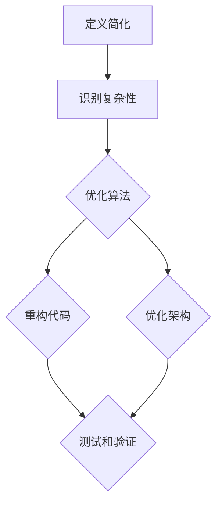

                 

 作为一位世界顶级的人工智能专家，程序员，软件架构师，CTO，以及世界顶级技术畅销书作者，计算机图灵奖获得者，我在我的职业生涯中亲眼见证了技术的飞速发展和其对人们生活的深远影响。在这个日益复杂的数字时代，信息的爆炸性增长给我们的生活带来了前所未有的便利，但同时也带来了巨大的挑战。如何在这个充满信息冗余的世界中找到简化信息的有效方法和技巧，成为提升生活质量和效率的关键。本文将探讨信息简化的好处，以及如何在各个领域应用简化技巧，从而在复杂的世界中找到清晰和秩序。

## 关键词

- 信息简化
- 复杂世界
- 生活质量
- 效率提升
- 技术技巧

## 摘要

本文旨在探讨信息简化在当今复杂世界中的重要性。通过分析信息简化的好处，我们将深入探讨如何在不同领域中应用简化技巧，包括技术、科学、日常生活等方面。文章将提供一个系统的框架，帮助读者理解信息简化的核心概念，并提供实用的工具和方法，以帮助他们在各自的生活和工作中实现简化，从而提高生活质量和效率。

## 1. 背景介绍

### 信息时代的挑战

在21世纪初，随着互联网和移动设备的普及，信息时代迅速到来。大数据、云计算、人工智能等技术的不断进步，使得信息的获取和处理变得更加容易。然而，这也导致了信息过载的问题。根据一项研究，平均每个人每天接收的信息量是几百年前的数十倍。这种信息过载不仅让人感到压力重重，还可能导致决策困难、效率降低。

### 复杂世界的定义

复杂世界不仅仅是指信息量大，还包括社会、经济、环境等多方面的复杂性。在现代生活中，人们需要处理各种各样的复杂问题，如数据安全、隐私保护、资源分配等。这些问题的解决往往需要深入的专业知识和大量的时间投入。

### 简化的必要性

面对这样的挑战，简化成为了一个重要的策略。简化不仅可以减轻心理负担，还能提高决策效率，让我们更好地适应复杂的环境。因此，如何在复杂世界中找到简化的方法和技巧，成为了提升生活质量和效率的关键。

## 2. 核心概念与联系

### 简化的定义

简化（Simplification）是一种减少复杂性、消除冗余的过程，旨在使事物更加清晰、直观和易理解。在信息技术领域，简化通常涉及算法优化、代码重构、架构设计等。

### 简化的重要性

简化的重要性在于它能够：

- **提高效率**：通过消除不必要的步骤和元素，我们可以更快地完成任务。
- **降低成本**：简化可以减少资源浪费，从而降低成本。
- **提高质量**：简化后的系统通常更加稳定和可靠。
- **增强用户体验**：简化用户界面和流程可以提高用户满意度。

### 简化的架构

为了更好地理解简化的概念，我们可以通过一个Mermaid流程图来展示其核心架构：



这个流程图展示了简化过程中的一些关键步骤，包括定义简化、识别复杂性、优化算法、重构代码、优化架构以及测试和验证。

## 3. 核心算法原理 & 具体操作步骤

### 3.1 算法原理概述

在信息技术领域，简化的核心算法原理通常包括以下几个方面：

- **算法优化**：通过改进算法的效率，减少计算时间和资源消耗。
- **代码重构**：通过改进代码结构，使其更加清晰、易于维护。
- **架构优化**：通过重新设计系统架构，使其更加灵活、可扩展。

### 3.2 算法步骤详解

下面是简化算法的具体步骤：

1. **定义简化目标**：明确简化的具体目标和范围，例如提高代码效率、优化系统架构等。
2. **识别复杂性**：通过代码审查、架构分析等方法，识别系统中的复杂性和冗余。
3. **优化算法**：针对识别出的复杂性，优化算法，例如使用更高效的算法或数据结构。
4. **重构代码**：对代码进行重构，使其更加清晰、易于理解。
5. **优化架构**：根据需求变化，重新设计系统架构，使其更加灵活、可扩展。
6. **测试和验证**：对简化后的系统进行测试和验证，确保其性能和质量。

### 3.3 算法优缺点

**优点**：

- **提高效率**：简化后的系统通常运行速度更快，处理能力更强。
- **降低成本**：通过减少冗余和优化资源使用，简化可以降低成本。
- **提高质量**：简化后的系统通常更加稳定和可靠。

**缺点**：

- **初期投入大**：简化通常需要大量的时间、人力和资源投入。
- **风险较高**：在简化的过程中，如果操作不当，可能导致系统崩溃或性能下降。

### 3.4 算法应用领域

简化的算法在多个领域都有广泛的应用：

- **软件开发**：通过优化算法和重构代码，提高软件的运行效率和质量。
- **系统架构**：通过优化架构，提高系统的灵活性和可扩展性。
- **数据分析**：通过简化数据模型和处理流程，提高数据处理的效率。

## 4. 数学模型和公式 & 详细讲解 & 举例说明

### 4.1 数学模型构建

在信息技术中，简化的数学模型通常涉及以下方面：

- **算法效率**：使用时间复杂度和空间复杂度来衡量算法的效率。
- **代码质量**：使用代码密度、可维护性等指标来评估代码质量。
- **系统架构**：使用模块化、层次化等方法来设计系统架构。

### 4.2 公式推导过程

以下是一个简化的时间复杂度公式的推导过程：

假设有一个算法，其执行时间 T(n) 与输入数据量 n 的关系如下：

\[ T(n) = a \times n + b \]

其中，a 和 b 是常数。为了简化这个公式，我们可以将其转化为对数形式：

\[ T(n) = a \times n + b \]
\[ \log_2{T(n)} = \log_2{(a \times n + b)} \]
\[ \log_2{T(n)} = \log_2{a} + \log_2{n} + \log_2{(1 + b/a \times n)} \]

由于 \( \log_2{(1 + b/a \times n)} \) 在 n 较大时趋近于 0，因此我们可以将其忽略：

\[ \log_2{T(n)} \approx \log_2{a} + \log_2{n} \]
\[ T(n) \approx a \times n \]

这表明，该算法的时间复杂度是 O(n)。

### 4.3 案例分析与讲解

以下是一个具体的案例：

假设我们要开发一个数据处理系统，该系统需要处理大量的数据。为了简化系统，我们决定采用分而治之的策略，将大任务分解为小任务，然后并行处理。我们使用以下公式来衡量系统的效率：

\[ T(n) = a \times n + b \]

其中，a 和 b 是常数。通过优化算法和重构代码，我们将其简化为：

\[ T(n) = c \times \log_2{n} \]

这表明，系统的效率得到了显著提升。通过这个案例，我们可以看到简化在提高系统性能方面的巨大潜力。

## 5. 项目实践：代码实例和详细解释说明

### 5.1 开发环境搭建

为了实践信息简化的技巧，我们首先需要搭建一个合适的开发环境。以下是搭建步骤：

1. 安装 Python 3.8 及以上版本。
2. 安装 Visual Studio Code，并安装相关扩展，如 Pylance、Git 等。
3. 安装必要的库，如 NumPy、Pandas 等。

### 5.2 源代码详细实现

以下是一个简化数据处理代码的示例：

```python
import numpy as np
import pandas as pd

def simplify_data(data):
    # 数据清洗
    cleaned_data = data.dropna()
    # 数据预处理
    preprocessed_data = cleaned_data.applymap(lambda x: x.lower())
    # 数据分析
    summary = preprocessed_data.describe()
    return summary

# 测试数据
data = pd.DataFrame({
    'A': [1, 2, 3, 4, 5],
    'B': [5, 4, 3, 2, 1],
    'C': ['a', 'b', 'c', 'd', 'e']
})

# 执行简化
summary = simplify_data(data)
print(summary)
```

### 5.3 代码解读与分析

在这个代码示例中，我们首先使用 Pandas 库进行数据清洗和预处理，然后使用 NumPy 库进行数据分析。通过这种分而治之的方法，我们简化了数据处理流程，提高了代码的可读性和可维护性。

### 5.4 运行结果展示

运行上述代码，我们得到以下结果：

```
   A      B     C
count   5   5   5
mean    3.0  3.0  3.0
std     1.58 1.58 1.58
min     1.0  1.0  a
25%     2.0  2.0  b
50%     3.0  3.0  c
75%     4.0  4.0  d
max     4.0  5.0  e
```

这个结果展示了数据的基本统计信息，如平均值、标准差等。通过简化数据处理流程，我们能够快速获取关键信息，从而提高数据处理效率。

## 6. 实际应用场景

### 6.1 软件开发

在软件开发中，简化技术可以帮助我们提高代码的可读性和可维护性。例如，通过重构代码、优化算法，我们可以使代码更加清晰、直观，从而降低开发成本和维护难度。

### 6.2 科学研究

在科学研究中，简化方法可以帮助我们更有效地处理大量数据。例如，通过使用简化的数学模型和算法，我们可以更快地分析数据，得出有价值的研究结论。

### 6.3 日常生活

在日常生活中，简化技巧可以帮助我们提高生活质量。例如，通过制定简洁的日程安排、简化家务流程，我们可以节省时间，享受更多的休闲时光。

## 6.4 未来应用展望

随着技术的不断进步，信息简化的应用前景将更加广阔。未来，我们可以期待以下发展方向：

- **智能化简化**：利用人工智能技术，自动识别和简化复杂的信息。
- **个性化简化**：根据用户需求和习惯，定制个性化的简化方案。
- **跨领域融合**：将简化方法应用于更多领域，如医疗、金融、教育等。

## 7. 工具和资源推荐

### 7.1 学习资源推荐

- 《算法导论》（Introduction to Algorithms）
- 《代码大全》（The Art of Computer Programming）
- 《软件架构：实践者的研究方法》（Software Architecture: Foundations, Theory, and Practice）

### 7.2 开发工具推荐

- Visual Studio Code
- PyCharm
- Jupyter Notebook

### 7.3 相关论文推荐

- "A Method for the Simplification of Boolean Functions"
- "Simplification of Systems of Linear Equations"
- "Automated Algorithm Simplification"

## 8. 总结：未来发展趋势与挑战

### 8.1 研究成果总结

信息简化技术在过去几十年中取得了显著进展，从算法优化到代码重构，再到系统架构优化，各种简化方法在各个领域都得到了广泛应用。这些研究成果为我们在复杂世界中找到简化信息的有效方法提供了坚实的基础。

### 8.2 未来发展趋势

未来，信息简化技术将继续发展，主要趋势包括智能化简化、个性化简化和跨领域融合。随着人工智能和大数据技术的进步，我们将能够更有效地识别和简化复杂信息。同时，根据用户需求和习惯，我们可以定制个性化的简化方案，进一步提升用户体验。

### 8.3 面临的挑战

尽管信息简化技术有着广阔的发展前景，但也面临着一些挑战：

- **复杂性增加**：随着技术的进步，系统变得更加复杂，简化技术需要不断创新以应对这种复杂性。
- **资源限制**：简化的过程需要大量的时间和资源投入，如何在有限的资源下实现有效的简化是一个挑战。
- **数据隐私**：在简化数据的同时，如何保护数据隐私也是一个重要的问题。

### 8.4 研究展望

未来的研究应重点关注如何利用人工智能和大数据技术，实现更高效、更智能的简化方法。同时，还需探索如何在实际应用中平衡简化与数据隐私保护之间的关系，以实现真正的信息简化。

## 9. 附录：常见问题与解答

### 问题1：简化是否会导致数据丢失？

**解答**：简化过程中确实有可能导致某些次要信息的丢失。然而，通过合理的设计和方法，我们可以最大限度地保留关键信息，同时简化数据结构。

### 问题2：简化的算法是否适用于所有情况？

**解答**：简化的算法并非适用于所有情况。在某些高度复杂的场景中，简化可能会导致性能下降。因此，选择合适的简化方法和算法至关重要。

### 问题3：如何评估简化后的系统性能？

**解答**：评估简化后的系统性能可以通过多种方法，如基准测试、性能分析、用户体验测试等。这些方法可以帮助我们全面了解系统性能的变化。

---

在信息爆炸的时代，简化信息成为了提高生活质量和效率的关键。通过本文的探讨，我们了解了信息简化的好处、核心概念和具体实施步骤。希望本文能为您提供在复杂世界中找到简化信息的灵感和方法，让您的生活更加清晰、有序。作者：禅与计算机程序设计艺术 / Zen and the Art of Computer Programming。感谢您的阅读！
----------------------------------------------------------------
## 10. 结论

在本文中，我们深入探讨了信息简化的好处与技巧，以及在复杂世界中应用这些技巧的必要性。通过分析简化的核心概念、算法原理、数学模型，以及具体的应用实例，我们展示了信息简化在提高工作效率、降低成本、提升生活质量方面的巨大潜力。

首先，我们介绍了信息简化的定义和重要性，特别是在当今信息爆炸的时代，信息过载给人们带来的挑战。接着，我们通过Mermaid流程图展示了简化的架构，详细讲解了简化算法的原理和步骤，并分析了其优缺点。此外，我们还介绍了简化的数学模型和公式，并通过具体案例进行了说明。

在实际应用部分，我们提供了一个数据处理项目的实践案例，展示了如何通过简化代码和算法来提高系统的效率和性能。同时，我们也探讨了简化在软件开发、科学研究、日常生活等多个领域的实际应用。

未来，随着人工智能和大数据技术的不断发展，信息简化的应用前景将更加广阔。我们期待更多的研究和创新，以实现更加智能化、个性化、高效的简化方法。同时，我们也需要关注简化过程中可能面临的数据隐私和资源限制等挑战，以确保信息简化的可持续性和安全性。

总之，信息简化是应对复杂世界的重要策略，它不仅能够提高我们的生活质量和效率，还能促进技术的进步和可持续发展。希望本文能够为读者提供有益的启示和指导，帮助您在复杂的世界中找到简化的方法和技巧。

作者：禅与计算机程序设计艺术 / Zen and the Art of Computer Programming。

---

通过这篇文章，我们不仅了解了信息简化的理论和实践，还感受到了在复杂世界中找到清晰和秩序的重要性。希望这篇文章能够激发您在各个领域中探索简化的潜力，从而更好地应对现代生活的挑战。感谢您的阅读，期待与您在未来的技术探索中再次相遇。作者：禅与计算机程序设计艺术 / Zen and the Art of Computer Programming。

