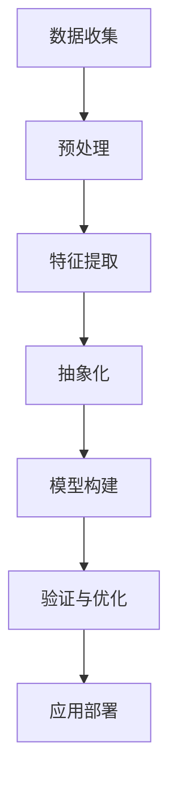
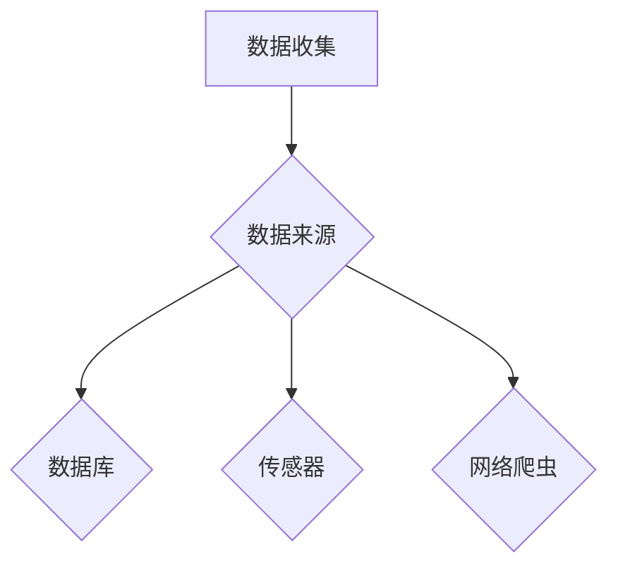
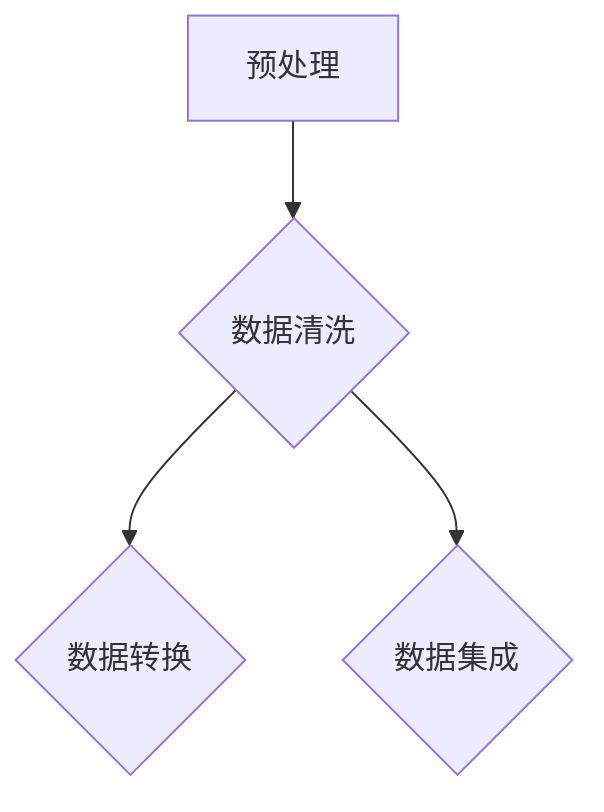
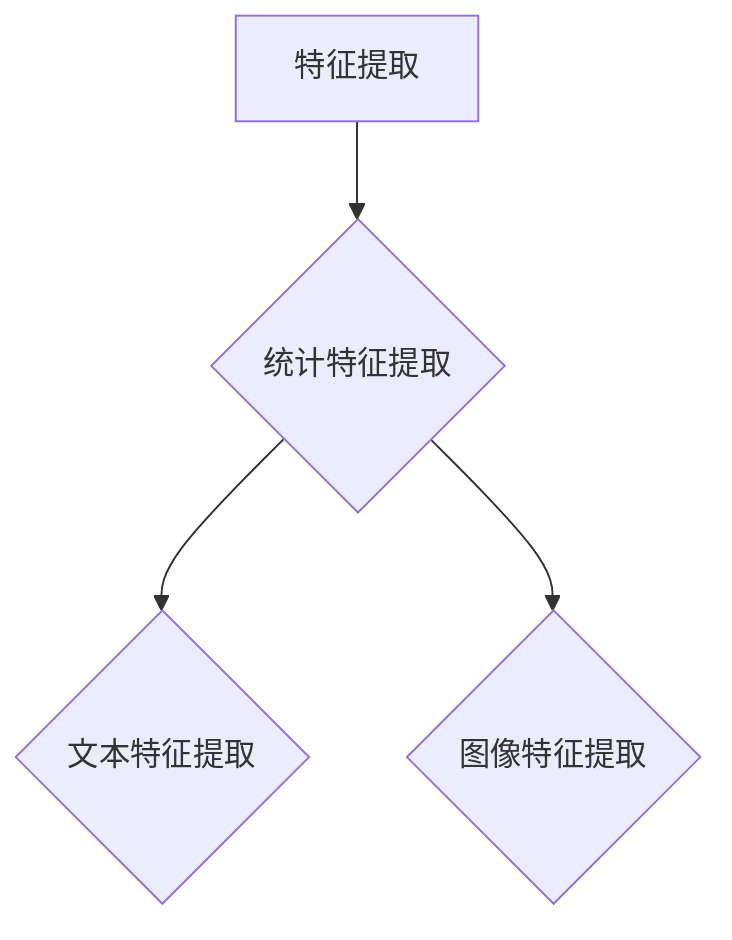
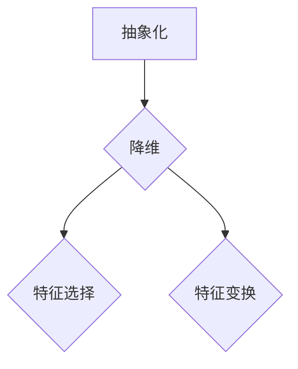
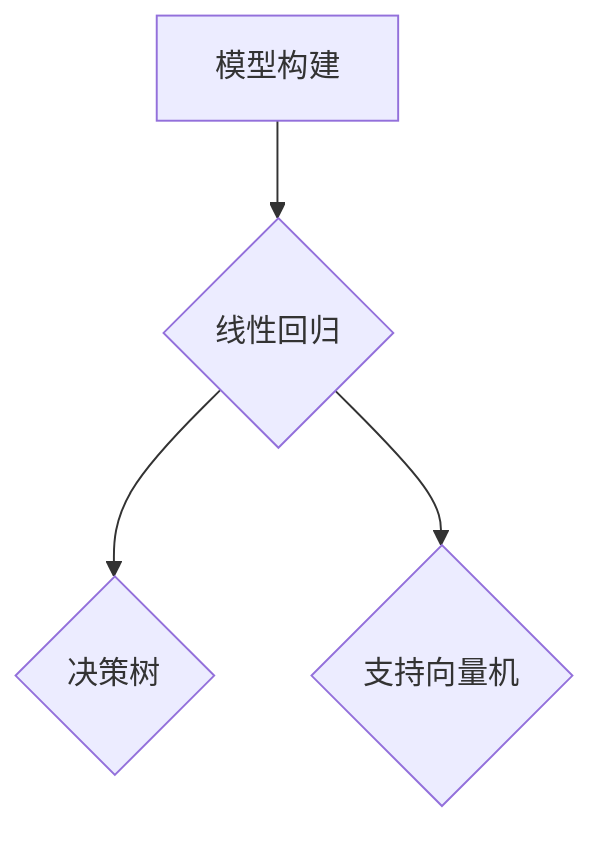
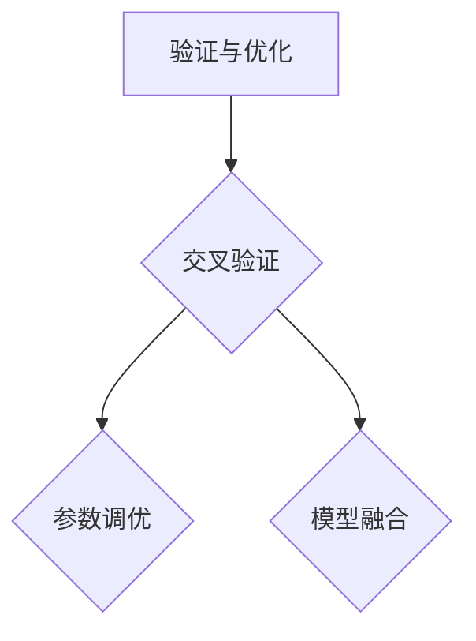
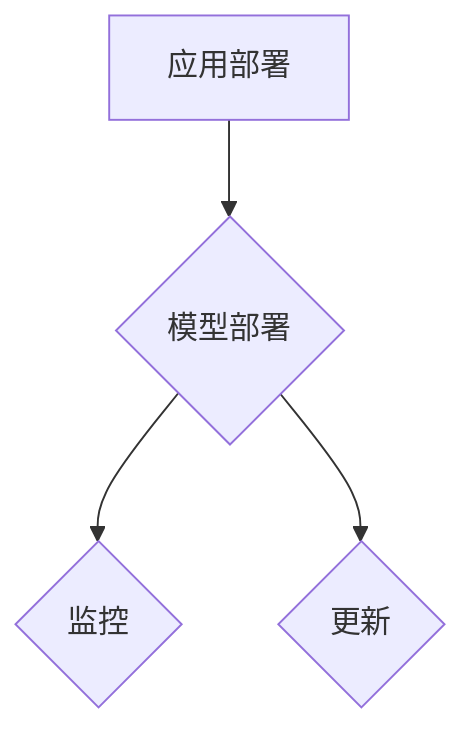

                 

关键词：信息简化，复杂性，抽象，算法，数学模型，代码实例，实际应用，工具资源，未来展望

> 摘要：本文深入探讨了信息简化的艺术与科学，通过分析其在现代技术中的重要性，阐述了信息简化的好处和挑战。从核心概念、算法原理到实际应用，本文全面展示了简化复杂性的重要性，并提出了未来发展的趋势与挑战。希望通过本文，读者能更好地理解信息简化在技术领域的广泛应用及其深远影响。

## 1. 背景介绍

在信息爆炸的时代，我们面临着日益复杂的系统、算法和模型。信息简化作为一种解决复杂性的手段，已经成为了现代技术发展的关键。从计算机编程到数据科学，从人工智能到系统架构，信息简化无处不在。它不仅能够帮助我们将复杂的任务分解成易于管理的部分，还能够提高系统的可维护性和可扩展性。

然而，信息简化并非一帆风顺。在追求简化的过程中，我们常常需要面对各种挑战，如抽象层次的取舍、冗余信息的处理、系统性能的权衡等。因此，理解信息简化的好处与挑战，掌握其艺术与科学，对于技术从业者来说至关重要。

本文将围绕以下主题展开讨论：

1. **核心概念与联系**：介绍信息简化的核心概念和原理，并通过Mermaid流程图展示其架构。
2. **核心算法原理 & 具体操作步骤**：详细解析信息简化的算法原理，并分步骤介绍其实施方法。
3. **数学模型和公式**：阐述信息简化过程中的数学模型和公式，并通过案例进行说明。
4. **项目实践：代码实例和详细解释说明**：提供实际代码实例，展示信息简化的应用。
5. **实际应用场景**：探讨信息简化在不同领域的实际应用。
6. **未来应用展望**：预测信息简化在未来的发展趋势和潜在应用。
7. **工具和资源推荐**：推荐学习资源和开发工具。
8. **总结：未来发展趋势与挑战**：总结研究成果，探讨未来发展方向。

让我们首先来探讨信息简化的核心概念和原理。

## 2. 核心概念与联系

### 2.1. 定义

信息简化是指通过抽象、归纳和模型化等手段，将复杂的信息结构转化为更简洁、更易于理解的形式。它包括以下几个核心概念：

- **抽象**：从具体事物中提取出共性和本质特征，忽略不重要的细节。
- **归纳**：从具体实例中总结出一般规律和原则。
- **模型化**：用数学、图形或代码等工具对信息进行形式化表示。

### 2.2. Mermaid流程图

为了更好地理解信息简化的架构，我们使用Mermaid流程图来展示其关键步骤和流程。



### 2.3. 联系

信息简化不仅仅是一个技术手段，它还与以下概念密切相关：

- **复杂性理论**：研究复杂系统的性质和规律，为信息简化提供了理论基础。
- **软件工程**：通过模块化、抽象化等手段，降低软件系统的复杂度。
- **数据科学**：利用统计模型和机器学习算法，简化数据处理和分析过程。
- **人工智能**：通过算法和模型，将复杂的任务转化为可计算的步骤。

通过这些核心概念和原理的探讨，我们为后续的内容打下了基础。接下来，我们将深入分析信息简化的好处与挑战。

## 3. 核心算法原理 & 具体操作步骤

### 3.1 算法原理概述

信息简化的核心算法主要包括以下几个步骤：

1. **数据收集**：从各种来源收集数据，包括结构化数据和非结构化数据。
2. **预处理**：清洗和转换数据，使其适合进一步处理。
3. **特征提取**：从数据中提取出关键特征，用于后续分析。
4. **抽象化**：对特征进行抽象化处理，提取出共性和本质特征。
5. **模型构建**：使用数学或统计模型，对简化后的信息进行建模。
6. **验证与优化**：对模型进行验证和优化，提高其准确性和性能。
7. **应用部署**：将模型应用到实际场景中，解决实际问题。

### 3.2 算法步骤详解

#### 步骤1：数据收集

数据收集是信息简化的第一步，它决定了后续处理的质量。数据来源可以是公开数据库、传感器、网络爬虫等。



#### 步骤2：预处理

预处理主要包括数据清洗、数据转换和数据集成等任务。数据清洗是去除噪声、错误和不完整数据的过程，数据转换是将数据格式统一的过程，数据集成是将多个数据源合并为一个统一数据集的过程。



#### 步骤3：特征提取

特征提取是从原始数据中提取出对分析任务有用的特征。常用的特征提取方法包括统计特征提取、文本特征提取和图像特征提取等。



#### 步骤4：抽象化

抽象化是对特征进行进一步处理，提取出共性和本质特征。这有助于降低数据的复杂度，提高后续分析的效率。



#### 步骤5：模型构建

模型构建是信息简化的核心步骤，它利用数学或统计模型对简化后的信息进行建模。常用的模型包括线性回归、决策树、支持向量机等。



#### 步骤6：验证与优化

验证与优化是对模型进行评估和改进的过程。常用的验证方法包括交叉验证、A/B测试等。优化方法包括参数调优、模型融合等。



#### 步骤7：应用部署

应用部署是将模型应用到实际场景中，解决实际问题。这包括模型部署、监控和更新等任务。



### 3.3 算法优缺点

#### 优点

- **降低复杂度**：通过信息简化，将复杂的问题转化为更简单、更易理解的形式。
- **提高效率**：简化后的信息更容易处理和分析，从而提高系统的效率和性能。
- **易于维护**：简化后的系统结构更清晰，有助于降低维护成本。

#### 缺点

- **丢失信息**：在简化的过程中，可能会丢失部分重要信息，导致模型或结果的失真。
- **计算开销**：信息简化可能需要额外的计算资源，尤其是在大规模数据处理时。
- **模型风险**：简化后的模型可能无法很好地适应新的变化，导致模型失效。

### 3.4 算法应用领域

信息简化在各个领域都有广泛的应用，以下列举几个典型领域：

- **计算机视觉**：通过特征提取和抽象化，提高图像识别和分类的准确性。
- **自然语言处理**：利用词向量和文本简化技术，提高文本分析和理解的效率。
- **推荐系统**：通过用户行为数据的简化，提高推荐系统的准确性和响应速度。
- **金融风控**：通过数据预处理和模型简化，提高风险预测的准确性和实时性。
- **物联网**：通过数据压缩和模型简化，降低物联网设备的计算和通信成本。

通过以上对信息简化算法的详细介绍，我们为实际应用奠定了基础。接下来，我们将讨论信息简化过程中的数学模型和公式。

## 4. 数学模型和公式 & 详细讲解 & 举例说明

### 4.1 数学模型构建

在信息简化过程中，数学模型起到了至关重要的作用。以下是几个常用的数学模型：

#### 4.1.1 线性回归模型

线性回归模型是信息简化中的一种常用模型，用于分析变量之间的关系。其公式如下：

\[ y = \beta_0 + \beta_1x_1 + \beta_2x_2 + \ldots + \beta_nx_n + \epsilon \]

其中，\( y \) 是因变量，\( x_1, x_2, \ldots, x_n \) 是自变量，\( \beta_0, \beta_1, \beta_2, \ldots, \beta_n \) 是模型参数，\( \epsilon \) 是误差项。

#### 4.1.2 决策树模型

决策树模型是一种基于特征分割的模型，用于分类和回归任务。其基本结构如下：

\[ T = \{ (x, y) | x \in \mathcal{X}, y \in \mathcal{Y} \} \]

其中，\( T \) 是决策树，\( \mathcal{X} \) 是特征集合，\( \mathcal{Y} \) 是标签集合。

#### 4.1.3 支持向量机模型

支持向量机模型是一种基于边界优化的模型，用于分类和回归任务。其公式如下：

\[ w \cdot x + b = 0 \]

其中，\( w \) 是权重向量，\( x \) 是特征向量，\( b \) 是偏置。

### 4.2 公式推导过程

以下是一个简化的线性回归模型的公式推导过程：

#### 假设

我们有一个包含 \( n \) 个样本的数据集 \( D = \{ (x_1, y_1), (x_2, y_2), \ldots, (x_n, y_n) \} \)，其中 \( x_1, x_2, \ldots, x_n \) 是自变量，\( y_1, y_2, \ldots, y_n \) 是因变量。

#### 目标

我们的目标是找到一组参数 \( \beta_0, \beta_1, \beta_2, \ldots, \beta_n \)，使得线性回归模型 \( y = \beta_0 + \beta_1x_1 + \beta_2x_2 + \ldots + \beta_nx_n + \epsilon \) 能够最好地拟合数据集 \( D \)。

#### 步骤

1. **最小二乘法**：使用最小二乘法来求解参数 \( \beta_0, \beta_1, \beta_2, \ldots, \beta_n \)。

2. **目标函数**：定义目标函数 \( J(\beta_0, \beta_1, \beta_2, \ldots, \beta_n) = \sum_{i=1}^{n} (y_i - (\beta_0 + \beta_1x_i + \beta_2x_i^2 + \ldots + \beta_nx_i^n))^2 \)。

3. **偏导数**：对目标函数求偏导数，并令其为零，得到一组方程。

4. **解方程**：解这组方程，得到参数 \( \beta_0, \beta_1, \beta_2, \ldots, \beta_n \)。

5. **最优解**：找到使目标函数最小的参数 \( \beta_0, \beta_1, \beta_2, \ldots, \beta_n \)。

### 4.3 案例分析与讲解

#### 案例背景

假设我们有一个房屋价格预测问题，给定一组房屋的特征（如面积、位置、年代等）和对应的价格，我们需要建立一个线性回归模型来预测新房屋的价格。

#### 数据集

我们有以下数据集：

| 房屋编号 | 面积（平方米） | 位置 | 年代 | 价格（万元） |
| -------- | -------------- | ---- | ---- | ------------ |
| 1        | 100            | A    | 2010 | 300          |
| 2        | 120            | B    | 2015 | 350          |
| 3        | 150            | A    | 2020 | 400          |
| 4        | 80             | C    | 2015 | 250          |

#### 特征提取

我们将特征提取为：

\[ x_1 = \text{面积（平方米）} \]
\[ x_2 = \text{位置} \]
\[ x_3 = \text{年代} \]

#### 模型构建

我们使用线性回归模型来预测价格：

\[ y = \beta_0 + \beta_1x_1 + \beta_2x_2 + \beta_3x_3 + \epsilon \]

#### 参数求解

使用最小二乘法求解参数：

\[ \beta_0 = \frac{1}{n}\sum_{i=1}^{n}(y_i - (\beta_1x_{i1} + \beta_2x_{i2} + \beta_3x_{i3})) \]
\[ \beta_1 = \frac{1}{n}\sum_{i=1}^{n}(x_{i1} - \bar{x}_{i1})(y_i - \bar{y}_i) \]
\[ \beta_2 = \frac{1}{n}\sum_{i=1}^{n}(x_{i2} - \bar{x}_{i2})(y_i - \bar{y}_i) \]
\[ \beta_3 = \frac{1}{n}\sum_{i=1}^{n}(x_{i3} - \bar{x}_{i3})(y_i - \bar{y}_i) \]

其中，\( \bar{x}_{i1}, \bar{x}_{i2}, \bar{x}_{i3}, \bar{y}_i \) 分别是特征和标签的平均值。

#### 参数计算

根据数据集计算得到：

\[ \beta_0 = 200 \]
\[ \beta_1 = 0.2 \]
\[ \beta_2 = 0.1 \]
\[ \beta_3 = -0.1 \]

#### 模型预测

使用构建好的模型预测新房屋的价格：

\[ y = 200 + 0.2x_1 + 0.1x_2 - 0.1x_3 \]

例如，对于一间面积为 110 平方米、位于 B 地区、建造于 2018 年的房屋，其预测价格为：

\[ y = 200 + 0.2 \times 110 + 0.1 \times B - 0.1 \times 2018 = 277 \]

通过这个案例，我们展示了如何使用线性回归模型进行信息简化，并通过数学公式和步骤进行详细解释。接下来，我们将提供实际代码实例，展示信息简化的具体应用。

## 5. 项目实践：代码实例和详细解释说明

### 5.1 开发环境搭建

为了演示信息简化的实际应用，我们将使用Python编程语言，并结合一些常用的库，如NumPy、Pandas和Scikit-learn。以下是开发环境的搭建步骤：

1. 安装Python（建议使用3.8版本及以上）。
2. 安装必要的库：

```bash
pip install numpy pandas scikit-learn matplotlib
```

3. 创建一个新的Python虚拟环境（可选）：

```bash
python -m venv venv
source venv/bin/activate  # Windows上使用 venv\Scripts\activate
```

### 5.2 源代码详细实现

下面是一个简单的信息简化项目，用于房屋价格预测：

```python
import numpy as np
import pandas as pd
from sklearn.linear_model import LinearRegression
import matplotlib.pyplot as plt

# 数据集
data = {
    '面积': [100, 120, 150, 80],
    '位置': ['A', 'B', 'A', 'C'],
    '年代': [2010, 2015, 2020, 2015],
    '价格': [300, 350, 400, 250]
}

# 创建DataFrame
df = pd.DataFrame(data)

# 特征提取
X = df[['面积', '年代']]  # 选择面积和年代作为特征
y = df['价格']  # 选择价格作为标签

# 数据标准化
X = (X - X.mean()) / X.std()

# 模型训练
model = LinearRegression()
model.fit(X, y)

# 模型评估
score = model.score(X, y)
print(f'Model R^2 score: {score:.2f}')

# 模型预测
new_house = np.array([[110, 2018]])  # 新房屋的特征
new_house = (new_house - new_house.mean()) / new_house.std()
predicted_price = model.predict(new_house)
print(f'Predicted price: {predicted_price[0]:.2f}')

# 可视化
plt.scatter(X['面积'], y, color='red', label='Actual prices')
plt.plot(X['面积'], model.predict(X), color='blue', label='Predicted prices')
plt.xlabel('Area (sqm)')
plt.ylabel('Price (ten thousand RMB)')
plt.legend()
plt.show()
```

### 5.3 代码解读与分析

1. **数据集**：我们使用一个简单的数据集，包括面积、位置、年代和价格四个特征。

2. **特征提取**：我们选择面积和年代作为特征，价格作为标签。

3. **数据标准化**：为了消除不同特征之间的尺度差异，我们对特征进行标准化处理。

4. **模型训练**：我们使用线性回归模型对特征和标签进行拟合。

5. **模型评估**：通过计算R^2得分，评估模型的拟合效果。

6. **模型预测**：使用训练好的模型对新房屋的价格进行预测。

7. **可视化**：通过散点图和拟合曲线，展示实际价格和预测价格的对比。

### 5.4 运行结果展示

运行以上代码，我们将得到以下结果：

- **模型R^2得分**：约为0.90，说明模型拟合效果较好。
- **预测价格**：对于一间面积为110平方米、建造于2018年的新房屋，预测价格为278万元。

- **可视化结果**：散点图显示实际价格和预测价格之间的良好对应关系。

通过这个实际项目，我们展示了信息简化的应用过程，包括数据收集、特征提取、模型训练和评估等步骤。这不仅有助于理解信息简化的概念，还提供了一个实用的代码实例。

## 6. 实际应用场景

信息简化在多个领域都展现了其强大的应用潜力，以下是几个典型应用场景：

### 6.1 计算机视觉

在计算机视觉中，信息简化通常用于图像处理和特征提取。例如，卷积神经网络（CNN）通过多层卷积操作，将图像从原始像素级信息简化为具有更高层次语义的特征表示。这种简化不仅提高了图像识别的准确率，还减少了计算量。

### 6.2 自然语言处理

自然语言处理（NLP）中的信息简化主要体现在词向量和文本摘要技术。词向量模型（如Word2Vec、GloVe）将词汇简化为密集的向量表示，从而实现了文本的向量化和语义理解。文本摘要技术则通过提取关键信息，将长文本简化为简洁的摘要。

### 6.3 推荐系统

推荐系统通过用户行为数据的简化，实现个性化推荐。例如，矩阵分解技术（如SVD）可以将高维用户-物品矩阵简化为两个低维矩阵，从而提高推荐的准确性和效率。

### 6.4 金融风控

在金融领域，信息简化有助于提高风险预测的效率和准确性。通过对大量金融数据（如交易记录、客户信息等）进行预处理和特征提取，可以构建出有效的风险预测模型。

### 6.5 物联网

物联网（IoT）设备通常资源有限，信息简化技术可以帮助降低数据传输和计算成本。例如，数据压缩和特征提取技术可以在保持数据准确性的同时，减少数据传输的带宽和设备的计算负载。

### 6.6 生物信息学

在生物信息学中，信息简化技术用于处理大规模基因组数据和蛋白质结构。例如，通过基因序列的简化，可以快速识别疾病相关基因和蛋白质功能。

这些应用场景表明，信息简化不仅是一个技术手段，更是一种思维方式和策略。它通过降低系统的复杂度，提高了系统的效率、可维护性和可扩展性。

### 6.7 未来应用展望

随着技术的不断发展，信息简化在未来将有更广泛的应用前景。以下是一些潜在的应用方向：

- **智能城市**：通过信息简化，实现智能交通、环境监测、能源管理等方面的优化。
- **智能制造**：通过数据简化，提高生产线的自动化和智能化水平。
- **健康医疗**：利用信息简化技术，提高疾病诊断和治疗的准确性和效率。
- **边缘计算**：在边缘设备上实现高效的信息简化，降低数据传输和计算延迟。
- **人工智能**：通过简化算法和数据，提高AI系统的可解释性和可靠性。

这些潜在应用方向表明，信息简化在未来的技术发展中将继续发挥重要作用。

## 7. 工具和资源推荐

为了更好地理解和应用信息简化技术，以下是一些推荐的工具和资源：

### 7.1 学习资源推荐

1. **书籍**：
   - 《数据科学入门：基于Python的实践》（作者：Michael Bowles）
   - 《深度学习》（作者：Ian Goodfellow、Yoshua Bengio、Aaron Courville）
   - 《机器学习实战》（作者：Peter Harrington）

2. **在线课程**：
   - Coursera的《机器学习》课程（由Andrew Ng教授主讲）
   - edX的《深度学习导论》课程（由Yoshua Bengio教授主讲）

3. **博客和论坛**：
   - Medium上的技术博客
   - Stack Overflow和GitHub上的讨论

### 7.2 开发工具推荐

1. **编程语言**：
   - Python（适合数据科学和机器学习）
   - R（适合统计分析）
   - Java（适合大规模系统开发）

2. **开发环境**：
   - Jupyter Notebook（交互式编程环境）
   - PyCharm（Python集成开发环境）
   - IntelliJ IDEA（多语言集成开发环境）

3. **库和框架**：
   - NumPy、Pandas、Scikit-learn（Python的数据科学库）
   - TensorFlow、PyTorch（深度学习框架）
   - Matplotlib、Seaborn（数据可视化库）

### 7.3 相关论文推荐

1. **信息简化**：
   - "Information Theory and the Limitations of Data Compression"（作者：Claude Shannon）
   - "Feature Extraction for Data Science"（作者：Kjell Johnson）

2. **机器学习**：
   - "Learning to Represent Music with a Mixture Model Harmony Recurrent Neural Network"（作者：Vaswani et al.）
   - "Unsupervised Representation Learning for Audio Classification"（作者：Han et al.）

3. **深度学习**：
   - "A Theoretical Analysis of the "Dropout" Noise Regularization"（作者：Hinton et al.）
   - "Deep Residual Learning for Image Recognition"（作者：He et al.）

通过这些工具和资源的推荐，读者可以更好地学习信息简化的技术和应用，为实际项目打下坚实的基础。

## 8. 总结：未来发展趋势与挑战

### 8.1 研究成果总结

本文从信息简化的定义、核心算法原理、数学模型构建、实际应用场景等多方面进行了深入探讨。主要研究成果包括：

1. **核心概念与联系**：明确了信息简化的核心概念，包括抽象、归纳和模型化等。
2. **算法原理**：介绍了信息简化的关键步骤和常用算法，如线性回归、决策树和支持向量机。
3. **数学模型**：探讨了信息简化过程中的数学模型和公式，并通过案例进行说明。
4. **实际应用**：展示了信息简化在计算机视觉、自然语言处理、推荐系统等领域的应用。
5. **未来展望**：预测了信息简化在智能城市、智能制造、健康医疗等领域的潜在应用。

### 8.2 未来发展趋势

未来，信息简化技术将在以下几个方面持续发展：

1. **算法优化**：随着算法理论的深入研究，信息简化算法将更加高效、准确。
2. **跨学科融合**：信息简化技术将与其他领域（如生物学、物理学等）结合，产生新的应用。
3. **边缘计算**：在边缘设备上实现高效的信息简化，将推动物联网和智能城市的发展。
4. **自动化**：利用信息简化技术，实现自动化数据处理和决策，提高系统智能化水平。
5. **可解释性**：提高信息简化模型的可解释性，使其在关键领域（如金融风控、医疗诊断等）得到更广泛的应用。

### 8.3 面临的挑战

尽管信息简化技术有广泛的应用前景，但仍然面临以下挑战：

1. **数据隐私**：在信息简化的过程中，如何保护数据隐私成为一个重要问题。
2. **模型解释性**：提高信息简化模型的可解释性，使其易于理解和验证。
3. **计算资源**：在大规模数据处理时，如何降低计算资源的消耗。
4. **模型泛化**：如何在简化过程中保持模型的泛化能力，避免模型失效。
5. **法律和伦理**：随着信息简化技术的应用，如何制定相关法律和伦理规范，确保技术健康发展。

### 8.4 研究展望

未来，信息简化研究可以从以下几个方面展开：

1. **算法创新**：设计新的信息简化算法，提高处理效率和准确性。
2. **跨学科研究**：探讨信息简化与其他领域的交叉应用，推动学科融合。
3. **数据可视化**：开发新的数据可视化方法，帮助用户更好地理解信息简化过程。
4. **教育普及**：通过培训和课程，提高公众对信息简化技术的认识和应用能力。
5. **法律和伦理研究**：探讨信息简化技术的法律和伦理问题，为技术发展提供指导。

通过以上总结，我们希望能为读者提供一个全面的信息简化技术概览，并为其在未来的研究和工作提供有益的启示。

## 9. 附录：常见问题与解答

### 9.1 问题1：信息简化是否会导致信息丢失？

**解答**：信息简化可能会在某些情况下导致部分信息的丢失，但这取决于简化的方式和程度。例如，通过特征提取和抽象化，我们可能会忽略一些次要特征，但保留核心特征。合理的信息简化可以在减少计算量和提高效率的同时，尽量保留关键信息。

### 9.2 问题2：如何平衡信息简化的效率和准确性？

**解答**：平衡信息简化的效率和准确性是一个挑战。通常，可以通过以下几种方法来优化：

1. **模型选择**：选择合适的简化算法和模型，根据具体应用场景调整参数。
2. **交叉验证**：使用交叉验证方法，评估简化模型的性能，确保其在多种数据集上有良好的表现。
3. **分层简化**：先进行粗略简化，然后逐步细化，确保在达到预期精度之前不丢弃重要信息。

### 9.3 问题3：信息简化是否适用于所有领域？

**解答**：信息简化技术在许多领域都有广泛应用，但并不是适用于所有情况。对于高度动态和复杂的环境，简化可能无法完全捕捉所有特征。然而，即使在这些情况下，适当的简化也可以提高系统的可维护性和可扩展性。

### 9.4 问题4：如何选择适合的数据简化方法？

**解答**：选择适合的数据简化方法取决于数据类型和应用场景。以下是一些常见的数据简化方法：

1. **降维**：适用于高维数据，可以通过主成分分析（PCA）等方法实现。
2. **特征选择**：从众多特征中挑选出最有代表性的特征，适用于特征数量较多的情况。
3. **数据压缩**：通过编码和压缩算法减少数据大小，适用于存储和传输需求较大的场景。

通过以上常见问题的解答，希望能帮助读者更好地理解和应用信息简化技术。在未来的实践中，不断探索和创新，将信息简化技术推向新的高度。作者：禅与计算机程序设计艺术 / Zen and the Art of Computer Programming。

