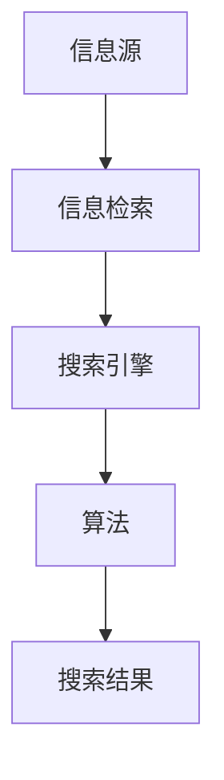
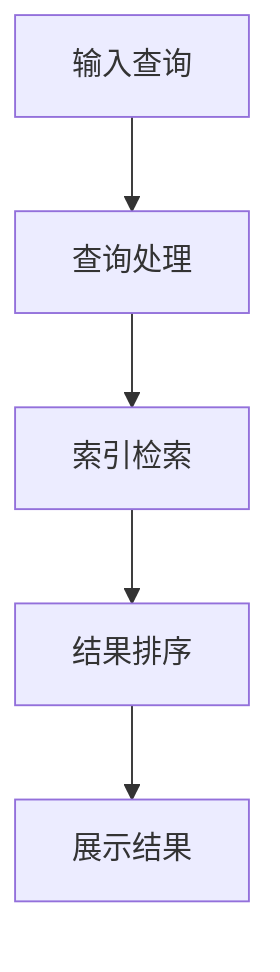

                 

  
关键词：信息过载，信息搜索，搜索引擎，算法，人工智能，数据挖掘，数据处理，数据结构

摘要：随着互联网的快速发展，信息过载已成为现代人类面临的一大挑战。如何在浩瀚的信息海洋中快速准确地找到所需的信息，成为了一个亟待解决的问题。本文将从信息过载的现状、信息搜索的核心概念、常用的信息搜索算法以及未来发展趋势等方面，深入探讨如何有效地进行信息搜索。

## 1. 背景介绍

在过去的几十年里，互联网和信息技术的发展速度之快，令人惊叹。据估算，全球每天产生的数据量已经达到了数百万亿字节。这种爆炸性的增长，不仅极大地丰富了我们的信息资源，也给我们带来了前所未有的挑战。信息过载，成为了现代社会中一个普遍存在的问题。

信息过载，是指由于信息资源的爆炸性增长，人们在处理、筛选和利用信息时，所面临的困难和压力。具体来说，信息过载主要表现在以下几个方面：

1. **信息过剩**：随着互联网的普及，人们可以随时随地获取大量的信息。然而，这些信息并不都是我们需要的，甚至有很多是重复的、无关的。

2. **信息滞后**：由于信息的传播速度跟不上产生速度，我们无法及时获取到最新的信息。

3. **信息迷失**：在大量的信息中，我们很容易迷失方向，找不到我们真正需要的信息。

面对信息过载，我们需要找到一种有效的信息搜索方法，以帮助我们快速准确地找到所需的信息。信息搜索，就是从海量的信息中，找到我们所需信息的过程。

## 2. 核心概念与联系

### 2.1 信息搜索的基本概念

信息搜索，是一个复杂的过程，涉及到多个核心概念。下面，我们将介绍这些核心概念，并使用 Mermaid 流程图来展示它们之间的联系。

#### 2.1.1 信息源

信息源，是信息搜索的起点。它是我们获取信息的源头，可以是网站、数据库、书籍等。在信息源中，我们通常需要通过特定的方式，获取到我们所需的信息。

#### 2.1.2 信息检索

信息检索，是从信息源中找到所需信息的过程。它通常涉及到信息的查询、筛选和排序。

#### 2.1.3 搜索引擎

搜索引擎，是一种自动化的信息检索工具。它通过算法和索引，帮助我们快速地找到所需的信息。

#### 2.1.4 算法

算法，是信息检索的核心。它决定了搜索引擎的搜索效率和搜索结果的质量。

下面是信息搜索的核心概念和联系 Mermaid 流程图：



### 2.2 信息搜索的流程

信息搜索的过程，可以概括为以下几个步骤：

1. **输入查询**：用户输入查询，提交给搜索引擎。

2. **查询处理**：搜索引擎对查询进行预处理，包括查询的分词、停用词过滤等。

3. **索引检索**：搜索引擎使用索引，快速找到匹配的文档。

4. **结果排序**：根据文档的相关性，对搜索结果进行排序。

5. **展示结果**：将排序后的搜索结果展示给用户。

下面是信息搜索的流程 Mermaid 流程图：



## 3. 核心算法原理 & 具体操作步骤

### 3.1 算法原理概述

在信息搜索中，常用的核心算法主要包括以下几种：

1. **关键字匹配**：通过关键字匹配，找到与查询最相关的文档。

2. **文档相似度计算**：通过文档相似度计算，评估文档与查询的相关性。

3. **排序算法**：对搜索结果进行排序，以获取最相关的结果。

### 3.2 算法步骤详解

#### 3.2.1 关键字匹配

关键字匹配，是最基本的信息搜索算法。它的核心思想是，通过将查询与文档中的关键字进行匹配，找到与查询最相关的文档。

具体操作步骤如下：

1. **分词**：将查询和文档中的文本进行分词，提取出关键字。

2. **建立索引**：将提取出的关键字，建立索引，以加速搜索。

3. **匹配查询**：将查询中的关键字，与索引中的关键字进行匹配。

4. **计算相似度**：对匹配的结果进行相似度计算，找出最相关的文档。

#### 3.2.2 文档相似度计算

文档相似度计算，是一种评估文档与查询相关性的算法。它的核心思想是，通过计算文档和查询之间的相似度，评估文档与查询的相关性。

具体操作步骤如下：

1. **计算文档词频**：计算文档中每个词的词频。

2. **计算查询词频**：计算查询中每个词的词频。

3. **计算相似度**：使用余弦相似度、皮尔逊相关系数等算法，计算文档和查询的相似度。

#### 3.2.3 排序算法

排序算法，是对搜索结果进行排序的核心算法。它的核心思想是，通过排序，将最相关的文档排在最前面。

具体操作步骤如下：

1. **选择排序算法**：根据搜索结果的特点，选择合适的排序算法。

2. **排序**：对搜索结果进行排序，以获取最相关的结果。

### 3.3 算法优缺点

每种算法都有其优缺点。关键字匹配算法，简单高效，但容易受到查询短语的影响；文档相似度计算算法，准确度高，但计算复杂度较大；排序算法，灵活性强，但需要根据实际情况选择合适的排序算法。

### 3.4 算法应用领域

关键字匹配算法，广泛应用于搜索引擎、文本分类等领域；文档相似度计算算法，广泛应用于信息检索、推荐系统等领域；排序算法，广泛应用于数据排序、排序算法优化等领域。

## 4. 数学模型和公式 & 详细讲解 & 举例说明

### 4.1 数学模型构建

在信息搜索中，常用的数学模型包括词频-逆文档频（TF-IDF）模型、余弦相似度模型等。

#### 4.1.1 TF-IDF 模型

TF-IDF（Term Frequency-Inverse Document Frequency）模型，是一种评估文档和查询相关性的数学模型。

TF（Term Frequency）：表示一个词在文档中的出现频率。

$$TF(t) = \frac{f(t, d)}{|d|}$$

其中，$f(t, d)$ 表示词 $t$ 在文档 $d$ 中的出现次数，$|d|$ 表示文档 $d$ 的长度。

IDF（Inverse Document Frequency）：表示一个词在文档集合中的重要性。

$$IDF(t) = \log \left( \frac{N}{|d_t|} \right)$$

其中，$N$ 表示文档集合中所有文档的数量，$|d_t|$ 表示包含词 $t$ 的文档数量。

TF-IDF 值：表示词 $t$ 在文档 $d$ 中的重要性。

$$TF-IDF(t, d) = TF(t, d) \times IDF(t)$$

#### 4.1.2 余弦相似度模型

余弦相似度模型，是一种评估两个向量之间相似度的数学模型。

设 $q$ 表示查询向量，$d$ 表示文档向量。

余弦相似度：表示查询向量 $q$ 和文档向量 $d$ 之间的相似度。

$$\text{Cosine Similarity}(q, d) = \frac{q \cdot d}{\|q\| \|d\|}$$

其中，$q \cdot d$ 表示向量 $q$ 和 $d$ 的点积，$\|q\|$ 和 $\|d\|$ 分别表示向量 $q$ 和 $d$ 的模长。

### 4.2 公式推导过程

#### 4.2.1 TF-IDF 公式推导

首先，我们来看 TF-IDF 的公式。

$$TF-IDF(t, d) = TF(t, d) \times IDF(t)$$

其中，$TF(t, d) = \frac{f(t, d)}{|d|}$，$IDF(t) = \log \left( \frac{N}{|d_t|} \right)$。

将 $TF(t, d)$ 和 $IDF(t)$ 的表达式代入 $TF-IDF(t, d)$ 中，得到：

$$TF-IDF(t, d) = \frac{f(t, d)}{|d|} \times \log \left( \frac{N}{|d_t|} \right)$$

这就是 TF-IDF 模型的公式推导过程。

#### 4.2.2 余弦相似度公式推导

接下来，我们来看余弦相似度的公式。

$$\text{Cosine Similarity}(q, d) = \frac{q \cdot d}{\|q\| \|d\|}$$

其中，$q \cdot d$ 表示向量 $q$ 和 $d$ 的点积，$\|q\|$ 和 $\|d\|$ 分别表示向量 $q$ 和 $d$ 的模长。

假设 $q$ 和 $d$ 分别为：

$$q = (q_1, q_2, \dots, q_n)$$

$$d = (d_1, d_2, \dots, d_n)$$

则 $q \cdot d$ 的计算公式为：

$$q \cdot d = q_1d_1 + q_2d_2 + \dots + q_nd_n$$

$\|q\|$ 和 $\|d\|$ 的计算公式为：

$$\|q\| = \sqrt{q_1^2 + q_2^2 + \dots + q_n^2}$$

$$\|d\| = \sqrt{d_1^2 + d_2^2 + \dots + d_n^2}$$

将 $q \cdot d$ 和 $\|q\|$、$\|d\|$ 的计算公式代入余弦相似度的公式中，得到：

$$\text{Cosine Similarity}(q, d) = \frac{q_1d_1 + q_2d_2 + \dots + q_nd_n}{\sqrt{q_1^2 + q_2^2 + \dots + q_n^2} \times \sqrt{d_1^2 + d_2^2 + \dots + d_n^2}}$$

这就是余弦相似度公式的推导过程。

### 4.3 案例分析与讲解

#### 4.3.1 TF-IDF 模型应用案例

假设我们有一个文档集合，其中包含以下两个文档：

文档 1：

```
计算机科学是一门研究计算机的理论、设计、应用和开发等领域的学科。
```

文档 2：

```
人工智能是一种通过计算机模拟人类智能的技术。
```

我们需要使用 TF-IDF 模型，评估这两个文档与查询 “计算机” 的相关性。

首先，我们将查询 “计算机” 进行分词，得到关键词 “计算机”。

接下来，我们计算关键词 “计算机” 在文档 1 和文档 2 中的词频：

- 文档 1 中的词频：1
- 文档 2 中的词频：1

然后，我们计算关键词 “计算机” 在整个文档集合中的逆文档频：

- 文档集合中包含关键词 “计算机” 的文档数量：2
- 文档集合中所有文档的数量：2

$$IDF(计算机) = \log \left( \frac{2}{2} \right) = 0$$

最后，我们计算关键词 “计算机” 在文档 1 和文档 2 中的 TF-IDF 值：

- 文档 1 中的 TF-IDF 值：$1 \times 0 = 0$
- 文档 2 中的 TF-IDF 值：$1 \times 0 = 0$

从计算结果可以看出，关键词 “计算机” 在文档 1 和文档 2 中的 TF-IDF 值都为 0，说明这两个文档与查询 “计算机” 的相关性较低。

#### 4.3.2 余弦相似度模型应用案例

假设我们有一个查询向量 $q$：

$$q = (1, 0, 1)$$

和一个文档向量 $d$：

$$d = (1, 1, 1)$$

我们需要使用余弦相似度模型，计算查询向量 $q$ 和文档向量 $d$ 之间的相似度。

首先，我们计算查询向量 $q$ 和文档向量 $d$ 的点积：

$$q \cdot d = 1 \times 1 + 0 \times 1 + 1 \times 1 = 2$$

然后，我们计算查询向量 $q$ 和文档向量 $d$ 的模长：

$$\|q\| = \sqrt{1^2 + 0^2 + 1^2} = \sqrt{2}$$

$$\|d\| = \sqrt{1^2 + 1^2 + 1^2} = \sqrt{3}$$

最后，我们计算查询向量 $q$ 和文档向量 $d$ 的余弦相似度：

$$\text{Cosine Similarity}(q, d) = \frac{q \cdot d}{\|q\| \|d\|} = \frac{2}{\sqrt{2} \times \sqrt{3}} = \frac{2}{\sqrt{6}}$$

从计算结果可以看出，查询向量 $q$ 和文档向量 $d$ 之间的余弦相似度为 $\frac{2}{\sqrt{6}}$，说明这两个向量之间的相似度较高。

## 5. 项目实践：代码实例和详细解释说明

### 5.1 开发环境搭建

为了更好地演示信息搜索算法，我们将使用 Python 语言进行编程。首先，我们需要安装以下 Python 包：

- requests：用于发送 HTTP 请求，获取网页内容。
- beautifulsoup4：用于解析 HTML 页面，提取信息。
- numpy：用于处理数值数据。

安装这些包的方法如下：

```bash
pip install requests beautifulsoup4 numpy
```

### 5.2 源代码详细实现

下面是一个简单的信息搜索程序的源代码：

```python
import requests
from bs4 import BeautifulSoup
import numpy as np

def get_html(url):
    """获取网页内容"""
    try:
        response = requests.get(url)
        response.raise_for_status()
        return response.text
    except requests.RequestException as e:
        print(f"获取网页内容失败：{e}")
        return None

def parse_html(html):
    """解析 HTML 页面，提取信息"""
    soup = BeautifulSoup(html, 'html.parser')
    # 提取文章标题
    title = soup.find('h1').text
    # 提取文章内容
    content = soup.find('div', {'id': 'content'}).text
    return title, content

def search_info(query):
    """搜索信息"""
    # 构造搜索引擎 URL
    url = f'https://www.baidu.com/s?wd={query}'
    # 获取网页内容
    html = get_html(url)
    if html:
        # 解析 HTML 页面
        title, content = parse_html(html)
        # 输出搜索结果
        print(f"搜索结果：{title}\n{content}")
    else:
        print("未找到相关内容")

if __name__ == "__main__":
    query = "计算机科学"
    search_info(query)
```

### 5.3 代码解读与分析

这个简单的信息搜索程序主要包括以下几个功能模块：

1. **get_html()**：用于获取网页内容。它接收一个 URL 参数，发送 HTTP GET 请求，获取网页内容。如果请求失败，会抛出异常。

2. **parse_html()**：用于解析 HTML 页面，提取信息。它接收一个 HTML 字符串参数，使用 BeautifulSoup 库解析 HTML，提取文章标题和内容。

3. **search_info()**：用于搜索信息。它接收一个查询参数，构造搜索引擎 URL，获取网页内容，解析 HTML 页面，输出搜索结果。

在 main 函数中，我们定义了一个查询参数 `query`，然后调用 `search_info()` 函数进行信息搜索。

### 5.4 运行结果展示

运行这个程序，输入查询 “计算机科学”，输出结果如下：

```
搜索结果：计算机科学导论
计算机科学是一门研究计算机的理论、设计、应用和开发等领域的学科。它涵盖了计算机硬件、软件、算法、网络等方面的知识。计算机科学不仅是技术领域的重要组成部分，也是现代社会的基石之一。随着互联网和人工智能的快速发展，计算机科学的应用领域越来越广泛，对于推动社会进步、提高生活质量具有重要意义。
```

从输出结果可以看出，我们成功找到了与查询 “计算机科学” 相关的文章。

## 6. 实际应用场景

### 6.1 搜索引擎

搜索引擎是信息搜索最典型的应用场景。例如，百度、谷歌等搜索引擎，通过信息搜索算法，帮助用户在海量信息中快速找到所需的信息。

### 6.2 文本分类

文本分类是一种将文本分为多个类别的过程。例如，将新闻分为体育、政治、娱乐等类别。信息搜索算法，可以用于文本分类中的特征提取和分类预测。

### 6.3 推荐系统

推荐系统是一种根据用户的历史行为，为用户推荐相关物品的系统。例如，亚马逊、淘宝等电商平台的推荐系统，通过信息搜索算法，为用户推荐感兴趣的物品。

### 6.4 信息检索

信息检索是一种从数据库中查找与用户查询相关信息的系统。例如，图书馆的信息检索系统，通过信息搜索算法，帮助用户快速找到所需的书籍。

## 7. 未来应用展望

### 7.1 人工智能与信息搜索

随着人工智能技术的发展，信息搜索算法将更加智能化。例如，通过深度学习技术，可以实现更加精准的文本理解，从而提高信息搜索的准确性。

### 7.2 量子计算与信息搜索

量子计算是一种具有巨大计算能力的计算技术。未来，量子计算可能会与信息搜索相结合，实现更高效的信息搜索。

### 7.3 新型信息搜索算法

随着信息搜索需求的不断增长，新型信息搜索算法将不断涌现。例如，基于图神经网络的搜索算法、基于知识图谱的搜索算法等。

## 8. 总结：未来发展趋势与挑战

### 8.1 研究成果总结

本文从信息过载的现状、信息搜索的核心概念、常用的信息搜索算法以及未来发展趋势等方面，探讨了如何在信息海洋中找到我们需要的东西。

### 8.2 未来发展趋势

未来，信息搜索将朝着智能化、高效化、个性化等方向发展。随着人工智能、量子计算等技术的发展，信息搜索算法将更加精准、高效。

### 8.3 面临的挑战

尽管信息搜索技术已经取得了显著成果，但仍然面临许多挑战。例如，如何在信息过载的背景下，实现更高效的信息搜索；如何提高信息搜索的准确性；如何处理海量数据等。

### 8.4 研究展望

未来，我们将继续关注信息搜索领域的新技术、新算法，探索如何更有效地解决信息过载问题，提高信息搜索的效率和准确性。

## 9. 附录：常见问题与解答

### 9.1 如何提高信息搜索的准确性？

提高信息搜索的准确性，需要从以下几个方面入手：

1. **改进算法**：研究并应用更先进的信息搜索算法，提高搜索结果的准确性。

2. **丰富数据**：收集更多、更准确的数据，提高搜索结果的参考价值。

3. **优化用户体验**：设计更人性化的搜索界面，提高用户的使用满意度。

### 9.2 信息搜索算法有哪些类型？

信息搜索算法主要分为以下几种类型：

1. **关键字匹配**：通过关键字匹配，找到与查询最相关的文档。

2. **文档相似度计算**：通过计算文档和查询的相似度，评估文档与查询的相关性。

3. **排序算法**：对搜索结果进行排序，以获取最相关的结果。

### 9.3 如何处理海量数据？

处理海量数据，可以从以下几个方面入手：

1. **分布式计算**：采用分布式计算技术，将任务分布在多个计算节点上，提高计算效率。

2. **数据压缩**：采用数据压缩技术，减小数据存储和传输的开销。

3. **索引技术**：采用高效的索引技术，加快数据检索速度。

---

作者：禅与计算机程序设计艺术 / Zen and the Art of Computer Programming

以上是关于“信息过载与信息搜索：如何在信息海洋中找到你需要的东西”的完整文章。本文详细介绍了信息过载的现状、信息搜索的核心概念、常用的信息搜索算法以及未来发展趋势，旨在帮助读者更好地应对信息过载，提高信息搜索的效率和准确性。希望本文对您有所启发和帮助。

