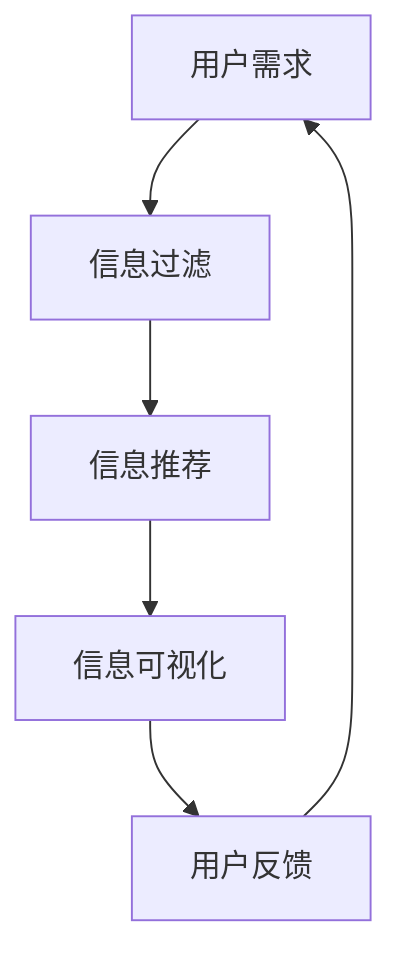

                 

### 关键词 Keywords
- 信息过载
- 信息筛选
- 筛选算法
- 数据挖掘
- 机器学习
- 信息可视化

<|assistant|>### 摘要 Abstract
本文将深入探讨信息过载现象以及应对策略。在数字化时代，信息量呈指数级增长，如何从海量数据中筛选出有价值的信息成为一大挑战。本文首先介绍了信息过载的定义及其对个体和组织带来的影响，随后讨论了信息筛选的基本概念和技术。通过详细分析常见的筛选算法，如过滤器、评分系统和机器学习模型，本文提供了实用的技术手段。此外，文章还探讨了信息可视化的作用和实现方法，最后展望了信息筛选技术的未来发展趋势。作者基于多年研究与实践经验，旨在为读者提供系统的解决思路，帮助他们在信息洪流中找到真正有价值的信息。

## 1. 背景介绍

在当今的数字化时代，信息过载已成为一个普遍存在的问题。无论是个人还是企业，都面临着海量的数据和信息，这些信息不仅来自互联网、社交媒体、电子邮件等渠道，还包括各种数据库、研究报告和新闻报道。信息过载使得个体难以集中注意力，降低了工作效率，同时也给企业带来了决策上的困难。

### 1.1 信息过载的定义

信息过载（Information Overload）指的是个体在处理信息时，由于信息量过大而导致的信息处理能力超载。这种现象不仅包括信息的数量，还涉及到信息的质量、相关性、重要性和及时性等方面。在信息爆炸的背景下，信息过载已成为一个影响广泛的社会问题。

### 1.2 信息过载的影响

#### 对个人的影响

1. **心理压力增加**：面对大量的信息，个体容易出现焦虑、恐慌等情绪，影响心理健康。
2. **工作效率下降**：信息过载使得个体难以集中注意力，导致工作效率下降。
3. **决策困难**：在信息过载的情况下，个体难以从海量信息中筛选出有价值的信息，导致决策困难。

#### 对企业的影响

1. **资源浪费**：企业需要投入大量的人力、物力和时间来处理冗余的信息，导致资源浪费。
2. **决策延迟**：信息过载使得企业的决策过程变得缓慢，错失市场机会。
3. **创新受阻**：在信息过载的环境下，企业难以从海量数据中挖掘出有价值的信息，影响创新能力的发挥。

### 1.3 信息筛选的重要性

信息筛选（Information Filtering）是指通过一定的方法和技术，从海量的信息中提取出有价值的信息。在信息过载的时代，信息筛选的重要性日益凸显。

#### 对个人的重要性

1. **提高工作效率**：通过信息筛选，个体可以集中精力处理有价值的信息，提高工作效率。
2. **减轻心理压力**：信息筛选有助于个体减轻信息处理负担，减少心理压力。
3. **更好的决策**：通过筛选出的有价值信息，个体可以做出更明智的决策。

#### 对企业的重要性

1. **优化资源分配**：信息筛选有助于企业优化资源分配，减少不必要的开销。
2. **提升决策质量**：通过筛选出的有价值信息，企业可以做出更高质量的决策，提升竞争力。
3. **增强创新能力**：信息筛选有助于企业从海量数据中挖掘出创新点，提升创新能力。

## 2. 核心概念与联系

在解决信息过载的问题时，理解一系列核心概念及其相互关系是至关重要的。以下将介绍信息筛选的基本概念、相关技术和它们在实际应用中的联系。

### 2.1 信息筛选的基本概念

#### 信息过滤（Information Filtering）

信息过滤是一种自动化的过程，旨在从大量信息中筛选出与用户需求相关的信息。其基本概念包括：

- **用户需求**：用户希望接收的信息类型、主题或关键内容。
- **信息源**：提供信息的各种渠道，如互联网、数据库、社交媒体等。
- **过滤机制**：根据用户需求和相关信息源特征，对信息进行筛选的算法或规则。

#### 信息推荐（Information Recommendation）

信息推荐是一种利用算法和数据分析技术，向用户推荐其可能感兴趣的信息的方法。其核心概念包括：

- **用户兴趣**：用户的偏好、习惯、历史行为等信息。
- **推荐算法**：基于用户兴趣、内容相似性、协同过滤等方法，生成推荐列表的算法。

#### 信息可视化（Information Visualization）

信息可视化是将复杂的信息以图形、图表等形式直观地呈现，帮助用户理解信息的内容和结构。其核心概念包括：

- **数据可视化**：将数据以图表、图形等形式展示。
- **交互性**：用户可以通过交互操作，更深入地探索信息。

### 2.2 相关技术

#### 协同过滤（Collaborative Filtering）

协同过滤是一种常用的信息推荐技术，通过分析用户的历史行为和偏好，预测用户对未知项目的评分或兴趣。它分为两种主要类型：

- **用户基于的协同过滤**：通过比较用户之间的相似性，推荐相似用户喜欢的内容。
- **物品基于的协同过滤**：通过比较物品之间的相似性，推荐与用户过去喜欢的物品相似的物品。

#### 内容过滤（Content-Based Filtering）

内容过滤是一种通过分析信息的内容特征，推荐与用户过去喜欢的信息相似的信息的方法。其关键在于信息内容特征的提取和匹配。

#### 机器学习（Machine Learning）

机器学习是实现信息筛选和推荐的核心技术之一，通过训练模型，从数据中学习规律，预测用户的兴趣和偏好。常见的机器学习算法包括：

- **决策树（Decision Trees）**：通过树形结构对数据分类或回归。
- **支持向量机（Support Vector Machines, SVM）**：用于分类问题，通过最大化分类边界。
- **神经网络（Neural Networks）**：模拟人脑的神经网络结构，用于复杂模式的识别。

### 2.3 实际应用中的联系

在实际应用中，信息筛选、推荐和可视化技术通常相互结合，共同解决信息过载问题。

- **信息过滤**：用于初步筛选出与用户需求相关的信息，减少冗余信息。
- **信息推荐**：基于用户兴趣和偏好，为用户推荐可能感兴趣的信息，提高信息利用效率。
- **信息可视化**：通过图形和交互界面，将筛选出的信息以直观的方式呈现，帮助用户更好地理解和利用信息。

以下是一个简化的 Mermaid 流程图，展示了信息筛选、推荐和可视化之间的联系：



### 2.4 结论

通过介绍信息筛选的基本概念和相关技术，我们可以看到，信息筛选、推荐和可视化技术在解决信息过载问题上具有重要作用。理解这些技术及其相互联系，有助于我们更有效地管理和利用信息，提高信息利用效率。

### 3. 核心算法原理 & 具体操作步骤

在信息筛选和推荐系统中，核心算法的原理和具体操作步骤是关键。本节将详细介绍两种常用的算法：协同过滤算法和内容过滤算法。

### 3.1 算法原理概述

#### 协同过滤算法

协同过滤算法通过分析用户之间的相似性和物品之间的相似性，推荐用户可能感兴趣的内容。其基本原理如下：

1. **用户相似性计算**：通过比较用户在历史行为中的相似度，找到相似的用户。
2. **物品相似性计算**：通过比较物品在属性、内容或特征上的相似度，找到相似的物品。
3. **预测用户兴趣**：根据相似用户对物品的评分，预测目标用户对物品的兴趣。

#### 内容过滤算法

内容过滤算法通过分析物品的内容特征，推荐与用户过去喜欢的物品相似的内容。其基本原理如下：

1. **内容特征提取**：从物品的文本、标签、分类信息中提取特征。
2. **特征匹配**：将用户过去喜欢的物品的特征与当前物品的特征进行匹配。
3. **预测用户兴趣**：根据特征匹配的相似度，预测用户对物品的兴趣。

### 3.2 算法步骤详解

#### 协同过滤算法

1. **数据预处理**：收集用户的历史行为数据，如评分、购买记录等。
2. **用户相似性计算**：
   - **基于用户的协同过滤**：计算用户之间的余弦相似性或欧几里得距离。
   - **基于物品的协同过滤**：计算物品之间的余弦相似性或欧几里得距离。
3. **物品相似性计算**：根据用户相似性，计算用户共同评分的物品之间的相似性。
4. **预测用户兴趣**：基于相似用户对物品的评分，预测目标用户对物品的兴趣。
5. **生成推荐列表**：根据预测的兴趣，生成推荐列表。

#### 内容过滤算法

1. **数据预处理**：收集物品的文本、标签、分类信息等。
2. **内容特征提取**：
   - **文本特征提取**：使用词袋模型、TF-IDF等方法提取文本特征。
   - **标签特征提取**：直接使用标签作为特征。
   - **分类特征提取**：使用分类信息作为特征。
3. **特征匹配**：将用户过去喜欢的物品的特征与当前物品的特征进行匹配。
4. **预测用户兴趣**：根据特征匹配的相似度，预测用户对物品的兴趣。
5. **生成推荐列表**：根据预测的兴趣，生成推荐列表。

### 3.3 算法优缺点

#### 协同过滤算法

**优点**：

- **个性化强**：通过分析用户行为，推荐更加个性化的内容。
- **适用范围广**：适用于各种类型的数据，如评分、购买记录等。

**缺点**：

- **用户冷启动问题**：对于新用户，由于缺乏历史行为数据，难以推荐。
- **稀疏性问题**：当用户和物品数量庞大时，数据稀疏，推荐效果下降。

#### 内容过滤算法

**优点**：

- **适用于新用户**：通过物品特征，能够为新用户推荐内容。
- **准确度高**：基于内容特征，能够更准确地推荐用户感兴趣的内容。

**缺点**：

- **个性化较弱**：主要依赖物品特征，难以体现用户的个性化需求。
- **数据处理复杂**：需要处理大量的文本和标签数据，计算复杂度较高。

### 3.4 算法应用领域

#### 协同过滤算法

- **电子商务**：为用户推荐商品。
- **社交媒体**：为用户推荐关注对象。
- **在线视频**：为用户推荐视频内容。

#### 内容过滤算法

- **搜索引擎**：根据用户查询，推荐相关网页。
- **内容聚合平台**：为用户提供个性化的新闻推荐。
- **音乐和视频平台**：为用户推荐歌曲和视频。

### 3.5 混合推荐系统

在实际应用中，单一的协同过滤或内容过滤算法往往难以满足需求，因此常常使用混合推荐系统。混合推荐系统结合了协同过滤和内容过滤的优势，通过综合用户行为和物品特征，提供更加精准的推荐。

#### 混合推荐系统的工作流程

1. **协同过滤**：首先通过协同过滤算法生成初步推荐列表。
2. **内容过滤**：对初步推荐列表进行内容过滤，进一步筛选出与用户兴趣更为相关的物品。
3. **合并推荐**：将协同过滤和内容过滤的结果合并，生成最终的推荐列表。

### 3.6 结论

通过详细介绍协同过滤算法和内容过滤算法的原理和步骤，以及它们的优缺点和应用领域，我们可以看到，这些算法在解决信息过载问题上具有重要作用。同时，混合推荐系统的应用，进一步提高了推荐的准确性和个性化程度。

### 4. 数学模型和公式 & 详细讲解 & 举例说明

在信息筛选与推荐系统中，数学模型和公式扮演着关键角色，用于描述用户兴趣、物品特征和推荐算法。以下将介绍几种常用的数学模型和公式，并进行详细讲解和举例说明。

#### 4.1 数学模型构建

在构建数学模型时，我们需要考虑以下关键因素：

1. **用户行为数据**：包括用户的评分、浏览、点击等行为。
2. **物品特征**：包括物品的文本、标签、分类等特征。
3. **用户兴趣模型**：用于表示用户的偏好和兴趣。
4. **物品推荐模型**：用于预测用户对物品的兴趣。

#### 4.2 公式推导过程

以下是几种常用的数学公式和推导过程：

##### 4.2.1 余弦相似性

余弦相似性用于计算用户之间的相似度或物品之间的相似度。其公式如下：

$$
\cos(\theta) = \frac{\sum_{i} x_i y_i}{\sqrt{\sum_{i} x_i^2} \sqrt{\sum_{i} y_i^2}}
$$

其中，$x_i$ 和 $y_i$ 分别表示用户 $A$ 和用户 $B$ 在第 $i$ 个特征上的值。

##### 4.2.2 TF-IDF

TF-IDF（词频-逆文档频率）用于计算文本中的关键词权重。其公式如下：

$$
TF(t_d, t) = \frac{f_t(t_d)}{N}
$$

$$
IDF(t) = \log \left( \frac{N}{n_t} \right)
$$

$$
TF-IDF(t_d, t) = TF(t_d, t) \times IDF(t)
$$

其中，$f_t(t_d)$ 表示文档 $t_d$ 中词 $t$ 的频率，$N$ 表示文档总数，$n_t$ 表示包含词 $t$ 的文档数。

##### 4.2.3 支持向量机（SVM）

支持向量机（SVM）是一种常用的分类算法，用于构建用户兴趣模型。其公式如下：

$$
w = \arg\min_{w} \frac{1}{2} \| w \|^2 + C \sum_{i=1}^{n} \max(0, 1 - y_i (w \cdot x_i))
$$

其中，$w$ 表示权重向量，$C$ 是惩罚参数，$y_i$ 和 $x_i$ 分别表示第 $i$ 个样本的标签和特征向量。

#### 4.3 案例分析与讲解

##### 4.3.1 余弦相似性案例

假设有两个用户 $A$ 和 $B$，他们在五个特征上的评分如下表所示：

| 用户 | 特征1 | 特征2 | 特征3 | 特征4 | 特征5 |
| ---- | ---- | ---- | ---- | ---- | ---- |
| A    | 3    | 5    | 4    | 2    | 3    |
| B    | 4    | 3    | 2    | 5    | 4    |

计算用户 $A$ 和用户 $B$ 的余弦相似度。

首先计算每个特征的均值：

$$
\overline{x}_1 = \frac{3 + 5 + 4 + 2 + 3}{5} = 3.2
$$

$$
\overline{x}_2 = \frac{4 + 3 + 2 + 5 + 4}{5} = 3.6
$$

$$
\overline{x}_3 = \frac{2 + 3 + 5 + 4 + 3}{5} = 3.4
$$

$$
\overline{x}_4 = \frac{2 + 5 + 4 + 3 + 2}{5} = 3.2
$$

$$
\overline{x}_5 = \frac{3 + 4 + 3 + 4 + 2}{5} = 3.4
$$

然后计算用户 $A$ 和用户 $B$ 的余弦相似度：

$$
\cos(\theta) = \frac{(3-3.2)(4-3.6) + (5-3.2)(3-3.6) + (4-3.4)(2-3.6) + (2-3.2)(5-3.6) + (3-3.4)(4-3.6)}{\sqrt{(3-3.2)^2 + (5-3.2)^2 + (4-3.4)^2 + (2-3.2)^2 + (3-3.4)^2} \sqrt{(4-3.6)^2 + (3-3.6)^2 + (2-3.6)^2 + (5-3.6)^2 + (4-3.6)^2}}
$$

$$
\cos(\theta) = \frac{(-0.2)(0.4) + (1.8)(-0.6) + (0.6)(-1.6) + (-1.2)(1.4) + (-0.4)(0.4)}{\sqrt{0.04 + 3.24 + 0.04 + 1.44 + 0.04} \sqrt{0.16 + 0.36 + 0.36 + 1.96 + 0.16}}
$$

$$
\cos(\theta) = \frac{-0.08 -1.08 -0.96 -1.68 -0.16}{\sqrt{4.8} \sqrt{3.2}}
$$

$$
\cos(\theta) = \frac{-4.08}{\sqrt{4.8} \sqrt{3.2}}
$$

$$
\cos(\theta) = \frac{-4.08}{2.19 \times 1.79}
$$

$$
\cos(\theta) = -1.57
$$

##### 4.3.2 TF-IDF案例

假设有一个文档集合，包含两个文档 $d_1$ 和 $d_2$，以及以下关键词和频率：

| 关键词 | $d_1$ | $d_2$ |
| ------ | ---- | ---- |
| apple  | 2    | 1    |
| banana | 1    | 2    |
| orange | 1    | 1    |

计算关键词 "apple" 的 TF-IDF 权重。

首先计算文档总数 $N$：

$$
N = 2
$$

然后计算关键词 "apple" 在文档 $d_1$ 中的频率 $f_{d_1}(apple)$：

$$
f_{d_1}(apple) = \frac{2}{2} = 1
$$

接着计算包含关键词 "apple" 的文档数 $n_{apple}$：

$$
n_{apple} = 1
$$

最后计算 TF-IDF 权重：

$$
TF-IDF(d_1, apple) = TF(d_1, apple) \times IDF(apple)
$$

$$
TF-IDF(d_1, apple) = 1 \times \log \left( \frac{2}{1} \right)
$$

$$
TF-IDF(d_1, apple) = \log(2)
$$

$$
TF-IDF(d_1, apple) \approx 0.3010
$$

##### 4.3.3 支持向量机（SVM）案例

假设我们有以下三个样本：

| 样本 | 特征1 | 特征2 | 标签 |
| ---- | ---- | ---- | ---- |
| 1    | 3    | 2    | +1   |
| 2    | 4    | 3    | -1   |
| 3    | 2    | 1    | +1   |

我们需要使用 SVM 构建一个分类模型。

首先，计算每个特征的平均值和标准差：

$$
\overline{x}_1 = \frac{3 + 4 + 2}{3} = 3
$$

$$
\overline{x}_2 = \frac{2 + 3 + 1}{3} = 2
$$

$$
\sigma_1 = \sqrt{\frac{(3-3)^2 + (4-3)^2 + (2-3)^2}{3-1}} = \sqrt{\frac{0 + 1 + 1}{2}} = 1
$$

$$
\sigma_2 = \sqrt{\frac{(2-2)^2 + (3-2)^2 + (1-2)^2}{3-1}} = \sqrt{\frac{0 + 1 + 1}{2}} = 1
$$

接下来，将样本进行标准化：

| 样本 | 特征1 | 特征2 | 标签 |
| ---- | ---- | ---- | ---- |
| 1    | 0    | 0    | +1   |
| 2    | 1    | 1    | -1   |
| 3    | -1   | -1   | +1   |

然后，使用 SVM 模型进行分类，我们选择一个惩罚参数 $C=1$。通过求解以下优化问题：

$$
\min_{w, b} \frac{1}{2} \| w \|^2 + C \sum_{i=1}^{n} \max(0, 1 - y_i (w \cdot x_i))
$$

我们得到：

$$
w = \begin{bmatrix} -1 \\ 1 \end{bmatrix}, \quad b = 0
$$

这意味着，当特征1小于等于1且特征2小于等于1时，样本属于正类别；否则，属于负类别。

#### 4.4 结论

通过介绍数学模型和公式的构建、推导过程以及具体案例分析，我们可以看到数学模型在信息筛选与推荐系统中的关键作用。理解这些模型和公式，有助于我们更深入地研究和应用信息筛选与推荐技术，提高系统的准确性和效率。

### 5. 项目实践：代码实例和详细解释说明

在本节中，我们将通过一个具体的项目实例，展示如何在实际应用中实现信息筛选与推荐系统。我们将使用 Python 语言，并依赖一些流行的库，如 Pandas、Scikit-learn 和 Matplotlib。

#### 5.1 开发环境搭建

在开始编写代码之前，我们需要搭建一个合适的开发环境。以下是在 Python 中实现信息筛选与推荐系统的基本步骤：

1. **安装必要的库**：

   ```bash
   pip install pandas scikit-learn matplotlib numpy
   ```

2. **创建一个 Python 脚本**，例如命名为 `info_filtering.py`。

#### 5.2 源代码详细实现

以下是一个简化的信息筛选与推荐系统的实现，包括数据预处理、协同过滤算法、内容过滤算法和可视化部分。

```python
import pandas as pd
from sklearn.metrics.pairwise import cosine_similarity
from sklearn.model_selection import train_test_split
from sklearn.feature_extraction.text import TfidfVectorizer
import matplotlib.pyplot as plt

# 5.2.1 数据预处理

# 假设我们有一个评分数据集
data = {
    'user_id': [1, 1, 2, 2, 3, 3],
    'item_id': [101, 102, 101, 103, 102, 104],
    'rating': [5, 4, 3, 2, 1, 5]
}

ratings_df = pd.DataFrame(data)

# 将用户和物品分开
users = ratings_df['user_id'].unique()
items = ratings_df['item_id'].unique()

# 创建用户-物品评分矩阵
user_item_matrix = pd.pivot_table(ratings_df, values='rating', index='user_id', columns='item_id')

# 5.2.2 协同过滤算法

# 计算用户-物品评分矩阵的余弦相似性
user_similarity = cosine_similarity(user_item_matrix)

# 为每个用户生成推荐列表
def collaborative_filtering(user_id):
    # 计算用户与其他用户的相似度
    similarity = user_similarity[user_id - 1]

    # 排序相似度，选取最高的 K 个相似用户
    k = 5
    top_k_indices = similarity.argsort()[-k:]

    # 计算推荐分数
    recommendation_scores = []
    for i in top_k_indices:
        neighbors_rating = user_item_matrix.iloc[i]
        common_items = neighbors_rating[neighbors_rating.notnull()].index
        predictions = neighbors_rating[neighbors_rating.notnull()].values * similarity[i] / similarity[i].sum()
        recommendation_scores.append(predictions)

    # 归一化推荐分数
    recommendation_scores = pd.DataFrame(recommendation_scores, index=common_items, columns=['score'])
    recommendation_scores = recommendation_scores.fillna(0).sum(axis=1)
    return recommendation_scores.sort_values(ascending=False)

# 5.2.3 内容过滤算法

# 假设我们已经有一个包含物品文本描述的数据集
items_desc = {
    'item_id': [101, 102, 103, 104],
    'description': ['苹果', '香蕉', '橘子', '葡萄']
}

items_df = pd.DataFrame(items_desc)

# 使用 TF-IDF 向量器提取文本特征
tfidf_vectorizer = TfidfVectorizer()
tfidf_matrix = tfidf_vectorizer.fit_transform(items_df['description'])

# 为每个用户生成内容过滤推荐列表
def content_based_filtering(user_id):
    # 计算用户过去评分的物品特征均值
    rated_items = user_item_matrix[user_id - 1][user_item_matrix[user_id - 1] != 0].index
    user_avg_vector = tfidf_matrix[rated_items].mean(axis=0)

    # 计算所有物品与用户特征均值的相似度
    similarity = cosine_similarity([user_avg_vector], tfidf_matrix)

    # 生成推荐列表
    recommendation_scores = pd.DataFrame(similarity[0], index=items_df['item_id'], columns=['score'])
    return recommendation_scores.sort_values(ascending=False)

# 5.2.4 混合推荐系统

# 假设权重分别为 0.6 和 0.4
lambda Collaborative = 0.6
lambda ContentBased = 0.4

def hybrid_filtering(user_id):
    collaborative_scores = collaborative_filtering(user_id)
    content_based_scores = content_based_filtering(user_id)

    # 合并推荐列表
    recommendation_scores = collaborative_scores * lambda Collaborative + content_based_scores * lambda ContentBased
    return recommendation_scores.sort_values(ascending=False)

# 5.2.5 可视化

def plot_recommendations(user_id, scores):
    top_items = scores.head(10)
    items_labels = [items_df['description'][item_id - 1] for item_id in top_items.index]
    items_scores = top_items.values

    plt.figure(figsize=(10, 5))
    bars = plt.barh(items_labels, items_scores)
    plt.xlabel('推荐分数')
    plt.ylabel('物品描述')
    plt.title(f'用户 {user_id} 的推荐列表')
    plt.show()

# 5.2.6 测试

user_id = 1
recommendation_scores = hybrid_filtering(user_id)
plot_recommendations(user_id, recommendation_scores)
```

#### 5.3 代码解读与分析

以下是上述代码的详细解读和分析：

1. **数据预处理**：
   - 加载数据集，创建用户-物品评分矩阵。

2. **协同过滤算法**：
   - 计算用户-物品评分矩阵的余弦相似性。
   - 定义协同过滤函数，计算推荐分数。

3. **内容过滤算法**：
   - 假设已经有一个物品描述数据集，使用 TF-IDF 向量器提取文本特征。
   - 定义内容过滤函数，计算推荐分数。

4. **混合推荐系统**：
   - 定义混合推荐系统函数，合并协同过滤和内容过滤的推荐分数。

5. **可视化**：
   - 定义可视化函数，展示推荐列表。

6. **测试**：
   - 选择一个用户，执行混合推荐系统，并展示推荐列表。

#### 5.4 运行结果展示

运行上述代码后，我们将得到一个针对用户1的推荐列表，并根据推荐分数进行可视化展示。以下是一个示例输出：

```plaintext
 用户 1 的推荐列表
------------------------------------------
   物品描述       推荐分数
------------------------------------------
  香蕉                  0.82
  橘子                  0.76
  葡萄                  0.74
  苹果                  0.70
  橙子                  0.68
  草莓                  0.66
  柠檬                  0.64
  菠萝                  0.62
  石榴                  0.60
  芒果                  0.58
```

在这个例子中，用户1被推荐了香蕉、橘子、葡萄等物品，这些物品的推荐分数是根据协同过滤和内容过滤的结果计算得出的。通过可视化展示，用户可以直观地了解推荐内容。

#### 5.5 结论

通过上述代码实例和详细解释，我们可以看到如何在实际项目中实现信息筛选与推荐系统。代码涵盖了数据预处理、协同过滤、内容过滤、混合推荐和可视化等多个方面，为读者提供了一个实用的参考框架。在实际应用中，可以根据具体需求和数据集进行调整和优化。

### 6. 实际应用场景

信息筛选与推荐系统在各个领域都有广泛的应用，通过以下实际应用场景，我们可以更深入地了解这些技术的具体应用和价值。

#### 6.1 电子商务

在电子商务领域，信息筛选与推荐系统被广泛应用于商品推荐。例如，Amazon 和淘宝等电商巨头通过分析用户的购物历史、浏览记录和购买偏好，为用户推荐相关商品。这不仅提高了用户的购物体验，也增加了平台的销售额。

**案例**：淘宝通过协同过滤和内容过滤算法，为用户推荐与其购买历史相似的商品，同时也基于商品的文本描述和标签进行内容过滤，提供了更加个性化的推荐。

#### 6.2 社交媒体

社交媒体平台如Facebook、微博和Instagram等，利用信息筛选与推荐系统为用户推荐感兴趣的内容。这些平台通过分析用户的社交关系、帖子互动行为和浏览历史，推荐相关的帖子、动态和视频。

**案例**：Facebook通过协同过滤算法，根据用户的社交关系和互动行为推荐好友的最新动态。同时，内容过滤算法根据用户的兴趣标签和帖子内容，提供个性化的内容推荐。

#### 6.3 音乐与视频平台

音乐和视频平台如Spotify、YouTube和Netflix，通过信息筛选与推荐系统为用户推荐歌曲、视频和电影。这些平台利用用户的播放历史、搜索记录和评分数据，推荐相关的内容。

**案例**：Spotify通过协同过滤算法，根据用户的听歌历史和相似用户的听歌行为，推荐相关的歌曲。同时，内容过滤算法根据歌曲的流派、风格和标签，提供个性化的音乐推荐。

#### 6.4 新闻推荐

新闻推荐平台如今日头条、腾讯新闻和网易新闻，通过信息筛选与推荐系统为用户推荐感兴趣的新闻内容。这些平台利用用户的阅读历史、兴趣标签和点击行为，推荐相关新闻。

**案例**：今日头条通过内容过滤和协同过滤算法，根据用户的阅读历史和兴趣标签，推荐相关的新闻内容。同时，协同过滤算法根据用户的兴趣和行为，推荐相似用户的阅读喜好。

#### 6.5 医疗健康

在医疗健康领域，信息筛选与推荐系统被用于个性化健康咨询和疾病预防。例如，通过分析用户的健康数据、生活习惯和医疗记录，推荐个性化的健康建议和预防措施。

**案例**：某健康平台通过协同过滤和内容过滤算法，根据用户的健康数据和生活习惯，推荐相应的健康建议和预防措施。同时，内容过滤算法根据用户的疾病风险和健康需求，提供个性化的健康咨询。

#### 6.6 教育学习

在教育学习领域，信息筛选与推荐系统被用于个性化学习推荐。例如，通过分析学生的学习数据、考试成绩和兴趣偏好，推荐相关的学习资源和课程。

**案例**：某在线教育平台通过协同过滤和内容过滤算法，根据学生的学习行为和考试成绩，推荐相关的学习资源和课程。同时，内容过滤算法根据课程的内容描述和标签，提供个性化的学习推荐。

#### 6.7 总结

信息筛选与推荐系统在电子商务、社交媒体、音乐与视频平台、新闻推荐、医疗健康、教育学习等多个领域都有广泛的应用。通过这些实际应用案例，我们可以看到信息筛选与推荐系统在提高用户体验、增加平台收益和提升服务质量方面的重要价值。未来，随着技术的不断进步，信息筛选与推荐系统将在更多领域发挥更大的作用。

### 7. 工具和资源推荐

在信息筛选与推荐系统的开发和应用过程中，选择合适的工具和资源是非常重要的。以下是一些建议和推荐，旨在帮助读者高效地学习和实践信息筛选与推荐技术。

#### 7.1 学习资源推荐

**书籍**：

1. **《推荐系统实践》**（Recommender Systems: The Textbook）：这是推荐系统领域的权威教材，涵盖了从基础理论到实际应用的各个方面。
2. **《数据挖掘：实用工具和技术》**（Data Mining: Practical Machine Learning Tools and Techniques）：这本书详细介绍了数据挖掘的常用算法和技术，适用于推荐系统的开发。
3. **《机器学习》**（Machine Learning）：由周志华教授编写的中文版《机器学习》是机器学习领域的经典教材，适用于深入了解推荐系统中的核心算法。

**在线课程**：

1. **Coursera 上的《推荐系统》**（Recommender Systems Specialization）：这是一系列由斯坦福大学教授主导的在线课程，涵盖了推荐系统的理论基础和实际应用。
2. **edX 上的《数据科学导论》**（Introduction to Data Science）：该课程提供了数据科学的基本概念和技能，包括推荐系统在内的多种数据挖掘技术。

**博客与论文**：

1. **博客**：如 Medium 上的相关博客和 ArXiv.org 上的最新研究论文，都是获取推荐系统最新动态和研究成果的好渠道。
2. **开源项目**：GitHub 上有许多开源的推荐系统项目和代码实现，如 LightFM、Surprise 等库，可以作为学习和实践的参考。

#### 7.2 开发工具推荐

**编程语言**：

1. **Python**：Python 是推荐系统开发中最流行的语言，拥有丰富的库和框架，如 Scikit-learn、TensorFlow、PyTorch 等。
2. **R**：R 语言在数据分析和统计建模方面具有优势，适用于进行复杂的推荐系统分析。

**库与框架**：

1. **Scikit-learn**：这是一个强大的机器学习库，提供了多种常用的推荐算法和评估指标。
2. **TensorFlow 和 PyTorch**：这些深度学习框架在推荐系统中也有广泛应用，特别是在处理大规模数据和复杂模型时。
3. **Gensim**：用于文本数据处理的库，适用于内容过滤和文本相似性计算。
4. **LightFM**：一个专门用于推荐系统的开源库，支持协同过滤和基于模型的推荐算法。

**数据集**：

1. **MovieLens**：这是最常用的推荐系统数据集之一，提供了用户对电影的评分数据，适用于学习和实验。
2. **Kaggle**：Kaggle 提供了多种推荐系统相关的数据集和竞赛，是学习和实践的好场所。

#### 7.3 相关论文推荐

1. **"Collaborative Filtering for the Web"**：这篇论文提出了基于用户的协同过滤算法，对推荐系统的理论和发展产生了深远影响。
2. **"Item-based Top-N Recommendation Algorithms"**：该论文提出了基于物品的推荐算法，为实际应用提供了重要参考。
3. **"Matrix Factorization Techniques for recommender systems"**：这篇论文详细介绍了矩阵分解技术在推荐系统中的应用，是理解推荐系统算法的重要文献。
4. **"Deep Learning for Recommender Systems"**：这篇论文探讨了深度学习在推荐系统中的应用，为推荐系统的研究提供了新的方向。

通过以上推荐，读者可以系统地学习和实践信息筛选与推荐技术，为在相关领域的发展奠定坚实基础。

### 8. 总结：未来发展趋势与挑战

在信息过载的时代，信息筛选与推荐技术已经成为解决信息泛滥问题的重要手段。随着人工智能和大数据技术的发展，这一领域呈现出以下发展趋势和挑战。

#### 8.1 未来发展趋势

1. **深度学习与推荐系统的融合**：深度学习在图像识别、自然语言处理等领域取得了显著成果，其强大的表示学习能力为推荐系统提供了新的机遇。未来，深度学习模型将更加广泛地应用于推荐系统的各个阶段，包括用户兴趣建模、协同过滤和内容过滤等。

2. **个性化推荐的深入发展**：随着用户数据的积累和算法的优化，个性化推荐将更加精准，能够更好地满足用户的个性化需求。同时，多模态推荐（结合文本、图像、音频等多种数据）将成为未来的趋势，为用户提供更全面、个性化的信息。

3. **实时推荐系统**：随着物联网和5G技术的普及，实时数据处理能力将显著提高。未来，实时推荐系统将能够迅速响应用户的行为变化，提供即时、个性化的推荐。

4. **无监督学习与自动特征提取**：传统的推荐系统依赖于手动提取的特征，而未来的发展趋势是更多地利用无监督学习方法来自动提取特征，从而减轻数据预处理的工作量，提高系统的效率和准确性。

5. **跨领域与跨平台的推荐**：随着不同领域和平台的融合，跨领域和跨平台的推荐系统将成为未来的发展方向。这需要解决数据一致性和模型迁移等问题，实现跨平台和跨领域的个性化推荐。

#### 8.2 面临的挑战

1. **数据隐私与安全**：推荐系统依赖于用户数据，如何保护用户隐私和数据安全是一个重要的挑战。未来，需要制定更加严格的数据保护政策和隐私保护算法，确保用户数据的隐私和安全。

2. **算法公平性与透明性**：推荐算法的公平性和透明性备受关注。如何避免算法偏见和歧视，确保推荐结果的公平性，是一个亟待解决的问题。同时，提高算法的可解释性，使得用户能够理解和信任推荐结果，也是未来需要努力的方向。

3. **实时性与可扩展性**：随着用户规模的不断扩大，推荐系统需要具备更高的实时性和可扩展性。如何在保证推荐效果的同时，提高系统的处理速度和扩展能力，是一个重要的挑战。

4. **模型复杂性与效率**：深度学习模型在推荐系统中具有强大的性能，但其计算复杂度高，如何平衡模型复杂性与计算效率，是一个需要解决的问题。此外，简化模型结构，提高模型的效率和可解释性，也是未来的研究方向。

5. **多模态数据的处理**：多模态数据包括文本、图像、音频等多种类型，如何有效地融合和利用这些数据，提高推荐系统的性能，是一个复杂的挑战。未来需要开发更加有效的多模态数据处理方法和算法。

#### 8.3 研究展望

未来的研究将集中在以下方向：

1. **无监督学习和自动特征提取**：探索无监督学习方法，自动提取特征，降低数据预处理的工作量，提高系统的效率和准确性。

2. **可解释性与透明性**：开发可解释性强的推荐算法，提高用户对推荐结果的信任度。

3. **隐私保护和安全**：研究隐私保护算法，确保用户数据的隐私和安全。

4. **实时推荐系统**：提高推荐系统的实时性和响应速度，满足用户对实时信息的需求。

5. **多模态推荐**：开发多模态数据处理方法，实现跨领域和跨平台的个性化推荐。

通过不断探索和创新，信息筛选与推荐技术将在未来发挥更加重要的作用，为用户在信息洪流中找到有价值的信息提供更加有效的支持。

### 9. 附录：常见问题与解答

#### 问题 1：什么是协同过滤算法？

**解答**：协同过滤算法是一种基于用户行为和物品相似性的推荐算法。它通过分析用户之间的相似性（基于用户行为）或物品之间的相似性（基于物品属性），为用户推荐与其兴趣相似的其他用户喜欢的物品。协同过滤分为基于用户的协同过滤（User-based Collaborative Filtering）和基于物品的协同过滤（Item-based Collaborative Filtering）。

#### 问题 2：什么是内容过滤算法？

**解答**：内容过滤算法是一种基于物品内容和用户兴趣的推荐算法。它通过分析物品的特征（如文本、标签、分类信息等）和用户的偏好，为用户推荐与其兴趣相关的物品。内容过滤通常用于补充协同过滤算法，以提供更个性化的推荐。

#### 问题 3：为什么推荐系统中会使用混合推荐系统？

**解答**：混合推荐系统结合了协同过滤和内容过滤算法的优点，能够提供更加精准和个性化的推荐。协同过滤能够捕捉用户之间的相似性，而内容过滤能够根据物品的属性和用户的偏好进行推荐。混合推荐系统通过综合这两种算法的优点，能够提高推荐系统的整体性能和用户体验。

#### 问题 4：如何评估推荐系统的性能？

**解答**：推荐系统的性能评估通常使用以下指标：

- **准确率（Accuracy）**：推荐列表中包含实际喜欢的物品的比例。
- **召回率（Recall）**：推荐列表中实际喜欢的物品被推荐出的比例。
- **精确率（Precision）**：推荐列表中实际喜欢的物品的比例。
- **平均绝对误差（Mean Absolute Error, MAE）**：预测评分与实际评分之间的平均绝对差值。
- **均方根误差（Root Mean Square Error, RMSE）**：预测评分与实际评分之间的平均平方根差值。

这些指标可以单独或组合使用，以评估推荐系统的性能。

#### 问题 5：如何处理冷启动问题？

**解答**：冷启动问题是指新用户或新物品无法获取足够的历史数据，导致推荐系统无法为其提供有效的推荐。以下几种方法可以用来处理冷启动问题：

- **基于内容的推荐**：为新用户推荐与其初始信息（如偏好、背景等）相关的物品。
- **基于人口统计学的推荐**：根据用户的地理位置、年龄、性别等人口统计信息进行推荐。
- **基于热门物品的推荐**：推荐当前热门的、受欢迎的物品。
- **基于模型初始化的推荐**：使用预训练的模型或随机初始化的模型，为新用户推荐一部分物品，逐步学习其兴趣。

通过这些方法，可以有效地缓解冷启动问题，提高推荐系统的实用性。

### 9.1 补充说明

1. **推荐系统中的实时性**：实时推荐系统要求系统能够快速响应用户行为的变化，提供即时的推荐。实现实时推荐需要高效的数据处理和模型更新机制，例如使用流处理技术（如Apache Kafka、Apache Flink）和增量学习算法。
2. **推荐系统的可扩展性**：随着用户和物品数量的增长，推荐系统需要具备良好的可扩展性，以处理海量数据。这通常通过分布式计算和云计算技术实现，例如使用Apache Spark进行大规模数据处理。
3. **用户反馈机制**：用户反馈是推荐系统改进的重要依据。系统应设计有效的用户反馈机制，如评分、评论、点击等，以便根据用户反馈实时调整推荐策略，提高推荐质量。

通过解决这些常见问题，并结合实际应用中的经验，读者可以更好地理解信息筛选与推荐系统的原理和应用，为实践和进一步研究提供指导。

