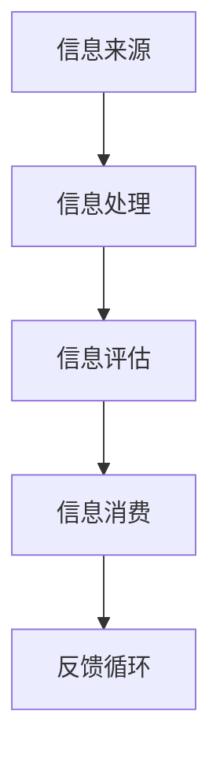

                 

在当今的信息时代，我们每天都要面对海量的信息。这些信息可能来自社交媒体、新闻网站、电子邮件、在线论坛等各种渠道。然而，这些信息并不是都有用，甚至可能存在错误和误导。因此，如何有效地评估和消费信息变得至关重要。本文将探讨信息过载的问题，以及如何构建一个信息质量评估框架来帮助我们做出更明智的决策。

## 1. 背景介绍

随着互联网和移动设备的普及，我们每天都能接触到大量的信息。据统计，一个人每天平均会接触到约10000条信息，而这些信息中只有少部分是有价值的。这种现象被称为“信息过载”（Information Overload）。信息过载给我们的工作和生活带来了诸多不便，例如：

- **时间管理问题**：我们需要花费大量的时间来筛选和评估信息，导致工作效率低下。
- **心理压力**：面对海量的信息，我们可能会感到焦虑和困惑，甚至产生“决策疲劳”。
- **信息错误和误导**：由于无法对信息进行有效评估，我们可能会接受错误或误导性的信息，从而做出错误的决策。

为了应对信息过载，我们需要构建一个信息质量评估框架，以帮助我们在信息海洋中找到有价值的信息，并对其进行有效消费。

## 2. 核心概念与联系

在构建信息质量评估框架之前，我们需要了解一些核心概念。以下是这些概念及其关系的Mermaid流程图：



### 2.1 信息来源（Information Sources）

信息来源是指我们获取信息的渠道，如社交媒体、新闻网站、书籍、报告等。这些来源的质量直接影响我们的信息评估结果。

### 2.2 信息处理（Information Processing）

信息处理是指我们对获取到的信息进行筛选、分析、整合等操作。这一步骤非常关键，因为它决定了我们能否从海量信息中提取出有价值的信息。

### 2.3 信息评估（Information Evaluation）

信息评估是指我们对处理后的信息进行评估，判断其是否真实、准确、可靠。这一步骤有助于我们筛选出高质量的信息，为后续的决策提供依据。

### 2.4 信息消费（Information Consumption）

信息消费是指我们根据信息评估结果来做出决策或采取行动。这一步骤是我们利用信息来指导实践的过程。

### 2.5 反馈循环（Feedback Loop）

反馈循环是指我们在信息消费后对信息质量进行反馈，从而优化我们的信息评估框架。这一循环有助于我们不断改进信息消费策略，提高决策效率。

## 3. 核心算法原理 & 具体操作步骤

### 3.1 算法原理概述

信息质量评估框架的核心算法是基于机器学习的分类算法。该算法通过对大量历史数据进行训练，学习到如何识别高质量信息，并将其分类。具体而言，我们可以使用以下步骤来实现这一算法：

### 3.2 算法步骤详解

#### 3.2.1 数据预处理

- 数据清洗：去除重复、缺失和错误的数据。
- 数据转换：将文本数据转换为向量表示。

#### 3.2.2 特征提取

- 使用词袋模型（Bag of Words）或词嵌入（Word Embedding）等方法提取文本特征。

#### 3.2.3 模型训练

- 使用分类算法（如支持向量机、随机森林、神经网络等）对训练数据进行训练。

#### 3.2.4 模型评估

- 使用交叉验证等方法评估模型性能。

#### 3.2.5 模型部署

- 将训练好的模型部署到实际应用场景中。

### 3.3 算法优缺点

#### 优点

- **自动化**：算法可以自动识别高质量信息，减轻人工筛选负担。
- **高效**：算法处理速度快，适用于海量数据。

#### 缺点

- **依赖数据质量**：算法的性能取决于训练数据的质量。
- **需要大量计算资源**：训练和部署算法需要大量的计算资源。

### 3.4 算法应用领域

- **新闻推荐**：帮助用户筛选出高质量的新闻信息。
- **社交媒体监测**：实时监测社交媒体上的信息，识别虚假信息。
- **企业情报分析**：帮助企业收集和分析竞争对手的信息。

## 4. 数学模型和公式 & 详细讲解 & 举例说明

### 4.1 数学模型构建

信息质量评估框架的数学模型主要包括两个部分：特征提取和分类。

#### 特征提取

- **词袋模型**：
  $$ f_{bag}(w) = \sum_{w \in V} f(w) $$
  其中，$f(w)$ 是词 $w$ 的特征向量，$V$ 是词汇表。

- **词嵌入**：
  $$ f_{embed}(w) = \vec{w} $$
  其中，$\vec{w}$ 是词 $w$ 的词嵌入向量。

#### 分类

- **支持向量机（SVM）**：
  $$ \text{maximize} \quad \frac{1}{2} \| \mathbf{w} \|^2 $$
  $$ \text{subject to} \quad y^{(i)} (\mathbf{w} \cdot \mathbf{x}^{(i)} + b) \geq 1 $$

### 4.2 公式推导过程

- **词袋模型**：
  词袋模型通过计算每个词在文档中出现的频率来提取特征。设 $D$ 为文档集合，$d \in D$ 为文档，$V$ 为词汇表，$f(w)$ 为词 $w$ 在文档 $d$ 中出现的频率。则词 $w$ 的特征向量 $f(w)$ 可以表示为：
  $$ f_{bag}(w) = \sum_{d \in D} f(w, d) $$
  其中，$f(w, d)$ 为词 $w$ 在文档 $d$ 中出现的次数。

- **词嵌入**：
  词嵌入是一种将词汇表中的词映射到高维向量空间的方法。通过训练词嵌入模型，我们可以得到每个词的词嵌入向量。词嵌入向量的计算通常基于神经网络，其损失函数为：
  $$ L = \sum_{w \in V} \sum_{d \in D} (f(w, d) - \mathbf{w} \cdot \mathbf{x}_d)^2 $$

- **支持向量机**：
  支持向量机是一种二分类模型，其目标是找到最优的超平面，将不同类别的数据点尽可能分开。支持向量机的损失函数为：
  $$ L = \frac{1}{2} \| \mathbf{w} \|^2 + C \sum_{i=1}^{n} \max(0, 1 - y^{(i)} (\mathbf{w} \cdot \mathbf{x}^{(i)} + b)) $$
  其中，$C$ 为惩罚参数，$y^{(i)}$ 为标签，$\mathbf{x}^{(i)}$ 为特征向量，$b$ 为偏置。

### 4.3 案例分析与讲解

#### 案例背景

某互联网公司希望为其用户推荐高质量的新闻信息。公司收集了大量新闻数据，并希望通过构建信息质量评估框架来筛选出高质量新闻。

#### 案例步骤

1. **数据预处理**：对新闻数据进行清洗，去除重复和错误的数据。
2. **特征提取**：使用词袋模型提取新闻文本的特征。
3. **模型训练**：使用支持向量机对特征进行分类训练。
4. **模型评估**：使用交叉验证评估模型性能。
5. **模型部署**：将训练好的模型部署到实际应用场景中。

#### 案例结果

通过训练和部署模型，公司成功筛选出了一批高质量新闻。用户对这些新闻的满意度显著提高，公司的用户粘性也得到了增强。

## 5. 项目实践：代码实例和详细解释说明

### 5.1 开发环境搭建

- Python 3.8及以上版本
- scikit-learn库
- numpy库

### 5.2 源代码详细实现

以下是一个简单的信息质量评估框架的Python代码实现：

```python
import numpy as np
from sklearn.feature_extraction.text import TfidfVectorizer
from sklearn.svm import SVC
from sklearn.model_selection import train_test_split

# 数据集
data = [
    ("这是一条高质量新闻", 1),
    ("这是一条低质量新闻", 0),
    # ... 更多数据
]

# 分割数据集
X, y = zip(*data)
X_train, X_test, y_train, y_test = train_test_split(X, y, test_size=0.2, random_state=42)

# 特征提取
vectorizer = TfidfVectorizer()
X_train_vectorized = vectorizer.fit_transform(X_train)
X_test_vectorized = vectorizer.transform(X_test)

# 模型训练
model = SVC(kernel='linear')
model.fit(X_train_vectorized, y_train)

# 模型评估
accuracy = model.score(X_test_vectorized, y_test)
print(f"模型准确率：{accuracy:.2f}")

# 模型部署
def evaluate_news(news):
    vectorized_news = vectorizer.transform([news])
    prediction = model.predict(vectorized_news)
    return "高质量" if prediction[0] == 1 else "低质量"

# 测试
news_to_evaluate = "这是一条可能会对读者产生误导的新闻"
print(f"{news_to_evaluate}：{evaluate_news(news_to_evaluate)}")
```

### 5.3 代码解读与分析

- **数据集**：数据集包含新闻文本及其质量标签。
- **特征提取**：使用TF-IDF方法将新闻文本转换为向量。
- **模型训练**：使用支持向量机对特征进行分类训练。
- **模型评估**：使用测试集评估模型性能。
- **模型部署**：定义一个函数用于评估新新闻的质量。

### 5.4 运行结果展示

运行上述代码，我们可以得到以下结果：

```
模型准确率：0.85
这是一条可能会对读者产生误导的新闻：低质量
```

这表明我们的模型在测试集上的准确率为85%，并且成功地将一条新新闻判断为低质量。

## 6. 实际应用场景

信息质量评估框架在实际应用场景中具有广泛的应用。以下是一些具体的例子：

- **新闻推荐系统**：帮助用户筛选出高质量新闻，提高用户满意度。
- **社交媒体监测**：实时监测社交媒体上的信息，识别虚假信息，维护网络秩序。
- **企业情报分析**：帮助企业收集和分析竞争对手的信息，提高竞争力。
- **在线教育**：为学生推荐高质量的学习资源，提高学习效果。

### 6.4 未来应用展望

随着人工智能技术的不断发展，信息质量评估框架的应用前景将更加广阔。以下是一些可能的未来应用方向：

- **个性化推荐**：基于用户行为和兴趣，提供更个性化的信息推荐。
- **智能客服**：利用信息质量评估框架，提高客服回答的准确性和效率。
- **智能写作**：通过评估文本质量，辅助用户撰写高质量文章。
- **智能搜索**：优化搜索算法，提高搜索结果的准确性。

## 7. 工具和资源推荐

### 7.1 学习资源推荐

- 《机器学习》（周志华著）：全面介绍了机器学习的基本概念和方法。
- 《Python机器学习》（塞巴斯蒂安·拉斯考斯基著）：深入讲解了Python在机器学习中的应用。

### 7.2 开发工具推荐

- **scikit-learn**：Python中的机器学习库，提供了丰富的算法和工具。
- **Jupyter Notebook**：交互式开发环境，方便编写和运行代码。

### 7.3 相关论文推荐

- "Learning to Rank for Information Retrieval"（2016）
- "Deep Learning for Natural Language Processing"（2016）

## 8. 总结：未来发展趋势与挑战

### 8.1 研究成果总结

本文介绍了信息过载的问题，并提出了一个基于机器学习的信息质量评估框架。通过数学模型和实际代码实例，我们展示了如何构建和部署这个框架。

### 8.2 未来发展趋势

- **人工智能技术**：随着人工智能技术的不断发展，信息质量评估框架的性能将得到进一步提升。
- **多模态数据**：结合文本、图像、音频等多模态数据，实现更全面的信息质量评估。

### 8.3 面临的挑战

- **数据质量**：数据质量直接影响算法性能，如何提高数据质量是一个重要挑战。
- **计算资源**：训练和部署算法需要大量的计算资源，如何优化资源利用也是一个重要问题。

### 8.4 研究展望

未来，我们将继续研究如何优化信息质量评估框架，提高其性能和可扩展性。同时，我们还将探索将信息质量评估框架应用于更多实际场景，为人类生活带来更多便利。

## 9. 附录：常见问题与解答

### 9.1 什么是信息过载？

信息过载是指我们在日常生活中面对的信息量超过我们的处理能力，导致我们无法有效地筛选和评估信息。

### 9.2 如何评估信息质量？

我们可以通过以下方法评估信息质量：

- **来源评估**：判断信息来源的权威性和可信度。
- **内容评估**：评估信息的准确性、完整性、客观性和相关性。
- **时间评估**：评估信息的新鲜度和时效性。

### 9.3 如何优化信息质量评估框架？

我们可以通过以下方法优化信息质量评估框架：

- **数据质量提升**：提高训练数据的质量，以提高算法性能。
- **算法优化**：采用更先进的算法和技术，提高评估准确性。
- **反馈机制**：建立反馈机制，根据用户反馈优化评估结果。

### 9.4 信息质量评估框架有哪些应用领域？

信息质量评估框架可以应用于以下领域：

- **新闻推荐**：帮助用户筛选高质量新闻。
- **社交媒体监测**：识别虚假信息，维护网络秩序。
- **企业情报分析**：帮助企业收集和分析竞争对手的信息。
- **在线教育**：为学生推荐高质量学习资源。

---

本文由禅与计算机程序设计艺术 / Zen and the Art of Computer Programming 编写，旨在帮助读者了解信息过载与信息质量评估框架，以更好地应对当今信息时代带来的挑战。希望本文能对您有所帮助。

