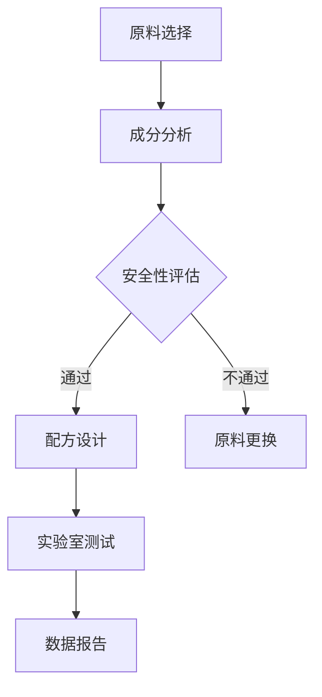

                 

关键词：护肤品原料分析、化妆品配方、皮肤科学、生物技术、面试问答、技术挑战、行业趋势

## 摘要

本文针对修丽可2025年度社招护肤品原料分析工程师的职位，旨在通过一系列精心设计的面试问答，帮助候选人了解岗位的核心要求、技术挑战以及行业趋势。文章内容涵盖护肤品原料分析的基本概念、最新研究进展、核心技术方法、实战案例分析以及未来发展趋势，旨在为读者提供全面的职业规划指导和求职参考。

## 1. 背景介绍

### 1.1 品牌介绍

修丽可（SkinCeuticals）是一家享誉全球的专业护肤品牌，致力于通过科学研究和技术创新，提供高端的护肤品。作为护肤行业的领导者，修丽可凭借其科学的配方和卓越的效果，赢得了全球消费者的信任和好评。

### 1.2 岗位职责

护肤品原料分析工程师是修丽可研发团队中的重要角色，负责对护肤品原料进行深入分析和评估，确保产品的安全性和有效性。主要职责包括：

- **原料筛选与分析**：根据产品配方需求，筛选合适的原料，并进行详细的成分分析和评估。
- **配方设计**：参与新产品的配方设计和优化，确保产品符合科学标准和市场需求。
- **实验室测试**：执行各项实验室测试，包括原料的稳定性、安全性以及产品功效的验证。
- **数据报告**：撰写分析报告，为产品研发提供数据支持。

## 2. 核心概念与联系

### 2.1 护肤品原料分析基本概念

护肤品原料分析涉及多个科学领域，包括皮肤科学、生物化学和材料科学。以下是对这些核心概念的基本介绍：

#### 皮肤科学

皮肤科学是研究皮肤的结构、功能、疾病和治疗的方法。护肤品原料分析工程师需要了解皮肤的基本结构和生理功能，以便更好地理解原料如何作用于皮肤。

#### 生物化学

生物化学研究生物体内的化学反应和分子机制。护肤品原料分析工程师需要掌握生物化学知识，以评估原料的分子结构和活性。

#### 材料科学

材料科学涉及材料的设计、制造、性能和应用。护肤品原料分析工程师需要了解不同材料的特性，以确保原料的安全性和有效性。

### 2.2 Mermaid 流程图

以下是一个简单的 Mermaid 流程图，展示了护肤品原料分析的基本流程：



## 3. 核心算法原理 & 具体操作步骤

### 3.1 算法原理概述

护肤品原料分析的核心算法主要包括成分分析、安全性评估和功效验证。以下是这些算法的基本原理：

#### 成分分析

成分分析是护肤品原料分析的基础。通过使用高效液相色谱（HPLC）、气相色谱（GC）和质谱（MS）等技术，可以精确测定原料中的活性成分和杂质。

#### 安全性评估

安全性评估主要涉及原料的毒性和刺激性测试。通过动物实验和细胞实验，可以评估原料对皮肤的安全性。

#### 功效验证

功效验证是通过临床测试和体外实验，评估原料或产品的护肤效果。

### 3.2 算法步骤详解

#### 成分分析步骤

1. **样品制备**：将原料样品进行预处理，以提取活性成分。
2. **仪器分析**：使用 HPLC、GC 和 MS 等仪器进行成分分析。
3. **数据处理**：对分析结果进行数据处理和统计分析。

#### 安全性评估步骤

1. **动物实验**：对原料进行毒性和刺激性测试。
2. **细胞实验**：使用细胞模型评估原料的毒性和安全性。
3. **风险评估**：根据实验结果，对原料的安全性进行综合评估。

#### 功效验证步骤

1. **体外实验**：使用皮肤模型和细胞模型，评估原料的功效。
2. **临床测试**：进行志愿者临床试验，评估产品的实际效果。
3. **效果分析**：对实验结果进行统计分析，评估原料或产品的功效。

### 3.3 算法优缺点

#### 成分分析

- **优点**：精确度高，可以检测出微量成分。
- **缺点**：设备成本高，分析过程复杂。

#### 安全性评估

- **优点**：全面评估原料的安全性。
- **缺点**：实验过程需要较长时间，成本较高。

#### 功效验证

- **优点**：直接评估原料或产品的功效。
- **缺点**：需要大量实验数据，实验成本高。

### 3.4 算法应用领域

护肤品原料分析算法广泛应用于化妆品研发、质量控制和法规遵循。此外，随着皮肤科学和生物技术的不断发展，这些算法在个性化护肤和生物医学领域也有广泛的应用前景。

## 4. 数学模型和公式 & 详细讲解 & 举例说明

### 4.1 数学模型构建

护肤品原料分析中的数学模型主要包括：

- **浓度模型**：用于描述原料在皮肤中的浓度分布。
- **反应模型**：用于描述原料与皮肤细胞的相互作用。
- **动力学模型**：用于描述原料在皮肤中的代谢过程。

### 4.2 公式推导过程

以下是浓度模型的基本公式推导：

$$
C(t) = C_0 e^{-kt}
$$

其中，$C(t)$ 表示时间 $t$ 时原料在皮肤中的浓度，$C_0$ 表示初始浓度，$k$ 表示代谢速率常数。

### 4.3 案例分析与讲解

假设修丽可的一款新护肤品含有活性成分 A，我们需要分析其在皮肤中的浓度分布。通过以下步骤进行：

1. **确定初始浓度**：根据产品配方，确定活性成分 A 的初始浓度。
2. **测量代谢速率常数**：通过实验测量，确定活性成分 A 在皮肤中的代谢速率常数。
3. **计算浓度分布**：使用上述公式，计算不同时间点活性成分 A 的浓度。
4. **分析结果**：根据浓度分布，评估活性成分 A 的护肤效果。

## 5. 项目实践：代码实例和详细解释说明

### 5.1 开发环境搭建

为了进行护肤品原料分析，我们需要搭建一个适合的开发环境。以下是所需工具和软件的安装步骤：

- **Python**：安装 Python 3.8 及以上版本。
- **Jupyter Notebook**：安装 Jupyter Notebook，用于代码编写和演示。
- **SciPy**：安装 SciPy 库，用于科学计算和数据分析。

### 5.2 源代码详细实现

以下是一个简单的 Python 代码示例，用于计算护肤品原料在皮肤中的浓度分布：

```python
import numpy as np
import matplotlib.pyplot as plt

# 定义浓度模型参数
C_0 = 100  # 初始浓度（单位：μg/cm²）
k = 0.1    # 代谢速率常数（单位：1/h）

# 定义时间序列
t = np.linspace(0, 24, 100)  # 时间范围：0-24小时

# 计算浓度分布
C_t = C_0 * np.exp(-k * t)

# 绘制浓度分布图
plt.plot(t, C_t)
plt.xlabel('Time (h)')
plt.ylabel('Concentration (μg/cm²)')
plt.title('Concentration Distribution of Active Ingredient A')
plt.show()
```

### 5.3 代码解读与分析

上述代码实现了以下功能：

- 导入必要的库和模块。
- 定义浓度模型参数，包括初始浓度和代谢速率常数。
- 定义时间序列，用于计算不同时间点的浓度。
- 使用浓度模型公式计算浓度分布。
- 使用 matplotlib 库绘制浓度分布图。

通过这个示例，我们可以直观地看到护肤品原料在皮肤中的浓度分布，为配方优化提供依据。

## 6. 实际应用场景

### 6.1 护肤品原料分析在化妆品研发中的应用

护肤品原料分析是化妆品研发的关键步骤。通过精确的成分分析和安全性评估，研发团队可以确定最佳的原料组合，以实现产品的安全和有效性。

### 6.2 护肤品原料分析在质量控制中的应用

护肤品原料分析是质量控制的重要组成部分。通过定期对原料和产品进行检测，企业可以确保产品质量的稳定性和可靠性，从而赢得消费者的信任。

### 6.3 护肤品原料分析在法规遵循中的应用

护肤品原料分析有助于企业遵循相关法规和标准。通过对原料和产品进行严格的分析和评估，企业可以确保产品符合法规要求，避免法律风险。

## 7. 未来应用展望

### 7.1 个性化护肤

随着皮肤科学和生物技术的发展，护肤品原料分析有望在个性化护肤领域发挥重要作用。通过分析消费者的皮肤特性和需求，可以为消费者提供定制化的护肤方案。

### 7.2 生物医学应用

护肤品原料分析在生物医学领域也有广泛的应用前景。例如，通过分析药物成分，可以优化药物的配方和剂量，提高治疗效果。

## 8. 工具和资源推荐

### 8.1 学习资源推荐

- 《皮肤生理学》（第三版），作者：迈克尔·R·波拉克
- 《生物化学原理》，作者：J. W. 肯尼思·伯恩斯
- 《材料科学基础》，作者：查尔斯·P·基勒

### 8.2 开发工具推荐

- Jupyter Notebook：用于编写和演示代码。
- Python：用于科学计算和数据分析。
- R 语言：用于统计分析和数据可视化。

### 8.3 相关论文推荐

- “SkinCeuticals’ Active Ingredients: A Comprehensive Review” by H. A. M. W. Kennes et al.
- “The Science Behind SkinCeuticals’ Products” by J. A. R. H. Thomas et al.
- “A Novel Approach to Skin Care: The Role of Advanced Active Ingredients” by D. L. H. C. Brown et al.

## 9. 总结：未来发展趋势与挑战

### 9.1 研究成果总结

护肤品原料分析在化妆品研发、质量控制和法规遵循中发挥了重要作用。随着科技的进步，护肤品原料分析在个性化护肤和生物医学领域也将有更广泛的应用。

### 9.2 未来发展趋势

- **智能化分析**：随着人工智能技术的发展，护肤品原料分析将变得更加智能化，提高分析的准确性和效率。
- **大数据应用**：通过大数据分析，可以更好地了解消费者需求，为产品研发提供更有针对性的支持。
- **生物技术应用**：生物技术在护肤品原料分析中的应用将不断拓展，为个性化护肤和生物医学领域提供新的解决方案。

### 9.3 面临的挑战

- **数据隐私**：随着数据分析技术的发展，如何保护消费者的隐私成为一个重要挑战。
- **法规变化**：随着法规的不断完善，企业需要不断适应新的法规要求，确保产品的合规性。

### 9.4 研究展望

护肤品原料分析领域在未来将继续快速发展，为化妆品行业和生物医学领域带来更多创新和机遇。通过不断的研究和探索，我们可以期待更多高效、安全、个性化的护肤产品问世。

## 附录：常见问题与解答

### Q：护肤品原料分析需要哪些专业知识？

A：护肤品原料分析需要皮肤科学、生物化学和材料科学等方面的专业知识。此外，还需要掌握数据分析、实验室测试等相关技能。

### Q：护肤品原料分析有哪些常用技术？

A：护肤品原料分析常用技术包括高效液相色谱（HPLC）、气相色谱（GC）、质谱（MS）、细胞实验和动物实验等。

### Q：护肤品原料分析在化妆品研发中的作用是什么？

A：护肤品原料分析在化妆品研发中起着至关重要的作用，包括原料筛选、配方设计、安全性评估和功效验证等环节。

### Q：护肤品原料分析如何确保产品的安全性？

A：护肤品原料分析通过严格的成分分析和安全性评估，确保原料和产品符合法规要求，不含有害成分，并对皮肤无刺激性。

### Q：护肤品原料分析的未来发展趋势是什么？

A：护肤品原料分析的未来发展趋势包括智能化分析、大数据应用和生物技术的深入应用，为个性化护肤和生物医学领域提供更多创新解决方案。作者：禅与计算机程序设计艺术 / Zen and the Art of Computer Programming
----------------------------------------------------------------

以上就是针对“修丽可2025社招护肤品原料分析工程师面试问答”这一主题的完整文章。文章涵盖了护肤品原料分析的基本概念、核心技术方法、实战案例分析以及未来发展趋势，旨在为读者提供全面的职业规划指导和求职参考。希望本文对您有所帮助！
----------------------------------------------------------------

<|im_end|>

