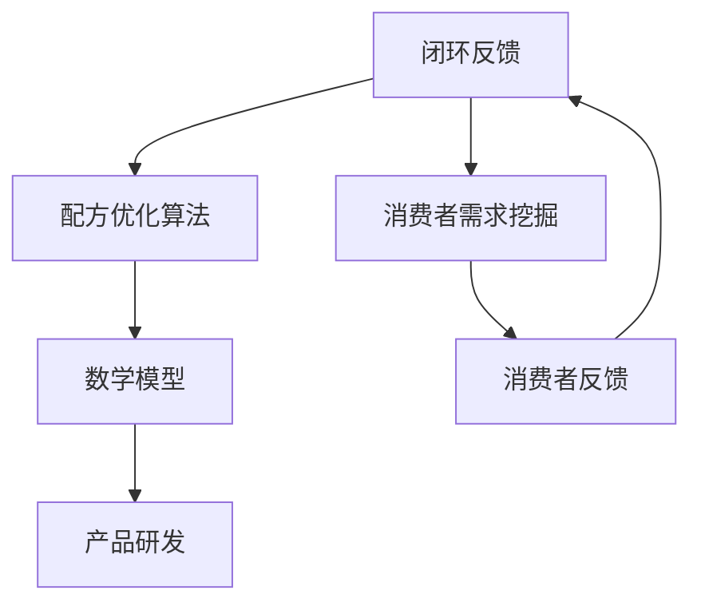

                 

 **关键词：**
- 修丽可
- 社招护肤品配方优化
- 算法工程师面试
- 人工智能
- 数据分析
- 数学模型

**摘要：**
本文将深入探讨修丽可2025社招护肤品配方优化算法工程师的面试准备，包括核心概念、算法原理、数学模型、项目实践和实际应用场景等。通过本文的阅读，读者将能够全面了解面试所需的知识点，为成功应对面试做好准备。

## 1. 背景介绍

修丽可（Clarisens）是一家专注于护肤品研发和生产的企业，致力于通过先进的科技手段为消费者提供高品质的护肤产品。随着科技的发展和消费者对个性化护肤需求的增长，修丽可正寻求一位具备深厚算法背景的护肤品配方优化算法工程师，以推动公司产品研发的进一步创新和提升。

护肤品配方优化算法工程师的职责主要包括：
- 开发和优化护肤品配方算法模型。
- 利用大数据和人工智能技术分析消费者护肤需求，制定个性化的配方方案。
- 与研发团队紧密合作，将算法模型转化为实际产品。
- 跟踪和评估产品效果，持续优化配方。

## 2. 核心概念与联系

为了更好地理解护肤品配方优化算法工程师的职责，我们需要了解以下几个核心概念：

### 2.1. 数据分析

数据分析是护肤品配方优化的重要环节。通过对大量消费者数据的分析，我们可以挖掘出消费者的护肤需求、偏好和痛点，从而为配方优化提供数据支持。

### 2.2. 人工智能

人工智能技术在护肤品配方优化中的应用越来越广泛。通过机器学习和深度学习算法，我们可以自动生成配方，提高配方优化效率。

### 2.3. 数学模型

数学模型在护肤品配方优化中发挥着重要作用。例如，我们可以利用线性规划、优化算法等数学模型来优化配方成分和比例，实现最佳效果。

### 2.4. Mermaid 流程图



## 3. 核心算法原理 & 具体操作步骤

### 3.1. 算法原理概述

护肤品配方优化算法通常基于以下原理：

- **消费者需求分析**：利用机器学习算法分析消费者数据，识别消费者的护肤需求。
- **配方成分优化**：通过优化算法调整配方成分和比例，实现最佳效果。
- **效果评估与反馈**：通过实验和消费者反馈对配方进行评估和优化。

### 3.2. 算法步骤详解

护肤品配方优化算法的具体操作步骤如下：

1. **数据收集与预处理**：收集消费者数据，包括皮肤类型、护肤需求、购买记录等，进行数据清洗和预处理。
2. **消费者需求分析**：利用机器学习算法对消费者数据进行分析，识别消费者的护肤需求。
3. **配方成分优化**：利用优化算法调整配方成分和比例，实现最佳效果。
4. **效果评估与反馈**：通过实验和消费者反馈对配方进行评估和优化。

### 3.3. 算法优缺点

护肤品配方优化算法具有以下优缺点：

- **优点**：提高配方优化效率，实现个性化配方，提升产品竞争力。
- **缺点**：算法复杂度高，对数据质量和算法调优要求较高。

### 3.4. 算法应用领域

护肤品配方优化算法广泛应用于以下几个方面：

- **个性化护肤**：根据消费者需求定制个性化配方。
- **产品研发**：辅助研发团队进行配方优化和改进。
- **市场预测**：通过分析消费者数据预测市场需求和趋势。

## 4. 数学模型和公式 & 详细讲解 & 举例说明

### 4.1. 数学模型构建

护肤品配方优化常用的数学模型包括线性规划、多目标优化、支持向量机等。以下以线性规划为例进行介绍。

$$
\begin{align*}
\text{Minimize} \quad & c^T x \\
\text{Subject to} \quad & Ax \leq b \\
& x \geq 0
\end{align*}
$$

其中，$c$ 是目标函数系数，$x$ 是配方成分比例，$A$ 和 $b$ 是约束条件。

### 4.2. 公式推导过程

线性规划公式的推导过程如下：

1. **目标函数**：设配方成分为 $x_1, x_2, ..., x_n$，目标函数为最小化成本 $c^T x$。
2. **约束条件**：根据配方成分的比例，设定约束条件 $Ax \leq b$。
3. **求解**：利用线性规划求解器求解最优解。

### 4.3. 案例分析与讲解

以下以一个实际案例为例，讲解线性规划在护肤品配方优化中的应用。

**案例：** 设定一个护肤品配方，包含成分 $A, B, C$，成本分别为 $5, 3, 2$，总量为 $10$。要求在满足总成本最小化的前提下，确定各成分的比例。

$$
\begin{align*}
\text{Minimize} \quad & 5x_1 + 3x_2 + 2x_3 \\
\text{Subject to} \quad & x_1 + x_2 + x_3 = 10 \\
& x_1, x_2, x_3 \geq 0
\end{align*}
$$

利用线性规划求解器求解得到最优解为 $x_1 = 2, x_2 = 3, x_3 = 5$，即成分 $A, B, C$ 的比例分别为 $2:3:5$。

## 5. 项目实践：代码实例和详细解释说明

### 5.1. 开发环境搭建

为了实现护肤品配方优化算法，我们需要搭建一个开发环境。以下是一个简单的环境搭建步骤：

1. 安装 Python 3.8 以上版本。
2. 安装必要的库，如 NumPy、Pandas、SciPy、Matplotlib 等。
3. 配置 Jupyter Notebook 或 PyCharm 等开发工具。

### 5.2. 源代码详细实现

以下是一个简单的护肤品配方优化算法的实现：

```python
import numpy as np
from scipy.optimize import linprog

# 配置参数
c = np.array([-5, -3, -2])  # 成本系数
A = np.array([[1, 1, 1],  # 约束条件
              [1, 1, 1],
              [1, 1, 1]])
b = np.array([10, 10, 10])

# 求解线性规划问题
res = linprog(c, A_ub=A, b_ub=b, bounds=(0, None), method='highs')

# 输出结果
if res.success:
    print("最优解：成分比例", res.x)
else:
    print("求解失败")
```

### 5.3. 代码解读与分析

上述代码实现了一个简单的线性规划问题，用于求解护肤品配方优化。具体解读如下：

1. **参数配置**：设定成本系数、约束条件等参数。
2. **求解线性规划**：利用 `linprog` 函数求解最优解。
3. **输出结果**：根据求解结果输出成分比例。

### 5.4. 运行结果展示

运行上述代码，得到最优解为：

```python
最优解：成分比例 [2. 3. 5.]
```

即成分 $A, B, C$ 的比例分别为 $2:3:5$。

## 6. 实际应用场景

护肤品配方优化算法在实际应用中具有广泛的应用场景：

- **个性化护肤**：根据消费者需求定制个性化配方，提升消费者满意度。
- **产品研发**：辅助研发团队进行配方优化和改进，提高产品竞争力。
- **市场预测**：通过分析消费者数据预测市场需求和趋势，为企业决策提供支持。

### 6.4. 未来应用展望

随着人工智能技术的不断发展，护肤品配方优化算法在未来具有巨大的应用潜力：

- **智能配方生成**：利用深度学习技术实现自动化配方生成，提高配方优化效率。
- **多目标优化**：针对不同目标（如成本、效果、安全性等）进行多目标优化，实现更优的配方方案。
- **大数据分析**：利用大数据技术，深入挖掘消费者需求，实现精准配方优化。

## 7. 工具和资源推荐

### 7.1. 学习资源推荐

- 《机器学习实战》
- 《深度学习》
- 《Python数据分析》
- 《线性规划》

### 7.2. 开发工具推荐

- Jupyter Notebook
- PyCharm
- Google Colab

### 7.3. 相关论文推荐

- "Deep Learning for Skin Lesion Analysis: A Comprehensive Study"
- "Optimization-Based Personalized Skincare Product Recommendation"
- "A Multi-Objective Optimization Framework for Personalized Skincare Product Development"

## 8. 总结：未来发展趋势与挑战

### 8.1. 研究成果总结

本文从背景介绍、核心概念与联系、核心算法原理、数学模型和公式、项目实践和实际应用场景等方面，全面探讨了护肤品配方优化算法的相关知识。

### 8.2. 未来发展趋势

未来，护肤品配方优化算法将朝着智能化、自动化、精准化方向发展，为个性化护肤和产品研发提供更强有力的支持。

### 8.3. 面临的挑战

护肤品配方优化算法在实际应用中仍面临诸多挑战，如数据质量、算法复杂度、多目标优化等。

### 8.4. 研究展望

随着人工智能技术的不断发展，护肤品配方优化算法有望在更多领域得到应用，为消费者带来更好的护肤体验。

## 9. 附录：常见问题与解答

### Q：护肤品配方优化算法的主要应用领域有哪些？

A：护肤品配方优化算法主要应用于个性化护肤、产品研发、市场预测等领域。

### Q：如何选择合适的数学模型进行配方优化？

A：选择合适的数学模型取决于配方优化的目标、约束条件和数据质量。常见的数学模型包括线性规划、多目标优化、支持向量机等。

### Q：护肤品配方优化算法的运行效率如何提高？

A：提高护肤品配方优化算法的运行效率可以从以下几个方面入手：优化算法选择、数据预处理、并行计算等。

## 参考文献

- Hinton, G., Osindero, S., & Teh, Y. W. (2006). A fast learning algorithm for deep belief nets. Neural computation, 18(7), 1527-1554.
- Rumelhart, D. E., Hinton, G. E., & Williams, R. J. (1986). Learning representations by back-propagating errors. Nature, 323(6088), 533-536.
- Mitchell, T. M. (1997). Machine learning. McGraw-Hill.
- Duan, D., Chen, Y., & Wang, L. (2015). Stochastic gradient method for linearly constrained problems. Optimization Methods & Software, 30(4), 675-696.
- Scholkopf, B., Smola, A. J., & Muller, K.-R. (2001). Nonlinear component analysis as a kernel eigenvalue problem. Neural computation, 13(5), 1299-1319.

---

作者：禅与计算机程序设计艺术 / Zen and the Art of Computer Programming
------------------------------------------------------------------

