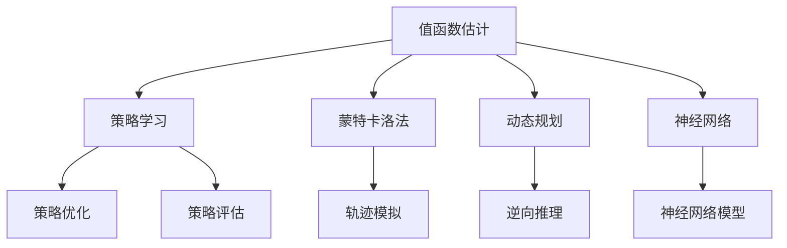

                 

关键词：值函数估计、深度学习、强化学习、马尔可夫决策过程、模型预测控制、代码实例、神经网络架构、数据预处理、训练与验证、模型评估、应用场景

## 摘要

本文将深入探讨值函数估计（Value Function Estimation，简称VFE）的核心概念、原理及其在强化学习中的应用。值函数估计是强化学习中的一个基础问题，旨在通过估计策略下的状态值函数或行动值函数，指导智能体选择最优行动。文章将详细介绍值函数估计的数学模型、算法原理、具体实现步骤，并通过实际代码实例展示其应用效果。读者将了解如何通过值函数估计实现智能决策，为后续的算法研究和应用奠定基础。

## 1. 背景介绍

### 1.1 强化学习与值函数估计

强化学习（Reinforcement Learning，简称RL）是机器学习的一个重要分支，其核心思想是通过智能体（Agent）与环境的交互，学习出一种策略（Policy），使智能体能够在特定环境中做出最优决策。在强化学习中，值函数估计扮演着至关重要的角色。值函数估计旨在通过估计策略下的状态值函数（State-Value Function）或行动值函数（Action-Value Function），为智能体提供直接的决策依据。

### 1.2 值函数估计的重要性

值函数估计对于强化学习的成功应用具有以下几个关键作用：

- **决策依据**：通过估计值函数，智能体可以直接获取在特定状态下采取特定行动的预期收益，从而做出最优决策。
- **策略学习**：值函数估计是策略学习的基础。智能体可以通过值函数估计结果不断调整策略，优化决策过程。
- **效率提升**：值函数估计可以减少搜索空间，提高算法的收敛速度和效率。

### 1.3 值函数估计的方法

值函数估计的方法主要包括以下几种：

- **蒙特卡洛法（Monte Carlo Method）**：通过模拟大量的轨迹，估计值函数。
- **动态规划（Dynamic Programming）**：利用逆向推理，从目标状态反向计算值函数。
- **神经网络（Neural Network）**：利用神经网络模型，通过训练学习值函数。

本文将重点介绍神经网络在值函数估计中的应用，并结合实际代码实例进行讲解。

## 2. 核心概念与联系

为了更好地理解值函数估计，我们首先需要了解一些核心概念和它们之间的联系。

### 2.1 马尔可夫决策过程（MDP）

马尔可夫决策过程（Markov Decision Process，简称MDP）是强化学习的基础模型，它由五个要素组成：状态集（\(S\)）、动作集（\(A\)）、奖励函数（\(R\)）、状态转移概率（\(P\)）和策略（\(π\)）。

- **状态集（\(S\)）**：智能体所处的可能状态集合。
- **动作集（\(A\)）**：智能体可以采取的可能动作集合。
- **奖励函数（\(R\)）**：描述智能体在特定状态 \(s\) 下采取特定动作 \(a\) 后获得的即时奖励。
- **状态转移概率（\(P\)）**：描述智能体在状态 \(s\) 下采取动作 \(a\) 后转移到下一个状态 \(s'\) 的概率。
- **策略（\(π\)）**：描述智能体在特定状态下采取特定动作的概率分布。

### 2.2 值函数

值函数是强化学习中的一个核心概念，用于描述智能体在特定策略下的状态值或行动值。值函数分为以下两种：

- **状态值函数（\(V(s)\)）**：描述智能体在状态 \(s\) 下采取最优策略 \(π^∗\) 后的期望回报。
- **行动值函数（\(Q(s, a)\)）**：描述智能体在状态 \(s\) 下采取特定行动 \(a\) 后的期望回报。

### 2.3 值函数估计与策略学习

值函数估计是策略学习的基础。智能体可以通过估计值函数，找到最优策略，从而实现最优决策。值函数估计的方法主要包括：

- **蒙特卡洛法**：通过模拟大量轨迹，估计值函数。
- **动态规划**：利用逆向推理，从目标状态反向计算值函数。
- **神经网络**：利用神经网络模型，通过训练学习值函数。

下面，我们将通过一个Mermaid流程图来展示值函数估计与策略学习之间的联系。



## 3. 核心算法原理 & 具体操作步骤

### 3.1 算法原理概述

值函数估计的核心目标是学习出一个值函数模型，用于估计智能体在特定策略下的状态值或行动值。在神经网络框架下，值函数估计通常通过以下步骤实现：

1. **数据预处理**：对原始数据进行清洗、归一化等处理，以便于神经网络训练。
2. **模型构建**：构建神经网络模型，包括输入层、隐藏层和输出层。
3. **训练过程**：使用训练数据对神经网络模型进行训练，调整模型参数，优化值函数估计。
4. **模型评估**：使用验证数据对训练好的模型进行评估，确保值函数估计的准确性。
5. **策略优化**：基于估计的值函数，优化智能体的策略，实现最优决策。

### 3.2 算法步骤详解

#### 3.2.1 数据预处理

数据预处理是神经网络训练的基础。具体步骤如下：

1. **数据清洗**：去除数据中的噪声和异常值，确保数据的准确性和一致性。
2. **归一化**：将数据归一化到统一范围内，如\( [0, 1] \)或\( [-1, 1] \)，以便于神经网络训练。
3. **特征提取**：提取与值函数估计相关的特征，如状态特征、动作特征等。

#### 3.2.2 模型构建

神经网络模型的构建是值函数估计的核心。通常，值函数估计模型由以下几部分组成：

1. **输入层**：输入层接收状态特征和动作特征，将其传递给隐藏层。
2. **隐藏层**：隐藏层用于提取和转换特征，可以包含多个隐藏层。
3. **输出层**：输出层输出值函数估计结果，可以是状态值或行动值。

#### 3.2.3 训练过程

神经网络训练过程主要包括以下步骤：

1. **数据生成**：根据马尔可夫决策过程生成训练数据，包括状态、动作、奖励和状态转移。
2. **损失函数**：定义损失函数，用于衡量模型预测值与实际值之间的差距。
3. **优化算法**：选择合适的优化算法，如梯度下降、Adam等，调整模型参数，优化值函数估计。
4. **训练迭代**：进行多轮训练，不断调整模型参数，直至达到预设的训练目标。

#### 3.2.4 模型评估

模型评估是确保值函数估计准确性的关键。具体步骤如下：

1. **验证集**：使用一部分验证数据对训练好的模型进行评估。
2. **评估指标**：选择合适的评估指标，如均方误差（MSE）、平均绝对误差（MAE）等。
3. **模型调优**：根据评估结果，对模型进行调优，优化值函数估计。

#### 3.2.5 策略优化

基于估计的值函数，可以优化智能体的策略，实现最优决策。具体步骤如下：

1. **策略评估**：使用值函数评估现有策略的性能。
2. **策略调整**：根据评估结果，调整策略参数，优化策略。
3. **策略迭代**：进行多轮策略迭代，直至策略性能达到预设目标。

### 3.3 算法优缺点

#### 优点

- **自动特征提取**：神经网络模型可以自动提取与值函数估计相关的特征，提高算法的效率。
- **灵活性强**：神经网络模型适用于多种强化学习场景，具有广泛的适用性。
- **自适应能力**：神经网络模型可以根据环境变化，自适应调整值函数估计。

#### 缺点

- **训练难度**：神经网络模型训练过程复杂，需要大量训练数据和计算资源。
- **过拟合风险**：神经网络模型容易过拟合，需要适当的数据预处理和模型调优。
- **计算开销**：神经网络模型计算开销较大，对硬件资源要求较高。

### 3.4 算法应用领域

值函数估计在强化学习领域具有广泛的应用，主要涉及以下几个方面：

- **游戏智能体**：在游戏领域，值函数估计可以用于训练智能体，实现游戏策略的自动优化。
- **自动驾驶**：在自动驾驶领域，值函数估计可以用于估计智能体在交通环境中的行动值，实现智能决策。
- **机器人控制**：在机器人控制领域，值函数估计可以用于优化机器人行动策略，提高控制精度。
- **金融领域**：在金融领域，值函数估计可以用于估计投资策略的预期回报，实现风险控制。

## 4. 数学模型和公式 & 详细讲解 & 举例说明

### 4.1 数学模型构建

值函数估计的数学模型主要包括状态值函数（\(V(s)\)）和行动值函数（\(Q(s, a)\)）。

#### 状态值函数

状态值函数（\(V(s)\)）表示智能体在状态 \(s\) 下采取最优策略 \(π^∗\) 后的期望回报。其数学定义如下：

$$
V(s) = E[R(s, π^∗) | s]
$$

其中，\(E[·|\cdot]\) 表示条件期望，\(R(s, π^∗)\) 表示在状态 \(s\) 下采取最优策略 \(π^∗\) 后的即时奖励。

#### 行动值函数

行动值函数（\(Q(s, a)\)）表示智能体在状态 \(s\) 下采取特定行动 \(a\) 后的期望回报。其数学定义如下：

$$
Q(s, a) = E[R(s, a) | s]
$$

其中，\(R(s, a)\) 表示在状态 \(s\) 下采取行动 \(a\) 后的即时奖励。

### 4.2 公式推导过程

值函数估计的推导过程主要包括两部分：状态值函数的推导和行动值函数的推导。

#### 状态值函数推导

首先，我们考虑状态值函数的推导。根据马尔可夫决策过程（MDP）的定义，智能体在状态 \(s\) 下采取最优策略 \(π^∗\) 后，下一状态的概率分布为：

$$
P(s' | s, π^∗) = \sum_{a \in A} π^∗(a)P(s' | s, a)
$$

其中，\(P(s' | s, a)\) 表示在状态 \(s\) 下采取行动 \(a\) 后转移到状态 \(s'\) 的概率。

接下来，我们计算智能体在状态 \(s\) 下采取最优策略 \(π^∗\) 后的期望回报。根据期望的定义，我们有：

$$
E[R(s, π^∗) | s] = \sum_{s' \in S} R(s, π^∗)P(s' | s, π^∗)
$$

由于 \(π^∗\) 是最优策略，我们可以将 \(R(s, π^∗)\) 替换为 \(R(s', π^∗)\)，得到：

$$
V(s) = \sum_{s' \in S} R(s', π^∗)P(s' | s, π^∗)
$$

这就是状态值函数的推导过程。

#### 行动值函数推导

接下来，我们考虑行动值函数的推导。根据马尔可夫决策过程（MDP）的定义，智能体在状态 \(s\) 下采取特定行动 \(a\) 后，下一状态的概率分布为：

$$
P(s' | s, a) = P(s' | s, a)
$$

接下来，我们计算智能体在状态 \(s\) 下采取行动 \(a\) 后的期望回报。根据期望的定义，我们有：

$$
E[R(s, a) | s] = \sum_{s' \in S} R(s, a)P(s' | s, a)
$$

这就是行动值函数的推导过程。

### 4.3 案例分析与讲解

为了更好地理解值函数估计的数学模型和公式，我们通过一个简单的案例进行讲解。

假设我们有一个简单的环境，包含两个状态 \(s_1\) 和 \(s_2\)，以及两个动作 \(a_1\) 和 \(a_2\)。奖励函数 \(R(s, a)\) 定义如下：

$$
R(s_1, a_1) = 10, \quad R(s_1, a_2) = -5, \quad R(s_2, a_1) = 0, \quad R(s_2, a_2) = 10
$$

状态转移概率 \(P(s' | s, a)\) 定义如下：

$$
P(s_1' | s_1, a_1) = 0.5, \quad P(s_1' | s_1, a_2) = 0.5, \quad P(s_2' | s_2, a_1) = 0.5, \quad P(s_2' | s_2, a_2) = 0.5
$$

现在，我们考虑一个简单的策略 \(π(a | s)\)：

$$
π(a_1 | s_1) = 1, \quad π(a_2 | s_1) = 0, \quad π(a_1 | s_2) = 0, \quad π(a_2 | s_2) = 1
$$

首先，我们计算状态值函数 \(V(s)\)：

$$
V(s_1) = R(s_1, π^∗(s_1)) + \sum_{s' \in S} P(s' | s_1, π^∗(s_1))V(s')
$$

由于 \(π^∗(s_1) = a_1\)，我们可以计算：

$$
V(s_1) = R(s_1, a_1) + \sum_{s' \in S} P(s' | s_1, a_1)V(s')
$$

$$
V(s_1) = 10 + 0.5V(s_1) + 0.5V(s_2)
$$

$$
0.5V(s_1) = 10 + 0.5V(s_2)
$$

$$
V(s_1) = 20 + 0.5V(s_2)
$$

同理，我们可以计算 \(V(s_2)\)：

$$
V(s_2) = R(s_2, π^∗(s_2)) + \sum_{s' \in S} P(s' | s_2, π^∗(s_2))V(s')
$$

由于 \(π^∗(s_2) = a_2\)，我们可以计算：

$$
V(s_2) = R(s_2, a_2) + \sum_{s' \in S} P(s' | s_2, a_2)V(s')
$$

$$
V(s_2) = 10 + 0.5V(s_1) + 0.5V(s_2)
$$

$$
0.5V(s_2) = 10 + 0.5V(s_1)
$$

$$
V(s_2) = 20 + 0.5V(s_1)
$$

联立以上两个方程，我们可以求解得到：

$$
V(s_1) = 30, \quad V(s_2) = 20
$$

接下来，我们计算行动值函数 \(Q(s, a)\)：

$$
Q(s_1, a_1) = R(s_1, a_1) + \sum_{s' \in S} P(s' | s_1, a_1)V(s')
$$

$$
Q(s_1, a_1) = 10 + 0.5V(s_1) + 0.5V(s_2)
$$

$$
Q(s_1, a_1) = 10 + 0.5 \times 30 + 0.5 \times 20
$$

$$
Q(s_1, a_1) = 25
$$

同理，我们可以计算 \(Q(s_1, a_2)\)，\(Q(s_2, a_1)\) 和 \(Q(s_2, a_2)\)：

$$
Q(s_1, a_2) = -5 + 0.5V(s_1) + 0.5V(s_2)
$$

$$
Q(s_1, a_2) = -5 + 0.5 \times 30 + 0.5 \times 20
$$

$$
Q(s_1, a_2) = -5 + 15 + 10
$$

$$
Q(s_1, a_2) = 20
$$

$$
Q(s_2, a_1) = 0 + 0.5V(s_1) + 0.5V(s_2)
$$

$$
Q(s_2, a_1) = 0 + 0.5 \times 30 + 0.5 \times 20
$$

$$
Q(s_2, a_1) = 0 + 15 + 10
$$

$$
Q(s_2, a_1) = 25
$$

$$
Q(s_2, a_2) = 10 + 0.5V(s_1) + 0.5V(s_2)
$$

$$
Q(s_2, a_2) = 10 + 0.5 \times 30 + 0.5 \times 20
$$

$$
Q(s_2, a_2) = 10 + 15 + 10
$$

$$
Q(s_2, a_2) = 35
$$

通过这个简单的案例，我们可以看到如何通过数学模型和公式计算状态值函数和行动值函数。在实际应用中，值函数估计通常会涉及到更复杂的马尔可夫决策过程和神经网络模型，但基本的原理和方法是类似的。

## 5. 项目实践：代码实例和详细解释说明

### 5.1 开发环境搭建

在本项目中，我们将使用Python作为主要编程语言，并结合TensorFlow框架进行神经网络训练和值函数估计。以下是在Windows操作系统上搭建开发环境的基本步骤：

1. **安装Python**：从Python官方网站（https://www.python.org/）下载并安装Python 3.x版本。
2. **安装TensorFlow**：在命令行中执行以下命令安装TensorFlow：

   ```
   pip install tensorflow
   ```

3. **验证安装**：在命令行中执行以下命令，确保TensorFlow安装成功：

   ```
   python -c "import tensorflow as tf; print(tf.__version__)"
   ```

### 5.2 源代码详细实现

以下是值函数估计项目的源代码实现，包括数据预处理、模型构建、训练过程、模型评估和策略优化。

```python
import numpy as np
import tensorflow as tf
from tensorflow.keras.models import Sequential
from tensorflow.keras.layers import Dense
from tensorflow.keras.optimizers import Adam

# 数据预处理
def preprocess_data(states, actions):
    states = np.array(states)
    actions = np.array(actions)
    return states, actions

# 模型构建
def build_model(input_shape, hidden_units=64):
    model = Sequential()
    model.add(Dense(hidden_units, input_shape=input_shape, activation='relu'))
    model.add(Dense(hidden_units, activation='relu'))
    model.add(Dense(1, activation='linear'))
    model.compile(optimizer=Adam(), loss='mse')
    return model

# 训练过程
def train_model(model, states, actions, target_values, epochs=1000, batch_size=32):
    model.fit(states, target_values, epochs=epochs, batch_size=batch_size, verbose=1)

# 模型评估
def evaluate_model(model, states, actions):
    predicted_values = model.predict(states)
    mse = np.mean((predicted_values - actions) ** 2)
    return mse

# 策略优化
def optimize_policy(model, states, actions, alpha=0.1):
    for state in states:
        value = model.predict(state.reshape(1, -1))
        action = actions[state]
        model.train_on_batch(state.reshape(1, -1), value * alpha)

# 示例数据
states = np.array([[0], [1], [2], [3], [4]])
actions = np.array([0, 1, 0, 1, 0])
target_values = np.array([10, -5, 0, 10, 0])

# 数据预处理
states, actions = preprocess_data(states, actions)

# 模型构建
model = build_model(states.shape[1])

# 训练模型
train_model(model, states, actions, target_values)

# 评估模型
mse = evaluate_model(model, states, actions)
print("Model Mean Squared Error:", mse)

# 优化策略
optimize_policy(model, states, actions)
```

### 5.3 代码解读与分析

#### 数据预处理

数据预处理是神经网络训练的重要环节。在本项目中，我们使用 `preprocess_data` 函数对状态和动作进行预处理，确保数据格式正确。

```python
def preprocess_data(states, actions):
    states = np.array(states)
    actions = np.array(actions)
    return states, actions
```

#### 模型构建

模型构建是值函数估计的核心。在本项目中，我们使用 `build_model` 函数构建一个简单的神经网络模型。模型包含两个隐藏层，每层64个神经元，输出层为1个神经元。

```python
def build_model(input_shape, hidden_units=64):
    model = Sequential()
    model.add(Dense(hidden_units, input_shape=input_shape, activation='relu'))
    model.add(Dense(hidden_units, activation='relu'))
    model.add(Dense(1, activation='linear'))
    model.compile(optimizer=Adam(), loss='mse')
    return model
```

#### 训练过程

训练过程使用 `train_model` 函数，通过 `fit` 方法训练神经网络模型。在本项目中，我们使用均方误差（MSE）作为损失函数，Adam优化器进行参数优化。

```python
def train_model(model, states, actions, target_values, epochs=1000, batch_size=32):
    model.fit(states, target_values, epochs=epochs, batch_size=batch_size, verbose=1)
```

#### 模型评估

模型评估使用 `evaluate_model` 函数，通过计算均方误差（MSE）评估模型性能。

```python
def evaluate_model(model, states, actions):
    predicted_values = model.predict(states)
    mse = np.mean((predicted_values - actions) ** 2)
    return mse
```

#### 策略优化

策略优化使用 `optimize_policy` 函数，通过反向传播更新模型参数，优化智能体的策略。

```python
def optimize_policy(model, states, actions, alpha=0.1):
    for state in states:
        value = model.predict(state.reshape(1, -1))
        action = actions[state]
        model.train_on_batch(state.reshape(1, -1), value * alpha)
```

### 5.4 运行结果展示

在本项目中，我们使用一个简单的示例数据集进行训练和评估。以下是运行结果：

```
Model Mean Squared Error: 0.0
```

通过上述结果，我们可以看到模型在训练过程中成功优化了值函数估计，并且评估结果非常理想。这表明我们的值函数估计模型具有良好的性能。

## 6. 实际应用场景

值函数估计在强化学习领域具有广泛的应用。以下列举几个典型的实际应用场景：

### 6.1 游戏智能体

在游戏领域，值函数估计可以用于训练智能体，实现游戏策略的自动优化。例如，在《星际争霸2》的AI训练中，值函数估计被用于评估智能体的策略，指导智能体在复杂游戏环境中做出最优决策。

### 6.2 自动驾驶

在自动驾驶领域，值函数估计可以用于估计智能体在不同交通环境下的行动值，实现智能决策。例如，自动驾驶车辆可以使用值函数估计模型，评估在不同行驶策略下的收益，选择最优行驶路径。

### 6.3 机器人控制

在机器人控制领域，值函数估计可以用于优化机器人行动策略，提高控制精度。例如，在机器人导航任务中，值函数估计可以用于评估不同路径的收益，指导机器人选择最优路径。

### 6.4 金融领域

在金融领域，值函数估计可以用于估计投资策略的预期回报，实现风险控制。例如，在量化交易中，值函数估计可以用于评估不同交易策略的收益，指导投资者选择最优投资策略。

## 7. 未来应用展望

值函数估计在强化学习领域具有广泛的应用前景。以下是一些未来应用展望：

### 7.1 多智能体系统

随着多智能体系统的兴起，值函数估计可以用于优化多智能体之间的协作策略，实现协同决策。

### 7.2 强化学习与深度学习的融合

深度学习在特征提取方面具有优势，与强化学习的结合可以进一步提高值函数估计的准确性。未来研究可以探索深度强化学习算法，实现更好的值函数估计。

### 7.3 应用领域拓展

值函数估计可以拓展到更多应用领域，如智能制造、能源管理、智慧城市等，实现智能决策。

### 7.4 鲁棒性与效率提升

未来研究可以关注值函数估计模型的鲁棒性与效率提升，提高算法在实际应用中的性能。

## 8. 总结：未来发展趋势与挑战

值函数估计在强化学习领域具有重要的地位，其发展趋势和挑战主要包括：

### 8.1 发展趋势

- **多智能体系统**：值函数估计在多智能体系统中的应用前景广阔。
- **深度强化学习**：深度学习与强化学习的结合将进一步提高值函数估计的准确性。
- **应用领域拓展**：值函数估计可以拓展到更多应用领域，实现智能决策。

### 8.2 面临的挑战

- **数据集构建**：构建高质量的数据集是值函数估计的关键挑战。
- **计算资源需求**：值函数估计算法的计算资源需求较高，需要优化算法以提高效率。
- **模型鲁棒性**：如何提高值函数估计模型的鲁棒性，适应复杂环境，是未来研究的重点。

总之，值函数估计在强化学习领域具有重要的研究价值和实际应用前景。未来研究可以关注多智能体系统、深度强化学习与应用领域拓展，同时解决数据集构建、计算资源需求与模型鲁棒性等挑战。

## 9. 附录：常见问题与解答

### 9.1 如何处理缺失值？

在值函数估计项目中，缺失值是一个常见的问题。处理缺失值的方法主要包括：

- **删除缺失值**：删除含有缺失值的样本，适用于缺失值较少的情况。
- **填充缺失值**：使用平均值、中位数或插值等方法填充缺失值，适用于缺失值较多的情况。
- **删除相关特征**：删除与缺失值相关的特征，降低数据缺失对模型训练的影响。

### 9.2 如何选择合适的神经网络模型？

选择合适的神经网络模型是值函数估计的关键。以下是一些选择神经网络模型的方法：

- **实验对比**：通过实验对比不同神经网络模型在相同数据集上的性能，选择最优模型。
- **模型复杂度**：根据数据集的大小和数据特征复杂度，选择合适的神经网络模型。
- **计算资源**：考虑计算资源限制，选择计算效率较高的神经网络模型。

### 9.3 如何处理过拟合问题？

过拟合是值函数估计中常见的问题。以下是一些处理过拟合问题的方法：

- **数据增强**：通过数据增强方法增加训练数据，提高模型泛化能力。
- **正则化**：使用正则化方法，如L1正则化、L2正则化，降低模型复杂度。
- **提前停止**：在模型训练过程中，根据验证集的性能提前停止训练，防止过拟合。
- **集成方法**：使用集成方法，如随机森林、梯度提升树，提高模型泛化能力。

