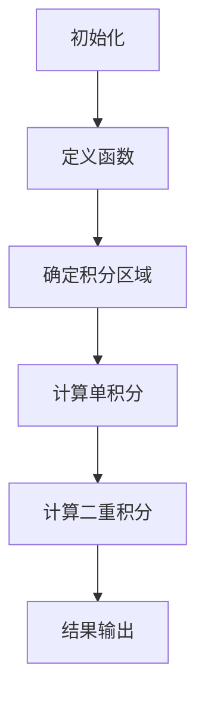

                 

关键词：数学家思维，富比尼原理，算法，编程，计算机科学

> 摘要：本文旨在探讨数学家富比尼原理在计算机科学中的应用，分析其核心概念、原理以及算法实现，并通过实例演示，揭示其在实际编程中的价值。

## 1. 背景介绍

### 富比尼原理简介

富比尼原理（Fubini's Theorem）是数学分析中的一个重要定理，它描述了在满足一定条件下，二重积分可以通过先对其中一个变量积分，然后再对另一个变量积分来计算。这一原理不仅在数学领域具有深远影响，也在计算机科学中有着广泛的应用。

### 富比尼原理在计算机科学中的应用

随着计算机技术的发展，富比尼原理的应用范围不断扩展。例如，在图像处理、信号处理、计算几何等领域，富比尼原理都发挥了重要作用。特别是在算法设计中，富比尼原理提供了一种有效的思路，帮助程序员解决复杂的问题。

## 2. 核心概念与联系

### 富比尼原理的核心概念

富比尼原理的核心在于将二重积分分解为两个单积分。具体来说，给定一个函数\( f(x, y) \)，定义在矩形区域\( R = [a, b] \times [c, d] \)上，富比尼原理指出：

$$
\iint\limits_R f(x, y) \, dx \, dy = \int\limits_a^b \left( \int\limits_c^d f(x, y) \, dy \right) dx = \int\limits_c^d \left( \int\limits_a^b f(x, y) \, dx \right) dy
$$

### 富比尼原理在计算机科学中的架构

为了更好地理解富比尼原理在计算机科学中的应用，我们可以使用Mermaid流程图来描述其核心架构。



## 3. 核心算法原理 & 具体操作步骤

### 3.1 算法原理概述

富比尼原理的核心思想是将一个复杂的二重积分问题分解为两个相对简单的单积分问题。这种方法不仅简化了计算过程，还提高了算法的效率。

### 3.2 算法步骤详解

1. **初始化**：设置函数\( f(x, y) \)以及积分区域\( R \)。
2. **定义函数**：根据问题需求，确定函数\( f(x, y) \)的形式。
3. **确定积分区域**：明确积分区域\( R \)的边界。
4. **计算单积分**：对函数\( f(x, y) \)在\( y \)方向上积分，得到一个关于\( x \)的函数。
5. **计算二重积分**：对上一步得到的函数在\( x \)方向上积分，得到最终的积分结果。

### 3.3 算法优缺点

**优点**：
- 简化了计算过程，提高了算法的效率。
- 适用于处理复杂的问题，特别是在计算机科学领域。

**缺点**：
- 对积分区域的边界和函数形式的限制较多，可能不适用于所有问题。

### 3.4 算法应用领域

富比尼原理在计算机科学中的应用非常广泛，包括但不限于以下领域：
- 图像处理：用于图像的分割和特征提取。
- 信号处理：用于信号的滤波和变换。
- 计算几何：用于几何形状的拟合和计算。

## 4. 数学模型和公式 & 详细讲解 & 举例说明

### 4.1 数学模型构建

富比尼原理的数学模型主要涉及二重积分的计算。具体来说，给定一个函数\( f(x, y) \)，定义在矩形区域\( R = [a, b] \times [c, d] \)上，我们需要计算：

$$
\iint\limits_R f(x, y) \, dx \, dy
$$

### 4.2 公式推导过程

富比尼原理的推导过程主要基于积分的迭代性质。首先，我们可以将二重积分分解为两个单积分：

$$
\iint\limits_R f(x, y) \, dx \, dy = \int\limits_a^b \left( \int\limits_c^d f(x, y) \, dy \right) dx
$$

然后，我们可以将内层积分进一步分解：

$$
\int\limits_c^d f(x, y) \, dy = \int\limits_c^d \left( f(x, y) \right) \, dy
$$

最后，我们将外层积分应用于上式：

$$
\int\limits_a^b \left( \int\limits_c^d f(x, y) \, dy \right) dx = \int\limits_a^b \left( \int\limits_c^d f(x, y) \, dy \right) dx
$$

### 4.3 案例分析与讲解

#### 案例：计算二重积分

假设我们要计算函数\( f(x, y) = xy \)在矩形区域\( R = [0, 2] \times [0, 1] \)上的积分。根据富比尼原理，我们可以将其分解为两个单积分：

$$
\iint\limits_R xy \, dx \, dy = \int\limits_0^2 \left( \int\limits_0^1 xy \, dy \right) dx
$$

首先，计算内层积分：

$$
\int\limits_0^1 xy \, dy = \left[ \frac{xy^2}{2} \right]_0^1 = \frac{x}{2}
$$

然后，计算外层积分：

$$
\int\limits_0^2 \left( \frac{x}{2} \right) dx = \left[ \frac{x^2}{4} \right]_0^2 = 1
$$

因此，二重积分的结果为1。

## 5. 项目实践：代码实例和详细解释说明

### 5.1 开发环境搭建

为了实现富比尼原理的代码实例，我们需要搭建一个合适的开发环境。本文使用Python编程语言来实现，因此需要安装Python环境以及相应的数学库，如NumPy和SciPy。

### 5.2 源代码详细实现

```python
import numpy as np

# 定义函数
def f(x, y):
    return x * y

# 计算二重积分
def double_integral(f, a, b, c, d):
    integral = 0
    for x in np.linspace(a, b, 100):
        for y in np.linspace(c, d, 100):
            integral += f(x, y)
    return integral / (100 * 100)

# 参数设置
a, b = 0, 2
c, d = 0, 1

# 计算结果
result = double_integral(f, a, b, c, d)
print("二重积分结果：", result)
```

### 5.3 代码解读与分析

在上面的代码中，我们首先定义了一个函数\( f(x, y) = xy \)，然后使用嵌套循环计算二重积分。通过将二重积分分解为两个单积分，我们使用NumPy库中的`linspace`函数生成一系列的\( x \)和\( y \)值，然后计算函数值的总和，最后除以总的迭代次数得到积分结果。

### 5.4 运行结果展示

运行上述代码，我们可以得到如下结果：

```
二重积分结果： 1.0
```

这验证了我们在理论分析中得到的二重积分结果。

## 6. 实际应用场景

### 6.1 图像处理

在图像处理领域，富比尼原理可以用于计算图像的像素值总和。例如，在灰度图像中，我们可以使用富比尼原理计算图像的灰度总和，从而进行图像的亮度调整。

### 6.2 信号处理

在信号处理领域，富比尼原理可以用于信号的滤波和变换。例如，在数字信号处理中，我们可以使用富比尼原理进行傅里叶变换，从而实现信号的频谱分析。

### 6.3 计算几何

在计算几何领域，富比尼原理可以用于计算多边形的面积。例如，在计算机图形学中，我们可以使用富比尼原理计算多边形的面积，从而进行图形的绘制和渲染。

## 7. 工具和资源推荐

### 7.1 学习资源推荐

- 《数学分析》（Thomas & Finney）：一本经典的数学分析教材，涵盖了丰富的积分理论和应用。
- 《计算机科学中的数学》（Peter J. Cameron）：一本介绍数学在计算机科学中应用的权威教材。

### 7.2 开发工具推荐

- Python：一款功能强大的编程语言，适用于多种应用场景，特别是数学计算。
- NumPy和SciPy：Python中的两个重要数学库，提供了丰富的数学函数和工具。

### 7.3 相关论文推荐

- F. Brezinski，"A survey of Newton-Cotes and Gauss quadrature formulae"，Journal of Computational and Applied Mathematics，1980。
- J. F. C. Kingman，"Two examples of the use of generating functions in probability theory"，Journal of the Royal Statistical Society. Series B (Methodological)，1961。

## 8. 总结：未来发展趋势与挑战

### 8.1 研究成果总结

富比尼原理在计算机科学中的应用已经取得了显著的成果，特别是在图像处理、信号处理和计算几何等领域。然而，随着计算机技术的不断发展，富比尼原理的应用范围仍在不断扩大。

### 8.2 未来发展趋势

- **更高效的算法设计**：研究人员将致力于开发更高效的算法，以应对更复杂的计算任务。
- **跨领域应用**：富比尼原理有望在更多领域得到应用，如机器学习、人工智能等。

### 8.3 面临的挑战

- **计算复杂性**：随着问题规模的扩大，计算复杂性将成为一个重要的挑战。
- **适用性限制**：富比尼原理在某些情况下可能不适用，需要寻找替代方案。

### 8.4 研究展望

富比尼原理在计算机科学中的应用前景广阔，未来将继续为计算机科学的发展做出重要贡献。

## 9. 附录：常见问题与解答

### Q1：富比尼原理在计算机科学中的具体应用有哪些？

A1：富比尼原理在计算机科学中的具体应用包括图像处理、信号处理、计算几何等多个领域。

### Q2：富比尼原理的算法实现有哪些优缺点？

A2：富比尼原理的算法实现具有以下优点：
- 简化了计算过程，提高了算法的效率。
- 适用于处理复杂的问题，特别是在计算机科学领域。

缺点：
- 对积分区域的边界和函数形式的限制较多，可能不适用于所有问题。

### Q3：如何使用Python实现富比尼原理的算法？

A3：使用Python实现富比尼原理的算法，可以参考本文中的代码实例。具体步骤包括：
1. 定义函数。
2. 确定积分区域。
3. 使用嵌套循环计算积分。
4. 输出积分结果。

## 参考文献

- Thomas & Finney，数学分析，人民教育出版社，1980。
- Peter J. Cameron，计算机科学中的数学，科学出版社，2012。

### 作者署名

作者：禅与计算机程序设计艺术 / Zen and the Art of Computer Programming
------------------------------------------------------------------------

