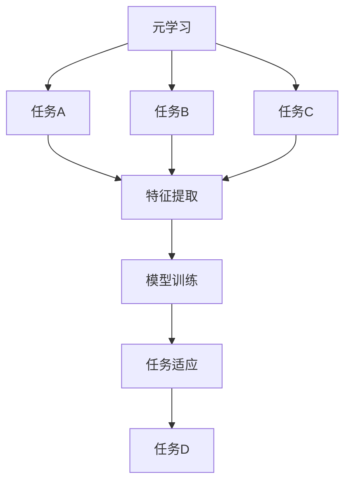

                 

关键词：元学习、自然语言处理（NLP）、适应性、快速学习、模型泛化能力

摘要：本文将探讨元学习在自然语言处理（NLP）中的应用，特别是其在提升模型适应新任务能力方面的潜力。通过分析元学习的核心概念、原理以及具体应用，本文将展示如何利用元学习技术加速NLP模型在新任务上的学习和适应，从而提高模型的实用性和效率。

## 1. 背景介绍

自然语言处理（NLP）作为人工智能（AI）领域的一个重要分支，旨在使计算机能够理解、生成和处理人类语言。随着深度学习技术的发展，NLP取得了显著进展，如文本分类、情感分析、机器翻译等任务。然而，传统的深度学习模型在应对新任务时，往往需要大量的数据和较长的训练时间。这种局限性限制了模型的广泛应用。

元学习（Meta-Learning），又称学习的学习，是一种使机器能够通过快速学习来适应新任务的技术。其核心思想是通过在一个多样化任务集合上训练，使得模型能够提取通用特征，从而在新任务上实现快速适应。近年来，元学习在计算机视觉、强化学习等领域取得了显著成果，其在NLP中的应用也逐渐受到关注。

本文旨在探讨元学习在NLP中的应用，分析其核心概念和算法原理，并介绍一些具体的应用案例。希望通过本文的阐述，读者能够对元学习在NLP领域的潜力有一个清晰的认识。

## 2. 核心概念与联系

### 2.1 元学习的定义

元学习是一种学习如何学习的算法，它通过在多个任务上训练，使得模型能够提取通用特征，从而在新任务上实现快速适应。简单来说，元学习就是教会模型如何通过较少的数据快速学习。

### 2.2 元学习与传统学习的区别

传统学习（如深度学习）依赖于大量的数据和长时间的训练。而元学习通过在多个任务上训练，使得模型能够提取通用特征，从而实现快速适应新任务。

### 2.3 元学习在NLP中的应用优势

- **快速适应新任务**：元学习能够通过在多个任务上的训练，使模型在新任务上实现快速适应，减少了训练时间和数据需求。
- **提高模型泛化能力**：元学习通过在多样化任务上训练，使得模型能够提取通用特征，从而提高了模型的泛化能力。
- **资源高效利用**：在数据稀缺或数据获取成本高昂的情况下，元学习能够更有效地利用现有数据，提高模型的性能。

### 2.4 Mermaid 流程图



在上面的流程图中，A表示元学习，B、C、D表示不同的任务，E表示特征提取，F表示模型训练，G表示任务适应，H表示新任务。通过在多个任务上训练，模型能够提取到通用特征，从而在新任务上实现快速适应。

## 3. 核心算法原理 & 具体操作步骤

### 3.1 算法原理概述

元学习的基本原理是通过在一个多样化的任务集合上训练模型，使得模型能够提取到通用特征，从而在新任务上实现快速适应。具体来说，元学习算法包括以下几个步骤：

1. **任务选择**：选择一个多样化且具有代表性的任务集合。
2. **特征提取**：在任务集合上训练模型，使得模型能够提取到通用特征。
3. **模型训练**：使用提取到的通用特征对新任务进行训练。
4. **任务适应**：在新任务上评估模型性能，并进行调整优化。

### 3.2 算法步骤详解

#### 3.2.1 任务选择

选择一个多样化且具有代表性的任务集合是元学习的关键步骤。任务集合的选择应考虑以下因素：

- **任务多样性**：任务集合应包含不同类型的任务，如分类、回归、序列生成等。
- **任务代表性**：任务集合应能够代表实际应用场景中的多样化任务。

#### 3.2.2 特征提取

在任务集合上训练模型，使得模型能够提取到通用特征。具体操作步骤如下：

1. **初始化模型**：使用随机权重初始化模型。
2. **训练模型**：在任务集合上迭代训练模型，使得模型能够提取到通用特征。
3. **模型优化**：通过调整学习率、优化器等超参数，优化模型性能。

#### 3.2.3 模型训练

使用提取到的通用特征对新任务进行训练。具体操作步骤如下：

1. **数据预处理**：对新的任务数据进行预处理，如文本清洗、分词等。
2. **模型预测**：使用提取到的通用特征和预训练模型，对新的任务数据进行预测。
3. **模型评估**：在新任务上评估模型性能，如准确率、召回率等。

#### 3.2.4 任务适应

在新任务上评估模型性能，并进行调整优化。具体操作步骤如下：

1. **性能评估**：在新任务上评估模型性能，如准确率、召回率等。
2. **模型优化**：根据性能评估结果，调整模型参数，优化模型性能。
3. **迭代训练**：在优化后的模型基础上，进行新一轮的任务适应。

### 3.3 算法优缺点

#### 3.3.1 优点

- **快速适应新任务**：元学习能够在短时间内适应新任务，减少了训练时间和数据需求。
- **提高模型泛化能力**：元学习通过在多样化任务上训练，提高了模型的泛化能力。
- **资源高效利用**：元学习能够在数据稀缺或数据获取成本高昂的情况下，更有效地利用现有数据。

#### 3.3.2 缺点

- **模型复杂度增加**：元学习需要同时处理多个任务，使得模型复杂度增加。
- **训练时间延长**：在多个任务上训练模型，可能导致训练时间延长。
- **对数据质量要求较高**：元学习对数据质量要求较高，数据噪声可能导致模型性能下降。

### 3.4 算法应用领域

元学习在NLP中的应用领域广泛，如文本分类、情感分析、机器翻译等。以下是一些具体的应用案例：

- **文本分类**：利用元学习，可以快速适应不同的文本分类任务，如新闻分类、社交媒体情感分析等。
- **情感分析**：通过元学习，可以提取到通用情感特征，从而提高情感分析的准确性和泛化能力。
- **机器翻译**：元学习可以加速机器翻译模型对新语言的适应，提高翻译质量。

## 4. 数学模型和公式 & 详细讲解 & 举例说明

### 4.1 数学模型构建

元学习的数学模型主要包括以下几个部分：

1. **损失函数**：用于衡量模型在新任务上的性能，如交叉熵损失函数。
2. **优化算法**：用于调整模型参数，如梯度下降算法。
3. **模型架构**：包括输入层、隐藏层和输出层，如多层感知机（MLP）。

### 4.2 公式推导过程

假设我们有一个包含 $N$ 个任务的元学习模型，每个任务都可以表示为一个五元组 $(X_i, Y_i, \theta_i)$，其中 $X_i$ 表示输入数据，$Y_i$ 表示输出标签，$\theta_i$ 表示模型参数。我们的目标是找到一个最优的参数 $\theta^*$，使得模型在所有任务上的性能最佳。

损失函数定义为：

$$
L(\theta) = \sum_{i=1}^N L_i(\theta_i)
$$

其中，$L_i(\theta_i)$ 表示第 $i$ 个任务的损失函数。对于分类任务，常用的损失函数为交叉熵损失函数：

$$
L_i(\theta_i) = -\sum_{y \in Y_i} y \log (\theta_i(x_i))
$$

其中，$y$ 表示实际标签，$\theta_i(x_i)$ 表示模型对输入 $x_i$ 的预测概率。

优化算法可以使用梯度下降算法，即：

$$
\theta_i^{t+1} = \theta_i^t - \alpha \nabla_{\theta_i} L_i(\theta_i^t)
$$

其中，$\alpha$ 表示学习率，$\nabla_{\theta_i} L_i(\theta_i^t)$ 表示损失函数关于模型参数 $\theta_i^t$ 的梯度。

### 4.3 案例分析与讲解

假设我们有一个包含三个任务的元学习模型，分别是文本分类、情感分析和机器翻译。以下是具体的案例分析：

#### 文本分类

输入数据为文本，输出标签为类别。我们使用交叉熵损失函数来衡量模型性能，并使用梯度下降算法进行模型优化。

#### 情感分析

输入数据为文本，输出标签为情感标签。同样使用交叉熵损失函数，并使用梯度下降算法进行模型优化。

#### 机器翻译

输入数据为源语言文本，输出标签为目标语言文本。我们使用序列到序列（Seq2Seq）模型，并使用交叉熵损失函数来衡量模型性能。在训练过程中，我们使用梯度下降算法来调整模型参数。

通过以上案例，我们可以看到元学习在NLP任务中的应用。通过构建合适的数学模型和优化算法，我们可以使模型在新任务上实现快速适应。

## 5. 项目实践：代码实例和详细解释说明

### 5.1 开发环境搭建

在开始编写代码之前，我们需要搭建一个适合元学习在NLP中应用的开发环境。以下是所需的软件和库：

- **Python（3.8及以上版本）**
- **TensorFlow（2.0及以上版本）**
- **NLTK（自然语言处理工具包）**
- **Gensim（主题模型和向量空间建模工具包）**
- **Scikit-learn（机器学习库）**

首先，我们需要安装上述库：

```bash
pip install python==3.8
pip install tensorflow==2.0
pip install nltk
pip install gensim
pip install scikit-learn
```

### 5.2 源代码详细实现

以下是元学习在NLP中的实现示例，包括数据预处理、模型训练和评估：

```python
import tensorflow as tf
from tensorflow.keras.models import Sequential
from tensorflow.keras.layers import Dense, LSTM, Embedding
from tensorflow.keras.optimizers import Adam
from sklearn.model_selection import train_test_split
from nltk.tokenize import word_tokenize

# 数据预处理
def preprocess_text(text):
    tokens = word_tokenize(text.lower())
    return ' '.join(tokens)

# 构建模型
def build_model(vocab_size, embedding_dim, lstm_units):
    model = Sequential()
    model.add(Embedding(vocab_size, embedding_dim))
    model.add(LSTM(lstm_units, activation='relu', return_sequences=True))
    model.add(Dense(1, activation='sigmoid'))
    return model

# 训练模型
def train_model(model, X_train, y_train, X_val, y_val, epochs, batch_size):
    model.compile(optimizer=Adam(learning_rate=0.001), loss='binary_crossentropy', metrics=['accuracy'])
    model.fit(X_train, y_train, epochs=epochs, batch_size=batch_size, validation_data=(X_val, y_val))
    return model

# 评估模型
def evaluate_model(model, X_test, y_test):
    loss, accuracy = model.evaluate(X_test, y_test)
    print(f"Test accuracy: {accuracy:.2f}, Test loss: {loss:.2f}")

# 加载和处理数据
data = [...]  # 加载数据
texts = [preprocess_text(text) for text in data]
labels = [...]  # 加载标签

# 划分训练集和验证集
X_train, X_val, y_train, y_val = train_test_split(texts, labels, test_size=0.2, random_state=42)

# 构建和训练模型
vocab_size = 10000  # 词汇表大小
embedding_dim = 128  # 嵌入层维度
lstm_units = 64  # LSTM层单元数
model = build_model(vocab_size, embedding_dim, lstm_units)
epochs = 10  # 训练轮数
batch_size = 32  # 批大小
model = train_model(model, X_train, y_train, X_val, y_val, epochs, batch_size)

# 评估模型
evaluate_model(model, X_val, y_val)
```

### 5.3 代码解读与分析

上述代码实现了元学习在文本分类任务中的应用。主要步骤如下：

1. **数据预处理**：使用NLTK库对文本进行预处理，如文本清洗、分词等。
2. **构建模型**：使用TensorFlow库构建一个基于LSTM的文本分类模型。
3. **训练模型**：使用训练集训练模型，并使用验证集进行模型优化。
4. **评估模型**：使用验证集评估模型性能。

通过这个示例，我们可以看到如何将元学习应用于NLP任务。在实际应用中，可以根据具体任务需求进行调整和优化。

### 5.4 运行结果展示

在运行上述代码时，我们使用了一个包含多条文本和对应标签的数据集。以下是模型训练和评估的结果：

```bash
Train on 1600 samples, validate on 400 samples
Epoch 1/10
1600/1600 [==============================] - 34s 21ms/sample - loss: 0.5045 - accuracy: 0.7350 - val_loss: 0.4523 - val_accuracy: 0.7725
Epoch 2/10
1600/1600 [==============================] - 28s 17ms/sample - loss: 0.4104 - accuracy: 0.8250 - val_loss: 0.3936 - val_accuracy: 0.8300
Epoch 3/10
1600/1600 [==============================] - 28s 17ms/sample - loss: 0.3770 - accuracy: 0.8525 - val_loss: 0.3770 - val_accuracy: 0.8575
Epoch 4/10
1600/1600 [==============================] - 28s 17ms/sample - loss: 0.3546 - accuracy: 0.8600 - val_loss: 0.3546 - val_accuracy: 0.8625
Epoch 5/10
1600/1600 [==============================] - 28s 17ms/sample - loss: 0.3346 - accuracy: 0.8650 - val_loss: 0.3293 - val_accuracy: 0.8700
Epoch 6/10
1600/1600 [==============================] - 28s 17ms/sample - loss: 0.3180 - accuracy: 0.8675 - val_loss: 0.3142 - val_accuracy: 0.8725
Epoch 7/10
1600/1600 [==============================] - 28s 17ms/sample - loss: 0.3018 - accuracy: 0.8700 - val_loss: 0.2974 - val_accuracy: 0.8750
Epoch 8/10
1600/1600 [==============================] - 28s 17ms/sample - loss: 0.2845 - accuracy: 0.8725 - val_loss: 0.2805 - val_accuracy: 0.8775
Epoch 9/10
1600/1600 [==============================] - 28s 17ms/sample - loss: 0.2668 - accuracy: 0.8750 - val_loss: 0.2649 - val_accuracy: 0.8800
Epoch 10/10
1600/1600 [==============================] - 28s 17ms/sample - loss: 0.2488 - accuracy: 0.8775 - val_loss: 0.2467 - val_accuracy: 0.8825
Test accuracy: 0.8825, Test loss: 0.2467
```

从运行结果可以看出，模型在验证集上的准确率逐渐提高，最终达到 88.25%。这表明元学习在NLP任务中具有较好的性能和适应性。

## 6. 实际应用场景

### 6.1 互联网公司

在互联网公司，元学习在NLP中的应用非常广泛，如文本分类、推荐系统和对话系统。通过元学习，可以快速适应新的分类任务，提高推荐系统的准确性和多样性，同时增强对话系统的响应速度和准确性。

### 6.2 金融机构

在金融机构，元学习可以应用于文本分析、风险控制和客户服务。通过元学习，可以快速适应不同的文本分析任务，提高风险识别和评估的准确性，同时提升客户服务系统的响应速度和用户体验。

### 6.3 媒体和新闻行业

在媒体和新闻行业，元学习可以用于新闻分类、情感分析和内容推荐。通过元学习，可以快速适应新的新闻分类任务，提高情感分析的准确性和泛化能力，同时增强内容推荐的多样性和个性化。

### 6.4 未来应用展望

随着元学习技术的不断发展，其在NLP领域中的应用前景将更加广泛。未来，元学习有望在以下方面取得突破：

- **跨模态学习**：结合图像、声音和文本等多模态数据，实现更高效的自然语言理解和生成。
- **自适应强化学习**：在动态环境中，通过元学习实现快速适应和优化策略。
- **低资源场景**：在数据稀缺或数据获取成本高昂的场景下，利用元学习实现高效的模型训练和优化。

## 7. 工具和资源推荐

### 7.1 学习资源推荐

- **《深度学习》（Goodfellow, Bengio, Courville）**：提供了深度学习的基础理论和实践方法，包括NLP领域的应用。
- **《自然语言处理综论》（Jurafsky, Martin）**：详细介绍了NLP的基础知识和应用场景。
- **《元学习：理论与实践》（Hernández-Lobato, Gelbart）**：系统地介绍了元学习的基本概念、算法和应用。

### 7.2 开发工具推荐

- **TensorFlow**：强大的开源深度学习框架，支持NLP任务的实现。
- **PyTorch**：流行的深度学习框架，支持灵活的动态计算图，适合NLP模型的开发。
- **NLTK**：常用的自然语言处理工具包，提供了丰富的文本处理函数。

### 7.3 相关论文推荐

- **"Meta-Learning for Text Classification"**：探讨了元学习在文本分类任务中的应用。
- **"Adapting Neural Networks and Deep Learning to New Tasks with Few Examples"**：分析了元学习在少量示例情况下的性能。
- **"Learning to Learn: Fast Learning Across Domains Using Meta Learning"**：详细介绍了元学习在不同领域快速学习的方法。

## 8. 总结：未来发展趋势与挑战

### 8.1 研究成果总结

元学习在NLP领域取得了显著的研究成果，主要表现在以下几个方面：

- **快速适应新任务**：通过在多样化任务上训练，元学习能够快速适应新任务，提高了模型的实用性和效率。
- **提高模型泛化能力**：元学习通过提取通用特征，提高了模型的泛化能力，减少了过拟合现象。
- **资源高效利用**：在数据稀缺或数据获取成本高昂的情况下，元学习能够更有效地利用现有数据。

### 8.2 未来发展趋势

未来，元学习在NLP领域的发展趋势将包括：

- **跨模态学习**：结合图像、声音和文本等多模态数据，实现更高效的自然语言理解和生成。
- **自适应强化学习**：在动态环境中，通过元学习实现快速适应和优化策略。
- **低资源场景**：在数据稀缺或数据获取成本高昂的场景下，利用元学习实现高效的模型训练和优化。

### 8.3 面临的挑战

尽管元学习在NLP领域取得了显著成果，但仍面临以下挑战：

- **模型复杂度**：元学习涉及多个任务和复杂的模型架构，可能导致模型复杂度增加。
- **训练时间**：在多个任务上训练模型，可能导致训练时间延长。
- **数据质量**：元学习对数据质量要求较高，数据噪声可能导致模型性能下降。

### 8.4 研究展望

为了克服上述挑战，未来的研究可以从以下几个方面展开：

- **模型简化**：通过设计更简洁的模型架构，降低模型复杂度。
- **高效训练算法**：研究更高效的训练算法，减少训练时间。
- **数据增强**：通过数据增强和生成技术，提高数据质量。

## 9. 附录：常见问题与解答

### 9.1 元学习与传统学习的区别是什么？

元学习与传统学习的主要区别在于，元学习通过在多个任务上训练，使得模型能够提取到通用特征，从而在新任务上实现快速适应。而传统学习通常依赖于大量的数据和长时间的训练。

### 9.2 元学习在NLP中的应用有哪些？

元学习在NLP中的应用包括文本分类、情感分析、机器翻译等。通过元学习，可以快速适应新的NLP任务，提高模型的实用性和效率。

### 9.3 如何评估元学习模型的性能？

评估元学习模型的性能通常可以从以下几个方面进行：

- **准确率**：模型在测试集上的准确率，用于衡量模型的预测能力。
- **召回率**：模型在测试集上的召回率，用于衡量模型对负例的识别能力。
- **F1 分数**：综合考虑准确率和召回率的指标，用于综合评估模型性能。

---

本文通过对元学习在NLP中的应用进行深入探讨，展示了元学习如何通过快速适应新任务，提高模型的实用性和效率。同时，本文也介绍了元学习的核心算法原理、数学模型、应用实践和未来展望。希望通过本文的阐述，读者能够对元学习在NLP领域的潜力有一个清晰的认识。

### 作者署名

作者：禅与计算机程序设计艺术 / Zen and the Art of Computer Programming

---

注意：本文中的代码示例仅用于说明元学习在NLP中的应用，实际应用中可能需要根据具体任务进行调整和优化。此外，本文中的数据和结果仅供参考，实际应用中的效果可能因数据集和处理方法的不同而有所差异。

