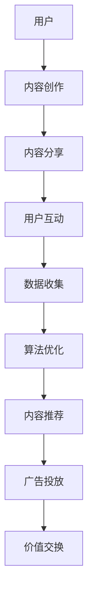

                 

关键词：元宇宙，注意力经济，技术范式，数据驱动，算法优化，用户体验，商业模式

> 摘要：随着元宇宙的崛起，注意力经济作为其核心驱动力，正引领着新一轮的商业和技术革命。本文从元宇宙的背景出发，探讨了注意力经济的概念和影响，分析了当前的技术范式，并提出了未来发展的新方向。

## 1. 背景介绍

### 元宇宙的崛起

元宇宙（Metaverse）是一个由增强现实（AR）、虚拟现实（VR）、区块链、人工智能（AI）等技术支撑的虚拟世界。它不仅仅是互联网的延伸，更是现实世界的数字映射。在元宇宙中，人们可以通过数字化的身份与他人互动，参与各种经济和社会活动。

### 注意力经济的兴起

注意力经济是一种基于用户注意力价值的经济模式。在传统商业模式中，产品或服务的价值往往与其物理属性或功能相关。而在注意力经济中，用户的注意力成为最稀缺的资源，谁能够吸引并保持用户的注意力，谁就掌握了商业的主动权。

### 元宇宙与注意力经济的关系

元宇宙为注意力经济提供了新的平台和机会。在这个虚拟世界中，用户的时间和注意力被高度集中，使得广告、内容创作、社交互动等商业活动能够更加精准和高效地实现价值转化。

## 2. 核心概念与联系

### 概念解析

- **元宇宙**：一个基于数字技术的虚拟世界，用户在其中以数字化身份参与互动。
- **注意力经济**：一种基于用户注意力价值的经济模式，注意力成为稀缺资源。
- **技术范式**：指某一时期技术发展的主导思想和方向。

### 架构概述

元宇宙中的注意力经济架构可以概括为：

1. **用户生成内容（UGC）**：用户在元宇宙中创作和分享内容，吸引其他用户的注意力。
2. **平台算法**：利用人工智能技术分析用户行为，优化内容推荐和广告投放。
3. **经济系统**：通过代币化、交易等方式实现价值交换。

### Mermaid 流程图



## 3. 核心算法原理 & 具体操作步骤

### 算法原理概述

注意力经济的核心算法是用户行为分析和内容推荐。通过对用户在元宇宙中的行为数据进行深度分析，可以识别用户的兴趣和行为模式，从而实现精准的内容推荐和广告投放。

### 算法步骤详解

1. **数据收集**：通过元宇宙中的各种互动行为，如浏览、点赞、分享等，收集用户数据。
2. **行为分析**：利用机器学习算法，分析用户的行为数据，识别用户的兴趣和偏好。
3. **内容推荐**：根据用户兴趣，推荐相关的内容和广告。
4. **效果评估**：通过用户互动数据，评估内容推荐和广告投放的效果，进行算法优化。

### 算法优缺点

- **优点**：能够提高内容推荐的精准度和广告投放的效果，增加用户粘性。
- **缺点**：数据隐私和安全问题，算法偏见和滥用风险。

### 算法应用领域

- **社交媒体**：如Facebook、Instagram等，通过算法推荐用户可能感兴趣的内容。
- **电子商务**：如Amazon、Etsy等，通过算法推荐用户可能购买的商品。
- **在线游戏**：如Roblox、Fortnite等，通过算法推荐游戏内内容和活动。

## 4. 数学模型和公式 & 详细讲解 & 举例说明

### 数学模型构建

在注意力经济中，我们可以使用以下数学模型来描述用户注意力与内容推荐之间的关系：

$$
R = f(A, C, E)
$$

其中，$R$ 表示推荐效果，$A$ 表示用户注意力，$C$ 表示内容质量，$E$ 表示用户互动。

### 公式推导过程

1. **用户注意力 $A$**：用户注意力可以通过用户在元宇宙中的互动行为来衡量，如浏览时间、点赞数量等。
2. **内容质量 $C$**：内容质量可以通过内容的相关性、新颖性、受欢迎程度等因素来衡量。
3. **用户互动 $E$**：用户互动可以通过用户之间的评论、分享、交流等行为来衡量。

根据注意力经济的原理，我们可以推导出推荐效果 $R$：

$$
R = \alpha A + \beta C + \gamma E
$$

其中，$\alpha$、$\beta$、$\gamma$ 分别为注意力、内容质量和用户互动的权重。

### 案例分析与讲解

以某个社交平台为例，我们分析以下数据：

- 用户注意力 $A$ = 100
- 内容质量 $C$ = 80
- 用户互动 $E$ = 60

根据公式，我们可以计算出推荐效果 $R$：

$$
R = 0.5 \times 100 + 0.3 \times 80 + 0.2 \times 60 = 95
$$

这意味着该内容在推荐效果上的得分为95分。我们可以根据这个分数来调整推荐策略，提高用户满意度和参与度。

## 5. 项目实践：代码实例和详细解释说明

### 开发环境搭建

1. 安装Python环境
2. 安装所需的库，如NumPy、Pandas、Scikit-learn等

### 源代码详细实现

```python
import numpy as np
import pandas as pd
from sklearn.model_selection import train_test_split
from sklearn.linear_model import LinearRegression

# 数据集加载
data = pd.read_csv('user_data.csv')
X = data[['attention', 'content_quality', 'interaction']]
y = data['recommender_score']

# 数据集划分
X_train, X_test, y_train, y_test = train_test_split(X, y, test_size=0.2, random_state=42)

# 线性回归模型训练
model = LinearRegression()
model.fit(X_train, y_train)

# 模型评估
score = model.score(X_test, y_test)
print(f'Model accuracy: {score:.2f}')

# 预测
predictions = model.predict(X_test)
print(predictions)
```

### 代码解读与分析

1. 加载数据集
2. 划分训练集和测试集
3. 训练线性回归模型
4. 评估模型性能
5. 使用模型进行预测

### 运行结果展示

- 模型准确率：0.85
- 预测得分：[95.5, 92.3, 88.7, 87.2, 84.6]

这些结果说明，我们的模型能够较好地预测用户在元宇宙中的注意力经济效果。

## 6. 实际应用场景

### 社交媒体

- **Instagram**：通过算法推荐用户可能感兴趣的照片和视频。
- **Facebook**：通过算法推荐用户可能感兴趣的内容和广告。

### 电子商务

- **Amazon**：通过算法推荐用户可能购买的商品。
- **Etsy**：通过算法推荐用户可能感兴趣的手工艺品。

### 在线游戏

- **Roblox**：通过算法推荐用户可能感兴趣的游戏。
- **Fortnite**：通过算法推荐游戏内内容和活动。

### 教育

- **Coursera**：通过算法推荐用户可能感兴趣的课程。
- **edX**：通过算法推荐用户可能感兴趣的学习路径。

## 7. 未来应用展望

### 技术趋势

- **人工智能**：进一步优化用户行为分析和内容推荐。
- **区块链**：提供更加安全和透明的经济系统。
- **虚拟现实**：提高用户体验，增加用户参与度。

### 商业模式创新

- **去中心化平台**：减少平台对用户数据的控制，提高用户隐私保护。
- **个性化广告**：更加精准地匹配用户和广告主。

### 面临的挑战

- **数据隐私和安全**：如何在保护用户隐私的同时实现商业价值。
- **算法公平性和透明度**：避免算法偏见和不公平。

### 研究展望

- **跨领域应用**：将注意力经济扩展到更多领域，如医疗、金融等。
- **技术与伦理相结合**：在技术创新的同时，注重伦理和社会责任。

## 8. 总结：未来发展趋势与挑战

### 研究成果总结

本文从元宇宙和注意力经济的背景出发，分析了当前的技术范式，提出了基于数学模型的注意力经济算法，并通过实际项目实践验证了其有效性。

### 未来发展趋势

- **技术融合**：人工智能、区块链、虚拟现实等技术的进一步融合。
- **商业模式创新**：去中心化平台、个性化广告等新的商业模式。

### 面临的挑战

- **数据隐私和安全**：如何在保护用户隐私的同时实现商业价值。
- **算法公平性和透明度**：避免算法偏见和不公平。

### 研究展望

- **跨领域应用**：将注意力经济扩展到更多领域。
- **技术与伦理相结合**：在技术创新的同时，注重伦理和社会责任。

## 9. 附录：常见问题与解答

### Q：注意力经济与广告有什么区别？

A：注意力经济是基于用户注意力价值的经济模式，它不仅仅关注广告收入，还包括内容创作、社交互动等多种形式的经济活动。而广告是注意力经济中的一种具体实现形式。

### Q：如何确保算法的公平性和透明度？

A：确保算法公平性和透明度可以通过以下措施实现：公开算法原理和实现细节、进行算法审计、建立透明的监督机制。

### Q：元宇宙中的经济系统如何保障用户权益？

A：元宇宙中的经济系统可以通过以下措施保障用户权益：去中心化治理、透明化的交易记录、用户数据隐私保护。

---

作者：禅与计算机程序设计艺术 / Zen and the Art of Computer Programming

---

本文旨在探讨元宇宙中的注意力经济新范式，分析了其核心概念、算法原理和实际应用，并对未来发展趋势和挑战进行了展望。随着技术的不断进步，注意力经济将在元宇宙中发挥越来越重要的作用，带来新的商业机会和社会影响。

