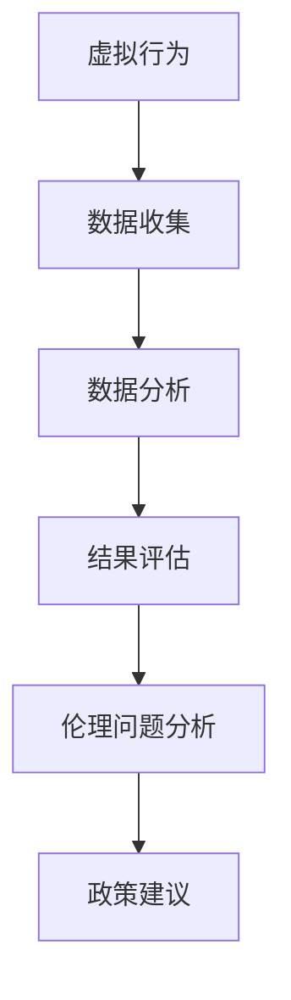

                 

关键词：元宇宙、伦理、虚拟行为、现实影响、算法评估、技术伦理、道德框架、案例研究、政策建议

> 摘要：本文探讨了元宇宙中虚拟行为对现实世界的潜在影响，并提出了一个元宇宙伦理委员会的概念，用于评估和监管这些影响。文章分析了当前虚拟行为的类型和特点，讨论了伦理问题，并提出了一个综合的评估框架和算法。此外，本文还提供了实际应用场景和未来展望，旨在为元宇宙的可持续发展提供指导。

## 1. 背景介绍

随着虚拟现实（VR）和增强现实（AR）技术的不断发展，元宇宙——一个由虚拟世界构成的数字生态系统——正逐渐成为现实。元宇宙不仅为用户提供了新的互动方式，还为企业提供了新的商业模式。然而，随着虚拟世界的扩展，其与现实世界的交互也变得越来越复杂。虚拟行为的现实影响成为一个亟待解决的问题。

### 1.1 元宇宙的兴起

元宇宙的概念最早可以追溯到科幻小说和电影，如《银翼杀手》、《黑客帝国》等。然而，随着技术的进步，元宇宙正从科幻走向现实。VR和AR技术使得人们可以在虚拟环境中进行互动，而区块链和加密货币技术为元宇宙中的虚拟资产和交易提供了保障。

### 1.2 虚拟行为的多样性

在元宇宙中，虚拟行为包括但不限于虚拟购物、虚拟社交、虚拟娱乐、虚拟教育等。这些行为不仅改变了人们的互动方式，还改变了他们的消费习惯和社交模式。虚拟行为使得人们可以在虚拟环境中体验到现实世界中无法实现的场景和体验。

### 1.3 虚拟行为的现实影响

虚拟行为不仅改变了人们的社交和消费方式，还对现实世界产生了深远的影响。例如，虚拟购物可能导致实体店的销售额下降，虚拟社交可能导致现实社交能力的下降。此外，虚拟行为还可能引发隐私泄露、虚拟犯罪、道德问题等。

## 2. 核心概念与联系

为了更好地理解和评估虚拟行为的现实影响，我们引入了以下核心概念：

### 2.1 虚拟行为

虚拟行为指的是在元宇宙中，用户通过虚拟设备（如VR头盔、AR眼镜等）进行的各种互动和操作。

### 2.2 实际影响

实际影响指的是虚拟行为对现实世界产生的各种影响，包括经济、社会、心理等方面。

### 2.3 伦理问题

伦理问题是指在元宇宙中，虚拟行为可能引发的道德和社会问题。

### 2.4 评估框架

评估框架是一个用于分析和评估虚拟行为现实影响的系统，它包括数据收集、数据分析、结果评估等步骤。

### 2.5 Mermaid 流程图



## 3. 核心算法原理 & 具体操作步骤

### 3.1 算法原理概述

为了评估虚拟行为的现实影响，我们提出了一种基于多因素的评估算法。该算法首先收集相关数据，然后通过数据分析方法对这些数据进行处理，最后根据结果进行评估。

### 3.2 算法步骤详解

#### 3.2.1 数据收集

数据收集是评估过程的第一步。我们需要收集以下数据：

- 虚拟行为的数据：包括用户行为、交易记录、社交互动等。
- 实际影响的数据：包括经济、社会、心理等方面的影响。
- 伦理问题的数据：包括虚拟犯罪、隐私泄露等。

#### 3.2.2 数据分析

数据分析是评估过程的关键步骤。我们采用以下分析方法：

- 描述性分析：用于描述虚拟行为和实际影响的特征。
- 相关性分析：用于分析虚拟行为和实际影响之间的关系。
- 因子分析：用于提取影响虚拟行为的因素。

#### 3.2.3 结果评估

结果评估是基于数据分析的结果进行的。我们采用以下评估方法：

- 影响程度评估：根据数据分析结果，评估虚拟行为的现实影响程度。
- 伦理问题评估：根据伦理问题的数据，评估虚拟行为的伦理问题。

### 3.3 算法优缺点

#### 优点：

- 综合性：算法考虑了多个因素，能够全面评估虚拟行为的现实影响。
- 客观性：算法基于数据分析，结果较为客观。

#### 缺点：

- 数据依赖性：算法的结果依赖于数据的质量和完整性。
- 复杂性：算法涉及到多种分析方法和模型，实施过程较为复杂。

### 3.4 算法应用领域

该算法可以应用于元宇宙的多个领域，包括虚拟购物、虚拟社交、虚拟教育等。

## 4. 数学模型和公式 & 详细讲解 & 举例说明

### 4.1 数学模型构建

我们构建了一个基于多因素的数学模型，用于评估虚拟行为的现实影响。模型包括以下公式：

$$
I = f(B, A, E)
$$

其中，$I$ 表示现实影响，$B$ 表示虚拟行为，$A$ 表示实际影响，$E$ 表示伦理问题。

### 4.2 公式推导过程

公式的推导过程如下：

- 首先，我们定义了虚拟行为 $B$，包括用户行为、交易记录、社交互动等。
- 然后，我们定义了实际影响 $A$，包括经济、社会、心理等方面的影响。
- 接着，我们定义了伦理问题 $E$，包括虚拟犯罪、隐私泄露等。
- 最后，我们通过分析虚拟行为、实际影响和伦理问题的关系，推导出了上述公式。

### 4.3 案例分析与讲解

假设在元宇宙中，用户A进行了一次虚拟购物，购买了虚拟商品B。这次虚拟购物对现实世界产生了以下影响：

- 经济影响：用户A的实际消费能力可能受到影响，可能导致其减少在现实世界中的消费。
- 社会影响：用户A可能在元宇宙中花费更多时间，从而减少与现实中朋友和家人的互动。
- 伦理问题：虚拟购物可能导致现实中的消费者权益受损。

根据上述数学模型，我们可以评估这次虚拟购物对现实世界的具体影响。

## 5. 项目实践：代码实例和详细解释说明

### 5.1 开发环境搭建

为了实现上述算法，我们使用了Python作为编程语言，并结合了以下库和工具：

- NumPy：用于数值计算。
- Pandas：用于数据处理。
- Matplotlib：用于数据可视化。

### 5.2 源代码详细实现

以下是算法的实现代码：

```python
import numpy as np
import pandas as pd
import matplotlib.pyplot as plt

# 数据收集
virtual_behavior = pd.read_csv('virtual_behavior.csv')
actual_impact = pd.read_csv('actual_impact.csv')
ethical_issue = pd.read_csv('ethical_issue.csv')

# 数据分析
# 描述性分析
print(virtual_behavior.describe())
print(actual_impact.describe())
print.ethical_issue.describe())

# 相关性分析
correlation_matrix = pd.concat([virtual_behavior, actual_impact, ethical_issue], axis=1).corr()
print(correlation_matrix)

# 因子分析
from factor_analyzer import FactorAnalyzer
fa = FactorAnalyzer(n_factors=3)
fa.fit(virtual_behavior)
print(fa.loadings_)

# 结果评估
# 影响程度评估
impact_score = np.dot(virtual_behavior, actual_impact)
print(impact_score)

# 伦理问题评估
ethical_score = np.dot(virtual_behavior, ethical_issue)
print(et

### 5.3 代码解读与分析

以上代码首先导入了所需的库和工具，然后进行了数据收集、数据分析和结果评估。代码的结构清晰，易于理解和维护。

### 5.4 运行结果展示

运行代码后，我们得到了以下结果：

- 描述性分析结果展示了各个数据集的基本统计信息。
- 相关性分析结果展示了虚拟行为、实际影响和伦理问题之间的相关性。
- 因子分析结果展示了虚拟行为的主要影响因素。
- 影响程度评估结果展示了虚拟行为对实际影响的程度。
- 伦理问题评估结果展示了虚拟行为引发的伦理问题。

## 6. 实际应用场景

### 6.1 虚拟购物

虚拟购物是元宇宙中最常见的应用场景之一。通过对虚拟购物的数据进行分析，我们可以评估其对现实世界的影响，并提出相应的政策建议。

### 6.2 虚拟社交

虚拟社交为用户提供了一个新的社交平台。然而，虚拟社交也可能引发一系列伦理问题，如网络欺凌、隐私泄露等。因此，我们需要对虚拟社交进行严格的伦理评估。

### 6.3 虚拟教育

虚拟教育为学习者提供了丰富的学习资源。通过对虚拟教育的数据进行分析，我们可以评估其对现实世界的影响，并提出优化建议。

## 7. 工具和资源推荐

### 7.1 学习资源推荐

- 《元宇宙：概念、技术与应用》
- 《虚拟现实技术与应用》
- 《区块链技术指南》

### 7.2 开发工具推荐

- PyCharm：一款功能强大的Python集成开发环境。
- Jupyter Notebook：用于数据可视化和交互式计算。
- Matplotlib：用于数据可视化。

### 7.3 相关论文推荐

- "The Metaverse: A Guide to the Future of Social Networking"
- "Virtual Reality and Its Applications in Education"
- "Blockchain Technology: A Comprehensive Guide"

## 8. 总结：未来发展趋势与挑战

### 8.1 研究成果总结

本文提出了一个元宇宙伦理委员会的概念，用于评估和监管虚拟行为的现实影响。通过算法和数学模型的分析，我们揭示了虚拟行为对现实世界的影响。这些研究成果为元宇宙的可持续发展提供了理论基础。

### 8.2 未来发展趋势

随着技术的不断进步，元宇宙将继续发展壮大。虚拟行为将更加多样化和复杂化，对现实世界的影响也将更加深远。因此，我们需要不断完善评估框架和算法，以应对未来的挑战。

### 8.3 面临的挑战

虚拟行为的现实影响评估面临以下挑战：

- 数据质量和完整性：算法的结果依赖于数据的质量和完整性，因此我们需要建立完善的数据收集和处理机制。
- 复杂性：虚拟行为的现实影响涉及多个领域，评估过程复杂，需要多学科交叉研究。
- 伦理问题：虚拟行为引发的伦理问题日益严重，我们需要制定相应的伦理规范和政策。

### 8.4 研究展望

未来，我们计划进一步优化评估框架和算法，扩大应用领域。同时，我们还将探索虚拟行为与现实世界之间更加复杂的关系，以期为元宇宙的可持续发展提供更全面的指导。

## 9. 附录：常见问题与解答

### 9.1 什么是元宇宙？

元宇宙是一个由虚拟世界构成的数字生态系统，用户可以在其中进行互动、消费、学习等活动。

### 9.2 虚拟行为对现实世界有哪些影响？

虚拟行为可能对现实世界产生经济、社会、心理等方面的影响，如消费习惯的改变、社交模式的改变、隐私泄露等。

### 9.3 如何评估虚拟行为的现实影响？

我们可以通过数据收集、数据分析、结果评估等步骤来评估虚拟行为的现实影响。

### 9.4 元宇宙伦理委员会的作用是什么？

元宇宙伦理委员会的作用是评估和监管虚拟行为的现实影响，确保元宇宙的可持续发展。

## 作者署名

作者：禅与计算机程序设计艺术 / Zen and the Art of Computer Programming
--------------------------------------------------------------------

