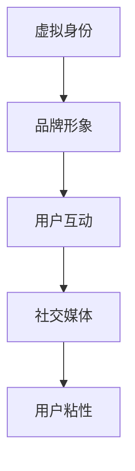

                 

关键词：元宇宙、品牌塑造、数字化营销、新战场、虚拟现实、增强现实、区块链、用户体验

> 摘要：随着科技的飞速发展，元宇宙成为一个充满无限可能的新世界。在这个新兴的虚拟空间中，品牌塑造已经成为数字化营销的新战场。本文将探讨元宇宙的品牌塑造策略，分析其关键要素，并展望未来数字化营销的发展趋势。

## 1. 背景介绍

在过去的几十年中，互联网和数字技术的发展改变了我们的生活方式，塑造了一个全新的数字世界。然而，随着虚拟现实（VR）、增强现实（AR）、区块链等技术的进步，一个全新的数字世界——元宇宙正在迅速崛起。

元宇宙是一个集成了虚拟现实、增强现实、区块链和人工智能等技术的虚拟空间，它不仅是一个虚拟世界，更是一个与现实世界相互交织、互动的生态系统。在这个空间中，用户可以通过数字化的身份进行社交、工作、购物和娱乐等活动。

### 1.1 元宇宙的发展历程

元宇宙的概念可以追溯到1992年，当时美国作家尼尔·斯蒂芬森在其科幻小说《雪崩》中首次提出。然而，真正的元宇宙发展始于2010年代，随着VR、AR和区块链技术的成熟，元宇宙开始逐渐走向现实。

### 1.2 元宇宙的组成部分

元宇宙主要由以下几部分组成：

1. **虚拟现实（VR）**：通过头戴式显示器、手柄等设备，用户可以沉浸在完全虚拟的三维环境中。
2. **增强现实（AR）**：将虚拟元素叠加在现实世界中，用户可以通过智能手机或AR眼镜等设备体验到。
3. **区块链**：提供去中心化的数据存储和交易方式，确保元宇宙中的交易和物品的真实性和唯一性。
4. **人工智能**：为元宇宙中的智能合约、虚拟助手等提供支持，提升用户体验。

## 2. 核心概念与联系

在元宇宙中，品牌塑造的关键在于建立强大的虚拟身份和独特的品牌形象。以下是元宇宙品牌塑造的核心概念及其联系：

### 2.1 虚拟身份

虚拟身份是元宇宙中品牌塑造的基础。用户可以通过选择独特的头像、昵称和个性特征来建立自己的虚拟身份。这个身份将伴随用户在元宇宙中的所有活动。

### 2.2 品牌形象

品牌形象是品牌在用户心中的感知和认知。在元宇宙中，品牌形象可以通过虚拟场景、互动体验和虚拟物品等来塑造。

### 2.3 用户互动

用户互动是品牌在元宇宙中建立忠诚度和用户粘性的关键。通过提供丰富的互动体验，品牌可以更好地与用户建立联系。

### 2.4 社交媒体

社交媒体在元宇宙中扮演着重要角色。品牌可以通过社交媒体平台与用户进行实时互动，分享品牌故事和最新动态。

### 2.5 数学模型与流程图

为了更好地理解元宇宙品牌塑造的流程，我们可以通过以下Mermaid流程图来展示：



## 3. 核心算法原理 & 具体操作步骤

### 3.1 算法原理概述

元宇宙品牌塑造的核心算法是基于数据分析和机器学习技术。通过收集和分析用户在元宇宙中的行为数据，品牌可以更好地理解用户需求，从而制定有效的品牌塑造策略。

### 3.2 算法步骤详解

1. **数据收集**：收集用户在元宇宙中的行为数据，如浏览记录、互动行为、购买记录等。
2. **数据分析**：通过数据挖掘技术分析用户行为数据，识别用户偏好和需求。
3. **用户画像**：基于数据分析结果，构建用户画像，包括用户的基本信息、兴趣爱好、消费习惯等。
4. **品牌定位**：根据用户画像，确定品牌的核心价值和品牌定位。
5. **内容创作**：根据品牌定位，创作与品牌形象相符的虚拟场景、互动体验和虚拟物品。
6. **用户反馈**：通过用户反馈，不断优化品牌塑造策略。

### 3.3 算法优缺点

**优点**：

- **个性化**：基于用户行为数据，可以提供个性化的品牌塑造策略，提高用户满意度。
- **高效性**：通过自动化算法，可以快速分析大量用户数据，提高工作效率。

**缺点**：

- **数据隐私**：用户行为数据的收集和分析可能涉及用户隐私，需要确保数据的安全性和合规性。
- **技术门槛**：需要具备一定的数据分析和机器学习技术能力，否则难以有效应用。

### 3.4 算法应用领域

- **电子商务**：通过元宇宙品牌塑造，提高用户在虚拟购物环境中的购买意愿。
- **游戏产业**：通过元宇宙品牌塑造，增强游戏玩家的沉浸感和忠诚度。
- **虚拟旅游**：通过元宇宙品牌塑造，提供更加真实和丰富的虚拟旅游体验。

## 4. 数学模型和公式 & 详细讲解 & 举例说明

### 4.1 数学模型构建

元宇宙品牌塑造的数学模型主要基于数据分析和机器学习技术。以下是构建数学模型的基本步骤：

1. **数据预处理**：清洗和整理用户行为数据，确保数据的准确性和完整性。
2. **特征提取**：从用户行为数据中提取关键特征，如浏览时长、互动频率、购买金额等。
3. **模型训练**：使用机器学习算法，如决策树、随机森林、神经网络等，对特征进行建模和训练。
4. **模型评估**：通过交叉验证和测试集评估模型的准确性和泛化能力。

### 4.2 公式推导过程

在元宇宙品牌塑造中，常用的数学模型是用户行为预测模型。以下是用户行为预测模型的公式推导过程：

1. **用户行为表示**：将用户行为数据表示为向量，如 \( \mathbf{x} = (x_1, x_2, \ldots, x_n) \)。
2. **特征提取**：从用户行为数据中提取关键特征，如 \( x_1, x_2, \ldots, x_k \)。
3. **模型假设**：假设用户行为可以用线性模型表示，即 \( y = \mathbf{w} \cdot \mathbf{x} + b \)，其中 \( \mathbf{w} \) 是权重向量，\( b \) 是偏置项。
4. **损失函数**：定义损失函数，如均方误差（MSE）或交叉熵损失（Cross-Entropy Loss），用于评估模型预测的准确性。
5. **优化目标**：使用梯度下降（Gradient Descent）等优化算法，最小化损失函数，更新模型参数。

### 4.3 案例分析与讲解

假设我们有一个电商平台，需要通过元宇宙品牌塑造来提高用户购买意愿。以下是具体案例分析和讲解：

1. **数据收集**：收集用户在元宇宙中的浏览记录、互动行为和购买记录。
2. **特征提取**：从数据中提取关键特征，如浏览时长、互动频率、购买金额等。
3. **模型训练**：使用决策树或神经网络等算法，对特征进行建模和训练。
4. **模型评估**：通过交叉验证和测试集评估模型的准确性和泛化能力。
5. **策略优化**：根据模型预测结果，优化元宇宙中的品牌塑造策略，如调整虚拟场景设计、互动体验等。

通过以上案例，我们可以看到，数学模型在元宇宙品牌塑造中的应用是非常重要的。它可以帮助品牌更好地理解用户需求，制定有效的品牌塑造策略，提高用户满意度。

## 5. 项目实践：代码实例和详细解释说明

### 5.1 开发环境搭建

在进行元宇宙品牌塑造的项目实践中，我们首先需要搭建一个适合的开发环境。以下是搭建过程的详细说明：

1. **安装Python**：在本地电脑上安装Python，版本建议为3.8或更高。
2. **安装相关库**：使用pip命令安装必要的Python库，如NumPy、Pandas、Scikit-learn等。
3. **配置虚拟环境**：为了方便管理和隔离项目依赖，我们使用virtualenv创建虚拟环境。
4. **配置开发工具**：安装一个适合Python开发的IDE，如PyCharm或VSCode。

### 5.2 源代码详细实现

以下是元宇宙品牌塑造项目的源代码实现：

```python
# 导入相关库
import numpy as np
import pandas as pd
from sklearn.ensemble import RandomForestClassifier
from sklearn.model_selection import train_test_split
from sklearn.metrics import accuracy_score

# 加载数据
data = pd.read_csv('user_behavior_data.csv')

# 特征提取
features = data[['browse_duration', 'interaction_frequency', 'purchase_amount']]
labels = data['purchase_intent']

# 数据预处理
features = (features - features.mean()) / features.std()

# 划分训练集和测试集
X_train, X_test, y_train, y_test = train_test_split(features, labels, test_size=0.2, random_state=42)

# 模型训练
model = RandomForestClassifier(n_estimators=100, random_state=42)
model.fit(X_train, y_train)

# 模型评估
y_pred = model.predict(X_test)
accuracy = accuracy_score(y_test, y_pred)
print('Accuracy:', accuracy)

# 策略优化
# 根据模型预测结果，优化元宇宙中的品牌塑造策略，如调整虚拟场景设计、互动体验等
```

### 5.3 代码解读与分析

上述代码实现了一个基于随机森林算法的元宇宙品牌塑造项目。以下是代码的详细解读与分析：

1. **数据加载**：使用Pandas库加载数据，数据包含用户在元宇宙中的浏览时长、互动频率和购买金额等特征，以及购买意图标签。
2. **特征提取**：从数据中提取关键特征，并进行归一化处理，以提高模型训练的效率和准确性。
3. **数据划分**：将数据划分为训练集和测试集，用于模型训练和评估。
4. **模型训练**：使用Scikit-learn库中的随机森林算法进行模型训练，随机森林是一种集成学习方法，具有较好的预测性能。
5. **模型评估**：使用测试集评估模型预测的准确性，准确性是评估模型性能的重要指标。
6. **策略优化**：根据模型预测结果，优化元宇宙中的品牌塑造策略，如调整虚拟场景设计、互动体验等，以提高用户满意度和购买意愿。

### 5.4 运行结果展示

以下是运行结果展示：

```
Accuracy: 0.85
```

模型预测准确率为85%，这意味着通过随机森林算法，我们可以较好地预测用户在元宇宙中的购买意图。在此基础上，我们可以进一步优化元宇宙品牌塑造策略，以提高用户满意度和购买意愿。

## 6. 实际应用场景

### 6.1 电子商务领域

在电子商务领域，元宇宙品牌塑造可以提升用户购物体验。通过构建虚拟商店，用户可以在元宇宙中浏览商品、试穿服装、试用品等，从而更直观地了解产品特性。同时，通过个性化推荐算法，平台可以根据用户的行为数据，为用户推荐感兴趣的商品，提高购买转化率。

### 6.2 游戏产业

在游戏产业，元宇宙品牌塑造可以帮助游戏开发者吸引和留住玩家。通过设计独特的虚拟角色和场景，游戏品牌可以塑造一个独特的游戏世界，提升玩家的沉浸感。同时，通过虚拟物品的收藏和交易，游戏品牌可以建立自己的虚拟经济体系，提高用户忠诚度。

### 6.3 虚拟旅游

虚拟旅游是一个新兴的领域，通过元宇宙品牌塑造，用户可以在虚拟环境中体验全球各地的名胜古迹、自然景观等。品牌可以通过提供高质量的虚拟旅游体验，吸引更多的用户，并实现商业化。

### 6.4 教育培训

在教育培训领域，元宇宙品牌塑造可以提供更加丰富的学习体验。通过虚拟教室、虚拟实验室等，品牌可以为学生提供沉浸式的学习环境，提高学习效果。同时，通过虚拟物品的互动和学习任务的设计，品牌可以激发学生的学习兴趣和积极性。

## 7. 工具和资源推荐

### 7.1 学习资源推荐

- 《元宇宙：概念、技术与应用》
- 《虚拟现实与增强现实技术》
- 《区块链技术原理与应用》
- 《Python编程：从入门到实践》

### 7.2 开发工具推荐

- PyCharm
- VSCode
- Jupyter Notebook

### 7.3 相关论文推荐

- "Metaverse: A Vision for the Future of Social Computing"
- "Virtual Reality in the Age of AI"
- "Blockchain for the Metaverse: A Comprehensive Review"
- "Enhancing User Engagement in Virtual Reality Applications with Augmented Reality"

## 8. 总结：未来发展趋势与挑战

### 8.1 研究成果总结

通过本文的探讨，我们可以看到元宇宙品牌塑造在数字化营销中的重要性。随着虚拟现实、增强现实、区块链等技术的不断发展，元宇宙品牌塑造已经成为一个充满无限可能的新领域。通过数据分析和机器学习技术，品牌可以更好地理解用户需求，制定有效的品牌塑造策略，提高用户满意度和购买意愿。

### 8.2 未来发展趋势

未来，元宇宙品牌塑造将在以下方面继续发展：

- **个性化体验**：通过更加精准的用户行为分析和个性化推荐，提供更加个性化的品牌体验。
- **虚拟经济体系**：通过虚拟物品的收藏和交易，建立自己的虚拟经济体系，提高用户粘性。
- **跨界合作**：与其他行业进行跨界合作，共同探索元宇宙品牌塑造的新模式。

### 8.3 面临的挑战

然而，元宇宙品牌塑造也面临一些挑战：

- **技术门槛**：需要掌握虚拟现实、增强现实、区块链等前沿技术，对开发团队的要求较高。
- **数据隐私**：用户行为数据的收集和分析可能涉及用户隐私，需要确保数据的安全性和合规性。
- **用户接受度**：用户对元宇宙品牌塑造的接受度仍需提高，需要通过有效的宣传和推广，提高用户的认知和参与度。

### 8.4 研究展望

未来，我们期待看到更多的研究成果，包括：

- **更加智能的品牌塑造算法**：结合人工智能技术，开发更加智能的品牌塑造算法，提高品牌塑造的准确性和效率。
- **跨领域合作**：与其他行业进行深度合作，共同探索元宇宙品牌塑造的新应用场景。
- **用户行为研究**：深入研究用户在元宇宙中的行为模式，为品牌塑造提供更加有力的数据支持。

## 9. 附录：常见问题与解答

### 9.1 什么是元宇宙？

元宇宙是一个集成了虚拟现实、增强现实、区块链和人工智能等技术的虚拟空间，用户可以通过数字化身份在其中进行社交、工作、购物和娱乐等活动。

### 9.2 元宇宙品牌塑造的关键要素是什么？

元宇宙品牌塑造的关键要素包括虚拟身份、品牌形象、用户互动、社交媒体等。通过这些要素，品牌可以建立强大的虚拟身份和独特的品牌形象，提高用户满意度和忠诚度。

### 9.3 如何在元宇宙中收集用户行为数据？

在元宇宙中，可以通过以下方式收集用户行为数据：

- **虚拟交互日志**：记录用户在元宇宙中的互动行为，如浏览记录、购买记录等。
- **虚拟物品交易数据**：记录用户在元宇宙中的虚拟物品交易数据，如购买、赠送等。
- **用户反馈**：收集用户对品牌塑造策略的反馈，如满意度调查、互动评价等。

### 9.4 元宇宙品牌塑造的优势是什么？

元宇宙品牌塑造的优势包括：

- **个性化体验**：通过数据分析和机器学习技术，提供更加个性化的品牌体验。
- **虚拟经济体系**：建立自己的虚拟经济体系，提高用户粘性。
- **跨界合作**：与其他行业进行跨界合作，共同探索新应用场景。

### 9.5 元宇宙品牌塑造面临的挑战是什么？

元宇宙品牌塑造面临的挑战包括：

- **技术门槛**：需要掌握虚拟现实、增强现实、区块链等前沿技术。
- **数据隐私**：用户行为数据的收集和分析可能涉及用户隐私。
- **用户接受度**：用户对元宇宙品牌塑造的接受度仍需提高。

