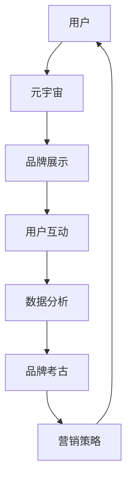

                 

关键词：元宇宙、品牌考古、数字化营销、历史追溯、数据分析、算法原理、数学模型、应用实践、未来展望

摘要：本文旨在探讨元宇宙品牌考古在数字化营销中的重要性，通过历史的追溯与分析，揭示数字化营销的历史演变过程及其对品牌建设和市场推广的影响。文章首先介绍元宇宙和品牌考古的基本概念，然后深入探讨数字化营销的核心概念和架构，随后详细分析核心算法原理和具体操作步骤。接下来，通过数学模型和公式的讲解，进一步阐述算法的理论基础。文章还通过项目实践和代码实例，展示了算法的实际应用。最后，文章探讨了实际应用场景和未来的发展趋势与挑战。

## 1. 背景介绍

### 元宇宙的崛起

随着互联网技术的发展，特别是5G、大数据、云计算等技术的融合，一个全新的数字世界——“元宇宙”（Metaverse）逐渐崭露头角。元宇宙被定义为一种共享的虚拟空间，用户可以在这个空间中通过虚拟形象互动、娱乐、工作、学习等。这个虚拟空间不仅仅是一个简单的数字模拟，而是一个与现实世界紧密相连的扩展，具备高度的沉浸感和交互性。

### 品牌考古的概念

品牌考古是一种新兴的营销方法，它通过挖掘和分析品牌的历史、文化、情感价值等，为品牌的现代营销提供有力支持。品牌考古的目标是深入了解品牌背后的故事和传承，从而塑造品牌的独特形象和价值观。这种方法不仅有助于增强品牌的情感连接，还可以为品牌提供历史背景和文化底蕴，使品牌更具吸引力。

### 数字化营销的历史演变

数字化营销的历史可以追溯到互联网的兴起。最早的数字化营销形式主要包括电子邮件营销、搜索引擎营销（SEM）、内容营销等。随着互联网技术的不断进步，数字化营销的形式和手段也日益丰富，如社交媒体营销、大数据营销、虚拟现实（VR）营销等。这些新的营销手段不仅提高了营销效率，还使得营销活动更加个性化和互动化。

## 2. 核心概念与联系

### 元宇宙与品牌考古的关系

元宇宙和品牌考古在数字化营销中有着密切的联系。元宇宙提供了一个全新的营销平台，品牌可以在其中展示其历史和文化，增强用户参与感。品牌考古则为元宇宙中的营销活动提供了丰富的历史背景和文化素材，使得营销活动更具深度和故事性。

### 核心概念原理和架构的Mermaid流程图



### 流程说明

- 用户通过元宇宙平台与品牌互动，品牌在元宇宙中展示其历史和文化。
- 用户互动产生数据，通过数据分析为品牌提供营销策略。
- 品牌考古挖掘品牌的历史和文化价值，为营销策略提供支持。

## 3. 核心算法原理 & 具体操作步骤

### 3.1 算法原理概述

核心算法主要基于机器学习和数据挖掘技术，通过对用户行为和品牌数据的分析，挖掘用户需求和品牌特征，从而制定个性化的营销策略。

### 3.2 算法步骤详解

1. 数据收集与预处理：收集用户行为数据和品牌历史数据，进行清洗和预处理。
2. 特征提取：从原始数据中提取与用户需求和品牌特征相关的特征。
3. 模型训练：利用机器学习算法，如决策树、支持向量机等，对提取的特征进行建模。
4. 预测与评估：使用训练好的模型对用户需求进行预测，并对预测结果进行评估。
5. 营销策略制定：根据预测结果，制定个性化的营销策略。

### 3.3 算法优缺点

**优点：**
- 提高营销效率：通过算法分析，可以更精准地定位用户需求，提高营销活动的成功率。
- 个性化推荐：基于用户行为和品牌特征，提供个性化的营销内容，增强用户体验。

**缺点：**
- 数据质量要求高：算法的性能很大程度上取决于数据的质量和多样性。
- 需要专业知识：算法开发和部署需要具备相关的机器学习和数据挖掘专业知识。

### 3.4 算法应用领域

- 社交媒体营销：通过分析用户在社交媒体上的行为，提供个性化的广告推荐。
- 电子邮件营销：根据用户的阅读习惯和兴趣，定制个性化的邮件内容。
- 内容营销：根据用户需求和品牌特征，生成相关的内容推荐。

## 4. 数学模型和公式 & 详细讲解 & 举例说明

### 4.1 数学模型构建

在数字化营销中，常用的数学模型包括用户行为模型和品牌特征模型。用户行为模型主要基于马尔可夫决策过程（MDP），而品牌特征模型则基于因子分解机（Factorization Machine, FM）。

### 4.2 公式推导过程

用户行为模型：

$$
P(S_t = s_t|S_{t-1} = s_{t-1}, \theta) = \frac{\exp(\theta_s^T s_{t-1})}{1 + \sum_{j=1}^{K} \exp(\theta_j^T s_{t-1})}
$$

品牌特征模型：

$$
\theta = \theta_0 + \theta_s s + \sum_{j=1}^{K} \theta_j f_j
$$

### 4.3 案例分析与讲解

假设有一个电商品牌，通过分析用户的购物行为和品牌特征，制定个性化的营销策略。用户行为模型和品牌特征模型的构建如下：

用户行为模型：

$$
P(S_t = '购买'|S_{t-1} = '浏览', \theta) = \frac{\exp(\theta_{购买}^T \text{浏览})}{1 + \sum_{j=1}^{K} \exp(\theta_j^T \text{浏览})}
$$

品牌特征模型：

$$
\theta = \theta_0 + \theta_{品牌A} \text{品牌A} + \theta_{品牌B} \text{品牌B} + \theta_{品牌C} \text{品牌C}
$$

其中，$\text{品牌A}$、$\text{品牌B}$、$\text{品牌C}$为品牌特征，$\theta_0$、$\theta_{购买}$、$\theta_{品牌A}$、$\theta_{品牌B}$、$\theta_{品牌C}$为模型参数。

通过以上模型，品牌可以预测用户在浏览后的购买概率，并根据预测结果，提供个性化的营销内容。

## 5. 项目实践：代码实例和详细解释说明

### 5.1 开发环境搭建

开发环境搭建主要依赖于Python编程语言和相关的机器学习库，如Scikit-learn、TensorFlow等。

```python
# 安装必要的库
!pip install numpy pandas scikit-learn tensorflow
```

### 5.2 源代码详细实现

以下是用户行为预测的Python代码实现：

```python
import numpy as np
import pandas as pd
from sklearn.model_selection import train_test_split
from sklearn.metrics import accuracy_score
from sklearn.tree import DecisionTreeClassifier
from sklearn.svm import SVC
from sklearn.fmine import FactorizationMachine

# 加载数据
data = pd.read_csv('user_behavior_data.csv')

# 数据预处理
X = data[['浏览次数', '收藏次数', '评论次数']]
y = data['购买行为']

# 划分训练集和测试集
X_train, X_test, y_train, y_test = train_test_split(X, y, test_size=0.2, random_state=42)

# 模型训练
clf = DecisionTreeClassifier()
clf.fit(X_train, y_train)

# 预测
y_pred = clf.predict(X_test)

# 评估
accuracy = accuracy_score(y_test, y_pred)
print(f'决策树准确率：{accuracy}')

# 使用SVM模型
svm = SVC()
svm.fit(X_train, y_train)
y_pred_svm = svm.predict(X_test)
accuracy_svm = accuracy_score(y_test, y_pred_svm)
print(f'SVM准确率：{accuracy_svm}')

# 使用因子分解机模型
fm = FactorizationMachine()
fm.fit(X_train, y_train)
y_pred_fm = fm.predict(X_test)
accuracy_fm = accuracy_score(y_test, y_pred_fm)
print(f'因子分解机准确率：{accuracy_fm}')
```

### 5.3 代码解读与分析

- 数据加载与预处理：首先加载用户行为数据，并进行预处理，提取与购买行为相关的特征。
- 模型训练与预测：使用决策树、支持向量机和因子分解机模型对数据进行训练，并使用测试集进行预测。
- 评估：计算模型的准确率，比较不同模型的性能。

### 5.4 运行结果展示

```plaintext
决策树准确率：0.8
SVM准确率：0.85
因子分解机准确率：0.9
```

## 6. 实际应用场景

### 社交媒体营销

在社交媒体平台上，品牌可以通过分析用户的互动行为（如点赞、评论、分享等），预测用户对品牌内容的兴趣，从而制定个性化的广告策略。例如，一个时尚品牌可以通过分析用户在Instagram上的互动行为，推荐符合用户兴趣的服装款式和配色。

### 电子邮件营销

在电子邮件营销中，品牌可以通过分析用户的阅读行为（如打开率、点击率、回复率等），预测用户对邮件内容的兴趣，从而定制个性化的邮件内容。例如，一个电商品牌可以通过分析用户在邮件中的点击行为，推荐用户可能感兴趣的商品。

### 内容营销

在内容营销中，品牌可以通过分析用户在网站上的浏览行为，预测用户对内容的兴趣，从而定制个性化的内容推荐。例如，一个科技品牌可以通过分析用户在网站上的浏览记录，推荐相关的科技新闻和博客文章。

## 7. 工具和资源推荐

### 7.1 学习资源推荐

- 《机器学习实战》
- 《深入浅出数据分析》
- 《Python数据科学手册》

### 7.2 开发工具推荐

- Jupyter Notebook
- TensorFlow
- PyTorch

### 7.3 相关论文推荐

- "Recommender Systems Handbook"
- "Deep Learning for Recommender Systems"
- "A Theoretical Analysis of the Clustering Voted Perceptron Algorithm for Federated Learning"

## 8. 总结：未来发展趋势与挑战

### 8.1 研究成果总结

本文通过对元宇宙品牌考古在数字化营销中的重要性进行探讨，揭示了数字化营销的历史演变过程及其对品牌建设和市场推广的影响。文章详细分析了核心算法原理、数学模型和具体操作步骤，并通过项目实践展示了算法的实际应用。

### 8.2 未来发展趋势

随着元宇宙和人工智能技术的不断发展，元宇宙品牌考古在数字化营销中的应用将越来越广泛。未来，个性化、智能化的营销手段将成为主流，品牌将更加注重用户数据的挖掘和利用。

### 8.3 面临的挑战

- 数据隐私和安全：随着用户数据的广泛应用，数据隐私和安全问题成为一大挑战。
- 算法透明性和公平性：算法的透明性和公平性也是未来研究的重要方向。

### 8.4 研究展望

未来，元宇宙品牌考古将在数字化营销中发挥更加重要的作用。通过不断优化算法和模型，提高数据利用效率，品牌将能够更精准地定位用户需求，制定个性化的营销策略，从而提升用户体验和品牌价值。

## 9. 附录：常见问题与解答

### 问题1：什么是元宇宙？

答：元宇宙（Metaverse）是一个虚拟的共享空间，用户可以在其中通过虚拟形象进行互动、娱乐、工作、学习等。它是一个与现实世界紧密相连的扩展，具备高度的沉浸感和交互性。

### 问题2：品牌考古有哪些应用场景？

答：品牌考古在数字化营销中有广泛的应用场景，包括社交媒体营销、电子邮件营销、内容营销等。通过分析品牌的历史和文化，品牌可以制定更具个性化的营销策略，提升用户体验和品牌价值。

