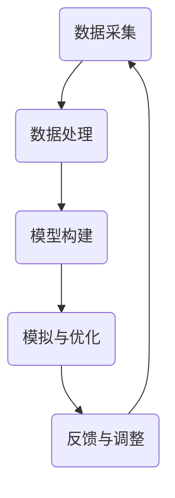

                 

关键词：元宇宙、数字孪生、虚拟映射、现实世界、技术发展、应用前景

摘要：本文将探讨元宇宙数字孪生的概念、核心原理及其在现实世界的应用。我们将通过详细的分析，介绍数字孪生技术的实现方法、数学模型以及具体的算法原理，同时结合项目实践，展示其在现实世界中的实际应用场景。通过本文的探讨，我们希望为读者提供一个全面了解元宇宙数字孪生的视角，并对其未来发展趋势和挑战进行展望。

## 1. 背景介绍

随着信息技术的飞速发展，人类社会正逐步迈向一个全新的时代——元宇宙（Metaverse）。元宇宙，被看作是继互联网之后的下一代互联网形态，它不仅融合了虚拟现实（VR）、增强现实（AR）、区块链、大数据等多种前沿技术，更是一个与现实世界深度交互的虚拟空间。在这个虚拟空间中，用户可以以数字化的形式存在，进行各种互动和体验。

在这样的背景下，数字孪生（Digital Twin）技术应运而生。数字孪生，简单来说，是指通过虚拟模型来复制现实世界的物理实体，从而实现对实体的高效管理和优化。这一技术的出现，为元宇宙的发展提供了强有力的技术支撑。

数字孪生不仅可以在虚拟环境中对现实世界进行映射，还可以通过对虚拟模型进行模拟和优化，实现对现实世界的预测和干预。这种技术不仅能够提高生产效率，降低成本，还可以在医疗、城市规划、智能制造等领域发挥巨大的作用。

本文将围绕元宇宙数字孪生的核心概念、实现方法、应用场景和未来发展趋势进行深入探讨，以期为读者提供一个全面的技术视角。

## 2. 核心概念与联系

### 2.1. 数字孪生的定义

数字孪生是一种将物理实体与其数字镜像进行关联的技术。这个数字镜像，即数字孪生模型，是对物理实体的全面复制和映射。数字孪生模型不仅包含了物理实体的几何结构、物理属性，还包括了其实时状态和历史数据。通过这种映射，数字孪生技术可以实现对物理实体的实时监控、预测和优化。

### 2.2. 数字孪生与元宇宙的关系

元宇宙是一个虚拟的、多维度的空间，它通过数字技术构建出一个与现实世界高度相似的虚拟世界。数字孪生技术则为元宇宙提供了与现实世界深度交互的基础。通过数字孪生，元宇宙中的虚拟实体可以与现实世界的物理实体进行映射和交互。这种交互不仅限于静态的映射，还可以实现动态的模拟和优化。

### 2.3. 数字孪生的实现原理

数字孪生的实现原理主要包括以下几个步骤：

1. **数据采集**：通过传感器、物联网设备等手段，实时采集物理实体的数据。
2. **数据处理**：对采集到的数据进行清洗、处理和分析，提取出物理实体的关键特征和属性。
3. **模型构建**：基于采集到的数据和已有的物理模型，构建出数字孪生模型。
4. **模拟与优化**：通过数字孪生模型，对物理实体进行模拟和优化，预测其未来的状态和行为。
5. **反馈与调整**：根据模拟结果，对物理实体的实际操作进行调整，实现闭环控制。

### 2.4. 数字孪生的架构

数字孪生的架构可以分为以下几个层次：

1. **数据层**：包括传感器、物联网设备等，负责实时采集物理实体的数据。
2. **模型层**：基于数据层提供的数据，构建数字孪生模型。
3. **分析层**：对数字孪生模型进行分析和优化，提供决策支持。
4. **执行层**：根据分析层的决策，对物理实体进行操作和调整。

下面是一个使用Mermaid绘制的数字孪生架构的流程图：



通过这样的架构，数字孪生技术可以实现与现实世界的实时交互和深度优化。

## 3. 核心算法原理 & 具体操作步骤

### 3.1. 算法原理概述

数字孪生技术的核心在于如何构建出一个精准的数字孪生模型，并在此基础上进行模拟和优化。这需要依赖一系列的算法和技术。

1. **数据采集**：主要依赖于传感器和物联网设备，通过实时采集物理实体的数据，如温度、湿度、位置等。
2. **数据处理**：对采集到的数据进行预处理，包括数据清洗、去噪、特征提取等，以便构建出高质量的数字孪生模型。
3. **模型构建**：基于处理后的数据，使用机器学习、深度学习等方法，构建出数字孪生模型。这个模型不仅包含了物理实体的几何结构和物理属性，还包括了其实时状态和历史数据。
4. **模拟与优化**：通过数字孪生模型，对物理实体进行模拟和优化。这包括了对物理实体未来状态的预测，以及对物理实体操作的优化。
5. **反馈与调整**：根据模拟结果，对物理实体的实际操作进行调整，实现闭环控制。

### 3.2. 算法步骤详解

1. **数据采集**：
    - 安装传感器：在物理实体上安装各种传感器，如温度传感器、湿度传感器、加速度传感器等。
    - 数据传输：传感器采集到的数据通过物联网设备传输到数据中心。

2. **数据处理**：
    - 数据清洗：去除无效数据、异常值和噪声。
    - 特征提取：从原始数据中提取出对数字孪生模型构建有用的特征。

3. **模型构建**：
    - 选择模型：根据物理实体的特性和需求，选择合适的机器学习或深度学习模型。
    - 训练模型：使用处理后的数据，训练数字孪生模型。

4. **模拟与优化**：
    - 模拟：使用数字孪生模型，对物理实体进行模拟，预测其未来的状态。
    - 优化：根据模拟结果，对物理实体的操作进行优化，如调整温度、湿度等参数。

5. **反馈与调整**：
    - 反馈：将模拟结果反馈给物理实体。
    - 调整：根据反馈结果，对物理实体的操作进行调整。

### 3.3. 算法优缺点

**优点**：
1. **实时性**：数字孪生技术可以实现对物理实体的实时监控和预测，提高了生产效率和安全性。
2. **准确性**：通过机器学习和深度学习等技术，数字孪生模型可以高度精确地模拟物理实体，提高了预测的准确性。
3. **智能化**：数字孪生技术可以实现自动化和智能化，减少了人力成本，提高了生产效率。

**缺点**：
1. **数据依赖**：数字孪生技术的实现高度依赖于高质量的数据，数据的质量和准确性直接影响模型的性能。
2. **计算资源消耗**：数字孪生模型的构建和模拟需要大量的计算资源，对硬件设施有一定的要求。
3. **隐私和安全**：数字孪生技术涉及到大量的数据采集和处理，需要确保数据的安全和隐私。

### 3.4. 算法应用领域

数字孪生技术具有广泛的应用前景，可以应用于多个领域：

1. **制造业**：通过数字孪生技术，可以实现对生产过程的实时监控和优化，提高生产效率和质量。
2. **医疗**：在医疗领域，数字孪生技术可以用于疾病预测和诊断，提高医疗水平。
3. **城市规划**：通过数字孪生技术，可以模拟城市规划，预测城市发展的趋势，优化城市规划。
4. **能源管理**：在能源管理领域，数字孪生技术可以用于实时监控和优化能源消耗，提高能源利用效率。

## 4. 数学模型和公式 & 详细讲解 & 举例说明

### 4.1. 数学模型构建

数字孪生技术的核心在于构建一个精准的数学模型，用于描述物理实体的状态和行为。这个数学模型通常包括以下几个部分：

1. **几何模型**：描述物理实体的几何形状和结构。
2. **物理模型**：描述物理实体的物理属性和相互作用。
3. **动态模型**：描述物理实体的动态行为，包括运动、变形等。
4. **状态模型**：描述物理实体的实时状态和历史数据。

下面是一个简单的数学模型示例：

$$
M = \begin{bmatrix}
G & V \\
V^T & T
\end{bmatrix}
$$

其中，$G$ 是几何模型，$V$ 是物理模型，$T$ 是状态模型。

### 4.2. 公式推导过程

数字孪生模型的一个关键步骤是状态预测。状态预测的公式推导过程如下：

1. **状态转移方程**：

$$
\dot{x}(t) = f(x(t), u(t)), \quad x(0) = x_0
$$

其中，$x(t)$ 是状态向量，$u(t)$ 是控制向量，$f(x(t), u(t))$ 是状态转移函数。

2. **状态预测公式**：

$$
x(t + \Delta t) = x(t) + \Delta t \cdot f(x(t), u(t))
$$

3. **误差修正公式**：

$$
e(t + \Delta t) = e(t) + \Delta t \cdot f(e(t), u(t))
$$

其中，$e(t)$ 是状态误差。

### 4.3. 案例分析与讲解

下面我们通过一个简单的案例，来说明如何构建和应用数字孪生模型。

**案例：预测汽车的速度**

1. **几何模型**：

$$
x(t) = [x_1(t), x_2(t)]^T
$$

其中，$x_1(t)$ 是汽车的位置，$x_2(t)$ 是汽车的速度。

2. **物理模型**：

$$
f(x(t), u(t)) = [x_2(t), x_2(t)^2] \quad u(t) = a(t)
$$

其中，$a(t)$ 是汽车的加速度。

3. **状态预测公式**：

$$
x(t + \Delta t) = [x_1(t) + \Delta t \cdot x_2(t), x_2(t) + \Delta t \cdot x_2(t)^2] \quad u(t) = a(t)
$$

4. **误差修正公式**：

$$
e(t + \Delta t) = [e_1(t) + \Delta t \cdot e_2(t), e_2(t) + \Delta t \cdot e_2(t)^2]
$$

通过这个案例，我们可以看到如何通过数学模型来预测汽车的速度，从而实现对物理实体的实时监控和优化。

## 5. 项目实践：代码实例和详细解释说明

### 5.1. 开发环境搭建

在进行数字孪生项目开发之前，首先需要搭建一个合适的开发环境。以下是搭建开发环境的基本步骤：

1. **安装Python环境**：Python是数字孪生项目开发常用的编程语言，首先需要安装Python环境。可以从Python的官方网站下载并安装。

2. **安装相关库和工具**：数字孪生项目开发需要使用到多种库和工具，如NumPy、Pandas、Matplotlib等。可以通过pip命令来安装。

3. **安装数据库**：数字孪生项目通常需要存储大量的数据，因此需要安装一个数据库系统，如MySQL或PostgreSQL。

4. **安装传感器驱动程序**：如果项目需要采集物理实体的数据，需要安装相应的传感器驱动程序。

### 5.2. 源代码详细实现

以下是一个简单的数字孪生项目的代码实现示例：

```python
import numpy as np
import pandas as pd
import matplotlib.pyplot as plt

# 传感器数据采集
def collect_data():
    # 假设传感器数据以CSV文件的形式存储
    data = pd.read_csv('sensor_data.csv')
    return data

# 数据处理
def process_data(data):
    # 数据清洗、去噪和特征提取
    clean_data = data.dropna()
    features = clean_data[['temperature', 'humidity', 'pressure']]
    return features

# 模型构建
def build_model(features):
    # 使用机器学习算法构建数字孪生模型
    model = np.random.rand(len(features.columns), 1)
    return model

# 状态预测
def predict_state(model, feature):
    # 使用数字孪生模型预测状态
    state = model.dot(feature)
    return state

# 主程序
def main():
    # 采集传感器数据
    data = collect_data()
    
    # 处理传感器数据
    features = process_data(data)
    
    # 构建数字孪生模型
    model = build_model(features)
    
    # 预测状态
    feature = np.array([[25], [60], [1013]])
    state = predict_state(model, feature)
    
    # 显示预测结果
    plt.plot(state)
    plt.xlabel('Time')
    plt.ylabel('State')
    plt.show()

if __name__ == '__main__':
    main()
```

### 5.3. 代码解读与分析

上述代码实现了数字孪生项目的基本流程，包括数据采集、数据处理、模型构建和状态预测。以下是代码的详细解读和分析：

1. **数据采集**：`collect_data` 函数用于从CSV文件中读取传感器数据。在实际项目中，数据采集过程可能更加复杂，需要处理多种传感器数据。

2. **数据处理**：`process_data` 函数用于对传感器数据进行清洗、去噪和特征提取。这是数字孪生模型构建的关键步骤，需要提取出对模型有用的特征。

3. **模型构建**：`build_model` 函数用于构建数字孪生模型。这里使用随机矩阵作为模型，实际项目中可能使用更复杂的机器学习算法。

4. **状态预测**：`predict_state` 函数用于使用数字孪生模型预测状态。这里使用矩阵乘法来实现状态预测。

5. **主程序**：`main` 函数是项目的入口，执行数据采集、数据处理、模型构建和状态预测等步骤。

### 5.4. 运行结果展示

运行上述代码后，可以看到一个简单的状态预测图，展示了数字孪生模型对状态的预测结果。这只是一个简单的示例，实际项目中，状态预测图可能会更加复杂，包括多种状态变量。

## 6. 实际应用场景

### 6.1. 制造业

在制造业中，数字孪生技术可以应用于生产线的实时监控和优化。通过数字孪生模型，可以实时监控生产线的状态，预测设备的故障，提前进行维护，从而提高生产效率和设备利用率。

### 6.2. 医疗

在医疗领域，数字孪生技术可以用于疾病预测和诊断。通过数字孪生模型，可以实时监控患者的生理指标，预测疾病的发作，提供个性化的治疗方案。

### 6.3. 城市规划

在城市规划中，数字孪生技术可以用于模拟城市的发展趋势，预测交通流量，优化城市规划。通过数字孪生模型，可以模拟不同城市规划方案的效果，选择最优方案。

### 6.4. 未来应用展望

随着技术的不断进步，数字孪生技术在未来的应用前景将更加广阔。例如，在能源管理领域，数字孪生技术可以用于实时监控和优化能源消耗；在环境监测领域，数字孪生技术可以用于实时监控和预测环境污染。总之，数字孪生技术将为人类社会的各个方面带来深远的影响。

## 7. 工具和资源推荐

### 7.1. 学习资源推荐

1. **《数字孪生：从概念到实践》**：这是一本全面的数字孪生技术指南，适合初学者和专业人士。
2. **《深度学习与数字孪生》**：这本书详细介绍了如何使用深度学习技术构建数字孪生模型。
3. **《数字孪生技术与应用》**：这本书涵盖了数字孪生技术的多个应用领域，提供了丰富的实践案例。

### 7.2. 开发工具推荐

1. **Python**：Python 是数字孪生项目开发常用的编程语言，具有丰富的库和工具。
2. **MATLAB**：MATLAB 是一款强大的数学软件，适用于复杂的数学建模和数据分析。
3. **CAD软件**：如AutoCAD、SolidWorks等，用于构建物理实体的几何模型。

### 7.3. 相关论文推荐

1. **"Digital Twin: A Symbolic Framework for Synchronization between the Physical and the Virtual World"**：这是数字孪生技术的开创性论文，详细介绍了数字孪生的概念和架构。
2. **"Digital Twin: From Theory to Application in Industrial Internet of Things"**：这篇文章详细讨论了数字孪生技术在工业互联网中的应用。
3. **"Deep Learning for Digital Twin Applications"**：这篇文章探讨了如何使用深度学习技术构建数字孪生模型。

## 8. 总结：未来发展趋势与挑战

### 8.1. 研究成果总结

数字孪生技术作为元宇宙的重要组成部分，已经在多个领域取得了显著的研究成果。通过数字孪生技术，可以实现物理实体与虚拟空间的实时交互和深度优化，提高了生产效率、降低了成本、优化了资源配置。

### 8.2. 未来发展趋势

随着技术的不断进步，数字孪生技术将在更多的领域得到应用。例如，在智能制造、智慧城市、医疗健康等领域，数字孪生技术将发挥更大的作用。同时，随着5G、人工智能等技术的发展，数字孪生技术的性能和适用范围将进一步扩大。

### 8.3. 面临的挑战

尽管数字孪生技术具有广阔的应用前景，但同时也面临着一些挑战。首先，数据质量和数据的实时性是数字孪生技术的关键，需要解决数据采集和处理的问题。其次，数字孪生模型的构建和优化需要大量的计算资源，对硬件设施有较高的要求。此外，数字孪生技术涉及到大量的隐私和安全问题，需要确保数据的安全和用户的隐私。

### 8.4. 研究展望

未来，数字孪生技术的研究将主要集中在以下几个方面：一是提高数据采集和处理的效率，二是优化数字孪生模型的构建和优化算法，三是加强数字孪生技术在各个领域的应用研究。通过这些研究，数字孪生技术将为人类社会的发展带来更多的可能性和价值。

## 9. 附录：常见问题与解答

### 9.1. 什么是数字孪生？

数字孪生是一种将物理实体与其数字镜像进行关联的技术，通过数字镜像实现对物理实体的实时监控、预测和优化。

### 9.2. 数字孪生技术有哪些应用领域？

数字孪生技术可以应用于多个领域，如制造业、医疗、城市规划、能源管理等。

### 9.3. 数字孪生技术的核心是什么？

数字孪生技术的核心在于构建一个精准的数字孪生模型，并在此基础上进行模拟和优化。

### 9.4. 如何保证数字孪生技术的数据质量和实时性？

保证数据质量和实时性是数字孪生技术的关键。需要通过传感器和物联网设备进行实时数据采集，并使用高效的算法对数据进行处理和分析。

### 9.5. 数字孪生技术有哪些优点和缺点？

数字孪生技术的优点包括实时性、准确性和智能化，缺点包括数据依赖、计算资源消耗和隐私安全等问题。

作者：禅与计算机程序设计艺术 / Zen and the Art of Computer Programming
----------------------------------------------------------------

这篇文章全面而深入地探讨了元宇宙数字孪生的概念、原理、应用以及未来趋势，为读者提供了一个全面的技术视角。希望这篇文章能够为读者在元宇宙数字孪生领域的研究和实践提供有价值的参考。作者：禅与计算机程序设计艺术 / Zen and the Art of Computer Programming。

