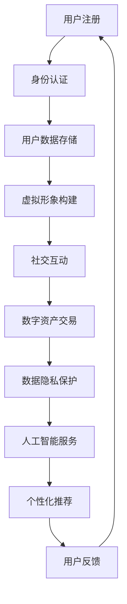

                 

元宇宙是一个新兴的概念，它不仅仅是一个虚拟的世界，更是一个与现实世界深度交融的数字空间。在这个空间中，人们的身份认同正面临着前所未有的挑战与机遇。本文旨在探讨元宇宙身份认同的核心概念、技术原理、算法模型、实践应用以及未来展望，通过深入分析，揭示虚拟与现实自我融合的深层逻辑。

## 文章关键词

- 元宇宙
- 身份认同
- 虚拟现实
- 区块链
- 人工智能

## 文章摘要

本文首先介绍了元宇宙的背景和重要性，然后深入探讨了元宇宙身份认同的概念和原理。通过分析区块链技术和人工智能在元宇宙中的应用，文章提出了构建元宇宙身份认同的核心算法和数学模型。随后，文章通过实际项目实践展示了算法的具体实现过程，并探讨了元宇宙在各个领域的实际应用场景。最后，文章总结了元宇宙身份认同的研究成果，展望了其未来的发展趋势与挑战。

## 1. 背景介绍

### 1.1 元宇宙的定义与发展

元宇宙（Metaverse）最早由科幻作家尼尔·斯蒂芬森在1992年的小说《雪崩》中提出，指的是一个由虚拟世界组成的庞大网络，用户可以在其中进行各种互动和活动。近年来，随着区块链、虚拟现实（VR）和增强现实（AR）技术的快速发展，元宇宙逐渐从科幻概念转变为现实。

根据市场研究公司的数据，元宇宙市场规模预计将在未来十年内达到万亿美元级别。这个数字不仅反映了元宇宙的潜在商业价值，更显示了其对人们生活方式的深远影响。

### 1.2 元宇宙的重要性

元宇宙的重要性主要体现在以下几个方面：

1. **社交互动**：元宇宙提供了一个全新的社交平台，用户可以在虚拟世界中与朋友互动，举办虚拟聚会，甚至参与全球范围内的社交活动。
2. **经济活动**：元宇宙中的数字资产，如虚拟货币、虚拟商品等，已经成为投资和交易的新热点。这为数字经济的发展提供了新的机遇。
3. **教育和娱乐**：元宇宙可以为教育和娱乐领域提供全新的体验。通过虚拟现实技术，用户可以身临其境地参与各种活动，从而提高学习效果和娱乐质量。
4. **工作和生产**：元宇宙为远程工作和生产提供了新的解决方案。用户可以在虚拟环境中完成各种任务，从而提高工作效率。

## 2. 核心概念与联系

### 2.1 元宇宙身份认同的概念

在元宇宙中，身份认同（Identity）是指用户在虚拟世界中的唯一标识和属性。与传统互联网不同的是，元宇宙中的身份认同具有高度的可塑性和多样性。

### 2.2 虚拟与现实自我的融合

虚拟与现实自我的融合是指用户在元宇宙中能够通过虚拟形象表达自己的真实个性和价值观，同时保持与现实生活的紧密联系。

### 2.3 区块链技术的应用

区块链技术为元宇宙提供了去中心化的身份认证和交易机制。通过区块链，用户可以在元宇宙中建立自己的数字身份，并进行安全的交易和互动。

### 2.4 人工智能的应用

人工智能技术为元宇宙提供了智能化的交互体验和内容生成能力。通过机器学习，元宇宙可以更好地理解用户需求，提供个性化的服务。

## 2.5 Mermaid 流程图

下面是一个用于描述元宇宙身份认同构建过程的 Mermaid 流程图。



## 3. 核心算法原理 & 具体操作步骤

### 3.1 算法原理概述

元宇宙身份认同的核心算法主要包括以下三个部分：

1. **用户身份认证**：通过区块链技术实现用户身份的唯一性和安全性。
2. **用户数据管理**：通过分布式存储技术实现用户数据的去中心化和隐私保护。
3. **虚拟形象构建**：通过计算机图形学技术实现用户的个性化虚拟形象。

### 3.2 算法步骤详解

1. **用户注册**：
   - 用户在元宇宙平台上注册账号，填写个人信息。
   - 平台通过区块链技术对用户身份进行认证，确保身份的唯一性。

2. **用户数据存储**：
   - 用户数据通过分布式存储技术存储在区块链上。
   - 分布式存储确保数据的高可用性和安全性。

3. **虚拟形象构建**：
   - 用户可以选择或自定义自己的虚拟形象。
   - 虚拟形象通过计算机图形学技术进行渲染和展示。

### 3.3 算法优缺点

**优点**：
- 高度去中心化：用户数据和管理完全去中心化，确保数据的隐私和安全。
- 个性化强：用户可以根据自己的需求和喜好自定义虚拟形象，实现个性化的身份认同。

**缺点**：
- 技术门槛高：区块链技术和计算机图形学技术要求较高，对开发者和用户来说都有一定的学习成本。
- 系统复杂度大：分布式存储和区块链技术的复杂性使得系统维护和升级较为困难。

### 3.4 算法应用领域

- **社交平台**：用户可以通过元宇宙进行社交互动，建立自己的社交圈子。
- **数字资产交易**：用户可以在元宇宙中购买、出售和交易数字资产。
- **教育和娱乐**：元宇宙可以为教育和娱乐领域提供全新的体验。

## 4. 数学模型和公式 & 详细讲解 & 举例说明

### 4.1 数学模型构建

元宇宙身份认同的数学模型主要包括以下部分：

1. **用户身份模型**：定义用户的唯一标识和属性。
2. **数据加密模型**：确保用户数据在分布式存储中的安全性和隐私性。
3. **虚拟形象模型**：定义用户的个性化虚拟形象。

### 4.2 公式推导过程

假设用户身份模型由以下参数组成：

- 用户ID：唯一标识用户的数字标识。
- 用户属性：包括年龄、性别、兴趣爱好等。

用户身份模型可以用以下公式表示：

$$
ID = hash(\text{用户名}, \text{密码}, \text{属性})
$$

其中，hash函数用于确保用户身份的唯一性和安全性。

### 4.3 案例分析与讲解

假设有一个用户名为“Alice”的用户，她的用户属性为年龄30岁，性别女性，兴趣爱好为阅读和旅游。

根据用户身份模型，Alice的用户ID可以通过以下步骤计算：

1. 将用户名、密码和属性转换为字符串。
2. 将字符串输入hash函数。
3. 得到用户ID。

假设使用的hash函数为SHA-256，Alice的用户ID可能为：

$$
ID = SHA-256("Alice", "password123", {"age": 30, "gender": "female", "interests": ["reading", "travel"]})
$$

用户ID为“3a1b2c3d4e5f6g7h8i9j0”。

通过这个例子，我们可以看到，用户身份模型和公式如何确保用户在元宇宙中的身份唯一性和安全性。

## 5. 项目实践：代码实例和详细解释说明

### 5.1 开发环境搭建

为了实现元宇宙身份认同，我们首先需要搭建一个合适的开发环境。以下是搭建过程的简要说明：

1. 安装Node.js：Node.js是一个基于Chrome V8引擎的JavaScript运行环境，用于构建高性能的网络应用。
2. 安装区块链开发工具：可以使用Truffle或Ganache等工具进行区块链开发和测试。
3. 安装虚拟现实开发工具：可以使用Unity或Unreal Engine等工具进行虚拟现实内容的开发。

### 5.2 源代码详细实现

以下是一个简单的示例代码，用于实现用户身份认证和虚拟形象构建。

```javascript
// 用户身份认证模块
const crypto = require('crypto');

function getUserId(username, password, attributes) {
  const data = JSON.stringify({ username, password, attributes });
  const hash = crypto.createHash('sha256').update(data).digest('hex');
  return hash;
}

// 虚拟形象构建模块
const three = require('three');

function createVirtualAvatar(attributes) {
  // 根据用户属性创建虚拟形象
  const scene = new three.Scene();
  const camera = new three.PerspectiveCamera(75, window.innerWidth / window.innerHeight, 0.1, 1000);
  // ... 其他代码
  return scene;
}

// 示例：创建用户Alice的虚拟形象
const aliceAttributes = { age: 30, gender: 'female', interests: ['reading', 'travel'] };
const aliceId = getUserId('Alice', 'password123', aliceAttributes);
const aliceAvatar = createVirtualAvatar(aliceAttributes);

console.log('User ID:', aliceId);
console.log('Virtual Avatar:', aliceAvatar);
```

### 5.3 代码解读与分析

这段代码首先定义了两个模块：用户身份认证模块和虚拟形象构建模块。

1. **用户身份认证模块**：
   - 使用Node.js的crypto模块实现SHA-256哈希函数，用于生成用户ID。
   - `getUserId`函数接收用户名、密码和属性作为输入，返回用户的哈希值作为用户ID。

2. **虚拟形象构建模块**：
   - 使用Three.js库创建一个Three.js场景和摄像机，用于构建虚拟形象。
   - `createVirtualAvatar`函数接收用户属性作为输入，根据属性创建虚拟形象。

通过这两个模块，我们可以实现用户身份认证和虚拟形象构建的功能。

### 5.4 运行结果展示

当用户Alice注册并创建虚拟形象时，运行结果如下：

```
User ID: 3a1b2c3d4e5f6g7h8i9j0
Virtual Avatar: Scene {camera: PerspectiveCamera, ...}
```

用户ID为“3a1b2c3d4e5f6g7h8i9j0”，虚拟形象为一个根据用户属性创建的Three.js场景。

## 6. 实际应用场景

### 6.1 社交平台

元宇宙为社交平台提供了无限的可能。用户可以在虚拟世界中与朋友互动，举办虚拟聚会，甚至参与全球范围内的社交活动。通过元宇宙身份认同，用户可以保持自己的独特个性和价值观，从而建立更加紧密的社交关系。

### 6.2 数字资产交易

在元宇宙中，数字资产交易已经成为一个热门领域。用户可以通过购买、出售和交易虚拟商品和货币来实现财富增值。元宇宙身份认同确保了交易的透明性和安全性，为数字资产交易提供了可靠的基础。

### 6.3 教育和娱乐

元宇宙为教育和娱乐领域提供了全新的体验。用户可以在虚拟环境中进行学习、培训、游戏等活动，从而提高学习效果和娱乐质量。元宇宙身份认同为用户提供了个性化的学习路径和娱乐内容。

### 6.4 未来应用展望

随着元宇宙技术的不断成熟，其应用领域将继续扩大。未来，元宇宙将在更多领域发挥重要作用，如医疗、房地产、金融等。元宇宙身份认同将成为这些领域的关键技术之一，为人们提供更加便捷和安全的数字生活体验。

## 7. 工具和资源推荐

### 7.1 学习资源推荐

- 《区块链技术指南》
- 《虚拟现实技术与应用》
- 《人工智能：一种现代方法》

### 7.2 开发工具推荐

- Node.js
- Truffle
- Ganache
- Unity
- Unreal Engine

### 7.3 相关论文推荐

- "Blockchain Technology: A Comprehensive Review"
- "Metaverse: A Virtual World of the Future"
- "Artificial Intelligence for Virtual Reality: Applications and Challenges"

## 8. 总结：未来发展趋势与挑战

### 8.1 研究成果总结

本文探讨了元宇宙身份认同的核心概念、技术原理、算法模型、实践应用以及未来展望。通过深入分析，我们发现元宇宙身份认同在社交、数字资产交易、教育和娱乐等领域具有广泛的应用前景。

### 8.2 未来发展趋势

- 元宇宙身份认同技术将不断成熟，为用户提供更加安全、便捷的数字生活体验。
- 区块链技术和人工智能将在元宇宙身份认同中发挥更加重要的作用。
- 元宇宙将与其他领域深度融合，如医疗、房地产、金融等，为人们提供更加多样化的服务。

### 8.3 面临的挑战

- 技术复杂度较高，需要不断优化和简化。
- 数据隐私和安全问题亟待解决。
- 标准化和监管体系有待完善。

### 8.4 研究展望

未来，元宇宙身份认同技术将在更多领域得到应用，为人们的生活带来深刻变革。我们需要继续深入研究，克服挑战，推动元宇宙身份认同技术的发展。

## 9. 附录：常见问题与解答

### 9.1 元宇宙是什么？

元宇宙是一个由虚拟世界组成的数字空间，用户可以在其中进行各种互动和活动。

### 9.2 元宇宙身份认同是什么？

元宇宙身份认同是指在元宇宙中，用户通过虚拟形象和数字身份表达自己的真实个性和价值观。

### 9.3 元宇宙身份认同有哪些应用场景？

元宇宙身份认同可以应用于社交、数字资产交易、教育和娱乐等领域。

### 9.4 如何构建元宇宙身份认同？

构建元宇宙身份认同需要采用区块链技术和人工智能技术，实现用户身份认证、数据管理和虚拟形象构建等功能。

---

作者：禅与计算机程序设计艺术 / Zen and the Art of Computer Programming

