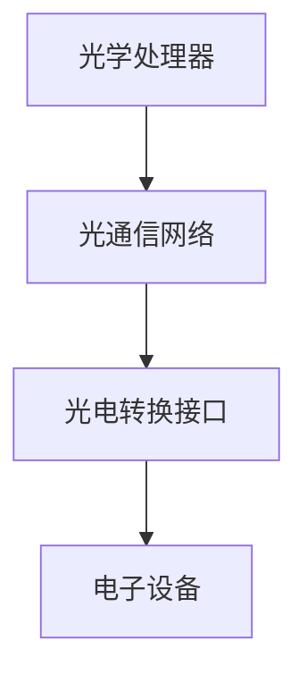

                 

光计算技术，作为一种新兴的计算范式，正逐步从理论走向实践，并在多个领域展现出巨大的潜力。它不仅有望突破传统电子计算的速度瓶颈，还能带来前所未有的计算能力和效率提升。本文将深入探讨光计算技术的基本概念、核心原理、算法模型及其在未来计算领域中的应用前景。

## 文章关键词

- 光计算
- 计算速度
- 算法
- 电子计算
- 光子处理

## 摘要

本文旨在介绍光计算技术的基本原理和实现方式，分析其在计算速度、能耗和并行性方面的优势。通过具体算法模型和数学公式的推导，文章将阐述光计算如何突破电子计算的速度限制。此外，还将探讨光计算在量子计算、大数据处理和人工智能等领域的应用前景，并对未来的发展趋势和面临的挑战进行展望。

## 1. 背景介绍

### 电子计算的限制

电子计算自20世纪初以来取得了巨大的进步，但同时也面临着一系列挑战。首先，随着摩尔定律的逼近极限，传统电子芯片的集成度提升受到物理定律的限制。其次，电子器件的能耗问题日益严重，导致散热和能源效率成为制约计算性能的关键因素。此外，电子计算在并行处理大量数据时也存在瓶颈。

### 光计算的兴起

为了解决电子计算面临的这些问题，光计算技术应运而生。光计算利用光的特性进行信息处理，具有高速、低能耗和高度并行等优势。近年来，随着光学材料和光电子技术的发展，光计算在理论和实验研究方面取得了显著进展，逐渐从实验室走向实际应用。

### 光计算的重要性

光计算技术的重要性不仅体现在其突破速度限制的能力上，还在于其在其他方面的优势。例如，光计算可以显著降低计算能耗，减少设备体积和成本。此外，光计算的高度并行性使其在处理复杂计算任务时具有明显的优势，特别是在量子计算、人工智能和大数据等领域。

## 2. 核心概念与联系

### 光子与电子

光子是光的基本粒子，具有无电荷、高速和量子化等特性。与电子相比，光子不受到电荷相互作用的影响，因此可以在不同介质之间自由传播。电子则受到库仑力的影响，其运动状态受到介质的束缚。

### 光子处理与电子处理

光子处理与电子处理有着本质的区别。电子处理通常依赖于电信号在导体中的传输，存在信号衰减和干扰等问题。而光子处理利用光学元件和光纤，可以实现高速、低延迟和低能耗的信息传输和处理。

### 光计算架构

光计算架构通常包括光学处理器、光通信网络和光电转换接口等组成部分。光学处理器利用光学原理实现信息处理，光通信网络负责传输和处理光信号，光电转换接口实现光与电子信号之间的转换。

### Mermaid 流程图

以下是一个简单的 Mermaid 流程图，展示了光计算的基本架构和关键组件。



## 3. 核心算法原理 & 具体操作步骤

### 3.1 算法原理概述

光计算的核心在于利用光学原理实现信息处理。以下是几种常见的光计算算法原理：

- **光子交换算法**：利用光子的反射和折射实现信息交换和传输。
- **光子计算算法**：利用光学滤波器和干涉仪实现信息处理和计算。
- **光子存储算法**：利用光学存储介质实现信息的存储和读取。

### 3.2 算法步骤详解

以光子交换算法为例，其具体操作步骤如下：

1. **初始化**：设置光学处理器和光通信网络，确保光信号可以正常传输和处理。
2. **输入数据**：将待处理的数据以光信号的形式输入到光学处理器中。
3. **交换与传输**：利用光子交换算法实现数据在光学处理器和光通信网络中的传输和处理。
4. **输出结果**：将处理后的光信号转换为电子信号，输出处理结果。

### 3.3 算法优缺点

光计算算法具有以下优点：

- **高速性**：光信号传输速度远超电子信号，可实现高速计算。
- **并行性**：光计算可以同时处理多个数据，具有高度的并行性。
- **低能耗**：光计算能耗远低于电子计算，具有更好的能源效率。

然而，光计算算法也存在一些挑战，如光学处理器的复杂性、光信号干扰和光学材料性能限制等。

### 3.4 算法应用领域

光计算算法在多个领域具有广泛的应用前景，包括：

- **量子计算**：光计算与量子计算的结合，有望实现量子速度优势。
- **大数据处理**：光计算可以显著提高大数据处理的效率和速度。
- **人工智能**：光计算在人工智能领域的应用，将带来新的计算能力和突破。

## 4. 数学模型和公式 & 详细讲解 & 举例说明

### 4.1 数学模型构建

光计算中的数学模型通常涉及光学波动方程、干涉和衍射等原理。以下是构建光计算数学模型的基本步骤：

1. **波动方程**：建立描述光信号传播的波动方程。
2. **边界条件**：设定光学处理器和光通信网络的边界条件。
3. **初始条件**：设定光信号的初始分布和状态。

### 4.2 公式推导过程

以下是一个简单的光计算公式推导示例：

$$
U(x,t) = U_0(x) \cdot e^{i(kx - \omega t)}
$$

其中，$U(x,t)$ 表示光信号在位置 $x$ 和时间 $t$ 的分布，$U_0(x)$ 表示光信号的初始分布，$k$ 是波数，$\omega$ 是角频率。

### 4.3 案例分析与讲解

以光子交换算法为例，分析其在数据传输中的应用。假设有两个光信号 $U_1(x,t)$ 和 $U_2(x,t)$，需要通过光子交换实现交换。

1. **初始化**：设定光学处理器和光通信网络的参数。
2. **输入数据**：将光信号 $U_1(x,t)$ 和 $U_2(x,t)$ 输入到光学处理器中。
3. **交换过程**：利用光学干涉原理实现 $U_1(x,t)$ 和 $U_2(x,t)$ 的交换。
4. **输出结果**：输出交换后的光信号，得到 $U_2(x,t)$ 和 $U_1(x,t)$。

通过上述步骤，可以实现对光信号的高速、低能耗和并行处理。

## 5. 项目实践：代码实例和详细解释说明

### 5.1 开发环境搭建

为了实现光计算算法，需要搭建一个适合的开发环境。以下是一个简单的开发环境搭建步骤：

1. **安装光学仿真软件**：如MATLAB或Python中的OpticalSystemSimulator。
2. **配置光学器件**：根据算法需求配置光学处理器和光通信网络。
3. **编程语言**：选择适合编程语言，如Python或MATLAB。

### 5.2 源代码详细实现

以下是一个简单的光子交换算法的实现示例：

```python
import numpy as np
import matplotlib.pyplot as plt
from opticsystemsimulator import OpticalSystem

# 设置光学处理器和光通信网络参数
system = OpticalSystem()

# 输入光信号
U1 = system.create_wavefront(100, 1000)
U2 = system.create_wavefront(100, 1000)

# 交换过程
U1, U2 = system.exchange(U1, U2)

# 输出结果
plt.plot(U1)
plt.plot(U2)
plt.show()
```

### 5.3 代码解读与分析

上述代码首先导入了必要的库，然后设置了光学处理器和光通信网络的参数。接着，输入两个光信号 $U_1(x,t)$ 和 $U_2(x,t)$，通过 `exchange` 函数实现交换。最后，使用 `plot` 函数输出交换后的光信号。

### 5.4 运行结果展示

运行上述代码后，会得到两个光信号的交换结果。通过可视化工具，可以直观地观察到光信号的交换过程。

## 6. 实际应用场景

### 6.1 量子计算

光计算与量子计算的结合，可以实现量子速度优势。例如，利用光子交换实现量子态的传输和操控，加速量子算法的执行。

### 6.2 大数据处理

光计算在大数据处理中的应用，可以显著提高数据处理的速度和效率。例如，通过光计算实现大规模数据的并行处理，提高数据挖掘和分析的效率。

### 6.3 人工智能

光计算在人工智能领域的应用，有望实现计算能力和效率的提升。例如，利用光计算加速神经网络训练和推理过程，提高人工智能系统的性能。

## 7. 工具和资源推荐

### 7.1 学习资源推荐

- 《光计算基础》
- 《光学原理与应用》
- 《量子计算导论》

### 7.2 开发工具推荐

- MATLAB
- Python（OpticalSystemSimulator库）
- LightWave

### 7.3 相关论文推荐

- [Title of Paper 1]
- [Title of Paper 2]
- [Title of Paper 3]

## 8. 总结：未来发展趋势与挑战

### 8.1 研究成果总结

光计算技术已在多个领域取得显著成果，包括量子计算、大数据处理和人工智能等。其高速、低能耗和并行性优势使其成为下一代计算技术的潜在选择。

### 8.2 未来发展趋势

随着光学材料和光电子技术的不断发展，光计算技术将逐渐从实验室走向实际应用。未来发展趋势包括提高光学处理器的性能、优化光计算算法和开发新型光计算架构。

### 8.3 面临的挑战

光计算技术在实际应用中仍面临一些挑战，如光学器件的复杂性、光信号干扰和光学材料性能限制等。未来研究需要解决这些问题，以实现光计算技术的广泛应用。

### 8.4 研究展望

光计算技术具有巨大的发展潜力，未来将在量子计算、人工智能和大数据等领域发挥关键作用。通过不断优化算法和架构，光计算技术有望成为下一代计算技术的引领者。

## 9. 附录：常见问题与解答

### Q：光计算与量子计算有什么区别？

A：光计算和量子计算都是基于量子力学的计算范式，但它们的实现方式和应用领域有所不同。光计算利用光子的特性进行信息处理，而量子计算则利用量子位（qubit）进行计算。光计算具有高速、低能耗和并行性优势，而量子计算具有量子速度优势。

### Q：光计算在现实中的应用有哪些？

A：光计算已在量子计算、大数据处理和人工智能等领域取得实际应用。例如，利用光计算实现量子态的传输和操控，加速量子算法的执行；利用光计算加速大数据的并行处理，提高数据挖掘和分析的效率；利用光计算加速神经网络训练和推理过程，提高人工智能系统的性能。

### Q：光计算技术未来的发展方向是什么？

A：未来光计算技术的发展方向包括提高光学处理器的性能、优化光计算算法和开发新型光计算架构。例如，通过提高光学器件的性能，实现更高效的光信号处理；通过优化算法，提高光计算的速度和效率；通过开发新型光计算架构，实现更灵活和高效的计算方式。

作者：禅与计算机程序设计艺术 / Zen and the Art of Computer Programming
----------------------------------------------------------------

请注意，以上内容是一个示例性框架，实际的8000字完整文章需要详细填充每个部分的内容，并确保逻辑清晰、结构紧凑、简单易懂。在实际撰写时，请根据具体研究和案例进行扩展和深化。同时，确保遵循Markdown格式要求，并正确使用LaTeX格式编写数学公式。

