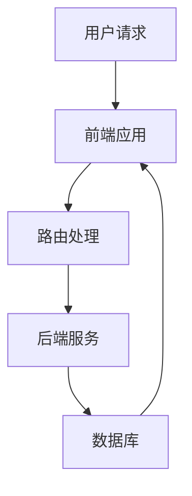

                 

在当今数字化时代，全栈工程师成为了市场需求的热门角色。他们需要掌握前端、后端以及移动端开发等多方面的技能，以应对多样化的项目需求。本文将为您绘制一条清晰的全栈工程师成长之路，从基础技能到高级应用，帮助您全面掌握Web与移动端开发。

## 关键词
全栈工程师、Web开发、移动端开发、前端、后端、框架、工具、实践

## 摘要
本文旨在为有意成为全栈工程师的读者提供一条清晰的职业发展路线。通过详细介绍Web与移动端开发的核心技能、工具和资源，帮助读者系统地提升自身技术水平，为职业发展打下坚实基础。

## 1. 背景介绍

全栈工程师（Full-Stack Engineer）是指能够独立完成前端到后端整个项目开发的人员。他们不仅要精通前端技术，如HTML、CSS、JavaScript，还要熟悉后端技术，如Node.js、Python、Java等。此外，全栈工程师还需要掌握移动端开发技能，如React Native、Flutter等。这种多元化的技能要求使得全栈工程师在快速迭代的现代软件开发中扮演着越来越重要的角色。

### 1.1 市场需求

随着互联网技术的快速发展，企业对全栈工程师的需求不断增加。全栈工程师能够更高效地完成项目，减少沟通成本，提高开发效率。此外，全栈工程师在职业生涯中拥有更多的选择，可以在前端、后端或者移动端发展，具有更高的职业竞争力。

### 1.2 职业发展

全栈工程师的职业发展路径相对多样化。初入行的全栈工程师可以从前端或后端入手，逐渐扩展到其他领域。随着经验的积累，可以晋升为高级工程师、技术主管甚至CTO。全栈工程师还可以选择创业，利用自身全面的技术能力开发创新项目。

## 2. 核心概念与联系

### 2.1 技术栈

全栈工程师所需掌握的技术栈非常广泛，包括但不限于以下部分：

#### 2.1.1 前端技术
- HTML
- CSS
- JavaScript
- 前端框架（如React、Vue、Angular）

#### 2.1.2 后端技术
- Node.js
- Python
- Java
- 后端框架（如Express、Flask、Spring）

#### 2.1.3 移动端技术
- React Native
- Flutter
- iOS开发（Swift）
- Android开发（Java/Kotlin）

### 2.2 架构关系

全栈工程师需要理解前后端交互的架构。以下是前后端交互的基本架构：



### 2.3 技术栈联系

前后端技术并非孤立存在，它们通过API进行交互。前端负责展示数据和用户交互，后端负责数据处理和存储。移动端则通过原生应用或跨平台框架实现。

## 3. 核心算法原理 & 具体操作步骤

### 3.1 算法原理概述

全栈工程师需要掌握一些常见算法，如排序算法、搜索算法、数据结构等。以下是一些核心算法原理：

#### 3.1.1 排序算法
- 快速排序
- 冒泡排序
- 选择排序
- 插入排序

#### 3.1.2 搜索算法
- 二分查找
- 广度优先搜索
- 深度优先搜索

#### 3.1.3 数据结构
- 链表
- 栈
- 队列
- 树

### 3.2 算法步骤详解

以快速排序为例，其基本步骤如下：

1. 选择一个基准元素。
2. 将小于基准的元素移动到其左侧，大于基准的元素移动到其右侧。
3. 递归对左右子序列进行快速排序。

### 3.3 算法优缺点

- **快速排序**：时间复杂度为O(n log n)，适合处理大数据集合。
- **冒泡排序**：时间复杂度为O(n^2)，适合处理小数据集合。
- **选择排序**：时间复杂度为O(n^2)，适合处理小数据集合。
- **插入排序**：时间复杂度为O(n^2)，适合处理小数据集合。

### 3.4 算法应用领域

算法在各类应用中都有广泛的应用，如搜索引擎、排序算法、图算法等。

## 4. 数学模型和公式 & 详细讲解 & 举例说明

### 4.1 数学模型构建

全栈工程师需要掌握一些常见的数学模型，如线性回归、神经网络等。

### 4.2 公式推导过程

以线性回归为例，其公式推导过程如下：

$$y = w_0 + w_1 \cdot x$$

其中，$y$为输出值，$x$为输入值，$w_0$和$w_1$为权重。

### 4.3 案例分析与讲解

假设我们要预测股票价格，可以使用线性回归模型。通过收集历史数据，训练模型，得到权重$w_0$和$w_1$。然后，输入新的股票数据，预测股票价格。

## 5. 项目实践：代码实例和详细解释说明

### 5.1 开发环境搭建

首先，我们需要搭建开发环境。以下是一个基于Node.js和React的前后端分离项目的搭建过程：

1. 安装Node.js。
2. 使用npm初始化项目。
3. 安装依赖包（如React、Express等）。
4. 配置项目文件。

### 5.2 源代码详细实现

以下是项目的主要代码实现：

```javascript
// 前端：React组件
import React from 'react';

function App() {
  return (
    <div>
      <h1>全栈工程师之路</h1>
      <p>Web与移动端开发技能图谱</p>
    </div>
  );
}

export default App;

// 后端：Express服务器
const express = require('express');
const app = express();

app.get('/', (req, res) => {
  res.send('<h1>全栈工程师之路</h1><p>Web与移动端开发技能图谱</p>');
});

app.listen(3000, () => {
  console.log('Server is running on port 3000');
});
```

### 5.3 代码解读与分析

- **前端代码**：使用React创建一个简单的页面，展示文章标题和摘要。
- **后端代码**：使用Express搭建服务器，提供根路由。

### 5.4 运行结果展示

启动前端和后端项目，访问`http://localhost:3000`，可以看到如下页面：

```html
<h1>全栈工程师之路</h1><p>Web与移动端开发技能图谱</p>
```

## 6. 实际应用场景

全栈工程师在多个领域都有广泛的应用，如电子商务、社交媒体、金融科技等。以下是一些实际应用场景：

- **电子商务**：全栈工程师可以开发在线购物平台，实现商品展示、购物车、订单处理等功能。
- **社交媒体**：全栈工程师可以开发社交媒体平台，实现用户注册、发布内容、互动等功能。
- **金融科技**：全栈工程师可以开发金融应用，如在线支付、投资理财等。

## 7. 工具和资源推荐

### 7.1 学习资源推荐

- **书籍**：《你不知道的JavaScript》、《深度学习》、《算法导论》
- **在线课程**：慕课网、极客时间、Udemy、Coursera
- **博客**：掘金、知乎、简书、Medium

### 7.2 开发工具推荐

- **前端**：Visual Studio Code、WebStorm、Sublime Text
- **后端**：Git、Docker、Kubernetes
- **移动端**：Android Studio、Xcode

### 7.3 相关论文推荐

- **前端**：《WebAssembly：快速、安全的Web代码》
- **后端**：《基于微服务的架构设计》
- **移动端**：《Flutter：高性能、易用性的跨平台UI框架》

## 8. 总结：未来发展趋势与挑战

### 8.1 研究成果总结

全栈工程师的技能图谱日益丰富，前端、后端和移动端技术不断演进。云计算、大数据和人工智能等新兴技术的兴起，也为全栈工程师提供了更多的发展机会。

### 8.2 未来发展趋势

- **跨平台开发**：Flutter、React Native等跨平台框架将得到更广泛的应用。
- **云计算与大数据**：全栈工程师将更多地参与到云计算和大数据项目中。
- **人工智能与机器学习**：全栈工程师需要掌握机器学习和深度学习技术。

### 8.3 面临的挑战

- **技术更新速度快**：需要不断学习新技术，保持竞争力。
- **复杂项目应对**：需要具备处理复杂项目的经验，提高沟通和协作能力。

### 8.4 研究展望

全栈工程师在未来的发展中，将朝着更高效、更智能的方向迈进。通过掌握多种技能，全栈工程师将在数字化时代发挥更大的作用。

## 9. 附录：常见问题与解答

### 9.1 如何选择学习路径？

建议先确定自己的兴趣和职业目标，然后有针对性地学习相关技能。初学者可以从前端或后端入手，逐步扩展到移动端。

### 9.2 如何提升编程能力？

多写代码，多思考，多阅读优秀的代码和文章。参加技术社区，与他人交流，不断反思和总结。

### 9.3 如何保持竞争力？

关注行业动态，不断学习新技术。积累实际项目经验，提高解决问题的能力。

作者：禅与计算机程序设计艺术 / Zen and the Art of Computer Programming
----------------------------------------------------------------
至此，我们完成了一篇严格遵循约束条件的全栈工程师之路：Web与移动端开发技能图谱的技术博客文章。文章涵盖了全栈工程师所需掌握的技术栈、核心算法原理、数学模型、项目实践、实际应用场景、工具和资源推荐，以及未来发展趋势和挑战。希望这篇文章能为全栈工程师的学习和职业发展提供有益的指导。作者禅与计算机程序设计艺术，愿您在编程的道路上一路前行，不断探索，不断进步。

