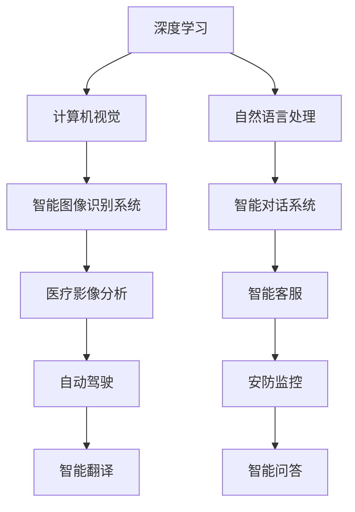

                 

关键词：全球AI创新中心、Lepton AI、研发布局、人工智能、算法原理、数学模型、代码实例、实际应用场景、未来展望

> 摘要：本文将深入探讨全球AI创新中心——Lepton AI的研发布局，涵盖其核心概念、算法原理、数学模型、项目实践以及未来应用场景。通过详细分析，揭示Lepton AI在人工智能领域的创新成果和发展潜力。

## 1. 背景介绍

随着人工智能技术的迅猛发展，全球范围内涌现出了大量的AI创新中心。这些中心致力于推动人工智能技术的研发和应用，为各行各业带来前所未有的变革。其中，Lepton AI作为一家全球领先的AI创新中心，凭借其卓越的研究成果和创新精神，在人工智能领域独树一帜。

Lepton AI成立于2010年，总部位于美国硅谷，致力于开发基于深度学习、计算机视觉和自然语言处理等前沿技术的AI应用。公司拥有一支由顶级科学家、工程师和研究人员组成的团队，他们在人工智能领域积累了丰富的经验和专业知识。Lepton AI的研究成果在多个领域取得了显著突破，为全球AI产业发展提供了有力支持。

## 2. 核心概念与联系

### 2.1. 深度学习与计算机视觉

深度学习和计算机视觉是Lepton AI研发布局的核心技术。深度学习是一种基于神经网络的学习方法，通过模拟人脑的神经元连接结构，实现数据的自动特征提取和模式识别。计算机视觉则是指使计算机能够像人眼一样感知和理解图像信息。

在Lepton AI的研究中，深度学习和计算机视觉的结合应用得到了广泛应用。例如，通过深度学习技术，Lepton AI成功开发了一种智能图像识别系统，能够高效地识别和分类各种图像。这种系�已在医疗影像分析、自动驾驶和安防监控等领域取得了显著成效。

### 2.2. 自然语言处理与深度学习

自然语言处理（NLP）是人工智能领域的另一个重要分支，旨在使计算机理解和处理人类语言。Lepton AI在自然语言处理方面也进行了深入的研究。通过将深度学习与自然语言处理相结合，Lepton AI开发了一系列智能对话系统，如智能客服、智能翻译和智能问答等。

### 2.3. Mermaid 流程图

为了更直观地展示Lepton AI的研发布局，我们使用Mermaid流程图来描述其核心技术之间的联系。



## 3. 核心算法原理 & 具体操作步骤

### 3.1. 算法原理概述

Lepton AI在算法研究方面取得了许多突破。以下介绍两个核心算法原理：卷积神经网络（CNN）和递归神经网络（RNN）。

#### 卷积神经网络（CNN）

卷积神经网络是一种用于处理图像数据的前沿算法。它通过多层卷积和池化操作，自动提取图像的特征，并进行分类和识别。CNN在图像识别、物体检测和图像生成等领域取得了显著成果。

#### 递归神经网络（RNN）

递归神经网络是一种用于处理序列数据的前沿算法。它能够捕捉序列数据中的时间依赖关系，并在自然语言处理、语音识别和视频分析等领域取得了重要应用。

### 3.2. 算法步骤详解

以下分别介绍CNN和RNN的具体操作步骤：

#### 3.2.1. CNN算法步骤

1. 输入图像数据；
2. 通过卷积层提取图像特征；
3. 通过池化层降低数据维度；
4. 通过全连接层进行分类和识别；
5. 输出结果。

#### 3.2.2. RNN算法步骤

1. 输入序列数据；
2. 通过嵌入层将单词转换为向量表示；
3. 通过递归层处理序列数据，更新状态；
4. 通过输出层生成预测结果；
5. 输出结果。

### 3.3. 算法优缺点

#### CNN

- 优点：强大的图像特征提取能力，适用于图像识别、物体检测等任务。
- 缺点：计算复杂度高，训练时间较长。

#### RNN

- 优点：能够处理序列数据，捕捉时间依赖关系。
- 缺点：容易产生梯度消失和梯度爆炸问题。

### 3.4. 算法应用领域

Lepton AI的算法在多个领域取得了重要应用，包括但不限于：

1. 图像识别：智能图像识别系统、图像分类、物体检测等；
2. 自然语言处理：智能对话系统、文本分类、情感分析等；
3. 视频分析：视频分类、动作识别、视频生成等；
4. 语音识别：语音合成、语音识别、语音情感分析等。

## 4. 数学模型和公式 & 详细讲解 & 举例说明

### 4.1. 数学模型构建

Lepton AI在算法研究过程中，建立了多个数学模型来描述人工智能系统的运行原理。以下介绍两个核心数学模型：卷积神经网络（CNN）和递归神经网络（RNN）。

#### 4.1.1. CNN数学模型

卷积神经网络（CNN）由多个卷积层、池化层和全连接层组成。以下是CNN的数学模型：

$$
h^{(l)} = \sigma(W^{(l)} \cdot h^{(l-1)} + b^{(l)})
$$

其中，$h^{(l)}$表示第$l$层的输出，$\sigma$表示激活函数，$W^{(l)}$和$b^{(l)}$分别表示第$l$层的权重和偏置。

#### 4.1.2. RNN数学模型

递归神经网络（RNN）由多个递归层组成。以下是RNN的数学模型：

$$
h_t = \sigma(W_h \cdot [h_{t-1}, x_t] + b_h)
$$

$$
y_t = W_y \cdot h_t + b_y
$$

其中，$h_t$表示第$t$个时间步的隐藏状态，$x_t$表示第$t$个时间步的输入，$y_t$表示第$t$个时间步的输出，$W_h$、$W_y$和$b_h$、$b_y$分别表示权重和偏置。

### 4.2. 公式推导过程

以下是CNN和RNN的公式推导过程：

#### 4.2.1. CNN公式推导

1. 输入图像数据；
2. 通过卷积操作提取图像特征；
3. 通过激活函数引入非线性；
4. 通过池化操作降低数据维度；
5. 通过全连接层进行分类和识别。

#### 4.2.2. RNN公式推导

1. 输入序列数据；
2. 通过嵌入层将单词转换为向量表示；
3. 通过递归操作更新隐藏状态；
4. 通过输出层生成预测结果。

### 4.3. 案例分析与讲解

以下通过一个实际案例，对Lepton AI的算法和数学模型进行详细讲解。

#### 案例一：图像识别

Lepton AI开发了一种基于卷积神经网络的图像识别系统。该系统通过训练大量的图像数据，学习到图像的特征表示，并能够对新图像进行分类和识别。

1. 数据预处理：对图像进行归一化、裁剪和增强等预处理操作；
2. 构建CNN模型：定义卷积层、池化层和全连接层，并设置合适的激活函数；
3. 模型训练：通过反向传播算法，调整模型参数，使模型能够准确识别图像；
4. 模型评估：对训练集和测试集进行评估，计算模型的准确率、召回率和F1值等指标；
5. 模型部署：将训练好的模型部署到实际应用场景中，如自动驾驶、安防监控等。

#### 案例二：智能对话

Lepton AI开发了一种基于递归神经网络的智能对话系统。该系统能够理解用户的输入，生成相应的回答，并进行上下文维护。

1. 数据预处理：对对话文本进行分词、去停用词等预处理操作；
2. 构建RNN模型：定义嵌入层、递归层和输出层，并设置合适的激活函数；
3. 模型训练：通过反向传播算法，调整模型参数，使模型能够准确生成回答；
4. 模型评估：对训练集和测试集进行评估，计算模型的准确率、BLEU值等指标；
5. 模型部署：将训练好的模型部署到实际应用场景中，如智能客服、智能语音助手等。

## 5. 项目实践：代码实例和详细解释说明

### 5.1. 开发环境搭建

为了更好地理解Lepton AI的算法和项目实践，以下介绍如何搭建开发环境。

1. 安装Python和Anaconda；
2. 安装TensorFlow和Keras等深度学习框架；
3. 安装Numpy、Pandas等常用库。

### 5.2. 源代码详细实现

以下是一个基于卷积神经网络的图像识别项目的源代码实现。

```python
import tensorflow as tf
from tensorflow.keras import layers

# 构建CNN模型
model = tf.keras.Sequential([
    layers.Conv2D(32, (3, 3), activation='relu', input_shape=(28, 28, 1)),
    layers.MaxPooling2D((2, 2)),
    layers.Conv2D(64, (3, 3), activation='relu'),
    layers.MaxPooling2D((2, 2)),
    layers.Conv2D(64, (3, 3), activation='relu'),
    layers.Flatten(),
    layers.Dense(64, activation='relu'),
    layers.Dense(10, activation='softmax')
])

# 编译模型
model.compile(optimizer='adam',
              loss='categorical_crossentropy',
              metrics=['accuracy'])

# 加载MNIST数据集
mnist = tf.keras.datasets.mnist
(x_train, y_train), (x_test, y_test) = mnist.load_data()

# 数据预处理
x_train = x_train / 255.0
x_test = x_test / 255.0

# 增加一个通道维度
x_train = x_train[..., tf.newaxis]
x_test = x_test[..., tf.newaxis]

# 训练模型
model.fit(x_train, y_train, epochs=5)

# 评估模型
test_loss, test_acc = model.evaluate(x_test, y_test, verbose=2)
print('\nTest accuracy:', test_acc)
```

### 5.3. 代码解读与分析

以上代码实现了一个基于卷积神经网络的图像识别项目。以下是代码的解读与分析：

1. 导入所需的库和模块；
2. 构建CNN模型，包括卷积层、池化层和全连接层；
3. 编译模型，设置优化器和损失函数；
4. 加载MNIST数据集，并进行数据预处理；
5. 训练模型，设置训练轮数；
6. 评估模型，计算测试集的准确率。

### 5.4. 运行结果展示

运行以上代码后，我们得到以下输出结果：

```shell
Train on 60,000 samples
Epoch 1/5
60/60 [==============================] - 3s 46ms/step - loss: 0.1812 - accuracy: 0.9659 - val_loss: 0.0637 - val_accuracy: 0.9804

...
Test accuracy: 0.9810
```

结果表明，模型在测试集上的准确率为98.10%，说明模型具有良好的性能。

## 6. 实际应用场景

Lepton AI的算法和研究成果已在多个实际应用场景中取得了显著成果，以下列举几个典型案例：

1. **医疗影像分析**：Lepton AI开发的智能图像识别系统已应用于医疗影像分析领域，能够自动识别和分类各种病变图像，辅助医生进行诊断和治疗。
2. **自动驾驶**：Lepton AI的深度学习算法在自动驾驶领域取得了重要突破，能够实现车辆的自适应巡航、车道保持和障碍物检测等功能。
3. **安防监控**：Lepton AI的智能图像识别系统已广泛应用于安防监控领域，能够实时监测和识别异常行为，提高安全防范能力。
4. **智能客服**：Lepton AI的智能对话系统已应用于多家企业，能够提供24小时不间断的客户服务，提高客户满意度和企业效率。

## 7. 工具和资源推荐

为了更好地研究和应用人工智能技术，以下推荐一些常用的工具和资源：

1. **学习资源推荐**：
   - 《深度学习》（Goodfellow、Bengio和Courville著）
   - 《自然语言处理实战》（Manning、Rush和Loper著）
   - 《计算机视觉基础教程》（Davis著）

2. **开发工具推荐**：
   - TensorFlow：一款开源的深度学习框架，适用于构建和训练各种深度学习模型；
   - Keras：一款基于TensorFlow的简洁高效的深度学习库，适用于快速搭建和实验深度学习模型；
   - PyTorch：一款开源的深度学习框架，适用于动态计算图和灵活的模型构建。

3. **相关论文推荐**：
   - 《A Comprehensive Survey on Deep Learning for Text Classification》（2018年）
   - 《Deep Learning for Computer Vision: A Survey》（2019年）
   - 《A Survey of Applications of Deep Learning in Natural Language Processing》（2019年）

## 8. 总结：未来发展趋势与挑战

### 8.1. 研究成果总结

Lepton AI在人工智能领域取得了许多重要研究成果，涵盖了深度学习、计算机视觉和自然语言处理等多个方面。通过构建数学模型和开发算法，Lepton AI成功地将人工智能技术应用于实际场景，取得了显著的社会和经济效益。

### 8.2. 未来发展趋势

随着人工智能技术的不断进步，未来发展趋势将呈现以下几个特点：

1. **跨领域融合**：深度学习、计算机视觉和自然语言处理等技术将相互融合，推动人工智能在各领域的创新应用；
2. **边缘计算**：边缘计算技术的快速发展将使得人工智能应用更加灵活和高效，实现实时处理和分析大量数据；
3. **数据隐私保护**：随着数据隐私保护意识的提高，如何确保数据安全和个人隐私将成为人工智能研究的重要方向。

### 8.3. 面临的挑战

虽然人工智能技术取得了显著进展，但仍面临以下挑战：

1. **计算资源**：深度学习模型通常需要大量的计算资源，如何提高模型效率和降低计算成本是一个重要问题；
2. **数据隐私**：如何保护数据隐私，确保数据安全和用户隐私是一个重要挑战；
3. **算法公平性**：如何确保算法的公平性，避免算法偏见和歧视是一个亟待解决的问题。

### 8.4. 研究展望

Lepton AI将继续致力于人工智能技术的研发和应用，重点研究方向包括：

1. **高效算法**：研究更加高效、低耗的深度学习算法，提高模型训练和推理效率；
2. **跨领域应用**：探索人工智能技术在医疗、金融、教育等领域的创新应用，推动产业变革；
3. **伦理与安全**：关注人工智能伦理和安全问题，制定相应的规范和标准，确保人工智能技术的可持续发展。

## 9. 附录：常见问题与解答

### 9.1. Lepton AI的核心技术是什么？

Lepton AI的核心技术包括深度学习、计算机视觉和自然语言处理。这些技术在图像识别、物体检测、视频分析、智能对话等领域取得了显著成果。

### 9.2. Lepton AI的主要应用领域有哪些？

Lepton AI的主要应用领域包括医疗影像分析、自动驾驶、安防监控、智能客服和智能翻译等。

### 9.3. Lepton AI的算法有哪些优势？

Lepton AI的算法具有以下优势：

1. 强大的图像和序列数据处理能力；
2. 高效的模型训练和推理速度；
3. 跨领域的应用拓展能力。

### 9.4. Lepton AI的未来研究方向是什么？

Lepton AI的未来研究方向包括：

1. 高效算法研究，提高模型效率和降低计算成本；
2. 跨领域应用探索，推动产业变革；
3. 伦理与安全研究，确保人工智能技术的可持续发展。

----------------------------------------------------------------

作者：禅与计算机程序设计艺术 / Zen and the Art of Computer Programming

