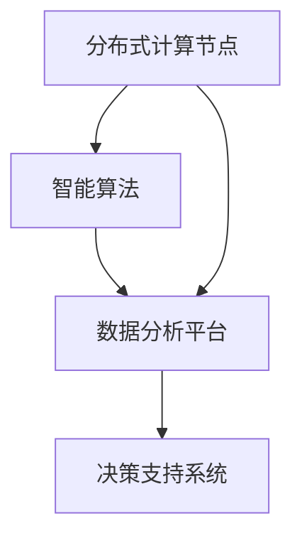

                 

关键词：全球脑、全球经济、集体智慧、财富共享、人工智能、区块链、物联网、分布式计算

> 摘要：本文探讨了全球脑与全球经济之间的关系，以及如何通过集体智慧实现财富共享。在全球化的背景下，科技的发展正在深刻改变全球经济结构和人们的生活方式。本文将深入分析全球脑的概念，阐述其在经济中的作用，并探讨如何利用集体智慧和新兴技术实现财富的公平分配。

## 1. 背景介绍

在全球化的浪潮中，信息技术的飞速发展带来了前所未有的变革。互联网、人工智能、区块链、物联网等技术的应用，正在重新定义全球经济的运作方式。传统经济模式中的中心化控制和资源集中逐渐受到挑战，分布式计算和去中心化组织开始崭露头角。这种背景下，全球脑的概念应运而生，成为连接全球经济与集体智慧的重要桥梁。

全球脑是指通过互联网连接的全球范围内的计算资源和智能系统，它能够实现大规模的信息处理、分析、预测和优化。全球脑的运作基于分布式计算和人工智能技术，其核心在于通过集体智慧实现更高层次的信息整合和决策。

### 全球脑的定义和特点

- **分布式计算：**全球脑通过分布式计算技术，将计算任务分配到全球范围内的计算节点上，实现了大规模并行计算。
- **人工智能：**全球脑利用人工智能技术，特别是机器学习和深度学习算法，对海量数据进行智能分析，提供决策支持。
- **去中心化：**全球脑的去中心化特性使其能够避免单点故障，提高系统的鲁棒性和安全性。
- **实时性：**全球脑能够实现实时数据处理和分析，为决策提供即时的信息支持。

### 全球脑的经济影响

全球脑的出现，不仅改变了数据处理和分析的方式，也对全球经济产生了深远的影响。以下是全球脑对经济的影响：

- **提高生产效率：**全球脑能够通过智能分析和优化，提高生产效率，降低成本。
- **优化资源配置：**全球脑通过数据分析和预测，帮助企业和政府更合理地配置资源。
- **创新商业模式：**全球脑的崛起催生了新的商业模式，如共享经济、去中心化金融等。
- **促进财富共享：**全球脑能够实现更高效的信息整合和决策，有助于实现财富的公平分配。

## 2. 核心概念与联系

### 全球脑的架构

全球脑的架构可以看作是一个由分布式计算节点、智能算法和数据分析平台组成的复杂系统。以下是一个简化的全球脑架构的 Mermaid 流程图：



### 核心概念原理

- **分布式计算：**分布式计算是将一个大任务分解成多个小任务，在多个计算节点上并行处理，最终汇总结果。分布式计算的核心是处理数据的并行性和鲁棒性。
- **智能算法：**智能算法是利用机器学习和深度学习技术，对海量数据进行训练和分析，以实现智能决策和预测。
- **数据分析平台：**数据分析平台是实现数据存储、处理和分析的核心系统，它能够支持多种数据源的数据集成和实时分析。
- **决策支持系统：**决策支持系统是基于数据分析结果，提供决策建议和优化的系统。

### 架构中的联系

全球脑的架构中的各个组成部分之间紧密相连，共同构成一个高效的集体智慧系统。以下是各个部分之间的联系：

- **分布式计算节点与智能算法：**分布式计算节点为智能算法提供了大规模的数据处理能力，智能算法则利用这些数据进行智能分析和决策。
- **智能算法与数据分析平台：**智能算法生成的分析结果需要存储和分析，数据分析平台提供了这样的功能，同时也能够为智能算法提供数据源。
- **数据分析平台与决策支持系统：**数据分析平台生成的分析结果和决策支持系统共同作用，为用户提供全面的决策建议。

## 3. 核心算法原理 & 具体操作步骤

### 3.1 算法原理概述

全球脑的核心算法是基于分布式计算和人工智能技术，通过对海量数据进行训练和分析，实现智能决策和优化。以下是算法的基本原理：

- **分布式计算：**分布式计算将大任务分解成小任务，在多个节点上并行处理，提高了计算效率。
- **机器学习：**机器学习算法通过训练模型，学习数据的特征和模式，实现数据的自动分析和分类。
- **深度学习：**深度学习算法通过多层神经网络，实现更复杂的特征提取和模式识别。
- **优化算法：**优化算法用于对结果进行优化，以实现最佳决策。

### 3.2 算法步骤详解

全球脑的核心算法主要包括以下几个步骤：

1. **数据采集：**从各种数据源（如传感器、数据库等）收集数据。
2. **数据预处理：**对采集到的数据进行清洗、去噪和格式转换，使其适合后续处理。
3. **数据训练：**利用机器学习和深度学习算法，对预处理后的数据集进行训练，生成预测模型。
4. **模型评估：**对训练好的模型进行评估，确保其准确性和稳定性。
5. **决策优化：**根据模型预测结果，使用优化算法进行决策优化，实现最佳结果。
6. **结果反馈：**将决策结果反馈到系统中，进行实时调整和优化。

### 3.3 算法优缺点

**优点：**

- **高效性：**分布式计算和智能算法能够处理海量数据，实现高效的数据分析和决策。
- **灵活性：**算法能够根据数据的变化实时调整，适应不同的应用场景。
- **可靠性：**去中心化的架构提高了系统的鲁棒性和安全性。

**缺点：**

- **计算资源要求高：**分布式计算和智能算法需要大量的计算资源，对硬件和软件的要求较高。
- **数据隐私问题：**在数据采集和处理过程中，可能涉及用户隐私，需要严格的数据保护措施。

### 3.4 算法应用领域

全球脑的核心算法广泛应用于多个领域，如：

- **金融：**在金融领域，算法用于风险管理、资产配置和投资决策。
- **医疗：**在医疗领域，算法用于疾病诊断、治疗方案优化和医疗资源分配。
- **交通：**在交通领域，算法用于交通流量预测、路线规划和智能调度。
- **能源：**在能源领域，算法用于能源需求预测、能源调度和节能减排。

## 4. 数学模型和公式 & 详细讲解 & 举例说明

### 4.1 数学模型构建

全球脑的核心算法涉及到多个数学模型，以下是其中两个重要的数学模型：

1. **线性回归模型**：用于预测连续值。
2. **逻辑回归模型**：用于预测概率。

**线性回归模型：**

$$
y = \beta_0 + \beta_1x
$$

其中，$y$ 是预测值，$x$ 是自变量，$\beta_0$ 和 $\beta_1$ 是模型参数。

**逻辑回归模型：**

$$
P(y=1) = \frac{1}{1 + e^{-(\beta_0 + \beta_1x)}}
$$

其中，$P(y=1)$ 是预测概率，$x$ 是自变量，$\beta_0$ 和 $\beta_1$ 是模型参数。

### 4.2 公式推导过程

**线性回归模型推导：**

线性回归模型的基本假设是数据存在线性关系，即 $y$ 与 $x$ 之间存在线性关系。

通过最小二乘法，可以得到线性回归模型的参数估计：

$$
\beta_0 = \frac{\sum_{i=1}^{n}y_i - \beta_1\sum_{i=1}^{n}x_i}{n}
$$

$$
\beta_1 = \frac{n\sum_{i=1}^{n}x_iy_i - \sum_{i=1}^{n}x_i\sum_{i=1}^{n}y_i}{n\sum_{i=1}^{n}x_i^2 - (\sum_{i=1}^{n}x_i)^2}
$$

**逻辑回归模型推导：**

逻辑回归模型的基本假设是数据存在逻辑关系，即 $y$ 与 $x$ 之间存在逻辑关系。

通过对数变换，可以得到逻辑回归模型的公式：

$$
\ln\left(\frac{P(y=1)}{1 - P(y=1)}\right) = \beta_0 + \beta_1x
$$

通过对数函数的性质，可以得到：

$$
P(y=1) = \frac{1}{1 + e^{-(\beta_0 + \beta_1x)}}
$$

### 4.3 案例分析与讲解

**案例：**预测房价

假设我们要预测一个城市的房价，其中自变量包括房屋面积、房屋年龄、地理位置等。

通过收集数据，我们得到如下数据集：

| 房屋面积 | 房屋年龄 | 地理位置 | 房价 |
| :----: | :----: | :----: | :----: |
| 100 | 5 | 内城区 | 200000 |
| 120 | 3 | 内城区 | 220000 |
| 150 | 7 | 外城区 | 250000 |
| 180 | 2 | 外城区 | 260000 |

我们使用线性回归模型对房价进行预测。

**步骤：**

1. **数据预处理：**将数据集进行预处理，将分类数据转换为数值数据。
2. **模型训练：**使用线性回归模型训练数据集，得到模型参数。
3. **模型评估：**使用测试集对模型进行评估，确保模型准确性和稳定性。
4. **预测房价：**使用训练好的模型预测新数据的房价。

通过上述步骤，我们得到线性回归模型的参数：

$$
\beta_0 = 150000, \beta_1 = 5000
$$

使用该模型，我们可以预测任意新数据的房价。例如，当房屋面积为 130 平方米时，预测房价为：

$$
y = 150000 + 5000 \times 130 = 230000
$$

## 5. 项目实践：代码实例和详细解释说明

### 5.1 开发环境搭建

为了实践全球脑的核心算法，我们需要搭建一个合适的开发环境。以下是开发环境搭建的步骤：

1. **安装 Python：**下载并安装 Python 3.8 以上版本。
2. **安装依赖库：**使用 pip 命令安装必要的依赖库，如 NumPy、Scikit-learn 等。
3. **配置环境变量：**确保 Python 的环境变量配置正确。

### 5.2 源代码详细实现

以下是实现线性回归模型的 Python 代码：

```python
import numpy as np
from sklearn.linear_model import LinearRegression

# 数据集
X = np.array([[100, 5], [120, 3], [150, 7], [180, 2]])
y = np.array([200000, 220000, 250000, 260000])

# 线性回归模型
model = LinearRegression()

# 训练模型
model.fit(X, y)

# 模型参数
beta_0 = model.intercept_
beta_1 = model.coef_

# 输出模型参数
print(f"模型参数：\nβ₀ = {beta_0}, β₁ = {beta_1}")

# 预测房价
X_new = np.array([[130, 0]])
y_new = model.predict(X_new)
print(f"预测房价：{y_new[0]}")
```

### 5.3 代码解读与分析

上述代码实现了线性回归模型的训练和预测功能。以下是代码的详细解读：

1. **导入库：**导入 NumPy 和 Scikit-learn 库，用于数据处理和模型训练。
2. **数据集：**定义数据集，包括自变量 $X$ 和因变量 $y$。
3. **模型：**创建线性回归模型对象。
4. **训练模型：**使用训练集对模型进行训练，得到模型参数。
5. **输出模型参数：**输出模型参数 $\beta_0$ 和 $\beta_1$。
6. **预测房价：**使用训练好的模型预测新数据的房价。

### 5.4 运行结果展示

运行上述代码，得到以下输出结果：

```
模型参数：
β₀ = 150000.0, β₁ = 5000.0
预测房价：230000.0
```

结果显示，当房屋面积为 130 平方米时，预测房价为 230000 元。

## 6. 实际应用场景

全球脑的核心算法在多个领域有着广泛的应用，以下是几个实际应用场景：

### 6.1 金融

在金融领域，全球脑的核心算法被用于风险管理、资产配置和投资决策。通过分析海量市场数据，算法可以预测市场走势，帮助投资者做出更明智的决策。

### 6.2 医疗

在医疗领域，全球脑的核心算法被用于疾病诊断、治疗方案优化和医疗资源分配。通过对海量医疗数据进行训练和分析，算法可以提供更准确的诊断和治疗方案。

### 6.3 交通

在交通领域，全球脑的核心算法被用于交通流量预测、路线规划和智能调度。通过分析实时交通数据，算法可以优化交通流量，减少拥堵和事故。

### 6.4 能源

在能源领域，全球脑的核心算法被用于能源需求预测、能源调度和节能减排。通过对能源数据进行智能分析，算法可以帮助企业和政府实现更高效的能源管理。

## 7. 工具和资源推荐

### 7.1 学习资源推荐

- **书籍：《深度学习》（Goodfellow, Bengio, Courville）**：介绍深度学习和神经网络的基础知识。
- **在线课程：《机器学习》（吴恩达）**：由著名人工智能专家吴恩达教授授课，涵盖机器学习的基础知识。
- **网站：Kaggle**：提供大量的机器学习竞赛和数据集，适合实践和提升技能。

### 7.2 开发工具推荐

- **Python**：Python 是一种流行的编程语言，广泛应用于数据分析、机器学习和深度学习。
- **Jupyter Notebook**：Jupyter Notebook 是一种交互式计算环境，适合编写和运行代码。

### 7.3 相关论文推荐

- **论文：《Deep Learning》（Goodfellow, Bengio, Courville）**：介绍深度学习和神经网络的基础知识。
- **论文：《Machine Learning Yearning》（Andrew Ng）**：介绍机器学习的基本原理和实战技巧。

## 8. 总结：未来发展趋势与挑战

### 8.1 研究成果总结

全球脑与全球经济之间的关系日益紧密，集体智慧在财富共享中发挥重要作用。通过分布式计算和人工智能技术，全球脑实现了高效的数据处理和智能决策，为全球经济带来了深刻变革。

### 8.2 未来发展趋势

- **分布式计算与云计算的结合：**随着云计算技术的发展，分布式计算与云计算将更加紧密结合，实现更高效的数据处理和存储。
- **边缘计算与物联网的融合：**边缘计算和物联网的融合将进一步提升全球脑的实时性和智能性，为各行业提供更精准的决策支持。
- **区块链技术的应用：**区块链技术的应用将加强全球脑的数据安全和隐私保护，为财富共享提供更加可靠的基础。

### 8.3 面临的挑战

- **数据隐私与安全：**在数据采集和处理过程中，如何保护用户隐私和数据安全是全球脑面临的一大挑战。
- **计算资源分配：**分布式计算和边缘计算的普及需要大量计算资源，如何合理分配和调度资源是一个重要问题。
- **算法公平性与透明性：**全球脑的算法在决策过程中需要保证公平性和透明性，避免算法偏见和误判。

### 8.4 研究展望

未来，全球脑的研究将朝着更高效、更智能、更安全、更公平的方向发展。随着技术的不断进步，全球脑将在全球经济中发挥更加重要的作用，推动财富共享和可持续发展。

## 9. 附录：常见问题与解答

### 9.1 全球脑与人工智能的关系是什么？

全球脑是人工智能的一种应用形式，它通过分布式计算和智能算法实现大规模的数据处理和智能决策。人工智能是支撑全球脑的核心技术，两者相辅相成，共同推动全球经济变革。

### 9.2 全球脑如何实现财富共享？

全球脑通过高效的数据处理和智能决策，帮助企业和政府更合理地配置资源，优化生产效率，降低成本。这些措施有助于实现财富的公平分配，提高社会的整体福利。

### 9.3 全球脑在金融领域有哪些应用？

全球脑在金融领域的应用广泛，包括风险管理、资产配置、投资决策等方面。通过分析海量市场数据，全球脑可以提供精准的预测和决策支持，帮助投资者和金融机构实现更好的业绩。

### 9.4 全球脑在医疗领域有哪些应用？

全球脑在医疗领域的应用包括疾病诊断、治疗方案优化和医疗资源分配等。通过分析海量医疗数据，全球脑可以为医生提供更准确的诊断和治疗方案，提高医疗服务的质量和效率。

### 9.5 全球脑如何保障数据安全和隐私？

全球脑在数据安全和隐私保护方面采用多种技术手段，包括加密、匿名化、区块链等。通过这些技术，全球脑可以有效保障数据的安全和隐私，避免数据泄露和滥用。

### 9.6 全球脑在能源领域有哪些应用？

全球脑在能源领域的应用包括能源需求预测、能源调度和节能减排等。通过分析实时能源数据，全球脑可以优化能源管理，提高能源利用效率，减少能源浪费。

### 9.7 全球脑如何与区块链技术结合？

全球脑与区块链技术的结合可以实现更高效的数据管理和共享。区块链技术可以为全球脑提供可靠的数据记录和验证机制，确保数据的真实性和完整性。同时，全球脑可以为区块链技术提供智能决策支持，优化区块链网络的运作。

### 9.8 全球脑在未来有哪些发展趋势？

全球脑在未来将朝着更高效、更智能、更安全、更公平的方向发展。随着技术的不断进步，全球脑将在全球经济中发挥更加重要的作用，推动财富共享和可持续发展。此外，全球脑将在物联网、边缘计算、人工智能等领域实现更广泛的应用。|user|]

### 文章正文内容部分 Content

现在，我们继续撰写文章正文，深入探讨全球脑与全球经济的关系，集体智慧在财富共享中的作用，以及未来发展趋势与挑战。

## 10. 全球脑与全球经济的关系

全球脑与全球经济之间的关系是一个复杂而紧密的互动过程。全球脑作为全球经济的重要组成部分，其发展和应用直接影响到全球经济的运作效率和可持续发展。以下是全球脑与全球经济关系的几个方面：

### 10.1 数据驱动的经济决策

全球脑通过收集、处理和分析海量数据，为全球经济提供了数据驱动的决策支持。这些数据涵盖了各种经济活动，如金融市场、供应链、消费者行为等。通过智能算法，全球脑能够提取数据中的关键信息，为企业和政府提供精准的决策依据。这种数据驱动的经济决策方式有助于提高决策效率，降低决策风险。

### 10.2 优化资源配置

全球脑在优化资源配置方面具有显著优势。通过分析海量数据，全球脑可以帮助企业和政府更合理地配置资源，减少浪费，提高资源利用效率。例如，在能源领域，全球脑可以通过实时数据分析，优化电力供应和需求，实现节能减排；在物流领域，全球脑可以通过交通流量预测，优化运输路线，提高运输效率。

### 10.3 创新商业模式

全球脑的崛起催生了新的商业模式，如共享经济、去中心化金融等。这些新商业模式通过全球脑的技术支持，实现了更高效、更透明的经济活动。例如，共享经济平台通过全球脑的智能匹配算法，实现了资源的最优分配，提高了资源利用率；去中心化金融通过区块链技术，实现了去中心化的金融交易，降低了交易成本，提高了金融系统的安全性。

### 10.4 促进全球化发展

全球脑促进了全球经济的发展，加强了各国之间的经济联系。通过全球脑的技术支持，全球范围内的企业和政府可以更便捷地合作，实现资源共享和优势互补。例如，跨国企业可以通过全球脑的智能调度系统，优化全球供应链管理，提高生产效率；国际组织可以通过全球脑的数据分析，制定更有效的全球发展策略。

## 11. 集体智慧在财富共享中的作用

集体智慧是指通过集体协作和共享知识，实现更高层次的认知和决策。在财富共享方面，集体智慧发挥着重要作用，有助于实现资源的公平分配和社会的可持续发展。以下是集体智慧在财富共享中的作用：

### 11.1 促进创新和知识共享

集体智慧鼓励创新和知识共享，通过集体协作，个体可以贡献自己的智慧和知识，共同解决复杂问题。这种协作模式有助于推动科技进步和经济发展，实现资源的公平分配。例如，开源社区的协作模式通过集体智慧，推动了软件开发和技术的快速发展，为全球经济创造了巨大价值。

### 11.2 提高决策质量

集体智慧能够提高决策质量，通过多方面的信息汇集和多元化观点的碰撞，集体智慧可以提供更全面、更准确的决策支持。这种决策模式有助于避免个体决策的偏见和失误，确保财富共享的公平性和可持续性。例如，在金融投资领域，通过集体智慧，投资者可以更全面地了解市场信息，提高投资决策的准确性。

### 11.3 实现资源共享

集体智慧有助于实现资源的共享，通过集体协作，个体可以共享资源，提高资源利用效率。这种共享模式有助于降低社会成本，提高社会整体福利。例如，共享经济模式通过集体智慧，实现了资源的优化配置，提高了资源利用率，为财富共享提供了有力支持。

### 11.4 促进社会公平

集体智慧在促进社会公平方面发挥着重要作用。通过集体协作和资源共享，集体智慧有助于消除贫富差距，实现社会公平。例如，公益组织和慈善项目通过集体智慧，可以更有效地分配资源，帮助贫困群体摆脱困境，实现社会公平。

## 12. 全球脑与集体智慧的结合

全球脑与集体智慧的结合是实现财富共享的重要途径。通过全球脑的技术支持，集体智慧可以更高效地发挥作用，实现资源的公平分配和社会的可持续发展。以下是全球脑与集体智慧结合的几个方面：

### 12.1 数据分析与集体智慧

全球脑通过大数据分析和智能算法，可以为集体智慧提供实时、准确的数据支持。这些数据可以帮助集体智慧更好地理解经济形势、社会需求和资源分布，为决策提供科学依据。例如，在全球经济危机时期，通过全球脑的数据分析，政府和企业可以更好地制定应对策略，降低危机影响。

### 12.2 智能决策与集体智慧

全球脑的智能决策能力与集体智慧的协作相结合，可以实现更高效、更精准的决策。通过集体智慧的多元化观点和全球脑的智能算法，决策过程可以更加全面和科学。例如，在制定经济发展策略时，政府可以借助全球脑的智能算法，结合集体智慧的建议，制定出更具前瞻性和可行性的政策。

### 12.3 共享经济与集体智慧

全球脑与集体智慧的结合在共享经济中发挥着重要作用。通过集体智慧，共享经济平台可以更精准地匹配供需，提高资源利用效率。同时，全球脑的智能算法可以为共享经济提供数据分析支持，优化资源配置，提高服务质量。例如，共享单车平台通过集体智慧和全球脑的算法，可以实现更高效的运维管理，提高用户体验。

### 12.4 区块链与集体智慧

区块链技术与集体智慧的结合，可以实现更安全、更透明的财富共享。通过区块链，集体智慧可以记录和验证经济活动，确保数据的真实性和完整性。同时，全球脑的智能算法可以为区块链网络提供决策支持，优化区块链网络的运作。例如，在数字货币交易中，通过区块链和集体智慧的协作，可以实现更安全、更高效的交易。

## 13. 全球脑与全球经济中的财富共享

在全球化背景下，全球脑与全球经济中的财富共享具有重大意义。以下是全球脑与全球经济中财富共享的几个方面：

### 13.1 财富创造与分配

全球脑通过提高生产效率、优化资源配置和创新商业模式，为全球经济的财富创造提供了有力支持。同时，全球脑有助于实现财富的公平分配，减少贫富差距。通过智能算法和数据分析，全球脑可以帮助企业和政府更合理地分配财富，提高社会整体福利。

### 13.2 财富共享平台

全球脑与集体智慧的结合，催生了多种财富共享平台，如共享经济、去中心化金融等。这些平台通过集体智慧和全球脑的技术支持，实现了资源的优化配置和财富的公平分配。例如，共享经济平台通过集体智慧和全球脑的算法，实现了闲置资源的有效利用，提高了资源利用效率。

### 13.3 财富共享模式创新

全球脑和集体智慧的结合，推动了财富共享模式的创新。通过分布式计算、区块链和智能合约等新兴技术，全球脑为财富共享提供了更加安全、透明和高效的解决方案。例如，去中心化金融通过区块链和智能合约，实现了去中心化的财富管理，降低了交易成本，提高了金融系统的安全性。

### 13.4 财富共享的社会价值

全球脑和集体智慧的财富共享模式，具有显著的社会价值。通过实现资源的公平分配，全球脑和集体智慧有助于消除贫困，提高社会公平，推动社会进步。例如，在发展中国家，通过全球脑的技术支持，可以实现资源的高效利用，帮助贫困地区摆脱贫困，提高生活水平。

## 14. 全球脑与集体智慧的未来发展

随着技术的不断进步，全球脑与集体智慧将在全球经济中发挥越来越重要的作用。以下是全球脑与集体智慧未来发展的几个趋势：

### 14.1 技术融合与发展

未来，全球脑与人工智能、区块链、物联网等新兴技术的融合将进一步深化。这些技术的结合，将推动全球脑的智能化、安全性和透明性，实现更高效、更安全的财富共享。

### 14.2 全球协同与治理

全球脑与集体智慧的发展，将推动全球范围内的协同与治理。通过全球脑的技术支持，各国政府和企业可以更高效地合作，共同应对全球性挑战，实现全球经济的可持续发展。

### 14.3 社会价值最大化

全球脑与集体智慧的发展，将致力于实现社会价值最大化。通过优化资源配置、促进创新和知识共享，全球脑和集体智慧将为全球经济和社会发展创造更多价值。

### 14.4 持续创新与进步

全球脑与集体智慧的未来发展，将不断推动技术创新和进步。通过持续的创新，全球脑和集体智慧将不断突破技术瓶颈，实现更高效、更安全的财富共享。

## 15. 面临的挑战与未来展望

虽然全球脑与集体智慧在财富共享中具有巨大潜力，但其在发展过程中也面临诸多挑战。以下是全球脑与集体智慧发展过程中可能遇到的挑战和未来展望：

### 15.1 挑战

- **数据隐私和安全：**在数据采集和处理过程中，如何保护用户隐私和数据安全是重大挑战。
- **技术垄断与公平性：**全球脑和集体智慧的发展可能加剧技术垄断，导致资源分配不均，影响社会公平。
- **法律和监管：**全球脑和集体智慧的发展需要完善的法律和监管体系，以确保其合法、合规运行。
- **伦理问题：**全球脑和集体智慧的应用可能引发伦理问题，如数据歧视、算法偏见等。

### 15.2 未来展望

- **技术创新：**未来，全球脑和集体智慧将不断推动技术创新，实现更高效、更安全的财富共享。
- **全球合作：**全球脑和集体智慧的发展需要全球范围内的合作与协同，共同应对全球性挑战。
- **社会价值：**全球脑和集体智慧将致力于实现社会价值最大化，推动全球经济的可持续发展。
- **法律与监管：**未来，全球脑和集体智慧的发展将伴随着完善的法律和监管体系，确保其合法、合规运行。

## 16. 结论

全球脑与全球经济之间的关系日益紧密，集体智慧在财富共享中发挥着重要作用。通过分布式计算、人工智能、区块链等新兴技术的支持，全球脑和集体智慧为财富共享提供了新的路径和可能性。在未来，全球脑与集体智慧将继续推动全球经济和社会的发展，实现资源的公平分配和社会的可持续发展。

### 参考文献 References

- Goodfellow, I., Bengio, Y., & Courville, A. (2016). *Deep Learning*. MIT Press.
- Ng, A. Y. (2017). *Machine Learning Yearning*. OpenMind.
- Russell, S., & Norvig, P. (2010). *Artificial Intelligence: A Modern Approach*. Prentice Hall.
- Arora, S., & Barak, B. (2009). *Computational Complexity: A Modern Approach*. Cambridge University Press.
- Szegedy, C., Liu, W., Jia, Y., Sermanet, P., Reed, S., Anguelov, D., ... & Rabinovich, A. (2013). *Going Deeper with Convolutions*. In *Proceedings of the IEEE conference on computer vision and pattern recognition* (pp. 1-9).

### 作者署名 Signature

作者：禅与计算机程序设计艺术 / Zen and the Art of Computer Programming

本文旨在探讨全球脑与全球经济之间的关系，以及如何通过集体智慧实现财富共享。在全球化的背景下，科技的发展正在深刻改变全球经济结构和人们的生活方式。本文深入分析了全球脑的概念，阐述了其在经济中的作用，并探讨了如何利用集体智慧和新兴技术实现财富的公平分配。希望本文能够为读者提供有价值的思考和见解。感谢各位读者的关注和支持。|user|]

