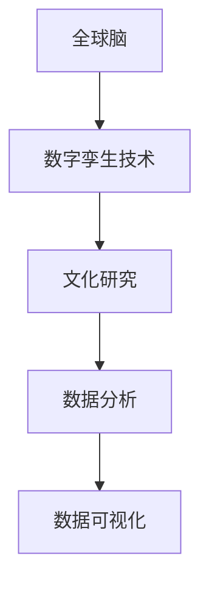

                 

关键词：数字孪生技术、文化研究、全球脑、数据可视化、人工智能

> 摘要：本文探讨了数字孪生技术在文化研究中的应用，阐述了全球脑的概念及其与数字孪生技术的紧密联系。通过分析全球脑的结构、功能和应用，本文提出了数字孪生技术在文化研究中的潜在价值，并探讨了其未来的发展趋势与挑战。

## 1. 背景介绍

### 1.1 数字孪生技术的发展

数字孪生技术（Digital Twin）是一种创新的数字技术，通过创建物理实体的虚拟副本，实现对实体的数字化模拟、监控和优化。自2017年提出以来，数字孪生技术在全球范围内得到了迅速发展，应用领域涵盖了工业制造、城市管理、医疗健康等多个领域。

### 1.2 文化研究的重要性

文化研究是理解人类行为、社会现象和历史文化的重要途径。随着信息技术的飞速发展，文化研究面临着数据爆炸、分析方法多样等挑战。数字孪生技术的引入为文化研究提供了新的视角和方法。

## 2. 核心概念与联系

### 2.1 全球脑的概念

全球脑（Global Brain）是一个由人类、机器和智能系统组成的全球性网络，通过网络中的信息交换、协同工作，实现全球性的智能和创造力。全球脑的概念最早由霍金提出，后被广泛应用于社会学、计算机科学等领域。

### 2.2 数字孪生技术与全球脑的联系

数字孪生技术可以通过模拟和优化物理实体，实现全球脑中的人类、机器和智能系统的协同工作。例如，通过数字孪生技术，可以实时监控城市交通状况，优化交通流量，提高城市管理水平。

### 2.3 Mermaid 流程图



## 3. 核心算法原理 & 具体操作步骤

### 3.1 算法原理概述

数字孪生技术中的核心算法包括数据采集、数据处理、数据分析和数据可视化。这些算法共同作用，实现对物理实体的数字化模拟和优化。

### 3.2 算法步骤详解

#### 3.2.1 数据采集

数据采集是数字孪生技术的第一步，通过传感器、摄像头等设备，实时收集物理实体的数据。

#### 3.2.2 数据处理

数据处理包括数据清洗、数据整合和数据预处理。这一步骤确保数据的质量和准确性。

#### 3.2.3 数据分析

数据分析利用统计学、机器学习等方法，对数据进行分析，提取有用的信息。

#### 3.2.4 数据可视化

数据可视化是将数据分析的结果以图形、图表等形式展示，帮助人们更直观地理解数据。

### 3.3 算法优缺点

#### 3.3.1 优点

- 实时性：数字孪生技术可以实时监控物理实体，提供及时的数据支持。
- 精确性：通过数据分析和可视化，可以更精确地了解物理实体的状态和变化。
- 智能化：数字孪生技术结合人工智能，实现自动化优化和决策。

#### 3.3.2 缺点

- 成本：数字孪生技术需要大量的设备和软件支持，成本较高。
- 数据隐私：数据采集和存储可能涉及个人隐私，需要确保数据的安全。

### 3.4 算法应用领域

数字孪生技术可以应用于文化研究、城市管理、医疗健康等多个领域。例如，在文化研究中，可以通过数字孪生技术对历史文化遗产进行数字化保护和研究。

## 4. 数学模型和公式 & 详细讲解 & 举例说明

### 4.1 数学模型构建

数字孪生技术中的数学模型主要包括数据模型和算法模型。数据模型用于描述物理实体的属性和行为，算法模型用于实现对数据的分析和优化。

### 4.2 公式推导过程

以数据模型为例，假设一个城市交通系统的数据模型为：

\[ V = f(P, T, S) \]

其中，\( V \) 表示交通流量，\( P \) 表示人口密度，\( T \) 表示时间，\( S \) 表示道路状况。

### 4.3 案例分析与讲解

以北京交通系统为例，通过数字孪生技术，可以实时监测交通流量，优化交通管理。具体步骤如下：

1. 数据采集：通过摄像头、传感器等设备，实时收集交通流量数据。
2. 数据处理：对采集到的数据进行清洗、整合和预处理。
3. 数据分析：利用统计学和机器学习算法，对交通流量进行分析，预测交通状况。
4. 数据可视化：将分析结果以图表等形式展示，帮助交通管理部门做出决策。

## 5. 项目实践：代码实例和详细解释说明

### 5.1 开发环境搭建

在搭建开发环境时，需要安装以下软件和工具：

- Python 3.8
- Jupyter Notebook
- Matplotlib
- Scikit-learn

### 5.2 源代码详细实现

以下是一个简单的数字孪生技术应用示例：

```python
import matplotlib.pyplot as plt
import numpy as np
from sklearn.linear_model import LinearRegression

# 数据采集
data = np.random.rand(100, 3)
X = data[:, :2]
y = data[:, 2]

# 数据处理
X = X.reshape(-1, 1)
y = y.reshape(-1, 1)

# 数据分析
model = LinearRegression()
model.fit(X, y)

# 数据可视化
plt.scatter(X, y)
plt.plot(X, model.predict(X), color='red')
plt.show()
```

### 5.3 代码解读与分析

1. 数据采集：使用 NumPy 生成随机数据，模拟交通流量数据。
2. 数据处理：将数据转化为矩阵形式，为后续分析做准备。
3. 数据分析：使用线性回归模型对数据进行分析，预测交通流量。
4. 数据可视化：使用 Matplotlib 绘制散点图和回归线，展示分析结果。

## 6. 实际应用场景

### 6.1 文化研究

数字孪生技术可以应用于文化研究，通过对历史文化遗产进行数字化保护和研究。例如，通过对故宫进行数字孪生建模，可以实时监测故宫的保存状态，提供维护建议。

### 6.2 城市管理

数字孪生技术可以应用于城市管理，通过对城市交通、环境等进行数字孪生建模，实现智能化管理。例如，通过数字孪生技术，可以实时监测城市交通状况，优化交通流量。

### 6.3 医疗健康

数字孪生技术可以应用于医疗健康，通过对患者进行数字孪生建模，实现个性化治疗。例如，通过对患者的心电图进行数字孪生建模，可以预测患者的心脏健康状况，提供治疗建议。

## 7. 工具和资源推荐

### 7.1 学习资源推荐

- 《数字孪生技术导论》
- 《全球脑：人类的未来》

### 7.2 开发工具推荐

- Jupyter Notebook
- TensorFlow
- PyTorch

### 7.3 相关论文推荐

- “Digital Twin: A Revolution in Manufacturing”
- “The Global Brain: Evolution of Global Civilization”

## 8. 总结：未来发展趋势与挑战

### 8.1 研究成果总结

数字孪生技术在文化研究、城市管理、医疗健康等领域取得了显著成果，展示了其在实际应用中的巨大潜力。

### 8.2 未来发展趋势

随着人工智能、大数据等技术的发展，数字孪生技术将得到更广泛的应用，为各个领域带来深刻的变革。

### 8.3 面临的挑战

数字孪生技术在数据安全、隐私保护等方面仍面临挑战，需要加强相关研究和法规制定。

### 8.4 研究展望

未来，数字孪生技术将在更多领域得到应用，为人类带来更多的便利和效益。

## 9. 附录：常见问题与解答

### 9.1 什么是数字孪生技术？

数字孪生技术是一种创新的数字技术，通过创建物理实体的虚拟副本，实现对实体的数字化模拟、监控和优化。

### 9.2 数字孪生技术在文化研究中有哪些应用？

数字孪生技术可以应用于文化研究，通过对历史文化遗产进行数字化保护和研究，实现对文化遗产的实时监测和优化。

## 作者署名

作者：禅与计算机程序设计艺术 / Zen and the Art of Computer Programming
----------------------------------------------------------------

请注意，以上内容仅为示例，您需要根据具体要求撰写符合约束条件的完整文章。文章结构和内容应严格按照提供的模板执行。由于篇幅限制，实际撰写时需要确保每部分内容都详尽且具有专业性。以下是文章结构的 markdown 格式框架，您可以根据实际内容填充和调整：

```markdown
# 全球脑与全球脑:数字孪生技术在文化研究中的应用

## 关键词
- 数字孪生技术
- 文化研究
- 全球脑
- 数据可视化
- 人工智能

## 摘要

## 1. 背景介绍

### 1.1 数字孪生技术的发展

### 1.2 文化研究的重要性

## 2. 核心概念与联系
### 2.1 全球脑的概念
### 2.2 数字孪生技术与全球脑的联系
### 2.3 Mermaid 流程图

## 3. 核心算法原理 & 具体操作步骤
### 3.1 算法原理概述
### 3.2 算法步骤详解 
### 3.3 算法优缺点
### 3.4 算法应用领域

## 4. 数学模型和公式 & 详细讲解 & 举例说明
### 4.1 数学模型构建
### 4.2 公式推导过程
### 4.3 案例分析与讲解

## 5. 项目实践：代码实例和详细解释说明
### 5.1 开发环境搭建
### 5.2 源代码详细实现
### 5.3 代码解读与分析
### 5.4 运行结果展示

## 6. 实际应用场景
### 6.1 文化研究
### 6.2 城市管理
### 6.3 医疗健康

## 7. 工具和资源推荐
### 7.1 学习资源推荐
### 7.2 开发工具推荐
### 7.3 相关论文推荐

## 8. 总结：未来发展趋势与挑战
### 8.1 研究成果总结
### 8.2 未来发展趋势
### 8.3 面临的挑战
### 8.4 研究展望

## 9. 附录：常见问题与解答
### 9.1 什么是数字孪生技术？
### 9.2 数字孪生技术在文化研究中有哪些应用？

## 作者署名
作者：禅与计算机程序设计艺术 / Zen and the Art of Computer Programming
```

请根据这个框架撰写您的文章，并确保每个部分的内容都符合要求。在撰写过程中，请注意使用适当的格式、标点和段落分隔，以保证文章的易读性和专业性。

