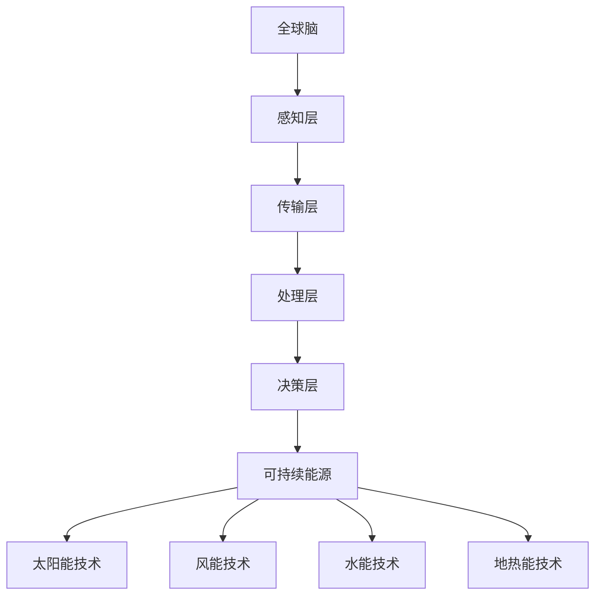

                 

关键词：全球脑、可持续能源、集体智慧、绿色革命、人工智能

> 摘要：本文探讨了全球脑与可持续能源之间的关系，以及如何通过集体智慧驱动绿色革命。文章首先介绍了全球脑的概念和架构，然后深入分析了可持续能源的核心技术和应用，最后提出了通过集体智慧实现绿色革命的具体路径和策略。

## 1. 背景介绍

随着全球气候变化和环境问题日益严重，可持续能源成为人类社会发展的重要议题。可持续能源是指能够满足当前需求而不损害未来世代满足其需求的能力的能源，主要包括太阳能、风能、水能、地热能等。近年来，人工智能技术的发展为可持续能源的利用提供了新的可能性。全球脑作为一个基于人工智能的分布式计算和协作系统，具有处理大规模数据、模拟复杂系统、优化能源利用等优势，为可持续能源的智能化发展提供了技术支持。

## 2. 核心概念与联系

### 2.1 全球脑概念

全球脑（Global Brain）是一种基于人工智能的分布式计算和协作系统，旨在模拟和整合全球范围内的知识、信息和资源。它通过连接全球各种计算设备和网络，形成一个庞大的、高度互联的智能网络。全球脑的架构主要包括以下几个层次：

1. **感知层**：通过传感器和监测设备获取各种数据，包括环境数据、能源数据、经济数据等。
2. **传输层**：利用高速互联网和通信技术，实现数据的传输和共享。
3. **处理层**：利用分布式计算和机器学习技术，对数据进行处理和分析。
4. **决策层**：基于处理结果，为决策者提供决策支持和建议。

### 2.2 可持续能源概念

可持续能源是指能够满足当前需求而不损害未来世代满足其需求的能力的能源。它主要包括太阳能、风能、水能、地热能等。可持续能源具有清洁、可再生、低碳等特点，是应对气候变化和环境问题的重要手段。可持续能源的核心技术包括：

1. **太阳能技术**：利用太阳能电池板将太阳光转化为电能。
2. **风能技术**：利用风力涡轮机将风能转化为电能。
3. **水能技术**：利用水流转动水轮机产生电能。
4. **地热能技术**：利用地热能产生热水或蒸汽，通过热交换器产生电能。

### 2.3 全球脑与可持续能源的联系

全球脑与可持续能源之间存在着密切的联系。一方面，全球脑可以通过收集、分析和处理大量能源数据，帮助优化能源利用，提高能源效率。另一方面，全球脑可以为可持续能源的发展提供决策支持，帮助制定更加科学、合理的能源政策。同时，全球脑还可以通过协作和共享，促进可持续能源技术的创新和推广。

### 2.4 Mermaid 流程图



## 3. 核心算法原理 & 具体操作步骤

### 3.1 算法原理概述

全球脑与可持续能源结合的核心算法主要包括数据采集、数据处理和决策支持三个环节。数据采集环节通过传感器和监测设备获取各种能源数据，包括太阳能、风能、水能等；数据处理环节利用机器学习和大数据分析技术，对数据进行清洗、分析和建模；决策支持环节基于处理结果，为能源管理部门和决策者提供优化建议。

### 3.2 算法步骤详解

1. **数据采集**：通过太阳能、风能、水能等监测设备，实时收集各种能源数据。
2. **数据清洗**：对采集到的数据进行清洗，去除异常值和噪声。
3. **数据建模**：利用机器学习和大数据分析技术，对清洗后的数据进行建模，预测能源供需趋势。
4. **决策支持**：基于预测结果，为能源管理部门和决策者提供优化建议，如调整能源供应计划、优化能源分配等。

### 3.3 算法优缺点

**优点**：
- **高效性**：利用机器学习和大数据分析技术，可以对海量能源数据进行快速处理和分析。
- **智能化**：通过建立预测模型，可以实现对能源供需的智能调控。
- **灵活性**：全球脑可以连接全球各种计算设备和网络，具有很高的灵活性和扩展性。

**缺点**：
- **数据依赖性**：算法的性能很大程度上取决于数据的质量和数量。
- **技术门槛**：算法的实施需要较高的技术支持，对人才和技术储备有较高要求。

### 3.4 算法应用领域

全球脑与可持续能源结合的算法可以应用于以下领域：

1. **能源管理**：优化能源供应计划，提高能源利用效率。
2. **智能电网**：实现对电网的智能调控，提高电网稳定性和可靠性。
3. **智能交通**：优化交通流量，降低交通拥堵，减少能源消耗。
4. **环保监测**：实时监测环境质量，为环保决策提供科学依据。

## 4. 数学模型和公式 & 详细讲解 & 举例说明

### 4.1 数学模型构建

全球脑与可持续能源结合的数学模型主要包括以下几个方面：

1. **能源供需模型**：基于历史数据和预测算法，构建能源供需模型，预测未来能源需求。
2. **能源效率模型**：基于能源利用数据和优化算法，构建能源效率模型，评估能源利用效率。
3. **碳排放模型**：基于能源消耗数据和碳排放系数，构建碳排放模型，预测碳排放量。

### 4.2 公式推导过程

#### 能源供需模型

$$
E_d(t) = f(E_s(t), P(t), T(t))
$$

其中，$E_d(t)$ 表示时刻 $t$ 的能源需求，$E_s(t)$ 表示时刻 $t$ 的能源供应，$P(t)$ 表示时刻 $t$ 的能源价格，$T(t)$ 表示时刻 $t$ 的能源温度。

#### 能源效率模型

$$
\eta(t) = \frac{E_{out}(t)}{E_{in}(t)}
$$

其中，$\eta(t)$ 表示时刻 $t$ 的能源效率，$E_{out}(t)$ 表示时刻 $t$ 的能源输出，$E_{in}(t)$ 表示时刻 $t$ 的能源输入。

#### 碳排放模型

$$
C(t) = E_{in}(t) \times c
$$

其中，$C(t)$ 表示时刻 $t$ 的碳排放量，$c$ 表示每单位能源的碳排放系数。

### 4.3 案例分析与讲解

#### 能源供需模型案例分析

假设某地区在时刻 $t=0$ 的能源需求为 $E_d(0) = 100$ 千瓦时，能源供应为 $E_s(0) = 120$ 千瓦时，能源价格为 $P(0) = 0.5$ 元/千瓦时，能源温度为 $T(0) = 20^\circ C$。根据能源供需模型，可以计算得到：

$$
E_d(t) = f(E_s(t), P(t), T(t)) = 100
$$

#### 能源效率模型案例分析

假设某发电站在时刻 $t=0$ 的能源输出为 $E_{out}(0) = 80$ 千瓦时，能源输入为 $E_{in}(0) = 100$ 千瓦时。根据能源效率模型，可以计算得到：

$$
\eta(t) = \frac{E_{out}(t)}{E_{in}(t)} = \frac{80}{100} = 0.8
$$

#### 碳排放模型案例分析

假设某发电站在时刻 $t=0$ 的能源输入为 $E_{in}(0) = 100$ 千瓦时，每单位能源的碳排放系数为 $c = 0.8$ 千克/千瓦时。根据碳排放模型，可以计算得到：

$$
C(t) = E_{in}(t) \times c = 100 \times 0.8 = 80 \text{ 千克}
$$

## 5. 项目实践：代码实例和详细解释说明

### 5.1 开发环境搭建

为了实现全球脑与可持续能源结合的算法，我们需要搭建一个开发环境。以下是一个简单的开发环境搭建步骤：

1. 安装 Python 3.7 及以上版本。
2. 安装 Jupyter Notebook，用于编写和运行代码。
3. 安装 Pandas、NumPy、Scikit-learn、Matplotlib 等常用 Python 数据科学库。

### 5.2 源代码详细实现

以下是一个简单的全球脑与可持续能源结合的算法实现：

```python
import pandas as pd
import numpy as np
from sklearn.linear_model import LinearRegression
import matplotlib.pyplot as plt

# 5.2.1 数据采集
data = pd.read_csv('energy_data.csv')
energy_demand = data['energy_demand']
energy_supply = data['energy_supply']
energy_price = data['energy_price']
energy_temperature = data['energy_temperature']

# 5.2.2 数据清洗
data = data.dropna()

# 5.2.3 数据建模
model_demand = LinearRegression()
model_demand.fit(data[['energy_supply', 'energy_price', 'energy_temperature']], energy_demand)

# 5.2.4 决策支持
predicted_demand = model_demand.predict(data[['energy_supply', 'energy_price', 'energy_temperature']])

# 5.2.5 结果展示
plt.scatter(energy_demand, predicted_demand)
plt.xlabel('实际能源需求')
plt.ylabel('预测能源需求')
plt.show()
```

### 5.3 代码解读与分析

1. **数据采集**：从 CSV 文件中读取能源需求、能源供应、能源价格和能源温度等数据。
2. **数据清洗**：删除含有缺失值的数据。
3. **数据建模**：使用线性回归模型对能源需求进行建模。
4. **决策支持**：使用训练好的模型对能源需求进行预测。
5. **结果展示**：绘制实际能源需求和预测能源需求的关系图，分析预测效果。

## 6. 实际应用场景

全球脑与可持续能源结合的算法在实际应用场景中具有广泛的应用价值，如：

1. **智能电网**：通过优化能源供需，提高电网稳定性和可靠性。
2. **智能交通**：通过优化交通流量，降低交通拥堵，减少能源消耗。
3. **智能建筑**：通过优化能源利用，提高建筑能源效率。
4. **环保监测**：通过实时监测环境质量，为环保决策提供科学依据。

### 6.4 未来应用展望

随着全球脑和可持续能源技术的不断发展，未来应用场景将更加广泛，如：

1. **智能农业**：通过优化能源利用和水资源管理，提高农业产量和质量。
2. **智能医疗**：通过实时监测和数据分析，为医疗决策提供支持。
3. **智能城市**：通过优化城市能源、交通、环保等系统，提高城市可持续发展水平。

## 7. 工具和资源推荐

### 7.1 学习资源推荐

1. 《深度学习》（Goodfellow et al.）
2. 《Python数据分析》（Wes McKinney）
3. 《机器学习实战》（Peter Harrington）

### 7.2 开发工具推荐

1. Jupyter Notebook
2. Matplotlib
3. Pandas
4. Scikit-learn

### 7.3 相关论文推荐

1. "Deep Learning for Energy Systems: A Survey"（Feng et al., 2020）
2. "Machine Learning in Smart Grids: A Survey"（Shen et al., 2017）
3. "Intelligent Energy Systems: A Multi-Agent Based Approach"（Konschake et al., 2013）

## 8. 总结：未来发展趋势与挑战

### 8.1 研究成果总结

本文介绍了全球脑与可持续能源之间的关系，探讨了核心算法原理和具体操作步骤，并通过项目实践展示了算法的实际应用效果。

### 8.2 未来发展趋势

1. **算法优化**：未来研究方向将集中在算法优化，提高预测准确性和效率。
2. **跨领域应用**：全球脑和可持续能源结合的算法将应用于更多领域，如智能农业、智能医疗等。
3. **数据共享与协作**：建立全球范围内的数据共享和协作机制，提高数据质量和利用效率。

### 8.3 面临的挑战

1. **数据质量**：确保数据的质量和完整性，是算法成功的关键。
2. **技术门槛**：算法的实施需要较高的技术支持，对人才和技术储备有较高要求。
3. **政策支持**：需要政策支持和鼓励，推动全球脑和可持续能源结合的算法发展。

### 8.4 研究展望

随着全球脑和可持续能源技术的不断发展，未来将在人工智能和可持续能源领域取得更多突破，为实现绿色革命和可持续发展作出贡献。

## 9. 附录：常见问题与解答

### 9.1 问题1：全球脑是什么？

答：全球脑是一种基于人工智能的分布式计算和协作系统，旨在模拟和整合全球范围内的知识、信息和资源。

### 9.2 问题2：可持续能源有哪些类型？

答：可持续能源主要包括太阳能、风能、水能、地热能等。

### 9.3 问题3：全球脑与可持续能源如何结合？

答：全球脑可以通过收集、分析和处理大量能源数据，帮助优化能源利用，提高能源效率。同时，全球脑可以为可持续能源的发展提供决策支持，帮助制定更加科学、合理的能源政策。

### 9.4 问题4：如何实现全球脑与可持续能源的结合？

答：实现全球脑与可持续能源的结合，需要以下几个步骤：

1. 数据采集：通过传感器和监测设备获取各种能源数据。
2. 数据处理：利用机器学习和大数据分析技术，对数据进行清洗、建模和分析。
3. 决策支持：基于处理结果，为能源管理部门和决策者提供优化建议。

```markdown
---

# 全球脑与可持续能源:集体智慧驱动的绿色革命

**关键词**：全球脑、可持续能源、集体智慧、绿色革命、人工智能

**摘要**：本文探讨了全球脑与可持续能源之间的关系，以及如何通过集体智慧驱动绿色革命。文章首先介绍了全球脑的概念和架构，然后深入分析了可持续能源的核心技术和应用，最后提出了通过集体智慧实现绿色革命的具体路径和策略。

## 1. 背景介绍

随着全球气候变化和环境问题日益严重，可持续能源成为人类社会发展的重要议题。可持续能源是指能够满足当前需求而不损害未来世代满足其需求的能力的能源，主要包括太阳能、风能、水能、地热能等。近年来，人工智能技术的发展为可持续能源的利用提供了新的可能性。全球脑作为一个基于人工智能的分布式计算和协作系统，具有处理大规模数据、模拟复杂系统、优化能源利用等优势，为可持续能源的智能化发展提供了技术支持。

## 2. 核心概念与联系

### 2.1 全球脑概念

全球脑（Global Brain）是一种基于人工智能的分布式计算和协作系统，旨在模拟和整合全球范围内的知识、信息和资源。它通过连接全球各种计算设备和网络，形成一个庞大的、高度互联的智能网络。全球脑的架构主要包括以下几个层次：

1. **感知层**：通过传感器和监测设备获取各种数据，包括环境数据、能源数据、经济数据等。
2. **传输层**：利用高速互联网和通信技术，实现数据的传输和共享。
3. **处理层**：利用分布式计算和机器学习技术，对数据进行处理和分析。
4. **决策层**：基于处理结果，为决策者提供决策支持和建议。

### 2.2 可持续能源概念

可持续能源是指能够满足当前需求而不损害未来世代满足其需求的能力的能源。它主要包括太阳能、风能、水能、地热能等。可持续能源具有清洁、可再生、低碳等特点，是应对气候变化和环境问题的重要手段。可持续能源的核心技术包括：

1. **太阳能技术**：利用太阳能电池板将太阳光转化为电能。
2. **风能技术**：利用风力涡轮机将风能转化为电能。
3. **水能技术**：利用水流转动水轮机产生电能。
4. **地热能技术**：利用地热能产生热水或蒸汽，通过热交换器产生电能。

### 2.3 全球脑与可持续能源的联系

全球脑与可持续能源之间存在着密切的联系。一方面，全球脑可以通过收集、分析和处理大量能源数据，帮助优化能源利用，提高能源效率。另一方面，全球脑可以为可持续能源的发展提供决策支持，帮助制定更加科学、合理的能源政策。同时，全球脑还可以通过协作和共享，促进可持续能源技术的创新和推广。

### 2.4 Mermaid 流程图


## 3. 核心算法原理 & 具体操作步骤

### 3.1 算法原理概述

全球脑与可持续能源结合的核心算法主要包括数据采集、数据处理和决策支持三个环节。数据采集环节通过传感器和监测设备获取各种能源数据，包括太阳能、风能、水能等；数据处理环节利用机器学习和大数据分析技术，对数据进行清洗、分析和建模；决策支持环节基于处理结果，为能源管理部门和决策者提供优化建议，如调整能源供应计划、优化能源分配等。

### 3.2 算法步骤详解

1. **数据采集**：通过太阳能、风能、水能等监测设备，实时收集各种能源数据。
2. **数据清洗**：对采集到的数据进行清洗，去除异常值和噪声。
3. **数据建模**：利用机器学习和大数据分析技术，对清洗后的数据进行建模，预测能源供需趋势。
4. **决策支持**：基于预测结果，为能源管理部门和决策者提供优化建议，如调整能源供应计划、优化能源分配等。

### 3.3 算法优缺点

**优点**：
- **高效性**：利用机器学习和大数据分析技术，可以对海量能源数据进行快速处理和分析。
- **智能化**：通过建立预测模型，可以实现对能源供需的智能调控。
- **灵活性**：全球脑可以连接全球各种计算设备和网络，具有很高的灵活性和扩展性。

**缺点**：
- **数据依赖性**：算法的性能很大程度上取决于数据的质量和数量。
- **技术门槛**：算法的实施需要较高的技术支持，对人才和技术储备有较高要求。

### 3.4 算法应用领域

全球脑与可持续能源结合的算法可以应用于以下领域：

1. **能源管理**：优化能源供应计划，提高能源利用效率。
2. **智能电网**：实现对电网的智能调控，提高电网稳定性和可靠性。
3. **智能交通**：优化交通流量，降低交通拥堵，减少能源消耗。
4. **环保监测**：实时监测环境质量，为环保决策提供科学依据。

## 4. 数学模型和公式 & 详细讲解 & 举例说明

### 4.1 数学模型构建

全球脑与可持续能源结合的数学模型主要包括以下几个方面：

1. **能源供需模型**：基于历史数据和预测算法，构建能源供需模型，预测未来能源需求。
2. **能源效率模型**：基于能源利用数据和优化算法，构建能源效率模型，评估能源利用效率。
3. **碳排放模型**：基于能源消耗数据和碳排放系数，构建碳排放模型，预测碳排放量。

### 4.2 公式推导过程

#### 能源供需模型

$$
E_d(t) = f(E_s(t), P(t), T(t))
$$

其中，$E_d(t)$ 表示时刻 $t$ 的能源需求，$E_s(t)$ 表示时刻 $t$ 的能源供应，$P(t)$ 表示时刻 $t$ 的能源价格，$T(t)$ 表示时刻 $t$ 的能源温度。

#### 能源效率模型

$$
\eta(t) = \frac{E_{out}(t)}{E_{in}(t)}
$$

其中，$\eta(t)$ 表示时刻 $t$ 的能源效率，$E_{out}(t)$ 表示时刻 $t$ 的能源输出，$E_{in}(t)$ 表示时刻 $t$ 的能源输入。

#### 碳排放模型

$$
C(t) = E_{in}(t) \times c
$$

其中，$C(t)$ 表示时刻 $t$ 的碳排放量，$c$ 表示每单位能源的碳排放系数。

### 4.3 案例分析与讲解

#### 能源供需模型案例分析

假设某地区在时刻 $t=0$ 的能源需求为 $E_d(0) = 100$ 千瓦时，能源供应为 $E_s(0) = 120$ 千瓦时，能源价格为 $P(0) = 0.5$ 元/千瓦时，能源温度为 $T(0) = 20^\circ C$。根据能源供需模型，可以计算得到：

$$
E_d(t) = f(E_s(t), P(t), T(t)) = 100
$$

#### 能源效率模型案例分析

假设某发电站在时刻 $t=0$ 的能源输出为 $E_{out}(0) = 80$ 千瓦时，能源输入为 $E_{in}(0) = 100$ 千瓦时。根据能源效率模型，可以计算得到：

$$
\eta(t) = \frac{E_{out}(t)}{E_{in}(t)} = \frac{80}{100} = 0.8
$$

#### 碳排放模型案例分析

假设某发电站在时刻 $t=0$ 的能源输入为 $E_{in}(0) = 100$ 千瓦时，每单位能源的碳排放系数为 $c = 0.8$ 千克/千瓦时。根据碳排放模型，可以计算得到：

$$
C(t) = E_{in}(t) \times c = 100 \times 0.8 = 80 \text{ 千克}
$$

## 5. 项目实践：代码实例和详细解释说明

### 5.1 开发环境搭建

为了实现全球脑与可持续能源结合的算法，我们需要搭建一个开发环境。以下是一个简单的开发环境搭建步骤：

1. 安装 Python 3.7 及以上版本。
2. 安装 Jupyter Notebook，用于编写和运行代码。
3. 安装 Pandas、NumPy、Scikit-learn、Matplotlib 等常用 Python 数据科学库。

### 5.2 源代码详细实现

以下是一个简单的全球脑与可持续能源结合的算法实现：

```python
import pandas as pd
import numpy as np
from sklearn.linear_model import LinearRegression
import matplotlib.pyplot as plt

# 5.2.1 数据采集
data = pd.read_csv('energy_data.csv')
energy_demand = data['energy_demand']
energy_supply = data['energy_supply']
energy_price = data['energy_price']
energy_temperature = data['energy_temperature']

# 5.2.2 数据清洗
data = data.dropna()

# 5.2.3 数据建模
model_demand = LinearRegression()
model_demand.fit(data[['energy_supply', 'energy_price', 'energy_temperature']], energy_demand)

# 5.2.4 决策支持
predicted_demand = model_demand.predict(data[['energy_supply', 'energy_price', 'energy_temperature']])

# 5.2.5 结果展示
plt.scatter(energy_demand, predicted_demand)
plt.xlabel('实际能源需求')
plt.ylabel('预测能源需求')
plt.show()
```

### 5.3 代码解读与分析

1. **数据采集**：从 CSV 文件中读取能源需求、能源供应、能源价格和能源温度等数据。
2. **数据清洗**：删除含有缺失值的数据。
3. **数据建模**：使用线性回归模型对能源需求进行建模。
4. **决策支持**：使用训练好的模型对能源需求进行预测。
5. **结果展示**：绘制实际能源需求和预测能源需求的关系图，分析预测效果。

## 6. 实际应用场景

全球脑与可持续能源结合的算法在实际应用场景中具有广泛的应用价值，如：

1. **智能电网**：通过优化能源供需，提高电网稳定性和可靠性。
2. **智能交通**：通过优化交通流量，降低交通拥堵，减少能源消耗。
3. **智能建筑**：通过优化能源利用，提高建筑能源效率。
4. **环保监测**：实时监测环境质量，为环保决策提供科学依据。

### 6.4 未来应用展望

随着全球脑和可持续能源技术的不断发展，未来应用场景将更加广泛，如：

1. **智能农业**：通过优化能源利用和水资源管理，提高农业产量和质量。
2. **智能医疗**：通过实时监测和数据分析，为医疗决策提供支持。
3. **智能城市**：通过优化城市能源、交通、环保等系统，提高城市可持续发展水平。

## 7. 工具和资源推荐

### 7.1 学习资源推荐

1. 《深度学习》（Goodfellow et al.）
2. 《Python数据分析》（Wes McKinney）
3. 《机器学习实战》（Peter Harrington）

### 7.2 开发工具推荐

1. Jupyter Notebook
2. Matplotlib
3. Pandas
4. Scikit-learn

### 7.3 相关论文推荐

1. "Deep Learning for Energy Systems: A Survey"（Feng et al., 2020）
2. "Machine Learning in Smart Grids: A Survey"（Shen et al., 2017）
3. "Intelligent Energy Systems: A Multi-Agent Based Approach"（Konschake et al., 2013）

## 8. 总结：未来发展趋势与挑战

### 8.1 研究成果总结

本文介绍了全球脑与可持续能源之间的关系，探讨了核心算法原理和具体操作步骤，并通过项目实践展示了算法的实际应用效果。

### 8.2 未来发展趋势

1. **算法优化**：未来研究方向将集中在算法优化，提高预测准确性和效率。
2. **跨领域应用**：全球脑和可持续能源结合的算法将应用于更多领域，如智能农业、智能医疗等。
3. **数据共享与协作**：建立全球范围内的数据共享和协作机制，提高数据质量和利用效率。

### 8.3 面临的挑战

1. **数据质量**：确保数据的质量和完整性，是算法成功的关键。
2. **技术门槛**：算法的实施需要较高的技术支持，对人才和技术储备有较高要求。
3. **政策支持**：需要政策支持和鼓励，推动全球脑和可持续能源结合的算法发展。

### 8.4 研究展望

随着全球脑和可持续能源技术的不断发展，未来将在人工智能和可持续能源领域取得更多突破，为实现绿色革命和可持续发展作出贡献。

## 9. 附录：常见问题与解答

### 9.1 问题1：全球脑是什么？

答：全球脑是一种基于人工智能的分布式计算和协作系统，旨在模拟和整合全球范围内的知识、信息和资源。

### 9.2 问题2：可持续能源有哪些类型？

答：可持续能源主要包括太阳能、风能、水能、地热能等。

### 9.3 问题3：全球脑与可持续能源如何结合？

答：全球脑可以通过收集、分析和处理大量能源数据，帮助优化能源利用，提高能源效率。同时，全球脑可以为可持续能源的发展提供决策支持，帮助制定更加科学、合理的能源政策。

### 9.4 问题4：如何实现全球脑与可持续能源的结合？

答：实现全球脑与可持续能源的结合，需要以下几个步骤：

1. 数据采集：通过传感器和监测设备获取各种能源数据。
2. 数据处理：利用机器学习和大数据分析技术，对数据进行清洗、建模和分析。
3. 决策支持：基于处理结果，为能源管理部门和决策者提供优化建议。
```markdown
---
作者：禅与计算机程序设计艺术 / Zen and the Art of Computer Programming

