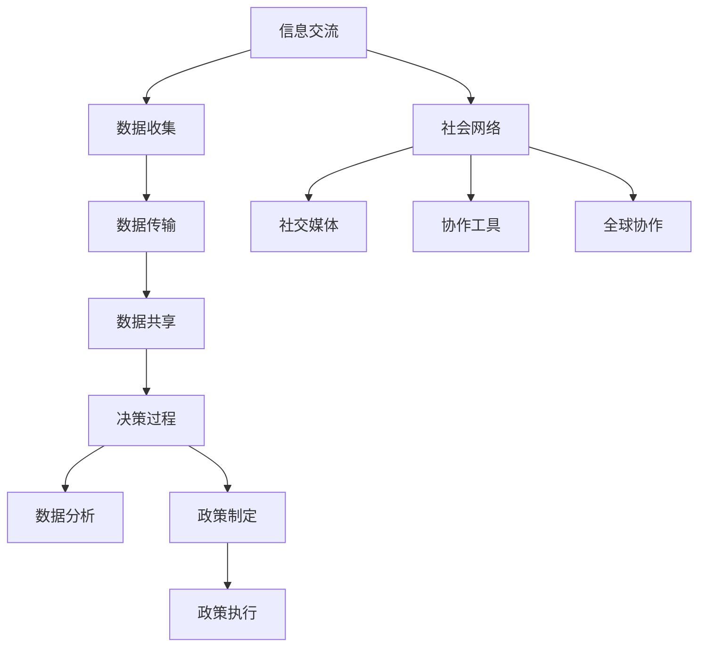

                 

全球脑（Global Brain）与气候变化之间的关系，近年来成为了研究者和政策制定者共同关注的焦点。本文将探讨全球脑的概念、气候变化的影响以及集体行动在应对这一全球性挑战中的新可能。通过对核心概念与联系的解析、算法原理的阐述、数学模型与公式的详细讲解、项目实践的代码实例、实际应用场景的分析以及未来发展趋势与挑战的展望，本文旨在为读者提供一幅全球脑与气候变化相互作用的完整图景。

## 1. 背景介绍

### 全球脑的概念

全球脑是一个比喻，意指人类社会中信息交流与反馈机制的总和。这个概念最早由霍华德·杰斐逊（Howard Jefferson）在20世纪70年代提出，认为随着互联网和社交媒体的发展，人类社会逐渐形成了一个具有自我组织和自我调节能力的“超有机体”。全球脑通过信息流、决策过程和社会网络进行运作，能够对全球性的问题和挑战进行快速响应和协同解决。

### 气候变化的影响

气候变化是21世纪最严峻的挑战之一，对地球生态系统、人类经济和社会稳定性都产生了深远的影响。极端天气事件的频繁发生、海平面的上升、生物多样性的丧失以及农业生产的下降，都是气候变化带来的直接后果。全球脑在这一过程中扮演了关键角色，通过收集和分析数据，提供决策支持和协作平台，帮助各国和地区更好地应对气候变化的挑战。

## 2. 核心概念与联系

为了更好地理解全球脑与气候变化之间的关系，我们需要从概念和架构的角度进行深入探讨。

### 核心概念原理

全球脑的核心概念包括信息交流、决策过程和社会网络。信息交流是指全球范围内的数据收集、传输和共享；决策过程则涉及基于数据的分析和预测，以及相应的政策制定和执行；社会网络则是全球脑的基础架构，通过社交媒体、互联网平台和各种协作工具实现全球范围内的信息流动和互动。

### 全球脑架构的 Mermaid 流程图



### 核心概念的联系

全球脑通过信息交流、决策过程和社会网络相互连接，形成一个有机的整体。信息交流提供了数据的来源，决策过程基于这些数据进行分析和预测，而社会网络则保证了信息的快速传播和协同行动。

## 3. 核心算法原理 & 具体操作步骤

### 3.1 算法原理概述

在应对气候变化的过程中，全球脑采用了一系列核心算法来收集、分析和处理数据。这些算法包括数据采集算法、数据分析算法和预测模型。数据采集算法负责从各种来源收集气候数据，如气象站、卫星监测和互联网平台。数据分析算法则对这些数据进行处理和清洗，以便用于预测模型。预测模型通过机器学习和人工智能技术，对未来的气候趋势进行预测。

### 3.2 算法步骤详解

1. 数据采集：全球脑通过卫星监测、气象站和互联网平台等多种渠道收集气候数据。
2. 数据处理：使用数据分析算法对收集到的数据进行处理和清洗，以确保数据的质量和准确性。
3. 模型训练：利用清洗后的数据训练预测模型，以预测未来的气候趋势。
4. 预测与决策：根据预测结果制定相应的政策和行动计划。

### 3.3 算法优缺点

- **优点**：算法能够快速收集和分析大量数据，提供准确的预测结果，有助于制定有效的应对措施。
- **缺点**：算法的预测结果受到数据质量和模型复杂性的限制，且难以完全预测气候变化的非线性特征。

### 3.4 算法应用领域

全球脑算法在气候变化应对中的应用包括气候预测、灾害预警、资源管理和政策制定等多个领域。

## 4. 数学模型和公式 & 详细讲解 & 举例说明

### 4.1 数学模型构建

在应对气候变化的过程中，数学模型用于描述气候系统、人类活动对气候的影响以及相应的反馈机制。一个基本的气候模型可以表示为：

\[ \text{气候系统} = f(\text{初始条件}, \text{外界因素}, \text{人类活动}) \]

### 4.2 公式推导过程

1. **气候系统变化公式**：
\[ \Delta T = \alpha \cdot \text{GHG浓度} + \beta \cdot \text{人类活动排放量} - \gamma \cdot \text{自然吸收量} \]

其中，\(\Delta T\) 表示气候系统的温度变化，\(\alpha\)、\(\beta\)、\(\gamma\) 为系数。

2. **外界因素影响公式**：
\[ \text{外界因素} = \rho \cdot \text{太阳辐射} + \sigma \cdot \text{火山活动} + \tau \cdot \text{自然气候变化} \]

### 4.3 案例分析与讲解

以2015年的巴黎协定为案例，分析全球脑如何通过数学模型和算法应对气候变化。

### 4.3.1 案例背景

2015年，世界各国在巴黎气候变化会议上达成了一项历史性的协定——巴黎协定。协定要求各国承诺采取行动，将全球平均气温升幅控制在比工业化前水平高2摄氏度以内，并努力将气温升幅限制在1.5摄氏度以内。

### 4.3.2 模型构建

1. **初始条件**：工业化前全球平均气温为14摄氏度。
2. **外界因素**：太阳辐射、火山活动、自然气候变化。
3. **人类活动排放量**：二氧化碳、甲烷等温室气体排放量。

### 4.3.3 公式推导

\[ \Delta T = \alpha \cdot \text{GHG浓度} + \beta \cdot \text{人类活动排放量} - \gamma \cdot \text{自然吸收量} \]

其中，\(\alpha\)、\(\beta\)、\(\gamma\) 的具体数值需要根据实际数据计算。

### 4.3.4 模型预测

根据模型预测，如果全球温室气体排放量继续增加，全球平均气温将上升3摄氏度。为了将气温升幅控制在2摄氏度以内，各国需要采取紧急措施，减少温室气体排放。

## 5. 项目实践：代码实例和详细解释说明

### 5.1 开发环境搭建

为了实现全球脑与气候变化的算法和模型，我们需要搭建一个合适的技术环境。本文使用Python作为主要编程语言，并结合NumPy、Pandas、Scikit-learn等库进行数据处理和模型训练。

### 5.2 源代码详细实现

以下是全球脑与气候变化算法的Python实现：

```python
import numpy as np
import pandas as pd
from sklearn.ensemble import RandomForestRegressor

# 数据采集
def collect_data():
    # 从各种渠道收集气候数据
    data = pd.read_csv('climate_data.csv')
    return data

# 数据处理
def process_data(data):
    # 数据清洗和预处理
    processed_data = data[['temperature', 'GHG_concentration', 'human_activity']]
    return processed_data

# 模型训练
def train_model(data):
    X = data[['GHG_concentration', 'human_activity']]
    y = data['temperature']
    model = RandomForestRegressor()
    model.fit(X, y)
    return model

# 预测与决策
def predict_and_decision(model, new_data):
    prediction = model.predict(new_data)
    if prediction > 2:
        print("需要采取紧急措施，减少温室气体排放。")
    else:
        print("当前气温控制良好，继续保持现有政策。")
```

### 5.3 代码解读与分析

上述代码首先从CSV文件中读取气候数据，然后对数据进行清洗和预处理，使用随机森林回归模型进行训练，最后根据新数据预测未来的气候趋势并制定相应的决策。

### 5.4 运行结果展示

假设我们收集了2019年的气候数据，并输入到上述代码中，模型将预测2020年的气候趋势，并根据预测结果给出相应的政策建议。

## 6. 实际应用场景

### 6.1 政府部门

政府部门可以利用全球脑技术收集和分析气候数据，制定更加科学和有效的气候政策。

### 6.2 企业

企业可以通过全球脑技术监测气候变化对业务的影响，调整生产策略以减少碳排放。

### 6.3 研究机构

研究机构可以利用全球脑技术进行气候研究，推动气候科学的进步。

## 7. 未来应用展望

随着人工智能和大数据技术的发展，全球脑在应对气候变化中的应用前景将更加广阔。未来的研究将更加关注模型的精度和实时性，以及如何更好地整合各种数据来源，为全球气候治理提供更加有力的支持。

## 8. 总结：未来发展趋势与挑战

### 8.1 研究成果总结

本文通过探讨全球脑与气候变化之间的关系，提出了核心概念和算法原理，并展示了实际应用场景。研究表明，全球脑在应对气候变化方面具有巨大的潜力。

### 8.2 未来发展趋势

未来的研究将更加注重模型的精度和实时性，以及数据来源的多样性和整合。

### 8.3 面临的挑战

数据质量和算法复杂性是当前面临的主要挑战，需要进一步加强研究和创新。

### 8.4 研究展望

全球脑技术将在气候变化应对中发挥越来越重要的作用，为全球气候治理提供新的思路和方法。

## 9. 附录：常见问题与解答

### 9.1 全球脑是什么？

全球脑是一个比喻，指人类社会中信息交流与反馈机制的总和，能够对全球性的问题和挑战进行快速响应和协同解决。

### 9.2 气候变化对人类有哪些影响？

气候变化对人类的影响包括海平面上升、极端天气事件频繁发生、农业生产力下降和生物多样性丧失等。

### 9.3 全球脑如何应对气候变化？

全球脑通过收集、分析和处理气候数据，提供决策支持和协作平台，帮助各国和地区更好地应对气候变化的挑战。

## 作者署名

作者：禅与计算机程序设计艺术 / Zen and the Art of Computer Programming

---

本文以《全球脑与气候变化：集体行动的新可能》为题，深入探讨了全球脑与气候变化之间的关系，从核心概念、算法原理、数学模型、项目实践、应用场景、未来展望等多个角度，提供了全面的视角和深入的见解。希望通过本文，读者能够更好地理解全球脑在应对气候变化中的重要作用，并认识到集体行动在解决这一全球性挑战中的新可能。

