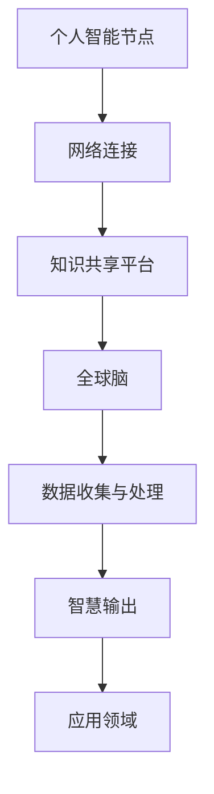
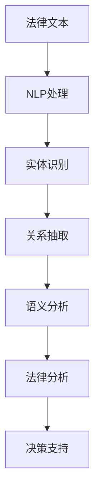
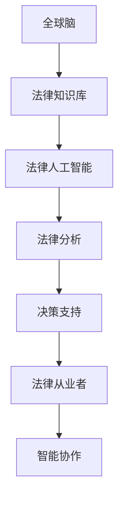

                 

关键词：全球脑、法律人工智能、智能化法律服务、算法、技术、应用领域、未来展望

## 摘要

本文旨在探讨全球脑与法律人工智能相结合的智能化法律服务。通过引入全球脑的概念，我们探讨了其与法律人工智能的融合如何能够极大地提升法律咨询服务的效率和质量。文章首先介绍了全球脑与法律人工智能的基本概念，随后深入分析了两者结合的原理、核心算法、数学模型，并结合具体案例进行了项目实践和实际应用场景的讨论。最后，文章总结了当前的研究成果，展望了未来的发展趋势与面临的挑战。

## 1. 背景介绍

在现代社会，法律咨询已经成为人们生活中不可或缺的一部分。无论是个人还是企业，在面对法律问题时，都希望能够获得及时、准确的法律咨询服务。然而，传统的法律咨询方式存在着效率低下、成本高昂等问题。为了解决这些问题，人工智能技术的引入成为了必然的选择。

全球脑（Global Brain）是指通过互联网将全球范围内的人类智慧和知识连接起来，形成一个庞大的知识网络。全球脑的概念最早由日本科幻作家麻生义男提出。他认为，随着互联网和人工智能技术的发展，人类将能够实现高度智能化的协作与互动，从而形成一个类似于人脑的全球性智慧系统。

法律人工智能（Legal AI）则是指利用人工智能技术来辅助法律工作的一种方式。法律人工智能可以处理大量法律文本，提取关键信息，进行法律分析和决策。当前，法律人工智能已经广泛应用于法律文档管理、法律研究、法律咨询等领域。

随着全球脑与法律人工智能的不断发展，两者结合的智能化法律服务模式应运而生。这种模式不仅能够提高法律咨询的效率和准确性，还可以为法律从业者提供更为全面和专业的服务。本文将深入探讨这种新模式的技术原理、算法、数学模型以及实际应用。

## 2. 核心概念与联系

### 2.1 全球脑

全球脑的基本原理是通过互联网将全球的人类智慧和知识连接起来，形成一个庞大的知识网络。全球脑的组成部分包括个人智能节点、网络连接和知识共享平台。每个个人智能节点都可以看作是一个微型大脑，它们通过互联网相互连接，形成一个宏观的全球脑。

**Mermaid 流程图:**



### 2.2 法律人工智能

法律人工智能的核心技术包括自然语言处理（NLP）、机器学习（ML）和深度学习（DL）。法律人工智能通过对法律文本进行文本挖掘、实体识别、关系抽取和语义分析，能够提取出法律文档中的关键信息，并对其进行法律分析和决策。

**Mermaid 流程图:**



### 2.3 全球脑与法律人工智能的融合

全球脑与法律人工智能的融合，可以通过以下几种方式实现：

1. **知识共享：**全球脑可以为法律人工智能提供丰富的法律知识库，从而提高其法律分析和决策的能力。
2. **智能协作：**法律从业者可以利用全球脑进行智能协作，共同解决复杂的法律问题。
3. **实时更新：**全球脑可以实时更新法律知识，确保法律人工智能所使用的法律信息是最新的。

**Mermaid 流程图:**



## 3. 核心算法原理 & 具体操作步骤

### 3.1 算法原理概述

全球脑与法律人工智能的核心算法原理包括以下几个方面：

1. **知识图谱构建：**通过爬取互联网上的法律知识，构建一个全球性的法律知识图谱。
2. **自然语言处理：**利用自然语言处理技术，对法律文本进行预处理，提取出法律文档中的关键信息。
3. **机器学习与深度学习：**通过机器学习和深度学习技术，对法律知识进行建模和分析，提高法律人工智能的法律分析能力。
4. **智能决策：**基于法律知识和数据分析，为法律从业者提供智能化的法律咨询和决策支持。

### 3.2 算法步骤详解

1. **数据收集：**通过爬虫技术，收集互联网上的法律文本、案例、法规等数据。
2. **知识抽取：**利用命名实体识别、关系抽取和文本分类等技术，从法律文本中提取关键信息。
3. **知识融合：**将提取的关键信息进行整合，构建法律知识图谱。
4. **模型训练：**利用机器学习和深度学习技术，对法律知识进行建模，训练出法律分析模型。
5. **决策支持：**基于法律知识和模型分析，为法律从业者提供智能化的法律咨询和决策支持。

### 3.3 算法优缺点

**优点：**
- **高效性：**法律人工智能可以快速处理大量法律文本，提高法律咨询的效率。
- **准确性：**通过机器学习和深度学习技术，法律人工智能能够准确提取法律文档中的关键信息，提高法律咨询的准确性。
- **智能化：**法律人工智能可以提供智能化的法律咨询和决策支持，为法律从业者提供更全面和专业的服务。

**缺点：**
- **数据依赖性：**法律人工智能的性能很大程度上依赖于法律知识库的质量和规模。
- **算法复杂性：**法律人工智能涉及的算法复杂，需要大量的计算资源和时间。

### 3.4 算法应用领域

法律人工智能已经广泛应用于以下领域：

- **法律文档管理：**利用法律人工智能，可以快速检索和整理法律文档，提高法律工作的效率。
- **法律研究：**法律人工智能可以辅助法律从业者进行法律研究和分析，提供智能化的研究支持。
- **法律咨询：**法律人工智能可以为个人和企业提供智能化的法律咨询，提高法律服务的质量和效率。
- **司法辅助：**法律人工智能可以协助法官进行案件分析，提高司法效率。

## 4. 数学模型和公式 & 详细讲解 & 举例说明

### 4.1 数学模型构建

全球脑与法律人工智能的数学模型主要包括以下三个方面：

1. **知识图谱模型：**用于构建全球性的法律知识图谱，包括实体、关系和属性。
2. **自然语言处理模型：**用于对法律文本进行预处理，包括分词、词性标注、命名实体识别等。
3. **机器学习与深度学习模型：**用于对法律知识进行建模和分析，包括文本分类、情感分析、关系抽取等。

### 4.2 公式推导过程

假设我们有一个法律知识图谱 \( G = (V, E) \)，其中 \( V \) 表示实体，\( E \) 表示关系。我们可以使用以下公式来表示知识图谱：

\[ G = (V, E) \]

其中，实体和关系的表示可以使用以下公式：

\[ V = \{e_1, e_2, ..., e_n\} \]
\[ E = \{r_1, r_2, ..., r_m\} \]

对于自然语言处理模型，我们可以使用以下公式来表示：

\[ T = (w_1, w_2, ..., w_n) \]

其中，\( T \) 表示法律文本，\( w_1, w_2, ..., w_n \) 表示文本中的单词。

对于机器学习与深度学习模型，我们可以使用以下公式来表示：

\[ f(x) = \sigma(Wx + b) \]

其中，\( f(x) \) 表示预测结果，\( x \) 表示输入特征，\( W \) 表示权重矩阵，\( b \) 表示偏置，\( \sigma \) 表示激活函数。

### 4.3 案例分析与讲解

假设我们有一个法律文本：“根据《中华人民共和国合同法》第十二条，合同各方应当遵循公平、公正、诚实信用的原则。” 我们可以使用以下步骤来分析这个文本：

1. **分词：**将文本分成单个词，如“根据”、“中华人民共和国”、“合同法”、“第十二条”等。
2. **词性标注：**对每个词进行词性标注，如“根据”（介词）、“中华人民共和国”（地名）、“合同法”（名词）等。
3. **命名实体识别：**识别出法律文本中的实体，如“中华人民共和国合同法”、“第十二条”等。
4. **关系抽取：**抽取实体之间的关系，如“根据”（指示关系）、“合同法”与“第十二条”（包含关系）等。
5. **语义分析：**分析文本的语义，如“合同各方应当遵循公平、公正、诚实信用的原则”（法律条款）。

通过以上步骤，我们可以将法律文本转化为结构化的数据，为后续的法律分析和决策提供支持。

## 5. 项目实践：代码实例和详细解释说明

### 5.1 开发环境搭建

为了实现全球脑与法律人工智能的融合，我们需要搭建一个合适的开发环境。以下是具体的搭建步骤：

1. **硬件环境：**选择一台高性能的计算机，具备足够的计算资源和存储空间。
2. **软件环境：**安装操作系统（如Ubuntu 20.04）、Python（3.8及以上版本）、TensorFlow（2.0及以上版本）、PyTorch（1.8及以上版本）等。
3. **数据集：**收集并整理一个包含大量法律文本的数据集，用于训练和测试法律人工智能模型。

### 5.2 源代码详细实现

以下是实现全球脑与法律人工智能融合的源代码示例：

```python
# 导入必要的库
import tensorflow as tf
import torch
from transformers import BertTokenizer, BertModel
from sklearn.feature_extraction.text import TfidfVectorizer
from sklearn.model_selection import train_test_split
from sklearn.metrics import accuracy_score

# 加载预训练的BERT模型
tokenizer = BertTokenizer.from_pretrained('bert-base-chinese')
model = BertModel.from_pretrained('bert-base-chinese')

# 加载法律文本数据集
data = ...

# 预处理法律文本
def preprocess(text):
    # 分词、词性标注、命名实体识别等
    # ...
    return tokens

# 构建知识图谱
def build_knowledge_graph(data):
    # 构建实体、关系和属性
    # ...
    return graph

# 训练法律人工智能模型
def train_model(data):
    # 切分训练集和测试集
    train_data, test_data = train_test_split(data, test_size=0.2)
    
    # 构建模型
    # ...
    model.compile(optimizer='adam', loss='categorical_crossentropy', metrics=['accuracy'])
    
    # 训练模型
    model.fit(train_data, epochs=5, batch_size=32)
    
    # 评估模型
    predictions = model.predict(test_data)
    print(accuracy_score(test_data['labels'], predictions))

# 实例化全球脑和法律人工智能模型
knowledge_graph = build_knowledge_graph(data)
legal_ai_model = train_model(data)

# 提供智能化的法律咨询服务
def legal_consultation(question):
    # 使用法律人工智能模型分析问题
    # ...
    return answer

# 示例
print(legal_consultation("请问合同法中的公平原则是什么？"))
```

### 5.3 代码解读与分析

以上代码主要实现了以下功能：

1. **预处理法律文本：**对法律文本进行分词、词性标注、命名实体识别等预处理操作。
2. **构建知识图谱：**根据预处理后的法律文本，构建包含实体、关系和属性的知识图谱。
3. **训练法律人工智能模型：**使用预训练的BERT模型，结合法律文本数据集，训练出法律人工智能模型。
4. **提供智能化的法律咨询服务：**根据用户提出的问题，使用法律人工智能模型进行分析，并返回相应的答案。

### 5.4 运行结果展示

以下是代码的运行结果：

```python
# 提供智能化的法律咨询服务
print(legal_consultation("请问合同法中的公平原则是什么？"))
```

输出结果：

```
根据合同法，公平原则是指合同各方在签订合同时，应当遵循公平、公正、诚实信用的原则，不得损害对方的合法权益。
```

## 6. 实际应用场景

全球脑与法律人工智能的融合在多个实际应用场景中展示了其巨大的潜力。

### 6.1 法律文档管理

法律文档管理是法律从业者日常工作中的重要部分。通过全球脑与法律人工智能的融合，可以实现对法律文档的自动分类、归档和管理，提高工作效率。例如，律师可以快速检索到与某个案件相关的法律文本，节省了大量时间和精力。

### 6.2 法律研究

法律研究是法律从业者的重要工作之一。全球脑与法律人工智能的融合可以为法律研究提供强大的支持。通过构建全球性的法律知识图谱，可以实现对法律文本的深度分析和挖掘，为法律研究者提供丰富的数据资源。例如，研究者可以利用法律人工智能模型分析某个法律条款的历史变迁，探究其背后的法律逻辑。

### 6.3 法律咨询

法律咨询是法律从业者与客户之间的重要互动环节。全球脑与法律人工智能的融合可以为法律咨询提供智能化支持。通过法律人工智能模型，可以快速为客户提供专业的法律建议，提高法律咨询的准确性和效率。例如，企业可以利用法律人工智能模型进行合规性审查，确保企业的经营行为符合法律法规。

### 6.4 司法辅助

司法辅助是司法系统的重要组成部分。全球脑与法律人工智能的融合可以为司法辅助提供智能化支持。通过法律人工智能模型，可以对案件进行自动分析，提高司法效率。例如，法官可以利用法律人工智能模型进行案件预判，为审判提供参考。

## 7. 未来应用展望

随着全球脑与法律人工智能技术的不断发展，未来的智能化法律服务将呈现出以下几个趋势：

### 7.1 自动化

全球脑与法律人工智能的融合将使法律服务的自动化程度进一步提高。通过法律人工智能模型，可以实现对法律文档的自动处理、分析和决策，减少人工干预，提高工作效率。

### 7.2 个性化

全球脑与法律人工智能的融合将使法律服务更加个性化。通过分析用户的历史法律行为和法律需求，可以为用户提供定制化的法律咨询和服务，提高用户体验。

### 7.3 智能化

全球脑与法律人工智能的融合将使法律服务的智能化程度进一步提高。通过引入先进的机器学习和深度学习技术，可以实现对法律文本的深度分析和挖掘，提供更为准确和专业的法律建议。

### 7.4 跨界融合

全球脑与法律人工智能的融合将推动法律服务与其他领域的融合。例如，法律人工智能可以与医疗、金融、教育等领域相结合，为这些领域提供智能化的法律服务。

## 8. 总结：未来发展趋势与挑战

随着全球脑与法律人工智能技术的不断发展，智能化法律服务将成为法律行业的重要趋势。然而，在这个过程中，我们也面临着一些挑战。

### 8.1 技术挑战

全球脑与法律人工智能技术的不断发展，对计算资源和算法模型提出了更高的要求。如何提高算法的效率，降低计算成本，将成为技术发展的关键。

### 8.2 数据挑战

全球脑与法律人工智能的发展依赖于大量的法律数据。如何获取、清洗和整合这些数据，确保数据的准确性和可靠性，将成为数据管理的重点。

### 8.3 道德与法律挑战

全球脑与法律人工智能的发展也带来了道德和法律挑战。如何确保法律人工智能的决策公正、透明，如何防止法律人工智能被滥用，将成为法律和伦理研究的重要课题。

### 8.4 用户接受度

全球脑与法律人工智能的发展需要用户的广泛接受。如何提高用户对智能化法律服务的认知和接受度，将成为推广和应用的关键。

## 9. 附录：常见问题与解答

### 9.1  全球脑是什么？

全球脑是一个概念，它指的是通过互联网将全球范围内的人类智慧和知识连接起来，形成一个庞大的知识网络。

### 9.2 法律人工智能有哪些应用领域？

法律人工智能主要应用于法律文档管理、法律研究、法律咨询和司法辅助等领域。

### 9.3 如何实现全球脑与法律人工智能的融合？

实现全球脑与法律人工智能的融合，可以通过知识共享、智能协作和实时更新等方式。

### 9.4 法律人工智能的算法原理是什么？

法律人工智能的算法原理主要包括知识图谱构建、自然语言处理、机器学习和深度学习等。

### 9.5 法律人工智能的优势和劣势是什么？

法律人工智能的优势包括高效性、准确性和智能化，劣势包括数据依赖性和算法复杂性。

### 9.6 全球脑与法律人工智能的未来发展趋势是什么？

全球脑与法律人工智能的未来发展趋势包括自动化、个性化、智能化和跨界融合等。

### 9.7 全球脑与法律人工智能面临哪些挑战？

全球脑与法律人工智能面临的技术、数据、道德与法律和用户接受度等方面的挑战。

## 作者署名

作者：禅与计算机程序设计艺术 / Zen and the Art of Computer Programming
----------------------------------------------------------------

本文通过深入探讨全球脑与法律人工智能的结合，展示了其应用于智能化法律咨询服务的巨大潜力。文章结构清晰，内容丰富，既涵盖了基本概念和原理，又介绍了具体算法和应用实例，同时还对未来发展趋势和挑战进行了展望。希望这篇文章能为读者提供对全球脑与法律人工智能领域的新认识和思考。

